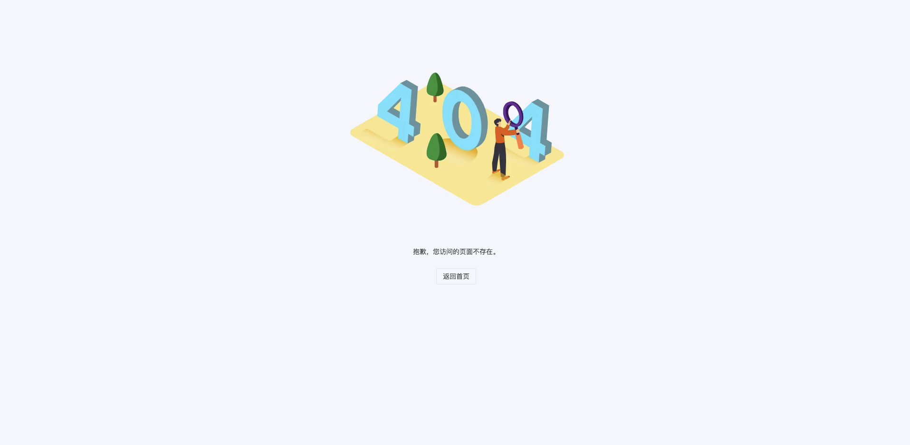

# 第十章 gin-blog-admin errorpage-log-message-profile

## 10.1 error-page



src/views/error-page/404.vue

```vue
<template>
    <AppPage>
        <NResult m-auto status="404" description="抱歉，您访问的页面不存在。">
            <template #icon>
                
            </template>
            <template #footer>
                <NButton @click="$router.replace('/')">
                    返回首页
                </NButton>
            </template>
        </NResult>
    </AppPage>
</template>


<script setup>
import { NButton, NResult } from 'naive-ui'
import AppPage from '@/components/common/AddPage.vue'
</script>

<style lang="scss" scoped></style>
```

src/views/error-page/route.js

```javascript
const Layout = () => import('@/layout/index.vue')

export default {
  name: 'ErrorPage',
  path: '/error-page',
  component: Layout,
  redirect: '/error-page/404',
  isHidden: true,
  meta: {
    title: '错误页',
    icon: 'mdi:alert-circle-outline',
    order: 99,
  },
  children: [
    {
      name: 'ERROR-404',
      path: '404',
      component: () => import('./404.vue'),
      meta: {
        title: '404',
        icon: 'tabler:error-404',
      },
    },
  ],
}
```


## 10.2 log


## 10.3 message


## 10.4 profile