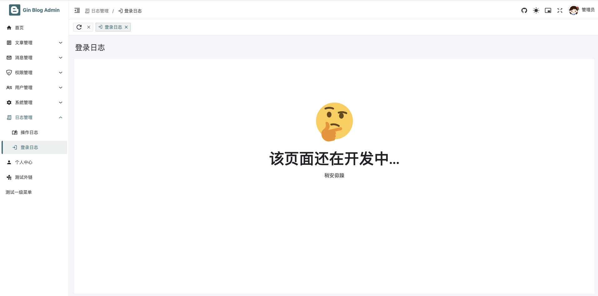

# 第十章 gin-blog-admin errorpage-log-message-profile

## 10.1 error-page


src/views/error-page/404.vue

```vue
<template>
    <AppPage>
        <NResult m-auto status="404" description="抱歉，您访问的页面不存在。">
            <template #icon>
                
            </template>
            <template #footer>
                <NButton @click="$router.replace('/')">
                    返回首页
                </NButton>
            </template>
        </NResult>
    </AppPage>
</template>


<script setup>
import { NButton, NResult } from 'naive-ui'
import AppPage from '@/components/common/AddPage.vue'
</script>

<style lang="scss" scoped></style>
```

src/views/error-page/route.js

```javascript
const Layout = () => import('@/layout/index.vue')

export default {
  name: 'ErrorPage',
  path: '/error-page',
  component: Layout,
  redirect: '/error-page/404',
  isHidden: true,
  meta: {
    title: '错误页',
    icon: 'mdi:alert-circle-outline',
    order: 99,
  },
  children: [
    {
      name: 'ERROR-404',
      path: '404',
      component: () => import('./404.vue'),
      meta: {
        title: '404',
        icon: 'tabler:error-404',
      },
    },
  ],
}
```


## 10.2 log

### 10.2.1 login



```vue
<template>
    <CommonPage>
        <NResult class="mt-30" status="404" title="该页面还在开发中..." description="稍安毋躁" size="huge" />
    </CommonPage>
</template>

<script setup>
import { NResult } from 'naive-ui'
import CommonPage from '@/components/common/CommonPage.vue'
</script>

<style lang="scss" scoped></style>
```


### 10.2.2 opration


**功能**：展示和管理操作日志，支持搜索、查看、删除（包括批量删除）等操作。

**组件**：主要用到的组件有 `CommonPage`、`CrudTable`、`CrudModal` 和 `NButton` 等。

**逻辑**：封装了 CRUD 操作的业务逻辑，通过 `useCRUD` 来处理数据的增删查改。

**细节**：包括了日志详情的展示、请求参数和返回数据的格式化、操作日志的删除确认等。

```vue
<template>
    <CommonPage title="操作日志">
        <template #action>
            <NButton type="error" :disabled="!$table?.selections.length" @click="handleDelete($table?.selections)">
                <template #icon>
                    <span class="i-material-symbols:playlist-remove" />
                </template>
                批量删除
            </NButton>
        </template>

        <CrudTable ref="$table" v-model:query-items="queryItems" :columns="columns" :get-data="api.getOperationLogs">
            <template #queryBar>
                <QueryItem label="模块名" :label-width="50">
                    <NInput v-model:value="queryItems.keyword" clearable type="text" placeholder="请输入模块名或描述"
                        @keydown.enter="$table?.handleSearch()" />
                </QueryItem>
            </template>
        </CrudTable>

        <CrudModal v-model:visible="modalVisible" title="日志详情" :show-footer="false" :loading="modalLoading"
            width="full">
            <NForm ref="modalFormRef" label-placement="left" label-align="left" :label-width="90" :model="modalForm">
                <NFormItem label="操作模块: " path="opt_module">
                    {{ modalForm.opt_module }}
                </NFormItem>
                <NFormItem label="请求地址: " path="opt_url">
                    {{ modalForm.opt_url }}
                </NFormItem>
                <NFormItem label="请求方法: " path="request_method">
                    <NTag :type="tagType(modalForm.request_method)">
                        {{ modalForm.request_method }}
                    </NTag>
                </NFormItem>
                <NFormItem label="操作类型: " path="opt_type">
                    {{ modalForm.opt_type }}
                </NFormItem>
                <NFormItem label="操作方法: " path="opt_method">
                    <NCode :code="modalForm.opt_method" code-wrap language="json" />
                </NFormItem>
                <NFormItem label="操作人员: " path="nickname">
                    {{ modalForm.nickname }}
                </NFormItem>
                <NFormItem label="请求参数: " path="request_param">
                    <NCode class="word-wrap cursor-pointer p-7"
                        :code="JSON.stringify(JSON.parse(modalForm.request_param), null, 2)" language="json"
                        @click="copyFormatCode(modalForm.request_param)" />
                </NFormItem>
                <NFormItem label="返回数据: " path="response_data">
                    <NCode class="cursor-pointer p-7"
                        :code="JSON.stringify(JSON.parse(modalForm.response_data), null, 2)" language="json"
                        @click="copyFormatCode(modalForm.response_data)" />
                </NFormItem>
            </NForm>
        </CrudModal>
    </CommonPage>
</template>


<script setup>
import { h, onMounted, ref } from 'vue'
import { NButton, NCode, NForm, NFormItem, NInput, NPopconfirm, NTag } from 'naive-ui'
import { useClipboard } from '@vueuse/core'

import CommonPage from '@/components/common/CommonPage.vue'
import QueryItem from '@/components/crud/QueryItem.vue'
import CrudModal from '@/components/crud/CrudModal.vue'
import CrudTable from '@/components/crud/CrudTable.vue'

import { formatDate } from '@/utils'  // 导入格式化日期的工具函数
import { useCRUD } from '@/composables'  // 自定义的 CRUD 组合函数
import api from '@/api'  // 导入 API 请求模块

defineOptions({ name: '操作日志' })  // 定义组件名称

// 根据请求方法返回不同类型的标签 (动态计算属性)
function tagType(type) {
    switch (type) {
        case 'GET':
            return 'info'  // GET 请求显示 info 类型
        case 'POST':
            return 'success'  // POST 请求显示 success 类型
        case 'PUT':
            return 'warning'  // PUT 请求显示 warning 类型
        case 'DELETE':
            return 'error'  // DELETE 请求显示 error 类型
        default:
            return 'info'  // 默认返回 info 类型
    }
}

const $table = ref(null)  // 定义表格的引用
const queryItems = ref({
    keyword: '',  // 定义搜索关键词
})

const {
    modalVisible,
    modalLoading,
    handleDelete,
    modalForm,
    modalFormRef,
    handleView,
} = useCRUD({
    name: '日志',  // 表示操作日志的管理
    doDelete: api.deleteOperationLogs,  // 删除操作日志的 API 请求
    refresh: () => $table.value?.handleSearch(),  // 删除后刷新表格数据
})

onMounted(() => {
    // 页面加载后自动搜索操作日志
    $table.value?.handleSearch()
})

const columns = [
    { type: 'selection', width: 20, fixed: 'left' },  // 列选择框，固定在左侧
    { title: '系统模块', key: 'opt_module', width: 70, align: 'center', ellipsis: { tooltip: true } },  // 系统模块列
    { title: '操作类型', key: 'opt_type', width: 70, align: 'center', ellipsis: { tooltip: true } },  // 操作类型列
    {
        title: '请求方法',  // 请求方法列
        key: 'request_method',
        width: 80,
        align: 'center',
        ellipsis: { tooltip: true },
        render(row) {
            // 动态渲染请求方法标签，使用 `tagType` 函数设置标签类型
            return h(
                NTag,
                { type: tagType(row.request_method) },  // 使用计算属性来决定标签类型
                { default: () => row.request_method },
            )
        },
    },
    { title: '操作人员', key: 'nickname', width: 80, align: 'center', ellipsis: { tooltip: true } },  // 操作人员列
    { title: '登录IP', key: 'ip_address', width: 80, align: 'center', ellipsis: { tooltip: true } },  // 登录 IP 列
    { title: '登录地址', key: 'ip_source', width: 80, align: 'center', ellipsis: { tooltip: true } },  // 登录地址列
    {
        title: '发布时间',  // 发布时间列
        key: 'created_at',
        align: 'center',
        width: 80,
        render(row) {
            // 格式化时间并渲染为按钮
            return h(
                NButton,
                { size: 'small', type: 'text', ghost: true },
                {
                    default: () => formatDate(row.created_at),  // 格式化时间
                    icon: () => h('i', { class: 'i-mdi:update' }),  // 显示更新时间图标
                },
            )
        },
    },
    {
        title: '操作',  // 操作列，包含查看和删除按钮
        key: 'actions',
        width: 120,
        align: 'center',
        fixed: 'right',  // 固定在右侧
        render(row) {
            // 渲染查看和删除按钮
            return [
                h(
                    NButton,
                    {
                        size: 'small',
                        quaternary: true,
                        type: 'info',
                        onClick: () => handleView(row),  // 点击查看按钮时，调用 handleView
                    },
                    {
                        default: () => '查看',
                        icon: () => h('i', { class: 'i-ic:outline-remove-red-eye' }),  // 查看图标
                    },
                ),
                h(
                    NPopconfirm,
                    { onPositiveClick: () => handleDelete([row.id], false) },  // 点击确认删除时调用 handleDelete
                    {
                        trigger: () =>
                            h(
                                NButton,
                                {
                                    size: 'small',
                                    quaternary: true,
                                    type: 'error',
                                    style: 'margin-left: 15px;',  // 删除按钮样式
                                },
                                {
                                    default: () => '删除',
                                    icon: () => h('i', { class: 'i-material-symbols:delete-outline' }),  // 删除图标
                                },
                            ),
                        default: () => h('div', {}, '确定删除该日志吗?'),  // 删除确认的提示框
                    },
                ),
            ]
        },
    },
]

function copyFormatCode(code) {
    // 使用 VueUse 的 useClipboard 来复制格式化后的 JSON 代码
    const { copy } = useClipboard()
    copy(JSON.stringify(JSON.parse(code), null, 2))  // 格式化 JSON 代码后复制
    window.$message.success('内容已复制到剪切板!')  // 提示复制成功
}

</script>

<style lang="scss" scoped></style>
```


### 10.2.3 route.js

```javascript
const Layout = () => import('@/layout/index.vue')

export default {
  name: 'Log',
  path: '/log',
  component: Layout,
  redirect: '/log/operation',
  meta: {
    title: '操作日志',
    icon: 'mdi:math-log',
    order: 6,
  },
  children: [
    {
      name: 'OperatingLog',
      path: 'operation',
      component: () => import('./operation/index.vue'),
      meta: {
        title: '操作日志',
        icon: 'mdi:book-open-page-variant-outline',
        keepAlive: true,
      },
    },
    {
      name: 'LoginLog',
      path: 'login',
      component: () => import('./login/index.vue'),
      meta: {
        title: '登录日志',
        icon: 'material-symbols:login',
        keepAlive: true,
      },
    },
  ],
}
```


## 10.3 message

### 10.3.1 comment


这段代码是一个用于评论管理的 Vue 3 组件，结合了 `Naive UI` 组件库来实现前端功能。它实现了对评论的增、删、改、查操作，主要功能包括评论的展示、查询、批量操作、评论审核状态的修改等。

主要功能分析：

1. **页面布局和结构**:
   - 使用了 `CommonPage` 组件作为页面的基础结构，并设置了页面标题为 "评论管理"。
   - 通过 `NTabs` 和 `NTabPane` 实现了评论筛选功能，可以按评论状态进行切换（全部、已通过、审核中）。
   - 使用了 `CrudTable` 组件展示评论列表，支持分页、筛选和排序功能。
2. **评论表格展示**:
   - 通过 columns 定义了表格的各列内容，包括：
     - **选择框列**：用于多选评论，支持批量操作。
     - **头像**：通过 `NImage` 显示评论者的头像，支持加载失败时显示占位图。
     - **评论人**：显示评论者的昵称，若没有昵称则显示 "无"。
     - **评论类型**：根据评论类型显示不同的标签，区分 "文章" 和 "友链"。
     - **回复对象**：显示评论的回复对象昵称，若没有则显示 "-".
     - **评论内容**：显示评论的文本内容，并支持溢出显示为 Tooltip。
     - **评论时间**：显示评论的创建时间，且使用 `NButton` 来渲染时间，点击可触发更新操作。
     - **评论状态**：通过 `NTag` 显示评论审核状态，`通过` 或 `审核中`。
     - **来源**：显示评论的来源类型，标签显示不同的颜色和名称。
     - **操作**：提供 `撤下`、`通过` 和 `删除` 操作按钮。撤下和通过按钮会修改评论的审核状态，而删除按钮会弹出确认框来删除选中的评论。
3. **批量操作**:
   - 在页面顶部的 action 插槽中，有两个批量操作按钮：
     - **批量删除**：删除选中的评论。
     - **批量通过**：将选中的评论标记为已通过。
   - 这两个按钮会根据表格中是否有选中项来决定是否可用。
4. **查询和筛选**:
   - 在表格上方有一个查询栏，使用 QueryItem 组件提供了两个筛选项：
     - **用户**：可以输入评论人的昵称来过滤评论。
     - **来源**：可以选择评论来源，支持从 `commentTypeOptions` 中选择，提供文章或友链等类型的筛选。
5. **状态切换**:
   - `handleChangeTab` 方法用于根据标签切换不同的评论状态，筛选出 "全部"、"通过" 或 "审核中" 的评论，传递 `extraParams` 作为筛选条件。

重要的逻辑处理：

- **批量删除**：点击批量删除按钮时，判断是否有选中的评论。如果有选中项，则调用 `handleDelete` 方法删除选中的评论。
- **批量通过**：点击批量通过按钮时，调用 `handleUpdateReview` 方法，将选中的评论标记为 "已通过"。
- **评论审核状态的修改**：每个评论的状态通过 `handleUpdateReview` 方法修改，直接调用 API 更新评论状态，状态变化后刷新表格数据。
- **删除操作**：点击每个评论的删除按钮时，会弹出确认框，通过 `NPopconfirm` 组件来确认是否删除。

组件使用情况：

- **`CrudTable`** 组件：这是一个自定义的表格组件，显示评论数据，并支持查询、排序、分页等功能。通过 `v-model:query-items` 和 `extra-params` 来传递查询条件。
- **`QueryItem`** 组件：用于封装每一个查询条件项（如用户昵称和来源），提供输入框和下拉框的 UI。
- **`NPopconfirm`**：这是一个确认框，删除操作时弹出确认删除的提示。
- **`NButton`、`NImage`、`NTag`** 等 Naive UI 组件：用于构建按钮、显示图片、标签等 UI 元素。

```vue
<template>
    <CommonPage title="评论管理">
        <template #action>
            <NButton type="error" :disabled="!$table?.selections.length" @click="handleDelete($table?.selections)">
                <template #icon>
                    <p class="i-material-symbols:recycling-rounded" />
                </template>
                批量删除
            </NButton>
            <NButton type="success" :disabled="!$table?.selections.length"
                @click="handleUpdateReview($table.selections, true)">
                <template #icon>
                    <p class="i-ic:outline-approval" />
                </template>
                批量通过
            </NButton>
        </template>
        <NTabs type="line" animated @update:value="handleChangeTab">
            <template #prefix>
                状态
            </template>
            <NTabPane name="all" tab="全部" />
            <NTabPane name="has_review" tab="通过" />
            <NTabPane name="not_review" tab="审核中" />
        </NTabs>
        <CrudTable ref="$table" v-model:query-items="queryItems" :extra-params="extraParams" :columns="columns"
            :get-data="api.getComments">
            <template #queryBar>
                <QueryItem label="用户" :label-width="40" :content-width="180">
                    <NInput v-model:value="queryItems.nickname" clearable type="text" placeholder="请输入用户昵称"
                        @keydown.enter="$table?.handleSearch()" />
                </QueryItem>
                <QueryItem label="来源" :label-width="40" :content-width="160">
                    <NSelect v-model:value="queryItems.type" clearable filterablec placeholder="请选择评论来源"
                        :options="commentTypeOptions" @update:value="$table?.handleSearch()" />
                </QueryItem>
            </template>
        </CrudTable>
    </CommonPage>
</template>


<script setup>
import { h, onMounted, ref } from 'vue'
import { NButton, NImage, NInput, NPopconfirm, NSelect, NTabPane, NTabs, NTag } from 'naive-ui'

import CommonPage from '@/components/common/CommonPage.vue'
import QueryItem from '@/components/crud/QueryItem.vue'
import CrudTable from '@/components/crud/CrudTable.vue'

import { commentTypeMap, commentTypeOptions } from '@/assets/config'
import { convertImgUrl, formatDate } from '@/utils'
import { useCRUD } from '@/composables'
import api from '@/api'

// 设置组件的名称
defineOptions({ name: '评论管理' })

// 组件挂载完成后，默认显示所有评论
onMounted(() => {
    handleChangeTab('all') // 默认查看全部
})

// 定义响应式引用
const $table = ref(null) // 用来引用 CrudTable 组件实例
const queryItems = ref({
    nickname: '', // 搜索条件：评论人昵称
    type: '', // 搜索条件：评论类型
})
const extraParams = ref({
    is_review: null, // 评论状态：审核中 | 通过
})

// 使用自定义的 useCRUD hook 处理删除操作
const { handleDelete } = useCRUD({
    name: '评论', // 资源名称
    doDelete: api.deleteComments, // 删除 API
    refresh: () => $table.value?.handleSearch(), // 删除后刷新表格
})

// 表格列的配置
const columns = [
    { type: 'selection', width: 15, fixed: 'left' }, // 选择框列
    {
        title: '头像', // 列标题：头像
        key: 'avatar', // 列字段：头像
        width: 40, // 列宽
        align: 'center', // 内容居中对齐
        render(row) {
            return h(NImage, {
                'height': 40,
                'imgProps': { style: { 'border-radius': '3px' } }, // 设置图片圆角
                'src': convertImgUrl(row.user?.info?.avatar), // 获取用户头像 URL
                'fallback-src': 'http://dummyimage.com/400x400', // 如果头像加载失败，显示占位图
                'show-toolbar-tooltip': true,
            })
        },
    },
    {
        title: '评论人', // 列标题：评论人
        key: 'nickname', // 列字段：评论人昵称
        width: 50, // 列宽
        align: 'center',
        ellipsis: { tooltip: true }, // 超过宽度时显示 tooltip
        render(row) {
            return h('span', row.user?.info?.nickname || '无') // 显示评论人的昵称，若为空则显示 "无"
        },
    },
    // TODO: 合理的显示评论的文章信息
    {
        title: '评论类型', // 列标题：评论类型
        key: '', // 没有直接映射的字段
        width: 50,
        align: 'center',
        render(row) {
            if (row.type === 1) { // 如果评论类型是 1，则显示 "文章"
                return [
                    h(NTag, { type: 'info' }, { default: () => '文章' }),
                ]
            }
            if (row.type === 2) { // 如果评论类型是 2，则显示 "友链"
                return h(NTag, { type: 'success' }, { default: () => '友链' })
            }
        },
    },
    {
        title: '回复对象', // 列标题：回复对象
        key: 'reply_nick_name', // 列字段：回复对象昵称
        width: 50,
        align: 'center',
        render(row) {
            return h('span', row.reply_user?.info?.nickname || '-') // 显示回复对象的昵称，若为空则显示 "-"
        },
    },
    {
        title: '评论内容', // 列标题：评论内容
        key: 'content', // 列字段：评论内容
        width: 140, // 列宽
        align: 'center',
        ellipsis: { tooltip: true }, // 超过宽度时显示 tooltip
    },
    {
        title: '评论时间', // 列标题：评论时间
        key: 'created_at', // 列字段：评论创建时间
        align: 'center',
        width: 60,
        render(row) {
            return h(
                NButton,
                { size: 'small', type: 'text', ghost: true }, // 按钮类型为文本，外观透明
                {
                    default: () => formatDate(row.created_at), // 格式化评论时间
                    icon: () => h('i', { class: 'i-mdi:update' }), // 设置图标
                },
            )
        },
    },
    {
        title: '状态', // 列标题：评论状态
        key: 'is_review', // 列字段：评论审核状态
        width: 50,
        align: 'center',
        render(row) {
            return h(
                NTag,
                { type: row.is_review ? 'success' : 'error' }, // 根据审核状态显示不同颜色
                { default: () => (row.is_review ? '通过' : '审核中') }, // 显示 "通过" 或 "审核中"
            )
        },
    },
    {
        title: '来源', // 列标题：来源
        key: 'type', // 列字段：评论类型
        width: 50,
        align: 'center',
        render(row) {
            return h(
                NTag,
                { type: commentTypeMap[row.type].tag }, // 根据评论类型显示不同的标签
                { default: () => commentTypeMap[row.type].name }, // 显示评论类型的名称
            )
        },
    },
    {
        title: '操作', // 列标题：操作
        key: 'actions', // 列字段：操作
        width: 100,
        align: 'center',
        fixed: 'right', // 操作列固定在右侧
        render(row) {
            return [
                // 根据评论审核状态显示不同的按钮：通过 / 撤下
                row.is_review
                    ? h(
                        NButton,
                        {
                            size: 'small',
                            type: 'warning',
                            style: 'margin-left: 15px;', // 按钮间隔
                            onClick: () => handleUpdateReview([row.id], false), // 点击撤下按钮
                        },
                        {
                            default: () => '撤下', // 按钮文本
                            icon: () => h('i', { class: 'i-mi:circle-error' }), // 图标
                        },
                    )
                    : h(
                        NButton,
                        {
                            size: 'small',
                            type: 'success',
                            style: 'margin-left: 15px;', // 按钮间隔
                            onClick: () => handleUpdateReview([row.id], true), // 点击通过按钮
                        },
                        {
                            default: () => '通过',
                            icon: () => h('i', { class: 'i-mi:circle-check' }),
                        },
                    ),
                // 删除操作，点击确认删除
                h(
                    NPopconfirm,
                    { onPositiveClick: () => handleDelete([row.id], false) }, // 点击删除确认按钮时触发删除
                    {
                        trigger: () =>
                            h(
                                NButton,
                                { size: 'small', type: 'error', style: 'margin-left: 15px;' },
                                { default: () => '删除', icon: () => h('i', { class: 'i-material-symbols:delete-outline' }) },
                            ),
                        default: () => h('div', {}, '确定删除该条评论吗?'), // 删除确认提示文本
                    },
                ),
            ]
        },
    },
]

// 修改评论审核状态
async function handleUpdateReview(ids, is_review) {
    if (!ids.length) {
        window.$message.info('请选择要审核的数据') // 如果没有选择评论，弹出提示
        return
    }
    // 调用 API 更新评论审核状态
    await api.updateCommentReview(ids, is_review)
    // 提示成功或失败
    window.$message?.success(is_review ? '审核成功' : '撤下成功')
    // 刷新表格
    $table.value?.handleSearch()
}

// 切换标签页，筛选不同的评论状态：全部、通过、审核中
function handleChangeTab(value) {
    switch (value) {
        case 'all':
            extraParams.value.is_review = null // 查看全部评论
            break
        case 'has_review': // 通过
            extraParams.value.is_review = true
            break
        case 'not_review': // 审核中
            extraParams.value.is_review = false
            break
    }
    // 切换标签后刷新表格
    $table.value?.handleSearch()
}

</script>

<style lang="scss" scoped></style>
```


### 10.3.2 leave-msg


这段代码是一个用于管理留言内容的 Vue 3 组件，主要实现了留言的展示、审核、删除、批量操作等功能。它结合了 `Naive UI` 组件库来构建界面，并使用了自定义的 `useCRUD` hook 来简化对 API 的操作。

1. **页面结构**：
   - `CommonPage` 组件作为页面的外层容器，提供统一的布局结构和页面标题 "留言管理"。
   - 页面顶部有两个操作按钮：批量删除和批量通过，分别用于删除和审核通过选中的留言。
   - 使用 `NTabs` 和 `NTabPane` 来显示不同状态的留言，包括全部、已通过和审核中的留言。
   - `CrudTable` 组件用于展示留言列表，支持查询、筛选和分页等功能。
2. **表格显示**：
   - CrudTable 中使用了 columns 定义表格的列，包括：
     - **选择框列**：支持批量操作，选择多个留言。
     - **头像**：使用 `NImage` 显示留言者头像，若加载失败则显示占位图。
     - **留言人昵称**：显示留言人的昵称，使用 `ellipsis` 属性在内容过长时显示 tooltip。
     - **留言内容**：显示留言的具体内容，列宽为 120px。
     - **IP 地址** 和 **IP 来源**：显示留言者的 IP 地址及其来源。
     - **留言时间**：使用 `NButton` 渲染留言的创建时间，点击后可以查看时间更新。
     - **状态**：显示留言的审核状态（通过或审核中），使用 `NTag` 显示不同的颜色。
     - **操作**：根据留言的审核状态提供 "通过" 或 "撤下" 操作按钮，并提供删除按钮，点击删除时会弹出确认框。
3. **批量操作**：
   - 在页面顶部的 action插槽中，有两个批量操作按钮：
     - **批量删除**：点击后会删除选中的留言。
     - **批量通过**：点击后会将选中的留言标记为已通过。
   - 两个按钮的可用性取决于是否有选中的留言。
4. **查询和筛选**：
   - 在 `CrudTable` 组件上方有一个查询栏，用于通过留言者的昵称（`nickname`）进行搜索，输入内容后按 `Enter` 键可以触发表格的查询。
   - 通过 `NTabs` 实现留言状态的筛选，用户可以选择查看 "全部"、"已通过" 或 "审核中" 的留言。
5. **状态切换**：
   - handleChangeTab 函数用于切换标签页时更新筛选条件。通过 extraParams 来控制不同状态下的留言显示：
     - **全部**：显示所有留言。
     - **已通过**：显示审核通过的留言。
     - **审核中**：显示审核中的留言。

重要的逻辑处理：

1. **批量删除操作**：
   - 在点击批量删除按钮时，先判断是否有选中的留言。如果有选中项，则调用 `handleDelete` 方法批量删除这些留言。
2. **批量审核通过**：
   - 在点击批量通过按钮时，调用 `handleUpdateReview` 方法，批量将选中的留言标记为 "通过"。
3. **留言审核状态的修改**：
   - `handleUpdateReview` 方法用于单条或批量修改留言的审核状态。通过调用 API 更新留言状态，并在操作完成后刷新表格。
   - 在每个操作按钮（"通过"、"撤下"）上，依据留言当前的状态来决定按钮的显示和点击后的行为。
4. **删除操作**：
   - 每条留言的操作列提供删除按钮。点击删除按钮时，会弹出确认框，用户确认后会触发删除操作。
5. **IP 来源渲染**：
   - `ip_source` 是可选字段，若没有值则显示 "未知"。
6. **表格内容溢出处理**：
   - 使用 `ellipsis: { tooltip: true }` 使得超长内容（如 IP 地址、留言内容）可以通过 tooltip 显示完全内容。

```vue
<template>
    <CommonPage title="留言管理">
        <template #action>
            <NButton type="error" :disabled="!$table?.selections.length" @click="handleDelete($table?.selections)">
                <template #icon>
                    <p class="i-material-symbols:recycling-rounded" />
                </template>
                批量删除
            </NButton>
            <NButton type="success" :disabled="!$table?.selections.length"
                @click="handleUpdateReview($table.selections, true)">
                <template #icon>
                    <p class="i-ic:outline-approval" />
                </template>
                批量通过
            </NButton>
        </template>
        <NTabs type="line" animated @update:value="handleChangeTab">
            <template #prefix>
                状态
            </template>
            <NTabPane name="all" tab="全部" />
            <NTabPane name="has_review" tab="通过" />
            <NTabPane name="not_review" tab="审核中" />
        </NTabs>
        <CrudTable ref="$table" v-model:query-items="queryItems" :extra-params="extraParams" :columns="columns"
            :get-data="api.getMessages">
            <template #queryBar>
                <QueryItem label="用户" :label-width="40" :content-width="180">
                    <NInput v-model:value="queryItems.nickname" clearable type="text" placeholder="请输入用户昵称"
                        @keydown.enter=" $table?.handleSearch()" />
                </QueryItem>
            </template>
        </CrudTable>
    </CommonPage>
</template>


<script setup>
import { h, onMounted, ref } from 'vue'
import { NButton, NImage, NInput, NPopconfirm, NTabPane, NTabs, NTag } from 'naive-ui'

import CommonPage from '@/components/common/CommonPage.vue'
import QueryItem from '@/components/crud/QueryItem.vue'
import CrudTable from '@/components/crud/CrudTable.vue'

import { convertImgUrl, formatDate } from '@/utils'
import { useCRUD } from '@/composables'
import api from '@/api'

// 设置组件的名称
defineOptions({ name: '留言管理' })

// 组件挂载完成后，默认显示所有留言
onMounted(() => {
    handleChangeTab('all') // 默认查看全部
})

// 定义响应式引用
const $table = ref(null) // 用来引用 CrudTable 组件实例
const queryItems = ref({
    nickname: '', // 搜索条件：留言人昵称
})
const extraParams = ref({
    is_review: null, // 评论状态：审核中 | 通过
})

// 使用自定义的 useCRUD hook 处理删除操作
const { handleDelete } = useCRUD({
    name: '留言', // 资源名称
    doDelete: api.deleteMessages, // 删除 API
    refresh: () => $table.value?.handleSearch(), // 删除后刷新表格
})

// 表格列的配置
const columns = [
    { type: 'selection', width: 15, fixed: 'left' }, // 选择框列
    {
        title: '头像', // 列标题：头像
        key: 'avatar', // 列字段：头像
        width: 40, // 列宽
        align: 'center', // 内容居中对齐
        render(row) {
            return h(NImage, {
                'height': 40,
                'imgProps': { style: { 'border-radius': '3px' } }, // 设置图片圆角
                'src': convertImgUrl(row.avatar), // 获取头像 URL
                'fallback-src': 'http://dummyimage.com/400x400', // 如果头像加载失败，显示占位图
                'show-toolbar-tooltip': true,
            })
        },
    },
    {
        title: '留言人',
        key: 'nickname',
        width: 60,
        align: 'center',
        ellipsis: { tooltip: true }, // 超过宽度时显示 tooltip
    },
    {
        title: '留言内容',
        key: 'content',
        width: 120,
        align: 'center',
    },
    {
        title: 'IP 地址',
        key: 'ip_address',
        width: 70,
        align: 'center',
        ellipsis: { tooltip: true },
    },
    {
        title: 'IP 来源',
        key: 'ip_source',
        width: 70,
        align: 'center',
        ellipsis: { tooltip: true },
        render(row) {
            return h('span', row.ip_source || '未知') // 显示 IP 来源，若为空则显示 "未知"
        },
    },
    {
        title: '留言时间',
        key: 'created_at',
        align: 'center',
        width: 80,
        render(row) {
            return h(
                NButton,
                { size: 'small', type: 'text', ghost: true },
                {
                    default: () => formatDate(row.created_at), // 格式化时间
                    icon: () => h('i', { class: 'i-mdi:update' }), // 设置图标
                },
            )
        },
    },
    {
        title: '状态',
        key: 'is_review',
        width: 50,
        align: 'center',
        render(row) {
            return h(
                NTag,
                { type: row.is_review ? 'success' : 'error' }, // 根据状态显示不同颜色
                { default: () => (row.is_review ? '通过' : '审核中') },
            )
        },
    },
    {
        title: '操作',
        key: 'actions',
        width: 100,
        align: 'center',
        fixed: 'right', // 操作列固定在右侧
        render(row) {
            return [
                // 根据评论状态显示不同的按钮：通过 / 撤下
                row.is_review
                    ? h(
                        NButton,
                        {
                            size: 'small',
                            type: 'warning',
                            onClick: () => handleUpdateReview([row.id], false), // 点击撤下按钮
                        },
                        {
                            default: () => '撤下', // 按钮文本
                            icon: () => h('i', { class: 'i-mi:circle-error' }), // 图标
                        },
                    )
                    : h(
                        NButton,
                        {
                            size: 'small',
                            type: 'success',
                            style: 'margin-left: 15px;', // 按钮间隔
                            onClick: () => handleUpdateReview([row.id], true), // 点击通过按钮
                        },
                        {
                            default: () => '通过',
                            icon: () => h('i', { class: 'i-mi:circle-check' }),
                        },
                    ),
                // 删除操作，点击确认删除
                h(
                    NPopconfirm,
                    { onPositiveClick: () => handleDelete([row.id], false) }, // 点击删除确认按钮时触发删除
                    {
                        trigger: () =>
                            h(
                                NButton,
                                { size: 'small', type: 'error', style: 'margin-left: 15px;' },
                                { default: () => '删除', icon: () => h('i', { class: 'i-material-symbols:delete-outline' }) },
                            ),
                        default: () => h('div', {}, '确定删除该条留言吗?'), // 删除确认提示文本
                    },
                ),
            ]
        },
    },
]

// 修改留言审核状态
async function handleUpdateReview(ids, is_review) {
    if (!ids.length) {
        $message.info('请选择要审核的数据') // 如果没有选择留言，弹出提示
        return
    }

    // 调用 API 更新留言审核状态
    await api.updateMessageReview(ids, is_review)
    // 提示成功或失败
    $message?.success(is_review ? '审核成功' : '撤下成功')
    // 刷新表格
    $table.value?.handleSearch()
}

// 切换标签页，筛选不同的留言状态：全部、通过、审核中
function handleChangeTab(value) {
    switch (value) {
        case 'all':
            extraParams.value.is_review = null // 查看全部留言
            break
        case 'has_review': // 通过
            extraParams.value.is_review = 1
            break
        case 'not_review': // 审核中
            extraParams.value.is_review = 0
            break
    }
    // 切换标签后刷新表格
    $table.value?.handleSearch()
}
</script>

<style lang="scss" scoped></style>
```


### 10.3.3 route.js

```javascript
const Layout = () => import('@/layout/index.vue')

export default {
  name: 'Message',
  path: '/message',
  component: Layout,
  redirect: '/message/comment',
  meta: {
    title: '消息管理',
    icon: 'ic:twotone-email',
    order: 3,
    // role: ['admin'],
    // requireAuth: true,
  },
  children: [
    {
      name: 'CommentList',
      path: 'comment',
      component: () => import('./comment/index.vue'),
      meta: {
        title: '评论管理',
        icon: 'ic:twotone-comment',
        keepAlive: true,
      },
    },
    {
      name: 'LeaveMsgList',
      path: 'leave-msg',
      component: () => import('./leave-msg/index.vue'),
      meta: {
        title: '留言管理',
        icon: 'ic:twotone-message',
        keepAlive: true,
      },
    },
  ],
}
```


## 10.4 profile


**这段代码实现了一个用户设置页面，包含两个功能模块：修改用户信息（如昵称、简介、头像、个人网站）和修改密码。页面使用了 `Naive UI` 组件库，结合 `Vue 3` 的响应式 API 和 `store` 状态管理。以下是对这段代码的详细分析。**

1. **结构与组件**

- **`CommonPage`**: 页面结构组件，包裹整个页面内容。在这里通过 `:show-header="false"` 设置页面不显示顶部导航栏。
- **`NTabs` 和 `NTabPane`**: 选项卡组件，允许用户在"修改信息"和"修改密码"之间切换。
- **`UploadOne`**: 自定义组件，用于上传用户头像，绑定到 `infoForm.avatar`。
- **`NForm`, `NFormItem`, `NInput`, `NButton`**: 这些是用于构建表单的 `Naive UI` 组件，包括表单项、输入框和按钮。
- **`useUserStore`**: 引用了 `store` 中的用户数据，用于获取和更新用户信息。

2. **用户信息表单（修改信息）**

用户信息表单包括以下内容：

- **头像**：通过 `UploadOne` 组件上传用户头像，绑定到 `infoForm.avatar`。
- **昵称**、**个人简介**、**个人网站**：通过 `NInput` 组件提供文本输入框，分别绑定到 `infoForm.nickname`、`infoForm.intro` 和 `infoForm.website`。
- **提交按钮**：点击按钮触发 `updateProfile` 函数，更新用户信息。

**表单验证**:

- `infoFormRules` 定义了昵称字段的验证规则，确保用户输入了昵称。
- `validate` 方法在提交时校验表单，若没有错误，则调用 `api.updateCurrent` 更新用户信息。

3. **修改密码表单**

修改密码表单包括以下字段：

- **旧密码**、**新密码**、**确认密码**：通过 `NInput` 组件提供密码输入框，密码输入框会在按下鼠标时显示密码内容。
- **提交按钮**：点击按钮触发 `updatePassword` 函数，更新密码。

**表单验证**:

- passwordFormRules 定义了旧密码、新密码、确认密码的验证规则。
  - 旧密码和新密码是必填字段。
  - 确认密码需要与新密码一致（通过 `validatePasswordSame` 和 `validatePasswordStartWith` 进行校验）。

**密码一致性验证**:

- `validatePasswordStartWith`: 校验新密码的前缀是否与确认密码一致，并确保长度匹配。
- `validatePasswordSame`: 校验新密码与确认密码是否完全相同。

------

------

**总而言之，功能实现**

- 修改个人信息:
  - 页面加载时从 `userStore` 获取并显示用户信息。
  - 用户修改信息后，点击 "修改" 按钮，触发 `updateProfile` 函数，通过 API 更新用户信息，并显示提示消息。
- 修改密码:
  - 用户输入旧密码、新密码和确认密码，点击 "修改" 按钮，触发 `updatePassword` 函数。
  - 表单会校验新密码和确认密码是否一致，并通过 API 更新密码。

```vue
<template>
    <CommonPage :show-header="false">
        <NTabs type="line" animated>
            <NTabPane name="website" tab="修改信息">
                <div class="m-7 flex items-center">
                    <div class="mr-7 w-50">
                        <UploadOne v-model:preview="infoForm.avatar" :width="130" />
                    </div>
                    <NForm ref="infoFormRef" label-placement="left" label-align="left" label-width="100"
                        :model="infoForm" :rules="infoFormRules" class="w-80">
                        <NFormItem label="昵称" path="nickname">
                            <NInput v-model:value="infoForm.nickname" type="text" placeholder="请填写昵称" />
                        </NFormItem>
                        <NFormItem label="个人简介" path="intro">
                            <NInput v-model:value="infoForm.intro" type="text" placeholder="请填写个人简介" />
                        </NFormItem>
                        <NFormItem label="个人网站" path="website">
                            <NInput v-model:value="infoForm.website" type="text" placeholder="请填写个人网站" />
                        </NFormItem>
                        <NButton type="primary" @click="updateProfile">
                            修改
                        </NButton>
                    </NForm>
                </div>
            </NTabPane>
            <NTabPane name="contact" tab="修改密码">
                <NForm ref="passwordFormRef" label-placement="left" label-align="left" :model="passwordForm"
                    label-width="100" :rules="passwordFormRules" class="m-[30px] w-[400px]">
                    <NFormItem label="旧密码" path="old_password">
                        <NInput v-model:value="passwordForm.old_password" type="password" show-password-on="mousedown"
                            placeholder="请输入旧密码" />
                    </NFormItem>
                    <NFormItem label="新密码" path="new_password">
                        <NInput v-model:value="passwordForm.new_password" :disabled="!passwordForm.old_password"
                            type="password" show-password-on="mousedown" placeholder="请输入新密码" />
                    </NFormItem>
                    <NFormItem label="确认密码" path="confirm_password">
                        <NInput v-model:value="passwordForm.confirm_password" :disabled="!passwordForm.new_password"
                            type="password" show-password-on="mousedown" placeholder="请再次输入新密码" />
                    </NFormItem>
                    <NButton type="primary" @click="updatePassword">
                        修改
                    </NButton>
                </NForm>
            </NTabPane>
        </NTabs>
    </CommonPage>
</template>


<script setup>
import { onMounted, ref } from 'vue'
import { NButton, NForm, NFormItem, NInput, NTabPane, NTabs } from 'naive-ui'

import CommonPage from '@/components/common/CommonPage.vue'
import UploadOne from '@/components/UploadOne.vue' // 用户头像上传组件
import { useUserStore } from '@/store' // 引入用户状态管理的 store
import api from '@/api' // API 请求模块

// 获取用户状态管理 store 实例
const userStore = useUserStore()

// 个人信息表单相关的引用和初始数据
const infoFormRef = ref(null) // 用于引用表单组件
const infoForm = ref({
    avatar: userStore.avatar, // 头像
    nickname: userStore.nickname, // 昵称
    intro: userStore.intro, // 个性签名
    website: userStore.website, // 个人网站
})

// 在组件挂载时，获取用户信息并更新表单
onMounted(async () => {
    // 从用户 store 获取最新的用户信息
    await userStore.getUserInfo()
    // 更新表单的初始数据
    infoForm.value = {
        avatar: userStore.avatar,
        nickname: userStore.nickname,
        intro: userStore.intro,
        website: userStore.website,
    }
})

// 更新个人信息函数
async function updateProfile() {
    // 校验表单
    infoFormRef.value?.validate(async (err) => {
        if (!err) { // 如果表单验证没有错误
            // 调用 API 更新当前用户的个人信息
            await api.updateCurrent(infoForm.value)
            $message.success('更新成功!') // 显示成功消息
            userStore.getUserInfo() // 更新用户信息
        }
    })
}

// 个人信息表单验证规则
const infoFormRules = {
    nickname: [
        {
            required: true, // 昵称是必填字段
            message: '请输入昵称', // 错误提示消息
            trigger: ['input', 'blur', 'change'], // 触发验证的事件
        },
    ],
}

// 修改密码相关的表单引用和数据
const passwordFormRef = ref(null) // 用于引用密码修改表单组件
const passwordForm = ref({
    old_password: '', // 旧密码
    new_password: '', // 新密码
    confirm_password: '', // 确认密码
})

// 修改密码的处理函数
function updatePassword() {
    // 校验密码表单
    passwordFormRef.value?.validate(async (err) => {
        if (!err) { // 如果表单验证没有错误
            // 调用 API 更新当前用户密码
            await api.updateCurrentPassword(passwordForm.value)
            $message.success('修改成功!') // 显示成功消息
        }
    })
}

// 密码表单验证规则
const passwordFormRules = {
    old_password: [
        {
            required: true, // 旧密码是必填字段
            message: '请输入旧密码',
            trigger: ['input', 'blur', 'change'], // 触发验证的事件
        },
    ],
    new_password: [
        {
            required: true, // 新密码是必填字段
            message: '请输入新密码',
            trigger: ['input', 'blur', 'change'],
        },
    ],
    confirm_password: [
        {
            required: true, // 确认密码是必填字段
            message: '请再次输入密码',
            trigger: ['input', 'blur'], // 触发验证的事件
        },
        {
            // 校验确认密码与新密码是否一致
            validator: validatePasswordStartWith,
            message: '两次密码输入不一致',
            trigger: 'input', // 触发事件为输入时
        },
        {
            // 校验确认密码与新密码是否一致
            validator: validatePasswordSame,
            message: '两次密码输入不一致',
            trigger: ['blur', 'password-input'], // 触发事件为失焦和密码输入时
        },
    ],
}

// 校验新密码是否和确认密码一致（密码的起始部分是否匹配，保证长度一致）
function validatePasswordStartWith(rule, value) {
    return !!passwordForm.value.new_password && passwordForm.value.new_password.startsWith(value) && passwordForm.value.new_password.length >= value.length
}

// 校验确认密码与新密码是否完全一致
function validatePasswordSame(rule, value) {
    return value === passwordForm.value.new_password
}

</script>

<style lang="scss" scoped></style>
```

```javascript
const Layout = () => import('@/layout/index.vue')

export default {
  name: 'Profile',
  path: '/',
  component: Layout,
  redirect: '/profile',
  meta: {
    order: 8,
  },
  isCatalogue: true,
  children: [
    {
      name: 'Profile',
      path: '/profile',
      component: () => import('./index.vue'),
      meta: {
        title: '个人中心',
        icon: 'mdi:account',
        order: 0,
      },
    },
  ],
}
```

