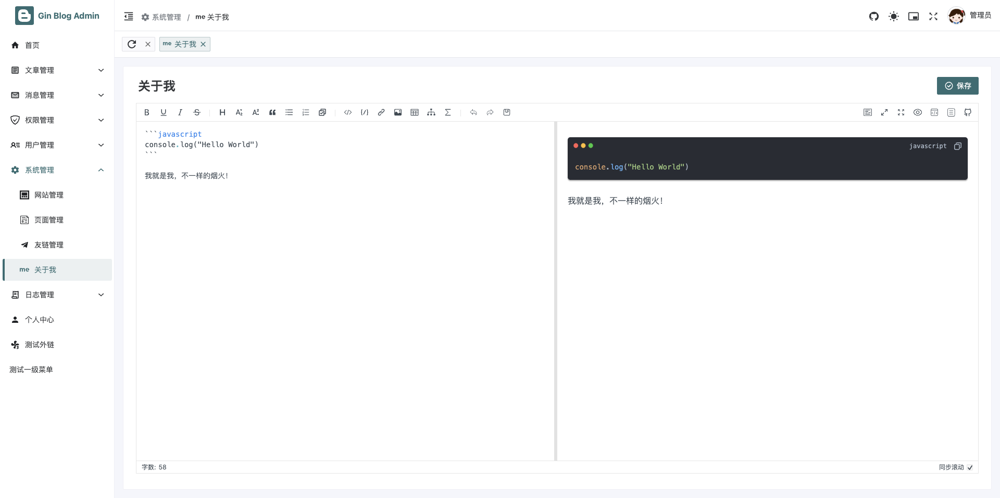
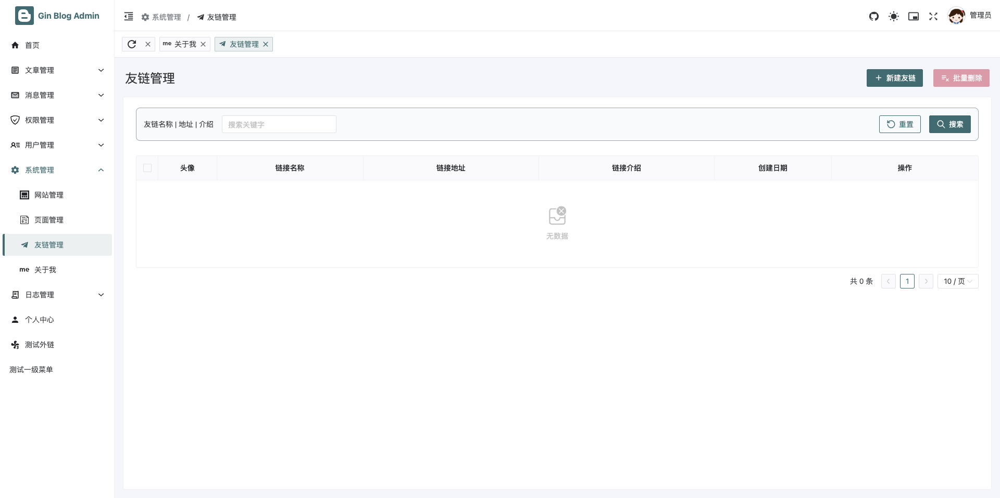
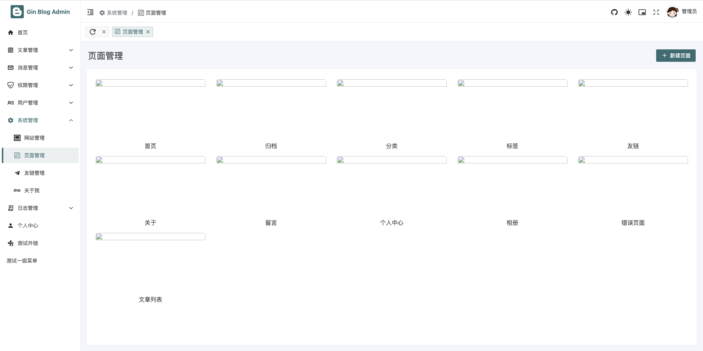
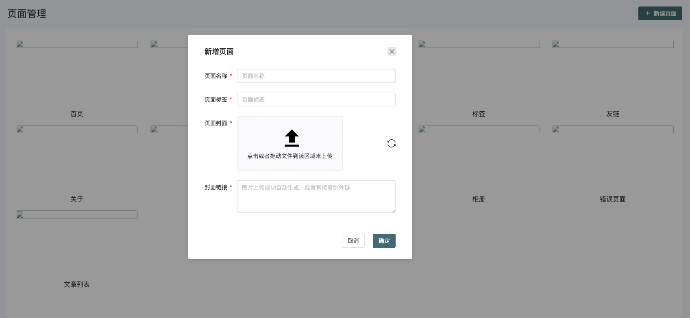
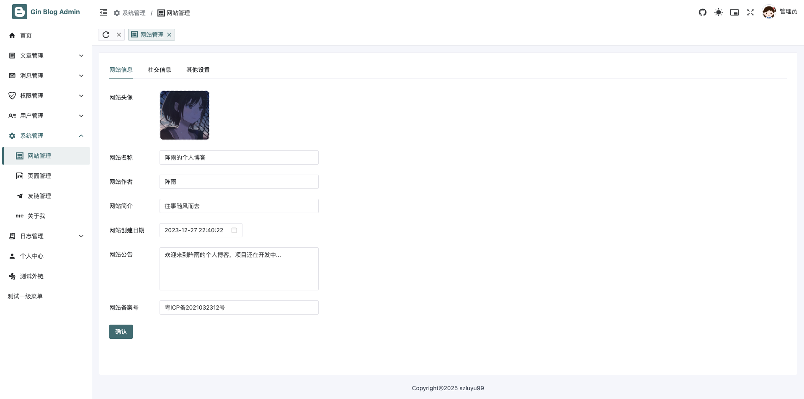
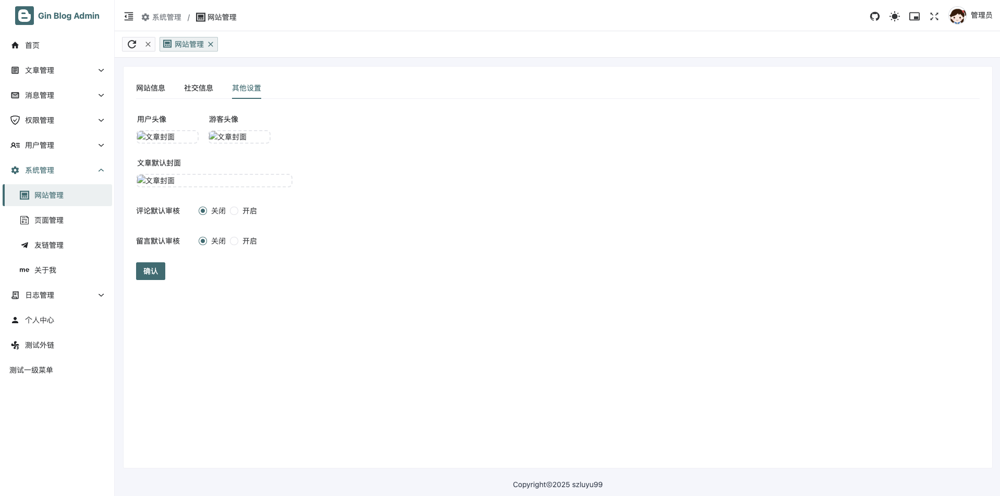

# 第十一章 gin-blog-admin setting-test-user

## 11.1 setting

### 11.1.1 about/index.vue



**src/views/setting/about/index.vue**

这个组件实现了一个简单的“关于我”页面的编辑和保存功能，使用了以下技术：

- **Markdown 编辑器 (`MdEditor`)**: 提供了强大的文本编辑功能，支持 Markdown 格式。
- **响应式编程 (`ref`)**: 利用 Vue 3 的 `ref` 来存储和管理数据。
- **Naive UI**: 用于实现用户界面组件（如按钮），并提供了 `loading` 状态来防止重复点击。
- **API 通信**: 通过 `api.getAbout` 获取数据，通过 `api.updateAbout` 更新数据。
- **页面设计**: 通过 `CommonPage` 组件包裹了页面的结构，简洁且易于扩展。

这个组件能够提供一个简单而有效的编辑界面，供用户修改“关于我”的内容。

```vue
<template>
    <CommonPage :show-header="false">
        <div class="mb-4 flex items-center justify-between">
            <div class="mx-1 text-2xl font-bold">
                关于我
            </div>
            <NButton type="primary" :loading="btnLoading" @click="handleSave">
                <template #icon>
                    <p v-if="!btnLoading" class="i-line-md:confirm-circle" />
                </template>
                保存
            </NButton>
        </div>
        <!-- TODO: 文件上传封装 -->
        <MdEditor v-model="aboutContent" style="height: calc(100vh - 245px)" />
    </CommonPage>
</template>


<script setup>
import { onMounted, ref } from 'vue'  // 导入 Vue 3 的响应式 API
import { NButton } from 'naive-ui'   // 导入 Naive UI 的按钮组件

// 导入 Markdown 编辑器并引入相关样式
import { MdEditor } from 'md-editor-v3'
import 'md-editor-v3/lib/style.css'

// 导入自定义的公共页面组件
import CommonPage from '@/components/common/CommonPage.vue'

// 导入 API 请求模块
import api from '@/api'

// 设置组件名称为 "关于我"
defineOptions({ name: '关于我' })

// 定义响应式数据
const aboutContent = ref('')  // 用于存储 "关于我" 页面内容（Markdown 格式）
const btnLoading = ref(false)  // 用于控制保存按钮的加载状态（防止多次点击）

// 页面加载时获取关于我的内容
onMounted(async () => {
    // 调用 API 获取 "关于我" 页面内容
    const resp = await api.getAbout()
    // 将返回的数据赋值给 aboutContent（页面内容）
    aboutContent.value = resp.data
})

// 保存编辑内容的处理函数
async function handleSave() {
    try {
        // 设置按钮为加载状态，防止重复点击
        btnLoading.value = true
        // 调用 API 更新关于我页面的内容，传入编辑后的 content
        await api.updateAbout({ content: aboutContent.value })
        // 弹出成功消息
        window.$message.success('更新成功')
    }
    finally {
        // 不管请求成功或失败，都将按钮的加载状态设置为 false
        btnLoading.value = false
    }
}

</script>

<style lang="scss" scoped>
.md-preview {

    ul,
    ol {
        list-style: revert;
    }
}
</style>
```


### 11.1.2 link/index.vue



```vue
<template>
    <CommonPage title="友链管理">
        <template #action>
            <NButton type="primary" @click="handleAdd">
                <template #icon>
                    <p class="i-material-symbols:add" />
                </template>
                新建友链
            </NButton>
            <NButton type="error" :disabled="!$table?.selections.length" @click="handleDelete($table?.selections)">
                <template #icon>
                    <p class="i-material-symbols:playlist-remove" />
                </template>
                批量删除
            </NButton>
        </template>

        <CrudTable ref="$table" v-model:query-items="queryItems" :columns="columns" :get-data="api.getLinks">
            <template #queryBar>
                <QueryItem label="友链名称 | 地址 | 介绍" :label-width="150">
                    <NInput v-model:value="queryItems.keyword" clearable type="text" placeholder="搜索关键字"
                        @keydown.enter="$table?.handleSearch()" />
                </QueryItem>
            </template>
        </CrudTable>

        <CrudModal v-model:visible="modalVisible" :title="modalTitle" :loading="modalLoading" @save="handleSave">
            <NForm ref="modalFormRef" label-placement="left" label-align="left" :label-width="80" :model="modalForm">
                <NFormItem label="链接名称" path="name"
                    :rule="{ required: true, message: '请输入友链名称', trigger: ['input', 'blur'] }">
                    <NInput v-model:value="modalForm.name" placeholder="请输入友链名称" />
                </NFormItem>
                <NFormItem label="链接头像" path="avatar"
                    :rule="{ required: true, message: '请输入友链头像', trigger: ['input', 'blur'] }">
                    <NInput v-model:value="modalForm.avatar" placeholder="请输入链接头像" />
                </NFormItem>
                <NFormItem label="链接地址" path="address"
                    :rule="{ required: true, message: '请输入友链地址', trigger: ['input', 'blur'] }">
                    <NInput v-model:value="modalForm.address" placeholder="请输入链接地址" />
                </NFormItem>
                <NFormItem label="链接介绍" path="intro"
                    :rule="{ required: true, message: '请输入友链介绍', trigger: ['input', 'blur'] }">
                    <NInput v-model:value="modalForm.intro" placeholder="请输入友链地址" />
                </NFormItem>
            </NForm>
        </CrudModal>
    </CommonPage>
</template>


<script setup>
import { h, onMounted, ref } from 'vue'
import { useClipboard } from '@vueuse/core'
import { NButton, NForm, NFormItem, NImage, NInput, NPopconfirm } from 'naive-ui'

import CommonPage from '@/components/common/CommonPage.vue'
import QueryItem from '@/components/crud/QueryItem.vue'
import CrudModal from '@/components/crud/CrudModal.vue'
import CrudTable from '@/components/crud/CrudTable.vue'

import { formatDate } from '@/utils'
import { useCRUD } from '@/composables'
import api from '@/api'

defineOptions({ name: '友链管理' })

const $table = ref(null)
const queryItems = ref({
    keyword: '', // 友链名称 | 地址 | 介绍
})

const {
    modalVisible,
    modalTitle,
    modalLoading,
    handleAdd,
    handleDelete,
    handleEdit,
    handleSave,
    modalForm,
    modalFormRef,
} = useCRUD({
    name: '友链',
    initForm: {},
    doCreate: api.saveOrUpdateLink,
    doDelete: api.deleteLinks,
    doUpdate: api.saveOrUpdateLink,
    refresh: () => $table.value?.handleSearch(),
})

onMounted(() => {
    $table.value?.handleSearch()
})

const columns = [
    { type: 'selection', width: 15, fixed: 'left' },
    {
        title: '头像',
        key: 'avatar',
        width: 40,
        align: 'center',
        render(row) {
            return h(NImage, {
                'height': 40,
                'imgProps': { style: { 'border-radius': '3px' } },
                'src': row.avatar,
                'fallback-src': 'http://dummyimage.com/400x400', // 加载失败
                'show-toolbar-tooltip': true,
            })
        },
    },
    {
        title: '链接名称',
        key: 'name',
        width: 100,
        align: 'center',
        ellipsis: { tooltip: true },
    },
    {
        title: '链接地址',
        key: 'address',
        width: 120,
        align: 'center',
        ellipsis: { tooltip: true },
        render(row) {
            return h(
                'a',
                {
                    class: 'hover:underline hover:underline-blue-500 hover:underline-2 hover:underline-solid hover:underline-offset-4 cursor-pointer',
                    // href: row.address,
                    // target: '_blank',
                    onClick: () => {
                        const { copy } = useClipboard()
                        copy(row.address)
                        $message.info('链接已经复制到剪切板!')
                    },
                },
                row.address,
            )
        },
    },
    {
        title: '链接介绍',
        key: 'intro',
        width: 120,
        align: 'center',
        ellipsis: { tooltip: true },
    },
    {
        title: '创建日期',
        key: 'created_at',
        width: 80,
        align: 'center',
        render(row) {
            return h(
                NButton,
                { size: 'small', type: 'text', ghost: true },
                {
                    default: () => formatDate(row.created_at),
                    icon: () => h('i', { class: 'i-mdi:clock-time-three-outline' }),
                },
            )
        },
    },
    {
        title: '操作',
        key: 'actions',
        width: 100,
        align: 'center',
        fixed: 'right',
        render(row) {
            return [
                h(
                    NButton,
                    {
                        size: 'small',
                        type: 'primary',
                        onClick: () => handleEdit(row),
                    },
                    { default: () => '编辑', icon: () => h('i', { class: 'i-material-symbols:edit-outline' }) },
                ),
                h(
                    NPopconfirm,
                    { onPositiveClick: () => handleDelete([row.id], false) },
                    {
                        trigger: () => h(
                            NButton,
                            { size: 'small', type: 'error', style: 'margin-left: 15px;' },
                            { default: () => '删除', icon: () => h('i', { class: 'i-material-symbols:delete-outline' }) },
                        ),
                        default: () => h('div', {}, '确定删除该分类吗?'),
                    },
                ),
            ]
        },
    },
]
</script>

<style lang="scss" scoped></style>
```


### 11.1.3 page/index.vue





**这段代码展示了一个 Vue 3 单文件组件（SFC），实现了一个 "页面管理" 的功能。整个组件主要分为以下几个部分：模板（`<template>`）、脚本（`<script setup>`）、样式（`<style scoped>`）。接下来我会逐一分析这些部分：**

1. **模板（`<template>` 部分）**

在模板部分，使用了 `CommonPage` 作为页面的主要容器，并且通过具名插槽 (`#action`) 放置了一个新建页面的按钮。

- **`<CommonPage>`**：这是一个通用的页面组件，接收 `title="页面管理"`，表示该页面的标题是“页面管理”。
- **`<template #action>`**：这个插槽用于添加一个操作按钮，即“新建页面”按钮。按钮中包含了一个图标（`i-material-symbols:add`），点击该按钮时会触发 `handleAdd` 方法，表示点击按钮后会执行新建页面的操作。
- **页面列表展示**：通过 `v-for` 循环渲染 `pageList` 中的每一项。每个页面展示了：
  - **封面图片**：使用 `NImage` 组件渲染页面封面图，`convertImgUrl(page.cover)` 用于转换图片的 URL 地址。
  - **页面名称**：显示 `page.name`，即页面的名称。
  - **操作下拉菜单**：使用 `NDropdown` 展示编辑和删除的操作项。点击下拉菜单时会触发 `handleSelect` 方法，根据选择的操作（`edit` 或 `delete`）执行不同的动作。
- **`CrudModal`**：这是一个通用的 CRUD 操作模态框，显示页面的编辑表单。模态框内包括：
  - **页面名称**、**页面标签**、**封面图片**、**封面链接** 四个表单项。
  - 每个表单项使用 `NForm` 和 `NFormItem` 组件展示，带有校验规则（如必填）。
  - **封面图片上传**：通过 `UploadOne` 组件进行封面图上传，并通过 `v-model` 实现双向绑定，上传完成后会自动更新封面图片。

2. **脚本（`<script setup>` 部分）**

- **导入组件**：
  - `Naive UI` 组件（如 `NButton`, `NDropdown`, `NImage`, `NInput` 等）用于构建页面的 UI。
  - `CrudModal` 组件是用于展示并处理页面的新增或编辑操作。
  - `UploadOne` 组件用于上传单个图片文件。
  - `CommonPage` 用于提供页面的通用布局。
  - `convertImgUrl` 是一个工具函数，用于处理和转换图片 URL。
  - `useCRUD` 是自定义的组合式 API，用于封装增删改查操作。
  - `api` 是一个 API 模块，封装了与后台交互的函数。
- **`useCRUD`**：通过自定义的 `useCRUD` API，处理页面的增、删、改、查操作，包含：
  - `handleAdd`, `handleDelete`, `handleEdit`, `handleSave` 等方法，用于处理添加、删除、编辑、保存等动作。
  - `modalVisible`, `modalTitle`, `modalLoading`, `modalForm` 等变量用于控制模态框的显示、标题、加载状态和表单数据。
- **`fetchData`**：用于获取页面数据，调用 `api.getPages` 方法获取页面列表并更新 `pageList`。
- **`refreshImg`**：用于刷新封面图预览，当用户修改封面图片时，触发图片重新加载。
- **`handleSelect`**：处理下拉菜单的操作，支持编辑和删除页面。
- **`options`**：定义了下拉菜单的操作选项，包括“编辑”和“删除”，每个选项都有对应的图标。

------

**这段代码实现了一个页面管理的功能，包括：**

- **显示页面列表，每个页面展示封面、名称及下拉操作。**
- **支持新建页面，编辑页面，删除页面等操作。**
- **在页面编辑时提供封面上传和预览功能。**
- **使用 `Naive UI` 提供的组件和自定义的 CRUD 操作封装来实现界面和功能。**

**需要注意的地方：**

- 代码中有 `FIXME` 注释，提示 `KeepAlive` 功能没有生效，这可能是因为该页面的缓存问题，可能需要检查相关的 `KeepAlive` 配置。
- 封面图片的上传功能是通过 `UploadOne` 组件来实现的，用户可以选择图片并上传，同时在保存时自动生成封面链接。

```vue
<template>
    <CommonPage title="页面管理">
        <template #action>
            <NButton type="primary" @click="handleAdd">
                <template #icon>
                    <p class="i-material-symbols:add" />
                </template>
                新建页面
            </NButton>
        </template>
        <div class="flex flex-wrap justify-between">
            <div v-for="page of pageList" :key="page.id" class="relative my-2 w-[300px] cursor-pointer text-center">
                <div class="absolute right-2 top-1 text-white">
                    <NDropdown :options="options" @select="handleSelect($event, page)">
                        <p class="i-ion:ellipsis-horizontal h-5 w-5 text-white hover:text-blue" />
                    </NDropdown>
                </div>
                <NImage :src="convertImgUrl(page.cover)" height="170" width="300"
                    :img-props="{ style: { 'border-radius': '5px' } }" />
                <p class="text-base">
                    {{ page.name }}
                </p>
            </div>
            <div class="h-0 w-[300px]" />
            <div class="h-0 w-[300px]" />
            <div class="h-0 w-[300px]" />
        </div>

        <CrudModal v-model:visible="modalVisible" width="550px" :title="modalTitle" :loading="modalLoading"
            @save="handleSave">
            <NForm ref="modalFormRef" label-placement="left" label-align="left" :label-width="80" :model="modalForm">
                <NFormItem label="页面名称" path="name"
                    :rule="{ required: true, message: '请输入页面名称', trigger: ['input', 'blur'] }">
                    <NInput v-model:value="modalForm.name" placeholder="页面名称" />
                </NFormItem>
                <NFormItem label="页面标签" path="label"
                    :rule="{ required: true, message: '请输入页面标签', trigger: ['input', 'blur'] }">
                    <NInput v-model:value="modalForm.label" placeholder="页面标签" />
                </NFormItem>
                <NFormItem label="页面封面" path="cover"
                    :rule="{ required: true, message: '请上传封面图片', trigger: ['input', 'blur'] }">
                    <div class="w-full flex items-center justify-between">
                        <UploadOne ref="uploadOneRef" v-model:preview="modalForm.cover" :width="300"
                            @finish="val => (modalForm.cover = val)" />

                        <span class="i-uiw:reload h-5 w-5 cursor-pointer" :class="reloadFlag ? 'animate-spin' : ''"
                            @click="refreshImg(modalForm.cover)" />
                    </div>
                </NFormItem>
                <NFormItem label="封面链接" path="cover"
                    :rule="{ required: true, message: '请输入封面链接', trigger: ['input', 'blur'] }">
                    <NInput v-model:value="modalForm.cover" type="textarea" placeholder="图片上传成功自动生成，或者直接复制外链" />
                </NFormItem>
            </NForm>
        </CrudModal>
    </CommonPage>
</template>


<script setup>
import { h, onMounted, ref } from 'vue'  // 导入 Vue 相关的 API，创建响应式变量等
import { NButton, NDropdown, NForm, NFormItem, NImage, NInput } from 'naive-ui'  // 导入 Naive UI 组件库的相关组件

import CrudModal from '@/components/crud/CrudModal.vue'  // 导入一个通用的 CRUD 操作模态框组件
import UploadOne from '@/components//UploadOne.vue'  // 导入一个文件上传组件（用于上传单个文件）
import CommonPage from '@/components/common/CommonPage.vue'  // 导入一个通用页面布局组件

import { convertImgUrl } from '@/utils'  // 导入工具函数，用于处理图片 URL
import { useCRUD } from '@/composables'  // 导入自定义的 useCRUD 组合式 API，用于处理 CRUD 操作
import api from '@/api'  // 导入 API 请求模块，用于与后台进行交互

// FIXME: 只有这个页面的 KeepAlive 为什么没有生效？
// 说明该页面的 KeepAlive 缓存没有生效，可能存在某些问题

// 使用 useCRUD 组合式 API，封装通用的增删改查操作
const {
    modalVisible,    // 控制模态框显示的状态
    modalTitle,      // 模态框的标题
    modalLoading,    // 控制模态框加载状态
    handleAdd,       // 处理添加数据的操作
    handleDelete,    // 处理删除数据的操作
    handleEdit,      // 处理编辑数据的操作
    handleSave,      // 处理保存数据的操作
    modalForm,       // 模态框中的表单数据
    modalFormRef,    // 引用模态框表单的 Ref 对象
} = useCRUD({
    name: '页面',  // 当前操作的实体名称（这里是 "页面"）
    initForm: {},  // 初始化表单数据（这里为空对象）
    doCreate: api.saveOrUpdatePage,  // 创建或更新页面的 API 请求函数
    doDelete: api.deletePage,  // 删除页面的 API 请求函数
    doUpdate: api.saveOrUpdatePage,  // 更新页面的 API 请求函数
    refresh: fetchData,  // 数据刷新函数
})

// 定义响应式数据
const pageList = ref([])  // 存储页面列表数据
const reloadFlag = ref(false)  // 控制图片刷新标志
const uploadOneRef = ref(null)  // 图片上传组件的引用

// 在组件挂载后，获取页面数据
onMounted(async () => {
    fetchData()  // 调用函数获取页面数据
})

// 获取页面列表数据
async function fetchData() {
    const resp = await api.getPages()  // 调用 API 获取页面列表
    pageList.value = resp.data  // 将获取到的数据赋值给 pageList
}

// 刷新图片预览，当用户输入新的图片 URL 时
function refreshImg(img) {
    reloadFlag.value = true  // 设置刷新标志为 true，触发图片重新加载
    uploadOneRef.value.previewImg = img  // 更新上传组件的预览图片
    // 设置一个 600ms 后重置刷新标志
    setTimeout(() => reloadFlag.value = false, 600)
}

// 处理下拉菜单选择的操作（编辑或删除）
function handleSelect(key, page) {
    if (key === 'edit') {
        handleEdit(page)  // 如果选择了 "编辑"，则调用编辑操作
    }
    else if (key === 'delete') {
        handleDelete([page.id])  // 如果选择了 "删除"，则调用删除操作，并传递页面的 ID
    }
}

// 定义下拉菜单的选项（编辑和删除）
const options = [
    {
        label: '编辑',  // 下拉菜单项的标签为 "编辑"
        key: 'edit',    // 该项的 key 为 "edit"
        icon: () => h('i', { class: 'i-mingcute:edit-2-line' }),  // 编辑项的图标
    },
    {
        label: '删除',  // 下拉菜单项的标签为 "删除"
        key: 'delete',  // 该项的 key 为 "delete"
        icon: () => h('i', { class: 'i-mingcute:delete-back-line' }),  // 删除项的图标
    },
]

</script>

<style lang="scss" scoped></style>
```


### 11.1.4 website/index.vue





**功能总结：**

- **页面提供了多种设置选项，允许用户更新网站的基本信息（如网站名称、作者、公告等），社交链接（QQ、GitHub、Gitee），以及其他设置（如头像、评论审核、留言审核等）。**
- **每个表单项与 `form` 中的字段双向绑定，通过 API 与后台交互，保存和更新配置。**
- **支持图片文件上传（头像、封面图等）。**

**这段代码是一个基于 Vue 3 和 Naive UI 的网站配置管理页面，使用了 Composition API，并结合了异步请求来实现页面功能。下面是代码的详细分析：**

1. **模板部分 (`<template>`)**:

- **`CommonPage` 组件**：页面外层布局，提供了 `show-header` 和 `show-footer` 属性来控制是否显示页头和页脚。
- **`NTabs` 组件**：标签页，用户可以在不同的选项卡之间切换，具体包含三个选项卡：`网站信息`、`社交信息`、`其他设置`。
- 每个选项卡包含了一个 `NForm` 表单，表单内有多个 `NFormItem`，每个表单项通过 `v-model` 双向绑定 `form` 中的对应字段。字段的内容会根据 `form` 中的数据动态渲染到界面上。
- **`UploadOne` 组件**：用于上传文件（如头像、封面图等）。
- **`NButton` 按钮**：点击按钮后会触发 `handleSave` 方法保存数据。

各个表单项包含不同类型的输入组件：

- **文本输入框 (`NInput`)**：用于输入网站名称、作者、简介等。
- **日期选择器 (`NDatePicker`)**：选择网站创建日期。
- **文本区域 (`textarea`)**：用于输入网站公告等多行文本。
- **单选框 (`NRadioGroup` 和 `NRadio`)**：用于设置是否启用评论审核、留言审核等。
- **上传组件 (`UploadOne`)**：用于上传头像、封面图等。

2. **脚本部分 (`<script setup>`)**:

- **导入组件和工具**：
  - `NButton`、`NDatePicker`、`NForm` 等 Naive UI 组件。
  - `CommonPage`：通用布局组件。
  - `UploadOne`：自定义的文件上传组件。
  - `api`：自定义的 API 模块，用于与后台进行交互。
- **响应式数据 (`ref`)**：
  - `formRef`: 用于引用表单实例，便于进行表单验证。
  - `form`: 包含网站管理相关配置的数据对象，表单字段会绑定到此数据上。初始值包含了网站的各种信息，如网站名称、作者、创建时间、社交链接、头像等。
- **生命周期钩子 (`onMounted`)**：
  - 在组件挂载后，通过 `fetchData` 方法从后台获取配置信息，并更新 `form` 数据。
- **`fetchData` 函数**：调用 API 获取网站配置信息并更新表单数据。
  - 通过 `api.getConfig()` 请求后台数据，将返回的数据赋值给 `form`。
- **`handleSave` 函数**：保存表单数据。
  - 通过 `formRef.value?.validate` 来验证表单的合法性。
  - 如果表单验证通过，则调用 `api.updateConfig` 提交表单数据，并显示加载条和成功信息。
  - 如果保存失败，则显示加载条错误状态。

```vue
<template>
    <CommonPage :show-header="false" show-footer>
        <NTabs type="line" animated>
            <NTabPane name="website" tab="网站信息">
                <NForm ref="formRef" label-placement="left" label-align="left" :label-width="120" :model="form"
                    class="mt-4 w-[500px]">
                    <NFormItem label="网站头像" path="website_avatar">
                        <UploadOne v-model:preview="form.website_avatar" :width="120" />
                    </NFormItem>
                    <NFormItem label="网站名称" path="website_name">
                        <NInput v-model:value="form.website_name" placeholder="请输入网站名称" />
                    </NFormItem>
                    <NFormItem label="网站作者" path="website_author">
                        <NInput v-model:value="form.website_author" placeholder="请输入网站作者" />
                    </NFormItem>
                    <NFormItem label="网站简介" path="website_intro">
                        <NInput v-model:value="form.website_intro" placeholder="请输入网站简介" />
                    </NFormItem>
                    <NFormItem label="网站创建日期" path="website_createtime">
                        <NDatePicker v-model:formatted-value="form.website_createtime"
                            value-format="yyyy-MM-dd HH:mm:ss" type="datetime" />
                    </NFormItem>
                    <NFormItem label="网站公告" path="website_notice">
                        <NInput v-model:value="form.website_notice" type="textarea" placeholder="请输入网站公告"
                            :autosize="{ minRows: 4, maxRows: 6 }" />
                    </NFormItem>
                    <NFormItem label="网站备案号" path="website_record">
                        <NInput v-model:value="form.website_record" placeholder="请输入网站备案号" />
                    </NFormItem>
                    <!-- TODO: 第三方登录 -->
                    <!-- <n-form-item label="第三方登录" path="social_login_list">
              <n-checkbox-group v-model:value="cities">
                <n-space item-style="display: flex;">
                  <n-checkbox value="QQ" label="QQ" />
                  <n-checkbox value="WeiBo" label="微博" />
                  <n-checkbox value="WeChat" label="微信" />
                </n-space>
              </n-checkbox-group>
            </n-form-item> -->
                    <NButton type="primary" @click="handleSave">
                        确认
                    </NButton>
                </NForm>
            </NTabPane>
            <NTabPane name="contact" tab="社交信息">
                <NForm ref="formRef" label-placement="left" label-align="left" :label-width="120" :model="form"
                    class="mt-4 w-[500px]">
                    <NFormItem label="QQ" path="qq">
                        <NInput v-model:value="form.qq" placeholder="请输入 QQ" />
                    </NFormItem>
                    <NFormItem label="Github" path="github">
                        <NInput v-model:value="form.github" placeholder="请输入 Github" />
                    </NFormItem>
                    <NFormItem label="Gitee" path="gitee">
                        <NInput v-model:value="form.gitee" placeholder="请输入 Gitee" />
                    </NFormItem>
                    <NButton type="primary" @click="handleSave">
                        确认
                    </NButton>
                </NForm>
            </NTabPane>
            <NTabPane name="other" tab="其他设置">
                <NForm ref="formRef" label-placement="left" label-align="left" :label-width="120" :model="form"
                    class="mt-4">
                    <NForm ref="formRef" label-align="left" :label-width="120" :model="form" inline>
                        <NFormItem label="用户头像" path="user_avatar">
                            <UploadOne v-model:preview="form.user_avatar" :width="120" />
                        </NFormItem>
                        <NFormItem label="游客头像" path="tourist_avatar">
                            <UploadOne v-model:preview="form.tourist_avatar" :width="120" />
                        </NFormItem>
                        <!-- <n-form-item label="微信收款码" path="tourist_avatar">
                <n-image border-dashed border-1 text-gray width="120" :src="form.tourist_avatar" />
              </n-form-item>
              <n-form-item label="支付宝收款码" path="tourist_avatar">
                <n-image border-dashed border-1 text-gray width="120" :src="form.tourist_avatar" />
              </n-form-item> -->
                    </NForm>
                    <NFormItem label-placement="top" label="文章默认封面" path="article_cover">
                        <UploadOne v-model:preview="form.article_cover" :width="300" />
                    </NFormItem>
                    <NFormItem label="评论默认审核" path="is_comment_review">
                        <NRadioGroup v-model:value="form.is_comment_review" name="is_comment_review">
                            <NRadio value="true">
                                关闭
                            </NRadio>
                            <NRadio value="false">
                                开启
                            </NRadio>
                        </NRadioGroup>
                    </NFormItem>
                    <NFormItem label="留言默认审核" path="is_message_review">
                        <NRadioGroup v-model:value="form.is_message_review" name="is_message_review">
                            <NRadio value="true">
                                关闭
                            </NRadio>
                            <NRadio value="false">
                                开启
                            </NRadio>
                        </NRadioGroup>
                    </NFormItem>
                    <!-- <NFormItem label="邮箱通知" path="is_email_notice">
              <NRadioGroup v-model:value="form.is_email_notice" name="is_email_notice">
                <NRadio :value="0">
                  关闭
                </NRadio>
                <NRadio :value="1">
                  开启
                </NRadio>
              </NRadioGroup>
            </NFormItem> -->
                    <NButton type="primary" @click="handleSave">
                        确认
                    </NButton>
                </NForm>
            </NTabPane>
        </NTabs>
    </CommonPage>
</template>


<script setup>
import { onMounted, ref } from 'vue'  // 导入 Vue 相关的 API，创建响应式数据
import { NButton, NDatePicker, NForm, NFormItem, NInput, NRadio, NRadioGroup, NTabPane, NTabs } from 'naive-ui'  // 导入 Naive UI 组件库的相关组件

import CommonPage from '@/components/common/CommonPage.vue'  // 导入一个通用页面布局组件
import UploadOne from '@/components//UploadOne.vue'  // 导入一个文件上传组件（用于上传单个文件）

import api from '@/api'  // 导入 API 模块，用于与后台进行交互

defineOptions({ name: '网站管理' })  // 设置组件的名称为 "网站管理"

// 定义响应式数据
const formRef = ref(null)  // 用于引用表单组件，进行表单验证
const form = ref({  // 存储网站配置的表单数据
    website_avatar: '',  // 网站头像
    website_name: 'Tjyy的个人博客',  // 网站名称
    website_author: 'Tjyy',  // 网站作者
    website_intro: 'coding is coding',  // 网站简介
    website_notice: '博客后端基于 gin、gorm 开发\n博客前端基于 Vue3、TS、NaiveUI 开发\n努力学习中...冲冲冲！加油！',  // 网站公告
    website_createtime: '2023-12-27 22:40:22',  // 网站创建时间
    website_record: '鲁ICP备2022040119号',  // 网站备案号
    qq: '123456789',  // QQ号
    github: 'https://github.com/Tjyy-1223',  // GitHub 链接
    gitee: 'https://github.com/Tjyy-1223',  // Gitee 链接
    tourist_avatar: 'https://cdn.hahacode.cn/16815451239215dc82548dcadcd578a5bbc8d5deaa.jpg',  // 游客头像
    user_avatar: 'https://cdn.hahacode.cn/2299fc4d14c94e6183b082973b35855d.png',  // 用户头像
    article_cover: 'https://cdn.hahacode.cn/1679461519cc592408198d67faf1290ff8969dc614.png',  // 文章封面图
    is_comment_review: 1,  // 是否启用评论审核（1 表示启用）
    is_message_review: 1,  // 是否启用留言审核（1 表示启用）
    // is_email_notice: 0,  // 是否启用邮件通知（注释掉，暂时没有使用）
    // social_login_list: [],  // 社交登录列表（注释掉，暂时没有使用）
    // social_url_list: [],  // 社交 URL 列表（注释掉，暂时没有使用）
    // is_reward: 0,  // 是否启用打赏（注释掉，暂时没有使用）
    // wechat_qrcode: 'http://dummyimage.com/100x100',  // 微信二维码（注释掉，暂时没有使用）
    // alipay_ode: 'http://dummyimage.com/100x100',  // 支付宝二维码（注释掉，暂时没有使用）
})

onMounted(async () => {  // 在组件挂载完成后执行
    fetchData()  // 调用 fetchData 函数获取网站配置信息
})

async function fetchData() {  // 获取网站配置信息
    const resp = await api.getConfig()  // 调用 API 获取配置数据
    form.value = resp.data  // 将返回的数据赋值给 form
}

function handleSave() {  // 保存网站配置
    formRef.value?.validate(async (err) => {  // 对表单进行验证
        if (!err) {  // 如果表单验证没有错误
            try {
                $loadingBar?.start()  // 显示加载条
                await api.updateConfig(form.value)  // 调用 API 更新网站配置
                $loadingBar?.finish()  // 完成加载条
                $message.success('博客信息更新成功')  // 显示成功消息
                // fetchData()  // 更新数据，可以选择刷新数据（此行被注释掉）
            }
            catch (err) {  // 如果保存过程中发生错误
                $loadingBar?.error()  // 显示加载条错误状态
            }
        }
    })
}
</script>

<style lang="scss" scoped></style>
```


### 11.1.5 route.js/index.vue

```javascript
const Layout = () => import('@/layout/index.vue')

export default {
  name: 'System',
  path: '/system',
  component: Layout,
  redirect: '/system/website',
  meta: {
    title: '系统管理',
    icon: 'ion:md-settings',
    order: 6,
  },
  children: [
    {
      name: 'Website',
      path: 'website',
      component: () => import('./website/index.vue'),
      meta: {
        title: '网站管理',
        icon: 'el:website',
        order: 1,
        keepAlive: true,
      },
    },
    {
      name: '页面管理',
      path: 'page',
      component: () => import('./page/index.vue'),
      meta: {
        title: '页面管理',
        icon: 'iconoir:journal-page',
        order: 2,
        keepAlive: true,
      },
    },
    {
      name: 'FriendLink',
      path: 'link',
      component: () => import('./link/index.vue'),
      meta: {
        title: '友链管理',
        icon: 'mdi:telegram',
        order: 3,
        keepAlive: true,
      },
    },
    {
      name: 'About',
      path: 'about',
      component: () => import('./about/index.vue'),
      meta: {
        title: '关于我',
        icon: 'cib:about-me',
        order: 4,
        keepAlive: true,
      },
    },
  ],
}
```


## 11.2 test

index.vue


## 11.3 user

### 11.3.1 list/index.vue


### 11.3.2 online/index.vue


### 11.3.3 route.js

