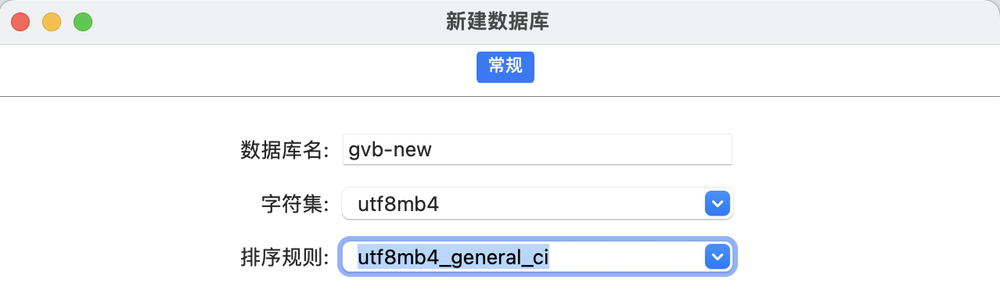
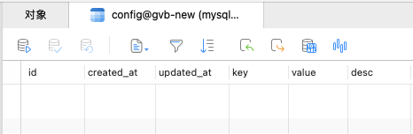

# 第十二章 gin-blog-server 后端初始化

## 12.1 初始化

**需要提前配置好的环境：**

+ mysql 8.0+
+ Go 1.23
+ Redis

打开根文件夹，执行下面的命令来初始化 go 项目：

```
 mkdir gin-blog-server
 cd gin-blog-server
 go mod init gin-blog-server
 go get -u github.com/gin-gonic/gin
```

之后，在项目根目录下编写一个 main.go 文件

```go
package main

import (
	"github.com/gin-gonic/gin"
	"net/http"
)

func main() {
	r := gin.Default()

	// test router
	r.GET("/ping", func(c *gin.Context) {
		c.String(http.StatusOK, "pong")
	})

	// start the server
	r.Run(":8080")
}
```

执行 go run main.go 启动应用，访问http://localhost:8080/ping , 显示如下则为成功:

```
pong
```


## 12.2 viper-配置初始化

### 12.2.1 viper

首先需要为项目安装 viper ： go get github.com/spf13/viper

`viper` 是一个功能强大的配置管理库，它提供了多种方式来加载和管理应用程序的配置。它的主要优势在于：

1. 支持多种配置文件格式和数据来源（文件、环境变量、命令行参数等）。
2. 支持配置文件的嵌套和复杂结构。
3. 提供了环境变量覆盖、默认值、配置热加载等灵活功能。
4. 适合处理不同环境和需求的配置，尤其是在需要动态加载或更新配置时非常有用。

在实际应用中，`viper` 使得配置管理变得更加简洁、灵活和可扩展。

具体来说，`viper` 的主要作用包括：

1. **支持多种配置文件格式**

`viper` 支持多种格式的配置文件，包括：

- **JSON**
- **YAML**
- **TOML**
- **HCL**
- **ENV (环境变量)**

你可以选择任意一种格式来存储配置文件，并通过 `viper` 来加载它们。例如，你可以将配置存储在一个 JSON 文件中，也可以选择 YAML 或 TOML 格式。`viper` 会根据文件的类型自动解析。

2. **灵活的配置来源**

`viper` 允许从多种来源读取配置：

- **配置文件**：支持 JSON、YAML、TOML 等格式的配置文件。
- **环境变量**：可以自动从环境变量中读取配置，支持环境变量覆盖配置文件中的值。
- **命令行参数**：支持从命令行参数中获取配置项，并能够自动解析和转换。
- **远程配置**：`viper` 还支持从远程配置源（如 Consul 或 etcd）加载配置，适用于分布式系统。

3. **支持嵌套配置结构**

`viper` 能够处理嵌套的配置结构，这对于复杂的配置文件非常有用。你可以将配置项分组到不同的层次，`viper` 会自动支持嵌套的读取。例如，读取类似于以下结构的配置文件：

```yml
database:
  host: localhost
  port: 5432
  username: user
  password: pass
```

使用 `viper` 可以非常方便地访问嵌套的配置项：

```
dbHost := viper.GetString("database.host")
dbPort := viper.GetInt("database.port")
```

4. **支持默认值**

`viper` 允许你为配置项设置默认值。如果配置文件中没有指定某个项，`viper` 会使用你定义的默认值。这在某些情况下非常有用，尤其是当你希望程序在缺少某些配置时仍然能正常运行。

例如：

```yml
viper.SetDefault("server.port", 8080)
```

这将确保如果配置文件中没有指定 `server.port`，`viper` 会默认使用 8080。

5. **支持环境变量覆盖**

`viper` 可以轻松地从环境变量中读取配置，且支持将环境变量与配置文件中的配置合并。你可以使用 `viper.AutomaticEnv()` 来启用环境变量的读取，并使用 `viper.SetEnvKeyReplacer()` 来将配置项名的点（`.`）替换为下划线（`_`），这样可以使得环境变量名符合大多数操作系统的环境变量命名规则。

例如，如果配置文件中有：

```yml
server:
  port: 8080
```

你可以通过设置环境变量 `SERVER_PORT=9090` 来覆盖配置文件中的值。

6. **支持配置文件热加载**

`viper` 支持配置文件的热加载。当配置文件发生变化时，`viper` 可以自动重新加载配置，这对于动态调整应用程序配置非常有用。可以通过监听文件变动来实现这一功能，尤其适合在运行中的应用中需要动态修改配置的场景。

7. **简化配置的管理**

在传统的 Go 项目中，管理多个配置文件、环境变量和命令行参数可能会变得比较麻烦。`viper` 将这些内容集中管理，提供统一的接口来访问所有配置项，不需要编写冗长的代码来解析不同的配置来源。

8. **强大的支持库**

`viper` 还支持多种高级功能：

- **类型转换**：可以自动将从配置中读取的字符串转换为 Go 类型，如整数、浮动数、布尔值等。
- **配置监视**：通过 `viper.WatchConfig()`，`viper` 可以监视配置文件的变化并在配置发生变化时触发回调函数，这在实时更新配置时非常有用。
- **与其他库的兼容性**：`viper` 可以与 `cobra` 等库结合使用，以支持命令行工具的配置管理。

9. **自动读取不同来源的配置**

**`viper` 会根据配置的优先级自动选择配置来源：**

1. **命令行参数（如果使用 `cobra` 等命令行库时）**
2. **环境变量**
3. **配置文件（例如 YAML、JSON、TOML）**
4. **默认值**

**通过这种方式，`viper` 可以根据配置的优先级顺序合并多个来源的配置。**

10. **配置更新和保存**

`viper` 支持将程序运行时的配置保存回配置文件，适合用于修改配置后将更改持久化。


### 12.2.2 viper 在本项目中的应用

------

**新建一个文件 internal/global/config.go：**

这段代码实现了一个配置管理系统，能够通过读取配置文件（通常是 JSON、YAML 或 TOML 格式）来初始化整个应用程序的配置，并提供全局访问。它支持环境变量覆盖配置项，使得在不同的部署环境中可以灵活地调整配置，而不需要修改源代码。主要功能包括：

1. **加载和解析配置文件。**
2. **提供全局配置访问。**
3. **根据不同的数据库类型（MySQL 或 SQLite）生成对应的数据库连接字符串。**

这样的设计对于需要灵活配置的应用程序非常有用，尤其是当涉及多个服务（如数据库、Redis、邮件、上传服务等）时，集中管理配置能使得应用更加模块化和易于维护。

具体来说，代码的功能可以分为以下几个方面：

1. **配置管理：**

- `Config` 结构体定义了整个应用程序所需的配置项，涵盖了多种模块（如服务器、数据库、日志、JWT、邮件、Redis、上传等）的配置信息。
- `Conf` 变量是一个全局配置实例，用于在程序中存储和访问配置。

2. **全局配置访问：**

- `GetConfig()`：返回全局配置 `Conf` 的指针。如果配置未初始化，它会触发 `panic` 错误。这是为了确保在访问配置之前，配置已被正确加载。

3. **读取和解析配置：**

- ReadConfig(path string)：该函数负责从指定的配置文件路径加载配置文件，并使用 viper 库来解析配置。它的功能包括：
  - **加载配置文件**：通过 `viper.SetConfigFile(path)` 设置配置文件路径。
  - **支持环境变量覆盖**：通过 `viper.AutomaticEnv()` 允许从环境变量读取配置，并将环境变量中的 `.` 替换为 `_`。
  - **反序列化配置**：`viper.Unmarshal(&Conf)` 将配置文件的内容加载到 `Conf` 结构体中。

4. **数据库配置：**

- `DbType()`：返回当前配置中的数据库类型（MySQL 或 SQLite）。如果没有设置，则默认返回 `sqlite`。
- DbDSN()：根据数据库类型（MySQL 或 SQLite）生成相应的数据库连接字符串（DSN）。这对于后续数据库的连接非常重要。
  - 对于 MySQL，生成格式为：`username:password@tcp(host:port)/dbname?config`。
  - 对于 SQLite，返回配置中的 DSN（数据源名称）。

5. **配置项说明：**

- **Server**：包含服务器的配置信息，如运行模式（`debug` 或 `release`）、端口、数据库类型、数据库自动迁移等。
- **Log**：定义日志的相关配置，包括日志级别、日志格式、日志存储路径等。
- **JWT**：JWT（JSON Web Token）的配置，定义了密钥、过期时间和签发者。
- **Mysql**、**SQLite**、**Redis**：分别包含 MySQL、SQLite 和 Redis 的配置信息。
- **Session**：Session 配置，包括名称、盐值和过期时间。
- **Email**：邮件配置信息，包括SMTP服务器相关设置。
- **Captcha**：验证码配置，定义是否通过邮件发送验证码以及验证码过期时间。
- **Upload**：文件上传的相关配置，包括最大上传文件大小、OSS类型、本地存储路径等。
- **Qiniu**：七牛云相关配置，包括存储区域、空间名称、密钥等。

6. **模块化的配置结构：**

- 每个模块（如日志、数据库、Redis、邮件等）都有独立的配置项，便于管理和维护。
- 每个配置项都有注释，明确其作用和数据类型，帮助开发者理解和使用。

```go
package global

import (
	"fmt"
	"github.com/spf13/viper"
	"log"
	"strings"
)

// Config 结构体包含应用程序的配置信息
type Config struct {
	Server struct {
		Mode          string // 服务器模式 debug | release
		Port          string // 服务器端口
		DbType        string // 数据库类型 mysql | sqlite
		DbAutoMigrate bool   // 是否自动迁移数据库表结构
		DbLogMode     string // 数据库日志模式 silent | error | warn | info
	}
	Log struct {
		Level     string // 日志级别 debug | info | warn | error
		Prefix    string // 日志前缀
		Format    string // 日志格式 text | json
		Directory string // 日志存放目录
	}
	JWT struct {
		Secret string // JWT 密钥
		Expire int64  // JWT 过期时间（小时）
		Issuer string // JWT 签发者
	}
	Mysql struct {
		Host     string // MySQL 服务器地址
		Port     string // MySQL 端口
		Config   string // MySQL 高级配置
		Dbname   string // MySQL 数据库名称
		Username string // MySQL 用户名
		Password string // MySQL 密码
	}
	SQLite struct {
		Dsn string // SQLite 数据源名称（DSN）
	}
	Redis struct {
		DB       int    // Redis 数据库索引
		Addr     string // Redis 服务器地址：端口
		Password string // Redis 密码
	}
	Session struct {
		Name   string // Session 名称
		Salt   string // Session 盐值
		MaxAge int    // Session 最大过期时间（秒）
	}
	Email struct {
		Form     string // 发件人邮箱
		Host     string // SMTP 服务器地址（例如 smtp.qq.com）
		Port     int    // SMTP 端口（一般为 465）
		SmtpPass string // SMTP 密钥（开启SMTP时获取的密钥，而非邮箱密码）
		SmtpUser string // SMTP 用户名（邮箱账号）
	}
	Captcha struct {
		SendEmail  bool // 是否通过邮箱发送验证码
		ExpireTime int  // 验证码过期时间（秒）
	}
	Upload struct {
		Size      int    // 文件上传最大大小（单位：字节）
		OssType   string // OSS 存储类型 local | giniu
		Path      string // 本地文件访问路径
		StorePath string // 本地文件存储路径
	}
	Qiniu struct {
		ImgPath       string // 外链图片地址
		Zone          string // 存储区域
		Bucket        string // 空间名称
		AccessKey     string // 七牛云访问密钥
		SecretKey     string // 七牛云私密密钥
		UseHTTPS      bool   // 是否使用 https 协议
		UseCdnDomains bool   // 是否使用 CDN 上传加速
	}
}

// Conf 存储应用配置的全局变量
var Conf *Config

// GetConfig 返回全局配置，如果未初始化，则触发 panic
func GetConfig() *Config {
	if Conf == nil {
		log.Panic("配置文件未初始化")
		return nil
	}
	return Conf
}

// ReadConfig 读取并解析配置文件，并返回解析后的配置对象
// path: 配置文件的路径
func ReadConfig(path string) *Config {
	v := viper.New()
	v.SetConfigFile(path)                              // 设置配置文件路径
	v.AutomaticEnv()                                   // 允许从环境变量读取配置
	v.SetEnvKeyReplacer(strings.NewReplacer(".", "_")) // 转换环境变量格式：SERVER_APP_MODE => SERVER.APPMODE

	// 读取配置文件
	if err := v.ReadInConfig(); err != nil {
		panic("配置文件读取失败： " + err.Error())
	}

	// 反序列化配置文件内容到 Conf 结构体
	if err := v.Unmarshal(&Conf); err != nil {
		panic("配置文件反序列化失败： " + err.Error())
	}

	log.Println("配置文件内容加载成功： ", path)
	return Conf
}

// DbType 返回数据库类型，如果未设置，则默认为 sqlite
func (*Config) DbType() string {
	if Conf.Server.DbType == "" {
		Conf.Server.DbType = "sqlite"
	}
	return Conf.Server.DbType
}

// DbDSN 返回数据库连接字符串（DSN），根据配置中的数据库类型生成不同的连接字符串
func (*Config) DbDSN() string {
	switch Conf.Server.DbType {
	case "mysql":
		// 构造 MySQL 连接字符串
		conf := Conf.Mysql
		return fmt.Sprintf(
			"%s:%s@tcp(%s:%s)/%s?%s",
			conf.Username, conf.Password, conf.Host, conf.Port, conf.Dbname, conf.Config,
		)
	case "sqlite":
		// 返回 SQLite 的 DSN
		return Conf.SQLite.Dsn
	// 默认使用 sqlite，并且使用内存数据库
	default:
		Conf.Server.DbType = "sqlite"
		if Conf.SQLite.Dsn == "" {
			Conf.SQLite.Dsn = "file::memory" // 使用内存数据库
		}
		return Conf.SQLite.Dsn
	}
}
```

**之后，我们编写一个 yml 配置文件：**

```yml
Server:
  Mode: debug # debug | release
  Port: :8765
  DbType: "mysql" # mysql | sqlite
  DbAutoMigrate: true # 是否自动迁移数据库表结构 (表结构没变可以不迁移, 提高启动速度)
  DbLogMode: "error" # 日志级别 silent, error, warn, info, 默认 info
JWT:
  Secret: "abc123321"
  Expire: 24 # hour
  Issuer: "gin-vue-blog"
Mysql:
  Host: "127.0.0.1"
  Port: "3306"
  Config: "charset=utf8mb4&parseTime=True&loc=Local" # 其他配置, 例如时区
  Dbname: "gvb"
  Username: "root"
  Password: "123456"
Sqlite:
  Dsn: "gvb.db"
Redis:
  DB: 7
  Addr: '127.0.0.1:6379'
  Password: ''
Session:
  Name: "mysession"
  Salt: "salt"
  MaxAge: 600 # second
Log:
  Level: "debug" # debug | info | warn | error
  Format: "text" # text | json
  Directory: "log"
Email:
  Host: "smtp.qq.com" # 服务器地址, 例如 smtp.qq.com 前往要发邮件的邮箱查看其 smtp 协议
  Port: 465  # 前往要发邮件的邮箱查看其 smtp 协议端口, 大多为 465
  From: "" # 发件人 (邮箱)
  SmtpPass: "" # 密钥, 不是邮箱登录密码, 是开启 smtp 服务后获取的一串验证码
  SmtpUser: "" # 发件人昵称, 通常为自己的邮箱名
Captcha:
  SendEmail: true # 通过邮箱发送验证码
  ExpireTime: 15  # 过期时间 (分钟)
Upload:
  OssType: "local" # local | qiniu
  Path: "public/uploaded"      # 本地文件访问路径: OssType="local" 生效
  StorePath: "../public/uploaded" # 本地文件上传路径: 相对于 main.go, OssType="local" 生效
Qiniu:
  ImgPath: "" # 外链
  Zone: ""
  Bucket: ""
  AccessKey: ""
  SecretKey: ""
  UseHttps: false
  UseCdnDomains: false
```

**main.go 中如下使用，即可以读取 config.yml 中的数据**

```go
package main

import (
	"flag"
	"fmt"
	"gin-blog-server/internal/global"
)

func main() {
	configPath := flag.String("c", "./config.yml", "配置文件路径")
	flag.Parse()

	// 根据文件路径读取配置文件
	conf := global.ReadConfig(*configPath)
	fmt.Println(conf)
}
```


## 12.3 sLog - 日志配置

### 12.3.1 log/slog

`log/slog` 是 Go 1.21 中引入的标准日志库，主要作用是提供**结构化日志记录**，使得日志不仅仅是文本输出，更具有可分析和可操作的结构。它支持多种输出格式、不同级别的日志、上下文信息、以及更加灵活的日志过滤和定制选项。

通过 `log/slog`，开发者可以：

- 更清晰地记录带有结构的日志。
- 将日志记录到多个输出目标（例如文件、控制台、远程服务等）。
- 灵活控制日志级别和记录方式。
- 在复杂的系统中，更好地管理日志数据，便于调试、分析和监控。

它的主要优势在于日志的可扩展性和可分析性，特别是在大规模分布式系统中，结构化的日志对于追踪和诊断问题变得更加重要。

------

------

1. **结构化日志记录**

传统的 `log` 包只能记录文本日志，并且是无结构的，也就是说，日志信息只有简单的文本内容，无法方便地进行筛选、过滤或分析。而 `log/slog` 引入了结构化日志的概念，允许你在日志中附加键值对（key-value pairs），从而使日志更加丰富和易于分析。

例如，使用 `log/slog` 记录一个带有字段的日志：

```go
package main

import (
	"log/slog"
)

func main() {
	// 创建一个日志记录器
	logger := slog.New(slog.NewTextHandler(os.Stdout))

	// 记录结构化日志
	logger.Info("Request received", slog.String("method", "GET"), slog.String("path", "/home"))
}
```

输出可能是这样的：

```
INFO: Request received method=GET path=/home
```

在上面的例子中，`"method"` 和 `"path"` 就是附加的结构化字段，可以在日志中直接看到，方便后续分析和过滤。

2. **增强的日志记录能力**

`log/slog` 包提供了更多的日志记录功能和可定制选项，使得开发者可以根据不同需求灵活地使用它：

- **多个日志级别**：`log/slog` 支持不同的日志级别，如 `Debug`、`Info`、`Warn`、`Error` 和 `Fatal`，开发者可以根据日志的严重性选择合适的级别进行记录。

  ```go
  logger.Debug("This is a debug message")
  logger.Info("This is an info message")
  logger.Warn("This is a warning message")
  ```

- **灵活的输出方式**：`log/slog` 允许自定义输出方式，例如将日志输出到控制台、文件或远程服务器等。你可以选择不同的 **Handler** 来定义输出的格式，如文本、JSON 格式等。

  ```go
  // 输出到标准输出并格式化为 JSON
  logger := slog.New(slog.NewJSONHandler(os.Stdout))
  ```

- **日志的上下文和附加字段**：你可以通过在日志记录时附加键值对，增强日志的上下文信息，使其在查看和分析时更加清晰。例如，记录错误时可以附加错误码、用户 ID、请求路径等信息，方便追踪和调试。

- **日志分级**：`log/slog` 支持为不同的日志记录设置不同的级别，通过 `log/slog.Level` 可以控制哪些级别的日志应该被记录下来。例如，可以设置只记录 `Error` 和 `Fatal` 级别的日志，而忽略 `Info` 或 `Debug` 日志。

3. **支持上下文和聚合日志**

`log/slog` 还支持通过**上下文**（context）来聚合日志，这使得在复杂的应用程序中，尤其是微服务环境下，能够跟踪特定请求或操作的日志。你可以为每个请求或操作创建一个上下文，附加与该请求相关的所有日志信息，然后在后续的处理过程中继续将日志信息附加到这个上下文中。

```go
ctx := context.Background()
logger := slog.New(slog.NewTextHandler(os.Stdout))

// 将上下文信息记录到日志中
logger.InfoContext(ctx, "User logged in", slog.String("userID", "12345"))
```

4. **日志的格式化输出**

`log/slog` 提供了不同的**日志格式化方式**，如文本格式和 JSON 格式，可以根据需求输出结构化的日志信息：

- **文本格式**：输出简洁易读的文本日志。
- **JSON 格式**：输出结构化的 JSON 格式日志，适合机器处理和日志聚合工具（如 ELK 堆栈）使用。

例如，使用 JSON 格式输出：

```GO
logger := slog.New(slog.NewJSONHandler(os.Stdout))
logger.Info("User logged in", slog.String("user", "john"), slog.Int("age", 30))
```

输出：

```JSON
{"level":"info","msg":"User logged in","user":"john","age":30}
```

5. **与现有 `log` 包兼容**

`log/slog` 包设计时考虑到了与传统 `log` 包的兼容性。如果你已经在使用 Go 的内建 `log` 包，它提供了一个简单的接口与 `log/slog` 互通。可以很容易地将现有的日志逻辑迁移到 `log/slog` 中，以利用其结构化日志的优势。

6. **日志过滤和日志级别**

`log/slog` 还提供了**日志过滤**的功能，可以根据配置的日志级别来控制日志的记录。例如，你可以将日志级别设置为 `Info`，那么 `Debug` 和 `Trace` 级别的日志将不会被记录。

```go
logger := slog.New(slog.NewTextHandler(os.Stdout))
logger.SetLevel(slog.InfoLevel)
```


### 12.3.2 slog 在本项目中的实践

新建文件 internal/helper.go，代码如下：

```go
package ginblog

import (
	"gin-blog-server/internal/global"
	"log/slog"
	"os"
	"time"
)

// InitLogger 根据配置文件初始化 slog 日志
func InitLogger(conf *global.Config) *slog.Logger {
	// 根据配置文件中的日志级别来设置日志输出的级别
	var level slog.Level
	switch conf.Log.Level {
	case "debug":
		level = slog.LevelDebug // 设置为调试级别
	case "info":
		level = slog.LevelInfo // 设置为信息级别
	case "warn":
		level = slog.LevelWarn // 设置为警告级别
	case "error":
		level = slog.LevelError // 设置为错误级别
	default:
		level = slog.LevelInfo // 默认使用信息级别
	}

	// 配置日志处理器的选项
	option := &slog.HandlerOptions{
		AddSource: false, // 不添加日志的来源信息（例如，调用栈信息）。可以根据需求修改
		Level:     level, // 设置日志的最小级别，低于该级别的日志将被忽略
		ReplaceAttr: func(groups []string, a slog.Attr) slog.Attr {
			// 针对日志中的时间戳进行定制化处理
			if a.Key == slog.TimeKey {
				// 如果是时间字段，将其格式化为字符串，使用 Go 内建的时间格式
				if t, ok := a.Value.Any().(time.Time); ok {
					a.Value = slog.StringValue(t.Format(time.DateTime)) // 格式化为标准时间格式
				}
			}
			return a // 返回修改后的属性
		},
	}

	// 根据配置中的日志格式选择输出格式
	var handler slog.Handler
	switch conf.Log.Format {
	case "json":
		// 如果配置为 JSON 格式，使用 JSON 格式的日志处理器
		handler = slog.NewJSONHandler(os.Stdout, option)
	case "text":
		// 默认使用文本格式
		fallthrough
	default:
		handler = slog.NewTextHandler(os.Stdout, option)
	}

	// 创建新的日志记录器并将其作为默认日志记录器
	logger := slog.New(handler)
	slog.SetDefault(logger) // 设置默认的日志记录器
	return logger           // 返回日志记录器
}
```

**代码分析**

1. **设置日志级别：**
   - 根据 `conf.Log.Level` 的值，选择对应的日志级别。日志级别有 `debug`、`info`、`warn` 和 `error`。这些级别决定了哪些日志消息会被输出。例如，`debug` 级别会输出所有日志，`info` 级别会输出信息及以上级别的日志（例如警告、错误），以此类推。
2. **创建日志处理器选项（HandlerOptions）：**
   - `AddSource: false`：决定是否添加日志源信息（如调用位置）。设置为 `false` 表示不包含调用栈等源信息，如果需要调试可以将其设置为 `true`。
   - `Level: level`：将之前选定的日志级别应用于日志处理器，这意味着该处理器将只处理级别大于等于设置级别的日志。
   - `ReplaceAttr` 函数：该函数可以定制日志属性，在这里它被用来格式化日志中的时间戳。如果日志中的 `TimeKey` 是一个 `time.Time` 类型，它会将时间格式化为标准的日期时间格式（例如 `2006-01-02 15:04:05`）。如果你不需要自定义时间格式，可以删除这个部分。
3. **选择日志输出格式：**
   - 根据 conf.Log.Format 的值，选择日志的输出格式。可以是 json 或 text格式：
     - **JSON 格式**：适用于机器处理、日志聚合工具（如 ELK 堆栈）等场景，便于结构化分析。
     - **文本格式**：适合开发过程中快速查看日志，易于阅读。
4. **创建日志记录器（Logger）：**
   - `logger := slog.New(handler)`：基于选定的日志处理器创建日志记录器。
   - `slog.SetDefault(logger)`：将创建的日志记录器设置为默认记录器，这样后续的日志记录就会使用这个记录器。
5. **返回日志记录器：**
   - 返回 `logger`，以供其他部分的代码使用。

------

main 中使用：

```go
_ = ginblog.InitLogger(conf)
```


## 12.4 mysql - 数据库配置

首先需要安装： 

+ go get gorm.io/gorm

+  go get gorm.io/driver/mysql 
+ go get github.com/glebarez/sqlite

### 12.4.1 gorm 

**GORM 是一个 Go 语言的 ORM（对象关系映射）框架，它通过将数据库表映射到 Go 结构体，使得开发者可以通过操作结构体对象来间接操作数据库，而不需要手动编写 SQL 语句。GORM 使得 Go 开发者在进行数据库操作时，能够更高效地与数据库交互，且代码更加简洁和易于维护。**

**主要特点**

1. **简洁的 API**：GORM 提供了简洁的 API，使得进行数据库操作（如增、删、改、查）变得更加容易。
2. **结构体映射**：通过 Go 结构体与数据库表的映射，开发者可以使用 Go 的语法和特性（如结构体、字段标签等）来操作数据库。
3. **支持多种数据库**：GORM 支持多种数据库，包括 MySQL、PostgreSQL、SQLite 和 SQL Server 等，能够自动处理数据库特定的差异。
4. **自动迁移**：可以根据结构体自动迁移数据库表结构，减少手动编写 SQL 表结构变更的工作量。
5. **链式查询**：GORM 提供链式调用（方法连写）来进行复杂查询，使得查询操作更加直观。
6. **预加载和关联查询**：支持预加载（`Preload`）和关联查询（如一对一、一对多、多对多关系的处理），便于处理复杂的数据关系。

**常用功能**

1. **基本的 CRUD 操作**：

   - **Create**: 插入数据
   - **Read**: 查询数据
   - **Update**: 更新数据
   - **Delete**: 删除数据

   例如：

   ```go
   // 插入数据
   db.Create(&user)
   
   // 查询数据
   var user User
   db.First(&user, 1) // 查询 ID 为 1 的用户
   
   // 更新数据
   db.Model(&user).Update("Name", "New Name")
   
   // 删除数据
   db.Delete(&user, 1) // 删除 ID 为 1 的用户
   ```

2. **结构体与数据库表的映射**：

   - GORM 将 Go 结构体映射到数据库表，通过结构体的标签定义字段与数据库表列之间的关系。

   - 例如：

     ```go
     type User struct {
         ID     uint   `gorm:"primaryKey"`
         Name   string `gorm:"size:100"`
         Email  string `gorm:"unique"`
     }
     ```

3. **迁移功能**：

   - GORM 可以自动迁移数据库表的结构，使得数据库与 Go 结构体同步。使用 `AutoMigrate` 方法，GORM 会检查数据库是否已经存在表，并根据结构体创建或更新表结构。

   ```go
   db.AutoMigrate(&User{})
   ```

4. **关联查询**：

   - GORM 支持一对一、一对多、多对多的关系，可以通过 `Preload` 来加载关联的数据。

   - 例如，User 和 Order 存在一对多关系：

     ```go
     type User struct {
         ID     uint
         Name   string
         Orders []Order
     }
     type Order struct {
         ID     uint
         UserID uint
         Total  float64
     }
     
     // order
     // ------------------------
     CREATE TABLE orders (
         id BIGINT UNSIGNED AUTO_INCREMENT PRIMARY KEY,   -- Order 表的主键
         user_id BIGINT UNSIGNED NOT NULL,                 -- 外键字段，指向 User 表的 ID
         total DECIMAL(10, 2) NOT NULL,                    -- 订单总额字段
         FOREIGN KEY (user_id) REFERENCES users(id)       -- 外键约束，指向 User 表的 ID
     );
     // ------------------------
     
     // 查询用户并预加载订单信息
     var user User
     db.Preload("Orders").First(&user, 1)
     ```

5. **复杂查询**：

   - GORM 支持链式调用，能够进行灵活的查询：

   ```go
   db.Where("age > ?", 20).Order("name desc").Find(&users)
   ```

6. **事务支持**：

   - GORM 提供了事务支持，可以通过 `Begin`、`Commit`、`Rollback` 等方法处理事务。

   ```go
   tx := db.Begin()
   if err := tx.Create(&user).Error; err != nil {
       tx.Rollback()
   }
   tx.Commit()
   ```

7. **Hooks 和回调**：

   - GORM 支持在创建、更新、删除等操作前后执行钩子函数（如 `BeforeCreate`、`AfterCreate` 等），方便处理一些操作前的自定义逻辑。


### 12.4.2 gorm 与 数据库表对应关系

在 Go 中，`gorm` 通过结构体与数据库表之间的映射来自动生成数据库表。以下是结构体与数据库表之间的常见对应关系。

1. **基本结构体与表的映射**

结构体字段与数据库列

- **字段名与列名**：默认情况下，`gorm` 会将结构体字段名转换为小写并作为数据库表的列名（采用蛇形命名法）。例如，`UserName` 会被映射为 `user_name`。
- **字段类型与列类型**：`gorm` 会根据结构体字段的类型来选择相应的数据库列类型。例如，`string` 类型字段会映射为 `VARCHAR` 类型，`int` 类型字段会映射为 `INTEGER` 类型，等等。

```go
type User struct {
    ID        uint   `gorm:"primaryKey"`  // 主键
    UserName  string `gorm:"column:user_name"` // 映射到 user_name 列
    Email     string
    CreatedAt time.Time
}
```

在上面的例子中，结构体 `User` 会生成如下的数据库表：

| Column Name | Type     |
| ----------- | -------- |
| id          | INTEGER  |
| user_name   | VARCHAR  |
| email       | VARCHAR  |
| created_at  | DATETIME |

2. **数据表名与结构体的映射**

默认情况下，`gorm` 会将结构体名转换为小写复数形式作为表名。例如，`User` 结构体会映射为 `users` 表。如果你希望自定义表名，可以通过 `TableName` 方法来指定。示例：

```go
func (User) TableName() string {
    return "members"
}
```

这样 `User` 结构体就会映射为 `members` 表，而不是默认的 `users` 表。

3. **`gorm` 标签**

`gorm` 提供了标签来控制结构体字段和数据库列之间的映射，常用的标签有：

- **`primaryKey`**：指定字段为主键。
- **`autoIncrement`**：自动递增。
- **`column`**：指定列名，覆盖默认的列名。
- **`size`**：指定字段的大小（例如 `VARCHAR(100)`）。
- **`not null`**：字段是否允许为 `NULL`。
- **`default`**：字段的默认值。

```go
type Product struct {
    ID          uint   `gorm:"primaryKey;autoIncrement"`
    Name        string `gorm:"column:product_name;size:100;not null"`
    Price       float64
    Description string `gorm:"default:'No description'"`
}
```

在这个例子中，`Product` 结构体映射为数据库表时：

- `ID` 字段是主键并且自动递增。
- `Name` 字段映射为 `product_name`，最大长度为 100，且不可为空。
- `Description` 字段有一个默认值 `'No description'`。

4. **关系映射**

`gorm` 还支持多种关系类型的映射，包括一对多、多对多和一对一关系。它通过结构体字段来定义这些关系。

- **一对多**：通过在主表结构体中嵌套一个切片（`[]Type`）来定义一对多关系。
- **多对多**：通过在结构体中使用 `[]Type` 与 `gorm` 的 `many2many` 标签来定义多对多关系。
- **一对一**：通过嵌入另一个结构体来定义一对一关系。

**示例：一对多**

```go
type User struct {
    ID    uint   `gorm:"primaryKey"`
    Name  string
    Orders []Order `gorm:"foreignKey:UserID"`
}

type Order struct {
    ID     uint   `gorm:"primaryKey"`
    UserID uint   // 外键
    Amount float64
}
```

这里 `User` 和 `Order` 之间存在一对多的关系。每个 `User` 可以有多个 `Order`，而每个 `Order` 通过 `UserID` 字段与 `User` 关联。

示例：多对多

```go
type Student struct {
    ID       uint     `gorm:"primaryKey"`
    Name     string
    Courses  []Course `gorm:"many2many:student_courses"`
}

type Course struct {
    ID    uint   `gorm:"primaryKey"`
    Name  string
}
```

在这个例子中，`Student` 和 `Course` 之间存在多对多关系。`gorm` 会自动创建一个关联表 `student_courses` 来存储学生与课程之间的关联。

示例：一对一

```go
type User struct {
    ID     uint    `gorm:"primaryKey"`
    Name   string
    Profile Profile `gorm:"foreignKey:UserID"`
}

type Profile struct {
    ID     uint   `gorm:"primaryKey"`
    UserID uint   // 外键
    Bio    string
}
```

这里 `User` 和 `Profile` 之间是一对一的关系。每个 `User` 只会有一个 `Profile`，而 `Profile` 通过 `UserID` 外键关联到 `User`。

5. 自动迁移（Auto Migration）

`gorm` 提供了自动迁移功能，使得结构体模型能够与数据库表结构同步。`gorm` 会根据结构体的定义自动更新数据库表。

```go
db.AutoMigrate(&User{}, &Order{})
```

当调用 `AutoMigrate` 时，`gorm` 会根据结构体的定义自动更新表结构，但不会删除现有的列。它会根据需要添加新的列或修改现有的列。

**总结:**

- **字段名与列名**：默认情况下，`gorm` 会将字段名转换为小写并使用蛇形命名法。
- **表名与结构体**：`gorm` 会将结构体名转换为复数形式作为表名，除非自定义 `TableName` 方法。
- **标签**：可以使用 `gorm` 标签来定制字段与数据库列之间的映射，如设置主键、列名、大小、是否允许 `NULL` 等。
- **关系映射**：`gorm` 支持一对一、一对多、多对多关系的映射。
- **自动迁移**：`gorm` 提供 `AutoMigrate` 功能，自动同步结构体与数据库表结构。

`gorm` 通过结构体和标签提供了一个非常方便的方式来定义和管理数据库模型及其关系，并且能自动进行数据库迁移，简化了数据库操作。


### 12.4.3 gorm 初始化

首先要建立一个 config 对应的数据库表，来支持我们初始化数据库的操作

首先建立 internal/model/z_base.go，代码如下

```go
package model

import (
	"gorm.io/gorm"
	"time"
)

// MakeMigrate 迁移数据表，在没有数据表结构变更时候，建议注释不执行
// 只支持创建表、增加表中没有的字段和索引
// 为了保护数据，并不支持改变已有的字段类型或删除未被使用的字段
func MakeMigrate(db *gorm.DB) error {
	return db.AutoMigrate(
		&Config{},
	)
}

type Model struct {
	ID        int       `json:"id" gorm:"primary_key;auto_increment"`
	CreatedAt time.Time `json:"created_at"`
	UpdatedAt time.Time `json:"updated_at"`
}
```

其次建立 internal/model/config.go，代码如下

```go
package model

type Config struct {
	Model
	Key   string `gorm:"unique;type:varchar(256)" json:"key"`
	Value string `gorm:"type:varchar(256)" json:"value"`
	Desc  string `gorm:"type:varchar(256)" json:"desc"`
}
```

**之后，我们在 internal/helper.go 中加入如下方法：**

```go

// InitDatabase 初始化数据库连接并返回一个 GORM DB 实例
// 根据配置文件中的设置来选择数据库类型、连接配置和日志级别。
// 并且在需要时执行数据库自动迁移操作。
func InitDatabase(conf *global.Config) *gorm.DB {
	// 获取配置文件中数据库类型和数据源名称（DSN）
	dbtype := conf.DbType() // 数据库类型（如 mysql 或 sqlite）
	dsn := conf.DbDSN()     // 数据源名称（数据库连接字符串）

	var db *gorm.DB
	var err error

	// 设置日志级别（根据配置文件中的日志模式选择）
	var level logger.LogLevel
	switch conf.Server.DbLogMode {
	case "silent":
		level = logger.Silent // 静默模式，不输出日志
	case "info":
		level = logger.Info // 信息级别日志，输出常规信息
	case "warn":
		level = logger.Warn // 警告级别日志，输出警告信息
	case "error":
		fallthrough
	default:
		level = logger.Error // 错误级别日志，输出错误信息
	}

	// 配置 GORM 的日志和其他参数
	config := &gorm.Config{
		Logger:                                   logger.Default.LogMode(level), // 设置日志级别
		DisableForeignKeyConstraintWhenMigrating: true,                          // 禁用外键约束迁移
		SkipDefaultTransaction:                   true,                          // 禁用默认事务
		NamingStrategy: schema.NamingStrategy{
			SingularTable: true, // 禁用复数表名（例如：User 表名会映射到 `user`）
		},
	}

	// 根据数据库类型选择不同的数据库驱动
	switch dbtype {
	case "mysql":
		// 使用 MySQL 驱动进行数据库连接
		db, err = gorm.Open(mysql.Open(dsn), config)
	case "sqlite":
		// 使用 SQLite 驱动进行数据库连接
		db, err = gorm.Open(sqlite.Open(dsn), config)
	default:
		// 如果数据库类型不支持，打印错误并终止程序
		log.Fatal("不支持的数据库类型: ", dbtype)
	}

	// 检查数据库连接是否成功
	if err != nil {
		log.Fatal("数据库连接失败", err) // 如果连接失败，打印错误并终止程序
	}
	// 如果连接成功，打印数据库类型和连接字符串
	log.Println("数据库连接成功", dbtype, dsn)

	// 如果配置文件中开启了数据库自动迁移功能
	if conf.Server.DbAutoMigrate {
		// 调用 model.MakeMigrate 执行数据库迁移
		if err := model.MakeMigrate(db); err != nil {
			log.Fatal("数据库迁移失败： ", err) // 如果迁移失败，打印错误并终止程序
		}
		// 迁移成功后打印日志
		log.Println("数据库自动迁移成功")
	}

	// 返回 GORM 的数据库实例
	return db
}
```

1. **函数功能**：
   - `InitDatabase` 用于初始化数据库连接并返回一个 GORM 的 `*gorm.DB` 实例。
   - 函数根据传入的 `conf` 配置文件信息选择不同的数据库类型、数据库连接方式、日志级别，并在必要时执行数据库自动迁移操作。
2. **获取配置**：
   - 通过 `conf.DbType()` 和 `conf.DbDSN()` 获取数据库类型和数据库连接字符串（DSN）。
   - `dbtype` 变量表示数据库的类型（如 `mysql` 或 `sqlite`），`dsn` 是数据库的连接字符串。
3. **日志设置**：
   - 根据配置中的 `Server.DbLogMode` 字段选择不同的日志级别（如 `silent`、`info`、`warn` 或 `error`）。
   - 使用 `gorm.Config` 配置 GORM 的日志行为，`logger.Default.LogMode(level)` 设置日志的详细级别。
   - 禁用了外键约束迁移（`DisableForeignKeyConstraintWhenMigrating: true`），和默认事务（`SkipDefaultTransaction: true`）。
   - 使用了命名策略，将数据库表的名称设置为单数形式（`SingularTable: true`）。
4. **数据库连接**：
   - 根据 `dbtype` 的值（`mysql` 或 `sqlite`），使用相应的数据库驱动（`mysql.Open(dsn)` 或 `sqlite.Open(dsn)`）来打开数据库连接。
   - 如果数据库类型不受支持，会调用 `log.Fatal` 输出错误并终止程序。
5. **错误处理**：
   - 在连接数据库时，如果发生错误（`err != nil`），则打印错误并终止程序。
   - 如果连接成功，会打印出数据库类型和连接字符串。
6. **数据库迁移**：
   - 如果配置文件中 `DbAutoMigrate` 为 `true`，则会调用 `model.MakeMigrate(db)` 执行数据库的自动迁移操作。
   - 如果迁移失败，会打印错误并终止程序。
7. **返回数据库实例**：
   - 最终返回 GORM 的 `*gorm.DB` 实例，供后续数据库操作使用。

总结：

- `InitDatabase` 函数根据配置文件的内容初始化数据库连接，并配置 GORM 的日志级别和其他参数。
- 支持多种数据库类型（如 MySQL 和 SQLite），并根据配置选择相应的数据库驱动。
- 如果启用了自动迁移，函数会在连接成功后执行数据库迁移操作，确保数据库表结构与模型一致。
- 函数适合用于应用程序启动时初始化数据库连接和配置数据库相关的行为。

------

main.go :

```go
_ = ginblog.InitDatabase(conf)
```

同时将 config.yml 中进行修改：Dbname: "gvb-new"

创建对应数据库：



**运行代码，我们可以看到自动生成数据库表 config：**




## 12.5 redis - 缓存配置

### 12.5.1 redis

Redis 是一个开源的内存数据结构存储系统，它可以用作数据库、缓存、消息队列等。Redis 提供了丰富的数据结构支持，例如字符串、哈希、列表、集合、有序集合、位图、超日志等。由于它主要将数据存储在内存中，因此提供了非常高的读写速度，适用于需要高性能和低延迟的应用场景。

**主要特点：**

1. **高性能**：Redis 是一个基于内存的数据库，读写操作非常快速，能够处理大量的并发请求。
2. **丰富的数据类型**：支持多种数据类型，如字符串、哈希、列表、集合、有序集合、位图等。
3. **持久化选项**：尽管 Redis 是内存存储，它提供了两种持久化机制（RDB 和 AOF），能够将内存中的数据保存到磁盘上，以防数据丢失。
4. **支持事务**：Redis 支持事务，可以通过 `MULTI`、`EXEC`、`DISCARD` 命令进行事务处理。
5. **支持发布/订阅机制**：Redis 提供了发布/订阅（Pub/Sub）功能，可以用来构建实时消息系统。
6. **分布式支持**：通过 Redis Cluster 和 Redis Sentinel，可以实现 Redis 的分布式部署，提供高可用性和水平扩展。

**常见应用场景：**

- **缓存**：作为缓存系统，减轻数据库负担，提高访问速度。
- **会话存储**：用于存储用户会话（session）信息，适用于高并发应用。
- **实时数据处理**：支持高频次的更新和查询，适用于实时数据处理（如实时统计、排行榜等）。
- **消息队列**：通过 Redis 的队列功能实现任务队列、消息队列等应用场景。

总的来说，Redis 以其高速、灵活的数据结构和广泛的应用场景，成为了许多高性能系统的关键组件。


### 12.5.2 redis 初始化

首先：go get github.com/redis/go-redis/v9

**之后，我们在 internal/helper.go 中加入如下方法：**

```go
// InitRedis 初始化 Redis 客户端并测试连接
func InitRedis(conf *global.Config) *redis.Client {
	// 创建一个 Redis 客户端实例，配置连接参数
	rdb := redis.NewClient(&redis.Options{
		Addr:     conf.Redis.Addr,      // Redis 服务器地址（包括端口），从配置文件中获取
		Password: conf.Redis.Password,  // Redis 密码，如果没有设置密码则传空字符串
		DB:       conf.Redis.DB,        // Redis 数据库索引，通常是 0、1、2 等，从配置文件中获取
	})

	// 使用 Ping 命令测试 Redis 连接是否正常
	_, err := rdb.Ping(context.Background()).Result()
	if err != nil {
		// 如果连接失败，打印错误信息并终止程序
		log.Fatal("Redis 连接失败：", err)
	}

	// 如果连接成功，打印成功信息
	log.Println("Redis 连接成功", conf.Redis.Addr, conf.Redis.DB, conf.Redis.Password)

	// 返回 Redis 客户端实例
	return rdb
}
```

1. **初始化 Redis 客户端**：

   - redis.NewClient(&redis.Options{...})：该行代码创建了一个新的 Redis 客户端实例。它通过传入的 Options配置来设置连接参数：
     - `Addr`：指定 Redis 服务器的地址和端口（例如：`localhost:6379`）。
     - `Password`：指定连接 Redis 时使用的密码，如果没有设置密码，可以传空字符串。
     - `DB`：指定 Redis 使用的数据库索引，默认为 0。Redis 支持多个数据库，索引是从 0 开始的。

   这些配置参数来自于 `global.Config` 结构体中的 `Redis` 配置项。

2. **测试 Redis 连接**：

   - `rdb.Ping(context.Background()).Result()`：使用 `Ping` 命令测试 Redis 连接。`Ping` 命令是 Redis 中的一个简单命令，通常用于测试与服务器的连接是否正常。该方法会返回 Redis 服务器的响应，如果连接正常，返回的是 `PONG`，否则会返回错误。
   - 如果连接失败（即 `err != nil`），则会打印错误信息并终止程序：`log.Fatal("Redis 连接失败：", err)`。`log.Fatal` 会打印错误信息并调用 `os.Exit(1)` 终止程序。

3. **成功连接日志**：

   - 如果 Redis 连接成功，代码会打印一个成功消息，包含 Redis 服务器的地址、使用的数据库索引、以及密码（通常是为了调试或查看连接情况）。

4. **返回 Redis 客户端实例**：

   - 最后，函数返回已初始化并连接成功的 Redis 客户端实例 `rdb`，它可以用于执行后续的 Redis 操作。

总结

这段代码的作用是：

- 初始化一个 Redis 客户端，并根据配置文件中的设置连接到 Redis 服务器。
- 使用 `Ping` 命令测试连接的可用性。
- 如果连接成功，返回 Redis 客户端实例；如果连接失败，则输出错误信息并退出程序。

这种做法是一个常见的数据库/缓存服务连接初始化方式，保证了在启动应用时 Redis 的连接是有效的。

之后，在 main.go 中执行：

```go
rdb := ginblog.InitRedis(conf)
```


## 12.6 MiddleWare - 中间件配置

### 12.6.1 gin 中的 middleware 

在 Gin 中，**middleware（中间件）** 是在请求处理流程中间插入的处理逻辑。它们的作用是对请求或响应进行预处理或后处理。可以理解为一个“拦截器”，它会在请求到达路由处理函数之前和响应返回给客户端之前执行。

#### 1 中间件的作用

1. **请求预处理**：
   - 中间件可以在请求到达目标处理函数之前对请求进行修改、验证或记录。例如，验证请求的 JWT token、记录日志、设置跨域（CORS）等。
2. **响应后处理**：
   - 中间件还可以对响应进行修改或处理。例如，给响应添加额外的头信息、修改响应内容等。
3. **控制请求流程**：
   - 中间件可以通过调用 `c.Next()` 来决定请求处理的后续执行。它可以中断请求的处理过程，或者将控制权交给下一个中间件或处理函数。
4. **集中化处理**：
   - 通过中间件可以集中处理一些常见功能，比如跨域、身份认证、日志记录、数据格式化等，而不是在每个路由处理函数中重复编写这些逻辑。
5. **功能增强**：
   - 中间件为应用添加了可扩展性，可以通过不同的中间件功能组合实现灵活的请求处理。

#### 2 中间件的常见用途

1. **身份验证**：
   - 通过中间件验证每个请求的身份，常见的是处理 JWT 令牌验证，确保请求的合法性。
2. **请求日志**：
   - 记录请求的日志信息，便于监控和调试。
3. **CORS（跨域资源共享）**：
   - 设置允许跨域的请求头信息，允许客户端与服务器进行跨域通信。
4. **数据验证**：
   - 验证请求参数是否合法，比如检查 JSON body 或表单数据的有效性。
5. **限流**：
   - 防止恶意用户发起过多的请求，造成服务器压力。中间件可以实现限流控制。
6. **错误处理**：
   - 通过中间件捕获应用中的错误，返回统一格式的错误响应。

#### 3 如何在 Gin 中使用中间件

在 Gin 中，使用中间件非常简单，通常是通过 `Use()` 方法来注册。

示例：日志中间件

```go
package main

import (
	"github.com/gin-gonic/gin"
	"log"
)

// 自定义中间件：打印每个请求的路径
func LoggerMiddleware(c *gin.Context) {
	log.Println("Request path:", c.Request.URL.Path)
	c.Next() // 处理请求后执行下一步中间件或路由
}

func main() {
	r := gin.Default()

	// 注册自定义的日志中间件
	r.Use(LoggerMiddleware)

	// 定义一个路由
	r.GET("/hello", func(c *gin.Context) {
		c.String(200, "Hello, World!")
	})

	r.Run(":8080")
}
```

在这个例子中，`LoggerMiddleware` 是一个简单的中间件，它在每个请求到达路由处理之前打印请求路径。

示例：身份验证中间件

```go
func AuthMiddleware(c *gin.Context) {
	token := c.GetHeader("Authorization")
	if token == "" || !isValidToken(token) {
		c.JSON(401, gin.H{"message": "Unauthorized"})
		c.Abort() // 中断后续处理
		return
	}
	c.Next() // 继续执行后续操作
}
```

这个 `AuthMiddleware` 会验证请求头中的 `Authorization` 字段，如果没有提供有效的 token，就返回 401 未授权错误。

中间件的执行顺序

- 中间件按照它们在 `r.Use()` 中注册的顺序执行。
- 每个中间件执行时，可以通过 `c.Next()` 来传递控制权到下一个中间件，或者通过 `c.Abort()` 中断后续的处理流程。

#### 4 总结

- **中间件** 是在请求和响应的过程中进行处理的一个功能模块，主要用于预处理和后处理。
- 它们可以集中处理日志、身份验证、跨域、错误处理、请求校验等常见功能。
- 通过在 Gin 中使用 `Use()` 方法注册中间件，能够在应用中实现高效、灵活的请求处理流程。


### 12.6.2 本项目中的实践

中间件相关函数都写在 internal/middleware/base.go 中


#### 1 Logger

```go
// Logger 中间件函数，用于记录每个请求的日志信息
func Logger() gin.HandlerFunc {
	// 返回一个 gin.HandlerFunc 类型的中间件函数
	return func(c *gin.Context) {
		// 记录请求开始时间
		start := time.Now()
		
		// 调用 c.Next() 执行后续的中间件和路由处理
		c.Next()

		// 计算请求处理的耗时
		cost := time.Since(start)

		// 使用 slog 记录日志信息
		slog.Info("[GIN]", // 日志的标识，方便区分是来自 Gin 中间件的日志
			// 请求的路径（URL）
			slog.String("path", c.Request.URL.Path),
			// 请求的查询参数
			slog.String("query", c.Request.URL.RawQuery),
			// HTTP 响应的状态码
			slog.Int("status", c.Writer.Status()),
			// 请求方法（GET、POST等）
			slog.String("method", c.Request.Method),
			// 客户端的 IP 地址
			slog.String("ip", c.ClientIP()),
			// 响应的大小（字节）
			slog.Int("size", c.Writer.Size()),
			// 请求处理的耗时
			slog.Duration("cost", cost),
			// 以下是注释掉的部分，可以根据需要开启：
			// 请求体内容
			// slog.String("body", c.Request.PostForm.Encode()),
			// 用户代理（User-Agent）
			// slog.String("user-agent", c.Request.UserAgent()),
			// 错误信息
			// slog.String("errors", c.Errors.ByType(gin.ErrorTypePrivate).String()),
		)
	}
}
```

该中间件的主要作用是**记录每个 HTTP 请求的详细信息**，包括请求的路径、查询参数、响应状态码、请求方法、客户端 IP 地址、响应大小和请求处理的耗时。

通过这样的日志，可以帮助开发者监控应用的性能、分析请求流量，或者用于调试和排查问题。


#### 2 Recovery

```go
// Recovery 中间件用于捕获并处理应用程序中的 panic 错误
// stack 参数控制是否打印 panic 的 stack trace 信息
func Recovery(stack bool) gin.HandlerFunc {
	// 返回一个 gin.HandlerFunc 类型的中间件函数
	return func(c *gin.Context) {
		// 使用 defer 确保函数结束时执行此处的错误处理逻辑
		defer func() {
			// 使用 recover() 捕获 panic 异常，如果有 panic 发生，err 将不为 nil
			if err := recover(); err != nil {
				// 检查是否是网络连接错误（例如：Broken Pipe），这些错误不需要堆栈信息
				var brokenPipe bool
				if ne, ok := err.(*net.OpError); ok {
					var se *os.SyscallError
					// 判断是否是 broken pipe 错误
					if errors.As(ne, &se) {
						seStr := strings.ToLower(se.Error())
						if strings.Contains(seStr, "broken pipe") ||
							strings.Contains(seStr, "connection reset by peer") {
							brokenPipe = true
						}
					}
				}

				// 如果发生 panic，返回给客户端通用错误信息
				handle.ReturnHttpResponse(c, http.StatusInternalServerError, global.FAIL, global.GetMsg(global.FAIL), err)

				// 打印出发生 panic 时的 HTTP 请求信息
				httpRequest, _ := httputil.DumpRequest(c.Request, false)

				// 如果是 broken pipe 错误，不需要打印堆栈信息，直接记录错误并中止请求
				if brokenPipe {
					// 记录错误日志
					slog.Error(c.Request.URL.Path,
						slog.Any("error", err),
						slog.String("request", string(httpRequest)),
					)
					// 如果连接已经断开，不能再写入响应状态
					_ = c.Error(err.(error))
					c.Abort()
					return
				}

				// 如果需要打印 stack trace（堆栈信息），记录带有堆栈信息的错误日志
				if stack {
					slog.Error("[Recovery from panic]",
						slog.Any("error", err),
						slog.String("request", string(httpRequest)),
						slog.String("stack", string(debug.Stack())), // 打印堆栈信息
					)
				} else {
					// 如果不需要打印堆栈信息，只记录错误日志
					slog.Error("[Recovery from panic]",
						slog.Any("error", err),
						slog.String("request", string(httpRequest)),
					)
				}
				// 中止请求并返回 500 错误（内部服务器错误）
				c.AbortWithStatus(http.StatusInternalServerError)
			}
		}()
		// 执行后续中间件和路由处理
		c.Next()
	}
}
```

该中间件的作用

- **捕获 panic**：防止服务器因未处理的 `panic` 崩溃，保证即使程序出现异常也不会导致整个服务的崩溃。
- **日志记录**：通过日志记录详细的 `panic` 错误信息，包括发生 `panic` 时的请求信息和堆栈信息（如果需要），帮助开发者调试和定位问题。
- **错误处理**：当发生 `panic` 时，向客户端返回一个通用的错误响应（500 错误），并避免将内部错误信息暴露给用户。
- **特殊处理 broken pipe**：在某些情况下，如果是连接断开（如客户端主动断开连接），则不记录过多的堆栈信息，而是记录错误日志并终止请求。

------

**在这段 `Recovery` 中间件的代码中，错误发生时，返回的机制涉及到两个不同的地方：**

1. **向客户端返回 HTTP 错误响应（500 状态码）**： 这是通过 `handle.ReturnHttpResponse` 函数完成的，它会将一个统一的错误消息返回给客户端，响应状态码为 `http.StatusInternalServerError`（即 500）。

   ```go
   handle.ReturnHttpResponse(c, http.StatusInternalServerError, global.FAIL, global.GetMsg(global.FAIL), err)
   ```

   - **第一次返回**：客户端会接收到一个 HTTP 500 错误状态和错误信息。这是响应返回给客户端的主要错误信息。

2. **中止当前请求的进一步处理，并且发送 500 错误状态**： 这是通过 `c.AbortWithStatus(http.StatusInternalServerError)` 完成的，它会中止当前请求的后续处理并返回给客户端一个 HTTP 500 错误状态。

   ```go
   c.AbortWithStatus(http.StatusInternalServerError)
   ```

   - **第二次返回**：这是对中间件内部的控制流的干预，防止请求继续执行（比如后续的中间件或路由处理函数）。它确保了即使后续的处理函数或中间件发生错误，也不会再处理这个请求。它直接返回一个 500 错误状态并终止请求。

**总结：**

- **第一次返回**：发生 panic 时，会调用 `handle.ReturnHttpResponse` 向客户端返回 HTTP 500 错误和错误信息。
- **第二次返回**：会调用 `c.AbortWithStatus(http.StatusInternalServerError)`，用来确保请求被终止，且不会继续执行后续的处理。


#### 3 Recovery 注意事项

**如果在 `Recovery` 中间件中 不执行 `c.AbortWithStatus(http.StatusInternalServerError)`，会导致以下行为：**

1. **请求继续传递给后续中间件和处理函数**

- **请求不会被中止**：当发生 `panic` 异常时，如果不调用 `c.AbortWithStatus`，请求就不会被中止，后续的中间件和路由处理函数可能会继续执行。
- 例如，如果后续有其他中间件或路由处理器做了响应处理，它们将会继续执行，可能会尝试向客户端返回另一个响应。这样可能会导致多个响应被发送，甚至可能发生错误，因为同一个请求只能有一个响应。

2. **响应的状态和数据可能不一致**

- 如果 `panic` 被捕获但没有中止请求，后续的处理中可能会继续设置响应的状态码、响应体等内容，这会导致 `panic` 错误信息与其他处理的内容混淆。
- 假设在 `panic` 之后没有中止请求，后续的中间件或处理函数可能会设置一个 200（OK）状态码，或者其他状态码返回响应。这与发生 `panic` 后应该返回 500 状态码的预期行为不一致。

3. **日志中会记录重复的错误信息**

- 由于请求没有被中止，可能会导致相同的错误被多次记录。例如：
  - 如果有其他的中间件或路由处理器抛出了另一个错误或 `panic`，错误日志可能会重复记录相同的堆栈信息或错误消息。
  - 这种情况可能导致调试时混淆错误的来源。

4. **不控制请求流可能会带来未定义的行为**

- 许多情况下，错误发生后请求应该立即中止，并且应该向客户端返回明确的错误响应。否则，继续执行可能会导致：
  - 请求的处理状态不明确
  - 客户端可能会接收到多次响应（例如错误响应和正常响应）
  - 服务器内部出现不一致的状态（例如，数据库事务未正确回滚等）

总结：

如果不执行 `c.AbortWithStatus`，错误处理逻辑会变得不确定：

- **请求可能继续被后续中间件或处理函数处理**，这会带来响应重复、数据不一致的问题。
- **可能导致多个响应被发送给客户端**，从而使客户端得到不清晰的响应状态。

**总之，`c.AbortWithStatus` 主要用于保证在发生 `panic` 时立即中止请求的处理，防止请求继续传递，确保错误响应一致且明确。**


------

------

**`c.JSON` 和 `c.AbortWithStatus` 都是 Gin 框架中用于返回 HTTP 响应的方法，但它们的作用和使用场景不同。下面是它们的详细比较：**

1. `c.JSON`

**`c.JSON` 用于返回一个 JSON 格式的响应。它会设置 HTTP 响应的 Content-Type 为 `application/json`，并将传入的数据序列化成 JSON 格式返回给客户端。**

```go
c.JSON(http.StatusOK, gin.H{"message": "success"})
```

2. `c.AbortWithStatus`

**`c.AbortWithStatus` 用于提前终止当前请求的处理，并返回指定的 HTTP 响应状态码。它不会发送任何响应体，除非你在前面调用了其他方法（比如 `c.JSON` 或 `c.String`）。如果没有其他响应方法被调用，响应体会为空。**

```
c.AbortWithStatus(http.StatusInternalServerError)
```

c.AbortWithStatus(http.StatusForbidden) 这将直接返回 HTTP 403 错误，并且请求会被中止，后续的中间件和处理函数不会执行。

**主要区别:**

| 特性             | `c.JSON`                                  | `c.AbortWithStatus`                              |
| ---------------- | ----------------------------------------- | ------------------------------------------------ |
| **作用**         | 返回 JSON 格式的响应内容。                | 仅返回指定的状态码，不返回响应内容。             |
| **响应体**       | 包含 JSON 格式的响应体。                  | 响应体为空（除非结合其他方法，如 `c.String`）。  |
| **是否终止请求** | 不终止请求，后续的处理函数会继续执行。    | 会终止当前请求的处理（后续的处理函数不再执行）。 |
| **典型用途**     | 当需要返回数据时，通常用于响应 API 请求。 | 当需要直接返回状态码而不处理具体的响应体时。     |


#### 4 gin.Logger 与 gin.Recovery

`gin.Logger` 和 `gin.Recovery` 是 Gin 框架中两种常见的内置中间件，它们分别负责 **日志记录** 和 **错误恢复**。这两个中间件有不同的作用，分别处理请求的日志和异常情况。

##### 1. **`gin.Logger`**

**作用**：`gin.Logger` 中间件用于记录每一个 HTTP 请求的日志信息，包括请求的详细信息（如方法、路径、状态码等），通常用于调试和记录访问日志。

- **工作原理**：它会拦截请求，在请求进入路由处理器之前记录相关日志。它的作用是捕捉并输出请求的基本信息，比如请求的方法、路径、状态码、请求大小、响应大小等。

- **默认输出**：每个请求的日志会输出如下信息：

  - 请求的时间戳
  - 请求的 HTTP 方法（如 `GET`, `POST` 等）
  - 请求的 URL 路径
  - 请求的状态码（如 `200`, `404` 等）
  - 请求体的大小（`size`）
  - 请求响应的耗时（`cost`）

- **示例**：`gin.Logger` 会记录类似下面的信息：

  ```bash
  2022/12/01 - 12:00:00 | GET /api/v1/users | 200 OK | 123ms
  ```

##### 2. **`gin.Recovery`**

**作用**：`gin.Recovery` 中间件用于捕获运行时的 `panic` 错误，防止服务器崩溃，并向客户端返回一个错误响应。它确保即使发生严重的错误或未处理的异常时，服务器依然可以继续工作，避免因 `panic` 导致服务崩溃。

- **工作原理**：它使用 `defer` 机制捕获程序中的 `panic`，并在发生错误时记录错误日志，同时将错误信息以适当的 HTTP 状态码（通常是 500）返回给客户端。这样，即使某个请求处理过程中发生了 `panic`，客户端依然能够得到一个规范的错误响应。

- **默认处理**：当发生 `panic` 时，`gin.Recovery` 会：

  - 向客户端返回一个 `500 Internal Server Error` 错误。
  - 记录 `panic` 的详细信息，包括错误堆栈、请求的 URL 和请求头等信息，帮助开发者排查问题。

- **示例**：`gin.Recovery` 会在发生 `panic` 时进行类似下面的操作：

  ```go
  [Recovery from panic] error: runtime error: invalid memory address or nil pointer dereference
  request: POST /api/v1/users
  stack trace: ... (stack trace details)
  ```

##### 总结对比

| 功能           | `gin.Logger`                               | `gin.Recovery`                           |
| -------------- | ------------------------------------------ | ---------------------------------------- |
| **作用**       | 记录 HTTP 请求的日志                       | 捕获并恢复 `panic` 错误，防止服务崩溃    |
| **使用场景**   | 用于调试和记录访问日志                     | 用于确保在发生异常时不崩溃并记录错误信息 |
| **输出内容**   | 请求方法、路径、状态码、请求大小、响应时间 | 发生 `panic` 时的错误信息、请求堆栈等    |
| **默认状态码** | 无（只是记录日志）                         | 返回 HTTP 500 错误给客户端               |
| **其他功能**   | -                                          | 捕获 `panic` 异常并防止程序崩溃          |

##### 示例代码

```go
package main

import (
	"github.com/gin-gonic/gin"
)

func main() {
	r := gin.Default()
	
	// 注册 Logger 中间件，记录日志
	r.Use(gin.Logger())
	
	// 注册 Recovery 中间件，捕获 panic 错误并返回 500 错误
	r.Use(gin.Recovery())

	// 定义一个路由，模拟一个 panic 错误
	r.GET("/panic", func(c *gin.Context) {
		panic("Something went wrong!")
	})

	// 启动服务器
	r.Run(":8080")
}
```

- **`gin.Logger`**：用于记录每个请求的日志，可以帮助你了解请求的流量、状态和性能。
- **`gin.Recovery`**：用于捕获 `panic` 异常，防止服务崩溃，并记录详细的错误信息，确保应用健壮性。


#### 5 CORS

##### 1 什么是跨域

后端处理跨域问题主要是为了确保安全性和有效的资源共享。这里是一些关键原因：

1. **安全性考虑**：浏览器的同源策略（Same-Origin Policy）默认禁止从一个域名发起的请求访问另一个域名的资源。这是为了防止跨站请求伪造（CSRF）和跨站脚本（XSS）等安全漏洞。通过后端处理跨域请求，可以确保只有经过授权的请求能够访问到服务器的资源。
2. **API 的跨域支持**：
   + 现代前后端分离架构中，前端和后端常常部署在不同的服务器或不同的域名下，前端应用（如React、Vue等）可能会尝试请求后端API。
   + **在这种情况下，浏览器会自动阻止这种跨域请求，除非后端服务器明确允许。**
   + 后端通过设置适当的CORS（跨域资源共享）头，告诉浏览器哪些域名是允许跨域访问的。
3. **灵活的访问控制**：后端可以根据需要选择性地允许不同的前端应用进行跨域请求。例如，你可以只允许特定的域名访问API，或者在特定的情况下允许跨域。这样可以增强控制力度，避免不必要的风险。
4. **优化开发流程**：在开发阶段，前端和后端通常运行在不同的开发环境中。后端可以通过配置跨域访问来解决开发阶段的跨域问题，使前端开发人员可以在本地开发环境中方便地调用后端API，而不必为了跨域问题在本地环境做复杂的配置。

**通常情况下，后端会通过设置`Access-Control-Allow-Origin`等CORS头来控制哪些域名可以访问资源，并根据需要允许或拒绝特定类型的请求（如`OPTIONS`请求、`GET`请求、`POST`请求等）。**

**简而言之，后端处理跨域的目的就是确保安全、控制哪些前端可以访问资源，并促进前后端分离架构的顺利运行。**

------

##### **2 如何判断是否是跨域请求？**

在浏览器的上下文中，"源"（origin）由三个部分组成：

1. **协议**（如`http`、`https`）
2. **域名**（如`example.com`）
3. **端口**（如`8080`）

只有当这三者中的任意一个不同，才被认为是跨域请求。例如，`http://example.com:80` 和 `https://example.com` 就是不同的源，因为协议不同。

------

##### 3 判断跨域请求的方法

1. **查看请求头中的`Origin`字段**：

   - 浏览器在发起跨域请求时，会自动在请求头中加入`Origin`字段，表示请求的来源。
   - 例如：`Origin: http://example.com`。

   后端服务器可以通过检查请求头中的`Origin`来判断是否为跨域请求。

   如果`Origin`与请求的目标资源所在的域不匹配，就可以认为这是一个跨域请求。

2. **判断是否含有`Access-Control-Allow-Origin`头**：

   - 跨域请求时，服务器需要返回`Access-Control-Allow-Origin`头来指示允许哪些源访问该资源。
   - 如果没有返回该头部或返回的源不匹配，那么请求就会被浏览器阻止。

3. **跨域请求的类型**：

   - **简单请求（Simple Requests）**：浏览器认为请求是“简单请求”时，不会进行预检（preflight）。这种请求必须符合特定的条件（如只用`GET`、`POST`、`HEAD`等方法，且请求头不带有自定义头部等）。
   - **复杂请求（Complex Requests）**：如果请求不符合简单请求的条件（例如使用了自定义请求头、`PUT`、`DELETE`等方法），浏览器会先发出一个**预检请求**（`OPTIONS`请求），服务器需响应`Access-Control-Allow-Methods`、`Access-Control-Allow-Headers`等头信息。如果预检请求通过，那么主请求才会被发出。

4. **前端代码的处理**：

   - 在前端中，`fetch`和`XMLHttpRequest`都支持跨域请求。如果你设置了`mode: 'cors'`（`fetch`的配置项），那么就会发起一个跨域请求。
   - 如果是`same-origin`请求，`fetch`和`XMLHttpRequest`会默认设置为不进行跨域（即同源请求）。

示例：

假设你的前端应用在`http://frontend.com`，而后端API服务在`http://api.com`。

1. **发起跨域请求**：

   - 请求头：`Origin: http://frontend.com`
   - 后端根据这个`Origin`判断是否是允许的跨域请求，并设置`Access-Control-Allow-Origin`响应头。

2. **如果是跨域请求，浏览器会检查**：

   - 请求是否需要预检（例如`OPTIONS`请求）。
   - 如果需要，浏览器会先发出预检请求，然后再发送实际的请求。

3. **后端响应**：

   - 如果后端允许跨域，它会返回类似这样的头：

     ```
     Access-Control-Allow-Origin: http://frontend.com
     Access-Control-Allow-Methods: GET, POST, PUT
     Access-Control-Allow-Headers: Content-Type
     ```

跨域请求的判断核心在于请求的**Origin**和目标服务器的源是否匹配。通过检查请求头中的`Origin`，并判断其与当前资源的源是否不同，服务器就能判断请求是否是跨域请求。

详细图解参考：https://blog.csdn.net/weixin_42752574/article/details/109342281

------

##### 4 middle-ware cors

go get *github.com/gin-contrib/cors* 

```go
// CORS 是一个Gin中间件，用于处理跨域请求的配置
func CORS() gin.HandlerFunc {
	// 使用cors.New创建并返回一个跨域处理的中间件
	return cors.New(cors.Config{
		// AllowOrigins 配置了允许的源（域名），这里设置为 "*"，表示允许任何域名发起跨域请求
		AllowOrigins: []string{"*"},

		// AllowMethods 配置了允许跨域请求使用的HTTP方法。这里设置了常见的HTTP方法：PUT、POST、GET、DELETE、OPTIONS 和 PATCH。
		AllowMethods: []string{"PUT", "POST", "GET", "DELETE", "OPTIONS", "PATCH"},

		// AllowHeaders 配置了允许的请求头，表示在跨域请求中可以携带哪些请求头。
		AllowHeaders: []string{"Origin", "Authorization", "Content-Type", "X-Requested-With"},

		// ExposeHeaders 配置了允许客户端访问的响应头，这里暴露了 "Content-Type" 头。
		ExposeHeaders: []string{"Content-Type"},

		// AllowCredentials 是否允许跨域请求时携带用户凭证（如cookies）。设置为true表示允许。
		AllowCredentials: true,

		// AllowOriginFunc 是一个函数，允许你对源进行动态验证，决定是否允许该源进行跨域请求。此处设置为总是返回true，表示任何源都被允许。
		AllowOriginFunc: func(origin string) bool {
			return true
		},

		// MaxAge 设置了预检请求的缓存时间，单位为时间.Duration。这里设置为24小时，表示预检请求结果会被缓存24小时。
		MaxAge: 24 * time.Hour,
	})
}
```


#### 6 GormDB

```go
// WithGormDB 将 gorm.DB 注入到 gin.Context
// handler 中通过 c.MustGet(g.CTX_DB).(*gorm.DB) 来使用
func WithGormDB(db *gorm.DB) gin.HandlerFunc {
	return func(ctx *gin.Context) {
		ctx.Set(global.CTX_DB, db)
		ctx.Next()
	}
}
```


#### 7 RedisDB

```go
// WithRedisDB 将 redis.Client 注入到 gin.Context
// handler 中通过 c.MustGet(g.CTX_RDB).(*redis.Client) 来使用
func WithRedisDB(rdb *redis.Client) gin.HandlerFunc {
	return func(ctx *gin.Context) {
		ctx.Set(global.CTX_RDB, rdb)
		ctx.Next()
	}
}
```


#### 8 WithCookieStore

##### 1 Cookie 作用

`Cookie` 和 `Session` 都用于在客户端和服务器之间维持状态，但它们有不同的工作原理和用途。下面是它们的主要区别和关系：

1. **存储位置**

- **Cookie**：存储在客户端（浏览器）上，数据直接保存在用户的计算机中。每次发送请求时，浏览器会自动附带相关的 Cookie。
- **Session**：存储在服务器端，数据保存在服务器内存或数据库中，客户端只有一个唯一的标识符（通常是一个 Session ID），这个 ID 被存储在 Cookie 中，或者通过 URL 参数传递给客户端。

2. **生命周期**

- **Cookie**：可以设置过期时间，支持持久化存储，即使关闭浏览器，仍然可以存活，直到过期时间到达。
- **Session**：默认情况下会在浏览器关闭时失效，但也可以设置特定的过期时间。通常 Session 存活时间较短。

3. **数据存储**

- **Cookie**：可以直接存储少量的数据（如用户偏好设置、认证信息等）。但是，出于安全和隐私考虑，存储的数据量一般较小（一般不超过 4 KB）。
- **Session**：可以存储较大的数据（如用户登录信息、购物车内容等），因为数据存储在服务器端，不受浏览器存储空间限制。

4. **安全性**

- **Cookie**：由于数据存储在客户端，容易被篡改或泄露，因此需要采取安全措施（如使用 `HttpOnly`、`Secure` 和 `SameSite` 属性）。
- **Session**：数据存储在服务器端，更加安全。客户端仅保存一个唯一的 Session ID，不容易被篡改。

5. **用途**

- **Cookie**：用于存储一些不敏感的、可以在客户端保留的轻量级数据，如用户偏好、会话 ID、广告跟踪等。
- **Session**：用于存储敏感数据和需要服务器验证的状态信息，尤其是在需要保持用户登录状态时使用。

6. **依赖关系**

- **Session 依赖于 Cookie**：在大多数情况下，Session ID 会存储在客户端的 Cookie 中。每次请求时，浏览器会自动将 Session ID 发送给服务器，以便服务器识别用户的会话。

总结：

- **Cookie** 是客户端存储的小数据，用于保存一些持久化的信息。
- **Session** 是服务器端的状态信息存储，客户端通常通过 Cookie 存储 Session ID 来关联服务器端的会话数据。

可以这样理解：Cookie 用于存储一些基本信息（如 Session ID），而 Session 用于保存更多敏感且较大的数据，通常两者结合使用来实现会话管理。


##### 2 实践 - 基于 cookie 的 session

go get github.com/gin-contrib/sessions

```go
// WithCookieStore 基于 Cookie 的 Session 中间件，用于在 Gin 框架中创建基于 Cookie 存储的会话管理。
// name: 会话名称，用于标识和存储会话。
// secret: 用于加密 Cookie 的密钥，保证 Cookie 的安全性。
func WithCookieStore(name, secret string) gin.HandlerFunc {
	// 创建一个新的 Cookie 存储实例，使用传入的密钥（secret）进行加密。
	store := cookie.NewStore([]byte(secret))

	// 设置 Cookie 存储的选项
	store.Options(sessions.Options{
		Path:   "/", // 指定 Cookie 的有效路径，"/" 表示整个网站都有效
		MaxAge: 600, // 设置 Cookie 的最大有效期，单位是秒（这里是 600秒，即10分钟）
	})

	// 返回一个 Gin 中间件，使用 sessions.Sessions 方法将会话存储配置应用到 Gin 路由中。
	// `name` 是会话的名称，`store` 是用于存储会话数据的 Cookie 存储实例。
	return sessions.Sessions(name, store)
}
```


##### 3 session 的存储与使用

在 Gin 框架中，使用 `session` 来存储数据非常简单。你可以利用 `sessions` 中间件来存取数据。具体来说，你可以通过 `session.Get()` 方法获取会话中的数据，也可以通过 `session.Set()` 方法将数据存入会话中。这里是如何使用它们的示例：

确保你已经设置好基于 Cookie 的 session 存储（如前面讨论的 `WithCookieStore`）。

**1. 配置和初始化 Session 存储**

首先，假设你已经有一个 `WithCookieStore` 函数来初始化 session 中间件：

```go
// WithCookieStore 基于 Cookie 的 Session 中间件
func WithCookieStore(name, secret string) gin.HandlerFunc {
    store := cookie.NewStore([]byte(secret))
    store.Options(sessions.Options{
        Path:   "/",
        MaxAge: 600,  // 设置 session 过期时间为 10 分钟
    })
    return sessions.Sessions(name, store)
}
```

**2. 存储数据到 Session**

你可以在你的路由处理函数中使用 `session.Set()` 来存储数据到 session：

```go
func SetSession(c *gin.Context) {
    // 获取当前的 session
    session := sessions.Default(c)
    
    // 设置 session 数据，键值对形式
    session.Set("user", "JohnDoe")
    session.Set("isLoggedIn", true)
    
    // 提交 session 以保存数据
    if err := session.Save(); err != nil {
        c.JSON(500, gin.H{"error": "Failed to save session"})
        return
    }

    c.JSON(200, gin.H{"message": "Session data stored"})
}
```

在上面的代码中：

- `session.Set("key", value)` 用来将数据存储到 session 中。这里存储了一个名为 `user` 的字符串和一个 `isLoggedIn` 的布尔值。
- `session.Save()` 会将当前的 session 数据提交到存储（例如 Cookie）。

**3. 获取 Session 数据**

你可以在后续的请求中使用 `session.Get()` 来获取 session 中的数据：

```go
func GetSession(c *gin.Context) {
    // 获取当前的 session
    session := sessions.Default(c)
    
    // 获取存储在 session 中的数据
    user := session.Get("user")
    isLoggedIn := session.Get("isLoggedIn")
    
    // 判断是否存在
    if user == nil {
        c.JSON(200, gin.H{"message": "User not logged in"})
        return
    }
    
    c.JSON(200, gin.H{
        "message":    "User is logged in",
        "user":       user,
        "isLoggedIn": isLoggedIn,
    })
}
```

在上面的代码中：

- `session.Get("key")` 用来从 session 中获取存储的数据。如果数据不存在，会返回 `nil`。
- 根据获取的数据，判断用户是否登录。

**4. 清除 Session 数据**

如果需要清除某个 session 数据，可以使用 `session.Delete()` 方法。清除整个 session 使用 `session.Clear()`。

```go
func ClearSession(c *gin.Context) {
    session := sessions.Default(c)
    
    // 删除指定的 session 数据
    session.Delete("user")
    session.Delete("isLoggedIn")
    
    // 提交 session 以清除数据
    if err := session.Save(); err != nil {
        c.JSON(500, gin.H{"error": "Failed to clear session"})
        return
    }

    c.JSON(200, gin.H{"message": "Session data cleared"})
}
```

- `session.Delete("key")` 删除指定的 session 数据。
- `session.Clear()` 清除整个 session 数据。

**5. 使用路由和中间件**

将 `WithCookieStore` 中间件应用到你的 Gin 路由中：

```go
func main() {
    r := gin.Default()

    // 设置 Cookie 存储的 Session 中间件
    r.Use(WithCookieStore("my-session", "my-secret-key"))

    // 路由
    r.GET("/set-session", SetSession)
    r.GET("/get-session", GetSession)
    r.GET("/clear-session", ClearSession)

    r.Run(":8080")
}
```

**总结：**

- **存储数据**：使用 `session.Set("key", value)` 将数据存入 session。
- **获取数据**：使用 `session.Get("key")` 从 session 中获取数据。
- **删除数据**：使用 `session.Delete("key")` 删除某个 session 数据，或者 `session.Clear()` 清除整个 session。
- **提交数据**：使用 `session.Save()` 将修改后的数据保存到 Cookie 或其他存储中。

通过这些基本操作，你可以轻松地在 Gin 中实现基于 session 的数据存储和管理。


#### 9 main.go

```go
package main

import (
	"flag"
	ginblog "gin-blog-server/internal"
	"gin-blog-server/internal/global"
	"gin-blog-server/internal/middleware"
	"github.com/gin-gonic/gin"
)

func main() {
	configPath := flag.String("c", "./config.yml", "配置文件路径")
	flag.Parse()

	// 根据文件路径读取配置文件
	conf := global.ReadConfig(*configPath)

	_ = ginblog.InitLogger(conf)
	db := ginblog.InitDatabase(conf)
	rdb := ginblog.InitRedis(conf)

	// 初始化 gin 服务
	gin.SetMode(conf.Server.Mode)
	r := gin.New()
	r.SetTrustedProxies([]string{"*"})

	// 开发模式使用 gin 自带的日志和恢复中间件, 生产模式使用自定义的中间件
	if conf.Server.Mode == "debug" {
		r.Use(gin.Logger(), gin.Recovery()) // gin 自带的日志和恢复中间件, 挺好用的
	} else {
		r.Use(middleware.Recovery(true), middleware.Logger())
	}

	r.Use(middleware.CORS())
	r.Use(middleware.WithGormDB(db))
	r.Use(middleware.WithRedisDB(rdb))
	r.Use(middleware.WithCookieStore(conf.Session.Name, conf.Session.Salt))
}
```


## 12.7 Handler - 路由配置

用来配置路由请求 -> 对应的请求处理方法

### 12.7.1 基础的路由测试

在 Gin 框架中，编写一个最基础的 GET 请求响应非常简单。你只需要定义一个路由处理函数，并使用 `gin.Default()` 创建一个默认的 Gin 引擎。然后，你可以通过 `GET` 方法来处理 HTTP 请求并发送响应。

```go
package main

import (
    "github.com/gin-gonic/gin"
)

func main() {
    // 创建一个默认的 Gin 引擎
    r := gin.Default()

    // 定义一个 GET 路由，处理 /hello 请求
    r.GET("/hello", func(c *gin.Context) {
        // 向客户端返回一个 JSON 响应
        c.JSON(200, gin.H{
            "message": "Hello, world!",
        })
    })

    // 启动服务器，监听在 8080 端口
    r.Run(":8080")
}
```

1. **`gin.Default()`**：创建一个默认的 Gin 引擎实例，该实例包含一些默认的中间件，例如日志记录和恢复中间件。
2. **`r.GET("/hello", ...)`**：定义一个处理 GET 请求的路由。当客户端访问 `/hello` 路径时，Gin 会调用该处理函数。
3. **`c.JSON(200, gin.H{"message": "Hello, world!"})`**：返回一个 JSON 响应，其中 `200` 是 HTTP 状态码，`gin.H` 是一个简化的 `map[string]interface{}` 用来构造 JSON 数据。
4. **`r.Run(":8080")`**：启动服务器并监听端口 `8080`，此时可以通过 `http://localhost:8080/hello` 来访问这个路由。


### 12.7.2 配置 swagger

**具体参考：https://juejin.cn/post/7224753971168116796**

**swag init 失效解决：https://blog.csdn.net/weixin_41989013/article/details/132308837**

在 Go 中配置 Swagger 文档通常需要借助第三方库来生成和提供 API 文档。最常用的工具是 **`swaggo/swag`**，它能自动生成 Swagger 文档并集成到 Go 应用程序中。下面是一个简单的步骤说明，教你如何在 Go 中使用 `swaggo/swag` 配置 Swagger 文档。

##### 步骤 1: 安装相关依赖

首先，你需要安装 `swaggo/swag` 以及 `swaggo/gin-swagger`。`swag` 用于生成 Swagger 文档，而 `gin-swagger` 用于将其集成到 Gin 框架中。

```
// 安装swag
go get install github.com/swaggo/swag/cmd/swag

// 引入依赖
go get -u github.com/swaggo/gin-swagger
go get -u github.com/swaggo/files
```

##### 步骤 2: 初始化 Swagger 配置

1. **在项目中生成 Swagger 文档**：

   你可以通过 `swag init` 命令来生成文档。它会扫描你的代码中的注释并生成相应的 Swagger 配置文件。

   在项目的根目录运行以下命令：

   ```
   swag init
   ```

   这将会生成一个 `docs` 文件夹，里面包含了 `docs.go` 和 `swagger.json` 文件，它们是 Swagger 文档的基础。

2. **配置 Gin 和 Swagger 集成**：

   接下来你需要在你的 Gin 路由中集成 Swagger UI，使得你可以通过浏览器查看 API 文档。

##### 步骤 3: 编写代码并生成文档

你可以通过注释的方式为每个路由生成 Swagger 文档。下面是一个示例：

```go
package main

import (
	"github.com/gin-gonic/gin"
	"github.com/swaggo/gin-swagger"
	"github.com/swaggo/gin-swagger/swaggerFiles"
	_ "your_project/docs" // 引入生成的 docs 包
)

// @title 你的 API 标题
// @version 1.0
// @description 这是一个简单的 Gin 示例 API
// @contact.name API 联系人
// @contact.url https://www.example.com
// @contact.email example@example.com
// @license.name MIT
// @license.url https://opensource.org/licenses/MIT
// @host localhost:8080
func main() {
	r := gin.Default()

	// Swagger API 文档路由
	r.GET("/swagger/*any", ginSwagger.WrapHandler(swaggerFiles.Handler))

	// 示例路由：获取 Hello 信息
	// @Summary 获取 Hello 信息
	// @Description 返回一个简单的 Hello 信息
	// @Tags Hello
	// @Accept json
	// @Produce json
	// @Success 200 {object} map[string]string
	// @Router /hello [get]
	r.GET("/hello", func(c *gin.Context) {
		c.JSON(200, gin.H{
			"message": "Hello, world!",
		})
	})

	r.Run(":8080")
}
```

##### 步骤 4: 添加 Swagger 注释

在代码中，你可以通过注释来描述 API 的详细信息，例如路由路径、请求参数、响应类型等。使用 **`@`** 来标记不同的 Swagger 注释，常见的注释如下：

- **`@title`**：API 标题
- **`@version`**：API 版本
- **`@description`**：API 描述
- **`@contact.name`**、**`@contact.url`**、**`@contact.email`**：API 联系人信息
- **`@license.name`**、**`@license.url`**：API 许可信息
- **`@host`**：API 主机地址
- **`@Router`**：路由信息

对于每个路由，你可以通过类似 `@Summary`、`@Description`、`@Success` 等注释来描述接口功能、请求和响应。

例如，`r.GET("/hello")` 路由的注释描述了它的返回值、成功状态码等。

##### **步骤 5: 生成文档**

每次修改或更新了 API 路由和注释后，都可以通过以下命令重新生成 Swagger 文档：

```
swag init
```

此命令会扫描项目中的注释并生成 Swagger 配置文件，通常会在 `docs` 目录中找到 `swagger.json` 和 `docs.go` 文件。

步骤 6: 运行项目

运行你的 Gin 项目：

```
go run main.go
```

然后，访问浏览器中的 `http://localhost:8080/swagger/index.html`，你将看到生成的 Swagger UI 页面，展示了所有的 API 路由和文档。


### 12.7.3 简化版 manager.go

```go
func RegisterHandlers(r *gin.Engine) {
	// Swagger 配置：设置 Swagger API 文档的基础路径为 /api
	// SwaggerInfo 是由 `swaggo/swag` 生成的文档信息配置结构体
	docs.SwaggerInfo.BasePath = "/api" // 设置 Swagger 文档的基础路径为 "/api"

	// 注册 Swagger UI 路由，`ginSwagger.WrapHandler` 会将 Swagger 文档与 UI 渲染结合
	// 这样用户可以通过访问 `/swagger` 路由来查看 API 文档
	r.GET("/swagger/*any", ginSwagger.WrapHandler(swaggerFiles.Handler))

	// 调用 registerBaseHandler 注册其他基础的路由处理
	// 例如，可能是一些常见的基础 API 路由
	registerBaseHandler(r)
}


// 通用接口: 全部不需要 登录 + 鉴权
func registerBaseHandler(r *gin.Engine) {
	r.Group("/api")

	// TODO: 登录, 注册 记录日志
	//base.POST("/login", userAuthAPI.Login) // 登录
}
```


## 12.8 后端初始化 - main.go

最后，给出整体的后端初始化代码 main.go:

```go
package main

import (
	"flag"
	ginblog "gin-blog-server/internal"
	"gin-blog-server/internal/global"
	"gin-blog-server/internal/middleware"
	"github.com/gin-gonic/gin"
	"log"
	"strings"
)

func main() {
	configPath := flag.String("c", "./config.yml", "配置文件路径")
	flag.Parse()

	// 根据文件路径读取配置文件
	conf := global.ReadConfig(*configPath)

	_ = ginblog.InitLogger(conf)
	db := ginblog.InitDatabase(conf)
	rdb := ginblog.InitRedis(conf)

	// 初始化 gin 服务
	gin.SetMode(conf.Server.Mode)
	r := gin.New()
	r.SetTrustedProxies([]string{"*"})

	// 开发模式使用 gin 自带的日志和恢复中间件, 生产模式使用自定义的中间件
	if conf.Server.Mode == "debug" {
		r.Use(gin.Logger(), gin.Recovery()) // gin 自带的日志和恢复中间件, 挺好用的
	} else {
		r.Use(middleware.Recovery(true), middleware.Logger())
	}

	r.Use(middleware.CORS())
	r.Use(middleware.WithGormDB(db))
	r.Use(middleware.WithRedisDB(rdb))
	r.Use(middleware.WithCookieStore(conf.Session.Name, conf.Session.Salt))

	ginblog.RegisterHandlers(r)

	// 使用本地文件上传, 需要静态文件服务, 使用七牛云不需要
	if conf.Upload.OssType == "local" {
		r.Static(conf.Upload.Path, conf.Upload.StorePath)
	}

	serverAddr := conf.Server.Port
	if serverAddr[0] == ':' || strings.HasPrefix(serverAddr, "0.0.0.0:") {
		log.Printf("Serving HTTP on (http://localhost:%s/) ... \n", strings.Split(serverAddr, ":")[1])
	} else {
		log.Printf("Serving HTTP on (http://%s/) ... \n", serverAddr)
	}
	r.Run(serverAddr)
}
```

**之后，我们只需要根据前端的请求，来补充后端的接口，即可以完成对应的任务**