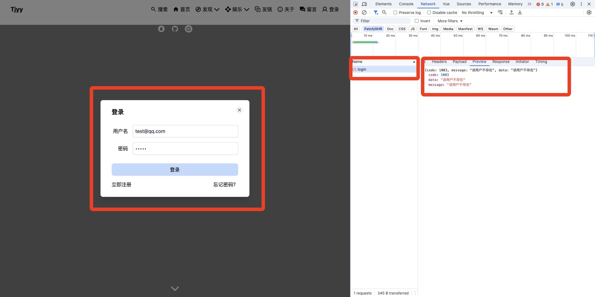
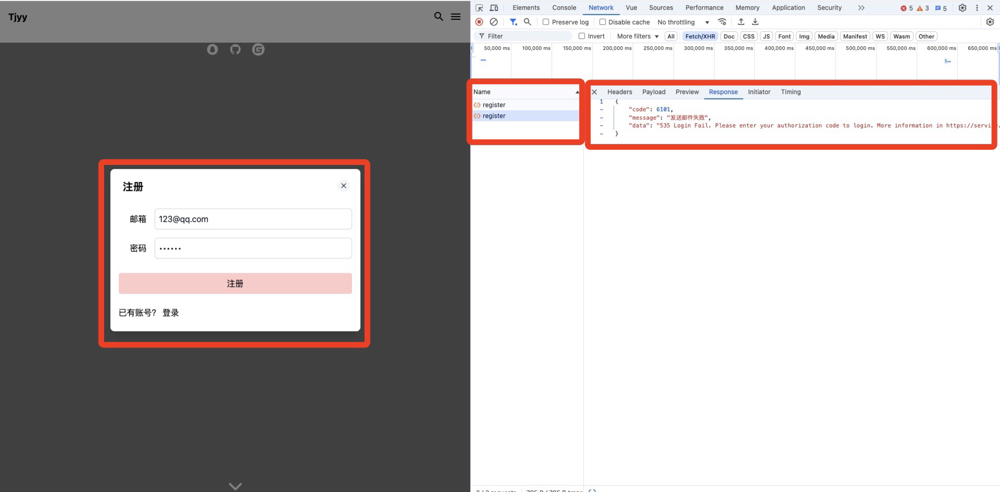
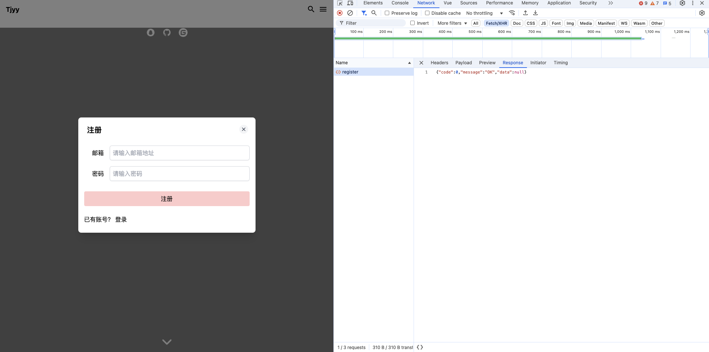
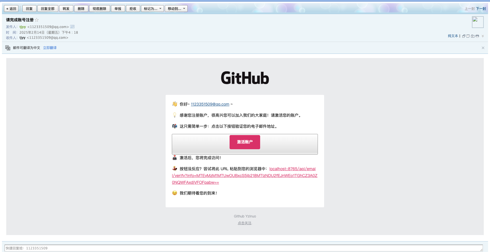
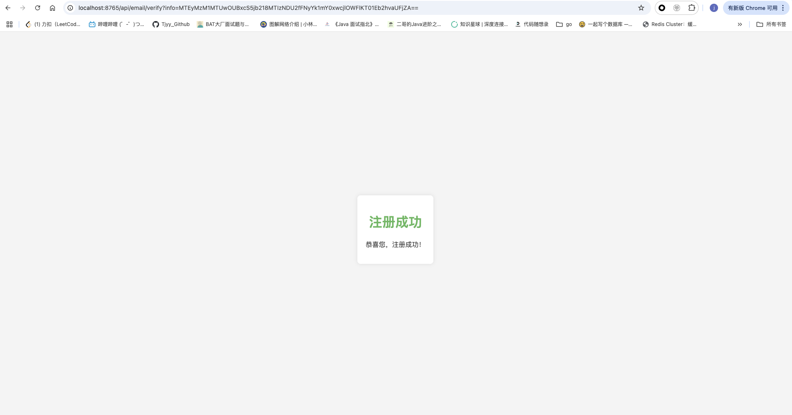
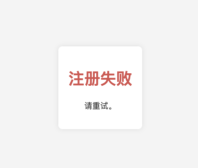
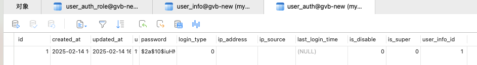
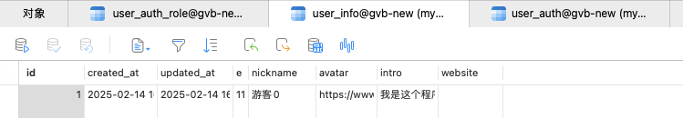
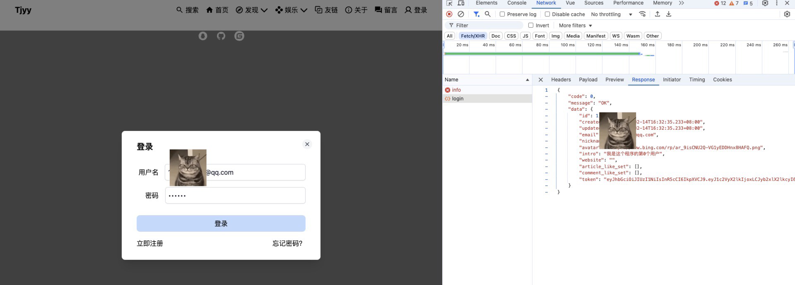
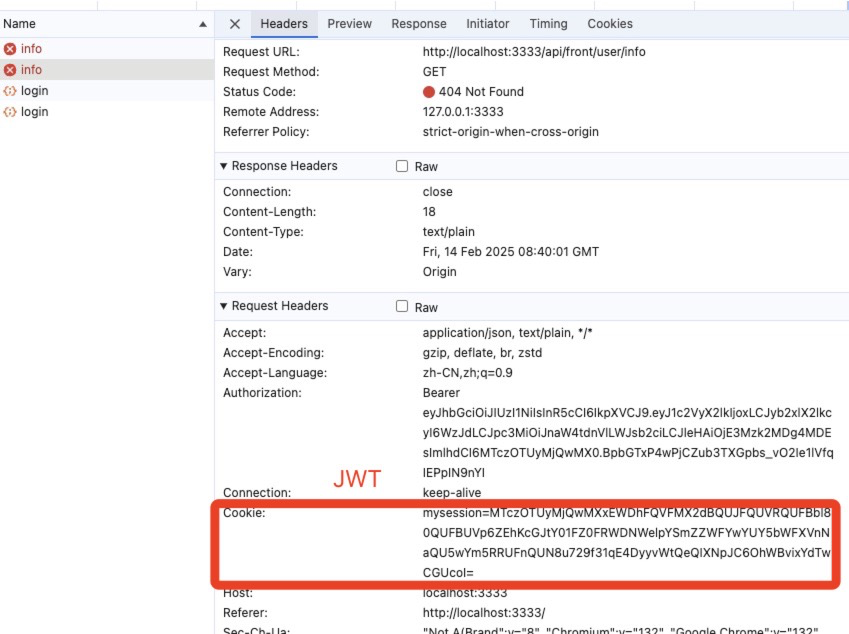

# 第十三章 gin-blog-server 通用接口

## 13.1 概述

这些接口都属于公开的、无需用户登录或鉴权的基础接口。主要用于用户认证（登录、注册、退出）、系统配置（获取和更新配置）、以及一些常见的操作（如邮箱验证和信息上报）。这些接口通常是应用中最基础、最常见的操作，适用于大多数不需要权限验证的功能。

**而且，通用接口并不区分是前台界面还是后台界面：**

- **认证相关**：`/login`, `/register`, `/logout`
- **配置相关**：`/config`（获取和更新）
- **辅助功能**：`/report`, `/email`, `/verify`

**详细接口功能分为：**

1. **登录接口** (`POST /api/login`):
   - **描述**：该接口用于用户登录。通常，用户提供用户名和密码，后端验证后会生成一个认证令牌（如 JWT），并返回给客户端。
   - **操作**：用户提交登录请求，后端验证凭证，并返回登录状态或错误信息。
2. **注册接口** (`POST /api/register`):
   - **描述**：该接口用于新用户注册。用户提供注册信息（如用户名、密码、邮箱等），后端进行验证和存储。
   - **操作**：新用户提交注册请求，后端进行必要的检查（如用户名是否已存在）并注册用户。
3. **退出登录接口** (`GET /api/logout`):
   - **描述**：该接口用于用户退出登录。通常，服务器会使该用户的会话或认证令牌失效。
   - **操作**：用户请求退出，后端会清除用户的会话或认证信息，并返回退出状态。
4. **上报信息接口** (`POST /api/report`):
   - **描述**：该接口用于上报信息，可能用于记录某些用户行为或数据。
   - **操作**：客户端提交一些数据或信息，后端记录、处理或存储这些信息。
5. **获取配置接口** (`GET /api/config`):
   - **描述**：该接口用于获取系统或应用的配置信息。
   - **操作**：客户端请求配置，后端返回相关配置信息，通常是 JSON 格式的数据。
6. **更新配置接口** (`PATCH /api/config`):
   - **描述**：该接口用于更新配置。与获取配置接口不同，这个接口需要用户权限来修改配置。
   - **操作**：客户端提交新的配置信息，后端会根据请求更新配置项。
7. **邮箱验证接口** (`GET /api/email/verify`):
   - **描述**：该接口用于发送邮箱验证码或验证邮箱地址。常用于注册、找回密码等流程中验证用户身份。
   - **操作**：客户端请求发送验证邮件，后端会根据用户提供的邮箱发送验证码或验证邮件。


## 13.2 登陆接口 - login

### 13.2.1 LoginReq 和 LoginVO

internal/handle/handle_auth.go

```go
// LoginReq 发送的登陆请求
type LoginReq struct {
	Username string `json:"username" binding:"required"`
	Password string `json:"password" binding:"required"`
}

// LoginVO 登陆信息返回给前端的数据
type LoginVO struct {
	model.UserInfo

	// 点赞 Set： 用于记录用户点赞过的文章，评论
	ArticleLikeSet []string `json:"article_like_set"`
	CommentLikeSet []string `json:"comment_like_set"`
	Token          string   `json:"token"`
}
```

**在 Gin 框架中，绑定（binding）是指将客户端传来的请求数据与 Go 语言中的结构体进行匹配。Gin 支持根据请求体中的 JSON 数据、查询参数、表单数据等进行绑定。根据你提供的请求数据和 Go 语言结构体，Gin 会根据以下规则进行绑定：**

1. **请求数据和结构体字段名匹配**

- password: "11111" 和 username: "test@qq.com" 是 JSON 请求体中的字段。Gin 会查找请求体中的字段与结构体中的字段进行匹配。由于你传入的是 JSON 数据，Gin 会通过结构体标签 json:"username" 和 json:"password" 来找到与请求数据中字段相对应的结构体字段。
  - `username` 字段会与请求体中的 `username` 字段匹配。
  - `password` 字段会与请求体中的 `password` 字段匹配。

2. **`binding` 标签**

- 在结构体中使用了 `binding:"required"` 标签，这表示这些字段是必填的，必须在请求体中提供相应的数据。如果缺少这些字段，Gin 会返回 400 错误，提示缺少必填字段。

在你的 `LoginReq` 结构体中，`Username` 和 `Password` 都有 `binding:"required"` 标签，因此：

- 请求中必须包含 `username` 和 `password` 字段。
- 如果请求中缺少这两个字段中的任何一个，Gin 会返回一个错误响应。

3. **请求方式和内容类型**

- 由于你提供的是一个 JSON 请求体，客户端发送的请求头需要包括 `Content-Type: application/json`，这样 Gin 才会将请求体解析为 JSON 数据，并将其绑定到 `LoginReq` 结构体上。

4. **绑定过程**

- **JSON 数据解析**：Gin 会读取请求体的 JSON 数据，并根据 `json` 标签将数据绑定到结构体的字段上。
- **`binding` 标签校验**：在绑定完成后，Gin 会自动进行校验（比如字段是否存在、是否为必填等）。如果 `required` 校验失败，Gin 会返回一个详细的错误响应。


### 13.2.2 存储到数据库的相关数据结构

internal/model/user.go

```go
// UserInfo 代表用户的个人信息
type UserInfo struct {
	Model
	Email    string `json:"email" gorm:"type:varchar(30)"`                    // 用户的邮箱，最大长度30字符，保存用户的电子邮件地址
	Nickname string `json:"nickname" gorm:"unique;type:varchar(30);not null"` // 用户的昵称，唯一，最大长度30字符，不能为空
	Avatar   string `json:"avatar" gorm:"type:varchar(1024);not null"`        // 用户头像，最大长度1024字符，不能为空
	Intro    string `json:"intro" gorm:"type:varchar(255)"`                   // 用户个人简介，最大长度255字符，用于描述用户的个人信息或介绍
	Website  string `json:"website" gorm:"type:varchar(255)"`                 // 用户的个人网站链接，最大长度255字符，用于存储用户的官网、博客等链接
}
```

internal/model/auth.go

```go
// UserAuth 代表用户认证信息
type UserAuth struct {
	Model
	Username      string     `gorm:"unique;type:varchar(50)" json:"username"`           // 用户名，唯一，最大长度为50
	Password      string     `gorm:"type:varchar(100)" json:"-"`                        // 密码，最大长度为100，不会被JSON序列化
	LoginType     int        `gorm:"type:tinyint(1);comment:登录类型" json:"login_type"`    // 登录类型，Tinyint 类型，表示不同的登录方式（例如：用户名/密码、第三方登录等）
	IpAddress     string     `gorm:"type:varchar(20);comment:登录IP地址" json:"ip_address"` // 登录IP地址，最大长度为20
	IpSource      string     `gorm:"type:varchar(50);comment:IP来源" json:"ip_source"`    // IP来源，最大长度为50
	LastLoginTime *time.Time `json:"last_login_time"`                                   // 上次登录时间，类型为指针，以便为null
	IsDisable     bool       `json:"is_disable"`                                        // 是否禁用，布尔值，表示该用户是否被禁用
	IsSuper       bool       `json:"is_super"`                                          // 是否超级管理员，布尔值，超级管理员只能由后台设置
	UserInfoId    int        `json:"user_info_id"`                                      // 关联的用户信息表ID
	UserInfo      *UserInfo  `json:"info"`                                              // 关联的用户信息
	Roles         []*Role    `json:"roles" gorm:"many2many:user_auth_role"`             // 用户角色，表示与角色的多对多关系
}

// Role 代表系统中的角色
type Role struct {
	Model
	Name      string `gorm:"unique" json:"name"`  // 角色名称，唯一
	Label     string `gorm:"unique" json:"label"` // 角色标签，唯一
	IsDisable bool   `json:"is_disable"`          // 是否禁用该角色，布尔值

	Resources []Resource `json:"resources" gorm:"many2many:role_resource"` // 角色拥有的资源，表示与资源的多对多关系
	Menus     []Menu     `json:"menus" gorm:"many2many:role_menu"`         // 角色拥有的菜单，表示与菜单的多对多关系
	Users     []UserAuth `json:"users" gorm:"many2many:user_auth_role"`    // 角色关联的用户，表示与用户的多对多关系
}

// Resource 代表系统中的资源
type Resource struct {
	Model
	Name      string `gorm:"unique;type:varchar(50)" json:"name"`    // 资源名称，最大长度为50，唯一
	ParentId  int    `json:"parent_id"`                              // 父资源ID，表示资源之间的层级关系
	Url       string `gorm:"type:varchar(255)" json:"url"`           // 资源的URL地址
	Method    string `gorm:"type:varchar(10)" json:"request_method"` // 请求方法，例如 GET, POST, PUT, DELETE 等
	Anonymous bool   `json:"is_anonymous"`                           // 是否是匿名访问的资源，布尔值，表示该资源是否不需要登录

	Roles []*Role `json:"roles" gorm:"many2many:role_resource"` // 资源关联的角色，表示与角色的多对多关系
}

/*
菜单设计:

目录: catalogue === true
  - 如果是目录，作为单独项，不展开子菜单（例如 "首页", "个人中心"）
  - 如果不是目录，且 parent_id 为 0，则为一级菜单，可以展开子菜单（例如 "文章管理" 下有 "文章列表", "文章分类", "文章标签" 等子菜单）
  - 如果不是目录，且 parent_id 不为 0，则为二级菜单

隐藏: hidden
  - 隐藏则不显示在菜单栏中

外链: external, external_link
  - 如果是外链，如果设置为外链，则点击后会在新窗口打开
*/

// Menu 代表系统中的菜单
type Menu struct {
	Model
	ParentId     int    `json:"parent_id"`                                                  // 父菜单ID，用于标识菜单的层级关系
	Name         string `gorm:"uniqueIndex:idx_name_and_path;type:varchar(20)" json:"name"` // 菜单名称，唯一索引
	Path         string `gorm:"uniqueIndex:idx_name_and_path;type:varchar(50)" json:"path"` // 菜单的路由地址，唯一索引
	Component    string `gorm:"type:varchar(50)" json:"component"`                          // 菜单组件路径
	Icon         string `gorm:"type:varchar(50)" json:"icon"`                               // 菜单图标
	OrderNum     int8   `json:"order_num"`                                                  // 菜单排序
	Redirect     string `gorm:"type:varchar(50)" json:"redirect"`                           // 菜单重定向地址
	Catalogue    bool   `json:"is_catalogue"`                                               // 是否为目录，目录项不展开子菜单
	Hidden       bool   `json:"is_hidden"`                                                  // 是否隐藏该菜单，隐藏则不显示在菜单栏
	KeepAlive    bool   `json:"keep_alive"`                                                 // 是否缓存该菜单
	External     bool   `json:"is_external"`                                                // 是否为外链菜单
	ExternalLink string `gorm:"type:varchar(255)" json:"external_link"`                     // 外链地址

	Roles []*Role `json:"roles" gorm:"many2many:role_menu"` // 菜单关联的角色，表示与角色的多对多关系
}

type UserAuthRole struct {
	UserAuthId int `gorm:"primaryKey;uniqueIndex:idx_user_auth_role"`
	RoleId     int `gorm:"primaryKey;uniqueIndex:idx_user_auth_role"`
}
```


### 13.2.3 JWT-Token

**JWT（JSON Web Token）是一种轻量级的身份验证和信息交换的标准格式。它通常用于分布式系统和现代 Web 应用中，尤其是在用户身份验证和授权过程中。在当前的登陆逻辑中，JWT 的用途和工作原理如下：**

- **用途**：JWT 可以用于身份验证，通过生成一个包含用户信息（如用户ID、角色等）的令牌，当用户成功登录时，服务器生成 JWT 并返回给客户端。
- **工作原理**：客户端在后续请求中将 JWT 附带在请求头中（通常是 `Authorization` 头部），服务器通过解析并验证该令牌来确认请求的用户身份。

**internal/utils/jwt/jwt.go**

```go
package jwt

import (
	"errors"
	"github.com/golang-jwt/jwt/v4"
	"time"
)

var (
	// 错误信息常量，表示不同类型的 Token 错误
	ErrTokenExpired     = errors.New("token 已经过期，请重新登录")  // Token 已过期
	ErrTokenNotValidYet = errors.New("token 无效，请重新登录")    // Token 尚未生效
	ErrTokenMalFormed   = errors.New("token 不正确， 请重新登陆")  // Token 格式错误
	ErrTokenInvalid     = errors.New("这不是一个 token，请重新登录") // Token 无效
)

// MyClaims 自定义的 Claims 结构体，用于保存自定义的 payload 数据
type MyClaims struct {
	UserId               int   `json:"user_id"`  // 用户ID
	RoleIds              []int `json:"role_ids"` // 用户角色ID列表
	jwt.RegisteredClaims       // 内嵌 jwt.RegisteredClaims，包含 JWT 的标准注册字段（如过期时间、签发者等）
}

// GenToken 生成一个新的 JWT Token
// 参数解释：
// secret：用于签名的密钥（通常是一个私钥或者密钥）
// issuer：签发者的标识
// expireHour：Token 过期的小时数
// userId：用户ID
// roleIds：用户的角色ID数组
func GenToken(secret, issuer string, expireHour, userId int, roleIds []int) (string, error) {
	// 创建 MyClaims 实例，填充 JWT 的 Claims 数据
	claims := MyClaims{
		UserId:  userId,  // 设置用户ID
		RoleIds: roleIds, // 设置用户角色ID列表
		RegisteredClaims: jwt.RegisteredClaims{
			Issuer:    issuer,                                                                    // 设置 Token 的签发者
			ExpiresAt: jwt.NewNumericDate(time.Now().Add(time.Duration(expireHour) * time.Hour)), // 设置 Token 的过期时间
			IssuedAt:  jwt.NewNumericDate(time.Now()),                                            // 设置 Token 的签发时间
		},
	}

	// 使用 HS256 签名方法创建一个新的 JWT Token
	token := jwt.NewWithClaims(jwt.SigningMethodHS256, claims)
	// 返回签名后的 token 字符串
	return token.SignedString([]byte(secret)) // 使用 secret 对 Token 进行签名并返回
}

// ParseToken 解析 JWT Token 并验证其合法性
// 参数解释：
// secret：用于验证签名的密钥（通常是一个私钥或公钥）
// token：要解析的 JWT Token 字符串
func ParseToken(secret, token string) (*MyClaims, error) {
	// 解析 Token，并将解析出来的 Claims 存入 MyClaims 结构体中
	jwtToken, err := jwt.ParseWithClaims(token, &MyClaims{}, func(token *jwt.Token) (interface{}, error) {
		// 使用 secret 来验证 token 的签名
		return []byte(secret), nil
	})

	if err != nil {
		// 错误类型判断
		switch vError, ok := err.(jwt.ValidationError); ok {
		case vError.Errors&jwt.ValidationErrorMalformed != 0:
			// Token 格式错误
			return nil, ErrTokenMalFormed
		case vError.Errors&jwt.ValidationErrorExpired != 0:
			// Token 已经过期
			return nil, ErrTokenExpired
		case vError.Errors&jwt.ValidationErrorNotValidYet != 0:
			// Token 尚未生效
			return nil, ErrTokenNotValidYet
		default:
			// 其他验证错误
			return nil, ErrTokenInvalid
		}
	}

	// 判断 Token 是否有效，如果有效则返回 Claims，否则返回无效的错误
	if claims, ok := jwtToken.Claims.(*MyClaims); ok && jwtToken.Valid {
		// 返回有效的 Claims
		return claims, nil
	}

	// Token 无效，返回错误
	return nil, ErrTokenInvalid
}
```

**internal/utils/jwt/jwt_test.go**

```go
package jwt

import (
	"github.com/stretchr/testify/assert"
	"testing"
)

func TestGenAndParseToken(t *testing.T) {
	secret := "secret"
	issuer := "issuer"
	expire := 10

	token, err := GenToken(secret, issuer, expire, 1, []int{1, 2})
	assert.Nil(t, err)
	assert.NotEmpty(t, token)

	mc, err := ParseToken(secret, token)
	assert.Nil(t, err)
	assert.Equal(t, 1, mc.UserId)
	assert.Len(t, mc.RoleIds, 2)
}

func TestParseTokenError(t *testing.T) {
	tokenString := "tokenString"

	_, err := ParseToken("secret", tokenString)
	assert.ErrorIs(t, err, ErrTokenMalFormed)
}
```


### 13.2.4 核心逻辑

**首先需要更新 internal/model/z_base.go:11 中的  MakeMigrate 以自动创建对应的数据库表：**

```go
package model

import (
	"gorm.io/gorm"
	"time"
)

// MakeMigrate 迁移数据表，在没有数据表结构变更时候，建议注释不执行
// 只支持创建表、增加表中没有的字段和索引
// 为了保护数据，并不支持改变已有的字段类型或删除未被使用的字段
func MakeMigrate(db *gorm.DB) error {
	// 设置表关联
	// 用于显式地配置一个多对多关系，其中 UserAuth 和 Role 通过一个关联表 UserAuthRole 进行关联。
	db.SetupJoinTable(&UserAuth{}, "Roles", &UserAuthRole{})
	db.SetupJoinTable(&Role{}, "Menus", &RoleMenu{})
	db.SetupJoinTable(&Role{}, "Resources", &RoleResource{})
	db.SetupJoinTable(&Role{}, "Users", &UserAuthRole{})

	return db.AutoMigrate(
		&Config{}, // 网站设置

		&UserAuth{},     // 用户验证
		&Role{},         // 角色
		&Menu{},         // 菜单
		&Resource{},     // 资源（接口）
		&UserAuthRole{}, // 用户-角色 关联
	)
}

type Model struct {
	ID        int       `json:"id" gorm:"primary_key;auto_increment"`
	CreatedAt time.Time `json:"created_at"`
	UpdatedAt time.Time `json:"updated_at"`
}

```


**internal/model/user.go  - 负责 user 与数据库中数据的交互：**

```go
// GetUserInfoById 根据用户的 ID 从数据库中查询用户信息
// 参数:
//
//	db - GORM 数据库连接对象，用于执行查询操作
//	id - 用户的 ID，作为查询条件
//
// 返回:
//   - *UserInfo：指向查询到的 UserInfo 对象的指针。如果未找到用户，返回空字段
//   - error：查询过程中发生的错误。如果没有错误，则返回 nil
func GetUserInfoById(db *gorm.DB, id int) (*UserInfo, error) {
	var userInfo UserInfo
	result := db.Model(&userInfo).Where("id", id).First(&userInfo)
	return &userInfo, result.Error
}

// GetUserAuthInfoByName 根据用户名查询用户认证信息
// 参数:
//
//	db - GORM 的数据库实例，用于执行查询
//	name - 用户名，用于模糊匹配查询用户认证信息
//
// 返回:
//   - 如果找到用户，返回用户认证信息和 nil 错误
//   - 如果未找到用户或查询出错，返回 nil 和错误信息
func GetUserAuthInfoByName(db *gorm.DB, name string) (*UserAuth, error) {
	var userAuth UserAuth

	// 使用 GORM 构建查询，进行模糊查询（LIKE）以根据用户名查找用户
	result := db.Model(&userAuth).Where("username LIKE ?", name).First(&userAuth)

	// 检查查询结果是否出错，如果是记录未找到的错误（ErrRecordNotFound），则返回 nil 和错误
	if result.Error != nil && errors.Is(result.Error, gorm.ErrRecordNotFound) {
		return nil, result.Error
	}

	// 返回找到的用户认证信息和可能的其他错误
	return &userAuth, result.Error
}

// UpdateUserLoginInfo 更新用户登录信息
func UpdateUserLoginInfo(db *gorm.DB, id int, ipAddress, ipSource string) error {
	now := time.Now()
	userAuth := UserAuth{
		IpAddress:     ipAddress,
		IpSource:      ipSource,
		LastLoginTime: &now,
	}
	result := db.Where("id", id).Updates(userAuth)
	return result.Error
}
```

**internal/handle/handle_auth.go:35  - 负责处理请求并返回响应：**

```go
// @Summary 登录
// @Description 登录
// @Tags UserAuth
// @Param form body LoginReq true "登录"
// @Accept json
// @Produce json
// @Success 0 {object} Response[LoginVO]
// @Router /login [post]
func (*UserAuth) Login(c *gin.Context) {
	// 创建 LoginReq 结构体用于绑定前端传来的 JSON 数据
	var req LoginReq

	// 绑定请求体 JSON 数据到 req 结构体
	if err := c.ShouldBindJSON(&req); err != nil {
		// 如果绑定数据失败，返回错误信息
		ReturnError(c, global.ErrRequest, err)
		return
	}

	// 获取数据库和 Redis 客户端实例
	db := GetDB(c)
	rdb := GetRDB(c)

	// 查询数据库，获取用户的身份信息（UserAuth）
	userAuth, err := model.GetUserAuthInfoByName(db, req.Username)
	if err != nil {
		// 如果没有找到用户，返回用户不存在的错误
		if errors.Is(err, gorm.ErrRecordNotFound) {
			ReturnError(c, global.ErrUserNotExist, nil)
			return
		}
		// 如果查询发生数据库操作错误，返回错误
		ReturnError(c, global.ErrDbOp, err)
		return
	}

	// 检查传入的密码与数据库中存储的密码是否匹配
	if !utils.BcryptCheck(req.Password, userAuth.Password) {
		// 如果密码不匹配，返回密码错误
		ReturnError(c, global.ErrPassword, nil)
		return
	}

	// 获取请求中的 IP 地址和 IP 来源信息
	// FIXME: 可能无法正确读取 IP 地址，这需要解决
	ipAddress := utils.IP.GetIpAddress(c)
	ipSource := utils.IP.GetIpSourceSimpleIdle(ipAddress)

	// 根据 UserAuth 中的 UserInfoId 查询用户信息
	userInfo, err := model.GetUserInfoById(db, userAuth.UserInfoId)
	if err != nil {
		// 如果没有找到用户信息，返回错误
		if errors.Is(err, gorm.ErrRecordNotFound) {
			ReturnError(c, global.ErrUserNotExist, nil)
			return
		}
		// 数据库操作出错，返回数据库错误
		ReturnError(c, global.ErrDbOp, err)
		return
	}

	// 获取用户的角色 ID 列表
	roleIds, err := model.GetRoleIdsByUserId(db, userAuth.ID)
	if err != nil {
		// 获取角色信息出错，返回错误
		ReturnError(c, global.ErrDbOp, err)
		return
	}

	// 获取用户在 Redis 中的文章点赞记录
	articleLikeSet, err := rdb.SMembers(rctx, global.ARTICLE_USER_LIKE_SET+strconv.Itoa(userAuth.ID)).Result()
	if err != nil {
		// 获取文章点赞信息出错，返回 Redis 操作错误
		ReturnError(c, global.ErrRedisOp, err)
		return
	}

	// 获取用户在 Redis 中的评论点赞记录
	commentLikeSet, err := rdb.SMembers(rctx, global.COMMENT_USER_LIKE_SET+strconv.Itoa(userAuth.ID)).Result()
	if err != nil {
		// 获取评论点赞信息出错，返回 Redis 操作错误
		ReturnError(c, global.ErrRedisOp, err)
		return
	}

	// 登录信息验证通过后，生成 JWT Token
	// UUID 生成方法：可以使用 ip 地址、浏览器信息和操作系统信息来生成唯一标识符（具体实现可调整）
	// 这里使用 jwt.GenToken 来生成 Token
	conf := global.GetConfig().JWT
	token, err := jwt.GenToken(conf.Secret, conf.Issuer, int(conf.Expire), userAuth.ID, roleIds)
	if err != nil {
		// Token 生成失败，返回错误
		ReturnError(c, global.ErrTokenCreate, err)
		return
	}

	// 更新用户的登录信息，包括 IP 地址和上次登录时间
	err = model.UpdateUserLoginInfo(db, userAuth.ID, ipAddress, ipSource)
	if err != nil {
		// 更新登录信息失败，返回数据库操作错误
		ReturnError(c, global.ErrDbOp, err)
		return
	}

	// 登录成功，记录日志
	slog.Info("用户登录成功: " + userAuth.Username)

	// 使用 Gin 的 session 来存储用户的认证信息（UserAuth ID）
	session := sessions.Default(c)
	session.Set(global.CTX_USER_AUTH, userAuth.ID)
	session.Save() // 保存 session

	// 删除 Redis 中的用户离线状态标识
	offlineKey := global.OFFLINE_USER + strconv.Itoa(userAuth.ID)
	rdb.Del(rctx, offlineKey).Result()

	// 返回成功响应，携带用户信息、文章点赞记录、评论点赞记录和 JWT Token
	ReturnSuccess(c, LoginVO{
		UserInfo:       *userInfo,      // 返回用户信息
		ArticleLikeSet: articleLikeSet, // 返回用户的文章点赞记录
		CommentLikeSet: commentLikeSet, // 返回用户的评论点赞记录
		Token:          token,          // 返回生成的 JWT Token
	})
}
```




## 13.3 注册接口 - register

**要完成注册接口，需要同时完成 13.8 email/verify 接口，其核心逻辑如下：**

1. 点击注册之后，首先检查用户名是否存在，避免重复注册
2. 其次把用户输入的信息加密保存在 redis 中，等待验证
3. register 接口会触发发送邮箱，注册邮箱会收到对应的邮件
4. 点击邮件中的链接，其中会渲染一个 html 网址，点击链接可以向接口发送 localhost/api/email/verify?info={info} 请求，`info := Encode(email + "|" + password + "|" + code)`，因为采用 Encode 编码

5. 触发 localhost/api/email/verify?info={info} 接口，将对应的 info 信息中的用户名和密码存储到数据库中

------

internal/manager.go

```go
base.POST("/register", userAuthAPI.Register) // 注册
```

**注册的核心逻辑：**

```go
// Register 完成注册功能
// 首先检查用户名是否存在，避免重复注册；其次吧用户输入的信息加密保存在 redis 中，等待验证
// 在以下情况下会出错：1-用户邮箱已经注册过；2-用户邮箱无效等原因导致邮件发送失败
// @Summary 注册
// @Description 注册
// @Tags UserAuth
// @Param form body RegisterReq true "注册"
// @Accept json
// @Produce json
// @Success 0 {object} Response[] "返回空数组"
// @Router /register [post]
func (*UserAuth) Register(c *gin.Context) {
	var req RegisterReq
	if err := c.ShouldBindJSON(&req); err != nil {
		ReturnError(c, global.ErrRequest, err)
		return
	}
	// 格式化用户名
	req.Username = utils.Format(req.Username)

	// 检查用户名是否存在，避免重复注册
	auth, err := model.GetUserAuthInfoByName(GetDB(c), req.Username)
	if err != nil {
		var flag = false
		if errors.Is(err, gorm.ErrRecordNotFound) {
			flag = true
		}
		if !flag {
			ReturnError(c, global.ErrDbOp, err)
			return
		}
	}

	// 用户名重复，不能正常进行注册
	if auth != nil {
		ReturnError(c, global.ErrUserExist, err)
		return
	}

	// 通过邮箱验证后才可以完成注册
	info := utils.GenEmailVerificationInfo(req.Username, req.Password)
	err = SetMailInfo(GetRDB(c), info, 15*time.Minute)
	if err != nil {
		ReturnError(c, global.ErrRedisOp, err)
		return
	}

	EmailData := utils.GetEmailData(req.Username, info)
	err = utils.SendEmail(req.Username, EmailData)
	if err != nil {
		ReturnError(c, global.ErrSendEmail, err)
		return
	}

	ReturnSuccess(c, nil)
}
```

对于操作来讲，首先需要将 config.yml 中的邮箱配置进行配置好：From -> SmtpPass ->   SmtpUser

```yml
Email:
  Host: "smtp.qq.com" # 服务器地址, 例如 smtp.qq.com 前往要发邮件的邮箱查看其 smtp 协议
  Port: 465  # 前往要发邮件的邮箱查看其 smtp 协议端口, 大多为 465
  From: "" # 发件人 (邮箱)
  SmtpPass: "" # 密钥, 不是邮箱登录密码, 是开启 smtp 服务后获取的一串验证码
  SmtpUser: "" # 发件人昵称, 通常为自己的邮箱名
```

之后，我们进行注册操作：





之后我们继续道 13.8 中邮箱验证，完成注册操作


## 13.4 退出登录 - logout


## 13.5 上报信息 - report


## 13.6 获取配置 - config - get


## 13.7 更新配置 - config - patch


## 13.8 邮箱验证 - email/verify



当用户点击邮箱中的链接时，会携带 info（加密后的帐号密码）向这个接口发送请求。Verify 会检查 info 是否存在 redis 中，若存在则认证成功，完成注册。

会在以下方面出错： 

1. 发送信息中没有info 
2. info不存在redis中(已过期) 
3. 创造新用户失败（数据库操作失败

**internal/manager.go**

```
base.GET("/email/verify", userAuthAPI.VerifyCode) // 邮箱验证
```

internal/handle/handle_auth.go

```go
// VerifyCode 邮箱验证
// 当用户点击邮箱中的链接时，会携带info（加密后的帐号密码）向这个接口发送请求。
// Verify会检查info是否存在redis中，若存在则认证成功，完成注册
// 会在以下方面出错： 1. 发送信息中没有info 2. info不存在redis中(已过期) 3. 创造新用户失败（数据库操作失败）
func (*UserAuth) VerifyCode(c *gin.Context) {
	var code string
	if code = c.Query("info"); code == "" {
		returnErrorPage(c)
		return
	}
	// 验证是否在 redis 数据库中
	ifExist, err := GetMailInfo(GetRDB(c), code)
	if err != nil {
		returnErrorPage(c)
		return
	}
	if !ifExist {
		returnErrorPage(c)
		return
	}

	err = DeleteMailInfo(GetRDB(c), code)
	if err != nil {
		returnErrorPage(c)
		return
	}

	// 从 code 中解析出来 用户名 和 密码
	username, password, err := utils.ParseEmailVerificationInfo(code)
	if err != nil {
		returnErrorPage(c)
		return
	}

	// 注册用户
	_, _, _, err = model.CreateNewUser(GetDB(c), username, password)
	if err != nil {
		returnErrorPage(c)
		return
	}

	// 注册成功，返回成功页面
	c.Data(http.StatusOK, "text/html; charset=utf-8", []byte(`
        <!DOCTYPE html>
        <html lang="zh-CN">
        <head>
            <meta charset="UTF-8">
            <meta name="viewport" content="width=device-width, initial-scale=1.0">
            <title>注册成功</title>
            <style>
                body {
                    font-family: Arial, sans-serif;
                    background-color: #f4f4f4;
                    display: flex;
                    justify-content: center;
                    align-items: center;
                    height: 100vh;
                    margin: 0;
                }
                .container {
                    background-color: #fff;
                    padding: 20px;
                    border-radius: 8px;
                    box-shadow: 0 0 10px rgba(0, 0, 0, 0.1);
                    text-align: center;
                }
                h1 {
                    color: #5cb85c;
                }
                p {
                    color: #333;
                }
            </style>
        </head>
        <body>
            <div class="container">
                <h1>注册成功</h1>
                <p>恭喜您，注册成功！</p>
            </div>
        </body>
        </html>
    `))
}

// c.Data 可以用来直接返回原始字节数据，而不是使用 Gin 中的 c.JSON、c.String 等方法。它特别适合于返回 非结构化数据，例如 HTML 页面、文本或文件。
func returnErrorPage(c *gin.Context) {
	c.Data(http.StatusInternalServerError, "text/html; charset=utf-8", []byte(`
        <!DOCTYPE html>
        <html lang="zh-CN">
        <head>
            <meta charset="UTF-8">
            <meta name="viewport" content="width=device-width, initial-scale=1.0">
            <title>注册失败</title>
            <style>
                body {
                    font-family: Arial, sans-serif;
                    background-color: #f4f4f4;
                    display: flex;
                    justify-content: center;
                    align-items: center;
                    height: 100vh;
                    margin: 0;
                }
                .container {
                    background-color: #fff;
                    padding: 20px;
                    border-radius: 8px;
                    box-shadow: 0 0 10px rgba(0, 0, 0, 0.1);
                    text-align: center;
                }
                h1 {
                    color: #d9534f;
                }
                p {
                    color: #333;
                }
            </style>
        </head>
        <body>
            <div class="container">
                <h1>注册失败</h1>
                <p>请重试。</p>
            </div>
        </body>
        </html>
    `))
}

```

**点击激活账户之后，或者将`localhost::8765/api/email/verify?info=MTEyMzM1MTUwOUBxcS5jb218MTIzNDU2fEJnWEo1TGhCZ3A0Z0NQWFAxdjVFOFpabw==`复制到浏览器之后，会跳转到：**



如果再刷新一下，会启动防止重复注册的流程，报错如下：



**然后我们可以去尝试查看数据库中的数据，并尝试登陆操作：**





**登陆成功账号如下：成功携带了 token 返回**



但是，由于还没有实现 info 接口，所以登陆还不能够完全登陆。下面的info接口会携带着 jwt token 去进行后端请求

