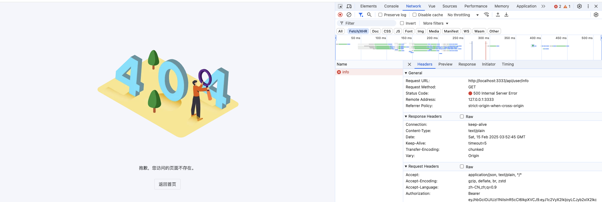
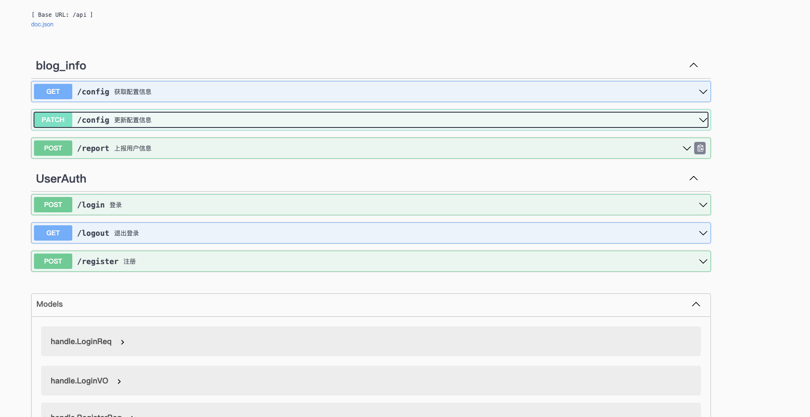

# 第十四章 gin-blog-server 配置相关以及上报信息

## 14.1 概述

这些接口都属于公开的、无需用户登录或鉴权的基础接口。主要用于用户认证（登录、注册、退出）、系统配置（获取和更新配置）、以及一些常见的操作（如邮箱验证和信息上报）。这些接口通常是应用中最基础、最常见的操作，适用于大多数不需要权限验证的功能。

**而且，通用接口并不区分是前台界面还是后台界面：**

- **认证相关**：`/login`, `/register`, `/logout`
- **配置相关**：`/config`（获取和更新）
- **辅助功能**：`/report`, `/email`, `/verify`

**本章详细接口功能分为：**

1. **上报信息接口** (`POST /api/report`):
   - **描述**：该接口用于上报信息，可能用于记录某些用户行为或数据。
   - **操作**：客户端提交一些数据或信息，后端记录、处理或存储这些信息。
2. **获取配置接口** (`GET /api/config`):
   - **描述**：该接口用于获取系统或应用的配置信息。
   - **操作**：客户端请求配置，后端返回相关配置信息，通常是 JSON 格式的数据。
3. **更新配置接口** (`PATCH /api/config`):
   - **描述**：该接口用于更新配置。与获取配置接口不同，这个接口需要用户权限来修改配置。
   - **操作**：客户端提交新的配置信息，后端会根据请求更新配置项。

在 manager.go 中统一添加：

```
base.POST("/report", blogInfoAPI.Report)          // 上报信息
base.GET("/config", blogInfoAPI.GetConfigMap)     // 获取配置
base.PATCH("/config", blogInfoAPI.UpdateConfig)   // 更新配置
```


## 14.2 上报信息 - report

主要功能为上报用户信息，进行相应的统计操作

触发时间：用户登进后台时上报信息

internal/handle/handle_bloginfo.go

```go
type BlogInfo struct{}

// Report 上报用户信息，进行相应的统计操作
// @Summary 上报用户信息
// @Description 用户登进后台时上报信息
// @Tags blog_info
// @Accept json
// @Produce json
// @Param data body object true "用户信息"
// @Success 0 {object} Response[any]
// @Router /report [post]
func (*BlogInfo) Report(c *gin.Context) {
	rdb := GetRDB(c)

	ipAddress := utils.IP.GetIpAddress(c)
	userAgent := utils.IP.GetUserAgent(c)
	browser := userAgent.Name + " " + userAgent.Version.String()
	os := userAgent.OS + " " + userAgent.OSVersion.String()
	uuid := utils.MD5(ipAddress + browser + os)

	ctx := context.Background()

	// 当前用户没有被统计成为访问人数（不在 用户set 中）
	if !rdb.SIsMember(ctx, global.KEY_UNIQUE_VISITOR_SET, uuid).Val() {
		// 统计地域信息: 中国|0|江苏省|苏州市|电信
		ipSource := utils.IP.GetIpSource(ipAddress)
		// 获取到具体的位置, 提取出其中的 省份
		if ipSource != "" {
			address := strings.Split(ipSource, "|")
			province := strings.ReplaceAll(address[2], "省", "")
			rdb.HIncrBy(ctx, global.VISITOR_AREA, province, 1)
		} else {
			rdb.HIncrBy(ctx, global.VISITOR_AREA, "未知", 1)
		}

		// 后台访问数量 + 1
		rdb.Incr(ctx, global.VIEW_COUNT)
		// 将当前用户记录到 用户 set 中
		rdb.SAdd(ctx, global.KEY_UNIQUE_VISITOR_SET, uuid)
	}

	ReturnSuccess(c, nil)
}
```


## 14.3 获取配置 - config - get

**首先需要分别补充从 数据库获取 config 以及从 redis 获取 config 的方法。**

**从数据库获取 config 方法如下：internal/model/config.go**

```go
// GetConfigMap 获取配置信息并返回一个映射（map），键为配置信息的 Key，值为配置的 Value。
// db: 传入的数据库连接对象，用于查询配置数据。
// 返回值：
//
//	map[string]string: 返回一个键值对映射，key 为配置信息的 Key，value 为配置的 Value。
//	error: 如果查询过程中出现错误，返回错误信息。
func GetConfigMap(db *gorm.DB) (map[string]string, error) {
	// 定义一个 Config 类型的切片，用于存储查询到的配置项。
	var configs []Config

	// 使用 GORM 的 Find 方法从数据库中查询所有配置信息，结果存储在 configs 切片中。
	result := db.Find(&configs)

	// 如果查询过程中发生错误，返回空的映射和错误信息。
	if result.Error != nil {
		return nil, result.Error
	}

	// 创建一个空的 map，用于存储配置信息的键值对。
	m := make(map[string]string)

	// 遍历查询到的配置项，将 Key 和 Value 存入到 map 中。
	for _, config := range configs {
		m[config.Key] = config.Value
	}

	// 返回构造好的 map 和 nil 错误。
	return m, nil
}
```

**从 redis 获取 config 缓存方法如下：internal/handle/cache.go**

```go
// redis context
var rctx = context.Background()

// Config
// addConfigCache 将博客配置缓存到 Redis 中
func addConfigCache(rdb *redis.Client, config map[string]string) error {
	return rdb.HMSet(rctx, global.CONFIG, config).Err()
}

// removeConfigCache 删除 Redis 中博客配置缓存
func removeConfigCache(rdb *redis.Client) error {
	return rdb.Del(rctx, global.CONFIG).Err()
}

// 从 Redis 中获取博客配置缓存
// rdb.HGetAll 如果不存在 key, 不会返回 redis.Nil 错误, 而是返回空 map
func getConfigCache(rdb *redis.Client) (cache map[string]string, err error) {
	return rdb.HGetAll(rctx, global.CONFIG).Result()
}
```

**获取配置整体逻辑为：**

1. **可以从 redis 中获取，则从 redis 中获取config 并返回**
2. **否则从 数据库中获取，并保存到 redis 之后返回对应数据**

internal/handle/handle_bloginfo.go

```go
// GetConfigMap 获取配置
// @Summary 获取配置信息
// @Description 获取配置信息
// @Tags blog_info
// @Accept json
// @Produce json
// @Param data body object true "配置信息"
// @Success 0 {object} Response[map[string]string]
// @Router /config [get]
func (*BlogInfo) GetConfigMap(c *gin.Context) {
	db := GetDB(c)
	rdb := GetRDB(c)

	// get from redis cache
	cache, err := getConfigCache(rdb)
	if err != nil {
		ReturnError(c, global.ErrRedisOp, err)
		return
	}

	if len(cache) > 0 {
		slog.Debug("get config from redis cache")
		ReturnSuccess(c, cache)
		return
	}

	// get from db
	data, err := model.GetConfigMap(db)
	if err != nil{
		ReturnError(c, global.ErrDbOp, err)
		return
	}
	
	// add to redis cache
	if err := addConfigCache(rdb, data); err != nil{
		ReturnError(c, global.ErrRedisOp, err)
		return
	}
	
	ReturnSuccess(c, data)
}
```


## 14.4 更新配置 - config - patch

更新配置

**CheckConfigMap 检查并更新配置信息**:

```go
// CheckConfigMap 检查并更新配置信息。
// db: 传入的数据库连接对象，用于执行数据库操作。
// m: 一个 map，包含配置信息的键值对，其中 Key 是配置信息的名称，Value 是要更新的配置值。
// 返回值：
//
//	error: 如果在更新过程中发生错误，则返回该错误；否则返回 nil。
func CheckConfigMap(db *gorm.DB, m map[string]string) error {
	// 使用数据库事务（Transaction）确保操作的原子性。所有操作都在同一个事务中进行，如果任何操作失败，事务会回滚。
	return db.Transaction(func(tx *gorm.DB) error {
		// 遍历传入的配置 map，对于每一个键值对执行更新操作
		for k, v := range m {
			// 使用 GORM 的 Update 方法更新配置项的值
			// `Model(Config{})` 表示要操作的模型是 Config，`Where("key", k)` 指定查询条件（根据 key 查找配置项），
			// `Update("value", v)` 表示将该配置项的 value 更新为传入的 v 值。
			result := tx.Model(Config{}).Where("key", k).Update("value", v)

			// 如果更新操作发生错误，立即返回错误并终止事务
			if result.Error != nil {
				return result.Error
			}
		}
		// 如果所有更新操作成功，返回 nil，表示事务成功
		return nil
	})
}
```

internal/handle/handle_bloginfo.go

```go
// UpdateConfig 更新配置
// @Summary 更新配置信息
// @Description 更新配置信息
// @Tags blog_info
// @Accept json
// @Produce json
// @Param data body map[string]string true "更新配置信息"
// @Success 0 {object} Response[any]
// @Router /config [patch]
func (*BlogInfo) UpdateConfig(c *gin.Context) {
	var m map[string]string
	if err := c.ShouldBindJSON(&m); err != nil {
		ReturnError(c, global.ErrRequest, err)
		return
	}

	if err := model.CheckConfigMap(GetDB(c), m); err != nil {
		ReturnError(c, global.ErrDbOp, err)
		return
	}

	// delete cache
	if err := removeConfigCache(GetRDB(c)); err != nil {
		ReturnError(c, global.ErrRedisOp, err)
		return
	}

	ReturnSuccess(c, nil)
}
```


## 14.5 暂时无法测试

**由于测试上述三个功能，需要首先登陆后台，然后当前后台接口还未搭建完毕：**



因此，暂时先继续搭建后端，最后再来测上上述三个通用接口。

