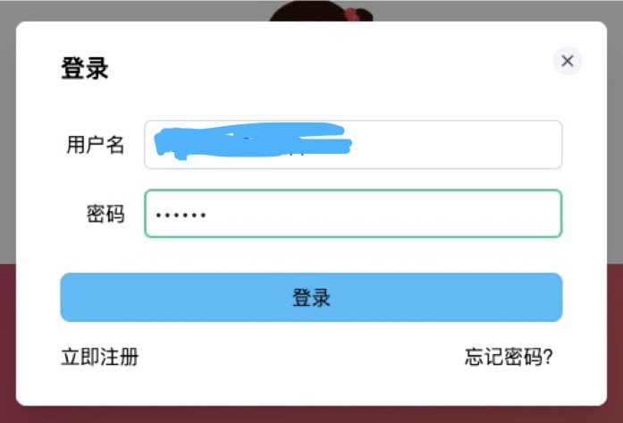
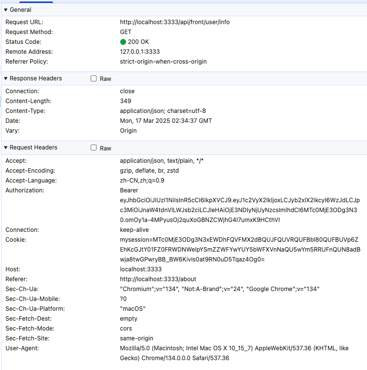
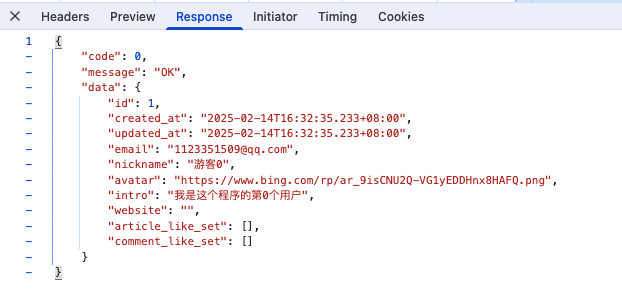
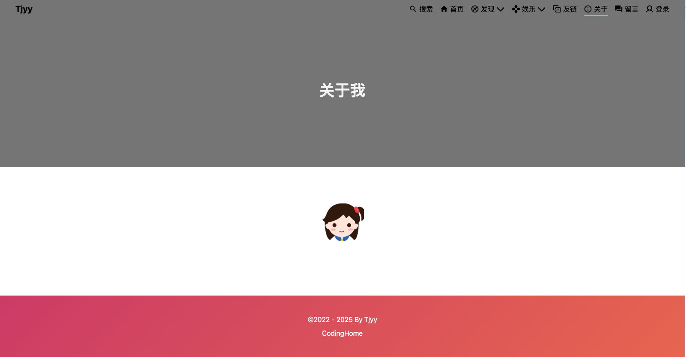
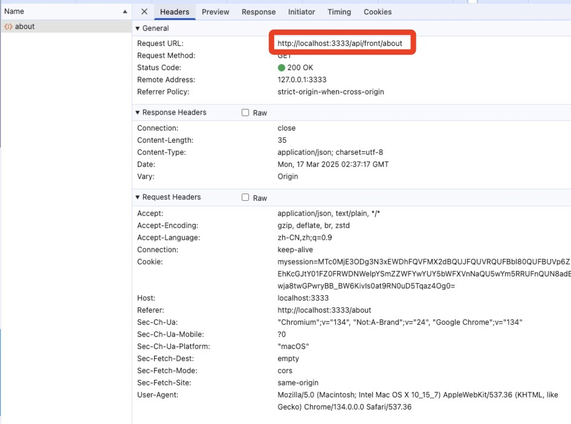
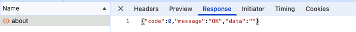

# 15 gin-blog-server INFO-关于我-前台首页-前台页面

## 1 后台管理中间件

这些中间件组合起来，为 `/api` 路径下的请求提供了一套完整的安全和监控机制。

1. **JWTAuth**：基于 JWT 进行用户身份鉴权，验证请求中的 Token 有效性，解析用户信息并存储到会话和上下文。
2. **PermissionCheck**：对已认证用户进行资源访问权限验证，确保用户有访问对应资源的权限。
3. **OperationLog**：记录非 GET 请求和非文件上传请求的操作日志，包含请求信息、用户信息和响应信息到数据库。
4. **ListenOnline**：监听用户在线状态，处理强制下线情况，每次请求更新用户在线状态至 Redis。

### 1.1 JWTAuth

这段代码定义了一个名为 `JWTAuth` 的 Gin 中间件，其主要作用是基于 JWT（JSON Web Token）实现用户鉴权。以下是对代码功能的详细分析：

1. 从 Gin 上下文获取数据库连接实例。
2. 检查请求的资源是否需要鉴权，如果不需要则跳过后续验证。
3. 从请求头中获取 JWT Token 并进行格式验证。
4. 解析 JWT Token 并验证其有效性和是否过期。
5. 根据 Token 中的用户 ID 获取用户信息。
6. 将用户信息存储到会话（session）和 Gin 上下文中。

```go
// JWTAuth 基于 jwt 实现鉴权
// TODO: 如果存在 session, 则直接从 session 中获取用户信息
// 从 Authorization 中获取 token, 并解析 token 获取用户信息, 并设置到 session 中
func JWTAuth() gin.HandlerFunc {
	return func(c *gin.Context) {
		// FIXME: 前后台 session 混乱, 暂时无法将用户信息挂载在 gin context 缓存
		slog.Debug("[middleware-JWTAuth] user auth not exist, do jwt auth")

		db := c.MustGet(global.CTX_DB).(*gorm.DB)

		// 系统管理的资源需要进行用户鉴权，其他资源不需要鉴权
		url, method := c.FullPath()[4:], c.Request.Method
		resource, err := model.GetResource(db, url, method)
		if err != nil {
			// 没有找到的资源，不需要鉴权，跳过后续的验证过程
			if errors.Is(err, gorm.ErrRecordNotFound) {
				slog.Debug("[middleware-JWTAuth] resource not exist, skip jwt auth")
				c.Set("skip_check", true)
				c.Next()
				c.Set("skip_check", false)
				return
			}
			handle.ReturnError(c, global.ErrDbOp, err)
			return
		}

		// 匿名资源，不需要鉴权，跳过后续的验证过程
		if resource.Anonymous {
			slog.Debug(fmt.Sprintf("[middleware-JWTAuth] resouce: %s %s is anonymous, skip jwt auth!", url, method))
			c.Set("skip_check", true)
			c.Next()
			c.Set("skip_check", false)
			return
		}

		authorization := c.Request.Header.Get("Authorization")
		if authorization == "" {
			handle.ReturnError(c, global.ErrTokenNotExist, nil)
			return
		}

		// token 的正确格式: `Bearer [tokenString]`
		parts := strings.Split(authorization, " ")
		if len(parts) == 2 || parts[0] != "Bearer" {
			handle.ReturnError(c, global.ErrTokenType, nil)
			return
		}

		claims, err := jwt.ParseToken(global.Conf.JWT.Secret, parts[1])
		if err != nil {
			handle.ReturnError(c, global.ErrTokenWrong, err)
			return
		}

		// 判断 token 已经过期
		if time.Now().Unix() > claims.ExpiresAt.Unix() {
			handle.ReturnError(c, global.ErrTokenRuntime, nil)
			return
		}

		// 获取用户信息
		user, err := model.GetUserAuthInfoById(db, claims.UserId)
		if err != nil {
			handle.ReturnError(c, global.ErrUserNotExist, err)
			return
		}

		// session 设置
		session := sessions.Default(c)
		session.Set(global.CTX_USER_AUTH, claims.UserId)
		session.Save()

		// gin context
		c.Set(global.CTX_USER_AUTH, user)
	}
}
```


### 1.2 PermissionCheck

这段代码定义了一个名为 `PermissionCheck` 的 Gin 中间件，其主要作用是对用户访问资源的权限进行验证，确保用户具有访问特定资源的权限。以下是对代码的详细解释：

1. 检查是否需要跳过权限验证。
2. 获取数据库连接和当前用户的认证信息。
3. 判断用户是否为超级管理员，如果是则直接通过验证。
4. 遍历用户的角色，检查每个角色是否具有访问当前资源的权限。
5. 如果所有角色都具有权限，则通过验证；否则返回权限不足的错误。

```go
// PermissionCheck 资源访问权限验证
func PermissionCheck() gin.HandlerFunc {
	return func(c *gin.Context) {
		if c.GetBool("skip_check") {
			c.Next()
			return
		}

		db := c.MustGet(global.CTX_DB).(*gorm.DB)
		auth, err := handle.CurrentUserAuth(c)
		if err != nil {
			handle.ReturnError(c, global.ErrUserNotExist, err)
			return
		}

		if auth.IsSuper {
			slog.Debug("[middleware-PermissionCheck]: super admin no need to check, pass!")
			c.Next()
			return
		}

		url := c.FullPath()[4:]
		method := c.Request.Method

		slog.Debug(fmt.Sprintf("[middleware-PermissionCheck] %v, %v, %v\n", auth.Username, url, method))
		for _, role := range auth.Roles {
			slog.Debug(fmt.Sprintf("[middleware-PermissionCheck] %v\n", role.Name))
			pass, err := model.CheckRoleAuth(db, role.ID, url, method)
			if err != nil {
				handle.ReturnError(c, global.ErrDbOp, err)
				return
			}
			if !pass {
				handle.ReturnError(c, global.ErrPermission, nil)
				return
			}
		}

		slog.Debug("[middleware-PermissionCheck]: pass")
		c.Next()
	}
}
```


### 1.3 OperationLog

这段代码定义了一个名为 `OperationLog` 的 Gin 中间件，其主要作用是记录用户的操作日志，不过会排除 `GET` 请求和包含文件上传的请求

+ `GET` 请求通常数量众多
+ 文件上传请求的请求体可能过长
+ 记录这些日志可能会造成不必要的资源浪费或性能问题。

以下是对代码详细的解释：

1. 判断请求是否需要记录操作日志（非 `GET` 请求且不包含文件上传）。
2. 若需要记录，创建自定义响应写入器，用于捕获响应内容。
3. 获取当前用户的认证信息。
4. 读取请求体内容，并将其重置以便后续处理。
5. 获取客户端的 IP 地址和来源。
6. 确定操作模块名称。
7. 构建操作日志记录对象。
8. 继续处理请求。
9. 获取响应体内容并填充到操作日志记录对象中。
10. 将操作日志记录到数据库。
11. 若不需要记录，直接继续处理请求。

```go
// OperationLog 记录操作日志的中间件
func OperationLog() gin.HandlerFunc {
	return func(c *gin.Context) {
		// TODO: 记录文件上传
		// 不记录 GET 请求操作记录 (太多了) 和 文件上传操作记录 (请求体太长)
		if c.Request.Method != "GET" && !strings.Contains(c.Request.RequestURI, "upload") {
			blw := &CustomResponseWriter{
				body:           bytes.NewBufferString(""),
				ResponseWriter: c.Writer,
			}
			c.Writer = blw

			auth, _ := handle.CurrentUserAuth(c)

			body, _ := io.ReadAll(c.Request.Body)
			c.Request.Body = io.NopCloser(bytes.NewBuffer(body))

			ipAddress := utils.IP.GetIpAddress(c)
			ipSource := utils.IP.GetIpSource(ipAddress)

			moduleName := getOptResource(c.HandlerName())
			operationLog := model.OperationLog{
				OptModule:     moduleName, // TODO : 优化
				OptType:       GetOptString(c.Request.Method),
				OptUrl:        c.Request.RequestURI,
				OptMethod:     c.HandlerName(),
				OptDesc:       GetOptString(c.Request.Method) + moduleName, // TODO: 优化
				RequestParam:  string(body),
				RequestMethod: c.Request.Method,
				UserId:        auth.UserInfoId,
				Nickname:      auth.UserInfo.Nickname,
				IpAddress:     ipAddress,
				IpSource:      ipSource,
			}

			c.Next()
			operationLog.ResponseData = blw.body.String() // 从缓存中获取响应体内容

			db := c.MustGet(global.CTX_DB).(*gorm.DB)
			if err := db.Create(&operationLog).Error; err != nil {
				slog.Error("操作日志记录失败", err)
				handle.ReturnError(c, global.ErrDbOp, err)
				return
			}
		} else {
			c.Next()
		}
	}
}

```

同时，需要在 model/z_base.go 中添加数据库初始化，以在数据库中建立对应的表结构：

```go
return db.AutoMigrate(
		...
		&OperationLog{}, // 操作日志
		...
	)
```


### 1.4 ListenOnline

该中间件的主要作用是在每次请求时检查用户是否被强制下线，并更新用户的在线状态，确保用户的在线状态在一定时间内保持有效。

1. 准备工作：
   - 创建一个上下文用于后续 Redis 操作。
   - 从 Gin 上下文获取 Redis 客户端实例。
2. 获取用户认证信息：从请求上下文获取当前用户认证信息，若获取失败则返回错误并终止请求处理。
3. 生成 Redis 键：根据用户 ID 生成在线和离线状态对应的 Redis 键。
4. 检查强制下线：检查离线状态的 Redis 键是否存在，若存在则表示用户被强制下线，返回错误并终止请求处理。
5. 更新在线状态：若用户未被强制下线，将用户认证信息存入在线状态的 Redis 键，并设置 10 分钟过期时间。
6. 继续请求处理：调用 `c.Next()` 把请求传递给后续中间件或处理函数。

```go
func ListenOnline() gin.HandlerFunc {
	return func(c *gin.Context) {
		ctx := context.Background()
		rdb := c.MustGet(global.CTX_RDB).(*redis.Client)

		auth, err := handle.CurrentUserAuth(c)
		if err != nil {
			handle.ReturnError(c, global.ErrDbOp, err)
			return
		}

		onlineKey := global.ONLINE_USER + strconv.Itoa(auth.ID)
		offlineKey := global.OFFLINE_USER + strconv.Itoa(auth.ID)

		// 判断当前用户是否被强制下线
		if rdb.Exists(ctx, offlineKey).Val() == 1 {
			fmt.Println("用户被强制下线")
			handle.ReturnError(c, global.ErrForceOffline, nil)
			c.Abort()
			return
		}

		// 每次发送请求会更新 Redis 中的在线状态: 重新计算 10 分钟
		rdb.Set(ctx, onlineKey, auth, 10*time.Minute)
		c.Next()
	}
}
```


## 2 资源 Resource

由于在 JWTAuth 中间件中，有如下的步骤：

```go
// 系统管理的资源需要进行用户鉴权，其他资源不需要鉴权
url, method := c.FullPath()[4:], c.Request.Method
resource, err := model.GetResource(db, url, method)
if err != nil {
  // 没有找到的资源，不需要鉴权，跳过后续的验证过程
  if errors.Is(err, gorm.ErrRecordNotFound) {
    slog.Debug("[middleware-JWTAuth] resource not exist, skip jwt auth")
    c.Set("skip_check", true)
    c.Next()
    c.Set("skip_check", false)
    return
  }
  handle.ReturnError(c, global.ErrDbOp, err)
  return
}
```

即对系统管理的资源进行判定，所以要先完善资源相关的接口

在后端管理的前端代码中，资源管理相关的接口主要有以下几个：

```java
// 资源
getResources: (params = {}) => request.get('/resource/list', { params }),
saveOrUpdateResource: data => request.post('/resource', data),
deleteResource: id => request.delete(`/resource/${id}`),
updateResourceAnonymous: data => request.put('/resource/anonymous', data),
getResourceOption: () => request.get('/resource/option'),
```

对应的 gin-blog-server 中，资源相关的代码如下：

```go
// 资源模块
resource := auth.Group("/resource")
{
  resource.GET("/list", resourceAPI.GetTreeList)          // 资源列表(树形)
  resource.POST("", resourceAPI.SaveOrUpdate)             // 新增/编辑资源
  resource.DELETE("/:id", resourceAPI.Delete)             // 删除资源
  resource.PUT("/anonymous", resourceAPI.UpdateAnonymous) // 修改资源匿名访问
  resource.GET("/option", resourceAPI.GetOption)          // 资源选项列表(树形)
}
```

我们接下来一个一个进行完善。

2.1 


## 3 接口：USER INFO

manager.go

```go
// 后台管理系统的接口: 全部需要 登录 + 鉴权
func registerAdminHandler(r *gin.Engine) {
	auth := r.Group("/api")
	...
	// 用户模块
	user := auth.Group("/user")
	{
		user.GET("/info", userAPI.GetInfo)          // 获取当前用户信息
		user.GET("/current", userAPI.UpdateCurrent) // 修改当前用户信息
	}
}

// 博客前台相关接口：大部分不需要登陆，部分需要登陆
func registerBlogHandler(r *gin.Engine) {
	base := r.Group("/api/front")

	// 需要登录才能进行的操作
	base.Use(middleware.JWTAuth())
	{
		base.GET("/user/info", userAPI.GetInfo)       // 根据 Token 获取用户信息
		base.PUT("/user/info", userAPI.UpdateCurrent) // 根据 Token 更新当前用户信息
	}
}
```

### 3.1 获取用户信息 GetInfo

#### 3.1.1 后端代码

这段代码定义了一个名为 `GetInfo` 的方法，它属于 `User` 结构体，其主要作用是根据请求中的 JWT Token 获取用户信息，并将用户信息以及用户点赞的文章和评论集合信息返回给客户端。

以下是对代码的详细解释：

1. 从上下文环境或者 session 中获取当前的用户基本信息
2. 构建用户信息视图对象 `UserInfoVO`，并将用户基本信息赋值给它。
3. 从 Redis 中获取用户点赞的文章集合信息，并赋值给 `UserInfoVO`。若获取文章点赞集合信息失败，返回数据库操作错误信息。
4. 从 Redis 中获取用户点赞的评论集合信息，并赋值给 `UserInfoVO`。若获取评论点赞集合信息失败，返回数据库操作错误信息。
5. 如果以上步骤都成功，将包含用户信息和点赞集合信息的 `UserInfoVO` 对象作为成功响应返回给客户端。

```go
// GetInfo 根据 Token 获取用户信息
func (*User) GetInfo(c *gin.Context) {
	rdb := GetRDB(c)

	user, err := CurrentUserAuth(c)
	if err != nil {
		ReturnError(c, global.ErrTokenRuntime, err)
		return
	}

	userInfoVO := model.UserInfoVO{UserInfo: *user.UserInfo}
	userInfoVO.ArticleLikeSet, err = rdb.SMembers(rctx, global.ARTICLE_USER_LIKE_SET+strconv.Itoa(user.ID)).Result()
	if err != nil {
		ReturnError(c, global.ErrDbOp, err)
		return
	}

	userInfoVO.CommentLikeSet, err = rdb.SMembers(rctx, global.COMMENT_USER_LIKE_SET+strconv.Itoa(user.ID)).Result()
	if err != nil {
		ReturnError(c, global.ErrDbOp, err)
		return
	}

	ReturnSuccess(c, userInfoVO)
}
```

#### 3.1.2 功能测试

/user/info 在前端页面的触发条件：

1. 前台：在前台登陆成功之后，会触发一次来请求用户信息
2. 前台：点击个人信息页面进入之后，会自动触发一次 /user/info 获取用户信息
3. 管理：管理网站登陆成功之后，会触发一次 /user/info 来请求用户信息
4. 管理：点击个人详情页面之后，会触发一次 /user/info 来请求用户信息

这里拿前台登陆成功后的请求来测试 /user/info 接口:



输入注册好的用户名和密码，点击登录之后，可以在浏览器的 Network 中查看对应请求发送情况



可以看到登陆之后的请求，是在 Authorization 字段中携带了 token 的，可以看一下对应的响应：



主要是携带了用户信息返回，那么由于 redis 中还没有文章点赞和评论点赞相关数据，所以返回空列表。


### 3.2 更新用户信息 UpdateInfo

#### 3.2.1 后端代码

这段代码定义了一个名为 `UpdateCurrent` 的方法，它属于 `User` 结构体，其主要作用是更新当前用户的信息。

以下是对代码功能的详细解释：

1. 从请求的 JSON 数据中解析出更新用户信息的请求体。
   + 若解析失败，返回请求错误信息。
   + 从请求的 Token 中解析出当前用户的认证信息。
2. 使用解析出的用户 ID 和请求体中的数据更新数据库中该用户的信息。
   + 若数据库更新操作失败，返回数据库操作错误信息。
   + 若更新成功，返回成功响应。

```go
// UpdateCurrent 更新当前用户信息, 不需要传 id, 从 Token 中解析出来
func (*User) UpdateCurrent(c *gin.Context) {
	var req UpdateCurrentUserReq
	if err := c.ShouldBindJSON(&req); err != nil {
		ReturnError(c, global.ErrRequest, err)
		return
	}

	auth, _ := CurrentUserAuth(c)
	err := model.UpdateUserInfo(GetDB(c), auth.UserInfoId, req.Nickname, req.Avatar, req.Intro, req.Website)
	if err != nil {
		ReturnError(c, global.ErrDbOp, err)
		return
	}
	ReturnSuccess(c, nil)
}

```

#### 3.2.2 功能测试

关于编辑用户信息的位置，可以在前台-个人中心页面进行编辑:


## 4 接口：关于我

manager.go

```go
// 后台管理系统的接口: 全部需要 登录 + 鉴权
func registerAdminHandler(r *gin.Engine) {
	auth := r.Group("/api")
	...
	// 博客设置
	setting := auth.Group("/setting")
	{
		setting.GET("/about", blogInfoAPI.GetAbout)    // 获取关于我
		setting.PUT("/about", blogInfoAPI.UpdateAbout) // 编辑关于我
	}
}

// 博客前台相关接口：大部分不需要登陆，部分需要登陆
func registerBlogHandler(r *gin.Engine) {
	base := r.Group("/api/front")

	base.GET("/about", blogInfoAPI.GetAbout) // 获取关于我
}
```

### 4.1 获取关于我 blogInfoAPI.GetAbout

#### 4.1.1 后端代码

这段代码由两部分组成：

+ 一个是 `handle_bloginfo.go` 文件中的 `GetAbout` 方法
+ 另一个是 `config.go` 文件中的 `GetConfig` 函数。

它们协同工作，从数据库里查找特定配置项的值并返回给客户端。

```go
// handle_bloginfo.go
// GetAbout 获取 About 信息
func (*BlogInfo) GetAbout(c *gin.Context) {
	ReturnSuccess(c, model.GetConfig(GetDB(c), global.CONFIG_ABOUT))
}


// config.go
// GetConfig 获取 key 对应的配置信息
func GetConfig(db *gorm.DB, key string) string {
	var config Config
	result := db.Where("key", key).First(&config)
	if result.Error != nil {
		return ""
	}
	return config.Value
}
```

#### 4.1.2 功能测试



在页面上点击关于，会出现关于我这个页面，启动这个页面，会自动去发送 /about 请求



由于现在还没有对应的 /about 数据存放在数据库中，因此返回结果为空：



并且 Gin 框架中会有响应提升：record not found

当之后我们执行 blogInfoAPI.UpdateAbout 之后，重新请求一次就可以得到正确的响应


### 4.2 编辑关于我 blogInfoAPI.UpdateAbout

#### 4.2.1 后端代码

代码由两部分组成，分别位于 `handle_bloginfo.go` 和 `config.go` 文件中。

+ `handle_bloginfo.go` 中的 `UpdateAbout` 方法负责处理更新 “About” 信息的 HTTP 请求
+ 而 `config.go` 中的 `CheckConfig` 函数负责实际的数据库更新操作。

```go
// handle_bloginfo.go
// UpdateAbout 更新 About 信息
func (*BlogInfo) UpdateAbout(c *gin.Context) {
	var req AboutReq
	if err := c.ShouldBindJSON(&req); err != nil {
		ReturnError(c, global.ErrRequest, err)
		return
	}

	err := model.CheckConfig(GetDB(c), global.CONFIG_ABOUT, req.Content)
	if err != nil {
		ReturnError(c, global.ErrDbOp, err)
		return
	}
	ReturnSuccess(c, req.Content)
}


// config.go
// CheckConfig 更新 Config
func CheckConfig(db *gorm.DB, key, value string) error {
	var config Config
	result := db.Where("key", key).FirstOrCreate(&config)
	if result.Error != nil {
		return result.Error
	}

	config.Value = value
	result = db.Save(&config)

	return result.Error
}
```


#### 4.1.2 功能测试