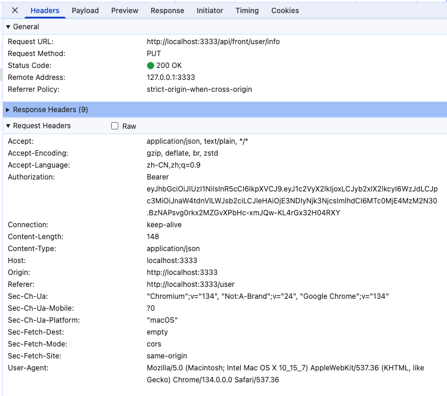
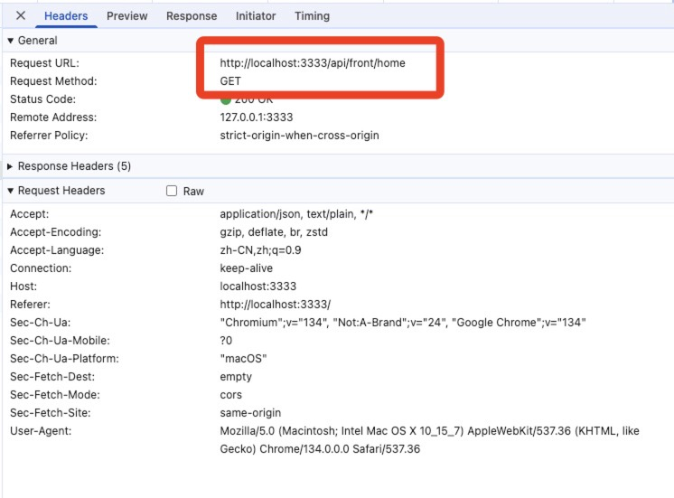
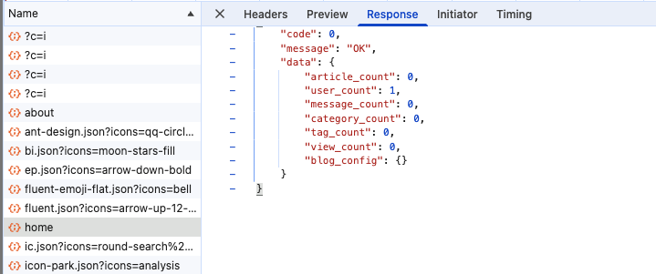
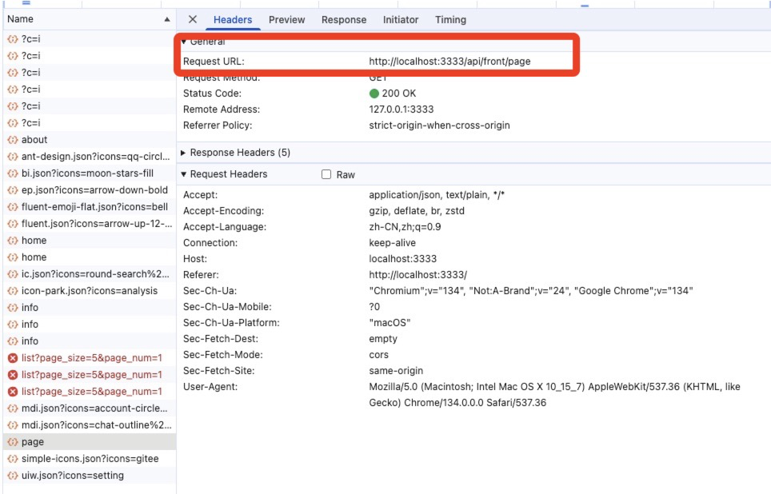

# 15 gin-blog-server INFO-关于我-前台首页-前台页面

## 1 后台管理中间件

这些中间件组合起来，为 `/api` 路径下的请求提供了一套完整的安全和监控机制。

1. **JWTAuth**：基于 JWT 进行用户身份鉴权，验证请求中的 Token 有效性，解析用户信息并存储到会话和上下文。
2. **PermissionCheck**：对已认证用户进行资源访问权限验证，确保用户有访问对应资源的权限。
3. **OperationLog**：记录非 GET 请求和非文件上传请求的操作日志，包含请求信息、用户信息和响应信息到数据库。
4. **ListenOnline**：监听用户在线状态，处理强制下线情况，每次请求更新用户在线状态至 Redis。

### 1.1 JWTAuth

这段代码定义了一个名为 `JWTAuth` 的 Gin 中间件，其主要作用是基于 JWT（JSON Web Token）实现用户鉴权。以下是对代码功能的详细分析：

1. 从 Gin 上下文获取数据库连接实例。
2. 检查请求的资源是否需要鉴权，如果不需要则跳过后续验证。
3. 从请求头中获取 JWT Token 并进行格式验证。
4. 解析 JWT Token 并验证其有效性和是否过期。
5. 根据 Token 中的用户 ID 获取用户信息。
6. 将用户信息存储到会话（session）和 Gin 上下文中。

```go
// JWTAuth 基于 jwt 实现鉴权
// TODO: 如果存在 session, 则直接从 session 中获取用户信息
// 从 Authorization 中获取 token, 并解析 token 获取用户信息, 并设置到 session 中
func JWTAuth() gin.HandlerFunc {
	return func(c *gin.Context) {
		// FIXME: 前后台 session 混乱, 暂时无法将用户信息挂载在 gin context 缓存
		slog.Debug("[middleware-JWTAuth] user auth not exist, do jwt auth")

		db := c.MustGet(global.CTX_DB).(*gorm.DB)

		// 系统管理的资源需要进行用户鉴权，其他资源不需要鉴权
		url, method := c.FullPath()[4:], c.Request.Method
		resource, err := model.GetResource(db, url, method)
		if err != nil {
			// 没有找到的资源，不需要鉴权，跳过后续的验证过程
			if errors.Is(err, gorm.ErrRecordNotFound) {
				slog.Debug("[middleware-JWTAuth] resource not exist, skip jwt auth")
				c.Set("skip_check", true)
				c.Next()
				c.Set("skip_check", false)
				return
			}
			handle.ReturnError(c, global.ErrDbOp, err)
			return
		}

		// 匿名资源，不需要鉴权，跳过后续的验证过程
		if resource.Anonymous {
			slog.Debug(fmt.Sprintf("[middleware-JWTAuth] resouce: %s %s is anonymous, skip jwt auth!", url, method))
			c.Set("skip_check", true)
			c.Next()
			c.Set("skip_check", false)
			return
		}

		authorization := c.Request.Header.Get("Authorization")
		if authorization == "" {
			handle.ReturnError(c, global.ErrTokenNotExist, nil)
			return
		}

		// token 的正确格式: `Bearer [tokenString]`
		parts := strings.Split(authorization, " ")
		if len(parts) == 2 || parts[0] != "Bearer" {
			handle.ReturnError(c, global.ErrTokenType, nil)
			return
		}

		claims, err := jwt.ParseToken(global.Conf.JWT.Secret, parts[1])
		if err != nil {
			handle.ReturnError(c, global.ErrTokenWrong, err)
			return
		}

		// 判断 token 已经过期
		if time.Now().Unix() > claims.ExpiresAt.Unix() {
			handle.ReturnError(c, global.ErrTokenRuntime, nil)
			return
		}

		// 获取用户信息
		user, err := model.GetUserAuthInfoById(db, claims.UserId)
		if err != nil {
			handle.ReturnError(c, global.ErrUserNotExist, err)
			return
		}

		// session 设置
		session := sessions.Default(c)
		session.Set(global.CTX_USER_AUTH, claims.UserId)
		session.Save()

		// gin context
		c.Set(global.CTX_USER_AUTH, user)
	}
}
```


### 1.2 PermissionCheck

这段代码定义了一个名为 `PermissionCheck` 的 Gin 中间件，其主要作用是对用户访问资源的权限进行验证，确保用户具有访问特定资源的权限。以下是对代码的详细解释：

1. 检查是否需要跳过权限验证。
2. 获取数据库连接和当前用户的认证信息。
3. 判断用户是否为超级管理员，如果是则直接通过验证。
4. 遍历用户的角色，检查每个角色是否具有访问当前资源的权限。
5. 如果所有角色都具有权限，则通过验证；否则返回权限不足的错误。

```go
// PermissionCheck 资源访问权限验证
func PermissionCheck() gin.HandlerFunc {
	return func(c *gin.Context) {
		if c.GetBool("skip_check") {
			c.Next()
			return
		}

		db := c.MustGet(global.CTX_DB).(*gorm.DB)
		auth, err := handle.CurrentUserAuth(c)
		if err != nil {
			handle.ReturnError(c, global.ErrUserNotExist, err)
			return
		}

		if auth.IsSuper {
			slog.Debug("[middleware-PermissionCheck]: super admin no need to check, pass!")
			c.Next()
			return
		}

		url := c.FullPath()[4:]
		method := c.Request.Method

		slog.Debug(fmt.Sprintf("[middleware-PermissionCheck] %v, %v, %v\n", auth.Username, url, method))
		for _, role := range auth.Roles {
			slog.Debug(fmt.Sprintf("[middleware-PermissionCheck] %v\n", role.Name))
			pass, err := model.CheckRoleAuth(db, role.ID, url, method)
			if err != nil {
				handle.ReturnError(c, global.ErrDbOp, err)
				return
			}
			if !pass {
				handle.ReturnError(c, global.ErrPermission, nil)
				return
			}
		}

		slog.Debug("[middleware-PermissionCheck]: pass")
		c.Next()
	}
}
```


### 1.3 OperationLog

这段代码定义了一个名为 `OperationLog` 的 Gin 中间件，其主要作用是记录用户的操作日志，不过会排除 `GET` 请求和包含文件上传的请求

+ `GET` 请求通常数量众多
+ 文件上传请求的请求体可能过长
+ 记录这些日志可能会造成不必要的资源浪费或性能问题。

以下是对代码详细的解释：

1. 判断请求是否需要记录操作日志（非 `GET` 请求且不包含文件上传）。
2. 若需要记录，创建自定义响应写入器，用于捕获响应内容。
3. 获取当前用户的认证信息。
4. 读取请求体内容，并将其重置以便后续处理。
5. 获取客户端的 IP 地址和来源。
6. 确定操作模块名称。
7. 构建操作日志记录对象。
8. 继续处理请求。
9. 获取响应体内容并填充到操作日志记录对象中。
10. 将操作日志记录到数据库。
11. 若不需要记录，直接继续处理请求。

```go
// OperationLog 记录操作日志的中间件
func OperationLog() gin.HandlerFunc {
	return func(c *gin.Context) {
		// TODO: 记录文件上传
		// 不记录 GET 请求操作记录 (太多了) 和 文件上传操作记录 (请求体太长)
		if c.Request.Method != "GET" && !strings.Contains(c.Request.RequestURI, "upload") {
			blw := &CustomResponseWriter{
				body:           bytes.NewBufferString(""),
				ResponseWriter: c.Writer,
			}
			c.Writer = blw

			auth, _ := handle.CurrentUserAuth(c)

			body, _ := io.ReadAll(c.Request.Body)
			c.Request.Body = io.NopCloser(bytes.NewBuffer(body))

			ipAddress := utils.IP.GetIpAddress(c)
			ipSource := utils.IP.GetIpSource(ipAddress)

			moduleName := getOptResource(c.HandlerName())
			operationLog := model.OperationLog{
				OptModule:     moduleName, // TODO : 优化
				OptType:       GetOptString(c.Request.Method),
				OptUrl:        c.Request.RequestURI,
				OptMethod:     c.HandlerName(),
				OptDesc:       GetOptString(c.Request.Method) + moduleName, // TODO: 优化
				RequestParam:  string(body),
				RequestMethod: c.Request.Method,
				UserId:        auth.UserInfoId,
				Nickname:      auth.UserInfo.Nickname,
				IpAddress:     ipAddress,
				IpSource:      ipSource,
			}

			c.Next()
			operationLog.ResponseData = blw.body.String() // 从缓存中获取响应体内容

			db := c.MustGet(global.CTX_DB).(*gorm.DB)
			if err := db.Create(&operationLog).Error; err != nil {
				slog.Error("操作日志记录失败", err)
				handle.ReturnError(c, global.ErrDbOp, err)
				return
			}
		} else {
			c.Next()
		}
	}
}

```

同时，需要在 model/z_base.go 中添加数据库初始化，以在数据库中建立对应的表结构：

```go
return db.AutoMigrate(
		...
		&OperationLog{}, // 操作日志
		...
	)
```


### 1.4 ListenOnline

该中间件的主要作用是在每次请求时检查用户是否被强制下线，并更新用户的在线状态，确保用户的在线状态在一定时间内保持有效。

1. 准备工作：
   - 创建一个上下文用于后续 Redis 操作。
   - 从 Gin 上下文获取 Redis 客户端实例。
2. 获取用户认证信息：从请求上下文获取当前用户认证信息，若获取失败则返回错误并终止请求处理。
3. 生成 Redis 键：根据用户 ID 生成在线和离线状态对应的 Redis 键。
4. 检查强制下线：检查离线状态的 Redis 键是否存在，若存在则表示用户被强制下线，返回错误并终止请求处理。
5. 更新在线状态：若用户未被强制下线，将用户认证信息存入在线状态的 Redis 键，并设置 10 分钟过期时间。
6. 继续请求处理：调用 `c.Next()` 把请求传递给后续中间件或处理函数。

```go
func ListenOnline() gin.HandlerFunc {
	return func(c *gin.Context) {
		ctx := context.Background()
		rdb := c.MustGet(global.CTX_RDB).(*redis.Client)

		auth, err := handle.CurrentUserAuth(c)
		if err != nil {
			handle.ReturnError(c, global.ErrDbOp, err)
			return
		}

		onlineKey := global.ONLINE_USER + strconv.Itoa(auth.ID)
		offlineKey := global.OFFLINE_USER + strconv.Itoa(auth.ID)

		// 判断当前用户是否被强制下线
		if rdb.Exists(ctx, offlineKey).Val() == 1 {
			fmt.Println("用户被强制下线")
			handle.ReturnError(c, global.ErrForceOffline, nil)
			c.Abort()
			return
		}

		// 每次发送请求会更新 Redis 中的在线状态: 重新计算 10 分钟
		rdb.Set(ctx, onlineKey, auth, 10*time.Minute)
		c.Next()
	}
}
```


## 2 USER INFO 用户信息

由于在登陆前台或者后台之后，要做的第一件事就是通过/user/info 获取当前登陆用户的信息。为了对后续的功能完成正常的开发和功能测试，这里简单补充两个功能：获取用户信息和编辑用户信息。

manager.go

```go
// 后台管理系统的接口: 全部需要 登录 + 鉴权
func registerAdminHandler(r *gin.Engine) {
	auth := r.Group("/api")
	...
	// 用户模块
	user := auth.Group("/user")
	{
		user.GET("/info", userAPI.GetInfo)          // 获取当前用户信息
		user.GET("/current", userAPI.UpdateCurrent) // 修改当前用户信息
	}
}

// 博客前台相关接口：大部分不需要登陆，部分需要登陆
func registerBlogHandler(r *gin.Engine) {
	base := r.Group("/api/front")

	// 需要登录才能进行的操作
	base.Use(middleware.JWTAuth())
	{
		base.GET("/user/info", userAPI.GetInfo)       // 根据 Token 获取用户信息
		base.PUT("/user/info", userAPI.UpdateCurrent) // 根据 Token 更新当前用户信息
	}
}
```

为了正常开发功能，我们先将 auth.go 的这段代码注释掉，即不要对资源进行限制

```go
// 系统管理的资源需要进行用户鉴权，其他资源不需要鉴权
		//url, method := c.FullPath()[4:], c.Request.Method
		//resource, err := model.GetResource(db, url, method)
		//if err != nil {
		//	// 没有找到的资源，不需要鉴权，跳过后续的验证过程
		//	if errors.Is(err, gorm.ErrRecordNotFound) {
		//		slog.Debug("[middleware-JWTAuth] resource not exist, skip jwt auth")
		//		c.Set("skip_check", true)
		//		c.Next()
		//		c.Set("skip_check", false)
		//		return
		//	}
		//	handle.ReturnError(c, global.ErrDbOp, err)
		//	return
		//}

		// 匿名资源，不需要鉴权，跳过后续的验证过程
		//if resource.Anonymous {
		//	slog.Debug(fmt.Sprintf("[middleware-JWTAuth] resouce: %s %s is anonymous, skip jwt auth!", url, method))
		//	c.Set("skip_check", true)
		//	c.Next()
		//	c.Set("skip_check", false)
		//	return
		//}
```

### 2.1 获取用户信息 GetInfo

#### 2.1.1 后端代码

这段代码定义了一个名为 `GetInfo` 的方法，它属于 `User` 结构体，其主要作用是根据请求中的 JWT Token 获取用户信息，并将用户信息以及用户点赞的文章和评论集合信息返回给客户端。

以下是对代码的详细解释：

1. 从上下文环境或者 session 中获取当前的用户基本信息
2. 构建用户信息视图对象 `UserInfoVO`，并将用户基本信息赋值给它。
3. 从 Redis 中获取用户点赞的文章集合信息，并赋值给 `UserInfoVO`。若获取文章点赞集合信息失败，返回数据库操作错误信息。
4. 从 Redis 中获取用户点赞的评论集合信息，并赋值给 `UserInfoVO`。若获取评论点赞集合信息失败，返回数据库操作错误信息。
5. 如果以上步骤都成功，将包含用户信息和点赞集合信息的 `UserInfoVO` 对象作为成功响应返回给客户端。

```go
// GetInfo 根据 Token 获取用户信息
func (*User) GetInfo(c *gin.Context) {
	rdb := GetRDB(c)

	user, err := CurrentUserAuth(c)
	if err != nil {
		ReturnError(c, global.ErrTokenRuntime, err)
		return
	}

	userInfoVO := model.UserInfoVO{UserInfo: *user.UserInfo}
	userInfoVO.ArticleLikeSet, err = rdb.SMembers(rctx, global.ARTICLE_USER_LIKE_SET+strconv.Itoa(user.ID)).Result()
	if err != nil {
		ReturnError(c, global.ErrDbOp, err)
		return
	}

	userInfoVO.CommentLikeSet, err = rdb.SMembers(rctx, global.COMMENT_USER_LIKE_SET+strconv.Itoa(user.ID)).Result()
	if err != nil {
		ReturnError(c, global.ErrDbOp, err)
		return
	}

	ReturnSuccess(c, userInfoVO)
}
```

#### 2.1.2 功能测试

/user/info 在前端页面的触发条件：

1. 前台：在前台登陆成功之后，会触发一次来请求用户信息
2. 前台：点击个人信息页面进入之后，会自动触发一次 /user/info 获取用户信息
3. 管理：管理网站登陆成功之后，会触发一次 /user/info 来请求用户信息
4. 管理：点击个人详情页面之后，会触发一次 /user/info 来请求用户信息

这里拿前台登陆成功后的请求来测试 /user/info 接口:


输入注册好的用户名和密码，点击登录之后，可以在浏览器的 Network 中查看对应请求发送情况


可以看到登陆之后的请求，是在 Authorization 字段中携带了 token 的，可以看一下对应的响应：


主要是携带了用户信息返回，那么由于 redis 中还没有文章点赞和评论点赞相关数据，所以返回空列表。


### 2.2 更新用户信息 UpdateInfo

#### 2.2.1 后端代码

这段代码定义了一个名为 `UpdateCurrent` 的方法，它属于 `User` 结构体，其主要作用是更新当前用户的信息。

以下是对代码功能的详细解释：

1. 从请求的 JSON 数据中解析出更新用户信息的请求体。
   + 若解析失败，返回请求错误信息。
   + 从请求的 Token 中解析出当前用户的认证信息。
2. 使用解析出的用户 ID 和请求体中的数据更新数据库中该用户的信息。
   + 若数据库更新操作失败，返回数据库操作错误信息。
   + 若更新成功，返回成功响应。

```go
// UpdateCurrent 更新当前用户信息, 不需要传 id, 从 Token 中解析出来
func (*User) UpdateCurrent(c *gin.Context) {
	var req UpdateCurrentUserReq
	if err := c.ShouldBindJSON(&req); err != nil {
		ReturnError(c, global.ErrRequest, err)
		return
	}

	auth, _ := CurrentUserAuth(c)
	err := model.UpdateUserInfo(GetDB(c), auth.UserInfoId, req.Nickname, req.Avatar, req.Intro, req.Website)
	if err != nil {
		ReturnError(c, global.ErrDbOp, err)
		return
	}
	ReturnSuccess(c, nil)
}

```

#### 2.2.2 功能测试

关于编辑用户信息的位置，可以在前台-个人中心页面进行编辑后，点击修改按钮

可以看到发送的请求如下：



同理，可以看到个人信息被修改成功


## 3 About 关于我

manager.go

```go
// 后台管理系统的接口: 全部需要 登录 + 鉴权
func registerAdminHandler(r *gin.Engine) {
	auth := r.Group("/api")
	...
	// 博客设置
	setting := auth.Group("/setting")
	{
		setting.GET("/about", blogInfoAPI.GetAbout)    // 获取关于我
		setting.PUT("/about", blogInfoAPI.UpdateAbout) // 编辑关于我
	}
}

// 博客前台相关接口：大部分不需要登陆，部分需要登陆
func registerBlogHandler(r *gin.Engine) {
	base := r.Group("/api/front")

	base.GET("/about", blogInfoAPI.GetAbout) // 获取关于我
}
```

### 3.1 获取关于我 blogInfoAPI.GetAbout

#### 3.1.1 后端代码

这段代码由两部分组成：

+ 一个是 `handle_bloginfo.go` 文件中的 `GetAbout` 方法
+ 另一个是 `config.go` 文件中的 `GetConfig` 函数。

它们协同工作，从数据库里查找特定配置项的值并返回给客户端。

```go
// handle_bloginfo.go
// GetAbout 获取 About 信息
func (*BlogInfo) GetAbout(c *gin.Context) {
	ReturnSuccess(c, model.GetConfig(GetDB(c), global.CONFIG_ABOUT))
}


// config.go
// GetConfig 获取 key 对应的配置信息
func GetConfig(db *gorm.DB, key string) string {
	var config Config
	result := db.Where("key", key).First(&config)
	if result.Error != nil {
		return ""
	}
	return config.Value
}
```

#### 3.1.2 功能测试


在页面上点击关于，会出现关于我这个页面，启动这个页面，会自动去发送 /about 请求


由于现在还没有对应的 /about 数据存放在数据库中，因此返回结果为空：


并且 Gin 框架中会有响应提升：record not found

当之后我们执行 blogInfoAPI.UpdateAbout 之后，重新请求一次就可以得到正确的响应


### 3.2 编辑关于我 blogInfoAPI.UpdateAbout

#### 3.2.1 后端代码

代码由两部分组成，分别位于 `handle_bloginfo.go` 和 `config.go` 文件中。

+ `handle_bloginfo.go` 中的 `UpdateAbout` 方法负责处理更新 “About” 信息的 HTTP 请求
+ 而 `config.go` 中的 `CheckConfig` 函数负责实际的数据库更新操作。

```go
// handle_bloginfo.go
// UpdateAbout 更新 About 信息
func (*BlogInfo) UpdateAbout(c *gin.Context) {
	var req AboutReq
	if err := c.ShouldBindJSON(&req); err != nil {
		ReturnError(c, global.ErrRequest, err)
		return
	}

	err := model.CheckConfig(GetDB(c), global.CONFIG_ABOUT, req.Content)
	if err != nil {
		ReturnError(c, global.ErrDbOp, err)
		return
	}
	ReturnSuccess(c, req.Content)
}


// config.go
// CheckConfig 更新 Config
func CheckConfig(db *gorm.DB, key, value string) error {
	var config Config
	result := db.Where("key", key).FirstOrCreate(&config)
	if result.Error != nil {
		return result.Error
	}

	config.Value = value
	result = db.Save(&config)

	return result.Error
}
```


#### 3.1.2 功能测试

关于 about 的编辑功能，当前无法测试，因为后台接口没搭建完毕


## 4 Home 前台首页

### 4.1 前端调用

在前台界面登陆时，会自动触发如下的代码来请求前台首页数据：

```javascript
onMounted(() => {
  // appStore.getPageList()
  appStore.getBlogInfo()
  userStore.getUserInfo()
})
```

之后，会通过调用 appStore 中的 actions 中的函数修改对应的状态：

```javascript
export const useAppStore = defineStore('app', {
    state: () => ({
        // TODO: 优化
        blogInfo: {
            article_count: 0,
            category_count: 0,
            tag_count: 0,
            view_count: 0,
            user_count: 0,
        },
     		blog_config: {
            website_name: 'CodingHome',
            website_author: 'Tjyy',
            website_intro: 'coding is coding',
            website_avatar: 'https://www.bing.com/rp/ar_9isCNU2Q-VG1yEDDHnx8HAFQ.png',
            website_notice: 'hello, world',
            qq: '',
            github: '',
            gitee: '',
            website_createtime: '2025-2-1',
            website_record: 'CodingHome'
        },
    }),
    getters: {
        ...
    },
    actions: {
        ...
        async getBlogInfo() {
            try {
                const resp = await api.getHomeData()
                if (resp.code === 0) {
                    this.blogInfo = resp.data
                    this.blog_config = resp.data.blog_config
                    this.blog_config.website_avatar = convertImgUrl(this.blog_config.website_avatar)
                }
                else {
                    return Promise.reject(resp)
                }
            }
            catch (err) {
                return Promise.reject(err)
            }
        },

       ...
    },
})

```


### 4.2 后端代码 

首先，在 manager.go 中添加对应的方法：

```go
base.GET("/home", frontAPI.GetHomeInfo)  // 前台首页
```

新建一个 handle 层的 handle_front.go：

```go
package handle

import (
	"gin-blog-server/internal/global"
	"gin-blog-server/internal/model"
	"github.com/gin-gonic/gin"
)

type Front struct{}

// GetHomeInfo 前台首页信息
func (*Front) GetHomeInfo(c *gin.Context) {
	db := GetDB(c)
	rdb := GetRDB(c)

	data, err := model.GetFrontStatistics(db)
	if err != nil {
		ReturnError(c, global.ErrDbOp, err)
		return
	}
	data.ViewCount, _ = rdb.Get(rctx, global.VIEW_COUNT).Int64()

	ReturnSuccess(c, data)
}
```

**返回的是一些前端界面的静态数据：**

`FrontHomeVO` 结构体：用于存储博客前台所需的各种统计数据和配置信息。

- `ArticleCount`：表示文章的数量，在 JSON 序列化时对应的键为 `article_count`。
- `UserCount`：表示用户的数量，在 JSON 序列化时对应的键为 `user_count`。
- `MessageCount`：表示留言的数量，在 JSON 序列化时对应的键为 `message_count`。
- `CategoryCount`：表示分类的数量，在 JSON 序列化时对应的键为 `category_count`。
- `TagCount`：表示标签的数量，在 JSON 序列化时对应的键为 `tag_count`。
- `ViewCount`：表示博客的访问量，在 JSON 序列化时对应的键为 `view_count`。不过在当前代码中并没有对该字段进行赋值操作。
- `Config`：是一个 `map[string]string` 类型，用于存储博客的配置信息，在 JSON 序列化时对应的键为 `blog_config`。

这段代码的主要作用是从数据库中获取博客的各种统计数据和配置信息，并将其封装到 `FrontHomeVO` 结构体中返回。

```go
type FrontHomeVO struct {
	ArticleCount  int64             `json:"article_count"`  // 文章数量
	UserCount     int64             `json:"user_count"`     // 用户数量
	MessageCount  int64             `json:"message_count"`  // 留言数量
	CategoryCount int64             `json:"category_count"` // 分类数量
	TagCount      int64             `json:"tag_count"`      // 标签数量
	ViewCount     int64             `json:"view_count"`     // 访问量
	Config        map[string]string `json:"blog_config"`    // 博客信息
}

// GetFrontStatistics 获取前台静态统计数据
func GetFrontStatistics(db *gorm.DB) (data FrontHomeVO, err error) {
	result := db.Model(&Article{}).Where("status = ? AND is_delete = ?", 1, 0).Count(&data.ArticleCount)
	if result.Error != nil {
		return data, result.Error
	}

	result = db.Model(&UserAuth{}).Count(&data.UserCount)
	if result.Error != nil {
		return data, result.Error
	}

	result = db.Model(&Message{}).Count(&data.MessageCount)
	if result.Error != nil {
		return data, result.Error
	}

	result = db.Model(&Category{}).Count(&data.CategoryCount)
	if result.Error != nil {
		return data, result.Error
	}

	result = db.Model(&Tag{}).Count(&data.TagCount)
	if result.Error != nil {
		return data, result.Error
	}

	data.Config, err = GetConfigMap(db)
	if err != nil {
		return data, err
	}

	return data, nil
}
```

然后，对于 Article、Message、Category 、Tag 相关的数据库模型需要进行补全以及配置。


### 4.3 功能测试

在进入前台首页时，会自动向后端发送请求，完成后端代码之后，请求和响应如下：



响应结果如下，可以正确的获得首页静态数据




## 5 Page 前台页面

### 5.1 前端调用

在前端页面进行加载时，会自动调用：

```javascript
onMounted(() => {
  appStore.getPageList()
  appStore.getBlogInfo()
  userStore.getUserInfo()

  // 挂载全局提示
  window.$message = messageRef.value
  window.$notify = notifyRef.value
})
```

同时，还会修改 appStore 中的状态，这样在前端其他页面展示时，会显示获取到的响应数据：

```javascript
import { defineStore } from 'pinia'
import { convertImgUrl } from '@/utils'
import api from '@/api'


export const useAppStore = defineStore('app', {
    state: () => ({
        ...
        page_list: [], // 页面数据
        ...
    }),
    getters: {
        ...
    },
    actions: {
        ...
        async getPageList() {
            const resp = await api.getPageList()
            if (resp.code === 0) {
                this.page_list = resp.data
                this.page_list?.forEach(e => (e.cover = convertImgUrl(e.cover)))
            }
        },
    },
})

```


### 5.2 后端代码

对于 model/page.go 中的模型如下：

```go
package model

import "gorm.io/gorm"

type Page struct {
	Model
	Name  string `gorm:"unique;type:varchar(20)" json:"name"`
	Label string `gorm:"unique;type:varchar(20)" json:"label"`
	Cover string `gorm:"type:varchar(255)" json:"cover"`
}

// GetPageList 获取数据库中的所有 Page 记录
func GetPageList(db *gorm.DB) ([]Page, int64, error) {
	var pages = make([]Page, 0)
	var total int64

	result := db.Model(&Page{}).Count(&total).Find(&pages)
	return pages, total, result.Error
}

// SaveOrUpdatePage 保存或更新一个新的 Page 记录
func SaveOrUpdatePage(db *gorm.DB, id int, name, label, cover string) (*Page, error) {
	page := Page{
		Model: Model{ID: id},
		Name:  name,
		Label: label,
		Cover: cover,
	}

	var result *gorm.DB
	if id > 0 {
		result = db.Updates(&page)
	} else {
		result = db.Create(&page)
	}

	return &page, result.Error
}

```

对于后端功能的实现如下：

```go
base.GET("/page", pageAPI.GetList)       // 前台页面
```

```go
// GetList 获取页面列表
func (*Page) GetList(c *gin.Context) {
	db := GetDB(c)
	rdb := GetRDB(c)

	// get from cache
	cache, err := getPageCache(rdb)
	if cache != nil && err == nil {
		slog.Debug("[handle-page-GetList] get page list from cache")
		ReturnSuccess(c, cache)
		return
	}

	switch err {
	case redis.Nil:
		break
	default:
		ReturnError(c, global.ErrRedisOp, err)
		return
	}

	// get from db
	data, _, err := model.GetPageList(db)
	if err != nil {
		ReturnError(c, global.ErrDbOp, err)
		return
	}

	// add to cache
	if err := addPageCache(GetRDB(c), data); err != nil {
		ReturnError(c, global.ErrRedisOp, err)
		return
	}

	ReturnSuccess(c, data)
}

```

这段代码定义了一个名为 `GetList` 的方法，属于 `Page` 结构体，其主要功能是获取页面列表，优先从缓存中获取数据，如果缓存中没有则从数据库中获取，并将数据库中的数据更新到缓存中。以下是详细的功能介绍：

1. **获取数据库和缓存实例**
   - 调用 `GetDB(c)` 函数从 Gin 上下文 `c` 中获取数据库连接实例 `db`。
   - 调用 `GetRDB(c)` 函数从 Gin 上下文 `c` 中获取 Redis 缓存连接实例 `rdb`。
2. **尝试从缓存中获取页面列表**
   - 调用 `getPageCache(rdb)` 函数尝试从 Redis 缓存中获取页面列表数据 `cache`。
   - 如果 `cache` 不为空且获取过程没有错误（`err == nil`），说明缓存中存在数据，记录调试信息并调用 `ReturnSuccess(c, cache)` 函数将缓存中的数据作为成功响应返回给客户端，然后终止函数执行。
3. **处理缓存获取错误**
   - 使用 switch 语句处理 err：
     - 如果 `err` 为 `redis.Nil`，表示缓存中不存在该数据，不做特殊处理，继续后续操作。
     - 对于其他类型的错误，调用 `ReturnError(c, global.ErrRedisOp, err)` 函数返回 Redis 操作错误信息，并终止函数执行。
4. **从数据库中获取页面列表**
   - 调用 `model.GetPageList(db)` 函数从数据库中获取页面列表数据 `data`。
   - 如果获取过程中出现错误，调用 `ReturnError(c, global.ErrDbOp, err)` 函数返回数据库操作错误信息，并终止函数执行。
5. **将数据库数据更新到缓存**
   - 调用 `addPageCache(GetRDB(c), data)` 函数将从数据库中获取的页面列表数据 `data` 更新到 Redis 缓存中。
   - 如果更新过程中出现错误，调用 `ReturnError(c, global.ErrRedisOp, err)` 函数返回 Redis 操作错误信息，并终止函数执行。
6. **返回成功响应**
   - 如果以上步骤都成功执行，调用 `ReturnSuccess(c, data)` 函数将从数据库中获取的页面列表数据作为成功响应返回给客户端。


### 5.3 功能测试

前端界面刷新后会自动发送请求如下：



之后，会得到对应的响应，当前没有 page 信息，所以返回为空。


