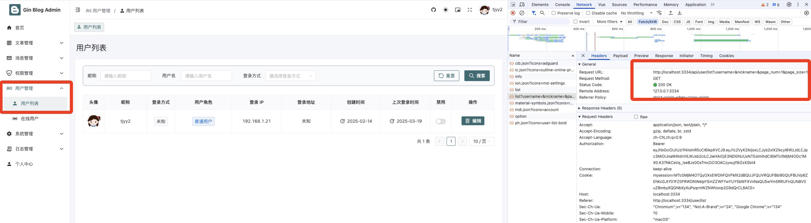
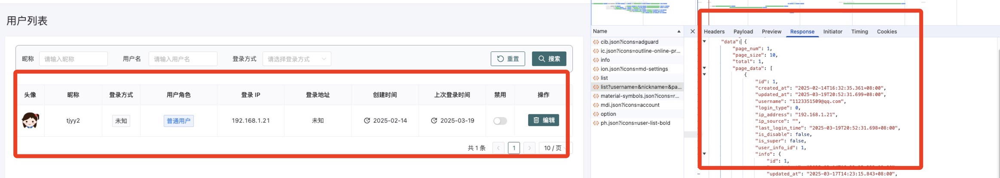
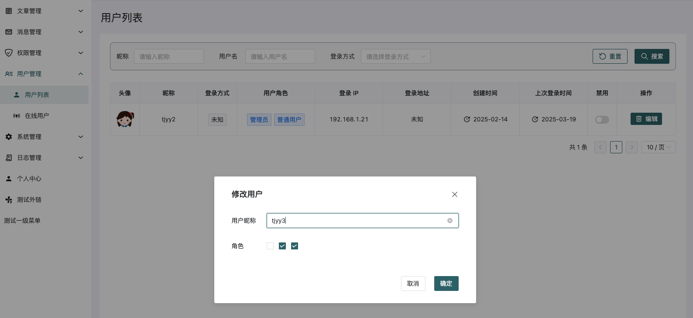
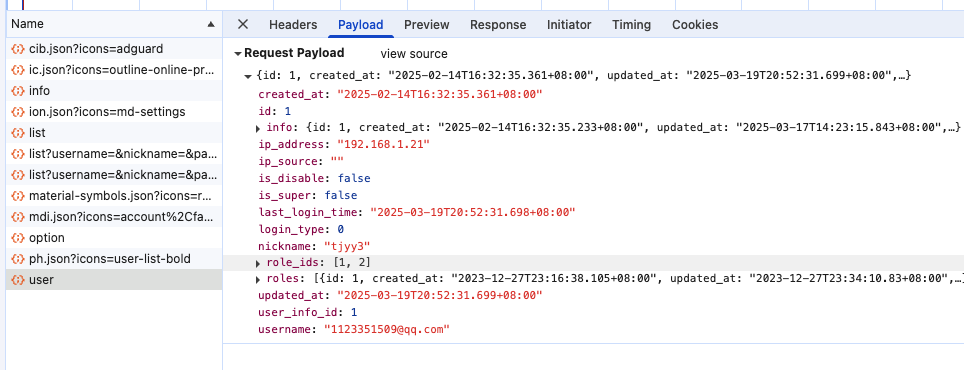

# 16 gin-blog-server 菜单模块-用户模块

## 1 菜单模块 menu

### 1.1 前端调用

在后台登陆成功的时候，会自动调用接口 http://localhost:3334/api/menu/user/list

**触发条件：**

1. 侧边栏 SideMenu 中调用了 import { usePermissionStore, useTagStore } from '@/store'

2. 然后在 permissionStore 中，根据后端传来数据构建出前端路由

   ```javascript
   export const usePermissionStore = defineStore('permission', {
     persist: {
       key: 'gvb_admin_permission',
     },
     state: () => ({
       accessRoutes: [], // 可访问的路由
     }),
     getters: {
       // 最终可访问路由 = 基础路由 + 可访问的路由
       routes: state => basicRoutes.concat(state.accessRoutes),
       // 过滤掉 hidden 的路由作为左侧菜单显示
       menus: state => state.routes.filter(route => route.name && !route.isHidden),
     },
     actions: {
       // ! 后端生成路由: 后端返回的就是最终路由, 处理成前端格式
       async generateRoutesBack() {
         const resp = await api.getUserMenus() // 调用接口获取后端传来的路由
         this.accessRoutes = buildRoutes(resp.data) // 处理成前端路由格式
         return this.accessRoutes
       },
       ...
     },
   })
   ```

3. api.getUserMenus 会调用 getUserMenus: () => request.get('/menu/user/list'), // 获取当前用户的菜单，来获取信息构建菜单栏目

4. **构建好菜单栏目之后，可以根据菜单栏构建对应的侧边栏，并构建相关的路由负责后台界面的跳转**

**后台管理的 api.js 文件中，菜单模块的相关接口如下：**

```javascript
 // 权限管理相关接口
  // 菜单
  getUserMenus: () => request.get('/menu/user/list'), // 获取当前用户的菜单
  getMenus: (params = {}) => request.get('/menu/list', { params }),
  saveOrUpdateMenu: data => request.post('/menu', data),
  deleteMenu: id => request.delete(`/menu/${id}`),
  getMenuOption: () => request.get('/menu/option'),
```

**后端中的菜单模块相关接口如下：**

```go
// 菜单模块
	menu := auth.Group("/menu")
	{
		menu.GET("/list", menuAPI.GetTreeList)      // 菜单列表
		menu.POST("", menuAPI.SaveOrUpdate)         // 新增/编辑菜单
		menu.DELETE("/:id", menuAPI.Delete)         // 删除菜单
		menu.GET("/user/list", menuAPI.GetUserMenu) // 获取当前用户的菜单
		menu.GET("/option", menuAPI.GetOption)      // 菜单选项列表(树形)
	}
```


### 1.2 获取当前用户的菜单 /menu/user/list

manager.go 中添加接口：

```go
// 菜单模块
	menu := auth.Group("/menu")
	{
		menu.GET("/user/list", menuAPI.GetUserMenu) // 获取当前用户的菜单
	}
```

之后我们添加一个对应的 handle_menu.go 来处理 menu 相关的接口

```go
package handle

import (
	"gin-blog-server/internal/global"
	"gin-blog-server/internal/model"
	"github.com/gin-gonic/gin"
	"sort"
)

type Menu struct{}

// MenuTreeVO Menu的树形结构，主要添加的属性为 children 列表
type MenuTreeVO struct {
	model.Menu
	Children []MenuTreeVO `json:"children"`
}

// GetUserMenu 获取当前用户菜单: 生成后台管理界面的菜单
func (*Menu) GetUserMenu(c *gin.Context) {
	db := GetDB(c)
	auth, _ := CurrentUserAuth(c)

	var menus []model.Menu
	var err error

	if auth.IsSuper { // 如果当前用户是超级管理员
		menus, err = model.GetAllMenuList(db)
	} else {
		menus, err = model.GetMenuListByUserId(GetDB(c), auth.ID)
	}

	if err != nil {
		ReturnError(c, global.ErrDbOp, err)
		return
	}

	ReturnSuccess(c, menus2MenuVos(menus))
}

// 构建菜单列表的树形数据结构, []Menu => []MenuVo
func menus2MenuVos(menus []model.Menu) []MenuTreeVO {
	result := make([]MenuTreeVO, 0)

	// 筛选出一级菜单 (parentId == 0 的菜单)
	firstLevelMenus := getFirstLevelMenus(menus)
	// key 是菜单 ID, value 是该菜单对应的子菜单列表
	childrenMap := getMenuChildrenMap(menus)

	for _, first := range firstLevelMenus {
		menu := MenuTreeVO{Menu: first}
		for _, childMenu := range childrenMap[first.ID] {
			menu.Children = append(menu.Children, MenuTreeVO{Menu: childMenu})
		}
		delete(childrenMap, first.ID)
		result = append(result, menu)
	}

	sortMenu(result)
	return result
}

// 筛选出一级菜单 (parentId == 0 的菜单)
func getFirstLevelMenus(menuList []model.Menu) []model.Menu {
	firstLevelMenus := make([]model.Menu, 0)
	for _, menu := range menuList {
		if menu.ParentId == 0 {
			firstLevelMenus = append(firstLevelMenus, menu)
		}
	}

	return firstLevelMenus
}

// key 是菜单 ID, value 是该菜单对应的子菜单列表
func getMenuChildrenMap(menuList []model.Menu) map[int][]model.Menu {
	childrenMap := make(map[int][]model.Menu)
	for _, menu := range menuList {
		if menu.ParentId != 0 {
			childrenMap[menu.ParentId] = append(childrenMap[menu.ParentId], menu)
		}
	}
	return childrenMap
}

// 以 orderNum 升序排序，包括子菜单
func sortMenu(menus []MenuTreeVO) {
	// 如果 menus[i].OrderNum 小于 menus[j].OrderNum，则返回 true，表示 menus[i] 应该排在 menus[j] 前面；
	sort.Slice(menus, func(i, j int) bool {
		return menus[i].OrderNum < menus[j].OrderNum
	})

	for i := range menus {
		sort.Slice(menus[i].Children, func(j, k int) bool {
			return menus[i].Children[j].OrderNum < menus[i].Children[k].OrderNum
		})
	}
}

```

**以下是上述代码中各个函数的功能说明**

1. **`GetUserMenu` 函数**
   - **功能**：处理获取当前用户菜单的请求
   - 步骤：
     - 根据用户是否为超级管理员，从数据库获取所有菜单或特定用户的菜单
     - 调用 `menus2MenuVos` 函数将菜单列表转换为树形结构
     - 返回树形结构的菜单数据
2. **`menus2MenuVos` 函数**
   - **功能**：将扁平的菜单列表转换为树形结构
   - 步骤：
     - 调用 `getFirstLevelMenus` 获取一级菜单（`parentId == 0`）
     - 调用 `getMenuChildrenMap` 生成子菜单映射表
     - 遍历一级菜单，组装树形结构并递归添加子菜单
     - 调用 `sortMenu` 对菜单进行排序
3. **`getFirstLevelMenus` 函数**
   - **功能**：筛选出一级菜单
   - 步骤：
     - 遍历所有菜单，收集 `parentId == 0` 的菜单
     - 返回一级菜单列表
4. **`getMenuChildrenMap` 函数**
   - **功能**：生成子菜单映射表
   - 步骤：
     - 遍历所有菜单，将子菜单（`parentId != 0`）按父菜单 ID 分组
     - 返回键为父菜单 ID、值为子菜单列表的映射表
5. **`sortMenu` 函数**
   - **功能**：对菜单进行排序
   - 步骤：
     - 按 `orderNum` 升序排列一级菜单
     - 递归对每个菜单的子菜单按 `orderNum` 升序排列

**整体流程**：

1. 获取原始菜单数据 → 2. 转换为树形结构 → 3. 筛选一级菜单 → 4. 构建子菜单映射 → 5. 组装树形结构 → 6. 排序菜单

**之后，我们尝试登陆后台首页，会看到其登陆成功之后发送如下的请求：**


然而，其返回的响应为空


这就导致后端界面不能获取到对应的菜单列表，从而无法获取到有用的菜单信息，也就不能正确的将首页路由 / 注册到 router 中

我们可以看原项目数据库中，对应的 menu 信息如下：

+ 通过获取属性 path 和 redirect，后台可以根据返回的路径自动组装 router，实现不同用户可以访问的后台视图是不一样的
+ GetMenuListByUserId 方法中，根据获取用户 userAuth 之后，获取其 role 角色 -> 然后获取 role 角色拥有的菜单 menu


因此，到这里，我们要补全 role 和 menu 的一些数据库对应关系

+ role 即当前项目可能存在的角色：超级管理员？普通用户？
+ role 和菜单 menu 是多对多的关系，且关系基本不会变，可以将原项目中的信息直接导入到新项目库中
+ 当前从前台注册的用户统一都是普通用户

我们将原数据库中的 role 表、menu 表、role_menu表进行补全，**对应的 sql 文件在文件夹 sql 下的：menu.sql / role.sql / role_menu.sql 中**

同时，由于中间件 Permission Check 调用 CheckRoleAuth 函数根据 role id 判断是否有运行 uri+method 的权限，因此我们需要对如下三个表进行补全，导入的方式和上面类似：

+ resource 表
+ role_resource 表

然后，刷新后台界面，查看响应如下：


然后我们可以正常进入后台界面，展示如下：


至此，由于我们导入了 resource 数据库中的数据，我们可以将之前 middleware/auth.go 中注释掉的代码进行还原。还原后功能也可以正常运行


### 1.3 菜单列表 /menu/list

首先在 manager 中添加对应的接口：

```go
menu.GET("/list", menuAPI.GetTreeList)      // 菜单列表
```

internal/handle/handle_menu.go:

```go
// GetTreeList 根据请求url中携带的 keyword 条件来获取对应的菜单列表
func (*Menu) GetTreeList(c *gin.Context) {
	keyword := c.Query("keyword")

	menuList, _, err := model.GetMenuList(GetDB(c), keyword)
	if err != nil {
		ReturnError(c, global.ErrDbOp, err)
		return
	}
	ReturnSuccess(c, menus2MenuVos(menuList))
}
```

internal/model/auth.go:

```go
// GetMenuList 根据 keyword 从数据库中获取 menu 菜单
func GetMenuList(db *gorm.DB, keyword string) (List []Menu, total int64, err error) {
	db = db.Model(&Menu{})
	if keyword != "" {
		db = db.Where("name like ?", "%"+keyword+"%")
	}
	result := db.Count(&total).Find(&List)
	return List, total, result.Error
}
```

可以点击后台 - 权限管理 - 菜单管理触发 /menu/list + keyword=""的请求，请求如下：


得到的响应如下：


或者，也可以输入关键词来触发菜单的选取。


### 1.4 新增菜单 /menu

大致的思路和上面一样，下面的后端代码就简单点描述了

```go
// manager.go 
menu.POST("", menuAPI.SaveOrUpdate)         // 新增/编辑菜单

// internal/handle/handle_menu.go:
// SaveOrUpdate 新增和编辑菜单
func (*Menu) SaveOrUpdate(c *gin.Context) {
	var req model.Menu
	if err := c.ShouldBindJSON(&req); err != nil{
		ReturnError(c, global.ErrRequest, err)
		return
	}
	
	if err := model.SaveOrUpdateMenu(GetDB(c), &req); err != nil{
		ReturnError(c, global.ErrDbOp, err)
		return
	}
	ReturnSuccess(c, nil)
}


// internal/model/auth.go:
// SaveOrUpdateMenu 新增和编辑菜单
func SaveOrUpdateMenu(db *gorm.DB, menu *Menu) error {
	var result *gorm.DB

	if menu.ID > 0 { // 编辑菜单
		result = db.Model(menu).
			Select("name", "path", "component", "icon", "redirect", "parent_id", "order_num", "catalogue", "hidden", "keep_alive", "external").
			Updates(menu)
	} else { // 新建菜单
		result = db.Create(menu)
	}

	return result.Error
}
```

之后我们点击一个菜单进行 编辑 + 保存的操作，发送出的请求如下：


得到的响应如下：


分析原因如下：

1. 在数据库表 resource 中，新增/编辑菜单的 resource 记录的 ID 为 39
2. 而在表 role_resource 中，映射关系只有 39-1
3. 对于 role 表，ID 为 1 的角色为管理员 admin
4. **也就是说，只有管理员才可以操作新增/编辑菜单**


### 1.5 删除菜单 /menu/:id

**看了一下数据库中的管理，删除菜单的功能也是只有管理员 admin 才可以进行操作的**

大致的思路和上面一样，下面的后端代码就简单点描述了

这段代码定义了 `Menu` 结构体的 `Delete` 方法，其作用是处理删除菜单的请求，在删除前进行多项检查，确保删除操作的合理性。具体步骤如下：

1. **获取菜单 ID**：从请求参数中获取要删除的菜单 ID，若解析失败则返回请求错误。
2. **检查菜单是否被角色使用**：调用 `model.CheckMenuInUse` 检查菜单是否被角色使用，若被使用则返回错误。
3. **检查菜单是否存在**：调用 `model.GetMenuById` 获取菜单信息，若菜单不存在则返回相应错误，若出现其他数据库错误也返回对应错误。
4. **检查一级菜单是否有子菜单**：若菜单为一级菜单，调用 `model.CheckMenuHasChild` 检查是否有子菜单，若有则返回错误。
5. **执行删除操作**：调用 `model.DeleteMenu` 删除菜单，若出现数据库错误则返回对应错误，若成功则返回成功响应。

```go
// manager.go 
menu.DELETE("/:id", menuAPI.Delete)         // 删除菜单

// internal/handle/handle_menu.go:
// Delete 删除菜单
func (*Menu) Delete(c *gin.Context) {
	menuId, err := strconv.Atoi(c.Param("id"))
	if err != nil {
		ReturnError(c, global.ErrRequest, err)
		return
	}

	db := GetDB(c)

	// 检查要删除的菜单是否被角色使用
	use, _ := model.CheckMenuInUse(db, menuId)
	if use {
		ReturnError(c, global.ErrMenuUsedByRole, nil)
		return
	}

	menu, err := model.GetMenuById(db, menuId)
	if err != nil {
		if errors.Is(err, gorm.ErrRecordNotFound) {
			ReturnError(c, global.ErrMenuNotExist, nil)
			return
		}
		ReturnError(c, global.ErrDbOp, err)
		return
	}

	// 如果是一级菜单，检查其中是否有子菜单
	// 如果一级菜单有子菜单，不允许删除
	if menu.ParentId == 0 {
		has, _ := model.CheckMenuHasChild(db, menuId)
		if has {
			ReturnError(c, global.ErrMenuHasChildren, nil)
			return
		}
	}
	
	if err  = model.DeleteMenu(db, menuId); err != nil{
		ReturnError(c, global.ErrDbOp, err)
		return
	}
	ReturnSuccess(c, nil)
}
```

**补全对应的菜单数据库操作：**

1. CheckMenuInUse 判断当前菜单是否正在使用中
2. GetMenuById 根据 menuId 获取对应的菜单记录
3. CheckMenuHasChild  根据 menuId 判断获取的菜单是否有子菜单
4. DeleteMenu 根据 menuId 删除对应的菜单

```go
// internal/model/auth.go:
// CheckMenuInUse 判断当前菜单是否正在使用中, 传入 menuId
func CheckMenuInUse(db *gorm.DB, id int) (bool, error) {
	var count int64
	result := db.Model(&RoleMenu{}).Where("menu_id = ?", id).Count(&count)
	return count > 0, result.Error
}

// GetMenuById 根据 menuId 获取对应的菜单记录
func GetMenuById(db *gorm.DB, id int) (menu *Menu, err error) {
	result := db.First(&menu, id)
	return menu, result.Error
}

// CheckMenuHasChild 根据 menuId 判断获取的菜单是否有子菜单
func CheckMenuHasChild(db *gorm.DB, id int) (bool, error) {
	var count int64
	result := db.Model(&Menu{}).Where("parent_id = ?", id).Count(&count)
	return count > 0, result.Error
}

// DeleteMenu 根据 menuId 删除对应的菜单
func DeleteMenu(db *gorm.DB, id int) error {
	result := db.Delete(&Menu{}, id)
	return result.Error
}
```

**点击一个菜单进行删除时，发送的请求如下：**


**得到对应的响应：**


可以看到，普通用户不可以删除菜单。


### 1.6 菜单选项列表 /option

**首先补充一个结构体 handle_resource.go - TreeOptionVO**

```go
type Resource struct{}

type TreeOptionVO struct {
	ID       int            `json:"key"`
	Label    string         `json:"label"`
	Children []TreeOptionVO `json:"children"`
}
```

大致的思路和上面一样，下面的后端代码就简单点描述了

```go
// manager.go 
menu.GET("/option", menuAPI.GetOption)      // 菜单选项列表（树形）

// internal/handle/handle_menu.go:
// GetOption 获取菜单选项列表（树形）
func (*Menu) GetOption(c *gin.Context) {
	menus, _, err := model.GetMenuList(GetDB(c), "")
	if err != nil {
		ReturnError(c, global.ErrDbOp, err)
		return
	}

	result := make([]TreeOptionVO, 0)
	for _, menu := range menus2MenuVos(menus) {
		option := TreeOptionVO{ID: menu.ID, Label: menu.Name}
		for _, child := range menu.Children {
			option.Children = append(option.Children, TreeOptionVO{ID: child.ID, Label: child.Name})
		}
		result = append(result, option)
	}
	
	ReturnSuccess(c, result)
}
```

点击后台 - 角色管理- 操作管理，发送对应的请求，查看响应。（但是目前还没有开发角色模块，所以该功能暂不测试）

至此，菜单相关的功能接口开发完成


## 2 用户模块 user

对于用户模块，后端中涉及的，但是还没有开发的接口如下：

```go
// 用户模块
	user := auth.Group("/user")
	{
		user.GET("/list", userAPI.GetList)          // 用户列表
		user.PUT("", userAPI.Update)                // 更新用户信息
		user.PUT("/disable", userAPI.UpdateDisable) // 修改用户禁用状态
		user.PUT("/current/password", userAPI.UpdateCurrentPassword) // 修改管理员密码
		user.GET("/online", userAPI.GetOnlineList)                   // 获取在线用户
		user.POST("/offline/:id", userAPI.ForceOffline)              // 强制用户下线
	}
```

我们对其进行开发，相应的触发条件为后台的用户管理-用户列表中点击触发，或用户列表-在线用户中点击触发。


### 2.1 用户列表 /user/list

```go
// manager.go
user.GET("/list", userAPI.GetList)          // 用户列表
```

Handle/base.go

```go
// PageQuery 分页获取数据
type PageQuery struct {
	Page    int    `form:"page_num"`  // 当前页数，从1开始
	Size    int    `form:"page_size"` // 每页条数
	Keyword string `form:"keyword"`   // 搜索关键字
}

// PageResult 分页响应数据
type PageResult[T any] struct {
	Page  int   `json:"page_num"`  // 当前页数，从1开始
	Size  int   `json:"page_size"` // 每页条数
	Total int64 `json:"total"`     // 总条数
	List  []T   `json:"page_data"` // 分页数据
}
```

在使用 `gin` 这类 Web 框架时，`form` 标签用于把 HTTP 请求里的表单数据绑定到结构体字段上。

当使用 `c.ShouldBindQuery` 或者 `c.ShouldBind` 这类方法来绑定请求参数时，`gin` 框架会依据 `form` 标签指定的名称从请求的查询参数或者表单数据里查找对应的值，然后把这些值赋值给结构体的相应字段。

去掉 `form` 标签是可行的，但会有不同的效果：

- **默认绑定规则**：若去掉 `form` 标签，`gin` 框架会按照结构体字段名来绑定请求参数。例如，若请求参数名和结构体字段名一致，框架会自动绑定。不过，若请求参数名和结构体字段名不一致，就无法正确绑定。
- **代码可读性和灵活性**：保留 `form` 标签能提升代码的可读性和灵活性。你可以通过 `form` 标签指定不同的请求参数名，而不用修改结构体字段名。此外，`form` 标签还能让代码更清晰地表明每个字段对应的请求参数名。

**handle/handle_user.go**

```go
type UserQuery struct {
	PageQuery
	LoginType int8   `form:"login_type"`
	Username  string `form:"username"`
	Nickname  string `form:"nickname"`
}

func (*User) GetList(c *gin.Context) {
	var query UserQuery
	if err := c.ShouldBindQuery(&query); err != nil {
		ReturnError(c, global.ErrRequest, err)
		return
	}

	list, count, err := model.GetUserList(GetDB(c), query.Page, query.Size, query.LoginType, query.Nickname, query.Username)
	if err != nil {
		ReturnError(c, global.ErrDbOp, err)
		return
	}

	ReturnSuccess(c, PageResult[model.UserAuth]{
		Size:  query.Size,
		Page:  query.Page,
		Total: count,
		List:  list,
	})
}
```

> 这里容易把 ShouldBindQuery 写成 ShouldBindJSON
>
> 在使用 `Gin` 框架进行 Web 开发时，`ShouldBindQuery` 和 `ShouldBindJSON` 是两个常用的方法，用于将 HTTP 请求中的数据绑定到 Go 结构体中，但它们在处理的数据来源、数据格式和使用场景上存在明显区别，下面为你详细介绍。
>
> 数据来源
>
> - **`ShouldBindQuery`**：该方法主要用于从 HTTP 请求的查询字符串（即 URL 中 `?` 后面的部分）中提取数据，并将其绑定到指定的结构体中。例如，对于 URL `http://example.com/api/users?name=John&age=30`，`ShouldBindQuery` 会尝试从 `name=John&age=30` 这个查询字符串里提取数据。
> - **`ShouldBindJSON`**：此方法是从 HTTP 请求的请求体（`body`）中获取数据，并且要求请求体的格式为 JSON 类型。比如，当客户端发送一个 POST 请求，请求体为 `{"name": "John", "age": 30}` 时，`ShouldBindJSON` 会从这个 JSON 数据中提取信息。
>
> 数据格式
>
> - **`ShouldBindQuery`**：处理的数据格式是键值对形式，键和值之间用 `=` 连接，不同的键值对之间用 `&` 分隔。例如 `key1=value1&key2=value2`。
> - **`ShouldBindJSON`**：处理的数据格式必须是标准的 JSON 格式，有明确的键值对结构，并且使用大括号 `{}` 或中括号 `[]` 来组织数据。比如 `{"key1": "value1", "key2": "value2"}` 或者 `["value1", "value2"]`。

**model/user.go**

```go
// GetUserList 获取当前存在的用户列表
func GetUserList(db *gorm.DB, page, size int, loginType int8, nickname, username string) (list []UserAuth, total int64, err error) {
	if loginType != 0 {
		db = db.Where("login_type = ?", loginType)
	}
	if username != "" {
		db = db.Where("username LIKE ?", "%"+username+"%")
	}

	result := db.Model(&UserAuth{}).
		Joins("LEFT JOIN user_info ON user_info.id = user_auth.user_info_id").
		Where("user_info.nickname LIKE ?", "%"+nickname+"%").
		Preload("UserInfo").
		Preload("Roles").
		Count(&total).
		Scopes(Paginate(page, size)).
		Find(&list)

	return list, total, result.Error
}
```

但是，仅完成上面的 /user/list 功能还不够，前端发送请求的时候会同时请求 /role/option 接口，代码如下

```javascript
// views/user/list/index.vue
// 在组件挂载时，加载角色选项并触发表格搜索
onMounted(() => {
    api.getRoleOption().then(resp => roleOptions.value = resp.data)  // 获取角色选项
    $table.value?.handleSearch()  // 触发表格的初始搜索
})
```

所以，我们在这里需要同时补充  /role/option 接口：

```go
// manager.go
// 角色模块 
role := auth.Group("/role")
{
  role.GET("/option", roleAPI.GetOption)
}

//handle_role.go
// GetOption 获取角色选项
// @Summary 获取角色选项
// @Description 获取角色选项
// @Tags role
// @Produce json
// @Success 0 {object} Response[model.OptionVO]
// @Router /role/option [get]
func (*Role) GetOption(c *gin.Context) {
	list, err := model.GetRoleOption(GetDB(c))
	if err != nil {
		ReturnError(c, global.ErrDbOp, err)
		return
	}
	ReturnSuccess(c, list)
}


// model/auth.go
// GetRoleOption 获取角色配置
func GetRoleOption(db *gorm.DB) (list []OptionVO, err error) {
	result := db.Model(&Role{}).Select("id", "name").Find(&list)
	if result.Error != nil {
		return nil, result.Error
	}
	return list, nil
}
```

**上述过程对后端代码进行了构建，然后我们去后台界面中，点击后台 - 角色管理，查看发送的请求：**



展示的界面如下：




### 2.2 更新用户列表 /user

manager.go

```go
user.PUT("", userAPI.Update)                // 更新用户信息
```

handle_user.go

```go
type UpdateUserReq struct {
	UserAuthId int    `json:"id"`
	Nickname   string `json:"nickname" binding:"required"`
	RoleIds    []int  `json:"role_ids"`
}


// Update 更新用户信息：主要是对用户名和用户角色进行更新
func (*User) Update(c *gin.Context) {
	var req UpdateUserReq
	if err := c.ShouldBindJSON(&req); err != nil {
		ReturnError(c, global.ErrRequest, err)
		return
	}

	if err := model.UpdateUserNicknameAndRole(GetDB(c), req.UserAuthId, req.Nickname, req.RoleIds); err != nil {
		ReturnError(c, global.ErrDbOp, err)
		return
	}

	ReturnSuccess(c, nil)
}
```

user.go

```go
// UpdateUserNicknameAndRole 更新用户昵称及角色信息
func UpdateUserNicknameAndRole(db *gorm.DB, authId int, nickname string, roleIds []int) error {
	userAuth, err := GetUserAuthInfoById(db, authId)
	if err != nil {
		return err
	}

	userInfo := UserInfo{
		Model:    Model{ID: userAuth.UserInfoId},
		Nickname: nickname,
	}

	// 更新用户信息
	result := db.Model(&userInfo).Updates(userInfo)
	if result.Error != nil {
		return result.Error
	}

	// 判断，至少有一个角色，一个用户也可以有多个角色
	if len(roleIds) == 0 {
		return nil
	}

	// 更新用户角色, 清空原本的 user_role 关系, 添加新的关系
	result = db.Where(UserAuthRole{UserAuthId: userAuth.ID}).Delete(UserAuthRole{})
	if result.Error != nil {
		return result.Error
	}

	var userRoles []UserAuthRole
	for _, id := range roleIds {
		userRoles = append(userRoles, UserAuthRole{
			RoleId:     id,
			UserAuthId: userAuth.ID,
		})
	}
	result = db.Create(&userRoles)
	return result.Error
}
```

如果直接进行操作，则会被告知权限不足，所以我们直接手动修改数据库，将自己的用户修改为管理员

+ 在 user_auth_role 中添加一个记录：ID-1（1代表管理员）即可

**我们可以尝试修改一个用户，如下：**





**得到的响应展示如下，可以看到编辑成功：**


### 2.3 修改用户禁用状态 /user/disable

manager.go

```go

```

1


### 2.4 修改管理员密码 /user/current/password

manager.go

```go

```

1


### 2.5 获取在线用户 /user/online

manager.go

```go

```

1


### 2.6 强制用户下线 /user/offline/:id

manager.go

```go

```

1