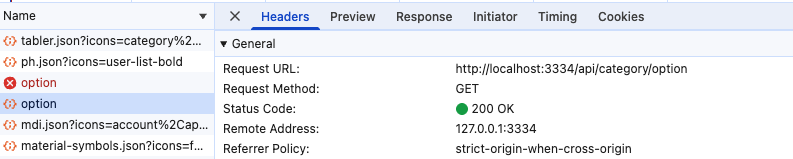

# 17 gin-blog-server 分类模块-标签模块-文章模块

## 1 分类模块

该模块提供了对分类信息进行管理的接口，涵盖分类的查询、新增、编辑和删除等操作，同时还能获取分类选项列表，方便在某些场景下进行选择。

1. **分类列表获取**：通过 `GET /category/list` 接口，可获取所有分类的列表信息，用于展示分类列表页面等场景。
2. **分类新增 / 编辑**：使用 `POST /category` 接口，既可以新增一个分类，也可以对已有的分类信息进行编辑修改。
3. **分类删除**：调用 `DELETE /category` 接口，能够删除指定的分类信息。
4. **分类选项列表获取**：`GET /category/option` 接口用于获取分类的选项列表，可用于下拉选择框等交互场景。

```go
// 分类模块
category := auth.Group("/category")
{
   category.GET("/list", categoryAPI.GetList)     // 分类列表
   category.POST("", categoryAPI.SaveOrUpdate)    // 新增/编辑分类
   category.DELETE("", categoryAPI.Delete)        // 删除分类
   category.GET("/option", categoryAPI.GetOption) // 分类选项列表
}
```


### 1.1 分类列表获取 /category/list

manager.go

```go
// 分类模块
category := auth.Group("/category")
{
  category.GET("/list", categoryAPI.GetList)
}
```

handle/handle_catogory.go

```go
// GetList 获取分类列表
// @Summary 获取分类列表
// @Description 根据条件查询获取分类列表
// @Tags Category
// @Param page_size query int false "当前页数"
// @Param page_num query int false "每页条数"
// @Param keyword query string false "搜索关键字"
// @Accept json
// @Produce json
// @Success 0 {object} Response[PageResult[model.CategoryVO]]
// @Security ApiKeyAuth
// @Router /category/list [get]
func (*Category) GetList(c *gin.Context) {
	var query PageQuery
	if err := c.ShouldBindQuery(&query); err != nil {
		ReturnError(c, global.ErrRequest, err)
		return
	}

	data, total, err := model.GetCategoryList(GetDB(c), query.Page, query.Size, query.Keyword)
	if err != nil {
		ReturnError(c, global.ErrDbOp, err)
		return
	}

	ReturnSuccess(c, PageResult[model.CategoryVO]{
		Total: total,
		List:  data,
		Size:  query.Size,
		Page:  query.Page,
	})
}
```

model/catogory.go

```go
// GetCategoryList 获取分类列表
func GetCategoryList(db *gorm.DB, num, size int, keyword string) ([]CategoryVO, int64, error) {
	var list = make([]CategoryVO, 0)
	var total int64

	db = db.Table("category c").
		Joins("LEFT JOIN article a ON c.id = a.category_id AND a.is_delete = 0 AND a.status = 1").
		Select("c.id", "c.name", "COUNT(a.id) as article_count", "c.created_at", "c.updated_at")

	if keyword != "" {
		db = db.Where("name LIKE ?", "%"+keyword+"%")
	}

	result := db.Group("c.id").
		Order("c.updated_at DESC").
		Scopes(Paginate(num, size)).
		Find(&list)

	return list, total, result.Error
}
```

 与之前的过程类似，对应的请求和响应如下：


我们可以在测试完 1.2 分类新增之后来重新查看分类列表，会显示出新增加的分类。


### 1.2 分类新增/编辑 /category POST

manager.go

```go
category.POST("", categoryAPI.SaveOrUpdate) // 新增/编辑分类
```

handle/handle_catogory.go

```go
// SaveOrUpdate 添加或修改分类
// @Summary 添加或修改分类
// @Description 添加或修改分类
// @Tags Category
// @Param form body AddOrEditCategoryReq true "添加或修改分类"
// @Accept json
// @Produce json
// @Success 0 {object} Response[model.Category]
// @Security ApiKeyAuth
// @Router /category [post]
func (*Category) SaveOrUpdate(c *gin.Context) {
	var req AddOrEditCategoryReq
	if err := c.ShouldBindJSON(&req); err != nil {
		ReturnError(c, global.ErrRequest, err)
		return
	}

	category, err := model.SaveOrUpdateCategory(GetDB(c), req.ID, req.Name)
	if err != nil {
		ReturnError(c, global.ErrDbOp, err)
		return
	}

	ReturnSuccess(c, category)
}

```

model/catogory.go

```go
// SaveOrUpdateCategory 添加或修改分类
func SaveOrUpdateCategory(db *gorm.DB, id int, name string) (*Category, error) {
	category := Category{
		Model: Model{ID: id},
		Name:  name,
	}

	var result *gorm.DB
	if id > 0 {
		result = db.Updates(&category)
	} else {
		result = db.Create(&category)
	}

	return &category, result.Error
}

```

对应的请求和响应如下：


### 1.3 分类删除 /category DELETE

manager.go

```go
category.DELETE("", categoryAPI.Delete)        // 删除分类
```

handle/handle_catogory.go

```go
// Delete 删除分类（批量）
// @Summary 删除分类（批量）
// @Description 根据 ID 数组删除分类
// @Tags Category
// @Param ids body []int true "分类 ID 数组"
// @Accept json
// @Produce json
// @Success 0 {object} Response[int]
// @Security ApiKeyAuth
// @Router /category [delete]
func (*Category) Delete(c *gin.Context) {
	var ids []int
	if err := c.ShouldBindJSON(&ids); err != nil {
		ReturnError(c, global.ErrRequest, err)
		return
	}

	db := GetDB(c)

	// 检查分类下面是否存在文章
	count, err := model.Count(db, &model.Article{}, "category_id in ?", ids)
	if err != nil {
		ReturnError(c, global.ErrDbOp, err)
		return
	}

	if count > 0 {
		ReturnError(c, global.ErrCateHasArt, nil)
		return
	}

	rows, err := model.DeleteCategory(db, ids)
	if err != nil {
		ReturnError(c, global.ErrDbOp, err)
		return
	}
	ReturnSuccess(c, rows)
}
```

model/catogory.go

```go
// DeleteCategory 删除分类（批量）
func DeleteCategory(db *gorm.DB, ids []int) (int64, error) {
	result := db.Where("id IN ?", ids).Delete(Category{})
	if result.Error != nil {
		return 0, result.Error
	}
	return result.RowsAffected, nil
}
```

对应的请求和响应如下：


### 1.4 分类选项列表获取 / category/option

manager.go

```go
category.GET("/option", categoryAPI.GetOption) // 分类选项列表
```

handle/handle_catogory.go

```go
// GetOption 获取分类选项列表
// @Summary 获取分类选项列表
// @Description 获取标签选项列表
// @Tags Category
// @Accept json
// @Produce json
// @Success 0 {object} Response[[]model.OptionVO]
// @Security ApiKeyAuth
// @Router /category/option [get]
func (*Category) GetOption(c *gin.Context) {
	list, err := model.GetCategoryOption(GetDB(c))
	if err != nil {
		ReturnError(c, global.ErrDbOp, err)
		return
	}
	ReturnSuccess(c, list)
}

```

model/catogory.go

```go
// GetCategoryOption 获取分类选项列表
func GetCategoryOption(db *gorm.DB) ([]OptionVO, error) {
	var list = make([]OptionVO, 0)
	result := db.Model(&Category{}).Select("id", "name").Find(&list)
	return list, result.Error
}
```

对应的请求和响应如下：

在点击文章列表时，会自动调用分类选项列表加载对应的分类选项，所以会发送如下请求：




得到的响应为分类的 ID-NAME 所构成的组合：

```go
type OptionVO struct {
	ID   int    `json:"value"`
	Name string `json:"name"`
}
```


### 1.5 补充

对于博客前台相关接口，我们也需要进行对应的接口补充：

首先在 manager.go 中补充如下操作：

```go
category := base.Group("/category")
{
  category.GET("/list", frontAPI.GetCategoryList) // 前台分类列表
}
```

同时在 handle_front.go 中进行补齐：

```go
// GetCategoryList 查询分类列表
func (*Front) GetCategoryList(c *gin.Context) {
  list, _, err := model.GetCategoryList(GetDB(c), 1, 1000, "")
  if err != nil {
    ReturnError(c, global.ErrDbOp, err)
    return
  }
  ReturnSuccess(c, list)
}
```


## 2 标签模块

此模块提供了标签的相关管理接口，功能与分类模块类似，主要对标签进行增删改查操作，以及获取标签选项列表。

1. **标签列表获取**：`GET /tag/list` 接口可获取所有标签的列表信息，可用于标签管理页面展示。
2. **标签新增 / 编辑**：通过 `POST /tag` 接口，可实现标签的新增或对已有标签信息的编辑。
3. **标签删除**：`DELETE /tag` 接口用于删除指定的标签。
4. **标签选项列表获取**：`GET /tag/option` 接口获取标签的选项列表，适用于需要选择标签的场景。

```go
// 标签模块
tag := auth.Group("/tag")
{
   tag.GET("/list", tagAPI.GetList)     // 标签列表
   tag.POST("", tagAPI.SaveOrUpdate)    // 新增/编辑标签
   tag.DELETE("", tagAPI.Delete)        // 删除标签
   tag.GET("/option", tagAPI.GetOption) // 标签选项列表
}
```

标签模块的思路与分类模块很像，其主要的功能如下：

### 2.1 标签列表 /tag/list

manager.go

```go
tag.GET("/list", tagAPI.GetList)     // 标签列表
```

handle/handle_tag.go

```go
type Tag struct{}

type AddOrEditTagReq struct {
	ID   int    `json:"id"`
	Name string `json:"name" binding:"required"`
}

// GetList 获取标签列表
// @Summary 获取标签列表
// @Description 根据条件查询获取标签列表
// @Tags Tag
// @Param page_size query int false "当前页数"
// @Param page_num query int false "每页条数"
// @Param keyword query string false "搜索关键字"
// @Accept json
// @Produce json
// @Success 0 {object} Response[PageResult[model.TagVO]] "成功"
// @Security ApiKeyAuth
// @Router /tag/list [get]
func (*Tag) GetList(c *gin.Context) {
	var query PageQuery
	if err := c.ShouldBindQuery(&query); err != nil {
		ReturnError(c, global.ErrRequest, err)
		return
	}

	data, total, err := model.GetTagList(GetDB(c), query.Page, query.Size, query.Keyword)
	if err != nil {
		ReturnError(c, global.ErrDbOp, err)
		return
	}

	ReturnSuccess(c, PageResult[model.TagVO]{
		Total: total,
		List:  data,
		Size:  query.Size,
		Page:  query.Page,
	})
}

```

model/tag.go

```go
type TagVO struct {
	ID        uint      `json:"id"`
	CreatedAt time.Time `json:"created_at"`
	UpdatedAt time.Time `json:"updated_at"`

	Name         string `json:"name"`
	ArticleCount int    `json:"article_count"`
}

// GetTagList 获取标签列表
func GetTagList(db *gorm.DB, page, size int, keyword string) (list []TagVO, total int64, err error) {
	db = db.Table("tag t").
		Joins("LEFT JOIN article_tag at ON t.id = at.tag_id").
		Select("t.id", "t.name", "COUNT(at.article_id) AS article_count", "t.created_at", "t.updated_at")

	if keyword != "" {
		db = db.Where("name LIKE ?", "%"+keyword+"%")
	}

	result := db.Group("t.id").Order("t.updated_at DESC").
		Count(&total).
		Scopes(Paginate(page, size)).
		Find(&list)
	return list, total, result.Error
}
```

对应的请求和响应如下：


### 2.2 新增/编辑标签 /tag POST

manager.go

```go
tag.POST("", tagAPI.SaveOrUpdate)    // 新增/编辑标签
```

handle/handle_tag.go

```go

type AddOrEditTagReq struct {
	ID   int    `json:"id"`
	Name string `json:"name" binding:"required"`
}

// SaveOrUpdate 添加或者修改标签
// @Summary 添加或修改标签
// @Description 添加或修改标签
// @Tags Tag
// @Param form body AddOrEditTagReq true "添加或修改标签"
// @Accept json
// @Produce json
// @Success 0 {object} Response[model.Tag]
// @Security ApiKeyAuth
// @Router /tag [post]
func (*Tag) SaveOrUpdate(c *gin.Context) {
	var form AddOrEditTagReq
	if err := c.ShouldBindJSON(&form); err != nil {
		ReturnError(c, global.ErrRequest, err)
		return
	}

	tag, err := model.SaveOrUpdateTag(GetDB(c), form.ID, form.Name)
	if err != nil {
		ReturnError(c, global.ErrDbOp, err)
		return
	}

	ReturnSuccess(c, tag)
}

```

绑定形式：

+ **JSON 标签**：`ShouldBindJSON` 会依据结构体字段的 `json` 标签来匹配 JSON 数据中的字段名。比如在你给出的 `AddOrEditTagReq` 结构体里，`ID` 字段对应 JSON 数据里的 `"id"`，`Name` 字段对应 `"name"`。
+ **无标签情况**：若结构体字段没有 `json` 标签，`ShouldBindJSON` 会使用字段名的小写形式进行匹配。

model/tag.go

```go
// SaveOrUpdateTag 添加或者修改标签
func SaveOrUpdateTag(db *gorm.DB, id int, name string) (*Tag, error) {
	tag := Tag{
		Model: Model{ID: id},
		Name:  name,
	}

	var result *gorm.DB
	if id > 0 {
		result = db.Updates(&tag)
	} else {
		result = db.Create(&tag)
	}

	return &tag, result.Error
}
```

对应的请求和响应如下：


对于新建一个新的标签，可以看到其对应的 AddOrEditTagReq 中  ID 为 0，之后进行的操作为 result = db.Updates(&tag)

同时我们尝试编辑一下 Tag 标签的名称，如下：


可以看到其对应的 AddOrEditTagReq 中  ID 为 1，之后进行的操作为 result = db.Updates(&tag)，从而将标签进行删除。


### 2.3 删除标签 /tag DELETE

manager.go

```go
tag.DELETE("", tagAPI.Delete)        // 删除标签
```

handle/handle_tag.go

```go
// Delete 删除标签（可以批量操作）
// TODO: 删除行为, 添加强制删除: 有关联数据则将删除关联数据
// @Summary 删除标签（批量）
// @Description 根据 ID 数组删除标签
// @Tags Tag
// @Param ids body []int true "标签 ID 数组"
// @Accept json
// @Produce json
// @Success 0 {object} Response[int]
// @Security ApiKeyAuth
// @Router /tag [delete]
func (*Tag) Delete(c *gin.Context) {
	var ids []int
	if err := c.ShouldBindJSON(&ids); err != nil {
		ReturnError(c, global.ErrRequest, err)
		return
	}

	db := GetDB(c)
	// 检查标签下面是否有文章
	count, err := model.Count(db, &model.ArticleTag{}, "tag_id in ?", ids)
	if err != nil {
		ReturnError(c, global.ErrDbOp, err)
		return
	}

	if count > 0 {
		ReturnError(c, global.ErrTagHasArt, nil)
		return
	}

	result := db.Delete(model.Tag{}, "id in ?", ids)
	if result.Error != nil {
		ReturnError(c, global.ErrDbOp, err)
		return
	}
	ReturnSuccess(c, result.RowsAffected)
}
```

对应的请求和响应如下：


可以看到，标签被成功删除。


### 2.4 标签选项列表 /tag/option

manager.go

```go
tag.GET("/option", tagAPI.GetOption) // 标签选项列表
```

handle/handle_tag.go

```go
// GetOption 获取标签选项列表
// @Summary 获取标签选项列表
// @Description 获取标签选项列表
// @Tags Tag
// @Accept json
// @Produce json
// @Success 0 {object} Response[model.OptionVO]
// @Security ApiKeyAuth
// @Router /tag/option [get]
func (*Tag) GetOption(c *gin.Context) {
	list, err := model.GetTagOption(GetDB(c))
	if err != nil {
		ReturnError(c, global.ErrDbOp, err)
		return
	}
	ReturnSuccess(c, list)
}
```

model/tag.go

```go
// GetTagOption 获取标签选项列表
func GetTagOption(db *gorm.DB) ([]OptionVO, error) {
	list := make([]OptionVO, 0)
	result := db.Model(&Tag{}).Select("id", "name").Find(&list)
	return list, result.Error
}
```

对应的请求和响应如下：


得到的响应为分类的 ID-NAME 所构成的组合：

```go
type OptionVO struct {
	ID   int    `json:"value"`
	Name string `json:"name"`
}
```


### 2.5 补充

对于博客前台相关接口，我们也需要进行对应的接口补充：

首先在 manager.go 中补充如下操作：

```go
tag := base.Group("/tag")
{
  tag.GET("/list", frontAPI.GetTagList) // 前台标签列表
}
```

同时在 handle_front.go 中进行补齐：

```go
// GetTagList 查询标签列表
func (*Front) GetTagList(c *gin.Context) {
	list, _, err := model.GetTagList(GetDB(c), 1, 1000, "")
	if err != nil {
		ReturnError(c, global.ErrDbOp, err)
		return
	}
	ReturnSuccess(c, list)
}
```


## 3 文章模块

文章模块提供了一系列丰富的接口，用于对文章进行全面的管理，包括文章的增删改查、置顶设置、软删除、物理删除以及导入导出等操作。

1. **文章列表获取**：`GET /article/list` 接口用于获取文章的列表信息，可用于文章列表展示页面。
2. **文章新增 / 编辑**：`POST /article` 接口可实现文章的新增或者对已有文章内容的编辑修改。
3. **文章置顶更新**：`PUT /article/top` 接口可更新文章的置顶状态，使文章在列表中置顶显示。
4. **文章详情获取**：`GET /article/:id` 接口根据文章的 ID 获取文章的详细信息，用于文章详情展示页面。
5. **文章软删除**：`PUT /article/soft - delete` 接口对文章进行软删除操作，文章不会真正从数据库中移除，只是标记为已删除状态。
6. **文章物理删除**：`DELETE /article` 接口会将文章从数据库中彻底删除。
7. **文章导出**：`POST /article/export` 接口可将文章信息导出，可能以某种文件格式（如 CSV、Excel 等）保存。
8. **文章导入**：`POST /article/import` 接口允许用户将外部文件中的文章信息导入到系统中。

```go
// 文章模块
articles := auth.Group("/article")
{
   articles.GET("/list", articleAPI.GetList)                 // 文章列表
   articles.POST("", articleAPI.SaveOrUpdate)                // 新增/编辑文章
   articles.PUT("/top", articleAPI.UpdateTop)                // 更新文章置顶
   articles.GET("/:id", articleAPI.GetDetail)                // 文章详情
   articles.PUT("/soft-delete", articleAPI.UpdateSoftDelete) // 软删除文章
   articles.DELETE("", articleAPI.Delete)                    // 物理删除文章
   articles.POST("/export", articleAPI.Export)               // 导出文章
   articles.POST("/import", articleAPI.Import)               // 导入文章
}
```


### 3.1 文章列表获取 /article/list

manager.go

```go
var (
	// 后端管理系统接口
	...
	articleAPI  handle.Article  // 文章
)


// 文章模块
articles := auth.Group("/article")
{
  articles.GET("/list", articleAPI.GetList) // 文章列表
}
```

handle/handle_article.go

```go
package handle

import (
	"gin-blog-server/internal/global"
	"gin-blog-server/internal/model"
	"github.com/gin-gonic/gin"
	"strconv"
)

type Article struct{}

// ArticleQuery 文章查询输入请求
// TODO: 添加对标签数组的查询
type ArticleQuery struct {
	PageQuery
	Title      string `form:"title"`
	CategoryId int    `form:"category_id"`
	TagId      int    `form:"tag_id"`
	Type       int    `form:"type"`
	Status     int    `form:"status"`
	IsDelete   *bool  `form:"is_delete"`
}

type ArticleVO struct {
	model.Article
	// gorm:"-" 是一个标签，它的主要作用是告诉 GORM 忽略结构体中的某个字段，使其在数据库操作（如创建表、插入数据、查询数据等）中不被考虑。
	// GORM 默认会将结构体名转换为蛇形命名法（snake_case）并以复数形式作为数据库表名。
	LikeCount    int `json:"like_count" gorm:"-"`
	ViewCount    int `json:"view_count" gorm:"-"`
	CommentCount int `json:"comment_count" gorm:"-"`
}

// GetList 获取文章列表
func (*Article) GetList(c *gin.Context) {
	var query ArticleQuery
	if err := c.ShouldBindQuery(&query); err != nil {
		ReturnError(c, global.ErrRequest, err)
		return
	}

	db := GetDB(c)
	rdb := GetRDB(c)

	list, total, err := model.GetArticleList(db, query.Page, query.Size, query.Title, query.IsDelete, query.Status, query.Type, query.CategoryId, query.TagId)
	if err != nil || list == nil {
		ReturnError(c, global.ErrDbOp, err)
		return
	}

	// 获取所有文章的点赞数
	likeCountMap := rdb.HGetAll(rctx, global.ARTICLE_LIKE_COUNT).Val()
	// 获取所有文章的观看量，并排序
	viewCountZ := rdb.ZRangeWithScores(rctx, global.ARTICLE_VIEW_COUNT, 0, -1).Val()

	viewCountMap := make(map[int]int)
	for _, article := range viewCountZ {
		id, _ := strconv.Atoi(article.Member.(string))
		viewCountMap[id] = int(article.Score)
	}

	data := make([]ArticleVO, 0)
	for _, article := range list {
		likeCount, _ := strconv.Atoi(likeCountMap[strconv.Itoa(article.ID)])
		data = append(data, ArticleVO{
			Article:   article,
			LikeCount: likeCount,
			ViewCount: viewCountMap[article.ID],
		})
	}

	ReturnSuccess(c, PageResult[ArticleVO]{
		Size:  query.Size,
		Page:  query.Page,
		Total: total,
		List:  data,
	})
}
```

model/article.go

```go
// GetArticleList 获取文章列表
func GetArticleList(db *gorm.DB, page, size int, title string, isDelete *bool, status, typ, categoryId, tagId int) (list []Article, total int64, err error) {
	db = db.Model(Article{})

	if title != "" {
		db = db.Where("title LIKE ?", "%"+title+"%")
	}
	if isDelete != nil {
		db = db.Where("is_delete", *isDelete)
	}
	if status != 0 {
		db = db.Where("status", status)
	}
	if categoryId != 0 {
		db = db.Where("category_id", categoryId)
	}
	if typ != 0 {
		db = db.Where("type", typ)
	}

	db = db.Preload("Category").Preload("Tags").
		Joins("LEFT JOIN article_tag ON article_tag.article_id = article.id")
	// .Group("id") // 去重（这行似乎没有作用，先注释掉）

	if tagId != 0 {
		db = db.Where("tag_id = ?", tagId)
	}

	result := db.Count(&total).
		Scopes(Paginate(page, size)).
		Order("is_top DESC, article.id DESC").
		Find(&list)
	return list, total, result.Error
}
```

**我们先去完成功能  3.2 文章新增/编辑  /article POST，有了文章之后，再来测试文章列表获取的功能是否可以正常使用。**

对应的请求和响应如下：


这里需要注意的是，在获取文章列表时，我们使用的 sql 为：

```go
db = db.Preload("Category").Preload("Tags").
		Joins("LEFT JOIN article_tag ON article_tag.article_id = article.id").
		Group("id") // 去重
```

其中：

- `Preload("Category")` 和 `Preload("Tags")` 预加载 `Category` 和 `Tags` 关联数据。
- `LEFT JOIN article_tag ON article_tag.article_id = article.id`
   这是一个 `LEFT JOIN`，`article_tag` 可能有多条记录，如果 `article` 关联了多个 `Tags`，则 `article` 会被重复返回。
- `Group("id")`
   这个 `GROUP BY id` 用来去重，让结果只保留 `article.id` 唯一的记录。

**如果没有 Group("id") 的存在，则会获取到两条同样的 Article 信息。**

`LEFT JOIN` 连接 `article_tag` 表时，如果 `article` 关联了多个 `tags`，则 `article` 会被重复返回。例如：

| article.id | article.title | article.content | article_tag.tag_id |
| ---------- | ------------- | --------------- | ------------------ |
| 1          | "Gorm"        | "Go ORM"        | 101                |
| 1          | "Gorm"        | "Go ORM"        | 102                |

在 `SQL` 结果集中，`article.id=1` 被返回了两次，因为 `article_tag` 表中有两条数据，导致 `JOIN` 结果中 `article` 被**重复**。

添加 `GROUP BY id` 后，SQL 只保留每个 `article.id` 的**一条记录**，避免重复返回。

但是需要注意：

- `GROUP BY` 可能导致 `SELECT` 语句中的其他字段（如 `Tags`）变得不确定。
- `Gorm` 的 `Preload("Tags")` 会在 `GROUP BY` 后**额外查询** `Tags`，所以不会影响 `Tags` 的完整性。


### 3.2 文章新增/编辑  /article POST

manager.go

```go
articles.POST("", articleAPI.SaveOrUpdate)                // 新增/编辑文章
```

handle/handle_article.go

```go
// AddOrEditArticleReq 新增或者编辑文章的请求
type AddOrEditArticleReq struct {
	ID          int    `json:"id"`
	Title       string `json:"title" binding:"required"`
	Desc        string `json:"desc"`
	Content     string `json:"content" binding:"required"`
	Img         string `json:"img"`
	Type        int    `json:"type" binding:"required,min=1,max=3"`   // 类型: 1-原创 2-转载 3-翻译
	Status      int    `json:"status" binding:"required,min=1,max=3"` // 类型: 1-公开 2-私密 3-评论可见
	IsTop       bool   `json:"is_top"`
	OriginalUrl string `json:"original_url"`

	TagNames     []string `json:"tag_names"`
	CategoryName string   `json:"category_name"`
}

// SaveOrUpdate 新增或者编辑文章
func (*Article) SaveOrUpdate(c *gin.Context) {
	var req AddOrEditArticleReq
	if err := c.ShouldBindJSON(&req); err != nil {
		ReturnError(c, global.ErrRequest, err)
		return
	}

	db := GetDB(c)
	auth, _ := CurrentUserAuth(c)

	if req.Img == "" {
		req.Img = model.GetConfig(db, global.CONFIG_ARTICLE_COVER) // 默认图片
	}

	article := model.Article{
		Model:       model.Model{ID: req.ID},
		Title:       req.Title,
		Desc:        req.Desc,
		Content:     req.Content,
		Img:         req.Img,
		Type:        req.Type,
		Status:      req.Status,
		OriginalUrl: req.OriginalUrl,
		IsTop:       req.IsTop,
		UserId:      auth.UserInfoId,
	}

	err := model.SaveOrUpdateArticle(db, &article, req.CategoryName, req.TagNames)
	if err != nil {
		ReturnError(c, global.ErrDbOp, err)
		return
	}

	ReturnSuccess(c, article)
}
```

model/article.go

```go
// SaveOrUpdateArticle 新增/编辑文章, 同时根据 分类名称, 标签名称 维护关联表
func SaveOrUpdateArticle(db *gorm.DB, article *Article, categoryName string, tagNames []string) error {
	// 由于要操作多个数据库表，所以要开启事务
	return db.Transaction(func(tx *gorm.DB) error {
		// 分类不存在则创建
		category := Category{Name: categoryName}
		result := db.Model(&Category{}).Where("name", categoryName).FirstOrCreate(&category)
		if result.Error != nil {
			return result.Error
		}

		// 设置文章的分类
		article.CategoryId = category.ID

		// 先 添加/更新 文章, 获取到其 ID
		if article.ID == 0 {
			result = db.Create(article)
		} else {
			result = db.Model(article).Where("id", article.ID).Updates(article)
		}
		if result.Error != nil {
			return result.Error
		}

		// 清空文章标签关联
		result = db.Delete(&ArticleTag{}, "article_id", article.ID)
		if result.Error != nil {
			return result.Error
		}

		// 并重新开始新建 文章-标签 关联
		var articleTags []ArticleTag
		for _, tagName := range tagNames {
			// 标签不存在则创建
			tag := Tag{Name: tagName}
			result := db.Model(&Tag{}).Where("name", tagName).FirstOrCreate(&tag)
			if result.Error != nil {
				return result.Error
			}
			articleTags = append(articleTags, ArticleTag{
				ArticleId: article.ID,
				TagId:     tag.ID,
			})
		}

		result = db.Create(&articleTags)
		return result.Error
	})
}
```

为了测试上述功能，我们首先要对数据库中的 config 表进行补全，通过config.sql 导入即可，补全后的 config 内容如如下，我们可以从中获取默认的头像设置。


对应的请求和响应如下：

1. 首先编写文章并选择文章分类、文章标签等信息


2. 点击确认之后查看发送的请求：


请求中携带的 body 字段如下：


对应的返回信息如下，证明成功插入了一篇新的文章：


之后，我们可以到 3.1 文章列表获取中查看文章内容。


### 3.3 文章置顶更新  PUT /article/top

manager.go

```go
articles.PUT("/top", articleAPI.UpdateTop)                // 更新文章置顶
```

handle/handle_article.go

```go
type UpdateArticleTopReq struct {
	ID    int  `json:"id"`
	IsTop bool `json:"is_top"`
}

// UpdateTop 修改置顶信息
func (*Article) UpdateTop(c *gin.Context) {
	var req UpdateArticleTopReq
	if err := c.ShouldBindJSON(&req); err != nil {
		ReturnError(c, global.ErrRequest, err)
		return
	}

	err := model.UpdateArticleTop(GetDB(c), req.ID, req.IsTop)
	if err != nil {
		ReturnError(c, global.ErrDbOp, err)
		return
	}
	ReturnSuccess(c, nil)
}

```

model/article.go

```go
// UpdateArticleTop 修改置顶信息
func UpdateArticleTop(db *gorm.DB, id int, isTop bool) error {
	result := db.Model(&Article{Model: Model{ID: id}}).Update("is_top", isTop)
	return result.Error
}
```

> 1. `db.Model(&Article{Model: Model{ID: id}}).Update("is_top", isTop)`
>
> - **功能**：这种方式使用 `Model` 方法指定要操作的记录，通过 `Update` 方法只更新单个字段 `is_top` 的值。`Update` 方法接受两个参数，第一个参数是要更新的字段名，第二个参数是要更新的值。
> - **适用场景**：当你只需要更新数据库中某条记录的单个字段时，使用这种方式较为合适。它只会更新指定的字段，不会影响其他字段的值。
> - **示例代码解释**：
>
> ```go
> // UpdateArticleTop 修改置顶信息
> func UpdateArticleTop(db *gorm.DB, id int, isTop bool) error {
>     result := db.Model(&Article{Model: Model{ID: id}}).Update("is_top", isTop)
>     return result.Error
> }
> ```
>
> 在这个函数中，它会找到 `Article` 表中 `ID` 为 `id` 的记录，并将 `is_top` 字段更新为 `isTop` 的值，其他字段不会受到影响。
>
> 2. `db.Updates(&Article{Model: Model{ID: id}, IsTop: IsTop})`
>
> - **功能**：`Updates` 方法会更新结构体中所有非零值字段。它会根据结构体中设置的字段值，将这些值更新到数据库中对应 `ID` 的记录里。
> - **适用场景**：当你需要同时更新数据库中某条记录的多个字段时，使用这种方式比较方便。不过要注意，如果结构体中的其他字段有默认值，这些默认值也会被更新到数据库中。
> - **示例代码解释**：
>
> ```go
> db.Updates(&Article{Model: Model{ID: id}, IsTop: IsTop})
> ```
>
> 这里会找到 `Article` 表中 `ID` 为 `id` 的记录，然后将结构体中设置的**非零值字段** 更新到该记录中。如果 `Article` 结构体还有其他字段且有默认值，这些字段也会被更新到数据库中。

对应的请求和响应如下：


### 3.4 文章详情获取 GET /article/:id

manager.go

```go
articles.GET("/:id", articleAPI.GetDetail) // 文章详情
```

handle/handle_article.go

```go
// GetDetail 获取文章详细信息
func (*Article) GetDetail(c *gin.Context) {
	id, err := strconv.Atoi(c.Param("id"))
	if err != nil {
		ReturnError(c, global.ErrRequest, err)
		return
	}

	article, err := model.GetArticle(GetDB(c), id)
	if err != nil {
		ReturnError(c, global.ErrDbOp, err)
		return
	}

	ReturnSuccess(c, article)
}
```

model/article.go

```go
// GetArticle 文章的详细信息
func GetArticle(db *gorm.DB, id int) (data *Article, err error) {
	result := db.Preload("Category").Preload("Tags").
		Where(Article{Model: Model{ID: id}}).
		First(&data)
	return data, result.Error
}
```

对应的请求和响应如下：

点击查看某个具体文章时，会发送对应的请求：


返回具体的文章信息：


### 3.5 文件软删除 PUT /article/soft

manager.go

```go
articles.PUT("/soft-delete", articleAPI.UpdateSoftDelete) // 软删除文章
```

handle/handle_article.go

```go
type SoftDeleteReq struct {
	Ids      []int `json:"ids"`
	IsDelete bool  `json:"is_delete"`
}

// UpdateSoftDelete 软删除文章
func (*Article) UpdateSoftDelete(c *gin.Context) {
	var req SoftDeleteReq
	if err := c.ShouldBindJSON(&req); err != nil {
		ReturnError(c, global.ErrRequest, err)
		return
	}

	rows, err := model.UpdateArticleSoftDelete(GetDB(c), req.Ids, req.IsDelete)
	if err != nil {
		ReturnError(c, global.ErrDbOp, err)
		return
	}

	ReturnSuccess(c, rows)
}
```

model/article.go

```go
// UpdateArticleSoftDelete 软删除文章（修改）
func UpdateArticleSoftDelete(db *gorm.DB, ids []int, isDelete bool) (int64, error) {
	result := db.Model(Article{}).
		Where("id IN ?", ids).
		Update("is_delete", isDelete)
	if result.Error != nil {
		return 0, result.Error
	}
	return result.RowsAffected, nil
}
```

对应的请求和响应如下：

操作点击删除：


查看发送的请求：


之后，更新文章列表会发现，文章已经被成功删除：


可以到数据库中查看，当前文章的记录在数据库中并没有被删除，只不过是将 is_delete 字段修改为 1，如果将其修改为 0 的话，我们刷新界面，会发现文章重新出现在了文章列表中。


### 3.6 文章物理删除 DELETE /article

文章物理删除的主要目的是，撤出清除数据库中的记录条数，软删除和物理删除的区别在于：

+ 对于文章，点击删除 -> 软删除 -> 文章列表不可见，查看回收站可见
+ 对于回收站中的文章，其 is_delete 属性已经为 1，此时点击删除，会触发物理删除 -> 彻底删除文章

前端代码中的核心逻辑如下：

```javascript
const extraParams = ref({
    is_delete: null, // 未删除 | 回收站
    status: null, // null-all, 1-公开, 2-私密, 3-草稿
})

function updateOrDeleteArticles(ids) {
    extraParams.value.is_delete
        ? api.deleteArticle(ids)
        : api.softDeleteArticle(JSON.parse(ids), true)
}

// 切换标签页: [全部, 公开, 私密, 草稿箱, 回收站]
function handleChangeTab(value) {
    switch (value) {
        case 'all':
            extraParams.value.is_delete = 0
            extraParams.value.status = null
            break
        case 'public':
            extraParams.value.is_delete = 0
            extraParams.value.status = 1
            break
        case 'secret':
            extraParams.value.is_delete = 0
            extraParams.value.status = 2
            break
        case 'draft':
            extraParams.value.is_delete = 0
            extraParams.value.status = 3
            break
        case 'delete':
            extraParams.value.is_delete = 1
            extraParams.value.status = null
            break
    }
    $table.value?.handleSearch()
}
```

manager.go

```go
articles.DELETE("", articleAPI.Delete)                    // 物理删除文章
```

handle/handle_article.go

```go
// Delete 物理删除文章
func (*Article) Delete(c *gin.Context) {
	var ids []int
	if err := c.ShouldBindJSON(&ids); err != nil {
		ReturnError(c, global.ErrRequest, err)
		return
	}

	rows, err := model.UpdateArticle(GetDB(c), ids)
	if err != nil {
		ReturnError(c, global.ErrDbOp, err)
		return
	}

	ReturnSuccess(c, rows)
}
```

model/article.go

```go
// DeleteArticle 物理删除文章
func DeleteArticle(db *gorm.DB, ids []int) (int64, error) {
	// 删除 [文章-标签] 关联
	result := db.Where("article_id IN ?", ids).Delete(&ArticleTag{})
	if result.Error != nil {
		return 0, result.Error
	}

	// 删除 [文章]
	result = db.Where("id IN ?", ids).Delete(&Article{})
	if result.Error != nil {
		return 0, result.Error
	}

	return result.RowsAffected, nil
}

```

对应的请求和响应如下：

当我们点击回收站时，会将 is_delete = 1 的文章全部展示


然后点击删除，会将这些文章从数据库记录中删除。


### 3.7 文章导出 POST /article/export

manager.go

```go
articles.POST("/export", articleAPI.Export)               // 导出文章
```

handle/handle_article.go

```go
// Export 导出文章: 获取导出后的资源链接列表
// TODO: 目前是前端导出
func (*Article) Export(c *gin.Context) {
	ReturnSuccess(c, nil)
}
```

前端对于导出的实现如下：

```javascript
// 导出文章
async function exportArticles(ids) {
    // 方式一: 前端根据文章内容和标题进行导出
    const list = $table.value?.tableData.filter(e => ids.includes(e.id))
    for (const item of list)
        downloadFile(item.content, `${item.title}.md`)

    // 方式二: 后端导出返回链接, 前端根据链接下载
    // const res = await api.exportArticles(ids)
    // for (const url of res.data)
    // downloadFile(url)
}

function downloadFile(content, fileName) {
    const aEle = document.createElement('a') // 创建下载链接
    aEle.download = fileName // 设置下载的名称
    aEle.style.display = 'none'// 隐藏的可下载链接
    // 字符内容转变成 blob 地址
    const blob = new Blob([content])
    aEle.href = URL.createObjectURL(blob)
    // 绑定点击时间
    document.body.appendChild(aEle)
    aEle.click()
    // 然后移除
    document.body.removeChild(aEle)
}
```

对应的操作过程如下：


### 3.8 文章导入 POST /article/import

manager.go

```go
articles.POST("/import", articleAPI.Import)               // 导入文章
```

handle/handle_article.go

```go
// Import 倒入文章：题目 + 内容
func (*Article) Import(c *gin.Context) {
	db := GetDB(c)
	auth, _ := CurrentUserAuth(c)

	_, fileHeader, err := c.Request.FormFile("file")
	if err != nil {
		ReturnError(c, global.ErrFileReceive, err)
		return
	}

	fileName := fileHeader.Filename
	// 获取文章题目
	title := fileName[:len(fileName)-3]
	// 获取文章内容
	content, err := readFromFileHeader(fileHeader)
	if err != nil {
		ReturnError(c, global.ErrFileReceive, err)
		return
	}

	// 获取默认文章封面
	defaultImg := model.GetConfig(db, global.CONFIG_ARTICLE_COVER)
	err = model.ImportArticle(db, auth.ID, title, content, defaultImg, "学习", "后端开发")
	if err != nil {
		ReturnError(c, global.ErrDbOp, err)
		return
	}

	ReturnSuccess(c, nil)
}

// 获取文章内容
func readFromFileHeader(file *multipart.FileHeader) (string, error) {
	open, err := file.Open()
	if err != nil {
		slog.Error("文件读取，目标地址错误：", err)
		return "", err
	}
	defer open.Close()

	all, err := io.ReadAll(open)
	if err != nil {
		slog.Error("文件读取失败：", err)
		return "", err
	}

	return string(all), nil
}
```

model/article.go

```go
const (
	STATUS_PUBLIC = iota + 1 // 公开
	STATUS_SECRET            // 私密
	STATUS_DRAFT             // 草稿
)

const (
	TYPE_ORIGINAL  = iota + 1 // 原创
	TYPE_REPRINT              // 转载
	TYPE_TRANSLATE            // 翻译
)

// ImportArticle 导入文章：题目 + 内容
// TODO：如果原来的文件中有图片的话，直接上传图片会由于链接错误无法显示？如何解决图片的自动化上传云+正常显示
func ImportArticle(db *gorm.DB, userAuthId int, title string, content string, img string, categoryName string, tagName string) error {
	article := Article{
		Title:   title,
		Content: content,
		Img:     img,
		Status:  STATUS_DRAFT,
		Type:    TYPE_ORIGINAL,
		UserId:  userAuthId,
	}

	// 生成对应的分类
	category := Category{Name: categoryName}
	result := db.Model(&Category{}).Where("name", categoryName).FirstOrCreate(&category)
	if result.Error != nil {
		return result.Error
	}
	article.CategoryId = category.ID

	// 插入文章
	result = db.Create(&article)
	if result.Error != nil {
		return result.Error
	}

	// 生成对应的文章-标签记录
	var articleTag ArticleTag
	tag := Tag{Name: tagName}
	result = db.Model(&Tag{}).Where("name", tagName).FirstOrCreate(&tag)
	if result.Error != nil {
		return result.Error
	}

	// 插入 文章-标签
	articleTag.ArticleId = article.ID
	articleTag.TagId = tag.ID
	result = db.Create(&articleTag)

	return result.Error
}
```

对应的请求和响应如下：

1. 点击批量导入，随机选中一个 md 文件进行上传：


初步怀疑

+ 这里我发现会报错： level=INFO msg="[Func-ReturnError] TOKEN 不存在，请重新登陆"

+ 报错的原因是 middleware/JWTAuth 进入到了 "没有找到的资源，不需要鉴权，跳过后续的验证过程" 分支，这种情况应该是数据库 - resource 表中缺少了导入操作的操作权限
+ 但是，我从数据库中检查，发现数据库配置没有问题

我对  middleware/JWTAuth 进行 debug 排查，发现前端发送 import 请求时没有携带Authorization 中 token，所以才会报错 token 不存在

这里去前端代码中进行查看发现，导入文章时候，并没有调用 api 接口，应该是从按钮处直接发送的导入请求：


 具体代码如下：这里直接 action 调用 /api/article/import，所以没有带 token 进行请求

```html
<div class="inline-block">
  <NUpload action="/api/article/import" :show-file-list="false" multiple @before-upload="beforeUpload"
           @finish="afterUpload">
    <NButton type="success">
      <template #icon>
        <p class="i-mdi:import" />
      </template>
      批量导入
    </NButton>
  </NUpload>
</div>
```

我们将前端代码进行修改：

```html
<div class="inline-block">
  <NUpload  action="/api/article/import" :show-file-list="false" :headers="uploadHeaders" multiple @before-upload="beforeUpload" @finish="afterUpload">
    <NButton type="success">
      <template #icon>
        <p class="i-mdi:import" />
          </template>
批量导入
  </NButton>
</NUpload>
</div>
```

```javascript
import { useAuthStore } from '@/store'

// 获取 token（通常在 store 中存储）
const { token } = useAuthStore()

// 定义上传请求头
const uploadHeaders = ref({
  'Authorization': `Bearer ${token}`
});
```

回到前端页面，再次点击上传：


我们可以查看其携带的 payload，可以看到他将文章的内容通过 payload 进行二进制传输：


可以看到文件被正确上传：


### 3.9 完善 FrontAPI

manager.go:

```go
article := base.Group("/article")
	{
		article.GET("/list", frontAPI.GetArticleList)    // 前台文章列表
		article.GET("/:id", frontAPI.GetArticleInfo)     // 前台文章详情
		article.GET("/archive", frontAPI.GetArchiveList) // 前台文章归档
		article.GET("/search", frontAPI.SearchArticle)   // 前台文章搜索
	}
```

这个模块我们分别对四个功能函数进行构建，其功能与后台的功能非常类似，就不进行功能测试了，四个功能的实现分别如下：

#### 3.9.1 前台文章列表

handle_front.go

```go
type FArticleQuery struct {
	PageQuery
	CategoryId int `form:"category_id"`
	TagId      int `form:"tag_id"`
}

// GetArticleList 获取文章列表
func (*Front) GetArticleList(c *gin.Context) {
	var query FArticleQuery
	if err := c.ShouldBindQuery(&query); err != nil {
		ReturnError(c, global.ErrRequest, err)
		return
	}

	list, _, err := model.GetBlogArticleList(GetDB(c), query.Page, query.Size, query.CategoryId, query.TagId)
	if err != nil {
		ReturnError(c, global.ErrDbOp, err)
		return
	}

	ReturnSuccess(c, list)
}
```

article.go:

```go
// GetBlogArticleList 前台文章列表（不在回收站并且状态为公开）
func GetBlogArticleList(db *gorm.DB, page, size, categoryId, tagId int) (data []Article, total int64, err error) {
	db = db.Model(Article{})
	db = db.Where("is_delete = 0 AND status = 1")

	if categoryId != 0 {
		db = db.Where("category_id", categoryId)
	}

	if tagId != 0 {
		db = db.Where("id IN (SELECT article_id FROM article_tag WHERE tag_id = ?)", tagId)
	}

	db = db.Count(&total)
	result := db.Preload("Tags").Preload("Category").
		Order("is_top DESC, id DESC").
		Scopes(Paginate(page, size)).
		Find(&data)

	return data, total, result.Error
}
```

处理逻辑大致如下：GetBlogArticleList 前台文章列表（不在回收站并且状态为公开）

1. **初始化数据库操作对象并设置基本查询条件**：

   - 代码通过 `db = db.Model(Article{})` 指定要操作的数据库表为 `Article` 模型对应的表。
   - 接着使用 `db = db.Where("is_delete = 0 AND status = 1")` 设置基本的查询条件，筛选出 `is_delete` 字段为 `0`（表示不在回收站）且 `status` 字段为 `1`（表示状态为公开）的文章记录。

2. **根据传入参数添加额外查询条件**：

   - 如果 `categoryId` 不为 `0`，通过 `db = db.Where("category_id", categoryId)` 添加条件，筛选出指定分类 ID 的文章记录。
   - 如果 `tagId` 不为 `0`，使用子查询 `db = db.Where("id IN (SELECT article_id FROM article_tag WHERE tag_id = ?)", tagId)`，筛选出包含指定标签 ID 的文章记录。

3. **执行查询并处理结果**：

   - 首先通过 `db = db.Count(&total)` 统计符合前面所有条件的文章总数，并将结果赋值给 `total` 变量。

   - 然后使用

     ```
     result := db.Preload("Tags").Preload("Category").Order("is_top DESC, id DESC").Scopes(Paginate(page, size)).Find(&data)
     ```

      进行查询操作：

     - `Preload("Tags").Preload("Category")` 进行预加载，获取文章相关的标签和分类信息，避免 N+1 查询问题。
     - `Order("is_top DESC, id DESC")` 对查询结果进行排序，先按 `is_top` 字段降序排列（置顶文章在前），再按 `id` 字段降序排列。
     - `Scopes(Paginate(page, size))` 应用分页逻辑，根据传入的 `page` 和 `size` 参数获取指定页码和数量的文章记录。
     - `Find(&data)` 执行查询，并将查询结果赋值给 `data` 切片。

   - 最后返回查询到的文章列表 `data`、文章总数 `total` 以及可能存在的错误 `result.Error`。


#### 3.9.2 前台文章详情

article.go:

```go
// BlogArticleVO 博客需要的文章详情信息
type BlogArticleVO struct {
	Article

	CommentCount int64 `json:"comment_count"` // 评论数量
	LikeCount    int64 `json:"like_count"`    // 点赞数量
	ViewCount    int64 `json:"view_count"`    // 访问数量

	LastArticle       ArticlePaginationVO  `gorm:"-" json:"last_article"`       // 上一篇
	NextArticle       ArticlePaginationVO  `gorm:"-" json:"next_article"`       // 下一篇
	RecommendArticles []RecommendArticleVO `gorm:"-" json:"recommend_articles"` // 推荐文章
	NewestArticles    []RecommendArticleVO `gorm:"-" json:"newest_articles"`    // 最新文章
}

type ArticlePaginationVO struct {
	ID    int    `json:"id"`
	Img   string `json:"img"`
	Title string `json:"title"`
}

type RecommendArticleVO struct {
	ID        int       `json:"id"`
	Img       string    `json:"img"`
	Title     string    `json:"title"`
	CreatedAt time.Time `json:"created_at"`
}

// GetBlogArticle 获取文章的详细内容，但是该文章需要不在回收站并且状态为公开
func GetBlogArticle(db *gorm.DB, id int) (data *Article, err error) {
	result := db.Preload("Category").Preload("Tags").
		Where(Article{Model: Model{ID: id}}).
		Where("is_delete = 0 AND status = 1").
		First(&data)
	return data, result.Error
}

// GetRecommendList 查询 n 篇推荐文章 (根据标签)
func GetRecommendList(db *gorm.DB, id, n int) (list []RecommendArticleVO, err error) {
	// sub1: 查出标签id列表
	// SELECT tag_id FROM `article_tag` WHERE `article_id` = ?
	sub1 := db.Table("article_tag").Select("tag_id").Where("article_id", id)

	// sub2: 查出这些标签对应的文章id列表 (去重, 且不包含当前文章)
	// SELECT DISTINCT article_id FROM (sub1) t
	// JOIN article_tag t1 ON t.tag_id = t1.tag_id
	// WHERE `article_id` != ?
	sub2 := db.Table("(?) t1", sub1).
		Select("DISTINCT article_id").
		Joins("JOIN article_tag t ON t.tag_id = t1.tag_id").
		Where("article_id != ?", id)

	// 根据 文章id列表 查出文章信息 (前 n 个)
	result := db.Table("(?) t2", sub2).
		Select("id, title, img, created_at").
		Joins("JOIN article a ON t2.article_id = a.id").
		Where("a.is_delete = 0 AND a.status = 1").
		Order("is_top, id DESC").
		Limit(n).
		Find(&list)
	return list, result.Error
}

// GetNewestList 查询最新的 n 篇文章
func GetNewestList(db *gorm.DB, n int) (data []RecommendArticleVO, err error) {
	result := db.Model(&Article{}).
		Select("id, title, img, created_at").
		Where("is_delete = 0 AND status = 1").
		Order("created_at DESC, id ASC").
		Limit(n).
		Find(&data)
	return data, result.Error
}

// GetLastArticle 查询上一篇文章 (id < 当前文章 id)
func GetLastArticle(db *gorm.DB, id int) (val ArticlePaginationVO, err error) {
	sub := db.Table("article").Select("max(id)").Where("id < ?", id)
	result := db.Table("article").
		Select("id, title, img").
		Where("is_delete = 0 AND status = 1 AND id = (?)", sub).
		Find(&val)
	return val, result.Error
}

// GetNextArticle 查询下一篇文章 (id > 当前文章 id)
func GetNextArticle(db *gorm.DB, id int) (data ArticlePaginationVO, err error) {
	result := db.Model(&Article{}).
		Select("id, title, img").
		Where("is_delete = 0 AND status = 1 AND id > ?", id).
		Limit(1).
		Find(&data)
	return data, result.Error
}
```

comment.go

```go
/*
如果评论类型是文章，那么 topic_id 就是文章的 id
如果评论类型是友链，不需要 topic_id
*/

type Comment struct {
	Model
	UserId      int    `json:"user_id"`       // 评论者
	ReplyUserId int    `json:"reply_user_id"` // 被回复者
	TopicId     int    `json:"topic_id"`      // 评论的文章
	ParentId    int    `json:"parent_id"`     // 父评论 被回复的评论
	Content     string `gorm:"type:varchar(500);not null" json:"content"`
	Type        int    `gorm:"type:tinyint(1);not null;comment:评论类型(1.文章 2.友链 3.说说)" json:"type"` // 评论类型 1.文章 2.友链 3.说说
	IsReview    bool   `json:"is_review"`

	// Belongs To
	User      *UserAuth `gorm:"foreignKey:UserId" json:"user"`
	ReplyUser *UserAuth `gorm:"foreignKey:ReplyUserId" json:"reply_user"`
	Article   *Article  `gorm:"foreignKey:TopicId" json:"article"`
}

type CommentVO struct {
	Comment
	LikeCount  int         `json:"like_count" gorm:"-"`
	ReplyCount int         `json:"reply_count" gorm:"-"`
	ReplyList  []CommentVO `json:"reply_list" gorm:"-"`
}


// GetArticleCommentCount 获取某篇文章的评论数
func GetArticleCommentCount(db *gorm.DB, articleId int) (count int64, err error) {
	result := db.Model(&Comment{}).
		Where("topic_id = ? AND type = 1 AND is_review = 1", articleId).
		Count(&count)
	return count, result.Error
}
```

同时，z_base.go 中不全关于 comment 的自动生成：

```go
return db.AutoMigrate(
		...
		&Comment{},      // 评论
		...
	)
```

handle_front.go

```go
// GetArticleInfo 根据 [文章id] 获取 [文章详情]
func (*Front) GetArticleInfo(c *gin.Context) {
	id, err := strconv.Atoi(c.Param("id"))
	if err != nil {
		ReturnError(c, global.ErrRequest, err)
		return
	}

	db := GetDB(c)
	rdb := GetRDB(c)

	// 文章详情
	val, err := model.GetBlogArticle(db, id)
	if err != nil {
		ReturnError(c, global.ErrDbOp, err)
		return
	}

	article := model.BlogArticleVO{Article: *val}

	// 推荐文章 - 6篇
	article.RecommendArticles, err = model.GetRecommendList(db, id, 6)
	if err != nil {
		ReturnError(c, global.ErrDbOp, err)
		return
	}

	// 最新文章 - 5 篇
	article.NewestArticles, err = model.GetNewestList(db, 5)
	if err != nil {
		ReturnError(c, global.ErrDbOp, err)
		return
	}

	// 更新文章浏览量 TODO: 删除文章时删除其浏览量
	// updateArticleViewCount(c, id)

	// TODO: 更新访问量
	// * 目前请求一次就会增加访问量, 即刷新可以刷访问量
	rdb.ZIncrBy(rctx, global.ARTICLE_VIEW_COUNT, 1, strconv.Itoa(id))

	// 上一篇文章
	article.LastArticle, err = model.GetLastArticle(db, id)
	if err != nil {
		ReturnError(c, global.ErrDbOp, err)
		return
	}

	// 下一篇文章
	article.NextArticle, err = model.GetNextArticle(db, id)
	if err != nil {
		ReturnError(c, global.ErrDbOp, err)
		return
	}

	// 点赞量, 浏览量
	article.ViewCount = int64(rdb.ZScore(rctx, global.ARTICLE_VIEW_COUNT, strconv.Itoa(id)).Val())
	likeCount, _ := strconv.Atoi(rdb.HGet(rctx, global.ARTICLE_LIKE_COUNT, strconv.Itoa(id)).Val())
	article.LikeCount = int64(likeCount)

	// 评论数量
	article.CommentCount, err = model.GetArticleCommentCount(db, id)
	if err != nil {
		ReturnError(c, global.ErrDbOp, err)
		return
	}

	ReturnSuccess(c, article)
}
```

处理逻辑大致如下

1. **获取文章 ID 并进行错误处理**
   - 从请求的 URL 参数中获取文章的 `id`，并将其从字符串转换为整数类型。
   - 若转换过程中出现错误，调用 `ReturnError` 函数返回错误信息给客户端，然后终止函数执行。
2. **获取数据库和 Redis 连接**
   - 通过 `GetDB` 函数获取数据库连接对象 `db`。
   - 通过 `GetRDB` 函数获取 Redis 连接对象 `rdb`。
3. **获取文章详情**
   - 调用 `model.GetBlogArticle` 函数，根据文章 `id` 从数据库中获取文章的详细信息。
   - 若获取过程中出现错误，调用 `ReturnError` 函数返回数据库操作错误信息给客户端，然后终止函数执行。
   - 将获取到的文章信息封装到 `model.BlogArticleVO` 结构体的 `Article` 字段中。
4. **获取推荐文章和最新文章**
   - 调用 `model.GetRecommendList` 函数，根据文章 `id` 从数据库中获取 6 篇推荐文章，并将结果存储在 `article.RecommendArticles` 字段中。若获取过程中出现错误，返回错误信息并终止执行。
   - 调用 `model.GetNewestList` 函数，从数据库中获取 5 篇最新文章，并将结果存储在 `article.NewestArticles` 字段中。若获取过程中出现错误，返回错误信息并终止执行。
5. **更新文章浏览量（待完善）**
   - 有一个注释提示的 `updateArticleViewCount` 函数调用，该功能待实现，目的是更新文章的浏览量。
   - 直接使用 Redis 的 `ZIncrBy` 方法将对应文章的浏览量增加 1。
6. **获取上一篇和下一篇文章**
   - 调用 `model.GetLastArticle` 函数，根据文章 `id` 从数据库中获取上一篇文章的信息，并将结果存储在 `article.LastArticle` 字段中。若获取过程中出现错误，返回错误信息并终止执行。
   - 调用 `model.GetNextArticle` 函数，根据文章 `id` 从数据库中获取下一篇文章的信息，并将结果存储在 `article.NextArticle` 字段中。若获取过程中出现错误，返回错误信息并终止执行。
7. **获取文章点赞量和浏览量**
   - 从 Redis 中获取对应文章的浏览量，并将其存储在 `article.ViewCount` 字段中。
   - 从 Redis 中获取对应文章的点赞量，将其转换为整数类型后存储在 `article.LikeCount` 字段中。
8. **获取文章评论数量**
   - 调用 `model.GetArticleCommentCount` 函数，根据文章 `id` 从数据库中获取文章的评论数量，并将结果存储在 `article.CommentCount` 字段中。若获取过程中出现错误，返回错误信息并终止执行。
9. **返回成功响应**
   - 若上述所有操作都成功完成，调用 `ReturnSuccess` 函数将包含文章详情、推荐文章、最新文章、上一篇文章、下一篇文章、点赞量、浏览量和评论数量的 `article` 对象返回给客户端。


#### 3.9.3 前台文章归档

handle_front.go

```go
type ArchiveVO struct {
	ID        int       `json:"id"`
	Title     string    `json:"title"`
	CreatedAt time.Time `json:"created_at"`
}

// GetArchiveList 获取文章归档
func (*Front) GetArchiveList(c *gin.Context) {
	var query FArticleQuery
	if err := c.ShouldBindQuery(&query); err != nil {
		ReturnError(c, global.ErrRequest, err)
		return
	}

	list, total, err := model.GetBlogArticleList(GetDB(c), query.Page, query.Size, query.CategoryId, query.TagId)
	if err != nil {
		ReturnError(c, global.ErrDbOp, err)
		return
	}

	archives := make([]ArchiveVO, 0)
	for _, article := range list {
		archives = append(archives, ArchiveVO{
			ID:        article.ID,
			Title:     article.Title,
			CreatedAt: article.CreatedAt,
		})
	}

	ReturnSuccess(c, PageResult[ArchiveVO]{
		Total: total,
		List:  archives,
		Page:  query.Page,
		Size:  query.Size,
	})
}

```

处理逻辑大致如下

**1. 解析前端请求参数**

- 从 `c` 解析前端传递的 查询参数（`page`、`size`、`categoryId`、`tagId`）。
- 如果解析失败，则返回请求参数错误。

**2.调用数据库查询文章列表**

- 通过 `model.GetBlogArticleList()` 方法查询数据库，获取 文章列表 和 总数。
- 发生错误时，返回数据库查询错误。

**3. 转换数据格式**

- 遍历 `list`，将 `Article` 结构体转换为 `ArchiveVO`（只保留 `ID`、`Title`、`CreatedAt`）。
- 避免返回 `Content` 等冗余数据。

**4. 返回成功响应**

- 使用 `PageResult` 结构体，返回 分页数据 和 文章归档列表。


#### 3.9.4 前台文章搜索

z_base.go:

```go
// List 数据列表
func List[T any](db *gorm.DB, data T, slt, order, query string, args ...any) (T, error) {
	db = db.Model(data).Select(slt).Order(order)
	if query != "" {
		db = db.Where(query, args...)
	}

	// 数据存储在 data 中
	result := db.Find(&data)
	if result.Error != nil {
		return data, result.Error
	}
	return data, nil
}
```

获取字符位置的函数如下：

```go
// 获取带中文的字符串中 子字符串 的实际位置，非字节位置
func unicodeIndex(str, substr string) int {
	// 子串在字符串中的字节位置
	result := strings.Index(str, substr)
	if result > 0 {
		// 前缀字节数目
		prefix := []byte(str)[0:result]
		// 字节转换成字符
		rs := []rune(string(prefix))
		// 统计字符数目
		result = len(rs)
	}
	return result
}

// 获取带中文的字符串实际长度，非字节长度
func unicodeLen(str string) int {
	var r = []rune(str)
	return len(r)
}

// 解决中文获取位置不正确问题
func substring(source string, start int, end int) string {
	var unicodeStr = []rune(source)
	length := len(unicodeStr)
	if start >= end {
		return ""
	}
	if start < 0 {
		start = 0
	}
	if end > length {
		end = length
	}
	if start <= 0 && end >= length {
		return source
	}
	var substring = ""
	for i := start; i < end; i++ {
		substring += string(unicodeStr[i])
	}
	return substring
}

```

> **1. `string` 是 UTF-8 编码的字节序列**
>
> - 在 Go 语言中，字符串 `string` 本质上是 **一个只读的 `byte`（即 `uint8`）序列**，采用 **UTF-8 编码**。
> - 由于 UTF-8 采用**变长编码**（一个字符可能占 1~4 个字节），所以 `string` 的索引操作 `str[i]` 得到的是**字节（byte）**，而不是字符。
>
> ```go
> s := "你好"  // UTF-8 编码："你" 占 3 个字节，"好" 占 3 个字节
> fmt.Println(len(s))   // 输出 6，表示字节长度
> fmt.Println(s[0])     // 输出 228（"你" 的第一个字节）
> fmt.Println(s[1])     // 输出 189（"你" 的第二个字节）
> ```
>
> **2. `rune` 表示单个 Unicode 字符**
>
> - `rune` 本质上是 `int32` 类型，用于表示 **单个 Unicode 码点（字符）**。
> - 通过 `[]rune(str)` 可以把 `string` 转换为 `rune` 切片，这样就可以正确地按 **字符** 进行索引，而不是按 **字节**。
>
> ```go
> s := "你好"
> runes := []rune(s)
> fmt.Println(len(runes))   // 输出 2（表示有两个字符）
> fmt.Println(runes[0])     // 输出 20320（'你' 的 Unicode 码点）
> fmt.Println(runes[1])     // 输出 22909（'好' 的 Unicode 码点）
> ```

**UTF-8 是 Unicode 的一种编码方式**

Unicode 码点需要一种编码方式来存储到计算机中。UTF-8 是其中最常用的一种。

UTF-8 编码规则（变长编码）：

- ASCII 兼容：`U+0000` ~ `U+007F`（即标准 ASCII）使用 1 个字节，与 ASCII 编码完全相同。
- 超出 ASCII 范围的字符 使用 2~4 个字节：
  - 1 字节：`0xxxxxxx`（适用于 ASCII 码）。
  - 2 字节：`110xxxxx 10xxxxxx`（适用于拉丁扩展字符）。
  - 3 字节：`1110xxxx 10xxxxxx 10xxxxxx`（适用于中文、日文、韩文等字符）。
  - 4 字节：`11110xxx 10xxxxxx 10xxxxxx 10xxxxxx`（适用于一些特殊符号或表情符号）。

**示例：**

| **字符** | **Unicode 码点** | **UTF-8 编码（十六进制）** | **所需字节数** |
| -------- | ---------------- | -------------------------- | -------------- |
| A        | U+0041           | `0x41`                     | 1 字节         |
| ñ        | U+00F1           | `0xC3 0xB1`                | 2 字节         |
| 你       | U+4F60           | `0xE4 0xBD 0xA0`           | 3 字节         |
| 😀        | U+1F600          | `0xF0 0x9F 0x98 0x80`      | 4 字节         |

handle_front.go

```go
type ArticleSearchVO struct {
	ID      int    `json:"id"`
	Title   string `json:"title"`
	Content string `json:"content"`
}


// SearchArticle 文章搜索
// TODO：搜索是否可以使用 ES
func (*Front) SearchArticle(c *gin.Context) {
	result := make([]ArticleSearchVO, 0)

	keyword := c.Query("keyword")
	if keyword == "" {
		ReturnSuccess(c, result)
		return
	}

	db := GetDB(c)

	// 筛选出符合条件 article
	articleList, err := model.List(db, []model.Article{}, "*", "",
		"is_delete = 0 AND status = 1 AND (title LIKE ? OR content LIKE ?)",
		"%"+keyword+"%", "%"+keyword+"%")
	if err != nil {
		ReturnError(c, global.ErrDbOp, err)
		return
	}

	for _, article := range articleList {
		// 高亮标题中的关键字
		title := strings.ReplaceAll(article.Title, keyword,
			"<span style='color:#f47466'>"+keyword+"</span>")

		content := article.Content

		// 关键字在内容中的起始位置
		keywordStartIndex := unicodeIndex(content, keyword)
		if keywordStartIndex != -1 { // 关键字在内容中
			preIndex, afterIndex := 0, 0
			// 不要截取太长的字符串
			if keywordStartIndex > 25 {
				preIndex = keywordStartIndex - 25
			}

			// 防止中文截取出乱码 (中文在 golang 是 3 个字符, 使用 rune 中文占一个数组下标)
			preText := substring(content, preIndex, keywordStartIndex)

			// 关键字在内容中的结束位置
			keywordEndIndex := keywordStartIndex + unicodeLen(keyword)
			afterLength := unicodeLen(content) - keywordEndIndex
			if afterLength > 100 {
				afterIndex = keywordEndIndex + 100
			} else {
				afterIndex = keywordEndIndex + afterLength
			}

			// 截取后续的文章内容
			afterText := substring(content, keywordStartIndex, afterIndex)
			// 高亮内容中的关键字
			content = strings.ReplaceAll(preText+afterText, keyword,
				"<span style='color:#f47466'>"+keyword+"</span>")
		}

		result = append(result, ArticleSearchVO{
			ID:      article.ID,
			Title:   title,
			Content: content,
		})
	}

	ReturnSuccess(c, result)
}
```

处理逻辑大致如下

**1. 获取搜索关键词**

- 通过 `c.Query("keyword")` 获取前端传来的 `keyword` 参数。
- 如果 `keyword` 为空，直接返回一个空结果，避免不必要的数据库查询。

**2. 查询符合条件的文章**

- 通过 `model.List(db, ...)` 执行数据库查询，筛选出 **未删除（`is_delete = 0`）、状态正常（`status = 1`）的文章**，并且 **标题或内容包含关键词**（`LIKE ?`）。
- 如果数据库查询出错，直接返回错误信息。

**3. 处理搜索结果**

- 遍历 `articleList`，对每篇文章进行以下处理：
  - **标题高亮**：使用 `strings.ReplaceAll(article.Title, keyword, 高亮HTML)`，将标题中的 `keyword` 替换为带颜色的 `<span>` 标记。
  - **内容高亮**：
    1. 计算 `keyword` 在内容中的位置 `keywordStartIndex`。
    2. 取 `keywordStartIndex` **前 25 个字符** 和 **后 100 个字符**（防止中文乱码，使用 `rune` 切片处理）。
    3. 拼接前后文本，并高亮 `keyword`。

**4. 返回最终结果**

- 将处理后的文章 **ID、标题（带高亮）、内容摘要（带高亮）** 组装成 `ArticleSearchVO` 并加入 `result` 列表。
- 调用 `ReturnSuccess(c, result)` 返回 JSON 响应给前端。

------

这段代码实现了一个 基于 SQL 的文章搜索功能，并对 标题和内容进行高亮显示。
 可以优化的点：

- 全文搜索优化：可以使用 Elasticsearch（ES） 来提高搜索效率。
- 内容高亮优化：现在是 简单的 `strings.ReplaceAll`，但 ES 提供更高级的 分词+高亮 方案。