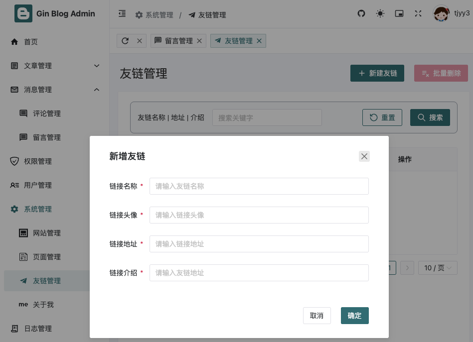

# 18 gin-blog-server 评论-留言-友链-资源模块

本章继续对后端接口进行补充，主要的接口为评论模块、留言模块、友链模块、资源模块

## 1 评论模块

评论模块的接口如下：

```go
// 评论模块
comment := auth.Group("/comment")
{
  comment.GET("/list", commentAPI.GetList)        // 评论列表
  comment.DELETE("", commentAPI.Delete)           // 删除评论
  comment.PUT("/review", commentAPI.UpdateReview) // 修改评论审核
}
```


### 1.1 评论列表 /comment/list

manager.go

```go
comment.GET("/list", commentAPI.GetList)        // 评论列表
```

handle_comment.go

```go
type Comment struct{}

type CommentQuery struct {
	PageQuery
	NickName string `form:"nickname"`
	IsReview *bool  `form:"is_review"`
	Type     int    `form:"type"`
}

// GetList 条件查询评论列表
// @Summary 条件查询评论列表
// @Description 根据条件查询评论列表
// @Tags Comment
// @Param nickname query string false "昵称"
// @Param is_review query int false "审核状态"
// @Param type query int false "评论类型"
// @Param page_num query int false "页码"
// @Param page_size query int false "每页数量"
// @Accept json
// @Produce json
// @Success 0 {object} Response[model.CommentVO]
// @Security ApiKeyAuth
// @Router /comment [get]
func (*Comment) GetList(c *gin.Context) {
	var query CommentQuery
	if err := c.ShouldBindQuery(&query); err != nil {
		ReturnError(c, global.ErrRequest, err)
		return
	}

	list, total, err := model.GetCommentList(GetDB(c), query.Page, query.Size, query.Type, query.IsReview, query.Nickname)
	if err != nil {
		ReturnError(c, global.ErrDbOp, err)
		return
	}

	ReturnSuccess(c, PageResult[model.Comment]{
		Total: total,
		List:  list,
		Size:  query.Size,
		Page:  query.Page,
	})
}
```

**comment.go:**

```go
// GetCommentList 根据 用户名称 获取后台评论列表
func GetCommentList(db *gorm.DB, page, size, typ int, isReview *bool, nickname string) (data []Comment, total int64, err error) {
	// 先获取用户名称对应的用户 id
	// SELECT UID FROM user_info WHERE nikename LIKE nickname
	var uid int
	if nickname != "" {
		result := db.Model(&UserInfo{}).Where("nickname LIKE ?", nickname).Pluck("id", &uid)
		if result.Error != nil {
			return nil, 0, result.Error
		}
		db = db.Where("user_id = ?", uid)
	}

	if typ != 0 {
		db = db.Where("type = ?", typ)
	}
	if isReview != nil {
		db = db.Where("is_review = ?", *isReview)
	}

	result := db.Model(&Comment{}).Count(&total).
		Preload("User").Preload("User.UserInfo").
		Preload("ReplyUser").Preload("ReplyUser.UserInfo").
		Preload("Article").
		Order("id DESC").
		Scopes(Paginate(page, size)).
		Find(&data)

	return data, total, result.Error
}
```

**查询链分析**

**1. 传入 `db`（初始状态）**

- `db` 是一个 `gorm.DB` 实例，初始时未绑定 `Model`，可以执行任意查询操作。

**2. 通过 `nickname` 查询用户 ID**

- `db.Model(&UserInfo{})` 绑定到 `UserInfo` 表，并执行 `Where("nickname LIKE ?", nickname).Pluck("id", &uid)` 语句，查询匹配 `nickname` 的用户 ID，并存入变量 `uid`。
- **影响**：`Pluck` 直接执行查询，它不会修改 `db` 本身，但 `db` 仍然指向 `UserInfo` 相关的查询链。
- **风险**：如果 `db` 继续使用，仍然保持 `UserInfo` 查询链，而不是 `Comment` 相关的查询。

**3. 过滤 `user_id`**

- `db = db.Where("user_id = ?", uid)` 试图限制 `user_id`，但如果 `db` 仍然是 `UserInfo` 相关的查询链，后续 `Model(&Comment{})` 可能不会正确应用。

**4. 处理 `typ` 和 `isReview`**

- `db.Where("type = ?", typ)` 添加 `type` 过滤条件。
- `db.Where("is_review = ?", *isReview)` 进一步添加 `is_review` 过滤条件。

**5. 切换 `db.Model(&Comment{})`**

- 重新将 `db` 绑定到 `Comment` 表，使其成为 `Comment` 相关的查询链，这一步修正了之前 `Pluck` 可能造成的影响。
- `Count(&total)` 计算符合条件的 `Comment` 记录数，并不会影响 `db`，只是统计数据。

**6. 预加载关联表**

- `Preload("User").Preload("User.UserInfo")` 预加载 `User` 及其 `UserInfo`。
- `Preload("ReplyUser").Preload("ReplyUser.UserInfo")` 预加载 `ReplyUser` 及其 `UserInfo`。
- `Preload("Article")` 预加载 `Article`，获取评论对应的文章信息。

**7. 排序 & 分页**

- `Order("id DESC")` 让评论按 `id` 降序排列。
- `Scopes(Paginate(page, size))` 应用分页逻辑。

**8. 查询数据**

- `Find(&data)` 最终执行 SQL 查询，并将结果存入 `data`。

对应的请求和响应如下：


由于目前没有评论，所以返回数据库为空：


可以通过 1.4 前台新增评论 /comment POST 增加新的评论之后，再查看评论列表。

同时，我们对前台评论列表进行展示：

manager.go

```go
comment := base.Group("/comment")
{
  comment.GET("/list", frontAPI.GetCommentList) // 前台评论列表
}
```

handle_front.go

```go
type FCommentQuery struct {
	PageQuery
	ReplyUserId int `json:"reply_user_id" form:"reply_user_id"`
	TopicId     int    `json:"topic_id" form:"topic_id"`
	Content     string `json:"content" form:"content"`
	ParentId    int    `json:"parent_id" form:"parent_id"`
	Type        int    `json:"type" form:"type"`
}

// GetCommentList 获取评论列表
func (*Front) GetCommentList(c *gin.Context) {
	var query FCommentQuery
	if err := c.ShouldBindQuery(&query); err != nil {
		ReturnError(c, global.ErrRequest, err)
		return
	}

	db := GetDB(c)
	rdb := GetRDB(c)

	data, total, err := model.GetCommentVOList(db, query.Page, query.Size, query.TopicId, query.Type)
	if err != nil {
		ReturnError(c, global.ErrDbOp, err)
		return
	}

	likeCountMap := rdb.HGetAll(rctx, global.COMMENT_LIKE_COUNT).Val()
	for i, comment := range data {
		if len(data[i].ReplyList) > 3 {
			// 只显示三条回复
			data[i].ReplyList = data[i].ReplyList[:3]
		}
		data[i].LikeCount, _ = strconv.Atoi(likeCountMap[strconv.Itoa(comment.ID)])
	}

	ReturnSuccess(c, PageResult[model.CommentVO]{
		List:  data,
		Total: total,
		Size:  query.Size,
		Page:  query.Page,
	})
}
```

comment.go

```go
// GetCommentVOList 获取博客评论列表
func GetCommentVOList(db *gorm.DB, page, size, topic, typ int) (data []CommentVO, total int64, err error) {
	var list []Comment

	tx := db.Model(&Comment{})
	if typ != 0 {
		tx = tx.Where("type = ?", typ)
	}
	if topic != 0 {
		tx = tx.Where("topic_id = ?", topic)
	}

	// 获取顶级评论列表
	tx.Where("parent_id = 0").Count(&total).
		Preload("User").Preload("User.UserInfo").
		Preload("ReplyUser").Preload("ReplyUser.UserInfo").
		Order("id DESC").
		Scopes(Paginate(page, size))
	if err := tx.Find(&list).Error; err != nil {
		return nil, 0, err
	}

	// 获取顶级评论的回复列表
	for _, v := range list {
		replyList := make([]CommentVO, 0)

		tx := db.Model(&Comment{})
		tx.Where("parent_id = ?", v.ID).
			Preload("User").Preload("User.UserInfo").
			Preload("ReplyUser").Preload("ReplyUser.UserInfo").
			Order("id DESC")
		if err := tx.Find(&replyList).Error; err != nil {
			return nil, 0, err
		}

		data = append(data, CommentVO{
			ReplyCount: len(replyList),
			Comment:    v,
			ReplyList:  replyList,
		})
	}
	return data, total, nil
}
```

请求和响应如下：


### 1.2 删除评论 /comment DELETE

handle_comment.go

```go
// Delete 删除评论（批量）
// @Summary 删除评论（批量）
// @Description 根据 ID 数组删除评论
// @Tags Comment
// @Param ids body []int true "评论 ID 数组"
// @Accept json
// @Produce json
// @Success 0 {object} Response[int]
// @Security ApiKeyAuth
// @Router /comment [delete]
func (*Comment) Delete(c *gin.Context) {
	var ids []int
	if err := c.ShouldBindJSON(&ids); err != nil {
		ReturnError(c, global.ErrRequest, err)
		return
	}

	result := GetDB(c).Model(&model.Comment{}).Delete("id in ?", ids)
	if result.Error != nil {
		ReturnError(c, global.ErrDbOp, result.Error)
		return
	}

	ReturnSuccess(c, result.RowsAffected)
}

```

可以通过 1.4 前台新增评论 /comment POST 增加新的评论之后，再进行评论删除。


### 1.3 修改评论审核 /comment/review

handle_comment.go

```go
// UpdateReview 修改评论审核（批量）
// @Summary 修改评论审核（批量）
// @Description 根据 ID 数组修改审核状态
// @Tags Comment
// @Param form body UpdateReviewReq true "修改审核状态"
// @Accept json
// @Produce json
// @Success 0 {object} Response[any]
// @Security ApiKeyAuth
// @Router /comment/review [put]
func (*Comment) UpdateReview(c *gin.Context) {
	var req UpdateReviewReq
	if err := c.ShouldBindJSON(&req); err != nil {
		ReturnError(c, global.ErrRequest, err)
		return
	}

	maps := map[string]any{"is_review": req.IsReview}
	result := GetDB(c).Model(model.Comment{}).Where("id in ?", req.Ids).Updates(maps)
	if result.Error != nil {
		ReturnError(c, global.ErrDbOp, result.Error)
		return
	}

	ReturnSuccess(c, result.RowsAffected)
}
```

可以通过 1.4 前台新增评论 /comment POST 增加新的评论之后，再修改评论审核。


### 1.4 前台新增评论 /comment POST

manager.go:

```go
base.POST("/comment", frontAPI.SaveComment) // 前台新增评论
```

config.go

```go
// GetConfigBool 获取配置
func GetConfigBool(db *gorm.DB, key string) bool {
	val := GetConfig(db, key)
	if val == "" {
		return false
	}
	return val == "true"
}
```

handle_front.go

```go
type FAddCommentReq struct {
	ReplyUserId int    `json:"reply_user_id" form:"reply_user_id"`
	TopicId     int    `json:"topic_id" form:"topic_id"`
	Content     string `json:"content" form:"content"`
	ParentId    int    `json:"parent_id" form:"parent_id"`
	Type        int    `json:"type" form:"type" validate:"required,min=1,max=3" label:"评论类型"`
}

// SaveComment 保存评论（只能新增，不能编辑）
// TODO: 添加自定义头像和昵称留言功能（即可以不登录评论）
// TODO: 开启邮箱通知用户功能
// TODO: HTMLUtil.Filter 过滤 HTML 元素中的字符串...
func (*Front) SaveComment(c *gin.Context) {
	var req FAddCommentReq
	if err := c.ShouldBindJSON(&req); err != nil {
		ReturnError(c, global.ErrRequest, err)
		return
	}

	// 过滤评论内容，防止 XSS 攻击
	req.Content = template.HTMLEscapeString(req.Content)
	auth, _ := CurrentUserAuth(c)
	db := GetDB(c)
	isReview := model.GetConfigBool(db, global.CONFIG_IS_COMMENT_REVIEW)

	var comment *model.Comment
	var err error

	if req.ReplyUserId == 0 { // 评论文章
		comment, err = model.AddComment(db, auth.ID, req.Type, req.TopicId, req.Content, isReview)
	} else { // 回复评论
		comment, err = model.ReplyComment(db, auth.ID, req.ReplyUserId, req.ParentId, req.Content, isReview)
	}

	if err != nil {
		ReturnError(c, global.ErrDbOp, err)
		return
	}

	ReturnSuccess(c, comment)
}
```

comment.go

```go
// AddComment 新增评论
func AddComment(db *gorm.DB, userId, typ, topicId int, content string, isReview bool) (*Comment, error) {
	comment := Comment{
		UserId:   userId,
		TopicId:  topicId,
		Content:  content,
		Type:     typ,
		IsReview: isReview,
	}
	result := db.Create(&comment)
	return &comment, result.Error
}

// ReplyComment 回复评论
func ReplyComment(db *gorm.DB, userId, replyUserId, parentId int, content string, isReview bool) (*Comment, error) {
	var parent Comment
	result := db.First(&parent, parentId)
	if result.Error != nil {
		return nil, result.Error
	}
	
	comment := Comment{
		UserId:      userId,
		Content:     content,
		ReplyUserId: replyUserId,
		ParentId:    parentId,
		IsReview:    isReview,
		TopicId:     parent.TopicId, // 主题和父评论一样
		Type:        parent.Type,    // 类型和父评论一样
	}
	result = db.Create(&comment)
	return &comment, result.Error
}
```

发送的请求和响应如下：


### 1.5 根据评论 id 查询回复 /comment/replies/:comment_id

manager.go:

```go
comment.GET("/replies/:comment_id", frontAPI.GetReplyListByCommentId) // 根据评论 id 查询回复
```

handle_front.go

```go
// GetReplyListByCommentId 根据 [评论id] 获取 [回复列表]
func (*Front) GetReplyListByCommentId(c *gin.Context) {
	id, err := strconv.Atoi(c.Param("comment_id"))
	if err != nil {
		ReturnError(c, global.ErrRequest, err)
		return
	}

	var query PageQuery
	if err := c.ShouldBindQuery(&query); err != nil {
		ReturnError(c, global.ErrRequest, err)
		return
	}

	db := GetDB(c)
	rdb := GetRDB(c)

	replyList, err := model.GetCommentReplyList(db, id, query.Page, query.Size)
	if err != nil {
		ReturnError(c, global.ErrDbOp, err)
		return
	}

	likeCountMap := rdb.HGetAll(rctx, global.COMMENT_LIKE_COUNT).Val()

	data := make([]model.CommentVO, 0)
	for _, reply := range replyList {
		like, _ := strconv.Atoi(likeCountMap[strconv.Itoa(reply.ID)])
		data = append(data, model.CommentVO{
			Comment:   reply,
			LikeCount: like,
		})
	}

	ReturnSuccess(c, data)
}
```

comment.go

```go
// GetCommentReplyList 根据 [评论id] 获取 [回复列表]
func GetCommentReplyList(db *gorm.DB, id, page, size int) (data []Comment, err error) {
	result := db.Model(&Comment{}).
		Where(&Comment{ParentId: id}).
		Preload("User").Preload("User.UserInfo").
		Order("id DESC").
		Scopes(Paginate(page, size)).
		Find(&data)
	return data, result.Error
}
```

请求和对应响应如下


### 1.6 前台点赞文章 /comment/like/:comment_id

manager.go:

```go
base.GET("/comment/like/:comment_id", frontAPI.LikeComment) // 前台点赞评论
```

handle_front.go

```go
// LikeComment 点赞评论
func (*Front) LikeComment(c *gin.Context) {
	id, err := strconv.Atoi(c.Param("comment_id"))
	if err != nil {
		ReturnError(c, global.ErrRequest, err)
		return
	}

	rdb := GetRDB(c)
	auth, _ := CurrentUserAuth(c)

	// 一个用户对应一个 redis set
	commentLikeUserKey := global.COMMENT_USER_LIKE_SET + strconv.Itoa(auth.ID)
	// 该评论已经被记录过, 再点赞就是取消点赞
	if rdb.SIsMember(rctx, commentLikeUserKey, id).Val() {
		rdb.SRem(rctx, commentLikeUserKey, id)
		rdb.HIncrBy(rctx, global.COMMENT_LIKE_COUNT, strconv.Itoa(id), -1)
	} else { // 未被记录过, 则是增加点赞
		rdb.SAdd(rctx, commentLikeUserKey, id)
		rdb.HIncrBy(rctx, global.COMMENT_LIKE_COUNT, strconv.Itoa(id), 1)
	}

	ReturnSuccess(c, nil)
}
```

请求和对应响应如下


## 2 留言模块

留言模块的接口如下：

```go
// 留言模块
message := auth.Group("/message")
{
  message.GET("/list", messageAPI.GetList)        // 留言列表
  message.DELETE("", messageAPI.Delete)           // 删除留言
  message.PUT("/review", messageAPI.UpdateReview) // 审核留言
}

// 前台
message := base.Group("/message")
{
  message.GET("/list", frontAPI.GetMessageList)    // 前台留言列表
}

// 需要登录才能进行的操作
base.Use(middleware.JWTAuth())
{
  base.POST("/message", frontAPI.SaveMessage)      // 前台新增留言
}
```

留言模块和评论模块的功能比较类似，前端界面也比较类似，甚至留言模块更加简单，因为没有类似于评论之间的父子关系。因此，对于下面五个留言相关的功能，我们仅展示其核心代码，不展示请求与响应的具体过程。


### 2.1 留言列表 /message/list

handle_message.go:

```go
type Message struct{}

// MessageQuery 条件查询列表
type MessageQuery struct {
	PageQuery
	Nickname string `form:"nickname"`
	IsReview *bool  `form:"is_review"`
}

// GetList 条件查询留言列表
// @Summary 条件查询留言列表
// @Description 根据条件查询留言列表
// @Tags Message
// @Param nickname query string false "昵称"
// @Param is_review query int false "审核状态"
// @Param page_size query int false "当前页数"
// @Param page_num query int false "每页条数"
// @Accept json
// @Produce json
// @Success 0 {object} Response[PageResult[model.Message]]
// @Security ApiKeyAuth
// @Router /message/list [get]
func (*Message) GetList(c *gin.Context) {
	var query MessageQuery
	if err := c.ShouldBindQuery(&query); err != nil {
		ReturnError(c, global.ErrRequest, err)
		return
	}

	data, total, err := model.GetMessageList(GetDB(c), query.Page, query.Size, query.Nickname, query.IsReview)
	if err != nil {
		ReturnError(c, global.ErrDbOp, err)
		return
	}

	ReturnSuccess(c, PageResult[model.Message]{
		Total: total,
		List:  data,
		Size:  query.Size,
		Page:  query.Page,
	})
}
```

message.go:

```go
func GetMessageList(db *gorm.DB, num, size int, nickname string, isReview *bool) (list []Message, total int64, err error) {
	db = db.Model(&Message{})

	if nickname != "" {
		db = db.Where("nickname LIKE ?", "%"+nickname+"%")
	}

	if isReview != nil {
		db = db.Where("is_review = ?", *isReview)
	}

	db.Count(&total)
	result := db.Order("created_at DESC").Scopes(Paginate(num, size)).Find(&list)
	return list, total, result.Error
}
```


### 2.2 删除留言 /message DELETE

handle_message.go:

```go
// Delete 删除留言（批量）
// @Summary 删除留言（批量）
// @Description 根据 ID 数组删除留言
// @Tags Category
// @Param ids body []int true "留言 ID 数组"
// @Accept json
// @Produce json
// @Success 0 {object} Response[int]
// @Security ApiKeyAuth
// @Router /category [delete]
func (*Message) Delete(c *gin.Context) {
	var ids []int
	if err := c.ShouldBindJSON(&ids); err != nil {
		ReturnError(c, global.ErrRequest, err)
		return
	}

	rows, err := model.DeleteMessages(GetDB(c), ids)
	if err != nil {
		ReturnError(c, global.ErrDbOp, err)
		return
	}

	ReturnSuccess(c, rows)
}
```

message.go:

```go
func DeleteMessages(db *gorm.DB, ids []int) (int64, error) {
	result := db.Where("id in ?", ids).Delete(&Message{})
	return result.RowsAffected, result.Error
}
```


### 2.3 审核留言 /message/review

handle_message.go:

```go
// UpdateReview 修改留言审核（批量）
// @Summary 修改留言审核（批量）
// @Description 根据 ID 数组修改审核状态
// @Tags Message
// @Param form body UpdateReviewReq true "修改审核状态"
// @Accept json
// @Produce json
// @Success 0 {object} Response[int]
// @Security ApiKeyAuth
// @Router /message/review [put]
func (*Message) UpdateReview(c *gin.Context) {
	var req UpdateReviewReq
	if err := c.ShouldBindJSON(&req); err != nil {
		ReturnError(c, global.ErrRequest, err)
		return
	}

	rows, err := model.UpdateMessagesReview(GetDB(c), req.Ids, req.IsReview)
	if err != nil {
		ReturnError(c, global.ErrDbOp, err)
		return
	}

	ReturnSuccess(c, rows)
}
```

message.go:

```go
func UpdateMessagesReview(db *gorm.DB, ids []int, isReview bool) (int64, error) {
  result := db.Model(&Message{}).Where("id in ?", ids).Update("is_review", isReview)
  return result.RowsAffected, result.Error
}
```


### 2.4 前台留言列表 /message/list front

handle_front.go:

```go
// GetMessageList 查询消息列表
func (*Front) GetMessageList(c *gin.Context) {
	isReview := true
	list, _, err := model.GetMessageList(GetDB(c), 1, 1000, "", &isReview)
	if err != nil {
		ReturnError(c, global.ErrDbOp, err)
		return
	}
	ReturnSuccess(c, list)
}
```


### 2.5 前台新增留言 /message POST

handle_front.go:

```go
type FAddMessageReq struct {
	Nickname string `json:"nickname" binding:"required"`
	Avatar   string `json:"avatar"`
	Content  string `json:"content" binding:"required"`
	Speed    int    `json:"speed"`
}

// SaveMessage 保存留言（只能新增，不能编辑）
// TODO: 添加自定义头像和昵称留言功能（即可以不登录留言）
func (*Front) SaveMessage(c *gin.Context) {
	var req FAddMessageReq
	if err := c.ShouldBindJSON(&req); err != nil {
		ReturnError(c, global.ErrRequest, err)
		return
	}

	req.Content = template.HTMLEscapeString(req.Content)
	auth, _ := CurrentUserAuth(c)
	db := GetDB(c)

	ipAddress := utils.IP.GetIpAddress(c)
	ipSource := utils.IP.GetIpSource(ipAddress)
	isReview := model.GetConfigBool(db, global.CONFIG_IS_COMMENT_REVIEW)

	info := auth.UserInfo
	message, err := model.SaveMessage(db, info.Nickname, info.Nickname, req.Content, ipAddress, ipSource, req.Speed, isReview)
	if err != nil {
		ReturnError(c, global.ErrDbOp, err)
		return
	}

	ReturnSuccess(c, message)
}
```

message.go:

```go
// SaveMessage 保存留言功能
func SaveMessage(db *gorm.DB, nickname, avatar, content, address, source string, speed int, isReview bool) (*Message, error) {
	message := Message{
		Nickname:  nickname,
		Avatar:    avatar,
		Content:   content,
		IpAddress: address,
		IpSource:  source,
		Speed:     speed,
		IsReview:  isReview,
	}

	result := db.Create(&message)
	return &message, result.Error
}
```


## 3 友链模块

友链模块的接口如下：

```go
// 友情链接
link := auth.Group("/link")
{
  link.GET("/list", linkAPI.GetList)  // 友链列表
  link.POST("", linkAPI.SaveOrUpdate) // 新增/编辑友链
  link.DELETE("", linkAPI.Delete)     // 删除友链
}
```

首先，我们要补全友链相关的数据库，具体内容在 frient_link.go 以及 z_base.go 中：

friend_link.go

```go
type FriendLink struct {
	Model
	Name    string `gorm:"type:varchar(50)" json:"name"`
	Avatar  string `gorm:"type:varchar(255)" json:"avatar"`
	Address string `gorm:"type:varchar(255)" json:"address"`
	Intro   string `gorm:"type:varchar(255)" json:"intro"`
}
```

z_base.go

```go
func MakeMigrate(db *gorm.DB) error {
	// 设置表关联
	// 用于显式地配置一个多对多关系，其中 UserAuth 和 Role 通过一个关联表 UserAuthRole 进行关联。
	db.SetupJoinTable(&UserAuth{}, "Roles", &UserAuthRole{})
	db.SetupJoinTable(&Role{}, "Menus", &RoleMenu{})
	db.SetupJoinTable(&Role{}, "Resources", &RoleResource{})
	db.SetupJoinTable(&Role{}, "Users", &UserAuthRole{})

	return db.AutoMigrate(
		...
		&FriendLink{},   // 友链
		...
	)
}
```


### 3.1 友链列表 /link/list

handle_link.go

```go
type Link struct{}

// GetList 获取友链列表
// @Summary 获取友链列表
// @Description 根据条件查询获取友链列表
// @Tags Link
// @Param page_size query int false "当前页数"
// @Param page_num query int false "每页条数"
// @Param keyword query string false "搜索关键字"
// @Accept json
// @Produce json
// @Success 0 {object} Response[PageResult[model.FriendLink]]
// @Security ApiKeyAuth
// @Router /link/list [get]
func (*Link) GetList(c *gin.Context) {
	var query PageQuery
	if err := c.ShouldBindQuery(&query); err != nil {
		ReturnError(c, global.ErrRequest, err)
		return
	}

	data, total, err := model.GetLinkList(GetDB(c), query.Page, query.Size, query.Keyword)
	if err != nil {
		ReturnError(c, global.ErrDbOp, err)
		return
	}

	ReturnSuccess(c, PageResult[model.FriendLink]{
		Total: total,
		List:  data,
		Size:  query.Size,
		Page:  query.Page,
	})
}
```

friend_link.go

```go
func GetLinkList(db *gorm.DB, num, size int, keyword string) (list []FriendLink, total int64, err error) {
	db = db.Model(&FriendLink{})
	if keyword != "" {
		db = db.Where("name LIKE ?", "%"+keyword+"%")
		db = db.Or("address LIKE ?", "%"+keyword+"%")
		db = db.Or("intro LIKE ?", "%"+keyword+"%")
	}

	db.Count(&total)
	result := db.Order("created_at DESC").
		Scopes(Paginate(num, size)).
		Find(&list)
	return list, total, result.Error
}
```

对应的请求和响应如下：


### 3.2 新增/编辑友链 /link POST

handle_link.go

```go
// AddOrEditLinkReq 添加或修改友链
type AddOrEditLinkReq struct {
	ID      int    `json:"id"`
	Name    string `json:"name" binding:"required"`
	Avatar  string `json:"avatar"`
	Address string `json:"address" binding:"required"`
	Intro   string `json:"intro"`
}

// SaveOrUpdate 添加或修改友链
// @Summary 添加或修改友链
// @Description 添加或修改友链
// @Tags Link
// @Param form body AddOrEditLinkReq true "添加或修改友链"
// @Accept json
// @Produce json
// @Success 0 {object} Response[model.FriendLink]
// @Security ApiKeyAuth
// @Router /link [post]
func (*Link) SaveOrUpdate(c *gin.Context) {
	var req AddOrEditLinkReq
	if err := c.ShouldBindJSON(&req); err != nil {
		ReturnError(c, global.ErrRequest, err)
		return
	}

	link, err := model.SaveOrUpdateLink(GetDB(c), req.ID, req.Name, req.Avatar, req.Address, req.Intro)
	if err != nil {
		ReturnError(c, global.ErrDbOp, err)
		return
	}

	ReturnSuccess(c, link)
}
```

friend_link.go

```go
func SaveOrUpdateLink(db *gorm.DB, id int, name, avatar, address, intro string) (*FriendLink, error) {
	link := FriendLink{
		Model:   Model{ID: id},
		Name:    name,
		Avatar:  avatar,
		Address: address,
		Intro:   intro,
	}

	var result *gorm.DB
	if id > 0 {
		result = db.Updates(&link)
	} else {
		result = db.Create(&link)
	}

	return &link, result.Error
}
```

对应的请求和响应如下：




### 3.3 删除友链 /link DELETE

handle_link.go

```go
// Delete 删除友链（批量）
// @Summary 删除友链（批量）
// @Description 根据 ID 数组删除友链
// @Tags Link
// @Param ids body []int true "友链ID数组"
// @Accept json
// @Produce json
// @Success 0 {object} Response[int64]
// @Security ApiKeyAuth
// @Router /link [delete]
func (*Link) Delete(c *gin.Context) {
	var ids []int
	if err := c.ShouldBindJSON(&ids); err != nil {
		ReturnError(c, global.ErrRequest, err)
		return
	}

	result := GetDB(c).Delete(&model.FriendLink{}, "id in ?", ids)
	if result.Error != nil {
		ReturnError(c, global.ErrDbOp, result.Error)
		return
	}

	ReturnSuccess(c, result.RowsAffected)
}
```

对应的请求和响应如下：


### 3.4 友链前台补充 /link/list

manager.go

```go
link := base.Group("/link")
{
  link.GET("/list", frontAPI.GetLinkList) // 前台友链列表
}
```

handle_front.go

```go
// GetLinkList 获取友链列表
func (*Front) GetLinkList(c *gin.Context) {
	list, _, err := model.GetLinkList(GetDB(c), 1, 1000, "")
	if err != nil {
		ReturnError(c, global.ErrDbOp, err)
		return
	}

	ReturnSuccess(c, list)
}
```


## 4 资源模块

资源模块的接口如下：

```go
// 资源模块
resource := auth.Group("/resource")
{
  resource.GET("/list", resourceAPI.GetTreeList)          // 资源列表(树形)
  resource.POST("", resourceAPI.SaveOrUpdate)             // 新增/编辑资源
  resource.DELETE("/:id", resourceAPI.Delete)             // 删除资源
  resource.PUT("/anonymous", resourceAPI.UpdateAnonymous) // 修改资源匿名访问
  resource.GET("/option", resourceAPI.GetOption)          // 资源选项列表(树形)
}
```


### 4.1 资源列表(树形) /resource/list

handle_resource.go

```go
type ResourceTreeVO struct {
	ID        int              `json:"id"`
	CreatedAt time.Time        `json:"created_at"`
	Name      string           `json:"name"`
	Url       string           `json:"url"`
	Method    string           `json:"request_method"`
	Anonymous bool             `json:"is_anonymous"`
	Children  []ResourceTreeVO `json:"children"`
}

// GetTreeList 获取资源列表(树形)
func (*Resource) GetTreeList(c *gin.Context) {
	keyword := c.Query("keyword")

	resourceList, err := model.GetResourceList(GetDB(c), keyword)
	if err != nil {
		ReturnError(c, global.ErrDbOp, err)
		return
	}

	ReturnSuccess(c, resources2ResourceVos(resourceList))
}

// 转变结构 []Resource => []ResourceVO
func resources2ResourceVos(resources []model.Resource) []ResourceTreeVO {
	list := make([]ResourceTreeVO, 0)
	parentList := getModuleList(resources)
	childrenMap := getChildrenMap(resources)

	for _, item := range parentList { // 遍历每个一级资源
		resourceVO := resource2ResourceVo(item)
		resourceVO.Children = make([]ResourceTreeVO, 0)
		for _, child := range childrenMap[item.ID] {
			resourceVO.Children = append(resourceVO.Children, resource2ResourceVo(child))
		}
		list = append(list, resourceVO)
	}
	return list
}

// Resource => ResourceVO
func resource2ResourceVo(r model.Resource) ResourceTreeVO {
	return ResourceTreeVO{
		ID:        r.ID,
		Name:      r.Name,
		Url:       r.Url,
		Method:    r.Method,
		Anonymous: r.Anonymous,
		CreatedAt: r.CreatedAt,
	}
}

// 获取一级资源 (parent_id == 0)
func getModuleList(resources []model.Resource) []model.Resource {
	list := make([]model.Resource, 0)
	for _, r := range resources {
		if r.ParentId == 0 {
			list = append(list, r)
		}
	}
	return list
}

// 存储每个节点对应 [子资源列表] 的 map
// key: resourceId
// value: childrenList
func getChildrenMap(resources []model.Resource) map[int][]model.Resource {
	m := make(map[int][]model.Resource)
	for _, r := range resources {
		if r.ParentId != 0 {
			// 检查切片是否为 nil，如果是则初始化
			if m[r.ParentId] == nil {
				m[r.ParentId] = make([]model.Resource, 0)
			}
			m[r.ParentId] = append(m[r.ParentId], r)
		}
	}
	return m
}


```

auth.go

```go
// GetResourceList 获取资源列表
func GetResourceList(db *gorm.DB, keyword string) (list []Resource, err error) {
	if keyword != "" {
		db = db.Where("name like ?", "%"+keyword+"%")
	}

	result := db.Find(&list)
	return list, result.Error
}
```

对应的请求和响应如下：


### 4.2 新增/编辑资源 /resource POST

handle_resource.go

```go
// AddOrEditResourceReq 新增或编辑资源的请求
// TODO: 使用 oneof 标签校验数据
type AddOrEditResourceReq struct {
	ID       int    `json:"id"`
	Url      string `json:"url"`
	Method   string `json:"request_method"`
	Name     string `json:"name"`
	ParentId int    `json:"parent_id"`
}

// SaveOrUpdate 新增或编辑资源, 关联更新 casbin_rule 中数据
func (*Resource) SaveOrUpdate(c *gin.Context) {
	var req AddOrEditResourceReq
	if err := c.ShouldBindJSON(&req); err != nil {
		ReturnError(c, global.ErrRequest, err)
		return
	}

	db := GetDB(c)
	err := model.SaveOrUpdateResource(db, req.ID, req.ParentId, req.Name, req.Url, req.Method)
	if err != nil {
		ReturnError(c, global.ErrDbOp, err)
		return
	}
	ReturnSuccess(c, nil)
}
```

auth.go

```go
// SaveOrUpdateResource 新增或编辑资源
func SaveOrUpdateResource(db *gorm.DB, id, pid int, name, url, method string) error {
	resource := Resource{
		Model:    Model{ID: id},
		Name:     name,
		Url:      url,
		Method:   method,
		ParentId: pid,
	}

	var result *gorm.DB
	if id > 0 {
		result = db.Updates(&resource)
	} else {
		// TODO: 
		// * 解决前端的 BUG: 级联选中某个父节点后, 新增的子节点默认会展示被选中, 实际上未被选中值
		// * 解决方案: 新增子节点后, 删除该节点对应的父节点与角色的关联关系
		// dao.Delete(model.RoleResource{}, "resource_id", data.ParentId)
		result = db.Create(&resource)
	}
	return result.Error
}
```

对应的请求和响应如下：


### 4.3 删除资源 /resource/:id DELETE

handle_resource.go

```go
// Delete 删除资源
// TODO: 考虑删除模块后, 其子资源怎么办? 目前做法是有子资源无法删除
func (*Resource) Delete(c *gin.Context) {
	resourceId, err := strconv.Atoi(c.Param("id"))
	if err != nil {
		ReturnError(c, global.ErrRequest, err)
		return
	}

	db := GetDB(c)

	// 检查该资源是否被角色使用
	use, _ := model.CheckResourceInUse(db, resourceId)
	if use { // 如果正在使用中
		ReturnError(c, global.ErrResourceUsedByRole, nil)
		return
	}

	// 获取该资源
	resource, err := model.GetResourceById(db, resourceId)
	if err != nil {
		if errors.Is(err, gorm.ErrRecordNotFound) {
			ReturnError(c, global.ErrResourceNotExist, err)
		}
		ReturnError(c, global.ErrDbOp, err)
		return
	}

	// 如果作为模块，检查模块下是否有子模块
	if resource.ParentId == 0 { // 一级资源模块
		hasChild, _ := model.CheckResourceHasChild(db, resourceId)
		if hasChild {
			ReturnError(c, global.ErrResourceHasChildren, nil)
			return
		}
	}

	// 删除资源模块
	rows, err := model.DeleteResource(db, resourceId)
	if err != nil {
		ReturnError(c, global.ErrDbOp, err)
		return
	}

	ReturnSuccess(c, rows)
}
```

auth_control.go

```go
// CheckResourceInUse 检查资源是否在使用中
func CheckResourceInUse(db *gorm.DB, id int) (bool, error) {
	var count int64
	result := db.Model(&RoleResource{}).Where("resource_id = ?", id).Count(&count)
	return count > 0, result.Error
}

// GetResourceById 根据 id 获取资源
func GetResourceById(db *gorm.DB, id int) (resource Resource, err error) {
	result := db.First(&resource, id)
	return resource, result.Error
}

// CheckResourceHasChild 检查该资源中是否有子资源
func CheckResourceHasChild(db *gorm.DB, id int) (bool, error) {
	var count int64
	result := db.Model(&Resource{}).Where("parent_id = ?", id).Count(&count)
	return count > 0, result.Error
}

// DeleteResource 删除资源
func DeleteResource(db *gorm.DB, id int) (int, error) {
	result := db.Delete(&Resource{}, id)
	if result.Error != nil {
		return 0, result.Error
	}
	return int(result.RowsAffected), nil
}
```

对应的请求和响应如下：


可以看到，测试模块被删除成功。


### 4.4 修改资源匿名访问  /resource/anonymous

handle_resource.go

```go
type EditAnonymousReq struct {
	ID        int  `json:"id" binding:"required"`
	Anonymous bool `json:"is_anonymous"`
}

// UpdateAnonymous 编辑资源的匿名访问, 关联更新 casbin_rule 中数据
func (*Resource) UpdateAnonymous(c *gin.Context) {
	var req EditAnonymousReq
	if err := c.ShouldBindJSON(&req); err != nil {
		ReturnError(c, global.ErrRequest, err)
		return
	}

	err := model.UpdateResourceAnonymous(GetDB(c), req.ID, req.Anonymous)
	if err != nil {
		ReturnError(c, global.ErrDbOp, err)
		return
	}

	ReturnSuccess(c, nil)
}
```

auth_control.go

```go
// UpdateResourceAnonymous 更新资源匿名状态
func UpdateResourceAnonymous(db *gorm.DB, id int, anonymous bool) error {
	result := db.Model(&Resource{}).Where("id = ?", id).Update("anonymous", anonymous)
	return result.Error
}
```

对应的请求和响应如下：


可以看到，资源可以被修改为匿名资源或者非匿名资源。


### 4.5 资源选项列表(树形)  /resource/option

handle_resource.go

```go
// GetOption 获取数据选项(树形)
func (*Resource) GetOption(c *gin.Context) {
	result := make([]TreeOptionVO, 0)

	db := GetDB(c)
	resources, err := model.GetResourceList(db, "")
	if err != nil {
		ReturnError(c, global.ErrDbOp, err)
		return
	}

	parentList := getModuleList(resources)
	childrenMap := getChildrenMap(resources)

	for _, item := range parentList {
		// 构建 children list
		var children []TreeOptionVO
		for _, re := range childrenMap[item.ID] {
			children = append(children, TreeOptionVO{
				ID:    re.ID,
				Label: re.Name,
			})
		}

		// 构建一级 option 并添加列表
		result = append(result, TreeOptionVO{
			ID:       item.ID,
			Label:    item.Name,
			Children: children,
		})
	}
	ReturnSuccess(c, result)
}
```

