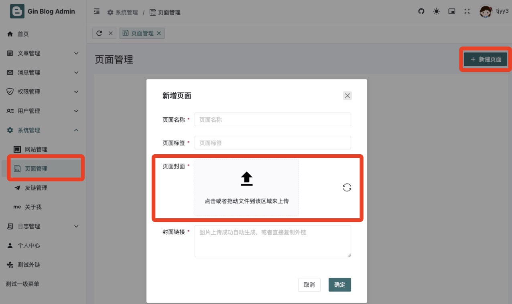
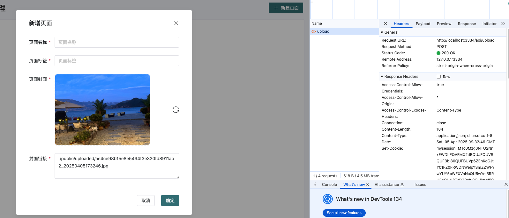
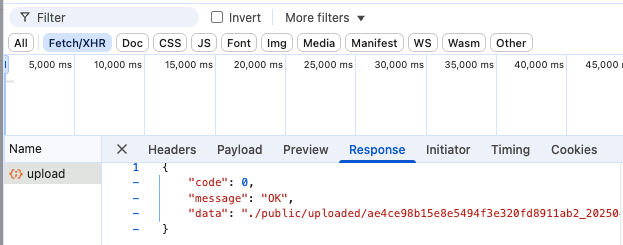

# 19 gin-blog-server 角色模块-操作日志模块-页面模块-文件上传模块

本章继续对剩余的接口进行补充，主要的接口为角色模块、操作日志模块、页面模块、文件上传模块

## 1 角色模块

manager.go

```go
// 角色模块
role := auth.Group("/role")
{
  role.GET("/list", roleAPI.GetTreeList) // 角色列表(树形)
  role.POST("", roleAPI.SaveOrUpdate)    // 新增/编辑菜单
  role.DELETE("", roleAPI.Delete)        // 删除角色
}
```


### 1.1 角色列表(树形) /role/list

handle_role.go:

```go
// GetTreeList 获取角色列表
// @Summary 获取角色列表
// @Description 获取角色列表
// @Tags role
// @Produce json
// @Param keyword query string false "关键字"
// @Param pageNum query int false "页码"
// @Param pageSize query int false "每页数量"
// @Success 0 {object} Response[PageResult[model.RoleVO]]
// @Router /role/list [get]
func (*Role) GetTreeList(c *gin.Context) {
	var query PageQuery
	if err := c.ShouldBindQuery(&query); err != nil {
		ReturnError(c, global.ErrRequest, err)
		return
	}

	db := GetDB(c)
	result := make([]model.RoleVO, 0)

	list, total, err := model.GetRoleList(db, query.Page, query.Size, query.Keyword)
	if err != nil && !errors.Is(err, gorm.ErrRecordNotFound) {
		ReturnError(c, global.ErrDbOp, err)
		return
	}

	for _, role := range list {
		role.ResourceIds, _ = model.GetResourceIdsByRoleId(db, role.ID)
		role.MenuIds, _ = model.GetMenuIdsByRoleId(db, role.ID)
		result = append(result, role)
	}

	ReturnSuccess(c, PageResult[model.RoleVO]{
		Size:  query.Size,
		Page:  query.Page,
		Total: total,
		List:  result,
	})
}
```

auth.go:

```go
type RoleVO struct {
	ID          int       `json:"id"`
	CreatedAt   time.Time `json:"created_at"`
	Name        string    `json:"name"`
	Label       string    `json:"label"`
	IsDisable   bool      `json:"is_disable"`
	ResourceIds []int     `json:"resource_ids" gorm:"-"`
	MenuIds     []int     `json:"menu_ids" gorm:"-"`
}

// GetRoleList 获取角色列表
func GetRoleList(db *gorm.DB, num, size int, keyword string) (list []RoleVO, total int64, err error) {
	db = db.Model(&Role{})
	if keyword != "" {
		db = db.Where("name like ?", "%"+keyword+"%")
	}
	db.Count(&total)
	result := db.Select("id", "name", "label", "created_at", "is_disable").
		Scopes(Paginate(num, size)).
		Find(&list)
	return list, total, result.Error
}

func GetResourceIdsByRoleId(db *gorm.DB, roleId int) (ids []int, err error) {
	result := db.Model(&RoleResource{}).
		Where("role_id = ?", roleId).
		Pluck("resource_id", &ids)
	return ids, result.Error
}

func GetMenuIdsByRoleId(db *gorm.DB, roleId int) (ids []int, err error) {
	result := db.Model(&RoleMenu{}).
		Where("role_id = ?", roleId).
		Pluck("menu_id", &ids)
	return ids, result.Error
}
```

对应的请求和响应如下：


### 1.2 新增/编辑菜单 /role POST

handle_role.go:

```go
// AddOrEditRoleReq 新增/编辑 角色, 关联维护 role_resource, role_menu
type AddOrEditRoleReq struct {
	ID          int    `json:"id"`
	Name        string `json:"name" binding:"required"`
	Label       string `json:"label" binding:"required"`
	IsDisable   bool   `json:"is_disable"`
	ResourceIds []int  `json:"resource_ids"` // 资源 id 列表
	MenuIds     []int  `json:"menu_ids"`     // 菜单 id 列表
}


// SaveOrUpdate 删除角色
func (*Role) SaveOrUpdate(c *gin.Context) {
	var req AddOrEditRoleReq
	if err := c.ShouldBindJSON(&req); err != nil {
		ReturnError(c, global.ErrRequest, err)
		return
	}

	db := GetDB(c)

	if req.ID == 0 {
		err := model.SaveRole(db, req.Name, req.Label)
		if err != nil {
			ReturnError(c, global.ErrDbOp, err)
			return
		}
	} else {
		err := model.UpdateRole(db, req.ID, req.Name, req.Label, req.IsDisable, req.ResourceIds, req.MenuIds)
		if err != nil {
			ReturnError(c, global.ErrDbOp, err)
			return
		}
	}

	ReturnSuccess(c, nil)
}
```

auth.go:

```go
func UpdateRole(db *gorm.DB, id int, name, label string, isDisable bool, resourceIds, menuIds []int) error {
	role := Role{
		Model:     Model{ID: id},
		Name:      name,
		Label:     label,
		IsDisable: isDisable,
	}

	// 同时更新多个数据库表
	return db.Transaction(func(tx *gorm.DB) error {
		if err := db.Model(&role).Select("name", "label", "is_disable").Updates(&role).Error; err != nil {
			return err
		}

		// role_resource
		if err := db.Delete(&RoleResource{}, "role_id = ?", id).Error; err != nil {
			return err
		}
		for _, rid := range resourceIds {
			if err := db.Create(&RoleResource{RoleId: role.ID, ResourceId: rid}).Error; err != nil {
				return err
			}
		}

		// role_menu
		if err := db.Delete(&RoleMenu{}, "role_id = ?", id).Error; err != nil {
			return err
		}
		for _, mid := range menuIds {
			if err := db.Create(&RoleMenu{RoleId: role.ID, MenuId: mid}).Error; err != nil {
				return err
			}
		}

		return nil
	})
}
```

对应的请求和响应如下：


同理，可以对角色进行编辑，来赋予菜单权限


### 1.3 删除角色 /role DELETE

handle_role.go:

```go
// Delete 删除角色
func (*Role) Delete(c *gin.Context) {
  var ids []int
  if err := c.ShouldBindJSON(&ids); err != nil {
    ReturnError(c, global.ErrRequest, err)
    return
  }

  err := model.DeleteRoles(GetDB(c), ids)
  if err != nil {
    ReturnError(c, global.ErrDbOp, err)
    return
  }

  ReturnSuccess(c, nil)
}
```

auth.go:

```go
// DeleteRoles 删除角色: 事务删除 role, role_resource, role_menu
func DeleteRoles(db *gorm.DB, ids []int) error {
	return db.Transaction(func(tx *gorm.DB) error {
		result := db.Delete(&Role{}, "id in ?", ids)
		if result.Error != nil {
			return result.Error
		}

		result = db.Delete(&RoleResource{}, "role_id in ?", ids)
		if result.Error != nil {
			return result.Error
		}

		result = db.Delete(&RoleMenu{}, "role_id in ?", ids)
		if result.Error != nil {
			return result.Error
		}

		return nil
	})
}
```

对应的请求和响应如下：


## 2 操作日志模块

manager.go

```go
// 操作日志模块
operationLog := auth.Group("/operation/log")
{
  operationLog.GET("/list", operationLogAPI.GetList) // 操作日志列表
  operationLog.DELETE("", operationLogAPI.Delete)    // 删除操作日志
}
```


### 2.1 操作日志列表 /operation/log/list

handle_operationlog.go

```go
// GetList 获取操作日志列表
// @Summary 获取操作日志列表
// @Description 根据条件查询获取操作日志列表
// @Tags OperationLog
// @Accept json
// @Produce json
// @Param page_num query int false "页码"
// @Param page_size query int false "每页数量"
// @Param keyword query string false "关键字"
// @Success 0 {object} Response[[]model.OperationLog]
// @Security ApiKeyAuth
// @Router /operation/log/list [get]
func (*OperationLog) GetList(c *gin.Context) {
	var query PageQuery
	if err := c.ShouldBindQuery(&query); err != nil {
		ReturnError(c, global.ErrRequest, err)
		return
	}

	list, total, err := model.GetOperationLogList(GetDB(c), query.Page, query.Size, query.Keyword)
	if err != nil {
		ReturnError(c, global.ErrDbOp, err)
		return
	}

	ReturnSuccess(c, PageResult[model.OperationLog]{
		Total: total,
		List:  list,
		Size:  query.Size,
		Page:  query.Page,
	})
}
```

operation_log.go

```go
func GetOperationLogList(db *gorm.DB, num, size int, keyword string) (data []OperationLog, total int64, err error) {
	db = db.Model(&OperationLog{})
	if keyword != "" {
		db = db.Where("opt_module LIKE ?", "%"+keyword+"%").
			Or("opt_desc LIKE ?", "%"+keyword+"%")
	}
	db.Count(&total)
	result := db.Order("created_at DESC").Scopes(Paginate(num, size)).Find(&data)
	return data, total, result.Error
}

```

对应的请求和响应如下：


**那么，什么时候这些操作日志被记录到数据库中呢？**

+ 因为我们用到了中间件 internal/middleware/operation_log.go:59


### 2.2 删除操作日志 /operation/log DELETE

handle_operationlog.go

```go

// Delete 删除操作日志
// @Summary 删除操作日志
// @Description 删除操作日志
// @Tags OperationLog
// @Accept json
// @Produce json
// @Param ids body []int true "操作日志ID列表"
// @Success 0 {object} Response[int]
// @Security ApiKeyAuth
// @Router /operation/log [delete]
func (*OperationLog) Delete(c *gin.Context) {
	var ids []int
	if err := c.ShouldBindJSON(&ids); err != nil {
		ReturnError(c, global.ErrRequest, err)
		return
	}

	result := GetDB(c).Delete(&model.OperationLog{}, "id in ?", ids)
	if result.Error != nil {
		ReturnError(c, global.ErrDbOp, result.Error)
		return
	}

	ReturnSuccess(c, result.RowsAffected)
}

```

可以删除选中的操作日志。


## 3 页面模块

页面模块主要对文章的封面进行处理，主要有三个属性 name、label、cover

manager.go 

```go
// 页面模块
page := auth.Group("/page")
{
  page.GET("/list", pageAPI.GetList)  // 页面列表
  page.POST("", pageAPI.SaveOrUpdate) // 新增/编辑页面
  page.DELETE("", pageAPI.Delete)     // 删除页面
}
```

### 3.1 页面列表 /page/list

获取页面列表之前已经开发过了，这里直接忽略。

### 3.2 新增/编辑页面 /page POST

handle_page.go

```go
// SaveOrUpdate 添加或修改页面
// @Summary 添加或修改页面
// @Description 添加或修改页面
// @Tags Page
// @Param form body AddOrEditPageReq true "添加或修改页面"
// @Accept json
// @Produce json
// @Success 0 {object} Response[model.Page]
// @Security ApiKeyAuth
// @Router /page [post]
func (*Page) SaveOrUpdate(c *gin.Context) {
	var req model.Page
	if err := c.ShouldBindJSON(&req); err != nil {
		ReturnError(c, global.ErrRequest, err)
		return
	}

	db := GetDB(c)
	rdb := GetRDB(c)

	page, err := model.SaveOrUpdatePage(db, req.ID, req.Name, req.Label, req.Cover)
	if err != nil {
		ReturnError(c, global.ErrDbOp, err)
		return
	}

	// delete cache
	if err := removePageCache(rdb); err != nil {
		ReturnError(c, global.ErrRedisOp, err)
		return
	}

	ReturnSuccess(c, page)
}
```

page.go

```go
// SaveOrUpdatePage 保存或更新一个新的 Page 记录
func SaveOrUpdatePage(db *gorm.DB, id int, name, label, cover string) (*Page, error) {
	page := Page{
		Model: Model{ID: id},
		Name:  name,
		Label: label,
		Cover: cover,
	}

	var result *gorm.DB
	if id > 0 {
		result = db.Updates(&page)
	} else {
		result = db.Create(&page)
	}

	return &page, result.Error
}

```

cache.go

```go
// 删除 Redis 中页面列表缓存
func removePageCache(rdb *redis.Client) error {
   return rdb.Del(rctx, global.PAGE).Err()
}
```


### 3.3 删除页面 /page DELETE

handle_page.go

```go
// Delete 删除封面
// @Summary 删除页面
// @Description 根据 ID 数组删除页面
// @Tags Page
// @Param ids body []int true "页面 ID 数组"
// @Accept json
// @Produce json
// @Success 0 {object} Response[int]
// @Security ApiKeyAuth
// @Router /page [delete]
func (*Page) Delete(c *gin.Context) {
	var ids []int
	if err := c.ShouldBindJSON(&ids); err != nil {
		ReturnError(c, global.ErrRequest, err)
		return
	}

	result := GetDB(c).Delete(model.Page{}, "id in ?", ids)
	if result.Error != nil {
		ReturnError(c, global.ErrDbOp, result.Error)
		return
	}

	// delete cache
	if err := removePageCache(GetRDB(c)); err != nil {
		ReturnError(c, global.ErrRedisOp, err)
		return
	}

	ReturnSuccess(c, result.RowsAffected)
}
```


## 4 文件上传模块

manager.go

```go
auth.POST("/upload", uploadAPI.UploadFile) // 文件上传

// 博客前台的接口: 大部分不需要登录, 部分需要登录
func registerBlogHandler(r *gin.Engine) {
	...
	// 需要登录才能进行的操作
	base.Use(middleware.JWTAuth())
	{
		base.POST("/upload", uploadAPI.UploadFile)    // 文件上传
		...
	}
}
```

### 4.1 文章上传 /api/upload

handle_upload.go

```go
// UploadFile 上传文件
// @Summary 上传文件
// @Description 上传文件
// @Tags upload
// @Accept multipart/form-data
// @Produce json
// @Param file formData file true "文件"
// @Success 0 {object} Response[string]
// @Router /upload/file [post]
func (*Upload) UploadFile(c *gin.Context) {
	// 获取文件头信息
	_, fileHeader, err := c.Request.FormFile("file")
	if err != nil {
		ReturnError(c, global.ErrFileReceive, err)
		return
	}

	// 获取 oss 对象存储接口
	oss := upload.NewOSS()
	// 实现图片上传
	filePath, _, err := oss.UploadFile(fileHeader)
	if err != nil {
		ReturnError(c, global.ErrFileUpload, err)
		return
	}

	ReturnSuccess(c, filePath)
}
```

新建文件夹 /utils/upload

oss.go

```go
// NewOSS 根据配置文件中的配置判断文件上传实例
func NewOSS() OSS {
	switch global.GetConfig().Upload.OssType {
	case "local":
		return &Local{}
	case "qiniu":
		return &Qiniu{}
	default:
		return &Local{}
	}
}
```

#### 4.4.1 Local 存储方式

local.go

```go
package upload

import (
	"errors"
	"gin-blog-server/internal/global"
	"gin-blog-server/internal/utils"
	"io"
	"log/slog"
	"mime/multipart"
	"os"
	"path"
	"strings"
	"time"
)

// Local 本地文件上传
type Local struct{}

// UploadFile 文件上传到本地
func (*Local) UploadFile(file *multipart.FileHeader) (filePath, fileName string, err error) {
	ext := path.Ext(file.Filename)
	name := strings.TrimSuffix(file.Filename, ext) // 读取文件名
	name = utils.MD5(name)

	filename := name + "_" + time.Now().Format("20060102150405") + ext // 拼接新文件名

	conf := global.Conf.Upload
	mkdirErr := os.MkdirAll(conf.StorePath, os.ModePerm) // 尝试创建存储路径
	if mkdirErr != nil {
		slog.Error("function os.MkdirAll() Filed", slog.Any("err", mkdirErr.Error()))
		return "", "", errors.New("function os.MkdirAll() Filed, err:" + mkdirErr.Error())
	}

	storePath := conf.StorePath + "/" + filename // 文件存储路径
	filepath := conf.Path + "/" + filename       // 文件展示路径

	f, openError := file.Open() // 读取文件
	if openError != nil {
		slog.Error("function file.Open() Filed", slog.String("err", openError.Error()))
		return "", "", errors.New("function file.Open() Filed, err:" + openError.Error())
	}
	defer f.Close() // 创建文件 defer 关闭

	// 创建文件的保存位置，即文件写入位置
	out, createErr := os.Create(storePath)
	if createErr != nil {
		slog.Error("function os.Create() Filed", slog.String("err", createErr.Error()))
		return "", "", errors.New("function os.Create() Filed, err:" + createErr.Error())
	}
	defer out.Close()

	_, copyErr := io.Copy(out, f) // 拷贝文件
	if copyErr != nil {
		slog.Error("function io.Copy() Filed", slog.String("err", copyErr.Error()))
		return "", "", errors.New("function io.Copy() Filed, err:" + copyErr.Error())
	}
	return filepath, filename, nil
}

// DeleteFile 从本地删除文件
func (*Local) DeleteFile(key string) error {
	p := global.GetConfig().Upload.StorePath + "/" + key
	if strings.Contains(p, global.GetConfig().Upload.StorePath) {
		if err := os.Remove(p); err != nil {
			return errors.New("本地文件删除失败, err:" + err.Error())
		}
	}
	return nil
}
```


#### 4.4.2 七牛云存储方式

首先加载对应的配置

```bash
go get github.com/qiniu/go-sdk/v7/storage
go get github.com/qiniu/go-sdk/v7/auth/qbox
```

qiniu.go

```go
package upload

import (
	"context"
	"errors"
	"fmt"
	"gin-blog-server/internal/global"
	"gin-blog-server/internal/utils"
	"github.com/qiniu/go-sdk/v7/auth/qbox"
	"github.com/qiniu/go-sdk/v7/storage"
	"mime/multipart"
	"path"
	"time"
)

// Qiniu 七牛云文件上传
type Qiniu struct{}

func (*Qiniu) UploadFile(file *multipart.FileHeader) (filePath, fileName string, err error) {
	putPolicy := storage.PutPolicy{Scope: global.GetConfig().Qiniu.Bucket}
	mac := qbox.NewMac(global.GetConfig().Qiniu.AccessKey, global.GetConfig().Qiniu.SecretKey)
	upToken := putPolicy.UploadToken(mac)
	formUploader := storage.NewFormUploader(qiniuConfig())

	ret := storage.PutRet{}
	putExtra := storage.PutExtra{Params: map[string]string{"x:name": "github logo"}}

	f, openError := file.Open()
	if openError != nil {
		return "", "", errors.New("function file.Open() Filed, err:" + openError.Error())
	}
	defer f.Close()

	// 文件名格式 建议保证唯一性
	fileKey := fmt.Sprintf("%d%s%s", time.Now().Unix(), utils.MD5(file.Filename), path.Ext(file.Filename))
	putErr := formUploader.Put(context.Background(), &ret, upToken, fileKey, f, file.Size, &putExtra)
	if putErr != nil {
		return "", "", errors.New("function formUploader.Put() Filed, err:" + putErr.Error())
	}
	return global.GetConfig().Qiniu.ImgPath + "/" + ret.Key, ret.Key, nil
}

func (*Qiniu) DeleteFile(key string) error {
	mac := qbox.NewMac(global.GetConfig().Qiniu.AccessKey, global.GetConfig().Qiniu.SecretKey)
	cfg := qiniuConfig()
	bucketManager := storage.NewBucketManager(mac, cfg)

	if err := bucketManager.Delete(global.GetConfig().Qiniu.Bucket, key); err != nil {
		return errors.New("function bucketManager.Delete() Filed, err:" + err.Error())
	}
	return nil
}

// 七牛云配置信息
func qiniuConfig() *storage.Config {
	cfg := storage.Config{
		UseHTTPS:      global.GetConfig().Qiniu.UseHTTPS,
		UseCdnDomains: global.GetConfig().Qiniu.UseCdnDomains,
	}
	switch global.GetConfig().Qiniu.Zone { // 根据配置文件进行初始化空间对应的机房
	case "ZoneHuadong":
		cfg.Zone = &storage.ZoneHuadong
	case "ZoneHuabei":
		cfg.Zone = &storage.ZoneHuabei
	case "ZoneHuanan":
		cfg.Zone = &storage.ZoneHuanan
	case "ZoneBeimei":
		cfg.Zone = &storage.ZoneBeimei
	case "ZoneXinjiapo":
		cfg.Zone = &storage.ZoneXinjiapo
	}
	return &cfg
}
```


#### 4.4.3 文件上传测试

默认配置中，图片使用 local 配置，即上传后的图片会保存在服务器本地上：

+ Path 为本地文件访问路径
+ StorePath 为本地文件上传后保存的路径

```yaml
Upload:
  OssType: "local" # local | qiniu
  Path: "./public/uploaded"      # 本地文件访问路径: OssType="local" 生效
  StorePath: "./public/uploaded" # 本地文件上传路径: 相对于 main.go, OssType="local" 生效
Qiniu:
  ImgPath: "" # 外链
  Zone: ""
  Bucket: ""
  AccessKey: ""
  SecretKey: ""
  UseHttps: false
  UseCdnDomains: false
```

文件上传的请求和响应如下：







可以看到，默认的本地上传，将图片展示在了一个新的文件夹中


### 4.2 文件上传 /api/front/upload

**与 4.1 文章上传 /api/upload 共用同一段代码，实现相同的功能。**


## 5 前台点赞评论/文章

manager.go

```go
// 博客前台的接口: 大部分不需要登录, 部分需要登录
func registerBlogHandler(r *gin.Engine) {
	...
	// 需要登录才能进行的操作
	base.Use(middleware.JWTAuth())
	{
		...
		base.GET("/comment/like/:comment_id", frontAPI.LikeComment) // 前台点赞评论
		base.GET("/article/like/:article_id", frontAPI.LikeArticle) // 前台点赞文章
	}
}
```

### 5.1 前台点赞评论 /comment/like/:comment_id


### 5.2 前台点赞文章 /article/like/:article_id