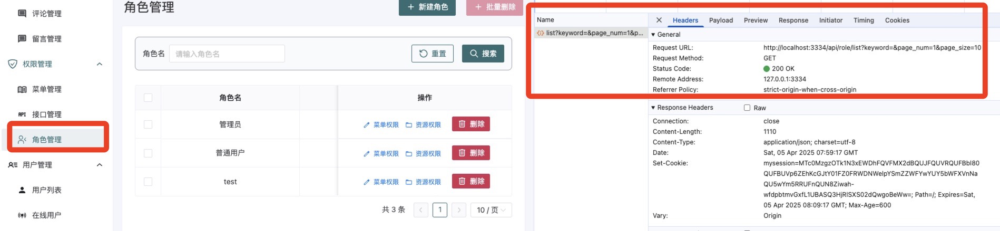
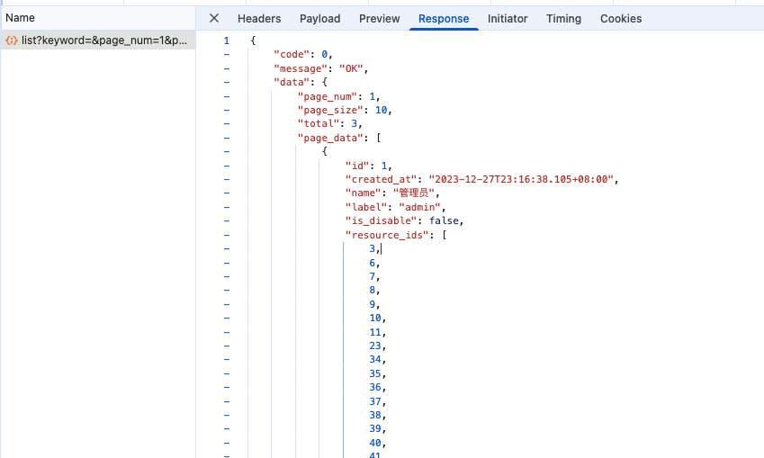
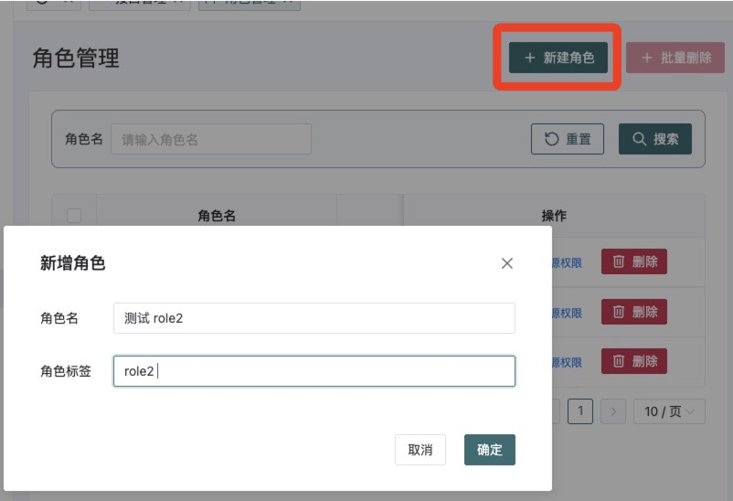
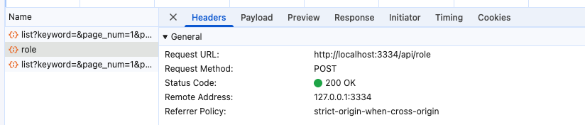
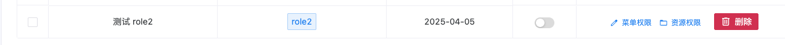
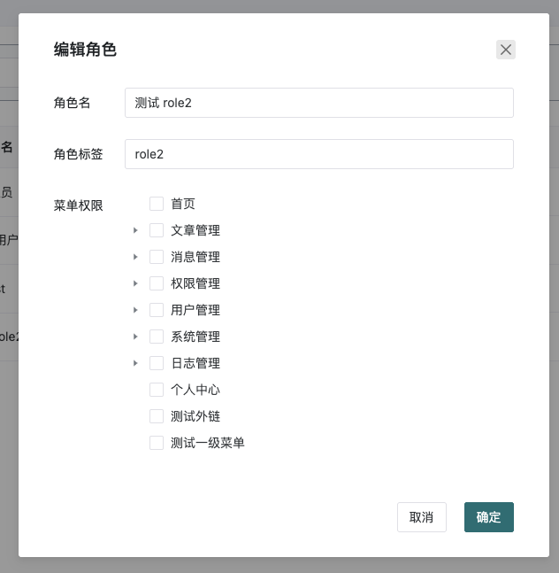
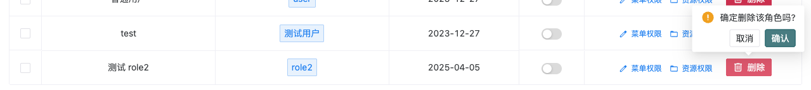
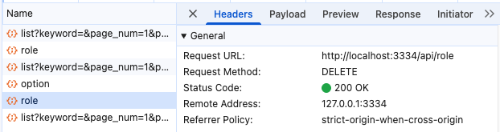
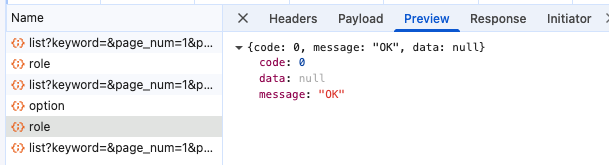
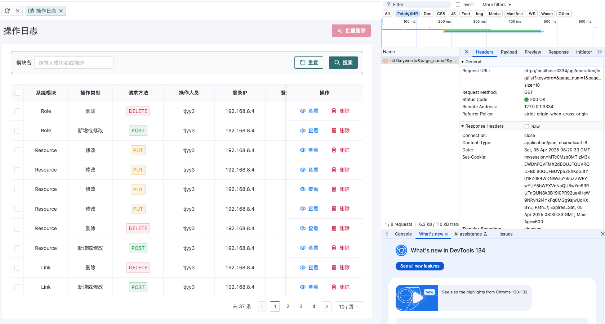

# 19 gin-blog-server 角色模块-操作日志模块-页面模块-文件上传模块

本章继续对剩余的接口进行补充，主要的接口为角色模块、操作日志模块、页面模块、文件上传模块

## 1 角色模块

manager.go

```go
// 角色模块
role := auth.Group("/role")
{
  role.GET("/list", roleAPI.GetTreeList) // 角色列表(树形)
  role.POST("", roleAPI.SaveOrUpdate)    // 新增/编辑菜单
  role.DELETE("", roleAPI.Delete)        // 删除角色
}
```


### 1.1 角色列表(树形) /role/list

handle_role.go:

```go
// GetTreeList 获取角色列表
// @Summary 获取角色列表
// @Description 获取角色列表
// @Tags role
// @Produce json
// @Param keyword query string false "关键字"
// @Param pageNum query int false "页码"
// @Param pageSize query int false "每页数量"
// @Success 0 {object} Response[PageResult[model.RoleVO]]
// @Router /role/list [get]
func (*Role) GetTreeList(c *gin.Context) {
	var query PageQuery
	if err := c.ShouldBindQuery(&query); err != nil {
		ReturnError(c, global.ErrRequest, err)
		return
	}

	db := GetDB(c)
	result := make([]model.RoleVO, 0)

	list, total, err := model.GetRoleList(db, query.Page, query.Size, query.Keyword)
	if err != nil && !errors.Is(err, gorm.ErrRecordNotFound) {
		ReturnError(c, global.ErrDbOp, err)
		return
	}

	for _, role := range list {
		role.ResourceIds, _ = model.GetResourceIdsByRoleId(db, role.ID)
		role.MenuIds, _ = model.GetMenuIdsByRoleId(db, role.ID)
		result = append(result, role)
	}

	ReturnSuccess(c, PageResult[model.RoleVO]{
		Size:  query.Size,
		Page:  query.Page,
		Total: total,
		List:  result,
	})
}
```

auth.go:

```go
type RoleVO struct {
	ID          int       `json:"id"`
	CreatedAt   time.Time `json:"created_at"`
	Name        string    `json:"name"`
	Label       string    `json:"label"`
	IsDisable   bool      `json:"is_disable"`
	ResourceIds []int     `json:"resource_ids" gorm:"-"`
	MenuIds     []int     `json:"menu_ids" gorm:"-"`
}

// GetRoleList 获取角色列表
func GetRoleList(db *gorm.DB, num, size int, keyword string) (list []RoleVO, total int64, err error) {
	db = db.Model(&Role{})
	if keyword != "" {
		db = db.Where("name like ?", "%"+keyword+"%")
	}
	db.Count(&total)
	result := db.Select("id", "name", "label", "created_at", "is_disable").
		Scopes(Paginate(num, size)).
		Find(&list)
	return list, total, result.Error
}

func GetResourceIdsByRoleId(db *gorm.DB, roleId int) (ids []int, err error) {
	result := db.Model(&RoleResource{}).
		Where("role_id = ?", roleId).
		Pluck("resource_id", &ids)
	return ids, result.Error
}

func GetMenuIdsByRoleId(db *gorm.DB, roleId int) (ids []int, err error) {
	result := db.Model(&RoleMenu{}).
		Where("role_id = ?", roleId).
		Pluck("menu_id", &ids)
	return ids, result.Error
}
```

对应的请求和响应如下：






### 1.2 新增/编辑菜单 /role POST

handle_role.go:

```go
// AddOrEditRoleReq 新增/编辑 角色, 关联维护 role_resource, role_menu
type AddOrEditRoleReq struct {
	ID          int    `json:"id"`
	Name        string `json:"name" binding:"required"`
	Label       string `json:"label" binding:"required"`
	IsDisable   bool   `json:"is_disable"`
	ResourceIds []int  `json:"resource_ids"` // 资源 id 列表
	MenuIds     []int  `json:"menu_ids"`     // 菜单 id 列表
}


// SaveOrUpdate 删除角色
func (*Role) SaveOrUpdate(c *gin.Context) {
	var req AddOrEditRoleReq
	if err := c.ShouldBindJSON(&req); err != nil {
		ReturnError(c, global.ErrRequest, err)
		return
	}

	db := GetDB(c)

	if req.ID == 0 {
		err := model.SaveRole(db, req.Name, req.Label)
		if err != nil {
			ReturnError(c, global.ErrDbOp, err)
			return
		}
	} else {
		err := model.UpdateRole(db, req.ID, req.Name, req.Label, req.IsDisable, req.ResourceIds, req.MenuIds)
		if err != nil {
			ReturnError(c, global.ErrDbOp, err)
			return
		}
	}

	ReturnSuccess(c, nil)
}
```

auth.go:

```go
func UpdateRole(db *gorm.DB, id int, name, label string, isDisable bool, resourceIds, menuIds []int) error {
	role := Role{
		Model:     Model{ID: id},
		Name:      name,
		Label:     label,
		IsDisable: isDisable,
	}

	// 同时更新多个数据库表
	return db.Transaction(func(tx *gorm.DB) error {
		if err := db.Model(&role).Select("name", "label", "is_disable").Updates(&role).Error; err != nil {
			return err
		}

		// role_resource
		if err := db.Delete(&RoleResource{}, "role_id = ?", id).Error; err != nil {
			return err
		}
		for _, rid := range resourceIds {
			if err := db.Create(&RoleResource{RoleId: role.ID, ResourceId: rid}).Error; err != nil {
				return err
			}
		}

		// role_menu
		if err := db.Delete(&RoleMenu{}, "role_id = ?", id).Error; err != nil {
			return err
		}
		for _, mid := range menuIds {
			if err := db.Create(&RoleMenu{RoleId: role.ID, MenuId: mid}).Error; err != nil {
				return err
			}
		}

		return nil
	})
}
```

对应的请求和响应如下：







同理，可以对角色进行编辑，来赋予菜单权限




### 1.3 删除角色 /role DELETE

handle_role.go:

```go
// Delete 删除角色
func (*Role) Delete(c *gin.Context) {
  var ids []int
  if err := c.ShouldBindJSON(&ids); err != nil {
    ReturnError(c, global.ErrRequest, err)
    return
  }

  err := model.DeleteRoles(GetDB(c), ids)
  if err != nil {
    ReturnError(c, global.ErrDbOp, err)
    return
  }

  ReturnSuccess(c, nil)
}
```

auth.go:

```go
// DeleteRoles 删除角色: 事务删除 role, role_resource, role_menu
func DeleteRoles(db *gorm.DB, ids []int) error {
	return db.Transaction(func(tx *gorm.DB) error {
		result := db.Delete(&Role{}, "id in ?", ids)
		if result.Error != nil {
			return result.Error
		}

		result = db.Delete(&RoleResource{}, "role_id in ?", ids)
		if result.Error != nil {
			return result.Error
		}

		result = db.Delete(&RoleMenu{}, "role_id in ?", ids)
		if result.Error != nil {
			return result.Error
		}

		return nil
	})
}
```

对应的请求和响应如下：








## 2 操作日志模块

manager.go

```go
// 操作日志模块
operationLog := auth.Group("/operation/log")
{
  operationLog.GET("/list", operationLogAPI.GetList) // 操作日志列表
  operationLog.DELETE("", operationLogAPI.Delete)    // 删除操作日志
}
```


### 2.1 操作日志列表 /operation/log/list

handle_operationlog.go

```go
// GetList 获取操作日志列表
// @Summary 获取操作日志列表
// @Description 根据条件查询获取操作日志列表
// @Tags OperationLog
// @Accept json
// @Produce json
// @Param page_num query int false "页码"
// @Param page_size query int false "每页数量"
// @Param keyword query string false "关键字"
// @Success 0 {object} Response[[]model.OperationLog]
// @Security ApiKeyAuth
// @Router /operation/log/list [get]
func (*OperationLog) GetList(c *gin.Context) {
	var query PageQuery
	if err := c.ShouldBindQuery(&query); err != nil {
		ReturnError(c, global.ErrRequest, err)
		return
	}

	list, total, err := model.GetOperationLogList(GetDB(c), query.Page, query.Size, query.Keyword)
	if err != nil {
		ReturnError(c, global.ErrDbOp, err)
		return
	}

	ReturnSuccess(c, PageResult[model.OperationLog]{
		Total: total,
		List:  list,
		Size:  query.Size,
		Page:  query.Page,
	})
}
```

operation_log.go

```go
func GetOperationLogList(db *gorm.DB, num, size int, keyword string) (data []OperationLog, total int64, err error) {
	db = db.Model(&OperationLog{})
	if keyword != "" {
		db = db.Where("opt_module LIKE ?", "%"+keyword+"%").
			Or("opt_desc LIKE ?", "%"+keyword+"%")
	}
	db.Count(&total)
	result := db.Order("created_at DESC").Scopes(Paginate(num, size)).Find(&data)
	return data, total, result.Error
}

```

对应的请求和响应如下：



**那么，什么时候这些操作日志被记录到数据库中呢？**

+ 因为我们用到了中间件 internal/middleware/operation_log.go:59


### 2.2 删除操作日志 /operation/log DELETE

handle_operationlog.go

```go

// Delete 删除操作日志
// @Summary 删除操作日志
// @Description 删除操作日志
// @Tags OperationLog
// @Accept json
// @Produce json
// @Param ids body []int true "操作日志ID列表"
// @Success 0 {object} Response[int]
// @Security ApiKeyAuth
// @Router /operation/log [delete]
func (*OperationLog) Delete(c *gin.Context) {
	var ids []int
	if err := c.ShouldBindJSON(&ids); err != nil {
		ReturnError(c, global.ErrRequest, err)
		return
	}

	result := GetDB(c).Delete(&model.OperationLog{}, "id in ?", ids)
	if result.Error != nil {
		ReturnError(c, global.ErrDbOp, result.Error)
		return
	}

	ReturnSuccess(c, result.RowsAffected)
}

```

可以删除选中的操作日志。


## 3 页面模块

manager.go

```go
// 页面模块
page := auth.Group("/page")
{
  page.GET("/list", pageAPI.GetList)  // 页面列表
  page.POST("", pageAPI.SaveOrUpdate) // 新增/编辑页面
  page.DELETE("", pageAPI.Delete)     // 删除页面
}
```

### 3.1 页面列表 /page/list


### 3.2 新增/编辑页面 /page POST


### 3.3 删除页面 /page DELETE


## 4 文件上传模块

manager.go

```go
// 博客前台的接口: 大部分不需要登录, 部分需要登录
func registerBlogHandler(r *gin.Engine) {
	...
	// 需要登录才能进行的操作
	base.Use(middleware.JWTAuth())
	{
		base.POST("/upload", uploadAPI.UploadFile)    // 文件上传
		...
	}
}
```


### 4.1 文件上传 /upload


## 5 前台点赞评论/文章

manager.go

```go
// 博客前台的接口: 大部分不需要登录, 部分需要登录
func registerBlogHandler(r *gin.Engine) {
	...
	// 需要登录才能进行的操作
	base.Use(middleware.JWTAuth())
	{
		...
		base.GET("/comment/like/:comment_id", frontAPI.LikeComment) // 前台点赞评论
		base.GET("/article/like/:article_id", frontAPI.LikeArticle) // 前台点赞文章
	}
}
```


### 5.1 前台点赞评论 /comment/like/:comment_id


### 5.2 前台点赞文章 /article/like/:article_id