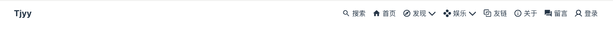
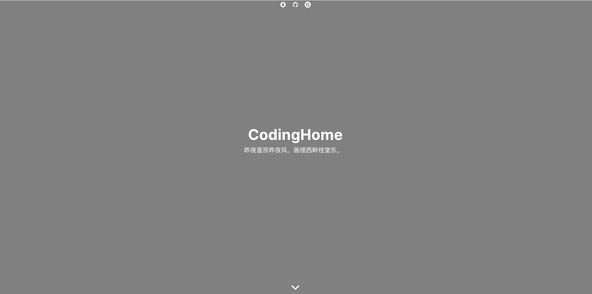
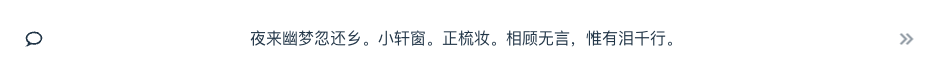
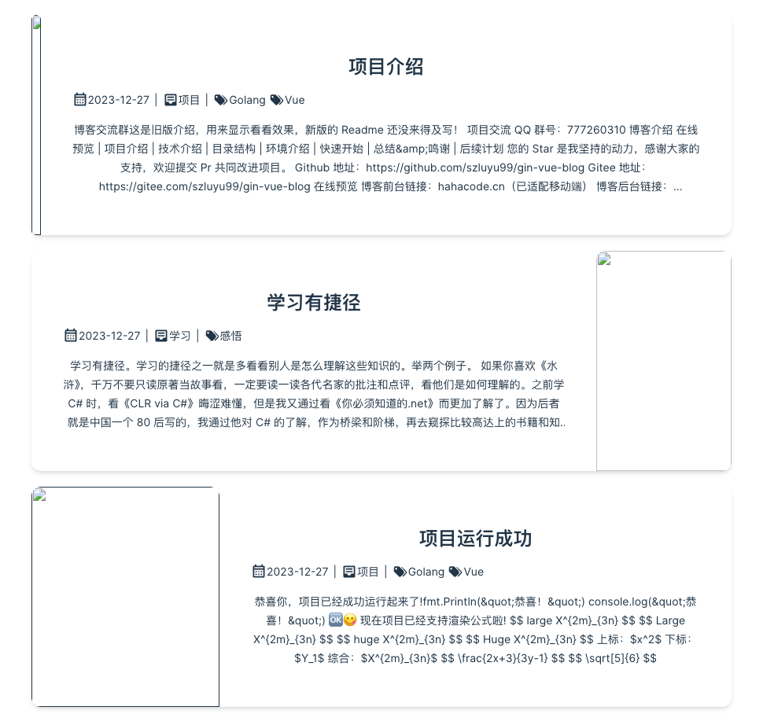
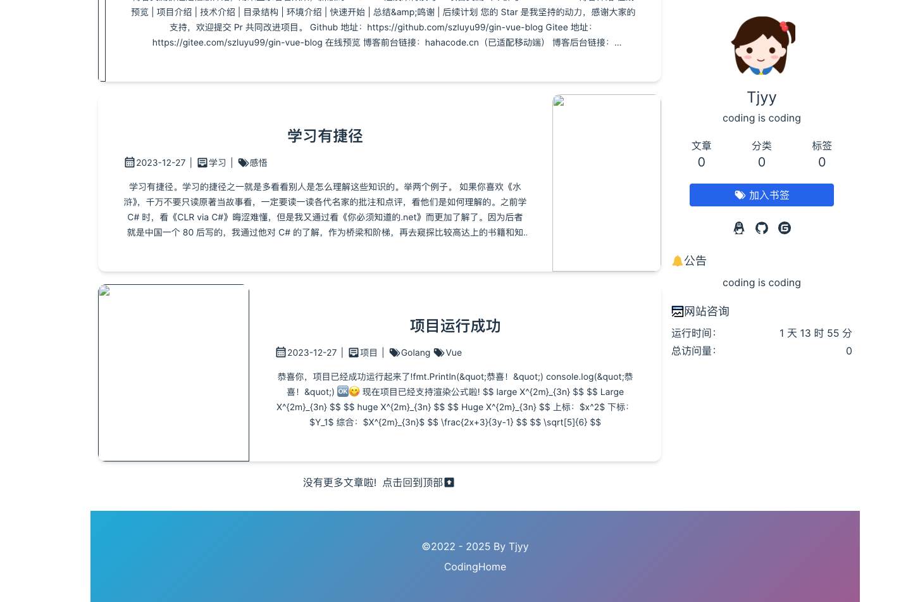

# 第二章 gin-blog-front 首页搭建

## 2.0 初始化

**新建一个文件夹后进入终端：** 

1. pnpm create vite -> gin-blog-front -> vue -> ts -> 初始化完毕

2. 安装 vue 核心依赖：cd framework -> pnpm i
3. 运行项目 : pnpm run dev
4. 项目起步完成

**项目结构中：**

1. Node_modules 中包含了 vue 相关的依赖

2. Package.json 中存放了 vue 的相关配置信息

3. public 文件夹下存放了相关的静态资源

4. src 是代码核心区域，删除一下的文件夹

   + 删除 components/helloworld.vue
   + 安装 vue vscode snippets 插件
   + App.vue 安装删除后输入 v3ts

除此之外，可以将 main.ts 中引入默认样式：

```typescript
import { createApp } from 'vue'
import App from './App.vue'

// custom style
// import './style/index.css'
import './style/common.css'
// import './style/animate.css'

// unocss
import 'uno.css'
import '@unocss/reset/tailwind.css'

const app = createApp(App);
app.mount('#app')
```

之后，就可以开始编写对应的 vue 代码了


## 2.1 消息提示组件

构建顶部中间的消息提示以及右上方的消息组件

**src/components/ui/UToast.vue** 构建该组件并应用于 App.vue

**src/App.vue**

```vue
<template>
  <!-- 顶部中间的消息提示 -->
  <UToast ref="messageRef" position="top" align="center" :timeout="3000" closeable />
  <!-- 右上方的消息通知 -->
  <UToast ref="notifyRef" position="top" align="right" :timeout="3000" closeable />
</template>

<script setup lang="ts">
import UToast from './components/ui/UToast.vue';
</script>

<style scoped lang="scss">
div {
  height: 300px;
}
</style>
```

**src/components/ui/UToast.vue 具体代码如下：**

```vue
<template>
    <Teleport to="body">
        <div v-show="flux.events.length" class="pointer-events-none fixed w-4/5 sm:w-[400px]" :class="{
            'left-1/2 -translate-x-1/2': align === 'center',
            'left-16': align === 'left',
            'right-16': align === 'right',
            'top-4': position === 'top',
            'bottom-6 ': position === 'bottom',
        }" :style="{ zIndex }">
            <!--  
            1. 指定渲染的根元素为 <ul> 标签
            2. enter-class -> enter-to-class: 进入时的初始状态，基于 position 的值来设置不同的动画
            3. leave-class -> leave-to-class 设置里开始的动画效果
            4. move-class 列表项移动时的过渡效果，使用平滑的过渡
        -->
            <TransitionGroup tag="ul" enter-active-class="transition ease-out duration-200"
                leave-active-class="transition ease-in duration-200 absolute w-full" :enter-class="position === 'bottom'
                    ? 'transform translate-y-3 opacity-0'
                    : 'transform -translate-y-3 opacity-0'" enter-to-class="transform translate-y-0 opacity-100"
                leave-class="transform translate-y-0 opacity-100" :leave-to-class="position === 'bottom'
                    ? 'transform translate-y-1/4 opacity-0'
                    : 'transform -translate-y-1/4 opacity-0'" move-class="ease-in-out duration-200"
                class="inline-block w-full">

                <!-- li 标签 -->
                <li v-for="event in flux.events" :key="event.id" :class="{
                    'pb-2': position === 'bottom',
                    'pt-2': position === 'top',
                }">
                    <!-- 这是一个插槽（slot）元素，用于为父组件提供一个可插入的区域 -->
                    <!-- 
                        这个模板是一个通用的通知组件（例如提示框），它：
                        根据 event.type 显示不同的图标和颜色（如成功、信息、警告、错误）。
                        显示 event.content 作为通知的文本内容。
                        提供一个关闭按钮，当点击时会调用 flux.remove(event) 来移除该通知。
                     -->
                    <slot :type="event.type" :content="event.content">
                        <div
                            class="pointer-events-auto w-full overflow-hidden rounded-lg bg-white ring-1 ring-black ring-opacity-5">
                            <div class="flex justify-between px-4 py-3">
                                <div class="flex items-center">
                                    <div class="mr-6 h-6 w-6" :class="{
                                        'i-mdi:check-circle text-green': event.type === 'success',
                                        'i-mdi:information-outline text-blue': event.type === 'info',
                                        'i-mdi:alert-outline text-yellow': event.type === 'warning',
                                        'i-mdi:alert-circle-outline text-red': event.type === 'error',
                                    }" />
                                    <div class="ml-1">
                                        <slot>
                                            <div> {{ event.content }} </div>
                                        </slot>
                                    </div>

                                </div>
                                <button v-if="closeable"
                                    class="i-mdi:close h-5 w-5 flex items-center justify-center rounded-full rounded-full p-1 font-bold text-gray-400 hover:text-gray-600"
                                    @click="flux.remove(event)" />
                            </div>
                        </div>
                    </slot>

                </li>
            </TransitionGroup>

        </div>
    </Teleport>
</template>

<script setup lang="ts">
import { defineProps, reactive } from 'vue';

const props = defineProps({
    show: { type: Boolean, default: false },
    position: {
        type: String,
        default: 'top',
        validator: (value: string) => {
            const positions: string[] = ['top', 'bottom'];
            return positions.includes(value);
        },
    },
    align: {
        type: String,
        default: 'center',
        validator: (value: string) => {
            const alignments: string[] = ['left', 'center', 'right'];
            return alignments.includes(value);
        },
    },
    timeout: { type: Number, default: 2500 },
    queue: { type: Boolean, default: true },
    zIndex: { type: Number, default: 100 },
    closeable: { type: Boolean, default: false },
});


interface FluxEvent {
    id: number;
    content: string;
    type: 'success' | 'info' | 'warning' | 'error';
}

interface Flux {
    events: FluxEvent[];
    success: (content: string) => void;
    info: (content: string) => void;
    warning: (content: string) => void;
    error: (content: string) => void;
    show: (type: 'success' | 'info' | 'warning' | 'error', content: string) => void;
    add: (type: 'success' | 'info' | 'warning' | 'error', content: string) => void;
    remove: (event: FluxEvent) => void;
}

// 这段代码定义了一个响应式对象 flux，它用于管理和控制一组通知事件（例如成功、信息、警告、错误通知）。在这个对象中，定义了几个方法来添加、显示和移除这些通知。
// 假设这是一个通知管理系统，你可以通过调用 flux.success('Message') 来显示一个成功类型的通知，flux.info('Info message') 来显示一个信息类型的通知，通知会在页面上显示一段时间后自动消失。
const flux = reactive<Flux>({
    events: [],

    // success、info、warning、error：这些是 flux 对象的快捷方法，用于向 flux.events 数组中添加不同类型的通知事件。
    // flux.success('message') 会等同于 flux.add('success', 'message')
    success: (content: string) => flux.add('success', content),
    info: (content: string) => flux.add('info', content),
    warning: (content: string) => flux.add('warning', content),
    error: (content: string) => flux.add('error', content),

    /**
     * @param {'success' | 'info' | 'warning' | 'error'} type
     * @param {string} content
     */
    show: (type: 'success' | 'info' | 'warning' | 'error', content: string) => flux.add(type, content),

    // 通过 setTimeout 延迟 100 毫秒后，创建一个新的通知事件对象，并将其添加到 flux.events 中。每个通知事件有一个唯一的 id，生成方式是通过 Date.now() 来保证唯一性。
    add: (type: 'success' | 'info' | 'warning' | 'error', content: string) => {
        if (!props.queue)
            flux.events = [];  // 这里的 props.queue 假设是一个外部的响应式属性，需确保 props 已被正确传递

        setTimeout(() => {
            const event: FluxEvent = { id: Date.now(), content, type };
            flux.events.push(event);
            setTimeout(() => flux.remove(event), props.timeout); // 假设 props.timeout 是预定义的超时时间
        }, 100);
    },

    // 这个方法接受一个通知事件对象 event，然后通过过滤掉该事件的 id，从 flux.events 数组中移除该事件。
    remove: (event: FluxEvent) => {
        flux.events = flux.events.filter((e) => e.id !== event.id);
    },
});

// defineExpose 将 flux 对象的 show、success、info、warning 和 error 方法暴露给外部组件。
defineExpose({
    show: flux.show,
    success: flux.success,
    info: flux.info,
    warning: flux.warning,
    error: flux.error,
})
</script>

<style scoped></style>
```

### 2.1.1 作用分析

这段 Vue 代码是一个实现通知管理系统的组件，提供了一个基于 Vue 3 的通知组件，允许显示不同类型的通知（例如成功、信息、警告、错误），并且可以通过不同的配置来控制显示的位置、关闭按钮以及超时时间等。

该组件的作用是：

- **显示通知**：向用户展示成功、信息、警告、错误等不同类型的消息。
- **动画效果**：通过 `TransitionGroup` 和 `Transition` 添加了进入和离开的动画效果。
- **自动关闭**：通知会在一定的超时时间后自动消失。
- **可关闭**：通知提供了一个关闭按钮，可以手动关闭通知。
- **队列管理**：通知按队列展示，可以设置是否启用队列模式。

这段代码实现了一个可配置的通知组件，可以用于显示不同类型的通知，并支持以下功能：

- **自动消失**：通过 `timeout` 控制通知的显示时长。
- **动态位置**：可以设置通知的位置（顶部或底部）以及对齐方式（左、中、右）。
- **通知队列**：支持队列模式，确保多个通知不会同时


### 2.1.2 样式如何起作用的

例如下面这种使用 class 指定样式的过程，是如何起作用的？

```
<div class="h-full w-full flex flex-col">
  <header>Header</header>
  <main>Main Content</main>
  <footer>Footer</footer>
</div>
```

这里是用了tailwindcss 属于颗粒化的 css，因此更`建议熟练使用 css 的人使用`，这是`新手陷阱`(会让新手成长更慢，毕竟接触到实际的css属性变少)

另外本篇也只介绍很多常见的，有些不常见或者不常用的，可以直接上style、css，或者查询 [tailwind 文档](https://link.juejin.cn?target=https%3A%2F%2Ftailwindcss.com%2Fdocs%2Finstallation)

此外由于已经使用了 颗粒化css 的 tailwindcss，其加上 style、css 可以完全替代 sass、less 这种，基本没有必要引入后两者了，当然真需要也不冲突

第一步：vscode 搜索 **tailwind** 插件(自己看着安装适合自己就行了)，直接搜索安装即可，不然会没有相关提示，这样开发效率反而可能会变低哈

第二步：开始安装相关库，在你的项目目录下运行以下命令：

```js
pnpm install -D tailwindcss@3 postcss autoprefixer 
```

这个命令会将 `tailwindcss`、`postcss` 和 `autoprefixer` 安装为开发依赖。

```
npx tailwindcss init -p
```

这会在项目根目录下创建一个 `tailwind.config.js` 文件，你可以根据需要修改它。

```
/** @type {import('tailwindcss').Config} */
export default {
  content: ["index.html", "./src/**/*.{html,js,ts,jsx,tsx,vue}"],
  theme: {
    extend: {},
  },
  plugins: [],
}
```

根目录创建 `postcss.config.js` 配置一下

```js
module.exports = {
  plugins: {
    tailwindcss: {},
    autoprefixer: {},
  },
}
```

这会告诉 PostCSS 使用 `tailwindcss` 和 `autoprefixer` 插件来处理 CSS。

在项目中创建一个 `src/styles/tailwind.css` 文件，并添加以下内容：

```
/* src/styles/tailwind.css */
@tailwind base;
@tailwind components;
@tailwind utilities;
```

根目录创建 `tailwind.config.js`，或者执行 `npx tailwindcss init` 配置一下

在你的 `main.ts` 文件中，使用 `import` 语句引入你刚刚创建的 `tailwind.css` 文件。这样，整个项目就可以使用 Tailwind 的样式了。

修改你的 `main.ts` 文件，确保它类似于下面的内容：

```js
// main.ts

import { createApp } from 'vue'
import App from './App.vue'

// 引入 Tailwind CSS
import './styles/tailwind.css'

createApp(App).mount('#app')

```

然后可以在 webpack.config 的 plugins 中加入 trailwindcss 吧

先做一个简易的进度条吧，看看效果(这个不可以滑动哈)

```vue
<div
    className={`flex items-center w-[220px] h-[6px] bg-[#ffffff32] rounded-[2px] ${className}`}
>
    <div
        className={`bg-gradient-to-r from-[#0058BA] to-[#5FFFFB] h-[4px] overflow-hidden`}
        style={{
            flex: progress,
        }}
    />
    <div
        className="w-[5px] h-[8px] bg-[#a8deff] rounded-[6px]"
        style={{
            boxShadow: "0px 0px 8px 1px #A8DEFF",
        }}
    />
    <div
        className={`h-[4px] bg-[#ffffff32]`}
        style={{
            flex: 100 - progress,
        }}
    />
</div>
```

通过上面也可以简单看出，`tailwindcss` 使用简单，其就像设置 `style` 一样，`颗粒度非常小`，并且其还是class 形式，再配合 style，使用起来别提多舒服了，尤其是在 react 中可圈可点，并且还不是说不能写css了，想写仍然可以编写，并不冲突

此外，其又是缩写的class，所以整体css代码量会减少不少，也避免了起名的问题，缺点是对新手不友好，可能会忘记基础的css使用，但瑕不掩瑜，开发非常方便

因此也更建议 `css 基础扎实` 的人使用

**下面介绍一下常用的 tailwindcss 基础，很多都是类推，不介绍那么细，因此重要是再重复，不适合css新手看**

https://juejin.cn/post/7441229834116939803


## 2.2 AppHeader 顶部导航栏

```vue
<div class="h-full w-full flex flex-col">
    ...
</div>
```

`flex`：使容器成为 **弹性容器**。

`flex-col`：使子元素在容器内 **垂直方向排列**。

例如:

```vue
<div class="flex flex-col h-64 bg-gray-100">
  <div class="bg-red-500 h-1/4">Item 1</div>
  <div class="bg-blue-500 h-1/4">Item 2</div>
  <div class="bg-green-500 h-1/4">Item 3</div>
  <div class="bg-yellow-500 h-1/4">Item 4</div>
</div>
```

在这个例子中：

- 外部的 `<div>` 使用了 `flex flex-col`，这意味着它是一个 **弹性容器**，并且它的子元素（`Item 1`、`Item 2` 等）会按 **垂直方向** 从上到下排列。
- 每个子元素的高度 (`h-1/4`) 都占父容器的 1/4，所以这些项将均匀分布在容器内。

### 2.2.1 全局状态 pinia

Pinia 提供了一个中心化的地方来管理整个应用的状态，避免了多组件间状态传递的混乱。在一个大型应用中，各种状态（例如用户信息、购物车、主题设置等）可能会在多个组件中被用到，使用 Pinia 可以方便地在这些组件之间共享这些状态。

首先进行相关安装：

```
pnpm add pinia
pnpm add pinia-plugin-persistedstate
```

src/store/index.js

```javascript
import { createPinia } from 'pinia'

// https://github.com/prazdevs/pinia-plugin-persistedstate
// pinia 数据持久化，解决刷新数据丢失的问题
import piniaPluginPersistedstate from 'pinia-plugin-persistedstate'

export const pinia = createPinia()
pinia.use(piniaPluginPersistedstate)

// export * from './app'
export * from './user'
```

在 main.ts 中进行相关配置

```
import { pinia } from './store'

let app = createApp(App);
app.use(pinia);
```

然后， 我们在 src/store/user.ts 构建一个用户相关的全局信息

```typescript
import { defineStore } from 'pinia';

// 自定义 state 的类型
interface UserState {
  userInfo: {
    id: string;
    nickname: string;
    avatar: string;
    website: string;
    intro: string;
    email: string;
    articleLikeSet: any[];
    commentLikeSet: any[];
  };
  token: string | null;
}

export const useUserStore = defineStore('user', {
  state: (): UserState => ({
    userInfo: {
      id: '',
      nickname: '',
      avatar: 'https://example.com/default-avatar.png',
      website: '',
      intro: '',
      email: '',
      articleLikeSet: [],
      commentLikeSet: [],
    },
    token: null,
  }),
  getters: {
    userId: state => state.userInfo.id ?? '',
    nickname: state => state.userInfo.nickname ?? '',
    avatar: state => state.userInfo.avatar ?? 'https://example.com/default-avatar.png',
    website: state => state.userInfo.website ?? '',
    intro: state => state.userInfo.intro ?? '',
    email: state => state.userInfo.email ?? '',
    articleLikeSet: state => state.userInfo.articleLikeSet || [],
    commentLikeSet: state => state.userInfo.commentLikeSet || [],
  },
  actions: {
    // 如果有 actions，可以在这里添加
  },
  persist: {
    key: 'gvb_blog_user',
    paths: ['token'], // 确保 token 是直接在 state 的根路径下
  }
});
```

**同理，简单配置一个：src/store/app.ts**

```typescript
import { defineStore } from 'pinia'

export const useAppStore = defineStore('app', {
    state: () => ({
        searchFlag: false,
        loginFlag: false,
        registerFlag: false,
        collapsed: false, // 侧边栏折叠（移动端）

        page_list: [], // 页面数据
        // TODO: 优化
        blogInfo: {
            article_count: 0,
            category_count: 0,
            tag_count: 0,
            view_count: 0,
            user_count: 0,
        },
        blog_config: {
            website_name: 'CodingHome',
            website_author: 'Tjyy',
            website_intro: 'coding is coding',
            website_avatar: '',
        },
    }),
    getters: {
        isMobile: () => !!navigator.userAgent.match(/(phone|pad|pod|iPhone|iPod|ios|iPad|Android|Mobile|BlackBerry|IEMobile|MQQBrowser|JUC|Fennec|wOSBrowser|BrowserNG|WebOS|Symbian|Windows Phone)/i),
        articleCount: state => state.blogInfo.article_count ?? 0,
        categoryCount: state => state.blogInfo.category_count ?? 0,
        tagCount: state => state.blogInfo.tag_count ?? 0,
        viewCount: state => state.blogInfo.view_count ?? 0,
        pageList: state => state.page_list ?? [],
        blogConfig: state => state.blog_config,
    },
    actions: {
        setCollapsed(flag:any) { this.collapsed = flag },
        setLoginFlag(flag:any) { this.loginFlag = flag },
        setRegisterFlag(flag:any) { this.registerFlag = flag },
        setSearchFlag(flag:any) { this.searchFlag = flag },
    },
})

```

**至此，我们可以继续补充 src/components/layout/AppHeader.vue**


### 2.2.2 AppHeader.vue

为了使用 RouterLink，这里首先要安装并配置 vue-router

```
pnpm add vue-router
```

在项目的入口文件（通常是 `main.js` 或 `main.ts`）中，确保正确引入并注册了 Vue Router：

```javascript
import { createApp } from 'vue';
import App from './App.vue';
import router from './router'; // 确保路由配置文件已正确导入

const app = createApp(App);
app.use(router); // 注册路由
app.mount('#app');
```

确保路由配置文件（通常是 `router/index.js` 或 `router/index.ts`）中正确配置了路由规则。例如：

```javascript
import { createRouter, createWebHistory } from 'vue-router';
import Home from '../views/Home.vue';
import About from '../views/About.vue';

const routes = [
  { path: '/', component: Home },
  { path: '/about', component: About },
];

const router = createRouter({
  history: createWebHistory(),
  routes,
});

export default router;
```

**然后继续构建 AppHeader.vue**

```vue
<template>
    <!-- 移动端顶部导航栏 -->
    <Transition name="slide-face" appear>
        <div v-if="barShow" :class="navClass"
            class="fixed inset-x-0 top-0 z-11 h-[60px] flex items-center justify-between px-4 py-2 lg:hidden">
            <!-- 左上角标题 -->
            <!-- <RouterLink> 是 Vue Router 提供的组件，用于在 Vue 应用中进行页面导航。在这里，点击该链接会导航到首页（/）。 -->
            <RouterLink to="/" class="text-[18px] font-bold">
                {{ appStore.blogConfig.website_author }}
            </RouterLink>

            <!-- 右上角图标 -->
            <div class="flex items-center gap-2 text-2xl">
                <button @click="appStore.setSearchFlag(true)">
                    <Icon icon="ic:round-search" />
                </button>
                <button @click="appStore.setCollapsed(true)">
                    <Icon icon="ic:sharp-menu" />
                </button>
            </div>
        </div>
    </Transition>

    <!-- 电脑端顶部导航栏 -->
    <Transition name="slide-fade" appear>
        <div v-if="barShow" :class="navClass" class="fixed inset-x-0 top-0 z-11 hidden h-[60px] lg:block">
            <div class="h-full flex items-center justify-between px-9">
                <!-- 左上角标题 -->
                <RouterLink to="/" class="text-xl font-bold">
                    {{ appStore.blogConfig.website_author }}
                </RouterLink>
                <!-- 右上角菜单 -->
                <div class="flex items-center space-x-4">
                    <!-- 搜索 -->
                    <div class="menus-item">
                        <a class="menu-btn flex items-center" @click="appStore.setSearchFlag(true)">
                            <Icon icon="mdi:magnify" class="text-xl" />
                            <span class="ml-1"> 搜索 </span>
                        </a>
                    </div>

                    <!-- 多个菜单，根据 menuOptions 配置 -->
                    <div v-for="item of menuOptions" :key="item.text" class="menus-item">
                        <!-- 不包含子菜单 -->
                        <RouterLink v-if="!item.subMenu" :to="item.path" class="menu-btn flex items-center">
                            <Icon :icon="item.icon" class="text-xl" />
                            <span class="ml-1"> {{ item.text }} </span>
                        </RouterLink>
                        <!-- 包含子菜单 -->
                        <div v-else class="menu-btn">
                            <div class="flex items-center">
                                <Icon :icon="item.icon" class="text-xl" />
                                <span class="mx-1"> {{ item.text }} </span>
                                <Icon icon="ep:arrow-down-bold" class="text-xl" />
                            </div>
                            <ul class="menus-submenu">
                                <RouterLink v-for="sub of item.subMenu" :key="sub.text" :to="sub.path">
                                    <div class="flex items-center">
                                        <Icon :icon="sub.icon" class="text-xl" />
                                        <span class="ml-1"> {{ sub.text }} </span>
                                    </div>
                                </RouterLink>
                            </ul>
                        </div>
                    </div>


                    <!-- 登陆设计 -->
                    <div class="menus-item">
                        <!-- 登陆图标 -->
                        <a v-if="!userStore.userId" class="menu-btn" @click="appStore.setLoginFlag(true)">
                            <div class="flex items-center">
                                <Icon icon="ph:user-bold" class="text-xl" />
                                <span class="ml-1"> 登录 </span>
                            </div>
                        </a>
                        <!-- 如果当前是登陆状态，则展示下面的部分 -->
                        <template v-else>
                            
                            <ul class="menus-submenu">
                                <RouterLink to="/user">
                                    <div class="flex items-center">
                                        <Icon icon="mdi:account-circle" class="mr-1 text-xl" /> 个人中心
                                    </div>
                                </RouterLink>
                                <a @click="logout">
                                    <div class="flex items-center">
                                        <Icon icon="mdi:logout" class="mr-1 text-xl" /> 退出登录
                                    </div>
                                </a>
                            </ul>
                        </template>
                    </div>
                </div>
            </div>
        </div>
    </Transition>
</template>

<script setup lang="ts">
import { useRoute, useRouter } from 'vue-router'
import { ref } from 'vue';
import { Icon } from '@iconify/vue'
import { useAppStore, useUserStore } from '@/store'
import { useWindowScroll, watchThrottled } from '@vueuse/core'
import { convertImgUrl } from '@/utils'
const navClass = ref('nav')
const barShow = ref(true)
const appStore = useAppStore()
const userStore = useUserStore()
const router = useRouter()
const route = useRoute()

const menuOptions = [
    { text: '首页', icon: 'mdi:home', path: '/' },
    {
        text: '发现',
        icon: 'mdi:apple-safari',
        subMenu: [
            { text: '归档', icon: 'mdi:archive', path: '/archives' },
            { text: '分类', icon: 'mdi:menu', path: '/categories' },
            { text: '标签', icon: 'mdi:tag', path: '/tags' },
        ],
    },
    {
        text: '娱乐',
        icon: 'mdi:gamepad-circle',
        subMenu: [
            { text: '相册', icon: 'mdi:view-gallery', path: '/albums' },
        ],
    },
    { text: '友链', icon: 'mdi:vector-link', path: '/links' },
    { text: '关于', icon: 'mdi:information-outline', path: '/about' },
    { text: '留言', icon: 'mdi:forum', path: '/message' },
]


// * 监听 y 效果比添加 scroll 监听器效果更好
// * 这段代码的作用是实现一个基于滚动位置的响应式导航栏效果，通常用于网页或应用的顶部导航栏。它通过监听窗口的滚动位置（y 值），并根据滚动方向和滚动距离动态调整导航栏的显示状态和样式。
const { y } = useWindowScroll()
const preY = ref(0) // 记录上一次的 y 滚动距离
watchThrottled(y, () => {
    if (Math.abs(preY.value - y.value) >= 50) { // 小幅度滚动不进行操作
        barShow.value = (y.value < preY.value)
        navClass.value = (y.value > 60) ? 'nav-fixed' : 'nav'
        preY.value = y.value
    }
}, { throttle: 100 })

// 退出登录
async function logout() {
    //   await userStore.logout()
    if (route.name === 'User') {
        router.push('/') // 退出后跳转到首页
    }
    window.$notify.success('退出登录成功!')
}
</script>

<style scoped lang="scss">
.nav {
    transition: all 0.8s;
    //   color: #fff;
    background: rgba(0, 0, 0, 0) !important;
}

.nav-fixed {
    transition: all 0.8s;
    color: #000;
    background: rgba(255, 255, 255, 0.8) !important;
    box-shadow: 0 5px 6px -5px rgba(133, 133, 133, 0.6);

    & .menu-btn:hover {
        color: #49b1f5 !important;
    }
}

.menus-item {
    position: relative;
    display: inline-block;

    // margin: 0 0 0 1rem;
    a {
        transition: all 0.2s;
    }

    a::after {
        position: absolute;
        bottom: -5px;
        left: 0;
        z-index: -1;
        width: 0;
        height: 3px;
        background-color: #80c8f8;
        content: "";
        transition: all 0.3s ease-in-out;
    }

    .menu-btn {
        cursor: pointer;

        &:hover::after {
            width: 100%;
        }
    }
}

// 当鼠标悬停在 .menus-item 元素上时，会改变其内部的 .menus-submenu 元素的显示状态
.menus-item:hover .menus-submenu {
    display: block;
}


.menus-submenu {
    position: absolute;
    display: none; // 默认情况下，.menus-submenu 是隐藏的，不会显示在页面上。
    right: 0;
    width: max-content;
    margin-top: 8px;
    box-shadow: 0 5px 20px -4px rgba(0, 0, 0, 0.5);
    background-color: #fff;
    animation: submenu 0.3s 0.1s ease both;

    &::before {
        position: absolute;
        top: -8px;
        left: 0;
        width: 100%;
        height: 20px;
        content: "";
    }

    a {
        line-height: 2;
        color: #4c4948 !important;
        text-shadow: none;
        display: block;
        padding: 6px 14px;
    }

    a:hover {
        background: #4ab1f4;
    }
}

@keyframes submenu {
    0% {
        opacity: 0;
        filter: alpha(opacity=0);
        transform: translateY(10px);
    }

    100% {
        opacity: 1;
        filter: none;
        transform: translateY(0);
    }
}
</style>
```


### 2.2.3 效果展示




## 2.3 home + 路由搭建

### 2.3.1 HomeBanner

**功能概述**：

- 页面显示一个带有打字机效果的横幅，横幅中包括网站名称和一条随机名言。
- 页面底部有社交媒体链接（QQ、GitHub、Gitee），并通过点击箭头可以触发页面滚动。
- 背景图通过后端配置动态加载。

**关键功能**：

- **打字机特效**：通过 `EasyTyper` 实现，动态加载并显示名言。
- **社交链接**：点击后打开对应的社交网站。
- **平滑滚动**：点击箭头时，页面会平滑地滚动到下方。

**可扩展性**：

- 可以根据需要添加更多的社交链接、动画效果或者动态内容。
- 可以自定义背景图片或颜色，并与后端配置进行绑定。

```vue
<template>
    <!-- 自定义动画类（需要在 CSS 或 Tailwind 配置中定义），用于给横幅添加渐变或淡入效果。 -->
    <div class="banner-fade-down absolute top-20 bottom-0 left-0 right-0 h-screen text-center text-white z-0" :style="coverStyle">
        <!-- 这个容器被定位为绝对定位，inset-x-0 表示左右两侧的内边距为 0，mt-[43vh] 为元素顶部的外边距设置为 43vh（视口高度的 43%），目的是将内容从屏幕上方略微向下偏移。 -->
        <div class="absolute inset-x-0 mt-[43vh] text-center space-y-3">
            <h1 class="animate-zoom-in text-4xl font-bold lg:text-5xl">
                {{ blogConfig.website_name }}
            </h1>
            <div class="text-lg lg:text-xl">
                {{ typer.output }}
                <span class="animate-ping"> | </span>
            </div>
        </div>


        <!-- 社交信息（移动端专用） -->
        <div class="text-2xl space-x-5">
            <a :href="`http://wpa.qq.com/msgrd?v=3&uin=${blogConfig.qq}&site=qq&menu=yes`" target="_blank">
                <span class="i-ant-design:qq-circle-filled inline-block">
                    <Icon icon="ant-design:qq-circle-filled" style="font-size: 20px;" />
                </span>
            </a>
            <a :href="blogConfig.github" target="_blank">
                <span class="i-mdi:github inline-block">
                    <Icon icon="mdi:github" style="font-size: 20px;" />
                </span>
            </a>
            <a :href="blogConfig.gitee" target="_blank">
                <span class="i-simple-icons:gitee inline-block">
                    <Icon icon="simple-icons:gitee" style="font-size: 20px;" />
                </span>
            </a>
        </div>


        <!-- 向下滚动 -->
        <div class="absolute bottom-0 w-full cursor-pointer" @click="scrollDown">
            <span class="inline-block animate-bounce text-2xl text-white" >
                <Icon icon="ep:arrow-down-bold" style="font-size: 30px;" />
            </span>
        </div>
    </div>
</template>

<script setup lang="ts">
import { Icon } from '@iconify/vue';
import { useAppStore } from '@/store'
import { computed, onMounted, reactive } from 'vue'
import { storeToRefs } from 'pinia'
import EasyTyper from 'easy-typer-js'
// 从 Pinia store 中获取并解构出两个响应式数据：pageList 和 blogConfig
const { pageList, blogConfig } = storeToRefs(useAppStore())

// 打字机特效配置
// reactive() 是一个用于创建响应式数据的函数，它使得对象或数组成为响应式的，也就是说，当数据发生变化时，视图会自动更新。
const typer = reactive({
    output: '',
    isEnd: false, // 全局控制是否终止
    speed: 300, // 打字速度
    singleBack: false, // 单次的回滚
    sleep: 0, // 完整输出一句话后, 睡眠一定时候后触发回滚事件
    type: 'normal', // rollback, normal
    backSpeed: 80, // 回滚速度
    sentencePause: false, // 运行完毕后, 句子是否暂停显示
})

onMounted(() => {
    getOneSentence()
})

// 随机获取一句名言
function getOneSentence() {
    // 一言 + 打字机特效
    fetch('https://v1.hitokoto.cn/?c=i')
        .then(res => res.json())
        .then(data => new EasyTyper(typer, data.hitokoto, () => { }, () => { }))
        .catch(() => new EasyTyper(typer, '宠辱不惊，看庭前花开花落；去留无意，望天上云卷云舒。', () => { }, () => { }))
}

// 这段代码定义了一个名为 scrollDown 的函数，目的是平滑地滚动页面到一个特定的位置。
// 意味着页面将被滚动到当前视口的高度。也就是说，页面会滚动到下方一个完整的视口高度（例如，屏幕的下半部分）。
function scrollDown() {
    window.scrollTo({
        behavior: 'smooth',
        top: document.documentElement.clientHeight,
    })
}

// 根据后端配置动态获取封面
const coverStyle = computed(() => {
    const page = pageList.value.find(e => e.label === 'home')
    return page
        ? `background: url('${page.cover}') center center / cover no-repeat;`
        : 'background: grey center center / cover no-repeat;'
})

</script>

<style scoped></style>
```




### 2.3.2 TalkingCarousel

#### 代码综述



**显示动态名言**：组件的主要功能是展示一条动态名言。默认名言是“书山有路勤为径，学海无涯苦作舟”，并且在组件加载时会从 API 获取一条新的名言，更新展示的内容。

**交互按钮**：

- **聊天图标按钮**：左侧按钮可能是用来触发聊天相关的功能。
- **右侧箭头按钮**：右侧按钮带有闪烁的动画效果，可能用于表示向右或向下滑动，或者执行某些其他操作。

**动画效果**：整个卡片和右侧箭头按钮都包含动画效果。卡片会在加载时缩放进入，右侧按钮则不断地左右闪烁，吸引用户注意。

```vue
<template>
    <div class="card-view animate-zoom-in animate-duration-600">
        <div class="flex text-center">
            <button class="text-xl">
                <Icon icon="mdi:chat-outline" />
            </button>
            <div class="flex-1">
                {{ sentence }}
            </div>
            <button class="animate-arrow text-2xl">
                <Icon icon="mdi-chevron-double-right" />
            </button>
        </div>
    </div>
</template>

<script setup lang="ts">
import { Icon } from '@iconify/vue';
import { onMounted, ref } from 'vue'

const sentence = ref('书山有路勤为径，学海无涯苦作舟。')

onMounted(() => {
    fetch('https://v1.hitokoto.cn/?c=i')
        .then(res => res.json())
        .then(data => sentence.value = data.hitokoto)
})
</script>

<style scoped lang="scss">
.animate-arrow {
    animation: 1s passing infinite;
}

/* 左 -> 右 闪的特效 */
@keyframes passing {
    0% {
        transform: translateX(-50%);
        opacity: 0;
    }

    50% {
        transform: translateX(0);
        opacity: 1;
    }

    100% {
        transform: translateX(50%);
        opacity: 0;
    }
}
</style>
```


#### 注意 环境配置

`import.meta.env.VITE_API` 这个变量是由 **Vite** （一个前端构建工具）提供的环境变量，`VITE_API` 是一个自定义的环境变量。Vite 会在构建时根据 `.env` 文件中的配置提供这些环境变量，允许你在代码中使用它们。

+ **`import.meta.env`** 是一个对象，包含了在 **Vite** 中定义的所有环境变量。
+ **`VITE_API`** 是一个自定义的环境变量，通常在 Vite 项目的配置文件 `.env` 或 `.env.local` 中定义。
+ Vite 会自动识别以 `VITE_` 为前缀的环境变量，并将它们注入到 `import.meta.env` 中，允许你在代码中访问。

**使用不同的环境配置**： Vite 允许在不同的环境中使用不同的配置文件。你可以根据不同的环境（开发、生产等）创建 `.env` 文件。例如：

- `.env`（默认环境）
- `.env.local`（本地环境，通常不会提交到版本控制）
- `.env.production`（生产环境）
- `.env.development`（开发环境）

.env:

```
VITE_APP_TITLE = 'CodingHome'
```

.env.development:

```
# 资源公共路径,需要以 /开头和结尾
VITE_PUBLIC_PATH = '/'

# 基础 API: 设置代理就写代理 API, 否则写完整 URL
VITE_API = '/api'

# 后端 URL
VITE_BACKEND_URL = 'http://localhost:8765'

# 登录时是否需要验证码
VITE_USE_CAPTCHA = false
```


### 2.3.4 ArticleCard

- 这段代码的主要功能是显示文章的**卡片视图**，包括封面图、标题、置顶标记、日期、分类、标签和部分内容。用户可以点击封面图或标题跳转到文章的详情页。
- 卡片使用了响应式布局，在不同屏幕尺寸下，封面图和文章信息会动态调整。
- 通过使用 `v-if` 和 `v-for` 控制文章的置顶状态和标签的显示，增强了交互性。
- 使用 `dayjs` 库格式化日期，显示更友好的时间格式。
- 通过 `group-hover` 类，使得在鼠标悬停时，标题文字的颜色变化，增强了用户交互体验。

总的来说，这是一个典型的文章卡片组件，适用于博客或新闻网站展示文章列表，提供了清晰的界面和流畅的用户体验。

```vue
<template>
    <div
        class="group h-[430px] w-full flex flex-col animate-zoom-in animate-duration-700 items-center rounded-xl bg-white shadow-md transition-600 md:h-[280px] md:flex-row hover:shadow-2xl">

        <!-- 封面图 -->
        <div :class="isRightClass" class="h-[230px] w-full overflow-hidden md:h-full md:w-45/100">
            <RouterLink :to="`/article/${article.id}`">
                
            </RouterLink>
        </div>


        <!-- 文章信息 -->
        <div class="my-4 w-9/10 md:w-55/100 space-y-4 md:px-10">
            <RouterLink :to="`/article/${article.id}`">
                <span class="text-2xl font-bold transition-300 group-hover:text-violet">
                    {{ article.title }}
                </span>
            </RouterLink>
            <div class="flex flex-wrap text-sm color-[#858585]">
                <!-- 置顶 -->
                <span v-if="article.is_top === 1" class="flex items-center color-[#ff7242]">
                    <Icon icon="carbon:align-vertical-top" style="font-size: 20px;" /> 置顶
                </span>
                <span v-if="article.is_top === 1" class="mx-1.5">|</span>
                <!-- 日期 -->
                <span class="flex items-center">
                    <Icon icon="mdi-calendar-month-outline" style="font-size: 20px;" />{{
                        dayjs(article.created_at).format('YYYY-MM-DD')
                    }}
                </span>
                <span class="mx-1.5">|</span>
                <!-- 分类 -->
                <RouterLink :to="`/categories/${article.category_id}?name=${article.category?.name}`"
                    class="flex items-center">
                    <Icon icon="mdi-inbox-full" style="font-size: 20px;" /> {{ article.category?.name }}
                </RouterLink>
                <span class="mx-1.5">|</span>
                <!-- 标签 -->
                <div class="flex gap-1">
                    <RouterLink v-for="tag in article.tags" :key="tag.id" :to="`/tags/${tag.id}?name=${tag.name}`"
                        class="flex items-center">
                        <Icon icon="mdi-tag-multiple" style="font-size: 20px;" /> {{ tag.name }}
                    </RouterLink>
                </div>
            </div>
            <div class="ell-4 text-sm leading-6">
                {{ article.content }}
            </div>
        </div>
    </div>
</template>

<script setup lang="ts">
import { computed } from 'vue'
import { convertImgUrl } from '@/utils'
import dayjs from 'dayjs'
import { Icon } from '@iconify/vue';
const props = defineProps({
    idx: Number,
    article: {},
})

// 判断图片放置位置 (左 or 右)
const isRightClass = computed(() => props.idx % 2 === 0
    ? 'rounded-t-xl md:order-0 md:rounded-l-xl md:rounded-tr-0'
    : 'rounded-t-xl md:order-1 md:rounded-r-xl md:rounded-tl-0')
</script>

<style scoped lang="scss">
.ell-4 {
    display: -webkit-box;
    overflow: hidden;
    text-overflow: ellipsis;
    -webkit-line-clamp: 4;
    -webkit-box-orient: vertical;
}
</style>
```



在这段代码中，文章内容的**左右布局**是通过 `flex` 布局和**响应式设计**来控制的。具体来说，主要通过以下部分来实现：

1. **父容器布局**

```vue
<div class="group h-[430px] w-full flex flex-col animate-zoom-in animate-duration-700 items-center rounded-xl bg-white shadow-md transition-600 md:h-[280px] md:flex-row hover:shadow-2xl">
```

- `flex`: 使容器使用 Flexbox 布局。
- `flex-col`: 在默认情况下（小屏幕），内容是竖直排列的。
- `md:flex-row`: 在屏幕宽度达到 `md`（中等及以上屏幕尺寸，通常为 768px 及以上）时，改为横向布局，即**左右排列**。
- `h-[430px]` 和 `md:h-[280px]`: 设置容器的高度，在大屏幕上设为 `280px`，在小屏幕上设为 `430px`。

这段代码实现了响应式布局，使得文章卡片在小屏幕和大屏幕上的显示方式不同。

2. **封面图的布局（左侧部分）**

```vue
<div :class="isRightClass" class="h-[230px] w-full overflow-hidden md:h-full md:w-45/100">
    <RouterLink :to="`/article/${article.id}`">
        
    </RouterLink>
</div>
```

- `isRightClass`：根据 article 的索引（idx）判断封面图的放置位置是左侧还是右侧。它的值是通过 computed 计算出来的：
  - 如果 `idx` 为偶数，封面图放左侧 (`md:order-0`)，
  - 如果 `idx` 为奇数，封面图放右侧 (`md:order-1`)。
- `h-[230px]`：在小屏幕上，封面图的高度为 230px。
- `md:h-full`: 在大屏幕上，封面图的高度为 100%（自适应父容器高度）。
- `md:w-45/100`：在大屏幕上，封面图宽度占 45%。

### 3. **文章信息的布局（右侧部分）**

```vue
<div class="my-4 w-9/10 md:w-55/100 space-y-4 md:px-10">
    <RouterLink :to="`/article/${article.id}`">
        <span class="text-2xl font-bold transition-300 group-hover:text-violet">
            {{ article.title }}
        </span>
    </RouterLink>
    <!-- 其他文章信息（日期、分类、标签等） -->
    <div class="ell-4 text-sm leading-6">
        {{ article.content }}
    </div>
</div>
```

- **`w-9/10`**：在小屏幕上，文章信息部分宽度占 90%。
- **`md:w-55/100`**：在大屏幕上，文章信息部分宽度占 55%。
- **`space-y-4`**：在垂直方向上给子元素之间添加 4px 的间距。
- **`md:px-10`**：在大屏幕上，给容器添加左右内边距。

4. **封面图与文章信息的排列方式**

- **小屏幕（`md` 以下）**：
  - 在小屏幕下，`flex-col` 使得封面图和文章信息是竖直排列的，封面图在上，文章信息在下。
  - `h-[430px]` 保证容器在小屏幕上的高度适合显示所有内容。
- **大屏幕（`md` 以上）**：
  - `flex-row` 将容器改为水平布局，封面图和文章信息并排显示。
  - `md:w-45/100` 和 `md:w-55/100` 分别为封面图和文章信息设置了宽度，确保左右两部分适当地分配空间。
- **封面图的位置**：
  - 通过 `isRightClass` 动态决定封面图的位置：如果 `idx` 为偶数，封面图位于左侧；如果 `idx` 为奇数，封面图位于右侧。这个类通过 `computed` 计算得出，并根据不同的 `idx` 值应用不同的样式。


### 2.3.4 api 请求接口

**这里可以先把后端代码打开，方便构建前端内容：**

src/utils/http.ts

```typescript
import axios from 'axios'
import { useAppStore, useUserStore } from '@/store'


// 通用请求
export const baseRequest = axios.create(
    {
        baseURL: import.meta.env.VITE_API,
        timeout: 12000,
    },
)


baseRequest.interceptors.request.use(requestSuccess, requestFail)
baseRequest.interceptors.response.use(responseSuccess, responseFail)

// 前台请求
export const request = axios.create(
    {
        baseURL: `${import.meta.env.VITE_API}/front`,
        timeout: 12000,
    },
)


request.interceptors.request.use(requestSuccess, requestFail)
request.interceptors.response.use(responseSuccess, responseFail)

/**
 * 请求成功拦截
 * @param {import('axios').InternalAxiosRequestConfig} config
 */
function requestSuccess(config: any) {
    if (config.needToken) {
        const { token } = useUserStore()
        if (!token) {
            return Promise.reject(new axios.AxiosError('当前没有登录，请先登录！', '401'))
        }
        // 如果 config.headers.Authorization 已经有值（即该字段已经被设置），则 不做任何更改。
        config.headers.Authorization = config.headers.Authorization || `Bearer ${token}`
    }
    return config
}

/**
* 请求失败拦截
* @param {any} error
*/
function requestFail(error: any) {
    return Promise.reject(error)
}


/**
 * 响应成功拦截
 * @param {import('axios').AxiosResponse} response
 */
function responseSuccess(response: any) {
    const responseData = response.data
    const { code, message } = responseData
    console.log(message)
    if (code !== 0) { // 与后端约定业务状态码
        if (code === 1203) {
            // 移除 token
            const userStore = useUserStore()
            userStore.resetLoginState()
        }
        (window as any).$message.error(message)
        return Promise.reject(responseData)
    }
    return Promise.resolve(responseData)
}

/**
 * 响应失败拦截
 * @param {any} error
 */
function responseFail(error: any) {
    const { code, message } = error
    if (code === 401) {
        (window as any).$message.error(message)
        // 移除 token
        const userStore = useUserStore()
        userStore.resetLoginState()
        // 登录弹框
        const appStore = useAppStore()
        appStore.setLoginFlag(true)
    }
    return Promise.reject(error)
}
```

这段代码是一个用于 **Axios 请求拦截和响应拦截** 的实现，主要用于处理 API 请求的认证、错误处理以及前端用户状态的管理。它创建了两个 `axios` 实例：`baseRequest` 和 `request`，分别用于不同的请求场景，并通过拦截器对请求和响应做了预处理。具体作用如下：

1. **创建 Axios 实例**

- `baseRequest`: 用于通用的 API 请求。
- `request`: 用于特定的前台 API 请求（`/front` 路径）。

```typescript
export const baseRequest = axios.create({
    baseURL: import.meta.env.VITE_API, // 基础 URL 从环境变量中读取
    timeout: 12000,  // 设置请求超时为 12 秒
});

export const request = axios.create({
    baseURL: `${import.meta.env.VITE_API}/front`, // 前台请求的基础 URL
    timeout: 12000,  // 设置请求超时为 12 秒
});
```

这两者都设置了相同的超时时间和基本 URL，但 `request` 的基础 URL 上添加了 `/front` 路径。

2. **请求拦截器（Request Interceptors）**

请求拦截器会在请求发送之前执行，用来处理一些逻辑，如验证用户是否登录，或者添加请求头（例如 token）。

`requestSuccess`:

- 如果请求需要认证 token（由 `config.needToken` 决定），会检查 `useUserStore` 中的 token。
- 如果没有 token，则拒绝该请求并返回一个 `401` 错误，提示用户未登录。
- 如果有 token，则将其添加到请求头的 `Authorization` 字段中（使用 `Bearer ${token}` 格式）。

```
function requestSuccess(config: any) {
    if (config.needToken) { // 如果请求需要 token
        const { token } = useUserStore()  // 从 store 中获取 token
        if (!token) {
            return Promise.reject(new axios.AxiosError('当前没有登录，请先登录！', '401'))  // 如果没有 token，返回错误
        }
        config.headers.Authorization = config.headers.Authorization || `Bearer ${token}`  // 否则设置 token 到 Authorization 头中
    }
    return config
}
```

`requestFail`:

- 如果请求发生错误，直接返回该错误。

```
function requestFail(error: any) {
    return Promise.reject(error)
}
```

3. **响应拦截器（Response Interceptors）**

响应拦截器会在响应到达时进行处理。通过响应拦截器，可以统一处理 API 请求的结果和错误，处理比如 token 失效等常见问题

`responseSuccess`:

- 当响应成功时（即后端返回的 `code` 为 `0`），会正常返回响应数据。
- 如果后端返回的 `code` 不等于 `0`，表示业务逻辑错误（如 token 失效），会提示错误信息，并且根据错误码 `1203` 清除登录状态。

```
function responseSuccess(response: any) {
    const responseData = response.data
    const { code, message } = responseData
    console.log(message)
    if (code !== 0) { // 后端约定的业务状态码
        if (code === 1203) {  // 如果是 1203 错误码，表示 token 失效
            const userStore = useUserStore()
            userStore.resetLoginState()  // 重置登录状态
        }
        (window as any).$message.error(message)  // 提示用户错误信息
        return Promise.reject(responseData)  // 拒绝 Promise，返回错误数据
    }
    return Promise.resolve(responseData)  // 返回成功的数据
}
```

`responseFail`:

- 如果响应失败（例如网络错误，或者返回 401 错误），会执行以下操作：
  - 如果是 `401` 错误，表示用户未授权或者 token 失效，会提示用户错误信息，清除登录状态，并弹出登录框。

```
function responseFail(error: any) {
    const { code, message } = error
    if (code === 401) {  // 如果是 401 错误，表示未登录或者 token 失效
        (window as any).$message.error(message)  // 提示错误信息
        const userStore = useUserStore()
        userStore.resetLoginState()  // 清除 token 和用户登录状态
        const appStore = useAppStore()
        appStore.setLoginFlag(true)  // 弹出登录框
    }
    return Promise.reject(error)  // 返回拒绝的 Promise
}
```

这个代码段非常适合在需要 **用户认证**（如需要 token 才能访问 API）的应用中使用。它可以确保：

- 请求时自动携带 token，避免每次手动设置。
- 如果 token 失效（如 `401` 错误），可以自动清除登录状态，并弹出登录框，提升用户体验。

------

------

然后我们补充src/api.ts：

```typescript
import { baseRequest, request } from '@/utils/http'

export default {
    /** 首页文章列表 */
    getArticles: (params: any) => request.get('/article/list', { params }),
}
```

然后vite.config.ts 中进行相应请求配置：

```typescript
server: {
      host: '0.0.0.0',
      port: 3333,
      open: false,
      proxy: {
        '/api': {
          target: env.VITE_BACKEND_URL,
          changeOrigin: true,
        },
      },
    },
```


### 2.3.5 首页 home 静态搭建

在 src/App.vue 中添加如下内容：

```vue
<template>
  <!-- 顶部中间的消息提示 -->
  <UToast ref="messageRef" position="top" align="center" :timeout="3000" closeable />
  <!-- 右上方的消息通知 -->
  <UToast ref="notifyRef" position="top" align="right" :timeout="3000" closeable />

  <div class="h-full w-full flex flex-col">
    <!-- 顶部导航栏 -->
    <AppHeader class="z-10"/>

    <!-- 中间内容(包含底部信息) -->
    <article class="flex flex-1 flex-col">
      <!-- { Component, route } 是解构语法，表示从插槽中提取 Component 和 route 两个属性：
            Component：当前路由匹配的组件。
            route：当前路由的信息，包括 path、name 等属性。 
        -->
      <RouterView v-slot="{ Component, route }">  
        <!-- :key 的主要目的是确保组件在变化时能够正确地重新渲染，而不会出现状态或渲染的错误。 -->
        <component :is="Component" :key="route.path" />
      </RouterView>
    </article>

  </div>

</template>
...
```

其中，当用户访问一个特定的路由时，`<RouterView>` 会渲染与该路由匹配的组件。例如，如果当前 URL 路径是 `/home`，并且你在路由配置中定义了与之匹配的 `Home` 组件，那么这个组件将会通过 `<RouterView>` 被显示出来。

+ Vue Router 支持嵌套路由，这意味着一个路由组件中可能会有另一个 `<RouterView>`，用于渲染更深层次的嵌套路由组件。
+ 例如，在你的应用中，如果你有一个布局组件，它包含多个区域，其中一个区域是用来渲染嵌套路由的内容，那么你可以在该区域使用 `<RouterView>`。

因此，我们这里去配置 routes 并完成 home 组件，即首页的开发：

src/router/index.ts

```typescript
import { createRouter, createWebHistory } from 'vue-router'

const basicRoutes = [
    {
      name: 'Home',
      path: '/',
      component: () => import('@/views/home/index.vue'),
    },
]

export const router = createRouter({
    history: createWebHistory('/'),
    routes: basicRoutes,
    scrollBehavior: () => ({ left: 0, top: 0 }),
  })


// main.ts
import { router } from './router'
import store from './store'

const app = createApp(App);
app.use(router); // 注册路由
app.use(store); // 注册pinia
app.mount('#app')
```

**src/views/home/index.vue**

```vue
<template>
    <!-- 首页封面图 -->
    <HomeBanner />
    <!-- 内容 -->
    <div class="mx-auto mb-8 max-w-[1230px] flex flex-col justify-center px-3" style="margin-top: calc(100vh + 30px)">
        <!-- 这表示容器会被划分为 12 列，每列占据相同的空间 -->
        <div class="grid grid-cols-12 gap-4">
            <!-- 左半部分 -->
            <div class="col-span-0 lg:col-span-9 space-y-5">
                <!-- 说说轮播 -->
                <TalkingCarousel />
                <!-- 文章列表 -->
                <div class="space-y-5">
                    <ArticleCard v-for="(item, idx) in articleList" :key="item.id" :article="item" :idx="idx" />
                </div>
            </div>
            <!-- 右半部分 -->
            <div class="col-span-0 lg:col-span-3">

            </div>
        </div>
    </div>
</template>
....
```


## 2.3.4 Home 首页右侧补充

包括如下内容，代码不在赘述

+ 博主信息： AuthorInfo
+ 公告： Announcement
+ 网站咨询：WebsiteInfo

除此之外，继续补充首页底部：AppFooter

**最终效果图如下：**

