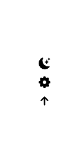
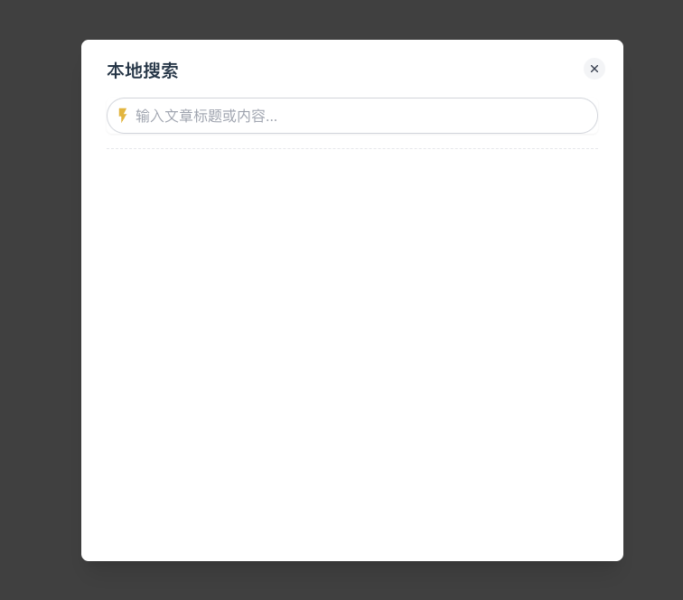
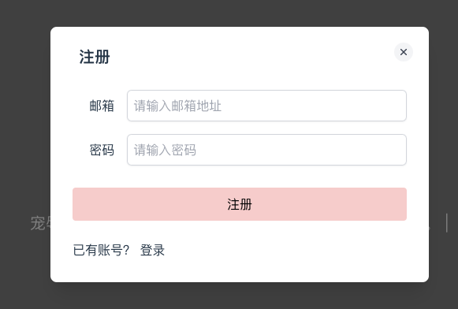
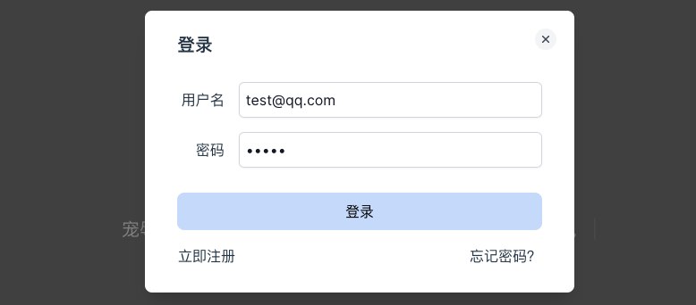

# 第三章 gin-blog-front BackToTop/GlobalModal

## 1 BackToTop

这段代码实现了一个固定在页面底部右侧的工具栏，包含以下功能：

1. **黑夜模式**：点击按钮时显示消息提示“黑夜模式开发中...”。
2. **设置**：点击按钮时显示消息提示“设置开发中...”。
3. **回到顶部**：点击按钮时平滑滚动到页面顶部。

工具栏的显示和隐藏状态会根据页面的滚动位置动态变化，当滚动位置大于 20px 时显示，小于或等于 20px 时隐藏。

**动态效果**

- **初始状态**：页面滚动位置小于或等于 20px，工具栏隐藏。
- **滚动页面**：当页面滚动位置大于 20px 时，工具栏逐渐显示并平移。

```vue
<template>
    <div class="fixed bottom-20 z-4 text-black transition-600 -right-9 space-y-1" :style="styleVal">
        <div v-for="item of options" :key="item.icon"
            class="f-c-c cursor-pointer rounded-sm bg-#49b1f5 p-1 duration-300 hover:bg-amber">
            <Icon class="h-5 w-5" :icon="item.icon" @click="item.fn" />
        </div>
    </div>
</template>

<script setup lang="ts">
import { ref } from 'vue'
import { useWindowScroll, watchThrottled } from '@vueuse/core'
import { Icon } from '@iconify/vue';

const { y } = useWindowScroll()
const styleVal = ref('')
watchThrottled(y, () => {
  styleVal.value = (y.value > 20) ? 'opacity: 1; transform: translateX(-60px);' : ''
}, { throttle: 100 })

const options = [
  {
    icon: 'bi:moon-stars-fill',
    fn: () => (window as any).$message?.info('黑夜模式开发中...'),
  },
  {
    icon: 'uiw:setting',
    fn: () => (window as any).$message?.info('设置开发中...'),
  },
  {
    icon: 'fluent:arrow-up-12-filled',
    fn: () => window.scrollTo({ behavior: 'smooth', top: 0 }),
  },
]
</script>

<style scoped></style>
```




## 2 GlobalModal

### 2.1 UModal

这段代码实现了一个**可配置的模态框组件**，包含了显示/隐藏、动画效果、点击背景关闭等功能，适用于在 Vue 3 中构建对话框、弹窗等 UI 元素。下面详细解析它的作用和实现方式：

**主要功能和作用：**

1. **可控制的显示/隐藏**：
   - 组件通过 `modelValue` 属性与父组件双向绑定，控制模态框的打开或关闭。父组件可以通过 `v-model` 直接控制模态框的状态。
   - `isOpen` 计算属性（`modelValue` 的代理）通过 `computed` 来同步父组件和子组件的状态。当 `isOpen` 为 `true` 时，模态框显示；为 `false` 时，模态框隐藏。
2. **背景遮罩和关闭功能**：
   - 背景遮罩（`overlay`）在模态框打开时显示，并有渐变的透明度效果。
   - `@click.self="close"` 在用户点击背景遮罩时触发 `close` 方法，关闭模态框。`self` 修饰符确保只有点击背景（而不是内容区域）时才会触发关闭事件。
   - `dismissible` 控制是否允许点击背景关闭模态框。默认值为 `true`，允许点击背景关闭。
3. **自定义内容区域**：
   - `dialog` 中的内容是通过插槽 (`<slot />`) 来插入的，这使得父组件可以自定义对话框的内容。
   - 通过传递属性（如 `width`、`padded` 和 `dismissButton`），父组件可以自定义对话框的宽度、内边距和是否显示关闭按钮。
4. **关闭按钮**：
   - 如果 `dismissButton` 为 `true`，对话框右上角会显示一个关闭按钮（`X`）。点击按钮也会触发 `close` 方法，关闭模态框。
5. **过渡和动画效果**：
   - 使用 Tailwind CSS 类来实现模态框的平滑过渡和动画效果：
     - `translate-y-4`, `opacity-0` 等类控制模态框的进入和退出动画，使得模态框在显示/隐藏时有平滑的效果。
     - 透明度、位置和缩放的变化让对话框的显示和隐藏更加自然。
6. **传递属性给子元素**：
   - 通过 `v-bind="$attrs"`，组件可以接受父组件传递的其他属性（如 `class` 或 `style`），并将它们应用到 `div` 元素中。这使得组件更加灵活和可复用。

**src/components/ui/UModal.vue**

```vue
<template>
    <!-- <Teleport> 的 to 属性可以动态改变，允许你在不同目标之间切换 -->
    <!-- to = "body" 代表其中的元素将被渲染到 body 元素中 -->
    <Teleport to="body">
        <div class="fixed inset-0 overflow-y-auto transition-all ease-in" :class="[
            isOpen ? 'visible' : 'invisible duration-100 ease-in',
        ]" :style="{ 'z-index': zIndex }"></div>

        <!-- overlay -->
        <!-- @click.self="close": 这表示当用户点击这个 div 元素本身时触发 close 方法 -->
        <div class="fixed inset-0 bg-black transition-opacity" :class="[
            isOpen ? 'opacity-50 duration-75 ease-out' : 'opacity-0 duration-75 ease-in',
        ]" @click.self="close" />

        <!-- dialog -->
        <div class="min-h-full flex items-center justify-center p-3">
            <div v-bind="$attrs"
                class="relative inline-block w-full rounded-lg bg-white shadow-xl transition-all dark:bg-gray-900"
                :class="[
                    padded ? 'p-4 lg:py-5 lg:px-7' : 'p-1',
                    isOpen
                        ? 'translate-y-0 opacity-100 duration-300 sm:scale-100'
                        : 'translate-y-4 opacity-0 duration-300 sm:translate-y-0 sm:scale-95',
                ]" :style="{
                    width: `${width}px`,
                }">

                <button v-if="dismissButton"
                    class="absolute right-5 top-5 h-6 w-6 rounded-full bg-gray-100 p-1 text-gray-700 hover:bg-gray-200 focus:outline-none focus:ring-2 focus:ring-gray-500"
                    @click="close">
                    <svg xmlns="http://www.w3.org/2000/svg" viewBox="0 0 24 24" stroke="currentColor">
                        <path stroke-linecap="round" stroke-linejoin="round" stroke-width="2"
                            d="M6 18L18 6M6 6l12 12" />
                    </svg>
                </button>
                <slot />

            </div>
        </div>
    </Teleport>
</template>

<script setup lang="ts">
import { computed } from 'vue'

// props 是用来接收父组件传递给子组件的数据的。你可以把 props 想象成组件的输入，它定义了子组件可以接受的参数。
// 在这段代码中，props 定义了一些属性（即子组件可以接受的外部输入），它们的作用如下：
// modelValue: 这是一个布尔类型的属性，表示对话框是否打开。它通常与父组件的 v-model 进行双向绑定（v-model 语法糖会将 modelValue 与父组件的变量绑定）。
// dismissible: 一个布尔类型的属性，表示对话框是否可以通过点击外部区域来关闭，默认值为 true。
// dismissButton: 一个布尔类型的属性，表示是否显示关闭按钮，默认值为 true。
// padded: 一个布尔类型的属性，表示对话框是否有内边距，默认值为 true。
// width: 一个数字类型的属性，表示对话框的宽度，默认值为 500（即 500px）。
// zIndex: 一个数字类型的属性，表示对话框的 z-index，用于控制其层级，默认值为 40
const props = defineProps({
    modelValue: {
        type: Boolean,
        required: true,
    },
    dismissible: {
        type: Boolean,
        default: true,
    },
    dismissButton: {
        type: Boolean,
        default: true,
    },
    padded: {
        type: Boolean,
        default: true,
    },
    width: {
        type: Number,
        default: 500,
    },
    zIndex: {
        type: Number,
        default: 40,
    },
})

// emit 用于触发事件，通知父组件发生了某些事情。在 Vue 3 中，子组件通过 emit 触发的事件可以让父组件做出相应的处理。
// update:modelValue: 当对话框的打开状态（isOpen）变化时，子组件通过 emit('update:modelValue', val) 通知父组件更新 v-model 绑定的值。这是实现双向绑定的关键。
// close: 当对话框关闭时，子组件触发 close 事件，父组件可以通过监听该事件来执行一些自定义的行为（比如关闭其他相关的UI，或执行清理操作）。
const emit = defineEmits<{
    (e: 'update:modelValue', value: boolean): void
    (e: 'close'): void
}>()

// computed 是 Vue 3 中的一个响应式 API，用于创建计算属性。计算属性是基于它们的依赖进行缓存的，并且只有在依赖项发生变化时才会重新计算。计算属性可以用来封装逻辑，避免重复的计算。
// get 是计算属性的获取器，它定义了计算属性的值是如何被获取的。在这里，get 返回了父组件传递的 props.modelValue。
// set 是计算属性的设置器，它定义了计算属性的值是如何被设置的。当你修改计算属性（如 isOpen）的值时，实际上会触发 set 方法，从而执行一些副作用。
// 在这里，set 用来将 isOpen 的变化通知给父组件。它会触发 emit('update:modelValue', val)，通知父组件更新 modelValue，实现双向绑定。
const isOpen = computed({
    get: () => props.modelValue,
    set: val => emit('update:modelValue', val),
})


function close() {
    if (props.dismissible)
        isOpen.value = false
    emit('close')
}

</script>

<style scoped></style>
```

------


### 2.2 如何正确使用 `<Teleport>`？

**Teleport to="body" 如何正确使用**

在 Vue 3 中，`<Teleport>` 是一个非常有用的内置组件，允许你将某个部分的内容渲染到其他 DOM 元素中。通常用于将模态框、通知或其他浮动层（overlay）渲染到页面的不同位置，例如将其渲染到 `body` 元素内，而不是在父组件的 DOM 层次结构中。这样可以避免被父组件的样式或布局影响。

**基本结构**

```vue

<template>
  <!-- 使用 Teleport，将子组件内容传递到 body 元素 -->
  <Teleport to="body">
    <div class="modal">
      <p>This modal will be rendered inside the body element</p>
    </div>
  </Teleport>
</template>
```

**参数说明**

- **`to` 属性**：`to` 属性指定了内容要渲染到哪个 DOM 元素。常见的用法是将内容渲染到 `body` 元素，或者渲染到某个具有特定 `id` 或 `class` 的元素。

  - `to="body"` 表示将内容渲染到 `<body>` 元素。
  - 你也可以指定一个特定的容器，例如 `to="#modal-container"`，将内容渲染到页面中具有该 `id` 的元素内。

  ```
  <Teleport to="body">
    <div class="modal">This is a modal</div>
  </Teleport>
  ```

  或者

  ```
  <Teleport to="#custom-container">
    <div class="modal">This is a modal</div>
  </Teleport>
  ```

**使用场景**

1. **模态框（Modal）**：
   - 模态框通常需要被渲染到页面的顶层，而不是父组件的 DOM 树内。你可以使用 `Teleport` 将模态框渲染到 `body` 元素中。
2. **通知（Notification）**：
   - 全局通知组件通常需要渲染到页面的顶部或底部，而不会受到父组件布局的影响。
3. **全局覆盖层（Overlay）**：
   - 有时候你需要一个全局的遮罩层，这个遮罩层可能需要覆盖整个页面。通过 `Teleport`，你可以将遮罩层渲染到 `body` 上，而不会影响其他组件的布局。

示例：实现一个模态框

```vue
<template>
  <Teleport to="body">
    <div v-if="isModalOpen" class="fixed inset-0 bg-gray-600 opacity-50" @click="closeModal">
      <!-- Modal background -->
    </div>
    <div v-if="isModalOpen" class="fixed inset-0 flex justify-center items-center z-50">
      <!-- Modal content -->
      <div class="bg-white p-6 rounded-lg shadow-xl">
        <p>This is a modal content</p>
        <button @click="closeModal">Close</button>
      </div>
    </div>
  </Teleport>
</template>

<script setup>
import { ref } from 'vue';

const isModalOpen = ref(false);

function openModal() {
  isModalOpen.value = true;
}

function closeModal() {
  isModalOpen.value = false;
}

// For demo purposes, open the modal after 1 second
setTimeout(openModal, 1000);
</script>

<style scoped>
.fixed {
  position: fixed;
}
.inset-0 {
  top: 0;
  right: 0;
  bottom: 0;
  left: 0;
}
.bg-gray-600 {
  background-color: rgba(0, 0, 0, 0.6);
}
.z-50 {
  z-index: 50;
}
</style>
```

解释

- **`<Teleport to="body">`**：使得模态框和背景遮罩渲染到 `<body>` 元素，而不是父组件的 DOM 中。无论这个组件在页面的哪个位置，这些内容都会直接添加到 `<body>` 中，通常这样做是为了避免影响布局，尤其是在全屏覆盖层（如模态框）时非常有用。
- **`v-if="isModalOpen"`**：只有在 `isModalOpen` 为 `true` 时，模态框和背景遮罩才会被渲染。
- **`@click="closeModal"`**：点击遮罩区域时会关闭模态框。
- **`setTimeout(openModal, 1000)`**：为了演示，1 秒后自动打开模态框。

总结

**`<Teleport>` 使得组件或元素能够渲染到页面的不同位置，而不是其父组件的 DOM 中。它主要用于那些需要在页面的顶层显示的元素（如模态框、通知等）。通过使用 `to` 属性，你可以灵活地将内容渲染到 `body` 或任何指定的 DOM 元素中。**

------

在本项目中，利用 Teleport + zIndex = 40 成功将搜索界面、注册界面以及登陆界面浮现在最上层，从而提供对应的新操作界面。


### 2.3 SearchModal

想要直接使用图标，可以配置：https://blog.loli.wang/blog/2024-02-04-iconifycss/doc/

下面的内容会插入到 UModal 模版中 `<slot />` 元素的位置

> 在 Vue 中，`<slot>` 是一个占位符，用于在组件的模板中定义一个可以被父组件替换的内容区域。通过使用 `<slot>`，你可以创建可复用的组件，并允许父组件在使用时动态插入内容。
>
> `<slot>` 的主要作用是提供一个“插槽”，父组件可以通过这个插槽插入自定义内容。这使得组件更加灵活和可复用。
>
> 1. **定义插槽**：
>    - 在子组件（`UModal`）中，使用 `<slot>` 定义一个内容插槽。
>    - `<slot>` 是一个占位符，表示父组件可以在这里插入内容。
> 2. **插入内容**：
>    - 在父组件中，使用 `<UModal>` 时，将内容放在 `<UModal>` 的标签内部。
>    - 这些内容将被插入到子组件的 `<slot>` 位置。

```vue
<template>
    <!-- appStore.setSearchFlag(val) 更改 searchFlag 值会影响 UModal 中isOpen 值，进而影响显示效果 -->
    <UModal v-model="searchFlag" :width="600">
        <div class="m-0">
            <div class="mb-4 text-xl font-bold">
                本地搜索
            </div>
            <div>
                <div class="relative rounded-md shadow-sm">
                    <div class="pointer-events-none absolute inset-y-0 left-0 flex items-center pl-2">
                        <div class="i-mdi-flash text-xl text-yellow-500" />
                    </div>
                    <input v-model="keyword"
                        class="block w-full border-0 rounded-full py-2 pl-8 pr-5 text-gray-900 outline-none ring-1 ring-gray-300 ring-inset placeholder:text-gray-400 focus:ring-2 focus:ring-green-300"
                        placeholder="输入文章标题或内容...">
                </div>
            </div>
            <hr class="my-4 border-1.5 border-color-#d2ebfd border-dashed">
            <div class="h-[420px] overflow-y-auto">
                <ul v-if="articleList.length">
                    <li v-for="item of articleList" :key="item.id" class="text-sm">
                        <RouterLink :to="`/article/${item.id}`">
                            <span class="border-b-1 border-#999 border-solid text-lg" @click="searchFlag = false"
                                v-html="item.title" />
                        </RouterLink>
                        <div class="ell-4 mt-1">
                            <p clsas="color-#555 cursor-pointer" v-html="item.content" />
                        </div>
                        <hr class="my-3 border-1 border-#d2ebfd border-dashed">
                    </li>
                </ul>
                <div v-else-if="keyword">
                    找不到您查询的内容：{{ keyword }}
                </div>
            </div>
        </div>
    </UModal>
</template>

<script setup lang="ts">
import { computed, ref } from 'vue'
import { debouncedWatch } from '@vueuse/core'

import UModal from '@/components/ui/UModal.vue'
import api from '@/api'
import { useAppStore } from '@/store'

const appStore = useAppStore()

const searchFlag = computed({ // searchFlag 代表  appStore.searchFlag 的值
    get: () => appStore.searchFlag,
    set: val => appStore.setSearchFlag(val), // // searchFlag 变化时调用 appStore.setSearchFlag(val)
})

const keyword = ref('')
// 搜索结果
const articleList = ref([])


// 防抖 watch, 节流: throttledWatch
// 这是你要监听的响应式变量。debouncedWatch 会监听 keyword 的值，当 keyword 的值变化时，会触发回调函数。
//  300 毫秒内如果 keyword 没有变化，才会执行回调函数。
debouncedWatch(
    keyword,
    //   这个回调函数会在 keyword 的值发生变化时执行
    () => keyword.value ? handleSearch() : articleList.value = [],
    { debounce: 300 },
)

async function handleSearch() {
    const resp = await api.searchArticles({ keyword: keyword.value })
    articleList.value = resp.data
}

</script>

<style scoped lang="scss">
.ell-4 {
    display: -webkit-box;
    overflow: hidden;
    text-overflow: ellipsis;
    -webkit-line-clamp: 4;
    -webkit-box-orient: vertical;
  }
</style>
```




### 2.4 RegisterModal

同理，注册模块：

```vue
<template>
    <UModal v-model="registerFlag" :width="480">
        <div class="mx-2 my-1">
            <div class="mb-4 text-xl font-bold">
                注册
            </div>
        </div>
        <div class="my-7 space-y-4">
            <div class="flex items-center">
                <span class="mr-4 inline-block w-16 text-right"> 邮箱 </span>
                <input v-model="form.email" required placeholder="请输入邮箱地址"
                    class="block w-full border-0 rounded-md p-2 text-gray-900 shadow-sm outline-none ring-1 ring-gray-300 ring-inset placeholder:text-gray-400 focus:ring-2 focus:ring-emerald">
            </div>
            <div class="flex items-center">
                <span class="mr-4 inline-block w-16 text-right"> 密码 </span>
                <input v-model="form.password" required type="password" placeholder="请输入密码"
                    class="block w-full border-0 rounded-md p-2 text-gray-900 shadow-sm outline-none ring-1 ring-gray-300 ring-inset placeholder:text-gray-400 focus:ring-2 focus:ring-emerald">
            </div>
        </div>

        <div class="my-2 text-center">
            <button class="w-full rounded bg-red-200 py-2 text-black hover:bg-orange" @click="handleRegister">
                注册
            </button>
            <div class="mb-2 mt-6 text-left">
                已有账号？
                <button class="duration-300 hover:text-emerald" @click="openLogin">
                    登录
                </button>
            </div>
        </div>
    </UModal>
</template>

<script setup lang="js">
import { computed, ref } from 'vue'
import UModal from '@/components/ui/UModal.vue'
import api from '@/api'
import { useAppStore } from '@/store'

const appStore = useAppStore()

const registerFlag = computed({
    get: () => appStore.registerFlag,
    set: val => appStore.setRegisterFlag(val),
})

const form = ref({
    email: '', // 修改为 email
    password: '',
})

// 注册
async function handleRegister() {
    const { email, password } = form.value

    const reg = /^([a-zA-Z]|[0-9])(\w|\-)+@[a-zA-Z0-9]+\.([a-zA-Z]{2,4})$/
    if (!reg.test(email)) {
        window.$message?.warning('请输入正确的邮箱格式')
        return
    }

    if (!password) {
        window.$message?.warning('请输入密码')
        return
    }

    // 发送注册请求
    await api.register({ email, password })
    window.$message?.success('邮件已发送，请在邮箱中确认以完成注册')
    form.value = { email: '', password: '' }
}


// 登录
function openLogin() {
    appStore.setRegisterFlag(false)
    appStore.setLoginFlag(true)
}

</script>

<style scoped></style>
```




### 2.5 LoginModal

登陆模块写法如下：

```vue
<template>
    <UModal v-model="loginFlag" :width="480">
        <div class="mx-2 my-1">
            <div class="mb-4 text-xl font-bold">
                登录
            </div>
            <div class="my-7 space-y-4">
                <div class="flex items-center">
                    <span class="mr-4 inline-block w-16 text-right"> 用户名 </span>
                    <input v-model="form.username" required placeholder="用户名"
                        class="block w-full border-0 rounded-md p-2 text-gray-900 shadow-sm outline-none ring-1 ring-gray-300 ring-inset placeholder:text-gray-400 focus:ring-2 focus:ring-emerald">
                </div>
                <div class="flex items-center">
                    <span class="mr-4 inline-block w-16 text-right"> 密码 </span>
                    <input v-model="form.password" type="password" placeholder="密码"
                        class="block w-full border-0 rounded-md p-2 text-gray-900 shadow-sm outline-none ring-1 ring-gray-300 ring-inset placeholder:text-gray-400 focus:ring-2 focus:ring-emerald">
                </div>
            </div>
            <div class="my-2 text-center">
                <button class="w-full rounded-lg bg-blue-200 py-2 text-black hover:bg-light-blue" @click="handleLogin">
                    登录
                </button>
                <div class="mt-4 flex justify-between">
                    <button @click="openRegister">
                        立即注册
                    </button>
                    <button @click="openForget">
                        忘记密码？
                    </button>
                </div>
            </div>
        </div>
    </UModal>
</template>

<script setup lang="js">
import { computed, ref } from 'vue'

import UModal from '@/components/ui/UModal.vue'
import { useAppStore, useUserStore } from '@/store'
import api from '@/api'

const userStore = useUserStore()
const appStore = useAppStore()

const registerFlag = computed({
    get: () => appStore.registerFlag,
    set: val => appStore.setRegisterFlag(val),
})

const loginFlag = computed({
    get: () => appStore.loginFlag,
    set: val => appStore.setLoginFlag(val),
})

const form = ref({
    username: 'test@qq.com',
    password: '11111',
})


// 登陆操作
const doLogin = async (username, password) => {
    const resp = await api.login({username, password})
    window.$notify?.success('登录成功!')
    // 设置 token
    userStore.setToken(resp.data.token)
    // 加载用户信息, 更新 pinia 中信息, 刷新页面
    await userStore.getUserInfo()
    // 清空表单
    form.value = { username: 'test@qq.com', password: '11111' }
    loginFlag.value = false
}

// 登陆处理
async function handleLogin() {
    const { username, password } = form.value
    if (!username || !password) {
        window.$message?.warning('请输入用户名和密码')
        return
    }
    doLogin(username, password)
}


// 立即注册: 弹出注册窗口、关闭登陆窗口
function openRegister() {
    registerFlag.value = true
    loginFlag.value = false
}

// TODO:忘记密码
function openForget() {
    window?.$message?.info('暂时不支持找回密码!')
}

</script>

<style scoped></style>
```

