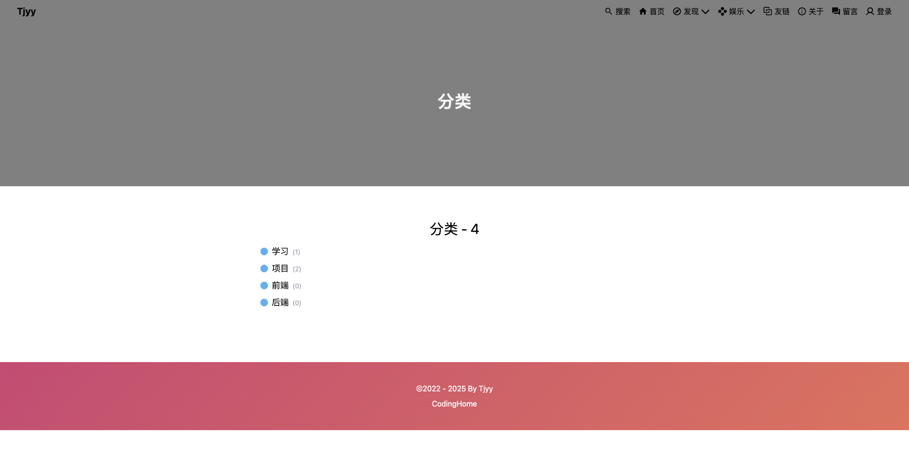

# 第四章 gin-blog-front Archive/Caregory/Tag

## 0 更改配置

对于一些自定义的样式文件分别存在于：

+ import './style/index.css'
+ import './style/common.css'
+ import './style/animate.css'

当前的 main.ts 配置如下：

```typescript
import { createApp } from 'vue'
import App from './App.vue'

// custom style
// import './style/index.css'
import './style/common.css'
// import './style/animate.css'

// unocss
import 'uno.css'
import '@unocss/reset/tailwind.css'

import { router } from './router'
import store from './store'

const app = createApp(App);
app.use(router); // 注册路由
app.use(store); // 注册pinia
app.mount('#app')


console.log(import.meta.env.VITE_APP_TITLE)
```

> import 中的对应配置需要执行 pnpm add ... 进行加载


## 1 Router 配置

**首先在 Router 中进行相应的路由配置，其中的 components指向的元素会被现实在 Router-View 包裹的位置，大致的代码思路如下：**

首先是定义基本路由：

- **`basicRoutes`**：定义了一个数组，包含项目的路由规则。
- 每个路由对象包含以下属性：
  - **`name`**：路由的名称，用于编程式导航。
  - **`path`**：路由的路径。
  - **`component`**：路由对应的组件，使用动态导入（`import`）来实现懒加载，提高性能。
  - **`meta`**：路由元信息，用于存储额外的数据，例如页面标题。

其次是创建路由实例：

+ **`createRouter`**：创建一个路由实例。
+ **`history`**：使用 `createWebHistory` 设置路由模式为历史模式，`'/'` 是应用的根路径。
+ **`routes`**：将定义的路由规则传递给路由实例。
+ **`scrollBehavior`**：定义路由切换时的滚动行为，这里设置为每次路由切换后滚动到页面顶部。

**然后是设置页面标题：**

```
router.afterEach((to) => {
  document.title = `${to.meta?.title ?? import.meta.env.VITE_APP_TITLE}`
})
```

+ **`router.afterEach`**：注册一个全局后置钩子，每次路由切换完成后执行。
+ **`to.meta?.title`**：获取目标路由的 `meta.title` 属性。
+ **`import.meta.env.VITE_APP_TITLE`**：如果路由没有定义标题，则使用环境变量 `VITE_APP_TITLE` 作为默认标题。
+ **`document.title`**：设置浏览器的页面标题。

**配置 `nprogress`**:

```
NProgress.configure({ showSpinner: false })
```

- **`NProgress.configure`**：配置 `nprogress` 的行为。
- **`showSpinner`**：设置为 `false`，表示不显示加载进度条的旋转动画。

**全局前置导航守卫**

```
router.beforeEach((to, from, next) => {
  NProgress.start()
  for (let i = 0; i < 5; i++) NProgress.inc()
  setTimeout(() => NProgress.done(), 300)
  next()
})
```

- **`router.beforeEach`**：注册一个全局前置导航守卫，每次路由切换开始前执行。
- **`NProgress.start`**：开始显示进度条。
- **`NProgress.inc`**：增加进度条的进度，这里调用了 5 次，模拟进度条的逐步加载。
- **`setTimeout(() => NProgress.done(), 300)`**：在 300 毫秒后完成进度条。
- **`next()`**：调用 `next()` 函数，允许路由切换继续进行。

------

**下面是完整代码：**

```typescript
import { createRouter, createWebHistory } from 'vue-router'
import NProgress from 'nprogress'
import '@/style/nprogress.css'

const basicRoutes = [
  {
    name: 'Home',
    path: '/',
    component: () => import('@/views/home/index.vue'),
  },
  {
    name: 'Archive',
    path: '/archives',
    component: () => import('@/views/discover/archive/index.vue'),
    meta: {
      title: '归档',
    },
  },
  {
    name: 'Category',
    path: '/categories',
    component: () => import('@/views/discover/category/index.vue'),
    meta: {
      title: '分类',
    },
  },
  {
    name: 'CategoryArticles',
    path: '/categories/:categoryId',
    component: () => import('@/views/article/list/index.vue'),
    meta: {
      title: '分类',
    },
  },
  {
    name: 'Tag',
    path: '/tags',
    component: () => import('@/views/discover/tag/index.vue'),
    meta: {
      title: '标签',
    },
  },
  {
    name: 'TagArticles',
    path: '/tags/:tagId',
    component: () => import('@/views/article/list/index.vue'),
    meta: {
      title: '标签',
    },
  },
]

export const router = createRouter({
  history: createWebHistory('/'),
  routes: basicRoutes,
  scrollBehavior: () => ({ left: 0, top: 0 }),
})

router.afterEach((to) => {
  document.title = `${to.meta?.title ?? import.meta.env.VITE_APP_TITLE}`
})

NProgress.configure({ showSpinner: false })

router.beforeEach((to, from, next) => {
  NProgress.start()
  for (let i = 0; i < 5; i++) NProgress.inc()
  setTimeout(() => NProgress.done(), 300)
  next()
})
```


## 2 Archive 页面搭建

### 2.1 USpin/ULoading

**USpin 是一个自定义的 Vue 组件，用来显示一个旋转的加载动画（通常用于加载时的“等待”状态）。它实现了一个旋转的圆形进度指示器，并允许自定义其颜色、厚度和大小。**

这个组件主要用于显示一个旋转的加载动画。通过 `size`、`color` 和 `thickness` 属性，你可以自定义其尺寸、颜色和边框厚度。如果不传入自定义图标，组件会显示一个默认的旋转圆圈，通常用于加载状态下的占位符效果。它的设计灵活，可以在不同场景中用作页面加载时的视觉提示。

1. **模板部分 (`<template>`)**

```vue
<template>
    <div :style="{
        height: `${size}px`,
        width: `${size}px`,
    }">
        <slot name="icon">
            <div class="inline-block h-full w-full animate-spin border-gray-300 rounded-full bg-transparent"
                :class="[`border-${thickness}`]" :style="{
                    'border-right-color': color,
                    'border-width': `${thickness}px`,
                    'border-style': 'solid',
                }">
                <span class="sr-only">loading</span>
            </div>
        </slot>
    </div>
</template>
```

- **`<div :style="...">`**：这个容器的大小由 `size` 属性决定，`size` 默认值为 32px。如果你传入了其他大小，这个容器的宽度和高度会自动调整。

- **`<slot name="icon">`**：这个插槽允许用户传入自定义的图标（如果有的话），否则使用默认的旋转动画作为占位内容。如果父组件没有传入图标内容，这个 `slot` 会渲染默认的旋转动画。

- **旋转动画部分**：

  - **`<div class="inline-block h-full w-full animate-spin ...">`**：这个元素使用了 `animate-spin` 类，表示它会自动旋转。`animate-spin` 是 TailwindCSS 提供的一个类，负责启动旋转动画。
  - **`border-right-color`**：这个样式动态地设置了旋转圆圈的右侧边框颜色，根据 `color` 属性来调整。`color` 默认是 `'green'`，可以通过属性传递更改颜色。
  - **`border-width`**：设置边框的厚度，动态绑定到 `thickness` 属性（默认为 4px）。
  - **`border-style`**：设置边框样式为实线 (`solid`)。

  该动画创建了一个围绕自己旋转的圆圈，边框的颜色和厚度都可以自定义。

2. **脚本部分 (`<script setup>`)**

```vue
<script setup>
defineProps({
    show: {
        type: Boolean,
        default: true,
    },
    color: {
        type: String,
        default: 'green',
    },
    thickness: {
        type: Number,
        default: 4,
    },
    size: {
        type: Number,
        default: 32,
    },
})
</script>
```

- defineProps 用来定义组件的输入属性（props）：
  - **`show`**：控制是否显示加载动画，默认为 `true`，但在模板中并未直接使用（可能是为了将来实现显示/隐藏功能）。
  - **`color`**：定义旋转动画边框的颜色，默认为 `'green'`。
  - **`thickness`**：定义加载动画圆圈的边框厚度，默认为 `4px`。
  - **`size`**：定义加载动画的尺寸，默认为 `32px`，会用来设置容器的宽度和高度。

这些属性允许你灵活地自定义加载动画的显示效果。

------

**在代码 src/components/ui/ULoading.vue 中，核心代码如下：**

```vue
<script setup>
import Spin from './USpin.vue'

defineProps({
  show: {
    type: Boolean,
    default: true,
  },
  color: {
    type: String,
    default: 'green',
  },
  thickness: {
    type: Number,
    default: 4,
  },
  size: {
    type: Number,
    default: 32,
  },
})
</script>

<template>
  <template v-if="!$slots.default">
    <Spin v-if="show" :color="color" :size="size" :thickness="thickness">
      <template v-if="$slots.icon" #icon>
        <slot name="icon" />
      </template>
      <slot />
    </Spin>
  </template>
  <template v-else>
    <div class="relative">
      <div :class="{ 'opacity-50': show }">
        <slot />
      </div>
      <div class="absolute left-1/2 top-1/2 -translate-x-1/2 -translate-y-1/2">
        <Spin v-if="show" :color="color" :size="size" :thickness="thickness">
          <template #icon>
            <slot name="icon" />
          </template>
        </Spin>
      </div>
    </div>
  </template>
</template>
```

这段代码实现了一个加载状态的显示逻辑，具体功能如下：

1. **没有默认插槽内容**：
   - 直接显示 `Spin` 组件，表示加载状态。
   - 如果提供了具名插槽 `icon` 的内容，显示自定义图标。
   - 默认插槽内容（如果有）也会显示。
2. **提供了默认插槽内容**：
   - 默认内容显示在页面上，透明度根据 `show` 的值动态调整。
   - 加载状态（`Spin` 组件）居中显示在默认内容之上。
   - 如果提供了具名插槽 `icon` 的内容，显示自定义图标。

```vue
<template>
    <template v-if="!$slots.default">
        <Spin v-if="show" :color="color" :size="size" :thickness="thickness">
            <template v-if="$slots.icon" #icon>
                <slot name="icon" />
            </template>
            <slot />
        </Spin>
    </template>
    <template v-else>
        <div class="relative">
            <div :class="{ 'opacity-50': show }">
                <slot />
            </div>
            <div class="absolute left-1/2 top-1/2 -translate-x-1/2 -translate-y-1/2">
                <Spin v-if="show" :color="color" :size="size" :thickness="thickness">
                    <template #icon>
                        <slot name="icon" />
                    </template>
                </Spin>
            </div>
        </div>
    </template>
</template>
```

**1. `$slots.default` 的检查**

- **`!$slots.default`**：检查父组件是否没有提供默认插槽内容（default slot）。如果没有提供，默认插槽内容为空。

**2. 没有默认插槽内容的情况**

```vue
<template v-if="!$slots.default">
    <Spin v-if="show" :color="color" :size="size" :thickness="thickness">
        <template v-if="$slots.icon" #icon>
            <slot name="icon" />
        </template>
        <slot />
    </Spin>
</template>
```

- 如果父组件没有提供默认插槽内容，直接渲染 `Spin` 组件。
- `Spin` 组件的显示由 `show` 属性控制。
- 如果父组件提供了具名插槽 `icon` 的内容，通过 `<slot name="icon" />` 渲染。
- 默认插槽内容通过 `<slot />` 渲染。

> 结合 `$slots.icon` 和 `#icon`，可以实现条件渲染和插槽内容的动态插入。以下是一个完整的示例：
> `$slots` 是一个对象，用于检查当前组件的插槽内容是否存在。`$slots.icon` 检查父组件是否为当前组件提供了具名插槽 `icon` 的内容。
> `#` 是 Vue 3 中的语法糖，用于定义具名插槽。`#icon` 是 `v-slot:icon` 的简写形式，表示定义一个具名插槽 `icon`。
>
> 例如，子组件可以定义如下：
>
> ```
> <template>
>   <div>
>     <template v-if="$slots.icon" #icon>
>       <slot name="icon" />
>     </template>
>     <slot />
>   </div>
> </template>
> ```
>
> 如果父组件想要向其中插入，则通过通过 `#icon` 插入自定义图标内容。
>
> ```
> <template>
>   <ChildComponent>
>     <template #icon>
>       <Icon icon="mdi:loading" />
>     </template>
>     <p>加载中...</p>
>   </ChildComponent>
> </template>
> ```

**3. 提供了默认插槽内容的情况**

```vue
<template v-else>
    <div class="relative">
        <div :class="{ 'opacity-50': show }">
            <slot />
        </div>
        <div class="absolute left-1/2 top-1/2 -translate-x-1/2 -translate-y-1/2">
            <Spin v-if="show" :color="color" :size="size" :thickness="thickness">
                <template #icon>
                    <slot name="icon" />
                </template>
            </Spin>
        </div>
    </div>
</template>
```

- 如果父组件提供了默认插槽内容，使用一个相对定位的容器包裹默认内容和加载状态。
- 默认内容通过 `<slot />` 渲染，并根据 `show` 的值动态调整透明度（`opacity-50`）。
- 加载状态（`Spin` 组件）通过绝对定位居中显示在默认内容之上。
- `Spin` 组件的显示由 `show` 属性控制。
- 具名插槽 `icon` 的内容通过 `<slot name="icon" />` 渲染。


### 2.2 BannerPage

**完整功能**

这段代码实现了一个包含顶部图片、主体内容和底部的页面布局，具体功能如下：

1. **顶部图片**：显示一个带有标题的顶部图片，标题具有动画效果。
   - 显示一个带有标题的顶部图片，标题内容通过 `props.title` 动态绑定。
   - 使用动态样式 `coverStyle` 设置背景图片等样式。
   - 标题具有淡入和向下动画效果。
2. **主体内容**：卡片视图 / 常规视图
   - 使用 `ULoading` 组件显示加载状态。
   - 根据 `props.card` 的值，决定渲染卡片视图还是常规视图。
   - 卡片视图和常规视图都使用插槽机制，允许父组件插入自定义内容。
   - 在加载状态为 `false` 时，渲染插槽内容。
3. **底部**：
   - 根据 `props.showFooter` 的值决定是否显示底部组件。

```vue
<template>
    <!-- 顶部图片 -->
    <div :style="coverStyle" class="banner-fade-down absolute inset-x-0 top-0 h-[280px] f-c-c lg:h-[400px]">
        <h1 class="mt-[40px] animate-fade-in-down animate-duration-800 text-3xl font-bold text-light lg:text-4xl">
            {{ props.title }}
        </h1>
    </div>

    <!-- 主体内容 -->
    <main class="mx-1 mb-10 flex-1">
        <!-- 内容在 spin 中 -->
        <ULoading :show="props.loading">
            <!-- 卡片视图 -->
            <template v-if="props.card">
                <div
                    class="card-view card-fade-up mx-auto mb-10 mt-[300px] max-w-[970px] min-h-[180px] py-8 lg:mt-[440px] lg:px-[55px]">
                    <slot v-if="!props.loading" />
                </div>
            </template>
            <!-- 常规视图 -->
            <template v-else>
                <div class="card-fade-up mx-auto mt-[260px] max-w-[1150px] min-h-[400px] px-5 py-10 lg:mt-[400px]">
                    <slot />
                </div>
            </template>
        </ULoading>
    </main>

    <!-- 底部 -->
    <AppFooter v-if="props.showFooter" />
</template>

<script setup>
import { computed } from 'vue'
import { useRoute } from 'vue-router'
import { storeToRefs } from 'pinia'

import AppFooter from './layout/AppFooter.vue'
import ULoading from '@/components/ui/ULoading.vue'

import { useAppStore } from '@/store'

const props = defineProps({
    // 封面
    label: {
        type: String,
        default: 'default',
    },
    // 默认显示底部
    showFooter: {
        type: Boolean,
        default: true,
    },
    // 默认不以卡片视图显示
    card: {
        type: Boolean,
        default: false,
    },
    loading: {
        type: Boolean,
        default: false,
    },
    title: {
        type: String,
        default: () => useRoute().meta?.title, // 默认从路由加载 title
    },
})


const { pageList } = storeToRefs(useAppStore())

// 根据后端配置动态获取封面
const coverStyle = computed(() => {
    const page = pageList.value.find(e => e.label === props.label)
    return page
        ? `background: url('${page.cover}') center center / cover no-repeat;`
        : 'background: grey center center / cover no-repeat;'
})

</script>

<style lang="scss" scoped></style>
```

**功能解析**

1. **`main` 容器**
   - 使用 `class` 定义了一系列样式，包括外边距、底部边距、弹性布局等。
   - `mx-1 mb-10 flex-1`：设置水平外边距为 1，底部外边距为 10，占据剩余空间。
2. **`ULoading` 组件**
   - `ULoading` 是一个自定义组件，用于显示加载状态。
   - `:show="props.loading"`：动态绑定 `show` 属性，控制加载状态的显示。

```vue
<!-- 主体内容 -->
    <main class="mx-1 mb-10 flex-1">
        <!-- 内容在 spin 中 -->
        <ULoading :show="props.loading">
            <!-- 卡片视图 -->
            <template v-if="props.card">
                <div
                    class="card-view card-fade-up mx-auto mb-10 mt-[300px] max-w-[970px] min-h-[180px] py-8 lg:mt-[440px] lg:px-[55px]">
                    <slot v-if="!props.loading" />
                </div>
            </template>
            <!-- 常规视图 -->
            <template v-else>
                <div class="card-fade-up mx-auto mt-[260px] max-w-[1150px] min-h-[400px] px-5 py-10 lg:mt-[400px]">
                    <slot />
                </div>
            </template>
        </ULoading>
    </main>
```

1. **条件渲染**
   - **`v-if="props.card"`**：如果 `props.card` 为 `true`，渲染卡片视图。
   - **`v-else`**：如果 `props.card` 为 `false`，渲染常规视图。
2. **卡片视图**
   - 使用 `class` 定义了一系列样式，包括居中对齐、最大宽度、最小高度等。
   - `card-view card-fade-up`：可能是自定义类名，用于实现卡片视图的样式和淡入效果。
   - `mx-auto mb-10 mt-[300px] max-w-[970px] min-h-[180px] py-8 lg:mt-[440px] lg:px-[55px]`：设置外边距、最大宽度、最小高度、内边距等。
   - `<slot v-if="!props.loading" />`：在加载状态为 `false` 时，渲染默认插槽内容。

5. **常规视图**

   - 使用 `class` 定义了一系列样式，包括居中对齐、最大宽度、最小高度等。

   - `card-fade-up`：可能是自定义类名，用于实现淡入效果。

   - `mx-auto mt-[260px] max-w-[1150px] min-h-[400px] px-5 py-10 lg:mt-[400px]`：设置外边距、最大宽度、最小高度、内边距等。

   - `<slot />`：渲染默认插槽内容。


### 2.3 Archive 搭建

这段代码实现了一个包含归档文章列表的页面，使用了 `BannerPage` 组件来包裹内容，并通过 API 获取归档文章的数据。以下是代码的详细解析和作用说明：

1. **`BannerPage` 组件**
   - `BannerPage` 是一个自定义组件，用于包裹页面内容。
   - `title="归档"`：设置页面标题为“归档”。
   - `label="archive"`：设置页面标签为“archive”。
   - `:loading="loading"`：绑定加载状态，控制页面的加载动画。
   - `card`：启用卡片视图模式。
2. **文章统计信息**
   - `<p>` 标签显示当前归档文章的数量，使用 `archiveList.length` 动态绑定。
3. **文章列表**
   - 使用 `v-for` 遍历 `archiveList`，为每篇文章生成一个列表项。
   - 每个列表项包含：
     - 一个蓝色的圆形图标（`i-mdi:circle`）。
     - 文章的创建日期，使用 `dayjs` 格式化为 `YYYY-MM-DD`。
     - 文章标题，点击标题跳转到文章详情页（`/article/${item.id}`）。
   - 使用 `hr` 标签在每篇文章之间添加分隔线，但最后一篇文章后不显示分隔线。

```vue
<!-- <template> 包裹中的内容整体会插入在 BannerPage 中的 <slot /> 中 -->
<template>
    <BannerPage title="归档" label="archive" :loading="loading" card>
        <p class="pb-5 text-lg lg:text-2xl">
            目前共计 {{ archiveList.length }} 篇文章，继续加油！
        </p>

        <!-- <template> 本身是不会渲染任何内容的，除非它嵌套在具有渲染功能的元素中，或者是作为条件/循环渲染的容器。  -->
        <!-- <template v-if="true">
            <div>222</div> 
        </template> -->

        <template v-for="(item, idx) of archiveList" :key="item.id">
            <div class="flex items-center gap-2">
                <div class="i-mdi:circle bg-blue text-sm" />
                <span class="text-sm color-#666 lg:text-base">
                    {{ dayjs(item.created_at).format('YYYY-MM-DD') }}
                </span>
                <a class="color-#666 lg:text-lg hover:text-orange" @click="router.push(`/article/${item.id}`)">
                    {{ item.title }}
                </a>
            </div>
            <hr v-if="idx !== archiveList.length - 1" class="my-4 border-1 border-color-#d2ebfd border-dashed">
        </template>

        <!-- TODO: 分页 -->
        <!-- <div class="my-15 mt-20 f-c-c">
            <NPagination v-model:page="current" :page-count="Math.ceil(total / 10)" />
        </div> -->
    </BannerPage>
</template>

<script setup>
import { onMounted, ref, watch } from 'vue'
import { useRouter } from 'vue-router'
import dayjs from 'dayjs'

import BannerPage from '@/components/BannerPage.vue'
import api from '@/api'


const router = useRouter()

const loading = ref(true)
const total = ref(0)
const archiveList = ref([])

// 监听当前页面变化
const current = ref(1) // 当前页数
watch(current, () => getArchives())

async function getArchives() {
    const resp = await api.getArchives({
        page_num: current.value,
        page_size: 50,
    })
    archiveList.value = resp.data.page_data
    total.value = resp.data.total
    loading.value = false
}

onMounted(() => {
    getArchives()
})

</script>

<style lang="scss" scoped></style>
```


## 3 Category 页面搭建

这段代码通过 `BannerPage` 组件和 API 获取分类数据，动态生成分类列表，并提供了分类统计信息。通过 Vue 的响应式系统和生命周期钩子，实现了页面的加载和数据更新。

1. **`BannerPage` 组件**
   - `BannerPage` 是一个自定义组件，用于包裹页面内容。
   - `:loading="loading"`：绑定加载状态，控制页面的加载动画。
   - `title="分类"`：设置页面标题为“分类”。
   - `label="category"`：设置页面标签为“category”。
   - `card`：启用卡片视图模式。
2. **分类统计信息**
   - `<h2>` 标签显示当前分类的数量，使用 `categoryList.length` 动态绑定。
3. **分类列表**
   - 使用 `v-for` 遍历 `categoryList`，为每个分类生成一个列表项。
   - 每个列表项包含：
     - 一个圆形图标，使用 `span` 标签和 Tailwind CSS 类名实现。
     - 分类名称，使用 `c.name` 动态绑定。
     - 分类下的文章数量，使用 `c.article_count` 动态绑定。
   - 使用 `RouterLink` 为每个分类生成一个路由链接，点击时跳转到分类详情页（`/categories/${c.id}?name=${c.name}`）。
   - 使用 `group` 类名和 `hover:text-violet` 实现鼠标悬停时的样式变化。

```vue
<template>
    <BannerPage :loading="loading" title="分类" label="category" card>
        <h2 class="text-center text-2xl leading-8 lg:text-3xl">
            分类 - {{ categoryList.length }}
        </h2>
        <ul class="mt-4 px-5 space-y-2">
            <li v-for="c of categoryList" :key="c.id" class="group cursor-pointer duration-300 hover:text-violet">
                <RouterLink :to="`categories/${c.id}?name=${c.name}`">
                    <div class="flex items-center">
                        <span class="mr-2 inline-block h-4 w-4 rounded-full bg-[#49b1f5] group-hover:bg-[#ff7242]" />
                        <div>
                            <span class="text-lg"> {{ c.name }} </span>
                            <span class="ml-1 text-sm text-gray"> ({{ c.article_count ?? 0 }}) </span>
                        </div>
                    </div>
                </RouterLink>
            </li>
        </ul>
    </BannerPage>
</template>

<script setup>
import { onMounted, ref } from 'vue'

import BannerPage from '@/components/BannerPage.vue'
import api from '@/api'

const loading = ref(true)
const categoryList = ref([])

onMounted(async () => {
    const resp = await api.getCategorys()
    categoryList.value = resp.data
    loading.value = false
})
</script>

<style lang="scss" scoped></style>
```




## 4 Tag 页面搭建

这段代码通过 `BannerPage` 组件和 API 获取标签数据，动态生成标签列表，并为每个标签随机生成字体大小和颜色，实现了动态的视觉效果。通过 Vue 的响应式系统和生命周期钩子，实现了页面的加载和数据更新。

1. **`BannerPage` 组件**
   - `BannerPage` 是一个自定义组件，用于包裹页面内容。
   - `:loading="loading"`：绑定加载状态，控制页面的加载动画。
   - `title="标签"`：设置页面标题为“标签”。
   - `label="tag"`：设置页面标签为“tag”。
   - `card`：启用卡片视图模式。
2. **标签统计信息**
   - `<h2>` 标签显示当前标签的数量，使用 `tagList.length` 动态绑定。
3. **标签列表**
   - 使用 `v-for` 遍历 `tagList`，为每个标签生成一个链接。
   - 每个链接使用 `RouterLink`，点击时跳转到标签详情页（`/tags/${t.id}?name=${t.name}`）。
   - 使用 `:style` 动态绑定字体大小和颜色，调用 `randomFontSize()` 和 `randomColorHex()` 方法生成随机值。
   - 使用 `class` 定义链接的样式，包括悬停时的放大效果和颜色变化。

```vue
<template>
    <BannerPage :loading="loading" title="标签" label="tag" card>
        <h2 class="text-center text-2xl leading-8 lg:text-3xl">
            标签 - {{ tagList.length }}
        </h2>
        <div class="mt-6 text-center">
            <RouterLink v-for="t of tagList" :key="t.id" :to="`tags/${t.id}?name=${t.name}`" :style="{
                'font-size': `${randomFontSize()}px`,
                'color': `${randomColorHex()}`,
            }" class="inline-block px-2 leading-11 transition-300 hover:scale-130 !hover:text-lightblue">
                {{ t.name }}
            </RouterLink>
        </div>
    </BannerPage>
</template>

<script setup>
import { onMounted, ref } from 'vue'
import BannerPage from '@/components/BannerPage.vue'
import api from '@/api'

const loading = ref(true)
const tagList = ref([])

onMounted(() => {
    api.getTags().then((resp) => {
        tagList.value = resp.data || []
        loading.value = false
    })
})

// 随机字体大小
function randomFontSize() {
    return Math.floor(Math.random() * 16) + 15
}
// 随机颜色 16进制
function randomColorHex() {
    return `#${Math.floor(Math.random() * 16777215).toString(16)}`
}
</script>

<style lang="scss" scoped>
/* 实现截断文字效果, 即不会在结束处将一个词语拆开 */
a {
    display: inline-block;
}
</style>
```


## 5 Article - list 

本节内容主要是根据 Category 和 Tag 来筛选对应的文章

1. **`BannerPage` 组件**
   - `BannerPage` 是一个自定义组件，用于包裹页面内容。
   - `:loading="loading"`：绑定加载状态，控制页面的加载动画。
   - `:title="`*ro**u**t**e*.*m**e**t**a*?.*t**i**tl**e*−{name}`"`：动态设置页面标题，结合路由元信息和查询参数。
   - `label="article_list"`：设置页面标签为“article_list”。
2. **文章列表**
   - 使用 `v-for` 遍历 `articleList`，为每篇文章生成一个卡片。
   - 每个卡片包含：
     - **图片**：使用 `RouterLink` 包裹图片，点击跳转到文章详情页。
     - **标题**：使用 `RouterLink` 包裹标题，点击跳转到文章详情页。
     - **发布日期**：使用 `dayjs` 格式化日期。
     - **分类**：使用 `RouterLink` 包裹分类名称，点击跳转到分类详情页。
     - **标签**：使用 `RouterLink` 包裹标签名称，点击跳转到标签详情页。
3. **动态样式**
   - 图片和卡片标题使用 `hover:scale-110` 和 `hover:shadow-2xl` 实现悬停放大和阴影效果。
   - 标签使用渐变背景和悬停效果，增强视觉效果。
4. **获取文章数据**
   - 使用 `onMounted` 钩子在页面挂载时调用 `api.getArticles()` 获取文章数据。
   - 根据路由参数 `categoryId` 和 `tagId` 动态获取文章列表。
   - 将获取到的数据赋值给 `articleList`。
   - 设置 `loading` 为 `false`，表示加载完成。

**示例效果**

- 页面顶部显示动态标题。
- 动态生成文章列表，每篇文章显示图片、标题、发布日期、分类和标签。
- 点击文章标题、分类名称或标签名称跳转到对应的详情页。
- 图片和卡片标题在悬停时放大和显示阴影效果。
- 标签使用渐变背景和悬停效果。

```vue
<template>
    <BannerPage :loading="loading" :title="`${route.meta?.title} - ${name}`" label="article_list">
        <div class="grid grid-cols-12 gap-4">
            <div v-for="article of articleList" :key="article.id" class="col-span-12 lg:col-span-4 md:col-span-6">
                <!-- 卡片 -->
                <div
                    class="animate-zoom-in animate-duration-650 rounded-xl bg-white pb-2 shadow-md transition-300 hover:shadow-2xl">
                    <!-- 图片 -->
                    <div class="overflow-hidden">
                        <RouterLink :to="`/article/${article.id}`">
                            
                        </RouterLink>
                    </div>
                    <!-- 内容 -->
                    <div>
                        <div class="space-y-1.5">
                            <!-- 标题 -->
                            <RouterLink :to="`/article/${article.id}`">
                                <p class="inline-block px-3 pt-2 hover:color-violet">
                                    {{ article.title }}
                                </p>
                            </RouterLink>
                            <div class="flex justify-between px-3">
                                <!-- 发布日期 -->
                                <span class="flex items-center">
                                    <span class="i-mdi:clock-outline mr-1" />
                                    <span> {{ dayjs(article.created_at).format('YYYY-MM-DD') }} </span>
                                </span>
                                <!-- 分类 -->
                                <RouterLink :to="`/categories/${article.category_id}?name=${article.category?.name}`">
                                    <div class="flex items-center text-#4c4948 transition-300 hover:color-violet">
                                        <span class="i-ic:outline-bookmark mr-1" />
                                        <span> {{ article.category?.name }} </span>
                                    </div>
                                </RouterLink>
                            </div>
                        </div>
                        <!-- divider -->
                        <div class="my-2 h-0.5 bg-gray-200" />
                        <!-- 标签 -->
                        <div class="px-3 space-x-1.5">
                            <RouterLink v-for="tag of article.tags" :key="tag.id"
                                :to="`/tags/${tag.id}?name=${tag.name}`">
                                <span
                                    class="inline-block cursor-pointer rounded-xl from-green-400 to-blue-500 bg-gradient-to-r px-2 py-1 text-xs text-white transition-500 hover:scale-110 hover:from-pink-500 hover:to-yellow-500">
                                    {{ tag.name }}
                                </span>
                            </RouterLink>
                        </div>
                    </div>
                </div>
            </div>
        </div>
    </BannerPage>
</template>


<script setup>
import { onMounted, ref } from 'vue'
import { useRoute } from 'vue-router'
import dayjs from 'dayjs'

import BannerPage from '@/components/BannerPage.vue'
import { convertImgUrl } from '@/utils'
import api from '@/api'

const route = useRoute()

const loading = ref(true)
const articleList = ref([])
const name = ref(route.query.name) // 标题上显示的 标签/分类 名称

onMounted(async () => {
    const resp = await api.getArticles({
        category_id: route.params.categoryId,
        tag_id: route.params.tagId,
    })
    articleList.value = resp.data
    loading.value = false
})
</script>

<style lang="scss" scoped></style>
```

