# 第五章 gin-blog-front 文章/相册/友情链接/关于我

## 5.0 路由配置

首先补齐对应的路由配置：

- 当用户访问 `/article/1` 时，会加载 `Article` 组件，并可以通过 `this.$route.params.id` 获取文章 ID。
- 当用户访问 `/albums` 时，会加载 `Album` 组件，并设置页面标题为“相册”。
- 当用户访问 `/links` 时，会加载 `Link` 组件，并设置页面标题为“友情链接”。
- 当用户访问 `/about` 时，会加载 `About` 组件，并设置页面标题为“关于我”。

```typescript
const basicRoutes = [
  ...
  {
    name: 'Article',
    path: '/article/:id',
    component: () => import('@/views/article/detail/index.vue'),
  },
  ...
  {
    name: 'Album',
    path: '/albums',
    component: () => import('@/views/entertainment/album/index.vue'),
    meta: {
      title: '相册',
    },
  },
  {
    name: 'Link',
    path: '/links',
    component: () => import('@/views/link/index.vue'),
    meta: {
      title: '友情链接',
    },
  },
  {
    name: 'About',
    path: '/about',
    component: () => import('@/views/about/index.vue'),
    meta: {
      title: '关于我',
    },
  },
]
```

之后我们首先新建对应的 vue 文件，准备开发 5.1 - 5.4 的四个前端静态界面

1. src/views/article/detail/index.vue

2. src/views/entertainment/album/index.vue

3. src/views/link/index.vue

4. src/views/about/index.vue

   

## 5.1  Article 文章

### 5.1.1 整体分类

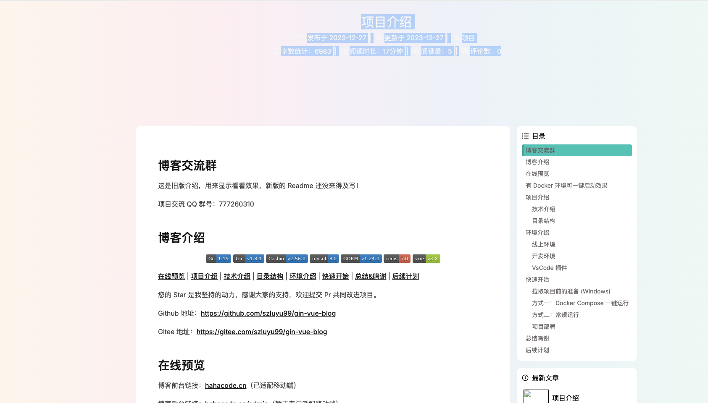

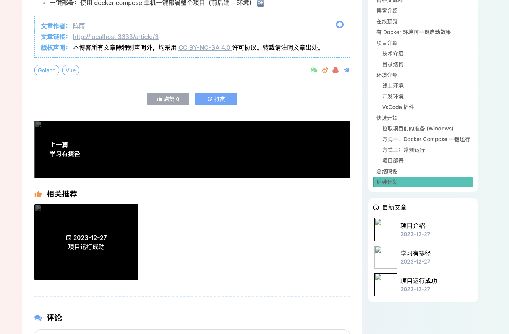

对于文章详情界面的整体分析，可以分为如下几个子组件，我们需要逐步进行构建：

**1. `BannerInfo`**

- **功能**：显示页面顶部的横幅信息。
- **用途**：通常用于文章详情页或分类页的顶部，提供页面的上下文信息，如标题、副标题、背景图片等。

**2. `Copyright`**

- **功能**：显示版权信息。
- **用途**：通常用于页面底部，显示版权相关的法律信息，如版权声明、版权所有者、年份等。

**3. `LatestList`**

- **功能**：显示最新的文章列表或动态内容。
- **用途**：通常用于首页或侧边栏，展示最近发布的文章或动态，吸引用户关注最新内容。

**4. `Reward`**

- **功能**：显示打赏或赞赏功能。
- **用途**：通常用于文章详情页，提供用户支持作者的方式，如通过支付平台打赏。

**5. `Forward`**

- **功能**：显示分享或转发功能。
- **用途**：通常用于文章详情页或动态内容页，允许用户将内容分享到社交媒体或其他平台，增加内容的传播范围。

**6. `LastNext`**

- **功能**：显示上一篇和下一篇的导航链接。
- **用途**：通常用于文章详情页，方便用户快速浏览相关文章，提高阅读连贯性。

**7. `Recommend`**

- **功能**：显示推荐内容。
- **用途**：通常用于侧边栏或文章详情页，推荐相关内容，如推荐文章、推荐作者等，以提高用户参与度和发现更多感兴趣的内容。

**8. `Catalogue`**

- **功能**：显示文章目录或章节列表。
- **用途**：通常用于长篇文章或小说章节页，提供目录导航，方便用户快速跳转到文章的不同部分，提升阅读体验。

**9. `AppFooter`**

- **功能**：显示应用的全局底部导航或页脚信息。
- **用途**：通常用于页面底部，提供全局导航、版权信息、联系方式等，增强页面的整体性和用户体验。

**10. `Comment`**

- **功能**：显示评论功能。
- **用途**：通常用于文章详情页或动态内容页，允许用户发表评论和回复，促进用户之间的互动和讨论。


### 5.1.2 BannerInfo

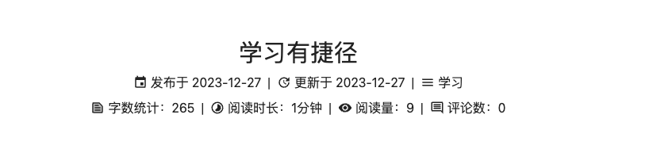

这段代码实现了一个文章详情页的布局，根据屏幕大小（PC 端和移动端）显示不同的布局样式。它展示了文章的标题、发布日期、更新日期、分类、标签、字数统计、阅读时长、阅读量和评论数等信息。以下是代码的详细解析和作用说明：

1. **PC 端显示**
   - 使用 `hidden lg:block` 隐藏在移动端，仅在 PC 端显示。
   - 显示文章的标题、发布日期、更新日期、分类、字数统计、阅读时长、阅读量和评论数。
   - 使用 `RouterLink` 为分类和标签生成路由链接。
2. **移动端显示**
   - 使用 `block lg:hidden` 隐藏在 PC 端，仅在移动端显示。
   - 显示文章的标题、发布日期、更新日期、分类和标签。
   - 使用 `RouterLink` 为分类和标签生成路由链接。
   - 标签使用 `v-for` 遍历 `article.tags`，为每个标签生成一个路由链接。

src/views/article/detail/components/BannerInfo.vue

```vue
<script setup>
import { onMounted, ref } from 'vue'
import { RouterLink } from 'vue-router'
import dayjs from 'dayjs'

const { article } = defineProps({
  article: {},
})

const wordNum = ref(0) // 字数统计
const readTime = ref('') // 阅读时间

onMounted(() => {
  // 统计字数
  wordNum.value = deleteHTMLTag(article.content).length
  // 计算阅读时间
  readTime.value = `${Math.round(wordNum.value / 400)}分钟`
})

// 删除 HTML 标签
function deleteHTMLTag(str) {
  return str
    .replace(/<\/?[^>]*>/g, '')
    .replace(/[|]*\n/, '')
    .replace(/&npsp;/gi, '')
}

function formatDate(date) {
  return dayjs(date).format('YYYY-MM-DD')
}
</script>

<template>
  <!-- PC 端显示 -->
  <div class="mx-4 mt-12 hidden text-center text-light lg:block">
    <h1 class="text-3xl">
      {{ article.title }}
    </h1>
    <p class="f-c-c py-2">
      <span class="i-mdi:calendar mr-1 text-lg" /> 发布于 {{ formatDate(article.created_at) }}
      <span class="px-2">|</span>
      <span class="i-mdi:update mr-1 text-lg" /> 更新于 {{ formatDate(article.updated_at) }}
      <span class="px-2">|</span>
      <RouterLink :to="`/categories/${article.category?.id}?name=${article.category?.name}`" class="f-c-c">
        <span class="i-material-symbols:menu mr-1 text-lg" /> {{ article.category?.name }}
      </RouterLink>
    </p>
    <div class="f-c-c">
      <span class="i-ic:twotone-text-snippet mr-1 text-lg" /> 字数统计：{{ wordNum }}
      <span class="px-2">|</span>
      <span class="i-mdi:timelapse mr-1 text-lg" /> 阅读时长：{{ readTime }}
      <span class="px-2">|</span>
      <span class="i-mdi:eye mr-1 text-lg" /> 阅读量：{{ article.view_count }}
      <span class="px-2">|</span>
      <span class="i-ic:outline-insert-comment mr-1 text-lg" /> 评论数：{{ article.comment_count }}
    </div>
  </div>
  <!-- 移动端显示 -->
  <div class="mx-4 mt-12 block text-left text-light lg:hidden space-y-1.5">
    <h1 class="text-2xl">
      {{ article.title }}
    </h1>
    <div class="mb-1 mt-2 flex flex-wrap items-center lg:justify-center">
      <span class="i-mdi:calendar mr-1" /> 发布于 {{ formatDate(article.created_at) }}
      <span class="px-2">|</span>
      <span class="i-mdi:update mr-1" /> 更新于 {{ formatDate(article.updated_at) }}
    </div>
    <div class="flex gap-2">
      <div class="f-c-c">
        <RouterLink :to="`/categories/${article.category?.id}?name=${article.category?.name}`">
          <span class="i-material-symbols:menu mr-1" /> {{ article.category?.name }}
        </RouterLink>
      </div>
      <RouterLink v-for="tag of article.tags" :key="tag.id" :to="`/tags/${tag.id}?name=${tag.name}`">
        <span class="border-1px border-blue rounded-xl px-2 py-1 text-sm text-white"> {{ tag.name }} </span>
      </RouterLink>
    </div>
    <div>
      <span class="i-ic:twotone-text-snippet mr-1" /> 字数统计：{{ wordNum }}
      <span class="px-2">|</span>
      <span class="i-mdi:timelapse mr-1" /> 阅读时长：{{ readTime }}
    </div>
    <div>
      <span class="i-mdi:eye mr-1" /> 阅读量：{{ article.view_count }}
      <span class="px-2">|</span>
      <span class="i-ic:outline-insert-comment mr-1" /> 评论数：{{ article.comment_count }}
    </div>
  </div>
</template>

```

src/views/article/detail/index.vue

```vue
<template>
    <!-- 头部 -->
    <div :style="styleVal" class="banner-fade-down absolute inset-x-0 top-0 h-[360px] f-c-c lg:h-[400px]">
        <BannerInfo v-if="!loading" :article="data" />
    </div>
</template>

<script setup>
import { computed, nextTick, onMounted, ref } from 'vue'
import { useRoute } from 'vue-router'
import { marked } from 'marked'
import { convertImgUrl } from '@/utils'
import api from '@/api'

import BannerInfo from './components/BannerInfo.vue'


const route = useRoute()

// 文章内容
const previewRef = ref(null)
const loading = ref(true)

// 文章数据
const data = ref({
  id: 0,
  title: '',
  content: '',
  created_at: '',
  updated_at: '',
  like_count: 0,
  view_count: 0,
  comment_count: 0,
  img: '',
  newest_articles: [],
  tags: [],
  category: {},
  next_article: {},
  last_article: {},
  recommend_articles: [],
})

// 加载文章
onMounted(async () => {
  try {
    const resp = await api.getArticleDetail(route.params.id)
    data.value = resp.data
    // marked 解析 markdown 文本
    data.value.content = await marked.parse(resp.data.content, { async: true })
    await nextTick()
    // highlight.js 代码高亮
    document.querySelectorAll('pre code').forEach(el => hljs.highlightElement(el))
    // MathJax 渲染公式
    // window.MathJax.typeset()
  }
  catch (err) {
    console.error(err)
  }
  finally {
    loading.value = false
  }
})
</script>

<style lang="scss" scoped></style>
```


### 5.1.3 CoryRight

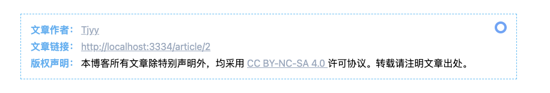

- 显示文章作者的名称和链接。
- 显示当前文章的链接。
- 显示版权声明，包括许可协议和转载要求

```
 <div class="card-view col-span-12 mx-2 pt-7 lg:col-span-9 lg:mx-0">

1. card-view
自定义类名：card-view 是一个自定义类名，可能在项目的样式文件中定义了具体的样式。通常用于定义卡片的背景、边框、阴影等样式。
2. col-span-12
网格布局：col-span-12 是 Tailwind CSS 的类名，用于定义网格布局中的列跨度。这里表示该元素在网格布局中占据 12 列，即占据整个行宽。
应用场景：在移动端或小屏幕设备上，通常希望卡片占据整个屏幕宽度。
3. mx-2
外边距：mx-2 是 Tailwind CSS 的类名，表示水平外边距（margin-left 和 margin-right）为 2 的单位值（默认为 rem 或 px，具体取决于 Tailwind CSS 的配置）。
应用场景：在移动端或小屏幕设备上，为卡片添加一些水平外边距，使其不会紧贴屏幕边缘。
4. pt-7
内边距：pt-7 是 Tailwind CSS 的类名，表示顶部内边距（padding-top）为 7 的单位值。
应用场景：为卡片的顶部添加一些内边距，使内容不会紧贴卡片顶部。
5. lg:col-span-9
响应式布局：lg:col-span-9 是 Tailwind CSS 的响应式类名，表示在大屏幕（lg）设备上，该元素的列跨度为 9 列。
应用场景：在大屏幕设备上，希望卡片占据网格布局中的 9 列，而不是整个行宽，从而实现更灵活的布局。
6. lg:mx-0
响应式外边距：lg:mx-0 是 Tailwind CSS 的响应式类名，表示在大屏幕（lg）设备上，水平外边距（margin-left 和 margin-right）为 0。
应用场景：在大屏幕设备上，希望卡片的水平外边距为 0，使其更接近其他元素或容器的边缘。
```

```vue
<template>
    <!-- 头部 -->
    <div :style="styleVal" class="banner-fade-down absolute inset-x-0 top-0 h-[360px] f-c-c lg:h-[400px]">
        <BannerInfo v-if="!loading" :article="data" />
    </div>

    <!-- 主体内容 -->
    <main class="flex-1">
        <div class="card-fade-up grid grid-cols-12 mx-auto mb-3 mt-[380px] gap-4 px-1 lg:mt-[440px] lg:max-w-[1200px]">
            <!-- 文章主体 -->
            <div class="card-view col-span-12 mx-2 pt-7 lg:col-span-9 lg:mx-0">
                <!-- 版权声明 -->
                <Copyright class="my-5 lg:mx-5" />
            </div>

        </div>
    </main>
</template>
```

```vue
<template>
    <div class="border-1 border-lightblue border-dashed px-4 py-3 leading-7">
        <!-- TODO: 点击复制 -->
        <div class="relative">
            <div class="absolute right-0 top-0 h-5 w-5 border-4px border-blue rounded-full bg-white" />
            <span class="font-bold color-#49b1f5"> 文章作者： </span>
            <RouterLink to="/" class="color-#99a9bf !underline">
                {{ blogConfig.website_author }}
            </RouterLink>
        </div>
        <div>
            <span class="font-bold color-#49b1f5"> 文章链接： </span>
            <a :href="articleHref" class="color-#99a9bf !underline">
                {{ articleHref }}
            </a>
        </div>
        <div>
            <span class="font-bold color-#49b1f5"> 版权声明： </span>
            <span>
                本博客所有文章除特别声明外，均采用
                <a href="https://creativecommons.org/licenses/by-nc-sa/4.0/" target="_blank"
                    class="color-#99a9bf !underline">
                    CC BY-NC-SA 4.0
                </a>
                许可协议。转载请注明文章出处。
            </span>
        </div>
    </div>
</template>

<script setup>
import { storeToRefs } from 'pinia'
import { useAppStore } from '@/store'
const { blogConfig } = storeToRefs(useAppStore())
const articleHref = window.location.href
</script>

<style lang="scss" scoped></style>
```


### 5.1.4 LatestList

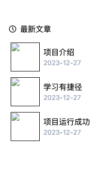

这段代码实现了一个显示最新文章列表的组件，具体功能如下：

1. **标题**：
   - 显示“最新文章”标题，带有一个图标。
2. **文章列表**：
   - 动态生成文章列表，每篇文章显示图片、标题和发布日期。
   - 使用 `RouterLink` 为每篇文章生成一个路由链接，点击时跳转到文章详情页。
3. **动画效果**：
   - 使用 `<Transition>` 组件为整个卡片视图添加 `slide-fade` 动画效果，使组件在挂载时和切换时具有平滑的过渡效果。

**示例效果**

- 组件挂载时，卡片视图会从右侧滑入并逐渐显示。
- 文章列表显示每篇文章的图片、标题和发布日期。
- 点击文章标题时，跳转到文章详情页。

```vue
<template>
    <Transition name="slide-fade" appear>
        <div class="card-view space-y-3">
            <div class="flex items-center">
                <span class="i-akar-icons:clock" />
                <span class="ml-2"> 最新文章 </span>
            </div>
            <ul class="space-y-1">
                <li v-for="item of articleList" :key="item.title" class="p-1 hover:bg-gray-200">
                    <RouterLink :to="`/article/${item.id}`" class="border-b-1 border-dashed last:border-none">
                        <div class="flex items-center">
                            
                            <div class="flex-1 overflow-hidden break-all pl-2">
                                <p> {{ item.title }} </p>
                                <p class="text-sm text-blueGray">
                                    {{ dayjs(item.created_at).format('YYYY-MM-DD') }}
                                </p>
                            </div>
                        </div>
                    </RouterLink>
                </li>
            </ul>
        </div>
    </Transition>
</template>

<script setup>
import dayjs from 'dayjs'
import { convertImgUrl } from '@/utils'

const { articleList } = defineProps({
    articleList: Array,
})
</script>

<style lang="scss" scoped></style>
```


### 5.1.5 Reward

首先要看下面这一段监听点赞数目的代码：

```javascript
const { articleId, likeCount } = defineProps({
  articleId: Number,
  likeCount: Number,
})

const [userStore, appStore] = [useUserStore(), useAppStore()]

// 点赞数量
const count = ref(likeCount)
// * 监听父组件传来的 likeCount, 不能直接用 props 中的值初始化 ref 变量
watch(() => likeCount, newVal => count.value = newVal)
```

在这段代码中，监听 `likeCount` 的作用是确保 `count` 这个响应式变量始终与父组件传递的 `likeCount` 保持同步。以下是详细的解析和解释：

- 使用 `watch` 监听 `likeCount` 的变化。
- 当 `likeCount` 的值发生变化时，`watch` 的回调函数会被触发，将 `count.value` 更新为新的值 `newVal`。

**监听 `likeCount` 的作用是确保 `count` 这个响应式变量始终与父组件传递的 `likeCount` 保持同步。具体来说：**

- `props` 是响应式的，但 `ref` 的初始值在组件初始化时只设置一次。如果 `likeCount` 的值在组件初始化后发生变化，`count` 的值不会自动更新。
- 通过 `watch`，可以确保 `count` 的值在 `likeCount` 发生变化时被更新。

> 假设父组件传递的 `likeCount` 值为 10，然后在某个操作后，父组件将 `likeCount` 更新为 20。如果没有 `watch`，`count` 的值将始终保持为 10，不会更新为 20。通过 `watch`，`count` 的值会自动更新为 20，确保组件内部的 `count` 始终与父组件传递的 `likeCount` 保持一致。

------

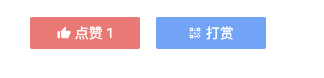

这段代码实现了一个包含点赞和打赏功能的组件。它通过监听父组件传递的点赞数量（`likeCount`），动态更新点赞按钮的状态，并提供了点赞和打赏的交互功能。以下是代码的详细解析和作用说明：

1. **点赞功能**
   - `likeArticle` 方法：
     - 检查用户是否登录，如果未登录，提示用户登录。
     - 调用后端接口 `api.saveLikeArticle`，保存点赞状态。
     - 根据用户是否已经点赞，更新 `count` 的值，并提示用户操作结果。
     - 维护全局状态中的点赞集合 `userStore.articleLikeSet`。
2. **打赏功能**
   - `rewardArticle` 方法：
     - 提示用户暂时不支持打赏功能。

```vue
<template>
    <div class="f-c-c color-#fff space-x-4">
        <button class="w-[110px] f-c-c rounded-sm py-1.5 text-sm" :class="isLike ? 'bg-red' : 'bg-gray'"
            @click="likeArticle">
            <span class="i-mdi:thumb-up mr-1" /> 点赞 {{ count }}
        </button>
        <button class="w-[110px] f-c-c rounded-sm bg-blue py-1.5 text-sm" @click="rewardArticle">
            <span class="i-mdi:qrcode mr-1" /> 打赏
        </button>
    </div>
</template>


<script setup>
import { computed, ref, watch } from 'vue'
import { useAppStore, useUserStore } from '@/store'
import api from '@/api'

const { articleId, likeCount } = defineProps({
  articleId: Number,
  likeCount: Number,

})

const [userStore, appStore] = [useUserStore(), useAppStore()]

// 点赞数量
const count = ref(likeCount)
// * 监听父组件传来的 likeCount, 不能直接用 props 中的值初始化 ref 变量
watch(() => likeCount, newVal => count.value = newVal)


async function likeArticle() {
  // 判断是否登录
  if (!userStore.userId) {
    appStore.setLoginFlag(true)
    return
  }
  try {
    await api.saveLikeArticle(articleId)
    // 判断是否点赞
    if (userStore.articleLikeSet.includes(articleId)) {
      count.value--
      window.$message?.info('已取消')
    }
    else {
      count.value++
      window.$message?.success('已点赞')
    }
    // 维护全局状态中的点赞 Set
    userStore.articleLike(articleId)
  }
  catch (err) {
    console.error(err)
  }
}

// 判断当前用户是否点赞过该文章
const isLike = computed(() => userStore.articleLikeSet.includes(articleId))

function rewardArticle() {
  window.$message?.info('暂时不支持打赏功能')
}
</script>

<style lang="scss" scoped></style>
```


### 5.1.6 Forward

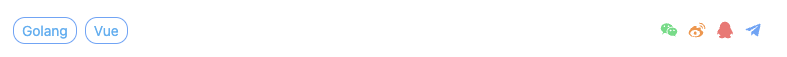

这段代码实现了一个包含标签列表和分享功能的组件，具体功能如下：

1. **标签列表**：
   - 动态生成标签列表，每个标签显示为一个可点击的链接，点击时跳转到对应的标签页面。
   - 标签的样式包括边框、圆角、内边距、字体大小和颜色。
2. **分享功能**：
   - 提供一组分享图标，点击时提示用户暂时不支持分享功能。

```vue
<template>
    <div class="flex items-center justify-between">
        <div class="space-x-2">
            <RouterLink v-for="tag of tagList" :key="tag.id" :to="`/tags/${tag.id}?name=${tag.name}`">
                <span class="border-1px border-blue rounded-xl px-2 py-1 text-xs color-#49b1f5 lg:text-sm">
                    {{ tag.name }}
                </span>
            </RouterLink>
        </div>

        <div class="flex justify-between text-xl space-x-2" @click="share">
            <span class="i-mdi:wechat cursor-pointer text-green" />
            <span class="i-mdi:sina-weibo cursor-pointer text-orange" />
            <span class="i-mdi:qqchat cursor-pointer text-red" />
            <span class="i-mdi:telegram cursor-pointer text-blue" />
        </div>
    </div>
</template>

<script setup>
const { tagList } = defineProps({
    tagList: {
        type: Array,
        default: () => [],
    },
})

function share() {
    window.$message?.info('暂时不支持分享功能')
}
</script>

<style lang="scss" scoped></style>
```


### 5.1.7 LastNext 


1. **外层容器**
   - 使用 `div` 包裹整个内容，设置样式和布局。
   - `flex flex-wrap`：使用 Flexbox 布局，允许子元素换行。
   - `bg-#000 text-white`：设置背景颜色为黑色，字体颜色为白色。
   - `lg:flex-nowrap`：在大屏幕设备上，子元素不会换行。
2. **上一篇文章**
   - 使用 `v-if="lastArticle.id"` 检查是否有上一篇文章。
   - 使用 `RouterLink` 为上一篇文章生成路由链接，点击时跳转到上一篇文章的详情页。
   - 使用 `img` 标签显示上一篇文章的图片，图片路径通过 `convertImgUrl` 函数转换。
   - 使用 `absolute` 定位和 `top-1/2`、`-translate-y-1/2` 实现垂直居中。
   - 使用 `group-hover` 类实现悬停效果，放大图片并增加透明度。
3. **下一篇文章**
   - 使用 `v-if="nextArticle.id"` 检查是否有下一篇文章。
   - 使用 `RouterLink` 为下一篇文章生成路由链接，点击时跳转到下一篇文章的详情页。
   - 使用 `img` 标签显示下一篇文章的图片，图片路径通过 `convertImgUrl` 函数转换。
   - 使用 `absolute` 定位和 `top-1/2`、`-translate-y-1/2` 实现垂直居中。
   - 使用 `group-hover` 类实现悬停效果，放大图片并增加透明度。

```vue
<template>
    <div class="flex flex-wrap bg-#000 text-white lg:flex-nowrap">
        <div v-if="lastArticle.id" class="group relative h-[150px] w-full overflow-hidden">
            <RouterLink :to="`/article/${lastArticle.id}`">
                
                <!-- top:50%; translateY: -50%; 实现绝对定位中的垂直居中 -->
                <div class="absolute top-1/2 w-full px-10 text-left leading-6 -translate-y-1/2">
                    <p> 上一篇 </p>
                    <p> {{ lastArticle.title }} </p>
                </div>
            </RouterLink>
        </div>
        <div v-if="nextArticle.id" class="group relative h-[150px] w-full overflow-hidden">
            <RouterLink :to="`/article/${nextArticle.id}`">
                
                <div class="absolute top-1/2 w-full px-10 text-right leading-6 -translate-y-1/2">
                    <p> 下一篇 </p>
                    <p> {{ nextArticle.title }} </p>
                </div>
            </RouterLink>
        </div>
    </div>
</template>

<script setup>
import { convertImgUrl } from '@/utils'

const { lastArticle, nextArticle } = defineProps({
    lastArticle: {},
    nextArticle: {},
})
</script>

<style lang="scss" scoped></style>
```


### 5.1.8 Recommend

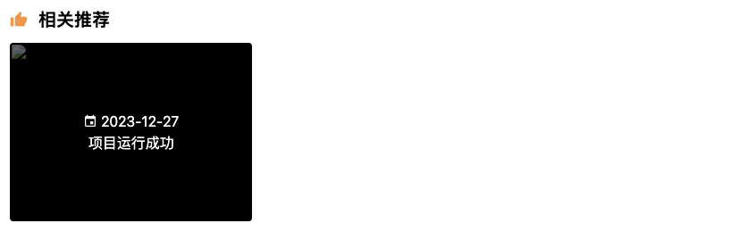

这段代码实现了一个显示相关推荐文章的组件，具体功能如下：

1. **标题**：
   - 显示“相关推荐”标题，带有一个图标。
2. **推荐文章列表**：
   - 动态生成推荐文章列表，每篇文章显示图片、发布日期和标题。
   - 点击图片或标题时跳转到文章详情页。
   - 悬停时放大图片并增加透明度。

**示例效果**

- 显示“相关推荐”标题。
- 动态生成推荐文章列表，每篇文章显示图片、发布日期和标题。
- 点击图片或标题时跳转到文章详情页。
- 悬停时图片放大并增加透明度。

```vue
<template>
    <div v-if="recommendList.length" class="space-y-3">
        <p class="flex items-center text-xl font-bold">
            <span class="i-mdi:thumb-up mr-3 text-orange" /> 相关推荐
        </p>
        <div class="grid grid-cols-12 gap-1.5">
            <div v-for="item of recommendList" :key="item.id" class="group col-span-12 lg:col-span-4">
                <RouterLink :to="`/article/${item.id}`">
                    <div class="relative h-[150px] f-c-c overflow-hidden rounded bg-black lg:h-[200px]">
                        
                        <div class="absolute text-center text-white">
                            <p class="f-c-c">
                                <span class="i-mdi:calendar mr-1" /> {{ dayjs(item.created_at).format('YYYY-MM-DD') }}
                            </p>
                            <p> {{ item.title }} </p>
                        </div>
                    </div>
                </RouterLink>
            </div>
        </div>
    </div>
</template>

<script setup>
import dayjs from 'dayjs'
import { convertImgUrl } from '@/utils'

defineProps({
    recommendList: Array,
})
</script>

<style lang="scss" scoped></style>
```


### 5.1.9 Article-Content

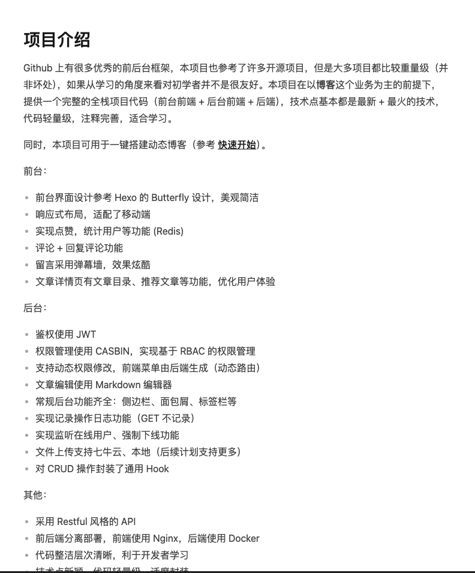

1. **`<article>` 标签**
   - 使用 `<article>` 标签包裹文章内容，这是一个语义化的 HTML5 标签，表示独立的、与上下文无关的内容。
2. **`ref="previewRef"`**
   - 使用 `ref` 属性为 `<article>` 标签创建一个引用，名称为 `previewRef`。这允许你在 Vue 的脚本部分通过 `this.$refs.previewRef` 或 `ref` 的值访问这个 DOM 元素。
3. **`class="max-w-none prose prose-truegray lg:mx-10"`**
   - **`max-w-none`**：Tailwind CSS 类，表示最大宽度为 `none`，即没有最大宽度限制。
   - **`prose`**：Tailwind CSS 的 `prose` 插件类，用于美化文章内容的排版。
   - **`prose-truegray`**：Tailwind CSS 的 `prose` 插件类，用于设置文章内容的配色方案为 `truegray`。
   - **`lg:mx-10`**：Tailwind CSS 的响应式类，表示在大屏幕（`lg`）设备上，左右外边距为 `10` 的单位值。
4. **`v-html="data.content"`**
   - 使用 `v-html` 指令将 `data.content` 的值作为 HTML 内容动态绑定到 `<article>` 标签中。`data.content` 应该是一个字符串，包含 HTML 格式的文章内容。

```vue
 <!-- 文章内容 -->
        <article
          ref="previewRef"
          class="max-w-none prose prose-truegray lg:mx-10"
          v-html="data.content"
        />
```

1. **准备文章内容**
   - 确保 `data.content` 包含要渲染的文章内容，内容可以是任何有效的 HTML 字符串。
2. **动态绑定内容**
   - 使用 `v-html` 指令将 `data.content` 绑定到 `<article>` 标签中。
3. **访问 DOM 元素**
   - 如果需要访问 `<article>` 标签的 DOM 元素，可以通过 `ref` 引用获取。例如：

```typescript
const previewRef = ref(null);
onMounted(() => {
  console.log(previewRef); // 访问 DOM 元素
});
```

> DOM 将 HTML 文档表示为一个树形结构，其中每个节点代表文档中的一个元素、属性或文本。例如，HTML 文档的结构可以表示为：
>
> ```html
> <!DOCTYPE html>
> <html>
>   <head>
>     <title>示例页面</title>
>   </head>
>   <body>
>     <h1>欢迎来到我的页面</h1>
>     <p>这是一个段落。</p>
>   </body>
> </html>
> ```

> 在 DOM 中，这个 HTML 文档可以表示为以下树形结构：
>
> ```
> Document
>   ├── html
>   │   ├── head
>   │   │   └── title
>   │   │       └── "示例页面"
>   │   └── body
>   │       ├── h1
>   │       │   └── "欢迎来到我的页面"
>   │       └── p
>   │           └── "这是一个段落。"
> ```
>
> DOM 中的每个节点可以是以下类型之一：
>
> - **元素节点**：代表 HTML 元素，如 `<html>`、`<head>`、`<body>`、`<h1>` 等。
> - **属性节点**：代表元素的属性，如 `id`、`class` 等。
> - **文本节点**：代表元素中的文本内容。
> - **注释节点**：代表 HTML 注释。
> - **文档节点**：代表整个文档。
>
> 你可以使用 JavaScript 提供的 API 来获取 DOM 元素。常见的方法包括：
>
> - **`document.getElementById(id)`**：通过 ID 获取元素。
> - **`document.querySelector(selector)`**：通过 CSS 选择器获取第一个匹配的元素。
> - **`document.querySelectorAll(selector)`**：通过 CSS 选择器获取所有匹配的元素。

**除此之外：**

- 动态渲染文章内容，支持 HTML 格式。
- 在大屏幕设备上，文章内容有左右外边距。
- 文章内容的排版被美化，符合 `prose` 插件的样式。


### 5.1.10 Catalogue

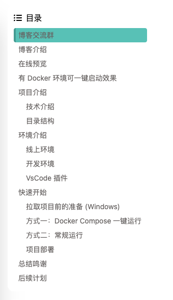

这段代码实现了一个带有动画效果的目录导航组件，具体功能如下：

1. **动态生成目录**：
   - 动态生成文章的目录，包括标题的层级和链接。
   - 为每个标题生成唯一的 `id`，避免重复。
2. **平滑滚动到指定锚点**：
   - 点击目录项时，平滑滚动到对应标题的位置。
3. **高亮当前标题**：
   - 根据当前滚动位置，动态更新当前高亮的目录项。
4. **动画效果**：
   - 使用 `<Transition>` 组件为整个目录组件添加 `slide-fade` 动画效果，使组件在挂载时和切换时具有平滑的过渡效果。

**示例效果**

- 显示“目录”标题。
- 动态生成目录列表，每个目录项点击时滚动到对应标题的位置。
- 滚动页面时，目录项会根据当前滚动位置动态高亮。

```vue
<template>
    <Transition name="slide-fade" appear>
        <div class="card-view space-y-2">
            <div class="flex items-center">
                <span class="i-fa-solid:list-ul" />
                <span class="ml-2">目录</span>
            </div>
            <ul>
                <li v-for="anchor of anchors" :key="anchor.id">
                    <div class="cursor-pointer border-l-4 border-transparent rounded py-1 text-sm color-#666261 hover:bg-#00c4b6 hover:bg-opacity-30"
                        :class="anchor.id === selectAnchor && 'bg-#00c4b6 text-white border-l-#009d92'"
                        :style="{ paddingLeft: `${5 + anchor.indent * 15}px` }" @click="handleClickAnchor(anchor.id)">
                        {{ anchor.name }}
                    </div>
                </li>
            </ul>
        </div>
    </Transition>
</template>


<script setup>
import { onMounted, ref } from 'vue' // 引入 Vue 的生命周期钩子和响应式引用
import { useWindowScroll, watchThrottled } from '@vueuse/core' // 引入窗口滚动钩子和节流函数

// 接收父组件传递的 previewRef 属性，这个属性是一个 DOM 元素引用
const { previewRef } = defineProps({
    previewRef: { type: Object, required: true, },
})

onMounted(() => {
    buildAnchors() // 在组件挂载完成后调用 buildAnchors 方法来生成目录锚点
})

// 定义响应式变量
const selectAnchor = ref('') // 当前选中的目录项的 id
const anchors = ref([]) // 存储所有的锚点信息
const headings = Array.from(previewRef.querySelectorAll('h1,h2,h3,h4,h5,h6')) // 获取所有标题元素（h1-h6）

// 生成目录的锚点
function buildAnchors() {
    // 筛选出文本非空的标题
    const titleList = Array.from(headings).filter(t => !!t.innerText.trim())
    // 获取所有标题的标签名（h1、h2、h3 等），并去重排序
    const hTags = Array.from(new Set(titleList.map(t => t.tagName))).sort()

    let count = 0 // 用于生成唯一的 ID，避免同名标题冲突
    for (let i = 0; i < headings.length; i++) {
        const anchor = headings[i].textContent.trim() // 获取标题文本内容
        // 给每个标题生成一个唯一的 ID，防止重名，在 ID 后加上序号
        headings[i].id = `${anchor}-${count++}`
        // 将每个标题的锚点信息（ID、名称、层级）保存到 anchors 数组中
        anchors.value.push({
            id: headings[i].id,
            name: headings[i].innerText,
            indent: hTags.indexOf(headings[i].tagName), // 根据标签类型确定标题的层级
        })
    }
}

// 处理点击目录项时的平滑滚动
function handleClickAnchor(id) {
    const anchorElement = document.getElementById(id) // 获取目标标题的 DOM 元素
    window.scrollTo({
        behavior: 'smooth', // 启用平滑滚动
        top: anchorElement.offsetTop - 40, // 滚动到目标标题的位置，并留出 40px 的偏移量
    })
    // 延迟设置选中的锚点 ID，以便高亮显示
    setTimeout(() => selectAnchor.value = id, 600)
}

// 实现目录高亮当前滚动位置对应的标题
// 思路是通过滚动条的位置，循环检测每个标题距离顶部的距离，判断当前应该高亮哪个标题
const { y } = useWindowScroll() // 获取当前的滚动位置
watchThrottled(y, () => {
    anchors.value.forEach((e) => {
        const value = headings.find(ee => ee.id === e.id) // 查找当前锚点对应的标题
        if (value && y.value >= value.offsetTop - 50) { // 如果滚动位置大于标题的顶部偏移量，并且小于标题的底部
            selectAnchor.value = value.id // 设置当前选中的锚点 ID
        }
    })
}, { throttle: 200 }) // 设定滚动事件的节流时间，避免高频触发
</script>


<style lang="scss" scoped></style>
```


### 5.1.11 Comment

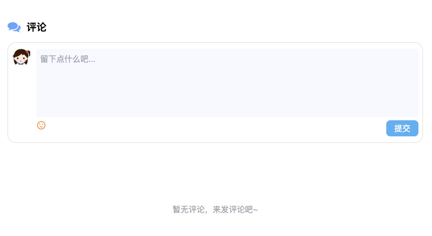

**src/components/comment/CommentField.vue**

这段代码实现了一个评论框组件，具体功能如下：

1. **显示评论框**：
   - 根据 `show` 的值决定是否显示评论框。
2. **用户头像**：
   - 显示用户头像。
3. **评论输入框**：
   - 提供评论输入框，支持动态提示文本。
4. **操作按钮**：
   - 提供表情选择按钮（功能正在开发中）。
   - 提供取消按钮（如果是在回复模式下）。
   - 提供提交按钮，提交评论。
5. **提交评论**：
   - 检查用户是否登录，检查评论内容是否为空，调用后端接口提交评论。

**示例效果**

- 显示评论框，用户可以输入评论内容。
- 提供表情选择按钮和提交按钮。
- 提交评论后，清空输入框，隐藏回复框，调用父组件的刷新方法。

```vue
<template>
    <div v-if="show" class="mt-4 flex border-1 border-color-#90939950 border-rounded-1rem border-solid p-2">
        
        <div class="my-1 ml-3 w-full">
            <textarea v-model="data.content" :placeholder="placeholderText" rows="5"
                class="w-full rounded bg-light-400 p-2 outline-none" />
            <div class="flex justify-between">
                <!-- TODO: 表情框 -->
                <span class="i-mdi:emoticon-happy-outline cursor-pointer text-xl text-orange" @click="chooseEmoji" />
                <div>
                    <span v-if="data.nickname" class="the-button mr-4 bg-bluegray hover:bg-bluegray"
                        @click="setReply(false)">
                        取消
                    </span>
                    <span class="the-button" @click="submitComment"> 提交 </span>
                </div>
            </div>
        </div>
    </div>
</template>

<script setup>
import { computed, reactive, ref } from 'vue'

import { convertImgUrl } from '@/utils'
import { useAppStore, useUserStore } from '@/store'
import api from '@/api'

const props = defineProps({
    // 评论类型 1-文章 2-友链
    type: Number,
    // 默认是否显示
    show: Boolean,
    // 主题 id
    topicId: Number,
})

const emit = defineEmits(['afterSubmit']) // 调用父方法
const [userStore, appStore] = [useUserStore(), useAppStore()]

const show = ref(props.show) // 是否显示
const data = reactive({
    nickname: '', // * 回复用户, 不为空则说明是回复框
    content: '', // 回复内容
    topic_id: props.topicId ?? 0, // 主题 id
    reply_user_id: 0, // 回复用户 id
    parent_id: 0, // 父评论 id
    type: props.type,
})

// 判断是回复还是评论: 存在 nickname 则是回复
// 如果 data.nickname 是一个非空字符串或非 null/undefined 的值，!!data.nickname 的结果是 true。
const isReply = computed(() => !!data.nickname)

// 取消评论
function setReply(flag) {
    show.value = flag
}

// 提交评论
async function submitComment() {
    // 判断是否登录
    if (!userStore.userId) {
        appStore.setLoginFlag(true)
        return
    }
    // 判断内容不为空
    if (!data.content.trim()) {
        window.$message?.error('评论内容不能为空')
        return
    }

    // TODO: 解析表情

    // 调用接口
    try {
        await api.saveComment(data)
        window.$message?.info('评论成功')
        data.content = ''

        isReply.value && setReply(false)
        emit('afterSubmit') // 提交后调用刷新方法
    }
    catch (err) {
        console.error(err)
    }
}

// TODO: 表情框
function chooseEmoji() {
    window.$message?.info('表情选择正在开发中...')
}

// 输入框提示语
const placeholderText = computed(() =>
    (data.nickname ? `回复 @${data.nickname}: ` : '留下点什么吧...'),
)

// 暴露给父组件, 可以在父组件中访问并修改
defineExpose({ data, setReply })
</script>


<style lang="scss" scoped>
textarea {
    /* background: url(https://w.wallhaven.cc/full/1p/wallhaven-1poo61.jpg) 100% 100% no-repeat; */
    background-color: ghostwhite;
    resize: none;
}
</style>
```

**src/components/comment/Paging.vue**

这段代码实现了一个分页组件，具体功能如下：

1. **显示总页数**：
   - 显示总页数，格式为“共 {{ pageTotal }} 页”。
2. **上一页按钮**：
   - 提供“上一页”按钮，点击时跳转到上一页。
3. **页码列表**：
   - 如果总页数小于 6 页，直接显示所有页码。
   - 当前页码显示为高亮样式。
4. **下一页按钮**：
   - 提供“下一页”按钮，点击时跳转到下一页。
5. **动态更新**：
   - 通过 `emit` 触发父组件的 `changeCurrent` 方法，更新当前页数。

**示例效果**

- 显示总页数。
- 提供“上一页”和“下一页”按钮。
- 显示页码列表，当前页码高亮显示。

```vue
<template>
    <!-- TODO: 优化显示 -->
    <div v-show="show" class="mb-2.5 mt-4 text-[12px]">
        <span class="mr-10"> 共 {{ pageTotal }} 页 </span>
        <!-- 上一页按钮: 第一页不显示 -->
        <a v-show="current !== 1" @click="prePage"> 上一页 </a>

        <!-- 总页数小于 6 页直接显示 -->
        <template v-if="pageTotal < 6">
            <a v-for="i of pageTotal" :key="i" class="mx-1" @click="changeCurrent(i)">
                <!-- 当前选中页数 -->
                <span v-if="isActive(i)" class="color-#00a1d6 font-bold">
                    {{ i }}
                </span>
                <span v-else> {{ i }} </span>
            </a>
        </template>

        <!-- TODO: 其他情况 -->

        <!-- 下一页按钮: 最后一页不显示 -->
        <a v-show="current !== pageTotal" @click="nextPage"> 下一页 </a>
    </div>
</template>

<script setup>
import { computed, ref } from 'vue'

const { pageTotal = 0, index, commentId } = defineProps({
    pageTotal: Number, // 总页数
    index: Number, // 索引
    commentId: Number, // 评论 id
})

const emit = defineEmits(['changeCurrent'])

const show = ref(false) // 是否显示分页

// 当前页数
const current = ref(1)
// 计算属性传参: 判断当前页数是否激活
const isActive = computed(() => i => (i === current.value))
// 上一页
function prePage() {
    current.value -= 1
    emit('changeCurrent', current.value, index, commentId)
}
// 下一页
function nextPage() {
    current.value += 1
    emit('changeCurrent', current.value, index, commentId)
}
// 跳转指定页数
function changeCurrent(i) {
    current.value = i
    emit('changeCurrent', current.value, index, commentId)
}

function setShow(flag) {
    show.value = flag
}

defineExpose({
    current,
    setShow,
})
</script>

<style lang="scss" scoped>
.active {
    color: #00a1d6;
    font-weight: bold;
}
</style>
```

------

------

**src/components/comment/Comment.vue**

这段代码是一个Vue 3组件，用于实现评论区的功能，包括加载评论、评论回复、点赞、分页等。以下是具体功能的解释：

1. **基础结构与数据管理**

- **`type`**：该组件接受一个`type`的prop，表示评论的类型，如文章、友链、说说等。
- **`topicId`**：从`vue-router`的路由参数中获取`id`，用作当前评论的主题ID。
- **`commentList`**：存储评论列表数据。
- **`commentCount`**：存储评论的总数量。
- **`listLoading`**：表示评论列表是否在加载中。
- **`params`**：用于控制加载评论的参数，如类型、页数、每页评论数等。

2. **评论加载与分页**

- **`getComments()`**：这是一个异步函数，用于获取评论数据。通过`api.getComments()`调用后端接口，加载评论列表并根据需要分页。
- **`reloadComments()`**：重新加载评论，通常是在用户提交评论之后调用，刷新评论列表。
- **`refresh`**：通过`watch`监听`commentList`的变化，确保每次数据更新时评论列表能够正确地刷新，而不会造成顺序错乱。

3. **回复功能**

- **`replyComment()`**：用户点击“回复”按钮时，会显示回复框并传递相关数据（如评论的昵称、用户ID、父评论ID等）。
- **`reloadReplies()`**：提交回复后会调用该函数，重新加载某个评论的回复数据，并更新该评论的回复列表。
- **`checkReplies()`**：点击“查看更多”按钮时，加载更多回复并更新显示。
- **`changeReplyCurrent()`**：分页显示评论的回复时，用于切换当前页并重新加载对应页的回复。

4. **点赞功能**

- **`likeComment()`**：用户点击“点赞”按钮时，会判断用户是否已经点赞过该评论。如果已经点赞，会取消点赞并更新点赞数；如果没有点赞，则增加点赞数并更新状态。
- **`isLike()`**：计算属性，用于判断当前用户是否点赞过某个评论。

5. **评论回复分页**

- **`Paging`**：该组件用于显示评论回复的分页器。每个评论的回复如果超过5条，则会显示分页控件，可以点击加载更多回复。
- **`checkRefs`** 和 **`pageRefs`**：分别用于控制“查看更多”按钮和分页器的显示状态。

6. **使用的外部工具和组件**

- **`dayjs`**：用于格式化时间，将评论的创建时间转化为用户友好的格式。
- **`convertImgUrl`**：用于处理用户头像的图片地址。
- **`CommentField`**：一个输入框组件，用户可以在该组件中输入评论或回复内容。
- **`ULoading`**：加载动画组件，用于评论列表加载时显示加载状态。
- **`useAppStore`** 和 **`useUserStore`**：从全局状态中获取应用和用户信息（例如用户ID、点赞状态等）。

7. **错误处理和消息提示**

- **`window.$message?.info()`** 和 **`window.$message?.success()`**：用于在点赞操作后给用户展示提示消息（如“已点赞”或“已取消”）。

这段代码实现了一个完整的评论区功能，包括加载评论、分页、点赞、回复等功能。用户可以查看评论、回复其他用户的评论，点赞评论，同时支持分页加载更多评论和回复。每当评论或回复提交时，都会更新评论列表，确保用户看到最新的评论数据。

```vue
<template>
    <div>
        <p class="flex items-center text-xl font-bold">
            <span class="i-fa:comments mr-3 text-blue" /> 评论
        </p>
        <!-- 评论框 -->
        <CommentField :show="true" :type="type" :topic-id="topicId" @after-submit="reloadComments" />
        <!-- 评论详情 -->
        <div v-if="commentCount && refresh">
            <!-- 评论数量 -->
            <p class="mb-4 mt-7 flex items-center text-xl font-bold">
                <span> {{ commentCount }} 评论 </span>
                <span class="i-uiw:reload ml-4 cursor-pointer text-base" :class="listLoading ? 'animate-spin' : ''"
                    @click="reloadComments" />
            </p>
            <!-- 评论列表 -->
            <div v-for="(comment, idx) of commentList" :key="comment.id" class="my-1 flex">
                
                <div class="ml-3 flex flex-1 flex-col">
                    <!-- 评论人名称: 根据是否有 website 显示不同效果 -->
                    <div>
                        <span v-if="!comment.user?.info?.website" class="text-sm">
                            {{ comment.user?.info?.nickname }}
                        </span>
                        <a v-else :href="comment.user?.info?.website" target="_blank"
                            class="color-[#1abc9c] font-500 transition-300">
                            {{ comment.user?.info?.nickname }}
                        </a>
                        <!-- TODO: 博主标记 -->
                        <!-- <span v-if="comment.user_id === 10" class="ml-2 inline-block rounded-3 bg-#ffa51e px-6 py-1 text-xs color-#fff">
                博主
              </span> -->
                    </div>
                    <!-- 楼层 + 时间 + 点赞 + 回复按钮 -->
                    <div class="flex justify-between text-sm">
                        <div class="flex items-center gap-2 py-1 color-#b3b3b3">
                            <span> {{ commentCount - idx }}楼 </span>
                            <span> {{ dayjs(comment.created_at).format('YYYY-MM-DD') }} </span>
                            <button class="i-mdi:thumb-up hover-bg-red" :class="isLike(comment.id) ? 'bg-red' : ''"
                                @click="likeComment(comment)" />
                            <span v-show="comment.like_count"> {{ comment.like_count }} </span>
                        </div>
                        <button class="color-#ef2f11" @click="replyComment(idx, comment)">
                            回复
                        </button>
                    </div>
                    <!-- 评论内容 -->
                    <div class="my-1" v-html="comment.content" />
                    <!-- 评论回复 start -->
                    <div v-for="reply of comment.reply_list" :key="reply.id" class="mt-2 flex">
                        
                        <div class="ml-2 flex flex-1 flex-col">
                            <!-- 回复人名称 -->
                            <div>
                                <!-- 根据是否有 website 显示不同效果 -->
                                <span v-if="!reply.user?.info?.website" class="text-sm">
                                    {{ reply.user?.info.nickname }}
                                </span>
                                <a v-else :href="reply.user?.info?.website" target="_blank"
                                    class="color-#1abc9c font-500 transition-300">
                                    {{ reply.user?.info.nickname }}
                                </a>
                                <!-- TODO: 博主标记 -->
                                <!-- <span v-if="reply.user_id === 10" class="ml-6 inline-block rounded-3 bg-#ffa51e px-6 py-1 text-sm color-#fff">
                    博主
                  </span> -->
                            </div>
                            <!-- 时间 + 点赞 + 回复按钮 -->
                            <div class="flex justify-between text-sm">
                                <div class="flex items-center gap-2 py-1 color-#b3b3b3">
                                    <span> {{ dayjs(reply.created_at).format('YYYY-MM-DD') }} </span>
                                    <button class="i-mdi:thumb-up hover-bg-red"
                                        :class="isLike(reply.id) ? 'bg-red' : ''" @click="likeComment(reply)" />
                                    <span v-show="reply.like_count"> {{ reply.like_count }} </span>
                                </div>
                                <button class="color-#ef2f11" @click="replyComment(idx, reply)">
                                    回复
                                </button>
                            </div>
                            <!-- 回复内容 -->
                            <div>
                                <!-- 回复用户名: 自己回复自己不显示 "@名称" -->
                                <template v-if="reply.user_id !== comment.user_id">
                                    <a v-if="reply.user?.info?.website" :href="reply.reply_website" target="_blank">
                                        @{{ reply.user?.info?.nickname }}
                                    </a>
                                    <span v-else>
                                        @{{ reply.user?.info?.nickname }}
                                    </span>，
                                </template>
                                <span class="my-3" v-html="reply.content" />
                            </div>
                        </div>
                    </div>
                    <!-- 评论回复 end -->

                    <!-- 回复数量 -->
                    <div v-show="comment.reply_count > 3" ref="checkRefs" class="mt-4 text-[13px] color-#6d757a">
                        共 <b> {{ comment.reply_count }} </b> 条回复
                        <button class="color-#00a1d6" @click="checkReplies(idx, comment)">
                            ，点击查看
                        </button>
                    </div>
                    <!-- 回复分页 -->
                    <Paging ref="pageRefs" :page-total="Math.ceil(comment.reply_count / 5)" :index="idx"
                        :comment-id="comment.id" @change-current="changeReplyCurrent" />
                    <!-- 回复框 -->
                    <CommentField ref="replyFieldRefs" :show="false" :type="type" :topic-id="topicId"
                        @after-submit="reloadReplies(idx)" />
                    <!-- 分隔线: 注意最后一个评论没有线 -->
                    <div v-if="(idx + 1) !== commentCount" class="my-2.5 h-0.5 bg-light-500" />
                </div>
            </div>
            <!-- 加载更多 -->
            <div class="m-4 f-c-c">
                <button v-if="commentCount > commentList.length && !listLoading" text @click="getComments">
                    点击加载更多...
                </button>
                <ULoading :show="listLoading" />
            </div>
        </div>
        <!-- 没有评论的提示 -->
        <div v-else class="mb-10 mt-30 text-center text-zinc">
            暂无评论，来发评论吧~
        </div>
    </div>
</template>

<script setup>
import { computed, nextTick, onMounted, reactive, ref, watch } from 'vue'
import { useRoute } from 'vue-router'
import dayjs from 'dayjs'

// import EmojiList from '@/assets/emoji'
import CommentField from './CommentFiled.vue'

// 评论 / 回复 框
import Paging from './Paging.vue'

// 分页
import ULoading from '@/components/ui/ULoading.vue'

import { convertImgUrl } from '@/utils'
import { useAppStore, useUserStore } from '@/store'
import api from '@/api'

const { type } = defineProps({
    // 评论类型: 1-文章, 2-友链, 3-说说
    type: Number,
})

const [userStore, appStore] = [useUserStore(), useAppStore()]

onMounted(() => {
    getComments()
})

// url 中存在 id 参数则为 topic_id, 否则为 0
const topicId = +(useRoute().params.id ?? 0)

// 加载评论
const commentList = ref([]) // 评论列表 (分页加载)
const commentCount = ref(0) // 评论总数量
const listLoading = ref(false) // 列表加载状态
const params = reactive({ type, page_size: 10, page_num: 1, topic_id: topicId }) // 加载评论的参数

async function getComments() {
    listLoading.value = true
    try {
        const resp = await api.getComments(params)
        console.log(resp.data.page_data)

        // * 全局加载更多, 0.8s 延时
        setTimeout(() => {
            params.page_num === 1
                ? commentList.value = resp.data.page_data
                : commentList.value.push(...resp.data.page_data)
            commentCount.value = resp.data.total
            console.log(commentCount.value)
            params.page_num++
            listLoading.value = false
        }, 800)
    }
    catch (err) {
        console.error(err)
    }
}


// 重新加载评论(提交评论以后)
function reloadComments() {
    params.page_num = 1 // 页数重置
    getComments()
}

// * 解决新增评论后刷新数据, 点击回复的顺序错乱问题
const refresh = ref(true) // 重新刷新整个评论列表
watch(commentList, () => {
    refresh.value = false
    nextTick(() => {
        refresh.value = true
    })
}, { deep: false }) // deep = false 防止 "查看更多" 时刷新整个数据


// 回复相关
// ! 可以获取 v-for 循环中的 DOM 数组
const replyFieldRefs = ref(null)
// 回复评论
function replyComment(idx, obj) {
    // 关闭所有回复框
    replyFieldRefs.value.forEach(e => e.setReply(false))
    // 打开当前点击的回复框
    const curRef = replyFieldRefs.value[idx]
    if (curRef) {
        curRef.setReply(true)
        // * 将值传给回复框
        curRef.data.nickname = obj.nickname // 用户昵称
        curRef.data.reply_user_id = obj.user_id // 回复用户 id
        curRef.data.parent_id = commentList.value[idx].id // 父评论 id
    }
}

// 提交回复后, 重新加载评论回复
const pageRefs = ref([]) // 分页
const checkRefs = ref([]) // 查看
async function reloadReplies(idx) {
    const { data } = await api.getCommentReplies(
        commentList.value[idx].id,
        { page_size: 5, page_num: pageRefs.value[idx].current },
    )
    // * 局部更新某个评论的回复
    commentList.value[idx].reply_list = data
    commentList.value[idx].reply_count++ // 数量 + 1
    // 回复大于 5 条展示评论分页
    commentList.value[idx].reply_count > 5 && (pageRefs.value[idx].setShow(true))
    // 直接隐藏查看
    checkRefs.value[idx].style.display = 'none' // * dom 操作隐藏 "查看"
}

// "点击查看" 显示更多回复
async function checkReplies(idx, obj) {
    // 查第一页 (5 条数据)
    const { data } = await api.getCommentReplies(
        obj.id,
        { page_num: 1, page_size: 5 },
    )
    // 更新对应楼评论的回复列表
    obj.reply_list = data
    // 超过 5 条数据显示分页
    obj.reply_count > 5 && (pageRefs.value[idx].setShow(true))
    // 隐藏 "点击查看"
    checkRefs.value[idx].style.display = 'none' // * dom 操作隐藏 "查看"
}

// 修改回复分页中当前页数
async function changeReplyCurrent(pageNum, idx, commentId) {
    const { data } = await api.getCommentReplies(
        commentId,
        { page_num: pageNum, page_size: 5 },
    )
    commentList.value[idx].reply_list = data
}

// TODO: 点赞
async function likeComment(comment) {
    // 判断是否登录
    if (!userStore.userId) {
        appStore.setLoginFlag(true)
        return
    }

    try {
        await api.saveLikeComment(comment.id)
        // 判断是否点赞
        if (userStore.commentLikeSet.includes(comment.id)) {
            comment.like_count--
            window.$message?.info('已取消')
        }
        else {
            comment.like_count++
            window.$message?.success('已点赞')
        }
        // 维护全局状态中的点赞 Set
        userStore.commentLike(comment.id)
    }
    catch (err) {
        console.error(err)
    }
}

// 判断当前用户是否点赞过该评论
const isLike = computed(() => id => userStore.commentLikeSet.includes(id))

</script>

<style lang="scss" scoped></style>
```


### 5.1.12 index.vue

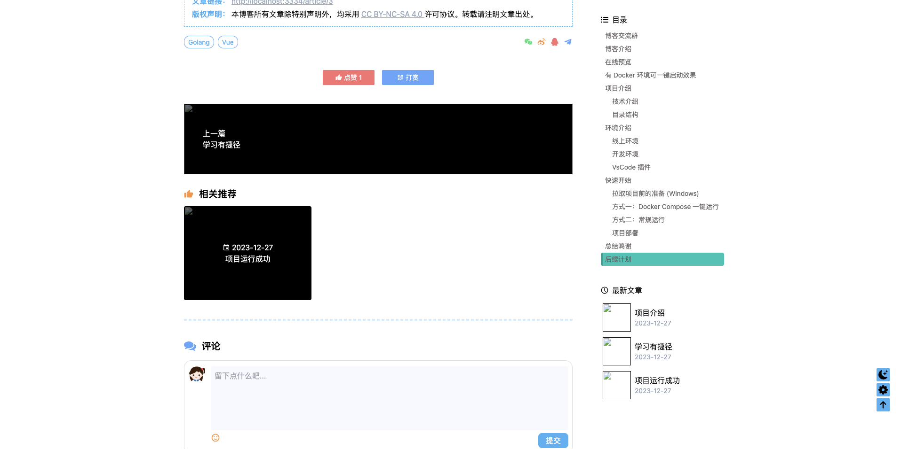

```vue
<template>
    <!-- 头部 -->
    <div :style="styleVal" class="banner-fade-down absolute inset-x-0 top-0 h-[360px] f-c-c lg:h-[400px]">
        <BannerInfo v-if="!loading" :article="data" />
    </div>

    <!-- 主体内容 -->
    <main class="flex-1">
        <div class="card-fade-up grid grid-cols-12 mx-auto mb-3 mt-[380px] gap-4 px-1 lg:mt-[440px] lg:max-w-[1200px]">
            <!-- 文章主体 -->
            <div class="card-view col-span-12 mx-2 pt-7 lg:col-span-9 lg:mx-0">
                <!-- 文章内容 -->
                <article ref="previewRef" class="max-w-none prose prose-truegray lg:mx-10" v-html="data.content" />
                <!-- 版权声明 -->
                <Copyright class="my-5 lg:mx-5" />
                <!-- 标签、转发 -->
                <Forward :tag-list="data.tags" class="mb-12 lg:mx-5" />
                <!-- 点赞、打赏 -->
                <Reward :article-id="data.id" :like-count="data.like_count" class="mb-10" />


                <!-- 上一篇、下一篇 -->
                <LastNext :last-article="data.last_article" :next-article="data.next_article" class="lg:mx-5" />
                <!-- 推荐文章 -->
                <Recommend :recommend-list="data.recommend_articles" class="mt-7 lg:mx-5" />
                <!-- 分隔线 -->
                <hr class="my-10 border-2 border-color-#d2ebfd border-dashed lg:mx-5">
                <!-- 文章评论 -->
                <Comment :type="1" class="lg:mx-5" />
            </div>

            <!-- 文章侧边栏 -->
            <div class="col-span-0 lg:col-span-3">
                <div class="sticky top-5 hidden lg:block space-y-4">
                    <!-- 目录 -->
                    <!-- TODO: v-if 的方法不太好, 想办法解决父组件接口获取数据, 子组件渲染问题 -->
                    <Catalogue v-if="!loading" :preview-ref="previewRef" />
                    <!-- 最新文章 -->
                    <LatestList :article-list="data.newest_articles" />
                </div>
            </div>

        </div>
    </main>
    <!-- 底部 -->
    <footer>
        <AppFooter />
    </footer>
</template>

<script setup>
import { computed, nextTick, onMounted, ref } from 'vue'
import { useRoute } from 'vue-router'
import { marked } from 'marked'
import { convertImgUrl } from '@/utils'
import api from '@/api'

import hljs from 'highlight.js/lib/core'
import 'highlight.js/styles/a11y-dark.css'
import go from 'highlight.js/lib/languages/go'
import json from 'highlight.js/lib/languages/json'
import javascript from 'highlight.js/lib/languages/javascript'
import bash from 'highlight.js/lib/languages/bash'

import BannerInfo from './components/BannerInfo.vue'
import Copyright from './components/Copyright.vue'
import LatestList from './components/LatestList.vue'
import Reward from './components/Reward.vue'
import Forward from './components/Forward.vue'
import LastNext from './components/LastNext.vue'
import Recommend from './components/Recommend.vue'
import Catalogue from './components/Catalogue.vue'

import AppFooter from '@/components/layout/AppFooter.vue'
import Comment from '@/components/comment/Comment.vue'

hljs.registerLanguage('go', go)
hljs.registerLanguage('bash', bash)
hljs.registerLanguage('json', json)
hljs.registerLanguage('javascript', javascript)

const route = useRoute()

// 文章内容
const previewRef = ref(null)
const loading = ref(true)

// 文章数据
const data = ref({
    id: 0,
    title: '',
    content: '',
    created_at: '',
    updated_at: '',
    like_count: 0,
    view_count: 0,
    comment_count: 0,
    img: '',
    newest_articles: [],
    tags: [],
    category: {},
    next_article: {},
    last_article: {},
    recommend_articles: [],
})

// 加载文章
onMounted(async () => {
    try {
        const resp = await api.getArticleDetail(route.params.id)
        data.value = resp.data
        // marked 解析 markdown 文本
        data.value.content = await marked.parse(resp.data.content, { async: true })
        await nextTick()
        // highlight.js 代码高亮
        document.querySelectorAll('pre code').forEach(el => hljs.highlightElement(el))
        // MathJax 渲染公式
        window.MathJax.typeset()
    }
    catch (err) {
        console.error(err)
    }
    finally {
        loading.value = false
    }
})

const styleVal = computed(() =>
    data.value.img
        ? `background: url('${convertImgUrl(data.value.img)}') center center / cover no-repeat;`
        : 'background: rgba(0,0,0,0.1) center center / cover no-repeat;',
)
</script>

<style lang="scss" scoped></style>
```


## 5.2 Album 相册

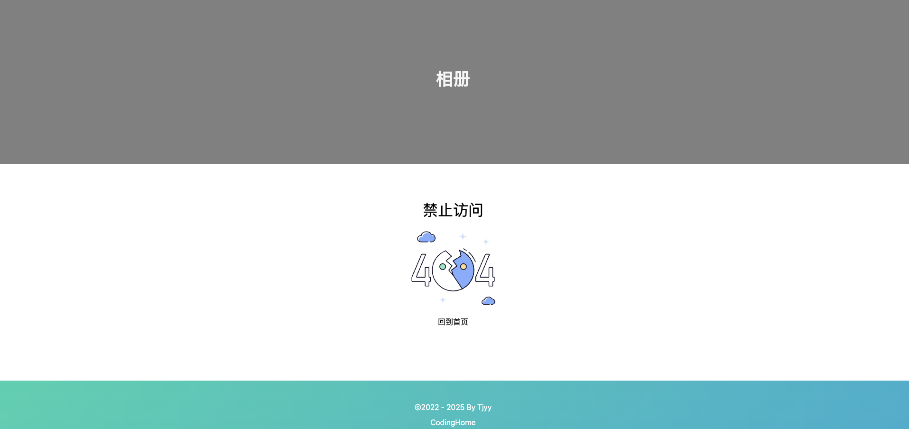

这段代码实现了一个简单的“404 页面未找到”页面，具体功能如下：

1. **显示标题**：
   - 显示“禁止访问”文本。
2. **显示图片**：
   - 显示 404 图片，增强视觉效果。
3. **返回首页**：
   - 提供一个按钮，点击时跳转到首页。

**示例效果**

- 页面顶部显示标题“禁止访问”。
- 显示 404 图片。
- 提供一个返回首页的按钮。

```vue
<template>
    <BannerPage label="album" card>
        <div class="text-center">
            <span class="text-8">
                禁止访问
            </span>
            <div class="flex justify-center">
                
            </div>
            <button @click="$router.push('/')">
                回到首页
            </button>
        </div>
    </BannerPage>
</template>


<script setup>
import BannerPage from '@/components/BannerPage.vue'
</script>

<style lang="scss" scoped></style>
```


## 5.3 Link 友情链接


这段代码实现了一个“友情链接”页面，具体功能如下：

1. **友链列表**：
   - 动态显示友情链接数据，使用 `LinkList` 组件。
2. **添加友链**：
   - 提供添加友链的功能，使用 `AddLink` 组件。
3. **评论区域**：
   - 显示评论区域，使用 `Comment` 组件，评论类型为“友情链接”。
4. **加载状态**：
   - 使用 `loading` 控制页面的加载动画。

**示例效果**

- 页面顶部显示标题“友情链接”。
- 显示友链列表。
- 提供添加友链的功能。
- 显示评论区域。

```vue
<template>
    <BannerPage label="link" title="友情链接" card :loading="loading">
        <div class="space-y-5">
            <!-- 友链列表 -->
            <LinkList :link-list="linkList" />
            <!-- 添加友链 -->
            <AddLink />
            <!-- 评论 -->
            <Comment class="mt-30" :type="2" />
        </div>
    </BannerPage>
</template>

<script setup>
import { onMounted, ref } from 'vue'

import LinkList from './components/LinkList.vue'
import AddLink from './components/AddLink.vue'
import Comment from '@/components/comment/Comment.vue'
import BannerPage from '@/components/BannerPage.vue'
import api from '@/api'

const loading = ref(true)
const linkList = ref([])

onMounted(() => {
    api.getLinks().then((res) => {
        linkList.value = res.data
    }).finally(() => {
        loading.value = false
    })
})
</script>

<style lang="scss" scoped></style>
```


## 5.4 About 关于我

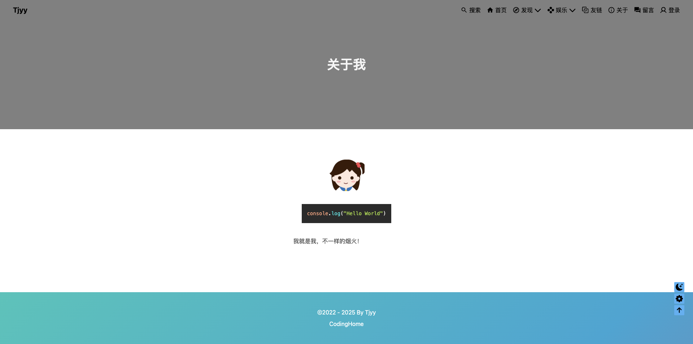

这段代码实现了一个“关于我”页面，具体功能如下：

1. **显示作者头像**：
   - 显示博客作者的头像，头像路径从 `blogConfig.website_avatar` 获取。
   - 鼠标悬停时旋转 360 度。
2. **显示文章内容**：
   - 使用 `marked` 解析 Markdown 内容，将其转换为 HTML。
   - 使用 `highlight.js` 对代码块进行高亮处理。
   - 使用 Tailwind CSS 的 `prose` 插件类美化文章内容的排版。

**示例效果**

- 显示作者头像，鼠标悬停时旋转 360 度。
- 显示关于页面的内容，支持 Markdown 格式和代码高亮。

```vue
<template>
    <BannerPage label="about" title="关于我" card>
        <div class="flex justify-center">
            
        </div>
        <div class="flex justify-center">
            <article class="max-w-none prose prose-truegray">
                <div v-html="html" />
            </article>
        </div>
    </BannerPage>
</template>


<script setup>
import { nextTick, onMounted, ref } from 'vue'
import { marked } from 'marked'
import hljs from 'highlight.js/lib/core'
import 'highlight.js/styles/a11y-dark.css'
import go from 'highlight.js/lib/languages/go'
import json from 'highlight.js/lib/languages/json'
import javascript from 'highlight.js/lib/languages/javascript'
import bash from 'highlight.js/lib/languages/bash'

import BannerPage from '@/components/BannerPage.vue'
import { useAppStore } from '@/store'
import api from '@/api'

hljs.registerLanguage('go', go)
hljs.registerLanguage('bash', bash)
hljs.registerLanguage('json', json)
hljs.registerLanguage('javascript', javascript)

const { blogConfig } = useAppStore()
const html = ref('')

onMounted(async () => {
    const { data } = await api.about()
    // marked 解析 markdown 文本
    html.value = await marked.parse(data, { async: true })
    await nextTick()
    // higlight.js 代码高亮
    document.querySelectorAll('pre code').forEach(el => hljs.highlightElement(el))
    // MathJax 渲染公式
    // window.MathJax.typeset()
})
</script>

<style lang="scss" scoped></style>
```

