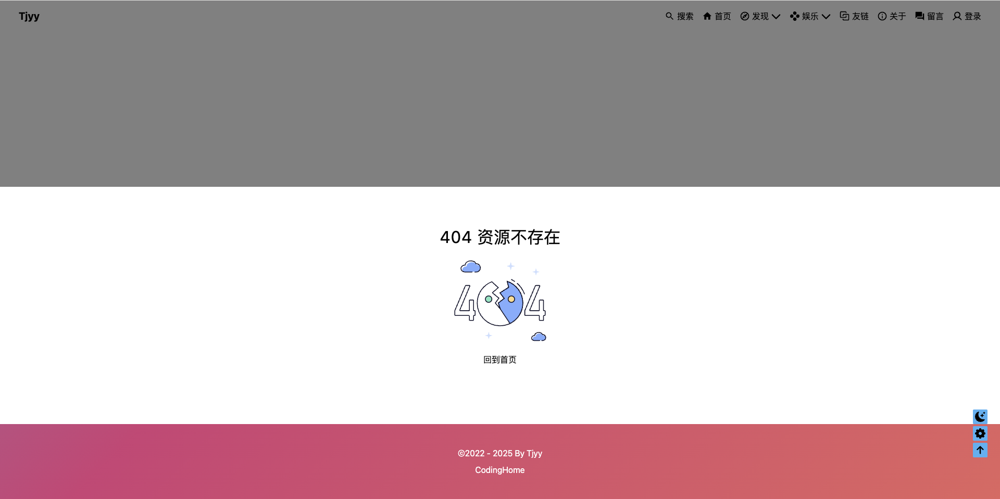
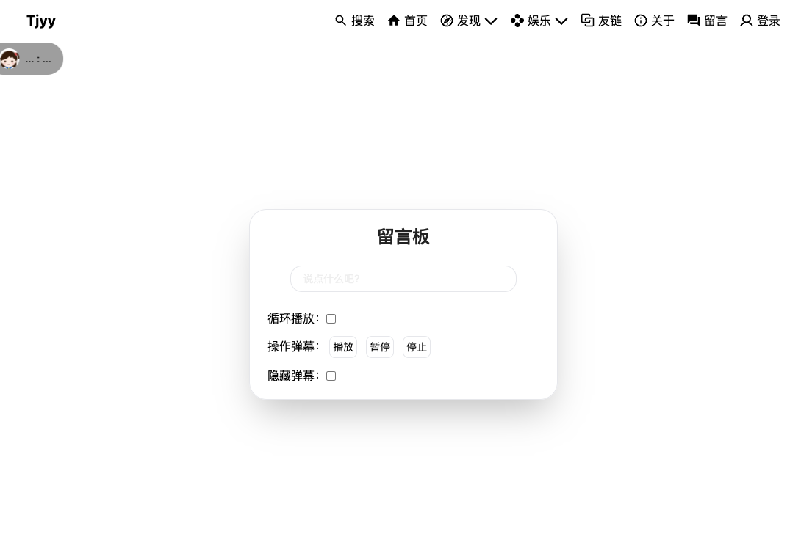
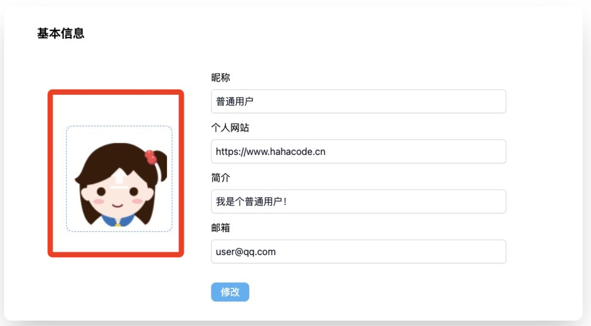
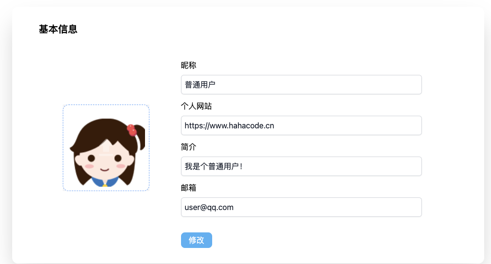

# 第六章 gin-blog-front 留言/个人中心/无法匹配404

## 6.1 路由设置与无法匹配

### 6.1.1 路由设置

路由设置如下：

```typescript
const basicRoutes = [
  ...
  {
    name: 'MessageBoard',
    path: '/message',
    component: () => import('@/views/message/index.vue'),
    meta: {
      title: '留言',
    },
  },
  {
    name: 'User',
    path: '/user',
    component: () => import('@/views/user/index.vue'),
    meta: {
      title: '个人中心',
    },
  },
  {
    name: '404',
    path: '/404',
    component: () => import('@/views/error-page/404.vue'),
  },
  // 无匹配路由跳转 404
  {
    name: 'NotFound',
    path: '/:pathMatch(.*)*',
    redirect: '/404',
    isHidden: true,
  },
]
```

这段代码定义了一个 Vue Router 的路由配置数组 `basicRoutes`，其中包含了多个路由规则。每个路由规则定义了路径、组件、名称以及一些元信息（如标题）。最后一条路由规则 `NotFound` 用于处理未匹配到任何路由的情况，将用户重定向到 404 页面。

**路由配置解析**

**1. `MessageBoard` 路由**

```javascript
{
  name: 'MessageBoard',
  path: '/message',
  component: () => import('@/views/message/index.vue'),
  meta: {
    title: '留言',
  },
}
```

- **`name`**：路由的名称，用于编程式导航。
- **`path`**：路由的路径，访问 `/message` 时匹配该路由。
- **`component`**：动态导入组件，访问该路由时加载 `@/views/message/index.vue`。
- **`meta`**：元信息，包含页面标题。

**2. `404` 路由**

```javascript
{
  name: '404',
  path: '/404',
  component: () => import('@/views/error-page/404.vue'),
}
```

- **`name`**：路由的名称。
- **`path`**：路由的路径，访问 `/404` 时匹配该路由。
- **`component`**：动态导入组件，访问该路由时加载 `@/views/error-page/404.vue`。

**3. `NotFound` 路由**

```javascript
{
  name: 'NotFound',
  path: '/:pathMatch(.*)*',
  redirect: '/404',
  isHidden: true,
}
```

- **`name`**：路由的名称。
- **`path`**：路由的路径，`/:pathMatch(.*)*` 是一个正则表达式，匹配任何路径。
  - `:pathMatch(.*)*`：`pathMatch` 是一个动态参数，`(.*)*` 是一个正则表达式，匹配任意字符（包括 `/`）。
  - 这意味着任何未匹配到其他路由的路径都会匹配到这个路由。
- **`redirect`**：将用户重定向到 `/404` 页面。
- **`isHidden`**：自定义属性，表示该路由是否隐藏（通常用于菜单或导航中）。

**示例效果**

- 访问 `/message` 时，显示留言页面。
- 访问 `/user` 时，显示个人中心页面。
- 访问 `/404` 时，显示 404 页面。
- 访问任何未定义的路径（如 `/unknown`）时，自动重定向到 `/404` 页面。


### 6.1.2 无法匹配 404



这段代码实现了一个简单的“404 页面未找到”页面，具体功能如下：

1. **显示标题**：
   - 显示“404 资源不存在”文本。
2. **显示图片**：
   - 显示 404 图片，增强视觉效果。
3. **返回首页**：
   - 提供一个按钮，点击时跳转到首页。

**示例效果**

- 页面顶部显示标题“404 资源不存在”。
- 显示 404 图片。
- 提供一个返回首页的按钮。

```vue
<template>
    <BannerPage label="404" card>
        <div class="text-center">
            <span class="text-8">
                404 资源不存在
            </span>
            <div class="flex justify-center">
                
            </div>
            <button @click="$router.push('/')">
                回到首页
            </button>
        </div>
    </BannerPage>
</template>

<script setup>
import BannerPage from '@/components/BannerPage.vue'
</script>

<style lang="scss" scoped></style>
```


## 6.2 留言



- **页面结构**：
  - 页面整体是一个全屏的容器（`banner-fade-down`），背景图通过 `coverStyle` 动态设置。
  - 页面分为两部分：弹幕输入框和弹幕显示区域。
- **弹幕输入框**：
  - 输入框绑定 `v-model="content"`，用户输入内容。
  - 点击输入框时显示发送按钮（`showBtn`），按下回车键或点击发送按钮调用 `send` 方法。
  - 提供了弹幕控制功能：
    - 循环播放（`isLoop`）。
    - 播放、暂停、停止弹幕（通过 `dmRef` 调用 `vue-danmaku` 的方法）。
    - 隐藏弹幕（`isHide`）。
- **弹幕显示区域**：
  - 使用 `vue-danmaku` 组件显示弹幕。
  - 弹幕内容通过 `v-model:danmus` 绑定到 `danmus` 数据。
  - 每条弹幕的样式通过插槽自定义，包含头像、昵称和内容。

```vue
<template>
    <div :style="coverStyle" class="banner-fade-down absolute inset-x-0 h-screen overflow-hidden">
        <!-- 弹幕输入框 -->
        <div
            class="absolute inset-x-1 top-3/10 z-5 mx-auto w-[350px] animate-zoom-in border-1 rounded-3xl px-1 py-5 text-center text-dark shadow-2xl lg:w-[420px]">
            <h1 class="text-2xl font-bold">
                留言板
            </h1>
            <div class="mt-6 h-9 flex justify-center lg:mt-6">
                <input v-model="content"
                    class="w-3/4 border-1 rounded-2xl bg-transparent px-4 text-sm text-#eee outline-none"
                    placeholder="说点什么吧？" @click.stop="showBtn = true" @keyup.enter="send">
                <button v-if="showBtn" class="ml-3 animate-back-in-right border-1 rounded-2xl px-4" @click="send">
                    发送
                </button>
            </div>
            <ul class="ml-5 text-left text-black space-y-3">
                <li class="mt-6 flex items-center">
                    循环播放：
                    <input v-model="isLoop" type="checkbox">
                </li>
                <li class="space-x-3">
                    操作弹幕：
                    <button class="border-1 rounded-lg p-1 text-sm" @click="dmRef.play">
                        播放
                    </button>
                    <button class="border-1 rounded-lg p-1 text-sm" @click="dmRef.pause">
                        暂停
                    </button>
                    <button class="border-1 rounded-lg p-1 text-sm" @click="dmRef.stop">
                        停止
                    </button>
                </li>
                <li class="flex items-center">
                    隐藏弹幕：
                    <input v-model="isHide" type="checkbox">
                </li>
            </ul>
        </div>
        <!-- 弹幕列表 -->
        <div class="absolute inset-0 top-[60px]">
            <vue-danmaku ref="dmRef" v-model:danmus="danmus" class="h-full w-full" use-slot :loop="isLoop" :speeds="200"
                :channels="0" :top="5" :is-suspend="true">
                <template #dm="{ danmu }">
                    <div class="flex items-center rounded-3xl bg-#00000060 px-2 py-1 text-black lg:px-4 lg:py-2">
                        
                        <span class="ml-2 text-sm"> {{ `${danmu.nickname} : ${danmu.content}` }}</span>
                    </div>
                </template>
            </vue-danmaku>
        </div>
    </div>
</template>

<script setup>
import { computed, nextTick, onMounted, ref, watch } from 'vue'
import { storeToRefs } from 'pinia'
import vueDanmaku from 'vue3-danmaku'

import api from '@/api'
import { convertImgUrl } from '@/utils'
import { useAppStore, useUserStore } from '@/store'

const userStore = useUserStore()
const { pageList } = storeToRefs(useAppStore())

const content = ref('')
const showBtn = ref(false)

const dmRef = ref(null) // 弹幕 ref 对象
const isHide = ref(false) // 隐藏弹幕
const isLoop = ref(false) // 循环播放

// 弹幕列表
const danmus = ref([{
    avatar: 'https://www.bing.com/rp/ar_9isCNU2Q-VG1yEDDHnx8HAFQ.png',
    content: '...',
    nickname: '...',
}])

onMounted(async () => {
    const resp = await api.getMessages()
    await nextTick()
    danmus.value = [...danmus.value, ...resp.data]
})

async function send() {
    content.value = content.value.trim()
    if (!content.value) {
        window?.$message?.info('消息不能为空!')
        return
    }
    const data = {
        avatar: userStore.avatar,
        nickname: userStore.nickname,
        content: content.value,
    }
    await api.saveMessage(data)
    dmRef.value.push(data)
    content.value = ''
}

watch(isHide, val => val ? dmRef.value.hide() : dmRef.value.show())

// 根据后端配置动态获取封面
const coverStyle = computed(() => {
    const page = pageList.value.find(e => e.label === 'message')
    return page
        ? `background: url('${page?.cover}') center center / cover no-repeat;`
        : 'background: url("https://static.talkxj.com/config/83be0017d7f1a29441e33083e7706936.jpg") center center / cover no-repeat;'
})
</script>

<style lang="scss" scoped>
input::-webkit-input-placeholder {
    color: #eee;
}
</style>
```


## 6.3 个人中心

### 6.3.1 UploadOne



**src/views/user/UploadOne.vue**

这段代码实现了一个文件上传组件，主要用于上传图片文件，并支持图片预览功能。以下是对代码的详细分析和说明：

**1. 功能概述**

- **文件上传**：用户可以通过点击上传区域选择文件，支持拖拽上传（虽然代码中没有实现拖拽功能，但有 TODO 注释提到）。
- **图片预览**：如果上传的文件是图片，组件会显示图片的预览。
- **动态更新**：使用 Vue 的 `v-model` 机制，允许父组件通过 `preview` 属性绑定图片路径，并在上传成功后更新该路径。

**2. 模板部分（`<template>`）**

- **整体布局**：
  - 使用 `main` 标签包裹整个上传区域，居中显示。
  - 使用 `label` 标签包裹上传区域，绑定 `for="dropzone-file"`，点击上传区域时会触发隐藏的 `input[type="file"]`。
- **上传区域**：
  - **图片预览模式**（`v-if="previewImg"`）：
    - 显示上传的图片，并在图片上覆盖一个上传图标（`i-mdi:upload`），用户可以点击重新上传。
  - **默认模式**（`v-else`）：
    - 显示一个上传图标和提示文字，提示用户点击上传文件。
- **隐藏的文件输入框**：
  - 使用 `input[type="file"]` 实现文件选择功能，绑定 `@change="handleFileChange"`，当用户选择文件后触发文件上传逻辑。

**3. 脚本部分（`<script setup>`）**

- **引入的模块**：
  - Vue 的响应式 API（`ref`、`computed`）。
  - 自定义工具函数 `convertImgUrl`，用于处理图片路径。
  - `useUserStore`，从 Pinia 状态管理库中获取用户信息（如 `token`）。
- **数据绑定**：
  - `props.preview`：从父组件接收初始图片路径。
  - `previewImg`：响应式变量，存储当前图片路径。
  - `imgUrl`：计算属性，根据 `previewImg` 的值动态生成图片路径。
  - `fileRef`：绑定隐藏的文件输入框的引用。
- **方法**：
  - `handleFileChange`：
    - 获取用户选择的文件。
    - 创建 `FormData` 对象，将文件作为表单数据。
    - 使用 `fetch` 发起 POST 请求，将文件上传到后端 API（`/api/front/upload`）。
    - 上传成功后，更新 `previewImg` 的值，并通过 `emit` 通知父组件更新绑定的 `preview` 属性。
    - 如果上传失败，显示错误提示。

```vue
<template>
    <!-- TODO: 拖拽文件上传 -->
    <main class="flex items-center justify-center bg-gray-100 font-sans">
        <label for="dropzone-file"
            class="mx-auto max-w-[300px] w-full cursor-pointer items-center border-1 border-blue-400 rounded-xl border-dashed bg-white p-2 text-center">
            <template v-if="previewImg">
                <div class="group relative">
                    
                    <div class="absolute bottom-0 left-0 right-0 top-0 f-c-c cursor-pointer">
                        <button
                            class="i-mdi:upload pointer-events-none inline-block text-[50px] text-white opacity-35 duration-200 group-hover:opacity-80" />
                    </div>
                </div>
            </template>
            <template v-else>
                <div class="f-c-c lg:h-[160px] lg:w-[160px]">
                    <div class="flex flex-col items-center">
                        <span class="i-mdi:upload text-[58px] text-blue-500" />
                        <span class="text-blue-400"> 点击上传文件</span>
                    </div>
                </div>
            </template>
            <input id="dropzone-file" ref="fileRef" type="file" class="hidden" @change="handleFileChange">
        </label>
    </main>
</template>


<script setup>
import { computed, ref } from 'vue'
import { convertImgUrl } from '@/utils'
import { useUserStore } from '@/store'

const props = defineProps({
    preview: {
        type: String,
        default: '',
    },
})

const emit = defineEmits(['update:preview'])
const previewImg = ref(props.preview) // 图片预览

// 判断是本地上传的图片或网络资源
// 开发环境可以使用本地文件上传, 生产环境建议使用云存储
const imgUrl = computed(() => convertImgUrl(previewImg.value))

const fileRef = ref(null)

async function handleFileChange() {
    const file = fileRef.value.files[0]
    const formData = new FormData()
    formData.append('file', file)
    try {
        const { token } = useUserStore()
        const response = await fetch('/api/front/upload', {
            method: 'POST',
            headers: {
                Authorization: `Bearer ${token}`,
            },
            body: formData,
        })

        const responseJSON = await response.json()
        if (responseJSON.code !== 0) {
            window.$message?.error(responseJSON.message)
            return
        }

        previewImg.value = responseJSON.data
        emit('update:preview', previewImg)
    }
    catch (err) {
        console.error(err)
        window.$message?.error('文件上传失败')
    }
}
</script>

<style lang="scss" scoped></style>
```


### 6.3.2 user/index.vue



这段代码实现了一个“个人中心”页面，具体功能如下：

1. **显示用户头像**：使用 `UploadOne` 组件显示用户头像。
2. **显示用户信息表单**：
   - 显示用户的基本信息，包括昵称、个人网站、简介和邮箱。
   - 提供输入框供用户修改信息。
3. **修改用户信息**：
   - 提供一个“修改”按钮，点击时调用 `updateUserInfo` 方法，提交用户信息到后端。

**示例效果**

- 页面顶部显示“个人中心”标题。
- 显示用户的基本信息表单，包括头像、昵称、个人网站、简介和邮箱。
- 提供一个“修改”按钮，点击时提交用户信息。

```vue
<template>
    <BannerPage label="user" title="个人中心" card>
        <p class="mb-6 text-xl font-bold">
            基本信息
        </p>
        <div class="grid grid-cols-12 gap-4">
            <div class="col-span-4 f-c-c">
                <UploadOne v-model:preview="form.avatar" />
            </div>
            <div class="col-span-8 lg:col-span-7">
                <div class="my-6 space-y-3">
                    <div v-for="item of [
                        { label: '昵称', key: 'nickname' },
                        { label: '个人网站', key: 'website' },
                        { label: '简介', key: 'intro' },
                        { label: '邮箱', key: 'email' },
                    ]" :key="item.label">
                        <div class="mb-2">
                            {{ item.label }}
                        </div>
                        <input v-model="form[item.key]" required :placeholder="`请输入${item.label}`"
                            class="block w-full border-0 rounded-md p-2 text-gray-900 shadow-sm outline-none ring-1 ring-gray-300 ring-inset placeholder:text-gray-400 focus:ring-2 focus:ring-emerald">
                    </div>
                </div>
                <button class="the-button mt-2" @click="updateUserInfo">
                    修改
                </button>
            </div>
            <div class="col-span-0 lg:col-span-1" />
        </div>
    </BannerPage>
</template>

<script setup>
import { onMounted, reactive } from 'vue'
import { useRouter } from 'vue-router'

import UploadOne from './UploadOne.vue'
import BannerPage from '@/components/BannerPage.vue'

import { useUserStore } from '@/store'
import api from '@/api'

const userStore = useUserStore()
const router = useRouter()

const form = reactive({
    avatar: userStore.avatar,
    nickname: userStore.nickname,
    intro: userStore.intro,
    website: userStore.website,
    email: userStore.email,
})

onMounted(async () => {
    await userStore.getUserInfo()
    if (!userStore.userId) {
        router.push('/')
    }
})

async function updateUserInfo() {
    try {
        await api.updateUser(form)
        window.$message?.success('修改成功!')
        userStore.getUserInfo()
    }
    catch (err) {
        console.error(err)
    }
}
</script>

<style lang="scss" scoped></style>
```

------


### 6.3.3 为什么使用 `reactive`？

在 Vue 3 中，`reactive` 是一个用于创建响应式对象的函数。使用 `reactive` 创建的对象，其内部的所有属性都是响应式的，这意味着当这些属性的值发生变化时，Vue 会自动更新相关的 DOM 内容。

```javascript
const form = reactive({
    avatar: userStore.avatar,
    nickname: userStore.nickname,
    intro: userStore.intro,
    website: userStore.website,
    email: userStore.email,
})
```

1. **响应式更新**：
   - 当 `form` 对象中的属性（如 `avatar`、`nickname` 等）发生变化时，Vue 会自动检测到这些变化，并更新绑定到这些属性的 DOM 元素。
   - 例如，如果你在表单中修改了 `nickname` 的值，Vue 会自动更新页面上显示 `nickname` 的部分。
2. **简化状态管理**：
   - 使用 `reactive` 可以将多个相关的状态集中管理在一个对象中，便于维护和更新。
   - 在你的代码中，`form` 对象集中管理了用户的基本信息，使得在表单中进行数据绑定和更新变得非常方便。
3. **与 Vue 的响应式系统集成**：
   - `reactive` 对象与 Vue 的响应式系统无缝集成，确保数据的变化能够触发组件的重新渲染。
   - 这使得在表单中使用 `v-model` 绑定数据时，能够自动响应用户输入的变化。

在模板中使用 `v-model` 绑定：

```vue
<input v-model="form.nickname" placeholder="请输入昵称" />
```

当用户在输入框中修改昵称时，`form.nickname` 的值会自动更新，并且 Vue 会自动重新渲染相关的内容。

------


### 6.3.4  不使用 `reactive ` 怎么办

```javascript
const form = {
    avatar: userStore.avatar,
    nickname: userStore.nickname,
    intro: userStore.intro,
    website: userStore.website,
    email: userStore.email,
}
```

在模板中使用 `v-model` 绑定：

```vue
<input v-model="form.nickname" placeholder="请输入昵称" />
```

这样也可以工作，但 `form` 对象本身不是响应式的。如果 `form` 的属性在其他地方被修改，Vue 不会自动检测到这些变化，也不会更新相关的 DOM 内容。

因此，使用 `reactive` 创建 `form` 对象的主要原因是：

1. **响应式更新**：确保当 `form` 的属性发生变化时，Vue 能够自动更新相关的 DOM 内容。
2. **简化状态管理**：集中管理多个相关的状态，便于维护和更新。
3. **与 Vue 的响应式系统集成**：确保数据的变化能够触发组件的重新渲染，使得表单操作更加直观和方便。