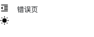
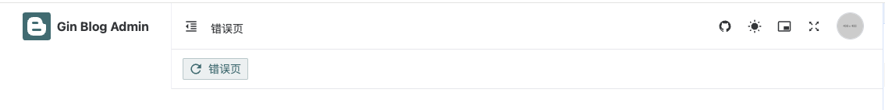

# 第八章 gin-blog-admin Layout

## 8.1 App.vue

这段代码展示了一个 Vue 3 组件，它通过 `Naive UI` 配置全局主题和本地化，支持暗黑模式和代码高亮显示，并且使用 Vue Router 动态渲染路由组件。代码简洁、功能清晰，适合用于需要根据用户主题偏好调整界面和高亮显示代码的应用。

**全局配置**：

- 通过 `NConfigProvider` 组件全局配置了 Naive UI 的主题、语言、日期格式以及高亮库，确保整个应用的主题和本地化设置一致。

**动态路由渲染**：

- 使用 `RouterView` 和 Vue 动态组件机制，能够根据当前路由渲染对应的页面组件。`RouterView` 和 `v-slot` 的使用使得动态渲染更加灵活。

**主题切换**：

- 根据 `themeStore.darkMode` 的状态来动态切换 Naive UI 的主题，支持深色模式（dark mode）。

**代码高亮**：

- 配置了 `highlight.js` 用于代码高亮显示，特别是 JSON 格式的代码。

```vue
<template>
  <NConfigProvider class="h-full w-full" :theme="themeStore.darkMode ? darkTheme : undefined"
    :theme-overrides="themes.naiveThemeOverrides" :locale="zhCN" :date-locale="dateZhCN" :hljs="hljs">
    <RouterView v-slot="{ Component }">
      <component :is="Component" />
    </RouterView>
  </NConfigProvider>
</template>


<script setup>
import { onMounted } from 'vue'
import { NConfigProvider, darkTheme, dateZhCN, zhCN } from 'naive-ui'
import hljs from 'highlight.js/lib/core'
import json from 'highlight.js/lib/languages/json'

import { useAuthStore, useThemeStore } from '@/store'
import themes from '@/assets/themes'
import api from '@/api'

hljs.registerLanguage('json', json)
const themeStore = useThemeStore()
</script>

<style lang="scss" scoped></style>
```

可以首先生成一个src/views/error-page/404.vue

```vue
<template>
    <div>

    </div>
</template>

<script setup>

</script>

<style lang="scss" scoped>

</style>
```

可以访问 http://localhost:3333/404 暂时看到一个空白页面

------


## 8.2 layout-header

### 8.2.1 准备

首先新建src/layout/header/index.vue：

```vue
<template>
    <div>
        111
    </div>
</template>

<script setup>

</script>

<style lang="scss" scoped>

</style>
```

其次可以在 src/views/error-page/404.vue 进行调整以查看相应效果：

```vue
<template>
    <div>
        <Header></Header>
    </div>
</template>

<script setup>
import Header from '@/layout/header/index.vue'
</script>

<style lang="scss" scoped>

</style>
```


**后续查看 layout 效果均以上述方式查看，不在赘述**


### 8.2.2 BreadCrumb.vue

这段代码实现的功能如下：

- 动态渲染面包屑：通过 `route.matched` 获取当前路由的所有匹配路径，并为每个有 `meta.title` 的路由渲染一个面包屑项。
- 图标支持：如果路由的 `meta` 中有 `icon` 字段，面包屑项会显示对应的图标。图标通过 `renderIcon` 函数渲染。
- 点击跳转：点击面包屑项时，路由会根据 `path` 进行跳转（通过 `router.push`）。

src/layout/header/components/BreadCrumb.vue

```vue
<template>
    <NBreadcrumb>
        <NBreadcrumbItem v-for="item in route.matched.filter((item) => !!item.meta?.title)" :key="item.path"
            @click="handleBreadClick(item.path)">
            <component :is="getIcon(item.meta)" />
            {{ item.meta?.title }}
        </NBreadcrumbItem>
    </NBreadcrumb>
</template>


<script setup>
import { useRoute, useRouter } from 'vue-router'
import { NBreadcrumb, NBreadcrumbItem } from 'naive-ui'
import { renderIcon } from '@/utils'

const router = useRouter()
const route = useRoute()

function handleBreadClick(path) {
    if (path !== route.path) {
        router.push(path)
    }
}

function getIcon(meta) {
    if (meta?.icon) {
        return renderIcon(meta.icon, { size: 18 })
    }
    return null
}
</script>

<style lang="scss" scoped></style>
```

src/layout/header/index.vue

```vue
<template>
    <div class="flex items-center space-x-3">
        <!-- 面包屑导航 -->
        <BreadCrumb class="mt-1.5" />
    </div>
</template>

<script setup>
import BreadCrumb from './components/BreadCrumb.vue'
</script>

<style lang="scss" scoped></style>
```


### 8.2.3 MenuCollapse.vue

src/layout/header/components/MenuCollapse.vue

**折叠控制功能**：

- **折叠状态**：通过 `themeStore.collapsed` 来判断左侧栏是否折叠。如果 `collapsed` 为 `true`，表示左侧栏处于折叠状态，反之则表示左侧栏处于展开状态。
- **点击事件**：点击图标时会调用 `themeStore.switchCollapsed` 方法，该方法切换 `collapsed` 状态的值，达到展开或折叠左侧栏的效果。
- 图标切换：根据  collapsed 的值，动态渲染不同的图标：
  - **折叠状态（`true`）**：显示 “展开” 图标（`format-indent-increase`）。
  - **展开状态（`false`）**：显示 “折叠” 图标（`format-indent-decrease`）。

**用户交互**：用户点击图标时，左侧栏会折叠或展开，而图标本身也会相应改变，以提示当前状态。

```vue
<template>
    <NIcon size="18" class="cursor-pointer" @click="themeStore.switchCollapsed">
        <p v-if="themeStore.collapsed" class="i-mdi-format-indent-increase" />
        <p v-else class="i-mdi-format-indent-decrease" />
    </NIcon>
</template>


<script setup>
import { NIcon } from 'naive-ui'
import { useThemeStore } from '@/store'

const themeStore = useThemeStore()
</script>

<style lang="scss" scoped></style>
```

src/layout/header/index.vue

```vue
<template>
    <div class="flex items-center space-x-3">
        <!-- 侧边栏折叠按钮 -->
        <MenuCollapse />
        <!-- 面包屑导航 -->
        <BreadCrumb class="mt-1.5" />
    </div>
</template>

<script setup>
import MenuCollapse from './components/MenuCollapse.vue'
import BreadCrumb from './components/BreadCrumb.vue'
</script>

<style lang="scss" scoped></style>
```


### 8.2.4 ThemeMode.vue

src/layout/header/components/ThemeMode.vue

**暗黑模式与亮色模式切换：**

- 当用户点击图标时，`@click="themeStore.switchDarkMode"` 事件会触发 `themeStore.switchDarkMode` 方法。
- 这个方法通常会修改 `themeStore.darkMode` 状态，切换当前的主题模式（暗黑或亮色模式）。

**图标变化：**

- v-if="themeStore.darkMode" 根据当前 themeStore.darkMode 的值来动态切换图标。
  - 如果 `themeStore.darkMode` 为 `true`，显示的是“月亮”图标（暗黑模式）。
  - 如果 `themeStore.darkMode` 为 `false`，显示的是“太阳”图标（亮色模式）。

```vue
<template>
    <NIcon class="cursor-pointer" size="18" @click="themeStore.switchDarkMode">
        <p v-if="themeStore.darkMode" class="i-mdi-moon-waning-crescent" />
        <p v-else class="i-mdi-white-balance-sunny" />
    </NIcon>
</template>

<script setup>
import { NIcon } from 'naive-ui'
import { useThemeStore } from '@/store'

const themeStore = useThemeStore()
</script>

<style lang="scss" scoped></style>
```

src/layout/header/index.vue

```vue
<template>
    <div class="flex items-center space-x-3">
        <!-- 侧边栏折叠按钮 -->
        <MenuCollapse />
        <!-- 面包屑导航 -->
        <BreadCrumb class="mt-1.5" />
    </div>
    <div class="ml-auto flex items-center space-x-5">
        <!-- 切换模式 -->
        <ThemeMode />
    </div>
</template>

<script setup>
import MenuCollapse from './components/MenuCollapse.vue'
import BreadCrumb from './components/BreadCrumb.vue'
import ThemeMode from './components/ThemeMode.vue'
</script>

<style lang="scss" scoped></style>
```



### 8.2.5 Watermark.vue

src/layout/header/components/Watermark.vue

**水印开关功能**：该组件通过 `NIcon` 图标来切换水印的显示与隐藏。点击图标会触发 `themeStore.switchWatermark` 方法，切换 `themeStore.watermarked` 的值，控制水印的显示。

**动态水印**：使用 `NWatermark` 组件来显示水印，水印内容为当前用户的昵称，且样式可以通过多种参数调整，如字体大小、旋转角度、位置偏移等。

**条件渲染**：图标和水印的显示都基于 `themeStore.watermarked` 状态，这个状态决定了是否显示水印和切换图标。

```vue
<template>
    <NIcon size="18" class="cursor-pointer" @click="themeStore.switchWatermark">
        <p v-if="themeStore.watermarked" class="i-ic-baseline-branding-watermark" />
        <p v-else class="i-ic-outline-branding-watermark" />
    </NIcon>

    <NWatermark v-if="themeStore.watermarked" :content="userStore.nickname" cross fullscreen :font-size="16"
        :line-height="16" :width="184" :height="184" :x-offset="12" :y-offset="60" :rotate="-15" />
</template>

<script setup>
import { NIcon, NWatermark } from 'naive-ui'
import { useThemeStore, useUserStore } from '@/store'

const userStore = useUserStore()
const themeStore = useThemeStore()
</script>

<style lang="scss" scoped></style>
```

src/layout/header/index.vue

```vue
<template>
    <div class="flex items-center space-x-3">
        <!-- 侧边栏折叠按钮 -->
        <MenuCollapse />
        <!-- 面包屑导航 -->
        <BreadCrumb class="mt-1.5" />
    </div>
    <div class="ml-auto flex items-center space-x-5">
        <!-- 切换模式 -->
        <ThemeMode />
        <!-- 水印 -->
        <Watermark />
    </div>
</template>

<script setup>
import MenuCollapse from './components/MenuCollapse.vue'
import BreadCrumb from './components/BreadCrumb.vue'
import ThemeMode from './components/ThemeMode.vue'
import Watermark from './components/Watermark.vue'
</script>

<style lang="scss" scoped></style>
```


### 8.2.6 GithubSite.vue

src/layout/header/components/GithubSite.vue

**图标渲染**：通过 `NIcon` 组件渲染一个可点击的 GitHub 图标。

**点击事件**：用户点击图标时，触发 `handleLinkClick` 方法，打开 GitHub 用户页面链接。

**图标库**：使用 `Iconify` 库的 **Material Design Icons** 图标集（`mdi:github`）来显示 GitHub 图标。

```vue
<template>
    <NIcon class="cursor-pointer" size="18" @click="handleLinkClick">
        <p class="i-mdi:github" />
    </NIcon>
</template>


<script setup>
import { NIcon } from 'naive-ui'

function handleLinkClick() {
    window.open('https://github.com/Tjyy-1223')
}
</script>

<style lang="scss" scoped></style>
```

src/layout/header/index.vue

```vue
<template>
    <div class="flex items-center space-x-3">
        <!-- 侧边栏折叠按钮 -->
        <MenuCollapse />
        <!-- 面包屑导航 -->
        <BreadCrumb class="mt-1.5" />
    </div>
    <div class="ml-auto flex items-center space-x-5">
        <!-- Github 网址图标 -->
        <GithubSite />
        <!-- 切换模式 -->
        <ThemeMode />
        <!-- 水印 -->
        <Watermark />
    </div>
</template>

<script setup>
import MenuCollapse from './components/MenuCollapse.vue'
import BreadCrumb from './components/BreadCrumb.vue'
import ThemeMode from './components/ThemeMode.vue'
import Watermark from './components/Watermark.vue'
import GithubSite from './components/GithubSite.vue'
</script>

<style lang="scss" scoped></style>
```


### 8.2.7 FullScreen.vue

src/layout/header/components/FullScreen.vue

**全屏图标渲染**：

- 通过 `NIcon` 渲染一个图标，点击图标会触发全屏状态的切换。
- 根据 `isFullscreen` 的值，动态切换显示不同的图标：如果是全屏，显示“退出全屏”图标；如果不是全屏，显示“全屏”图标。

**全屏状态管理**：

- 使用了 **VueUse** 的 `useFullscreen` 钩子来管理全屏状态，`toggle` 方法用于切换全屏状态。

```vue
<template>
    <NIcon size="18" class="cursor-pointer" @click="toggle">
        <p v-if="isFullscreen" class="i-ant-design:fullscreen-exit-outlined" />
        <p v-else class="i-ant-design:fullscreen-outlined" />
    </NIcon>
</template>


<script setup>
import { NIcon } from 'naive-ui'
import { useFullscreen } from '@vueuse/core'

const { isFullscreen, toggle } = useFullscreen()
</script>

<style lang="scss" scoped></style>
```

src/layout/header/index.vue

```vue
<template>
    <div class="flex items-center space-x-3">
        <!-- 侧边栏折叠按钮 -->
        <MenuCollapse />
        <!-- 面包屑导航 -->
        <BreadCrumb class="mt-1.5" />
    </div>
    <div class="ml-auto flex items-center space-x-5">
        <!-- Github 网址图标 -->
        <GithubSite />
        <!-- 切换模式 -->
        <ThemeMode />
        <!-- 水印 -->
        <Watermark />
        <!-- 全屏按钮 -->
        <FullScreen />
    </div>
</template>

<script setup>
import MenuCollapse from './components/MenuCollapse.vue'
import BreadCrumb from './components/BreadCrumb.vue'
import ThemeMode from './components/ThemeMode.vue'
import Watermark from './components/Watermark.vue'
import GithubSite from './components/GithubSite.vue'
import FullScreen from './components/FullScreen.vue'
</script>

<style lang="scss" scoped></style>
```


### 8.2.8 UserAvatar.vue

src/layout/header/components/UserAvatar.vue

**用户头像和昵称**：

- 显示用户的头像和昵称，用户的头像通过 `userStore.avatar` 动态加载，昵称通过 `userStore.nickname` 获取。

**下拉菜单**：

- 提供两个选项：“个人中心”和“退出登录”。用户点击下拉菜单时会触发 `handleSelect` 方法，执行相应的操作。

**退出登录**：

- 如果用户选择“退出登录”，会弹出确认框，如果用户确认，则调用 `authStore.logout()` 执行登出操作。

**个人中心**：

- 如果用户选择“个人中心”，则通过 `router.push('/profile')` 跳转到个人中心页面。

```vue
<template>
    <NDropdown :options="options" @select="handleSelect">
        <div class="flex cursor-pointer items-center">
            
            <p>{{ userStore.nickname }}</p>
        </div>
    </NDropdown>
</template>

<script setup>
import { h } from 'vue'
import { useRouter } from 'vue-router'
import { NDropdown } from 'naive-ui'

import { useAuthStore, useUserStore } from '@/store'

const userStore = useUserStore()
const authStore = useAuthStore()
const router = useRouter()

const options = [
    {
        label: '个人中心',
        key: 'profile',
        icon: () => h('i', { class: 'i-mdi:account' }),
    },
    {
        label: '退出登录',
        key: 'logout',
        icon: () => h('i', { class: 'i-mdi:exit-to-app' }),
    },
]

function handleSelect(key) {
    if (key === 'logout') {
        window.$dialog.confirm({
            title: '提示',
            type: 'info',
            content: '确认退出？',
            confirm() {
                authStore.logout()
            },
        })
    }
    else if (key === 'profile') {
        router.push('/profile')
    }
}
</script>

<style lang="scss" scoped></style>
```

src/layout/header/index.vue

```vue
<template>
    <div class="flex items-center space-x-3">
        <!-- 侧边栏折叠按钮 -->
        <MenuCollapse />
        <!-- 面包屑导航 -->
        <BreadCrumb class="mt-1.5" />
    </div>
    <div class="ml-auto flex items-center space-x-5">
        <!-- Github 网址图标 -->
        <GithubSite />
        <!-- 切换模式 -->
        <ThemeMode />
        <!-- 水印 -->
        <Watermark />
        <!-- 全屏按钮 -->
        <FullScreen />
        <!-- 用户头像 -->
        <UserAvatar />
    </div>
</template>

<script setup>
import MenuCollapse from './components/MenuCollapse.vue'
import BreadCrumb from './components/BreadCrumb.vue'
import ThemeMode from './components/ThemeMode.vue'
import Watermark from './components/Watermark.vue'
import GithubSite from './components/GithubSite.vue'
import FullScreen from './components/FullScreen.vue'
import UserAvatar from './components/UserAvatar.vue'
</script>

<style lang="scss" scoped></style>
```


## 8.3 layout-sidebar

### 8.3.1 SideLogo

src/layout/sidebar/components/SideLogo.vue

- **Logo 显示和居中**：
  - 该组件实现了一个包含 logo 的区域，logo 图片使用了 `img` 标签，并被居中显示。
- **标题的显示控制**：
  - 当 `themeStore.collapsed` 为 `false` 时，标题会显示（通过 `v-show="!themeStore.collapsed"` 控制）。
  - 这是一个动态控制的效果，通常用于侧边栏折叠时隐藏标题。
- **点击跳转**：
  - 点击组件时，用户会被导航到应用的根路径（`'/'`）。这是通过 `RouterLink` 实现的。
- **响应式布局**：
  - 使用了 `flex` 布局使得 logo 和标题能够很好地适应不同屏幕尺寸，logo 和标题始终居中。

```vue
<template>
    <RouterLink class="h-[60px] flex items-center justify-center" to="/">
        <div class="h-full flex items-center justify-center">
            
        </div>
        <h2 v-show="!themeStore.collapsed"
            class="ml-2 max-w-[150px] flex-shrink-0 text-base text-primary font-bold dark:text-white">
            {{ title }}
        </h2>
    </RouterLink>
</template>

<script setup>
import { useThemeStore } from '@/store'

const themeStore = useThemeStore()
const title = import.meta.env.VITE_TITLE
</script>

<style lang="scss" scoped></style>
```

src/layout/sidebar/index.vue

```vue
<template>
    <!-- 图标 -->
    <SideLogo />
</template>

<script setup>
import SideLogo from './components/SideLogo.vue'
</script>

<style lang="scss" scoped></style>
```


### 8.3.2 SideMenu

src/layout/sidebar/components/SideMenu.vue

```vue
<template>
    <NMenu ref="menuRef" class="side-menu" :indent="18" :collapsed-icon-size="22" :collapsed-width="64"
        :options="menuOptions" :value="activeKey" @update:value="handleMenuSelect" />
</template>

<script setup>
import { computed, nextTick, ref, watch } from 'vue'
import { useRoute, useRouter } from 'vue-router'
import { NMenu } from 'naive-ui'
import { usePermissionStore, useTagStore } from '@/store'
import { renderIcon } from '@/utils'

const router = useRouter() // 获取路由信息
const curRoute = useRoute() // 进行路由跳转
const permissionStore = usePermissionStore()
const tagStore = useTagStore()

const activeKey = computed(() => curRoute.meta?.activeMenu || curRoute.name)

// menuOptions 将是一个经过处理和排序的菜单项数组。这个数组中的每个菜单项是通过 getMenuItem 转换后的，并按 order 属性升序排列。这样可以动态地生成一个符合权限管理的、排序后的菜单结构，并用于渲染在 UI 上。
const menuOptions = computed(() => {
    return permissionStore.menus
        .map(item => getMenuItem(item))
        .sort((a, b) => a.order - b.order)
})

// 点击标签, 自动展开菜单栏, 选中对应菜单
const menuRef = ref(null)
watch(curRoute, async () => {
    await nextTick()
    menuRef.value.showOption()
})

function resolvePath(basePath, path) {
    if (isExternal(path)) {
        return path
    }
    return (
        `/${[basePath, path]
            .filter(path => !!path && path !== '/')
            .map(path => path.replace(/(^\/)|(\/$)/g, ''))
            .join('/')}`
    )
}

// 根据路由获取菜单项
function getMenuItem(route, basePath = '') {
    let menuItem = {
        label: route.meta?.title || route.name,
        key: route.name,
        path: resolvePath(basePath, route.path),
        icon: getIcon(route.meta),
        order: route.meta?.order || 0,
    }

    const visibleChildren = route.children?.filter(e => e.name && !e.isHidden) ?? []

    if (!visibleChildren.length) {
        return menuItem
    }

    // 目录不展示子菜单
    if (route.isCatalogue) {
        const singleRoute = visibleChildren[0]
        menuItem = {
            label: singleRoute.meta?.title || singleRoute.name,
            key: singleRoute.name,
            path: resolvePath(menuItem.path, singleRoute.path),
            icon: getIcon(singleRoute.meta),
            order: menuItem.order,
        }
        const visibleItems = singleRoute.children
            ?.filter(item => item.name && !item.isHidden) ?? []
        if (visibleItems.length === 1) {
            menuItem = getMenuItem(visibleItems[0], menuItem.path)
        }
        else if (visibleItems.length > 1) {
            menuItem.children = visibleItems
                .map(item => getMenuItem(item, menuItem.path))
                .sort((a, b) => a.order - b.order)
        }
    }
    else {
        menuItem.children = visibleChildren
            .map(item => getMenuItem(item, menuItem.path))
            .sort((a, b) => a.order - b.order)
    }

    return menuItem
}

function getIcon(meta) {
    if (meta?.icon) {
        return renderIcon(meta.icon, { size: 18 })
    }
    return null
}

function handleMenuSelect(_, item) {
    if (isExternal(item.path)) {
        window.open(item.path)
        return
    }

    if (item.path === curRoute.path) {
        return
    }

    // 如果 tagStore 中没有该 tag, 需要重新渲染
    if (!tagStore.tags.some(e => e.path === item.path)) {
        tagStore.updateAliveKey(item.key)
    }
    router.push(item.path)
}

/**
 * 是否是外链
 * @param {string} path
 * @returns {boolean} 是否是外链
 */
function isExternal(path) {
    return /^(https?:|mailto:|tel:)/.test(path)
}
</script>

<style lang="scss" scoped>
.side-menu:not(.n-menu--collapsed) {
    .n-menu-item-content {
        &::before {
            left: 5px;
            right: 5px;
        }

        &.n-menu-item-content--selected,
        &:hover {
            &::before {
                border-left: 4px solid var(--primary-color);
            }
        }
    }
}
</style>
```

**下面这段是构建菜单的核心代码：**

```javascript
// 根据路由获取菜单项
function getMenuItem(route, basePath = '') {
    let menuItem = {
        label: route.meta?.title || route.name,
        key: route.name,
        path: resolvePath(basePath, route.path),
        icon: getIcon(route.meta),
        order: route.meta?.order || 0,
    }

    const visibleChildren = route.children?.filter(e => e.name && !e.isHidden) ?? []

    if (!visibleChildren.length) {
        return menuItem
    }

    // 目录不展示子菜单
    if (route.isCatalogue) {
        const singleRoute = visibleChildren[0]
        menuItem = {
            label: singleRoute.meta?.title || singleRoute.name,
            key: singleRoute.name,
            path: resolvePath(menuItem.path, singleRoute.path),
            icon: getIcon(singleRoute.meta),
            order: menuItem.order,
        }
        const visibleItems = singleRoute.children
            ?.filter(item => item.name && !item.isHidden) ?? []
        if (visibleItems.length === 1) {
            menuItem = getMenuItem(visibleItems[0], menuItem.path)
        }
        else if (visibleItems.length > 1) {
            menuItem.children = visibleItems
                .map(item => getMenuItem(item, menuItem.path))
                .sort((a, b) => a.order - b.order)
        }
    }
    else {
        menuItem.children = visibleChildren
            .map(item => getMenuItem(item, menuItem.path))
            .sort((a, b) => a.order - b.order)
    }

    return menuItem
}
```

1. **构建菜单项**: 每个路由项会被转化为一个菜单项 `menuItem`，包含标签、路径、图标、排序等信息。
2. **递归处理子路由**: 如果路由有子路由，则递归处理子路由，并将子路由作为子菜单项（`children`）加入到当前菜单项中。
3. **目录的特殊处理**: 对于目录类型的路由（`isCatalogue`），它只显示第一个子路由作为菜单项，并且根据情况展示该子路由的子菜单。
4. **排序**: 每个菜单项根据 `order` 属性排序，确保菜单项按预期顺序展示。

这段代码的核心功能就是生成一个层级化的、可以展示的菜单结构，支持子菜单的显示和目录的特殊处理。

src/layout/sidebar/index.vue

```vue
<template>
    <!-- 图标 -->
    <SideLogo />
    <!-- 侧边菜单 -->
    <SideMenu />
</template>

<script setup>
import SideLogo from './components/SideLogo.vue'
import SideMenu from './components/SideMenu.vue'
</script>

<style lang="scss" scoped></style>
```


## 8.3 layout - tag

### 8.3.1 ContextMenu.vue


**src/layout/tag/ContextMenu.vue**

该组件是一个标签操作的下拉菜单，能够根据当前标签和标签管理状态动态生成不同的操作项。菜单项包括对标签的管理操作（如重新加载、关闭标签、关闭其他标签等），并且禁用某些操作项，确保只有在合理的条件下才能执行。这使得该组件在管理多个标签时非常灵活和实用。

+ **控制下拉菜单的显示**: 通过 `show` 控制菜单的显示，`@clickoutside` 会关闭菜单。
+ **动态生成菜单项**: 根据 `currentPath` 和 `tagStore` 中的标签信息，动态生成菜单项，禁用一些不可操作的菜单项（如只有一个标签时禁用“关闭其他”）。
+ **操作处理**: `actionMap` 中的函数处理标签的操作，比如关闭当前标签、关闭其他标签、重新加载标签等。

**解释：为什么使用 `computed`**

> - **动态更新**：在这个代码中，`options` 是下拉菜单的内容。它根据 `currentPath` 和 `tagStore` 的状态动态生成菜单项。如果当前标签路径发生变化或标签数量变化，`options` 会相应更新。
> - **避免手动更新**：通过使用 `computed`，我们不需要手动去更新 `options`。每次 `currentPath` 或 `tagStore` 中的值发生变化时，`options` 会自动更新。

```vue
<template>
    <NDropdown :show="show" :options="options" :x="x" :y="y" placement="bottom-start" @clickoutside="handleHideDropdown"
        @select="handleSelect" />
</template>


<script setup>
import { computed, h } from 'vue'
import { useRoute } from 'vue-router'
import { NDropdown } from 'naive-ui'

import { useTagStore } from '@/store'

const props = defineProps({
    show: { type: Boolean, default: false },
    currentPath: { type: String, default: '' },
    x: { type: Number, default: 0 },
    y: { type: Number, default: 0 },
})

const emit = defineEmits(['update:show'])

const route = useRoute()
const tagStore = useTagStore()

const options = computed(() => [
    {
        label: '重新加载',
        key: 'reload',
        disabled: props.currentPath !== tagStore.activeTag, // 只能重新加载当前标签
        icon: () => h('i', { class: 'i-mdi:refresh' }),
    },
    {
        label: '关闭',
        key: 'close',
        disabled: tagStore.tags.length <= 1, // 只有一个标签时, 不能关闭
        icon: () => h('i', { class: 'i-mdi:close' }),
    },
    {
        label: '关闭其他',
        key: 'close-other',
        disabled: tagStore.tags.length <= 1, // 只有一个标签时, 不能关闭其他
        icon: () => h('i', { class: 'i-mdi:arrow-expand-horizontal' }),
    },
    {
        label: '关闭左侧',
        key: 'close-left',
        // 只有一个标签 或者 当前选中的是第一个标签, 不能关闭左侧
        disabled: tagStore.tags.length <= 1 || props.currentPath === tagStore.tags[0].path,
        icon: () => h('i', { class: 'i-mdi:arrow-expand-left' }),
    },
    {
        label: '关闭右侧',
        key: 'close-right',
        // 只有一个标签 或者 当前选中的是最后一个标签, 不能关闭右侧
        disabled: tagStore.tags.length <= 1 || props.currentPath === tagStore.tags[tagStore.tags.length - 1].path,
        icon: () => h('i', { class: 'i-mdi:arrow-expand-right' }),
    },
])

const actionMap = new Map([
    [
        'reload',
        () => {
            // 重新加载, 不管是不是 keepAlive, 都要重新获取数据
            tagStore.updateAliveKey(route.name)
            tagStore.reloadTag()
        },
    ],
    [
        'close',
        () => {
            // resetKeepAlive()
            tagStore.removeTag(props.currentPath)
        },
    ],
    [
        'close-other',
        () => tagStore.removeOther(props.currentPath),
    ],
    [
        'close-left',
        () => tagStore.removeLeft(props.currentPath),
    ],
    [
        'close-right',
        () => tagStore.removeRight(props.currentPath),
    ],
])

function handleHideDropdown() {
    emit('update:show', false)
}

function handleSelect(key) {
    const actionFn = actionMap.get(key)
    actionFn && actionFn()
    handleHideDropdown()
}
</script>

<style lang="scss" scoped></style>
```


### 8.3.2 TheIcon & ScrollX

**src/components/icon/TheIcon.vue**

- 该组件用于动态渲染图标，图标名称、大小和颜色都通过 props 传入。`renderIcon` 函数用于根据传入的参数返回一个图标组件。
- 组件的 `size` 默认为 14，`color` 默认为 `undefined`，因此如果没有传递 `color`，图标会使用默认颜色。

如果有更多的背景或实际需求，可以进一步探讨如何优化或扩展功能。

```vue
<template>
    <component :is="renderIcon(icon, { size, color })" />
</template>
<script setup>

import { renderIcon } from '@/utils'

defineProps({
    icon: {
        type: String,
        required: true,
    },
    size: {
        type: Number,
        default: 14,
    },
    color: {
        type: String,
        default: undefined,
    },
})
</script>

<style lang="scss" scoped></style>
```

**src/components/common/ScrollX.vue**

这个组件实现了一个可横向滚动的容器，并提供了以下主要功能：

1. 使用 `translateX` 控制内容的横向滚动。
2. 通过 `mousewheel` 和箭头按钮控制滚动。
3. 通过 `MutationObserver` 和窗口 `resize` 事件自动更新容器的溢出状态。
4. 防止内容滚动超出容器范围。
5. 暴露 `handleScroll` 方法以供外部控制滚动位置。

此外，`debounce` 函数有效地减少了多次触发滚动或重尺寸变化时的性能开销。

```vue
<template>
    <div ref="wrapper" class="wrapper" @mousewheel.prevent="handleMouseWheel">
        <template v-if="showArrow && isOverflow">
            <div class="left" @click="handleMouseWheel({ wheelDelta: 120 })">
                <span class="i-ic:baseline-keyboard-arrow-left" />
            </div>
            <div class="right" @click="handleMouseWheel({ wheelDelta: -120 })">
                <span class="i-ic:baseline-keyboard-arrow-right" />
            </div>
        </template>

        <div ref="content" class="content" :class="{ overflow: isOverflow && showArrow }" :style="{
            transform: `translateX(${translateX}px)`,
        }">
            <slot />
        </div>
    </div>
</template>

<script setup>
import { onBeforeUnmount, onMounted, ref } from 'vue'

defineProps({
    showArrow: {
        type: Boolean,
        default: true,
    },
})

const translateX = ref(0)
const content = ref(null)
const wrapper = ref(null)
const isOverflow = ref(false)

const resetTranslateX = debounce((wrapperWidth, contentWidth) => {
    if (!isOverflow.value)
        translateX.value = 0
    else if (-translateX.value > contentWidth - wrapperWidth)
        translateX.value = wrapperWidth - contentWidth
    else if (translateX.value > 0)
        translateX.value = 0
}, 200)

const refreshIsOverflow = debounce(() => {
    const wrapperWidth = wrapper.value?.offsetWidth
    const contentWidth = content.value?.offsetWidth
    isOverflow.value = contentWidth > wrapperWidth
    resetTranslateX(wrapperWidth, contentWidth)
}, 200)

function handleMouseWheel(e) {
    const { wheelDelta } = e
    const wrapperWidth = wrapper.value?.offsetWidth
    const contentWidth = content.value?.offsetWidth
    /**
     * @wheelDelta 平行滚动的值 >0： 右移  <0: 左移
     * @translateX 内容translateX的值
     * @wrapperWidth 容器的宽度
     * @contentWidth 内容的宽度
     */
    if (wheelDelta < 0) {
        if (wrapperWidth > contentWidth && translateX.value < -10)
            return
        if (wrapperWidth <= contentWidth && contentWidth + translateX.value - wrapperWidth < -10)
            return
    }
    if (wheelDelta > 0 && translateX.value > 10)
        return

    translateX.value += wheelDelta
    resetTranslateX(wrapperWidth, contentWidth)
}

const observer = new MutationObserver(refreshIsOverflow)
onMounted(() => {
    refreshIsOverflow()

    window.addEventListener('resize', refreshIsOverflow)
    // 监听内容宽度刷新是否超出
    observer.observe(content.value, { childList: true })
})
onBeforeUnmount(() => {
    window.removeEventListener('resize', refreshIsOverflow)
    observer.disconnect()
})

function handleScroll(x, width) {
    const wrapperWidth = wrapper.value?.offsetWidth
    const contentWidth = content.value?.offsetWidth
    if (contentWidth <= wrapperWidth)
        return

    // 当 x 小于可视范围的最小值时
    if (x < -translateX.value + 150) {
        translateX.value = -(x - 150)
        resetTranslateX(wrapperWidth, contentWidth)
    }

    // 当 x 大于可视范围的最大值时
    if (x + width > -translateX.value + wrapperWidth) {
        translateX.value = wrapperWidth - (x + width)
        resetTranslateX(wrapperWidth, contentWidth)
    }
}

/**
 * @desc  函数防抖
 * @param {Function} method
 * @param {number} wait
 * @param {boolean} immediate
 * @return {*}
 */
function debounce(method, wait, immediate) {
    let timeout
    return function (...args) {
        // eslint-disable-next-line ts/no-this-alias
        const context = this
        if (timeout) {
            clearTimeout(timeout)
        }

        // 立即执行需要两个条件，一是 immediate 为 true，二是 timeout 未被赋值或被置为 null
        if (immediate) {
            /**
             * 如果定时器不存在，则立即执行，并设置一个定时器，wait毫秒后将定时器置为null
             * 这样确保立即执行后wait毫秒内不会被再次触发
             */
            const callNow = !timeout
            timeout = setTimeout(() => {
                timeout = null
            }, wait)
            if (callNow)
                method.apply(context, args)
        }
        else {
            // 如果immediate为false，则函数wait毫秒后执行
            timeout = setTimeout(() => {
                /**
                 * args 是一个类数组对象，所以使用 fn.apply
                 * 也可写作 method.call(context, ...args)
                 */
                method.apply(context, args)
            }, wait)
        }
    }
}

defineExpose({
    handleScroll,
})
</script>

<style lang="scss" scoped>
.wrapper {
    display: flex;
    background-color: #fff;

    z-index: 9;
    overflow: hidden;
    position: relative;

    .content {
        padding: 0 10px;
        display: flex;
        align-items: center;
        flex-wrap: nowrap;
        transition: transform 0.5s;

        &.overflow {
            padding-left: 30px;
            padding-right: 30px;
        }
    }

    .left,
    .right {
        background-color: #fff;
        position: absolute;
        top: 0;
        bottom: 0;
        margin: auto;

        width: 20px;
        height: 35px;
        display: flex;
        align-items: center;
        justify-content: center;

        font-size: 18px;
        border: 1px solid #e0e0e6;
        border-radius: 2px;

        z-index: 2;
        cursor: pointer;
    }

    .left {
        left: 0;
    }

    .right {
        right: 0;
    }
}
</style>
```


### 8.3.3 Index


**src/layout/tag/index.vue**

这个组件实现了以下功能：

1. **标签管理**：可以动态添加和删除标签，支持标签的激活和关闭。
2. **右键菜单**：右键点击标签时，展示自定义的右键菜单。
3. **标签滚动**：当标签数量过多时，使用自定义的 `ScrollX` 组件实现标签的水平滚动。
4. **标签刷新**：点击标签上的刷新图标刷新当前标签的内容。

通过 `tagStore` 来集中管理标签的状态，结合 Vue Router 进行路由控制，实现了一个完整的标签页管理功能。

```vue
<template>
    <ScrollX ref="scrollXRef" class="bg-white dark:bg-dark!">
        <NTag v-for="tag in tagStore.tags" :key="tag.path" ref="tabRefs"
            class="mx-1 hover:border-blue hover:border-red hover:text-primary"
            :type="tagStore.activeTag === tag.path ? 'primary' : 'default'" :closable="tagStore.tags.length > 1"
            @click="handleTagClick(tag.path)" @close.stop="tagStore.removeTag(tag.path)"
            @contextmenu.prevent="handleContextMenu($event, tag)">
            <template #icon>
                <div :class="{ 'cursor-pointer': $route.name === tag.name }" @click="handleRefresh(tag)">
                    <TheIcon v-if="tag.icon" :icon="tag.icon" :size="16" />
                    <i v-else class="i-mdi:refresh" />
                </div>
            </template>
            <div class="px-0.5">
                {{ tag.title }}
            </div>
        </NTag>
        <ContextMenu v-if="contextMenuOption.show" v-model:show="contextMenuOption.show"
            :current-path="contextMenuOption.currentPath" :x="contextMenuOption.x" :y="contextMenuOption.y" />
    </ScrollX>
</template>


<script setup>
import { nextTick, reactive, ref, watch } from 'vue'
import { useRoute, useRouter } from 'vue-router'
import { NTag } from 'naive-ui'

import ContextMenu from './ContextMenu.vue'
import TheIcon from '@/components/icon/TheIcon.vue'
import ScrollX from '@/components/common/ScrollX.vue'
import { useTagStore } from '@/store'

const route = useRoute()
const router = useRouter()
const tagStore = useTagStore()

const scrollXRef = ref(null)
const tabRefs = ref([])

const contextMenuOption = reactive({
    show: false,
    x: 0,
    y: 0,
    currentPath: '',
})

// 监听当前路由路径, 发生变化则添加到标签栏
watch(
    () => route.path,
    () => {
        const { name, fullPath: path } = route
        const title = route.meta?.title
        const icon = route.meta?.icon
        tagStore.addTag({ name, path, title, icon })
    },
    { immediate: true },
)

// 监听当前激活的标签, 标签滚动到让其显示的位置
watch(
    () => tagStore.activeIndex,
    async (activeIndex) => {
        await nextTick()
        const activeTabElement = tabRefs.value[activeIndex]?.$el
        if (activeTabElement) {
            const { offsetLeft: x, offsetWidth: width } = activeTabElement
            scrollXRef.value?.handleScroll(x + width, width)
        }
    },
    { immediate: true },
)

function handleTagClick(path) {
    tagStore.setActiveTag(path) // 激活当前点击的标签
    router.push(path)
}

// 显示或隐藏右键菜单
function setContextMenuShow(flag) {
    contextMenuOption.show = flag
}

function setContextMenu(x, y, currentPath) {
    // Object.assign(a, b) 将 b 的属性拷贝到 a 身上(相同覆盖), 浅拷贝
    Object.assign(contextMenuOption, { x, y, currentPath })
}

// 右击菜单
async function handleContextMenu(e, tagItem) {
    const { clientX, clientY } = e
    setContextMenuShow(false)
    setContextMenu(clientX, clientY, tagItem.path)
    await nextTick()
    setContextMenuShow(true)
}

function handleRefresh(tag) {
    // 只有当前标签会刷新
    if (route.name === tag.name) {
        tagStore.updateAliveKey(route.name)
        tagStore.reloadTag()
    }
}
</script>

<style lang="scss" scoped></style>
```

**下面是对这段代码的具体分析：**

这段代码实现了一个标签管理的功能组件，其中包含了动态标签的展示、标签点击、右键菜单、标签刷新等功能。以下是详细的分析：

##### 模板部分 (`<template>`)

```html
<template>
    <ScrollX ref="scrollXRef" class="bg-white dark:bg-dark!">
        <NTag v-for="tag in tagStore.tags" :key="tag.path" ref="tabRefs"
            class="mx-1 hover:border-blue hover:border-red hover:text-primary"
            :type="tagStore.activeTag === tag.path ? 'primary' : 'default'" :closable="tagStore.tags.length > 1"
            @click="handleTagClick(tag.path)" @close.stop="tagStore.removeTag(tag.path)"
            @contextmenu.prevent="handleContextMenu($event, tag)">
            <template #icon>
                <div :class="{ 'cursor-pointer': $route.name === tag.name }" @click="handleRefresh(tag)">
                    <TheIcon v-if="tag.icon" :icon="tag.icon" :size="16" />
                    <p v-else class="i-mdi:refresh" />
                </div>
            </template>
            <div class="px-0.5">
                {{ tag.title }}
            </div>
        </NTag>
        <ContextMenu v-if="contextMenuOption.show" v-model:show="contextMenuOption.show"
            :current-path="contextMenuOption.currentPath" :x="contextMenuOption.x" :y="contextMenuOption.y" />
    </ScrollX>
</template>
```

- **`<ScrollX ref="scrollXRef">`**:
  - 用于包裹标签的滚动区域，`ScrollX` 是一个自定义的滚动组件。它允许在标签过多时水平滚动。
  - `ref="scrollXRef"` 是为了在脚本中引用该组件，进行滚动控制。
- **`<NTag>`**:
  - 每个标签通过 `v-for` 循环渲染，标签数据来自 `tagStore.tags`。
  - `:key="tag.path"` 设置每个标签的唯一标识。
  - `:type="tagStore.activeTag === tag.path ? 'primary' : 'default'"` 根据当前激活的标签来控制标签的样式，如果当前标签是活跃的，则设置为 `primary` 类型，否则为 `default`。
  - `:closable="tagStore.tags.length > 1"` 如果标签数量大于 1，标签是可关闭的。
  - `@click="handleTagClick(tag.path)"` 点击标签时激活该标签并导航到对应路径。
  - `@close.stop="tagStore.removeTag(tag.path)"` 点击关闭按钮时移除标签。
  - `@contextmenu.prevent="handleContextMenu($event, tag)"` 右键点击时，展示右键菜单。
- **`<template #icon>`**:
  - 自定义标签头部的图标，点击图标时会触发 `handleRefresh(tag)` 来刷新当前标签的内容。
  - 如果标签有 `icon`，显示图标；否则显示一个刷新图标。
- **`<ContextMenu>`**:
  - 右键菜单组件，通过 `v-if="contextMenuOption.show"` 判断是否显示。
  - `v-model:show="contextMenuOption.show"` 双向绑定菜单显示状态。
  - `:current-path="contextMenuOption.currentPath" :x="contextMenuOption.x" :y="contextMenuOption.y"` 传递右键菜单的位置信息和当前标签的路径。

##### 脚本部分 (`<script setup>`)

```javascript
<script setup>
import { nextTick, reactive, ref, watch } from 'vue'
import { useRoute, useRouter } from 'vue-router'
import { NTag } from 'naive-ui'

import ContextMenu from './ContextMenu.vue'
import TheIcon from '@/components/icon/TheIcon.vue'
import ScrollX from '@/components/common/ScrollX.vue'
import { useTagStore } from '@/store'

const route = useRoute()
const router = useRouter()
const tagStore = useTagStore()

const scrollXRef = ref(null)
const tabRefs = ref([])

const contextMenuOption = reactive({
    show: false,
    x: 0,
    y: 0,
    currentPath: '',
})

// 监听当前路由路径, 发生变化则添加到标签栏
watch(
    () => route.path,
    () => {
        const { name, fullPath: path } = route
        const title = route.meta?.title
        const icon = route.meta?.icon
        tagStore.addTag({ name, path, title, icon })
    },
    { immediate: true },
)

// 监听当前激活的标签, 标签滚动到让其显示的位置
watch(
    () => tagStore.activeIndex,
    async (activeIndex) => {
        await nextTick()
        const activeTabElement = tabRefs.value[activeIndex]?.$el
        if (activeTabElement) {
            const { offsetLeft: x, offsetWidth: width } = activeTabElement
            scrollXRef.value?.handleScroll(x + width, width)
        }
    },
    { immediate: true },
)

function handleTagClick(path) {
    tagStore.setActiveTag(path) // 激活当前点击的标签
    router.push(path)
}

// 显示或隐藏右键菜单
function setContextMenuShow(flag) {
    contextMenuOption.show = flag
}

function setContextMenu(x, y, currentPath) {
    // Object.assign(a, b) 将 b 的属性拷贝到 a 身上(相同覆盖), 浅拷贝
    Object.assign(contextMenuOption, { x, y, currentPath })
}

// 右击菜单
async function handleContextMenu(e, tagItem) {
    const { clientX, clientY } = e
    setContextMenuShow(false)
    setContextMenu(clientX, clientY, tagItem.path)
    await nextTick()
    setContextMenuShow(true)
}

function handleRefresh(tag) {
    // 只有当前标签会刷新
    if (route.name === tag.name) {
        tagStore.updateAliveKey(route.name)
        tagStore.reloadTag()
    }
}
</script>
```

主要逻辑：

- **`useRoute()` 和 `useRouter()`**:
  - `useRoute()` 获取当前路由信息，`useRouter()` 用于编程式导航。
- **`tagStore`**:
  - 使用 Vuex-like 的 `useTagStore()` 来管理标签的状态。`tagStore.tags` 存储所有的标签，`tagStore.activeTag` 存储当前激活的标签。
- **`watch`**:
  - **监听路由变化**：每当路由路径（`route.path`）发生变化时，会触发 `tagStore.addTag()` 方法，添加一个新的标签到标签栏。
  - **监听激活标签**：当 `tagStore.activeIndex` 改变时，通过 `nextTick` 获取激活标签的 DOM 元素位置，并通过 `scrollXRef.value?.handleScroll()` 让标签自动滚动到可视范围。
- **`handleTagClick(path)`**:
  - 点击标签时，设置当前标签为激活状态，并使用 `router.push(path)` 导航到对应路由。
- **右键菜单**:
  - **`setContextMenuShow(flag)`**: 控制右键菜单的显示与隐藏。
  - **`setContextMenu(x, y, currentPath)`**: 设置右键菜单的位置（`x`, `y`）以及当前标签的路径（`currentPath`）。
  - **`handleContextMenu(e, tagItem)`**: 在右键点击标签时，触发该方法，显示右键菜单并传递菜单的显示位置。
- **`handleRefresh(tag)`**:
  - 当点击标签的图标时，如果该标签是当前激活标签，则调用 `tagStore.updateAliveKey(route.name)` 和 `tagStore.reloadTag()` 来刷新标签的内容。


## 8.4 layout - index



这段代码展示了一个典型的管理后台布局结构：

- 左侧为可折叠的侧边栏，右侧为头部、标签栏和主体内容。
- 标签栏中的每个标签代表一个路由视图，支持缓存、刷新和切换标签。
- 使用 `KeepAlive` 来缓存路由组件，避免频繁渲染，提高性能。
- 通过 `themeStore` 和 `tagStore` 管理主题和标签的状态，实现了响应式的界面更新。

这个布局是一个多功能的框架，适用于后台管理系统或其他需要标签页管理的复杂应用。

```vue
<template>
    <NLayout has-sider class="h-full w-full">
        <!-- 左侧边栏 -->
        <NLayoutSider bordered collapse-mode="width" :collapsed-width="64" :width="220" :native-scrollbar="false"
            :collapsed="themeStore.collapsed">
            <Sidebar />
        </NLayoutSider>
        <!-- 右半部分 -->
        <article class="flex flex-1 flex-col overflow-hidden">
            <!-- 头部 -->
            <header class="flex items-center border-b-1 border-gray-200 border-b-solid px-4"
                :style="{ height: `${themes.header.height}px` }">
                <AppHeader />
            </header>
            <!-- 标签栏 -->
            <section v-if="themes.tags.visible" class="border-b border-gray-200 border-b-solid">
                <AppTags :style="{ height: `${themes.tags.height}px` }" />
            </section>
            <!-- 主体内容 -->
            <section class="flex-1 overflow-hidden">
                <RouterView v-slot="{ Component, route }">
                    <KeepAlive :include="keepAliveRouteNames">
                        <component :is="Component" v-if="tagStore.reloading"
                            :key="tagStore.aliveKeys[route.name] || route.fullPath" />
                    </keepalive>
                </RouterView>
            </section>
        </article>
    </NLayout>
</template>


<script setup>
import { computed } from 'vue'
import { useRouter } from 'vue-router'
import { NLayout, NLayoutSider } from 'naive-ui'

import AppHeader from './header/index.vue'
import Sidebar from './sidebar/index.vue'
import AppTags from './tag/index.vue'

import { useTagStore, useThemeStore } from '@/store'
import themes from '@/assets/themes'

const themeStore = useThemeStore()
const tagStore = useTagStore()
const router = useRouter()

// 缓存的路由名
const keepAliveRouteNames = computed(() => {
    const allRoutes = router.getRoutes()
    const names = allRoutes.filter(route => route.meta?.keepAlive).map(route => route.name)
    return names
})
</script>

<style lang="scss" scoped></style>
```


## 8.5 APP.vue 与 Layout.vue

这两段代码的主要区别在于它们在 Vue 组件中如何使用 `RouterView` 和插槽（slot）。我们来详细分析这两段代码，以及 `RouterView` 和 `slot` 之间的关系：

```vue
<template>
  <NConfigProvider class="h-full w-full" :theme="themeStore.darkMode ? darkTheme : undefined"
    :theme-overrides="themes.naiveThemeOverrides" :locale="zhCN" :date-locale="dateZhCN" :hljs="hljs">
    <RouterView v-slot="{ Component }">
      <component :is="Component" />
    </RouterView>
  </NConfigProvider>
</template>
```

1. **`NConfigProvider`**：
   - 这是 `Naive UI` 提供的配置提供者，允许我们通过 `:theme`、`:locale` 和其他属性传递主题、语言等配置，影响所有子组件的样式、语言等。
   - 这部分包装了 `RouterView`，所以 `RouterView` 内部的内容（即不同的视图组件）会应用 `NConfigProvider` 的配置。
2. **`RouterView` 和 `v-slot`**：
   - `RouterView` 是 Vue Router 提供的视图容器，用来根据路由渲染匹配的组件。
   - `v-slot="{ Component }"` 是 Vue 3 中的作用域插槽（slot）。它允许我们解构出 `Component`，这是当前路由匹配的组件（如 `Home`、`About` 等）。通过 `v-slot` 绑定，我们可以访问当前的路由组件并渲染它。
   - `<component :is="Component" />` 动态渲染出 `Component` 组件。

这段代码的作用是：

- 使用 `NConfigProvider` 提供全局配置，如主题、语言等。
- `RouterView` 渲染路由匹配的组件，并通过插槽将当前组件传递给父组件进行渲染。
- 动态组件 `<component :is="Component" />` 会根据当前路由动态显示对应的组件。

**第二段代码**

```vue
<template>
  <NLayout has-sider class="h-full w-full">
    <!-- 左侧边栏 -->
    <NLayoutSider bordered collapse-mode="width" :collapsed-width="64" :width="220" :native-scrollbar="false"
        :collapsed="themeStore.collapsed">
        <Sidebar />
    </NLayoutSider>
    <!-- 右半部分 -->
    <article class="flex flex-1 flex-col overflow-hidden">
      <!-- 头部 -->
      <header class="flex items-center border-b-1 border-gray-200 border-b-solid px-4"
          :style="{ height: `${themes.header.height}px` }">
          <AppHeader />
      </header>
      <!-- 标签栏 -->
      <section v-if="themes.tags.visible" class="border-b border-gray-200 border-b-solid">
          <AppTags :style="{ height: `${themes.tags.height}px` }" />
      </section>
      <!-- 主体内容 -->
      <section class="flex-1 overflow-hidden">
          <RouterView v-slot="{ Component, route }">
              <KeepAlive :include="keepAliveRouteNames">
                  <component :is="Component" v-if="tagStore.reloading"
                      :key="tagStore.aliveKeys[route.name] || route.fullPath" />
              </KeepAlive>
          </RouterView>
      </section>
    </article>
  </NLayout>
</template>
```

1. **`NLayout` 和 `NLayoutSider`**：
   - 这里使用了 `Naive UI` 提供的 `NLayout` 布局组件，它将页面分为左右两部分。左边是侧边栏，右边是主体部分。
   - 侧边栏通过 `NLayoutSider` 组件来实现，可以控制是否折叠以及设置宽度。
2. **`RouterView` 和 `v-slot`**：
   - `RouterView` 同样是用于显示根据路由匹配的组件，但它嵌套在了页面的主体部分（右侧区域）。
   - `v-slot="{ Component, route }"` 作用同上，解构出当前路由对应的组件 `Component` 和路由信息 `route`，然后通过 `component :is="Component"` 动态渲染出该组件。
3. **`KeepAlive`**：
   - `KeepAlive` 用来缓存路由组件的状态，以避免每次切换路由时重新渲染。
   - `:include="keepAliveRouteNames"` 属性指定哪些路由需要被缓存。
   - `v-if="tagStore.reloading"` 控制当前是否正在重新加载某个标签，若是则显示该组件。
4. **`tagStore` 和 `themeStore`**：
   - `tagStore` 负责管理标签的状态，尤其是当前激活的标签，以及需要缓存的路由。
   - `themeStore` 负责管理主题的状态，如左侧边栏是否折叠等。

这段代码实现了一个带侧边栏、头部和标签栏的复杂布局。`RouterView` 负责渲染不同的路由组件，且通过 `KeepAlive` 缓存这些组件的状态，提升性能。`v-slot` 和插槽的使用与第一段代码类似，都是为了动态渲染当前路由匹配的组件。
