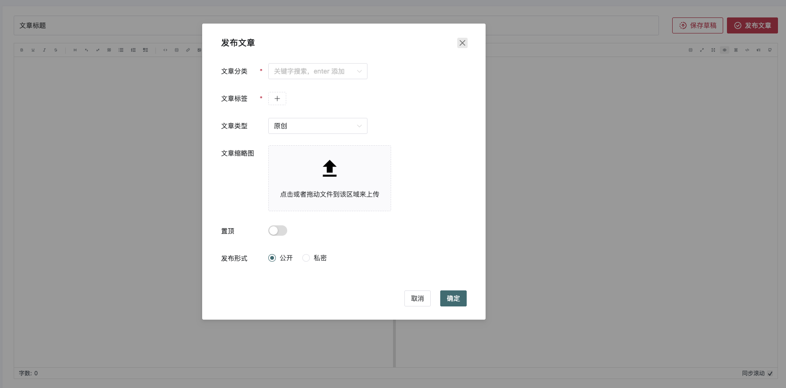

# 第九章 gin-blog-admin login-home-article-auth

## 9.1 App.vue

这段代码展示了一个 Vue 3 组件，它通过 `Naive UI` 配置全局主题和本地化，支持暗黑模式和代码高亮显示，并且使用 Vue Router 动态渲染路由组件。代码简洁、功能清晰，适合用于需要根据用户主题偏好调整界面和高亮显示代码的应用。

**全局配置**：

- 通过 `NConfigProvider` 组件全局配置了 Naive UI 的主题、语言、日期格式以及高亮库，确保整个应用的主题和本地化设置一致。

**动态路由渲染**：

- 使用 `RouterView` 和 Vue 动态组件机制，能够根据当前路由渲染对应的页面组件。`RouterView` 和 `v-slot` 的使用使得动态渲染更加灵活。

**主题切换**：

- 根据 `themeStore.darkMode` 的状态来动态切换 Naive UI 的主题，支持深色模式（dark mode）。

**代码高亮**：

- 配置了 `highlight.js` 用于代码高亮显示，特别是 JSON 格式的代码。

```vue
<template>
  <NConfigProvider class="h-full w-full" :theme="themeStore.darkMode ? darkTheme : undefined"
    :theme-overrides="themes.naiveThemeOverrides" :locale="zhCN" :date-locale="dateZhCN" :hljs="hljs">
    <RouterView v-slot="{ Component }">
      <component :is="Component" />
    </RouterView>
  </NConfigProvider>
</template>


<script setup>
import { onMounted } from 'vue'
import { NConfigProvider, darkTheme, dateZhCN, zhCN } from 'naive-ui'
import hljs from 'highlight.js/lib/core'
import json from 'highlight.js/lib/languages/json'

import { useAuthStore, useThemeStore } from '@/store'
import themes from '@/assets/themes'
import api from '@/api'

hljs.registerLanguage('json', json)
const themeStore = useThemeStore()
</script>

<style lang="scss" scoped></style>
```

可以首先生成一个src/views/error-page/404.vue

```vue
<template>
    <div>

    </div>
</template>

<script setup>

</script>

<style lang="scss" scoped>

</style>
```

可以访问 http://localhost:3333/404 暂时看到一个空白页面


## 9.2 Login 登陆界面

### 9.2.1 index.html

这段代码是一个 Vue 应用的 `index.html` 文件，它是 Vue 项目的入口文件之一，主要作用是设置页面的基本结构、引入必要的资源，并启动 Vue 应用。下面我们逐步分析每个部分的作用。

1. **`<head>` 部分**

```html
<head>
  <meta charset="UTF-8" />
  <meta http-equiv="Expires" content="0" />
  <meta http-equiv="Pragma" content="no-cache" />
  <meta http-equiv="Cache-control" content="no-cache" />
  <meta http-equiv="X-UA-Compatible" content="IE=edge,chrome=1" />
  <meta name="viewport" content="width=device-width, initial-scale=1.0" />
  <link rel="icon" type="image/svg+xml" href="/favicon.svg" />
  <link rel="stylesheet" href="/resource/loading.css" />
  <title> Gin Vue Blog </title>
</head>
```

- **`<meta charset="UTF-8" />`**：设置文档字符编码为 UTF-8，支持多语言字符集。
- **`<meta http-equiv="Expires" content="0" />`**, **`<meta http-equiv="Pragma" content="no-cache" />`**, **`<meta http-equiv="Cache-control" content="no-cache" />`**：这些标签禁用了页面的缓存，确保每次加载页面时都从服务器获取最新的内容。
- **`<meta http-equiv="X-UA-Compatible" content="IE=edge,chrome=1" />`**：确保浏览器使用最新版本的渲染引擎，兼容老旧版本的 IE 浏览器。
- **`<meta name="viewport" content="width=device-width, initial-scale=1.0" />`**：设置视口的大小，确保页面在不同设备上适配，并且支持移动端响应式设计。
- **`<link rel="icon" type="image/svg+xml" href="/favicon.svg" />`**：设置页面的 favicon 图标，通常用于浏览器标签栏显示。
- **`<link rel="stylesheet" href="/resource/loading.css" />`**：引入了外部 CSS 文件，用于加载页面时的动画效果。
- **`<title> Gin Vue Blog </title>`**：设置页面的标题。

2. **`<style>` 部分**

```html
<style>
  html,
  body {
    width: 100%;
    height: 100%;
    overflow: hidden;
  }
</style>
```

- **`width: 100%; height: 100%;`**：使 `<html>` 和 `<body>` 元素的宽高占满整个屏幕。
- **`overflow: hidden;`**：禁用页面的滚动条，确保页面不会滚动，通常在加载动画期间使用。

3. **`<body>` 部分**

```html
<body class="dark:text-#e9e9e9 auto-bg">
  <div id="app" class="w-full h-full">
    <!-- loading -->
    <div class="loading-container">
      
      <div class="loading-spin__container">
        <div class="loading-spin">
          <div class="left-0 top-0 loading-spin-item"></div>
          <div class="left-0 bottom-0 loading-spin-item loading-delay-500"></div>
          <div class="right-0 top-0 loading-spin-item loading-delay-1000"></div>
          <div class="right-0 bottom-0 loading-spin-item loading-delay-1500"></div>
        </div>
      </div>
      <div class="loading-title"> Gin Vue Blog </div>
    </div>
    <script src="/resource/loading.js"></script>
  </div>
  <script type="module" src="/src/main.ts"></script>
</body>
```

- **`<body class="dark:text-#e9e9e9 auto-bg">`**：`class="dark:text-#e9e9e9 auto-bg"` 可能是用于支持暗黑模式的样式，`text-#e9e9e9` 设置文字颜色，`auto-bg` 可能是设置背景样式的类名（具体的效果依赖于样式表）。

- `id="app"`：Vue 应用的挂载点，Vue 实例将会挂载到此 DOM 元素上。
- `class="w-full h-full"`：确保 `#app` 元素的宽度和高度占满整个页面。

- **`loading-container`**：包含了整个加载动画的容器，显示加载界面，直到 Vue 应用加载完毕。
- **`loading-logo`**：显示应用的 logo。
- **`loading-spin__container`** 和 **`loading-spin`**：这些元素包含了旋转的加载动画，具体样式和动画效果在 `loading.css` 中定义。
- **`loading-title`**：显示应用标题文本 `Gin Vue Blog`。

4. **引入 Vue 应用脚本**

```
<script type="module" src="/src/main.ts"></script>
```

- **`<script type="module" src="/src/main.ts"></script>`**：引入 Vue 应用的入口文件 `main.ts`，这是 Vue 项目的启动脚本。在这个文件中，会创建 Vue 实例、配置路由、全局状态管理等。`type="module"` 表示该脚本是一个模块化的 JavaScript 文件，采用 ES6 模块导入方式。

------

这个 `index.html` 文件为 Vue 应用提供了一个初始化界面，具体的流程如下：

1. 页面加载时显示一个加载动画（包括 logo 和旋转的加载图标）。
2. 加载动画和静态内容通过 `loading.css` 和 `loading.js` 控制。
3. Vue 应用在 `main.ts` 文件中初始化，并挂载到 `#app` 元素上。
4. 一旦 Vue 应用加载完成，加载动画会被隐藏，实际的应用界面会呈现给用户。

**这段代码为单页面应用（SPA）提供了一个良好的用户体验，确保在 Vue 应用初始化和渲染过程中，用户不会看到空白页面，而是显示一个友好的加载界面。**

```html
<!DOCTYPE html>
<html lang="cn">

<head>
  <meta charset="UTF-8" />
  <meta http-equiv="Expires" content="0" />
  <meta http-equiv="Pragma" content="no-cache" />
  <meta http-equiv="Cache-control" content="no-cache" />
  <meta http-equiv="X-UA-Compatible" content="IE=edge,chrome=1" />
  <meta name="viewport" content="width=device-width, initial-scale=1.0" />

  <!-- <meta http-equiv="Content-Security-Policy" content="upgrade-insecure-requests"> -->

  <link rel="icon" type="image/svg+xml" href="/favicon.svg" />
  <link rel="stylesheet" href="/resource/loading.css" />
  <title> Gin Vue Blog </title>
  <!-- 腾讯验证码 -->
  <!-- <script src="https://ssl.captcha.qq.com/TCaptcha.js"></script> -->
  <style>
    html,
    body {
      width: 100%;
      height: 100%;
      overflow: hidden;
    }
  </style>
</head>

<body class="dark:text-#e9e9e9 auto-bg">
  <div id="app" class="w-full h-full">
    <!-- loading -->
    <div class="loading-container">
      
      <div class="loading-spin__container">
        <div class="loading-spin">
          <div class="left-0 top-0 loading-spin-item"></div>
          <div class="left-0 bottom-0 loading-spin-item loading-delay-500"></div>
          <div class="right-0 top-0 loading-spin-item loading-delay-1000"></div>
          <div class="right-0 bottom-0 loading-spin-item loading-delay-1500"></div>
        </div>
      </div>
      <div class="loading-title"> Gin Vue Blog </div>
    </div>
    <script src="/resource/loading.js"></script>
  </div>
  <script type="module" src="/src/main.ts"></script>
</body>

</html>
```


### 9.2.2 AddPage.vue

**src/components/common/TheFooter.vue**

这段代码的目的是渲染一个简单的页脚组件，包含版权信息和指向 GitHub 的个人主页链接。组件使用了 Tailwind CSS 来进行样式布局，并动态显示当前年份。主要功能和设计如下：

1. **版权信息**：显示当前年份。
2. **GitHub 链接**：提供一个指向 GitHub 个人主页的链接，点击后会在新标签页中打开。
3. **使用了 Flexbox 布局**：实现垂直和水平居中。
4. **没有动态功能**：目前没有 JavaScript 逻辑，仅渲染静态内容。
5. **样式**：使用了 Tailwind CSS 来快速实现页面布局，但 `hover` 样式的写法存在一个小错误，需要调整为 `hover:underline` 和 `hover:text-primary`。

```vue
<template>
    <footer class="flex flex-col items-center justify-center text-gray-700">
        <p>
            Copyright©{{ new Date().getFullYear() }}
            <a href="https://github.com/Tjyy-1223" target="__blank" hover="decoration-underline color-primary">
                tjyy
            </a>
        </p>
    </footer>
</template>

<script setup>

</script>

<style lang="scss" scoped></style>
```

**src/components/common/AppPage.vue**

这个 Vue 3 组件提供了以下功能：

1. **过渡动画**：组件在切换时使用了 `fade-slide` 过渡动画，并且动画模式设置为 `out-in`，即移除旧元素后再添加新元素。
2. **页面布局**：
   - 使用 Flexbox 布局将内容垂直排列。
   - 支持暗黑模式背景色。
3. **插槽支持**：通过 `<slot />` 插入父组件传入的内容，提供灵活性。
4. **页脚**：通过 `showFooter` 属性控制是否显示 `TheFooter` 页脚组件，默认不显示。
5. **返回顶部按钮**：使用 `NBackTop` 组件来提供返回顶部功能，`bottom="20"` 设置按钮距离底部 20px。

```vue
<template>
    <Transition name="fade-slide" mode="out-in" appear>
        <section class="cus-scroll-y h-full w-full flex flex-col bg-[#f5f6fb] p-4 dark:bg-[#121212]">
            <slot />
            <TheFooter v-if="showFooter" class="mt-5" />
            <NBackTop :bottom="20" />
        </section>
    </Transition>
</template>


<script setup>
import { NBackTop } from 'naive-ui'
import TheFooter from '@/components/common/TheFooter.vue'

defineProps({
    showFooter: { type: Boolean, default: false },
})
</script>

<style lang="scss" scoped>
/* transition fade-slide */
.fade-slide-leave-active,
.fade-slide-enter-active {
    transition: all 0.3s;
}

.fade-slide-enter-from {
    opacity: 0;
    transform: translateX(-30px);
}

.fade-slide-leave-to {
    opacity: 0;
    transform: translateX(30px);
}

/* 自定义滚动条样式 */
.cus-scroll {
    overflow: auto;

    &::-webkit-scrollbar {
        width: 8px;
        height: 8px;
    }
}

.cus-scroll-x {
    overflow-x: auto;

    &::-webkit-scrollbar {
        width: 0;
        height: 8px;
    }
}

.cus-scroll-y {
    overflow-y: auto;

    &::-webkit-scrollbar {
        width: 8px;
        height: 0;
    }
}

.cus-scroll,
.cus-scroll-x,
.cus-scroll-y {
    &::-webkit-scrollbar-thumb {
        background-color: transparent;
        border-radius: 4px;
    }

    &:hover {
        &::-webkit-scrollbar-thumb {
            background: #bfbfbf;
        }

        &::-webkit-scrollbar-thumb:hover {
            background: var(--primary-color);
        }
    }
}
</style>
```


### 9.2.3 Login.vue


**src/views/Login.vue**

**页面结构**：整个页面布局简单清晰，左侧为登录框的 `Banner` 图，右侧为表单，用户可以输入用户名、密码并选择是否记住登录信息。

**逻辑实现**：组件通过 `vuex` 的 `store` 和 `localStorage` 来管理用户的登录状态，实现了动态路由和用户信息的获取。

**样式**：通过 Tailwind CSS 实现响应式布局和现代化的用户界面，背景图和登录框的设计简洁美观。

```vue
<template>
    <!-- FIXME: 使用 style="background-image: url(/image/login_bg.webp);" 不生效, 需要写到 style 里的 class 中 -->
    <!-- AppPage 是一个容器，可能是用于整个页面的布局，使用了背景图片和背景覆盖的类 -->
    <AppPage class="backgroundImg bg-cover">
        <!-- 这里设置了一个白色半透明的登录框，并将其居中显示 -->
        <div style="transform: translateY(25px)"
            class="m-auto max-w-[700px] min-w-[345px] flex items-center justify-center rounded-2 bg-white bg-opacity-60 p-4 shadow">
            <!-- 登录框左侧的 Banner 图，仅在 md 屏幕以上显示 -->
            <div class="hidden w-[380px] px-5 py-9 md:block">
                
            </div>

            <!-- 登录框右侧的内容区域，用于显示登录表单 -->
            <div class="w-[320px] flex flex-col px-4 py-9 space-y-5.5">
                <!-- 登录框顶部的 logo 和标题 -->
                <h5 class="flex items-center justify-center text-2xl text-gray font-normal">
                    <!-- Logo 图标 -->
                    
                    <!-- 页面标题，绑定了 title 数据 -->
                    <span> {{ title }} </span>
                </h5>

                <!-- 用户名输入框，使用 Naive UI 的 NInput 组件 -->
                <!-- v-model:value 双向绑定用户名，设置最大长度为 20 -->
                <NInput v-model:value="loginForm.username" class="h-[50px] items-center pl-2" autofocus
                    placeholder="test@qq.com" :maxlength="20" />

                <!-- 密码输入框，使用 Naive UI 的 NInput 组件 -->
                <!-- 显示密码的切换功能通过 show-password-on 属性实现，设置最大长度为 20 -->
                <!-- 按下回车键时触发 handleLogin 方法 -->
                <NInput v-model:value="loginForm.password" class="h-[50px] items-center pl-2" type="password"
                    show-password-on="mousedown" placeholder="11111" :maxlength="20" @keydown.enter="handleLogin" />

                <!-- 记住我复选框，双向绑定 isRemember 状态 -->
                <NCheckbox :checked="isRemember" label="记住我" :on-update:checked="(val) => (isRemember = val)" />

                <!-- 登录按钮，绑定 loading 状态，点击时触发 handleLogin 方法 -->
                <NButton class="h-[50px] w-full rounded-5" type="primary" :loading="loading" @click="handleLogin">
                    登录
                </NButton>
            </div>
        </div>
    </AppPage>
</template>


<script setup>
import { reactive, ref } from 'vue'
import { useRoute, useRouter } from 'vue-router'
import { useStorage } from '@vueuse/core'
import { NButton, NCheckbox, NInput } from 'naive-ui'

import AppPage from '@/components/common/AppPage.vue'

import { addDynamicRoutes } from '@/router' // 用于添加动态路由
import { getLocal, removeLocal, setLocal } from '@/utils' // 本地存储操作工具
import { useAuthStore, useUserStore } from '@/store' // 状态管理中的用户和认证 store
import api from '@/api' // API 请求封装

// 获取环境变量中的网站标题
const title = import.meta.env.VITE_TITLE // 环境变量中读取

// 从 store 中获取用户认证和信息
const userStore = useUserStore()
const authStore = useAuthStore()

// 创建 router 和 route 实例，用于页面跳转和获取 URL 查询参数
const router = useRouter()
const { query } = useRoute()

// 初始化登录表单的用户名和密码
const loginForm = reactive({
    username: 'guest', // 默认用户名为 'guest'
    password: '123456', // 默认密码为 '123456'
})

// 在组件初始化时，尝试从本地存储中获取保存的登录信息
initLoginInfo()

// 从 localStorage 中获取记住的用户名和密码
function initLoginInfo() {
    const localLoginInfo = getLocal('loginInfo') // 获取存储在 localStorage 中的登录信息
    if (localLoginInfo) {
        // 如果存在，则将用户名和密码填充到登录表单中
        loginForm.username = localLoginInfo.username
        loginForm.password = localLoginInfo.password
    }
}

// 使用 vueuse 提供的 useStorage 创建响应式的本地存储变量
const isRemember = useStorage('isRemember', false) // 用于判断是否记住密码
const loading = ref(false) // 控制登录按钮的加载状态

// 处理登录的函数
async function handleLogin() {
    const { username, password } = loginForm // 获取表单中的用户名和密码
    if (!username || !password) {
        // 如果用户名或密码为空，弹出警告提示
        $message.warning('请输入用户名和密码')
        return
    }

    // 登录操作的具体实现
    const doLogin = async (username, password) => {
        loading.value = true // 设置加载状态为 true，表示正在执行登录请求

        // 调用登录接口进行用户身份验证
        try {
            const resp = await api.login({ username, password }) // 向后端发送登录请求
            authStore.setToken(resp.data.token) // 登录成功后，将获取到的 token 存储到 authStore 中

            // 获取用户信息，并添加动态路由
            await userStore.getUserInfo()
            await addDynamicRoutes()

            // 根据是否勾选“记住我”来保存或删除用户名和密码
            isRemember ? setLocal('loginInfo', { username, password }) : removeLocal('loginInfo')

            // 弹出登录成功的提示消息
            $message.success('登录成功')

            // 根据 URL 中的 redirect 查询参数进行跳转
            if (query.redirect) {
                const path = query.redirect
                Reflect.deleteProperty(query, 'redirect') // 删除 query 对象中的 redirect 属性
                router.push({ path, query }) // 跳转到原本的目标路径
            }
            else {
                // 如果没有 redirect 参数，则跳转到首页
                router.push('/')
            }
        }
        finally {
            loading.value = false // 无论登录成功或失败，都结束加载状态
        }
    }

    // 执行登录操作
    doLogin(username, password)
}
</script>


<style lang="scss" scoped>
.backgroundImg {
    background-image: url(/image/login_bg.webp);
}
</style>
```


## 9.3 Home 界面搭建

### 9.3.1 home/index.vue


**主要代码位于 src/views/home**

这个 Vue 3 组件展示了用户的个人信息、统计数据以及项目卡片。其主要功能包括：

1. **用户信息**：显示头像、昵称和一句话。通过 `useUserStore` 获取用户信息，动态加载一句话。
2. **统计信息**：通过 API 获取并显示访问量、用户量、文章量和留言量。
3. **项目卡片**：显示一组项目卡片，其中包含项目标题和描述。

该组件结合了 `naive-ui` 组件库的使用，展示了一种现代的网页布局和交互方式。

```vue
<template>
    <!-- 外层容器是一个 AppPage 组件，包裹整个页面 -->
    <AppPage>
        <div class="flex-1">

            <!-- 用户信息卡片 -->
            <NCard>
                <div class="flex items-center">
                    <!-- 用户头像，圆形，大小为 60px -->
                    <NAvatar round :size="60" :src="avatar" />
                    <div class="ml-5">
                        <!-- 显示用户昵称 -->
                        <p> Hello, {{ nickname }} </p>
                        <!-- 使用线性渐变的文本显示一句话 -->
                        <NGradientText class="mt-1 op-60"
                            gradient="linear-gradient(90deg, red 0%, green 50%, blue 100%)">
                            {{ sentence }}
                        </NGradientText>
                    </div>
                    <div class="ml-auto flex items-center">
                        <!-- 显示 GitHub 项目的 Stars 数量 -->
                        <NStatistic label="Stars" class="w-[80px]">
                            <a href="https://github.com/szluyu99/gin-vue-blog" target="_blank">
                                
                            </a>
                        </NStatistic>
                        <!-- 显示 GitHub 项目的 Forks 数量 -->
                        <NStatistic label="Forks" class="ml-10 w-[100px]">
                            <a href="https://github.com/szluyu99/gin-vue-blog" target="_blank">
                                
                            </a>
                        </NStatistic>
                    </div>
                </div>
            </NCard>

            <!-- 首页统计信息展示，使用 NGrid 布局 -->
            <NGrid class="mt-4" x-gap="12" :cols="4">
                <!-- v-for 遍历数组渲染每个统计项 -->
                <template v-for="item of [
                    { icon: 'i-fa6-solid:users', color: 'text-[#40C9C6]', label: '访问量', key: 'view_count' },
                    { icon: 'i-heroicons:users-solid', color: 'text-[#34BFA3]', label: '用户量', key: 'user_count' },
                    { icon: 'i-material-symbols:article', color: 'text-[#F4516C]', label: '文章量', key: 'article_count' },
                    { icon: 'i-bxs:comment-dots', color: 'text-[#36A3F7]', label: '留言量', key: 'message_count' },
                ]" :key="item.key">
                    <!-- 每个统计项的布局 -->
                    <NGi>
                        <NCard>
                            <!-- 图标部分，大小为 60px，并根据数据动态设置颜色和图标 -->
                            <span class="text-[60px]" :class="[item.icon, item.color]" />
                            <!-- 显示统计数据 -->
                            <NStatistic class="float-right" :label="item.label">
                                {{ homeInfo[item.key] ?? 'unknown' }} <!-- 如果数据不存在，显示 'unknown' -->
                            </NStatistic>
                        </NCard>
                    </NGi>
                </template>
            </NGrid>

            <!-- 项目展示卡片，待完善首页设计 -->
            <NCard title="项目" size="small" class="mt-4">
                <!-- 卡片的右上角有一个额外的按钮 -->
                <template #header-extra>
                    <NButton text type="primary">
                        更多
                    </NButton>
                </template>
                <!-- v-for 渲染 5 个项目卡片 -->
                <NCard v-for="i in 5" :key="i" class="my-2 w-[300px] flex-shrink-0 cursor-pointer hover:shadow-lg"
                    title="Gin Blog Admin" size="small">
                    <!-- 项目描述 -->
                    <p class="op-60">
                        这是个基于 gin 开发的博客管理后台
                    </p>
                </NCard>
            </NCard>
        </div>
    </AppPage>
</template>


<script setup>
import { onMounted, ref } from 'vue'
import { NAvatar, NButton, NCard, NGi, NGradientText, NGrid, NStatistic } from 'naive-ui'

import AppPage from '@/components/common/AppPage.vue'
import { useUserStore } from '@/store'
import api from '@/api'

const { nickname, avatar } = useUserStore()

const homeInfo = ref({
    view_count: 0,
    user_count: 0,
    article_count: 0,
    message_count: 0,
})

onMounted(async () => {
    getOneSentence()
    const res = await api.getHomeInfo()
    homeInfo.value = res.data
})

// 一言
const sentence = ref('')
async function getOneSentence() {
    fetch('https://v1.hitokoto.cn?c=i')
        .then(resp => resp.json())
        .then(data => sentence.value = data.hitokoto)
        .catch(() => sentence.value = '宠辱不惊，看庭前花开花落；去留无意，望天上云卷云舒。')
}
</script>

<style lang="scss" scoped></style>
```

**src/views/home/route.js**

```javascript
const Layout = () => import('@/layout/index.vue')

export default {
    name: 'Home',
    path: '/',
    component: Layout,
    redirect: '/home',
    meta: {
        order: 0,
    },
    isCatalogue: true,
    children: [
        {
            name: 'Home',
            path: 'home',
            component: () => import('./index.vue'),
            meta: {
                title: '首页',
                icon: 'ic:sharp-home',
                order: 0,
            },
        },
    ],
}
```


## 9.4 Article 相关界面搭建

### 9.4.1 route.js

```javascript
const Layout = () => import('@/layout/index.vue')

export default {
  name: 'Article',
  path: '/article',
  component: Layout,
  redirect: '/article/list',
  meta: {
    title: '文章管理',
    icon: 'ic:twotone-article',
    order: 2,
    // role: ['admin'],
    // requireAuth: true,
  },
  children: [
    {
      name: 'ArticleList',
      path: 'list',
      component: () => import('./list/index.vue'),
      meta: {
        title: '文章列表',
        icon: 'material-symbols:format-list-bulleted',
        // role: ['admin'],
        // requireAuth: true,
        keepAlive: true,
      },
    },
    {
      name: 'ArticleWrite',
      path: 'write',
      component: () => import('./write/index.vue'),
      meta: {
        title: '发布文章',
        icon: 'icon-park-outline:write',
        // role: ['admin'],
        // requireAuth: true,
        keepAlive: true,
      },
    },
    {
      name: 'ArticleEdit',
      path: 'write/:id',
      component: () => import('./write/index.vue'),
      isHidden: true,
      meta: {
        title: '编辑文章',
        icon: 'icon-park-outline:write',
        // role: ['admin'],
        // requireAuth: true,
        // keepAlive: true,
      },
    },
    {
      name: 'CategoryList',
      path: 'category-list',
      component: () => import('./category/index.vue'),
      meta: {
        title: '分类管理',
        icon: 'tabler:category',
        // role: ['admin'],
        // requireAuth: true,
        keepAlive: true,
      },
    },
    {
      name: 'TagList',
      path: 'tag-list',
      component: () => import('./tag/index.vue'),
      meta: {
        title: '标签管理',
        icon: 'tabler:tag',
        keepAlive: true,
      },
    },
  ],
}
```


### 9.4.2 category/index.vue

#### 1 CommonPage.vue

src/components/common/CommonPage.vue

这个组件的目的是封装一个具有可选页头和页脚的页面结构。通过插槽和属性灵活控制头部内容、操作按钮和是否显示页脚。它使用了 Vue 3 的 `script setup` 和 `naive-ui` 组件库来构建简洁、可复用的页面结构。

如果你需要进一步的优化或自定义，可能会根据需求调整插槽的内容或样式。

```vue
<template>
    <AppPage :show-footer="showFooter">
        <header v-if="showHeader" class="mb-3.5 min-h-[45px] flex items-center justify-between px-1">
            <slot v-if="$slots.header" name="header" />
            <template v-else>
                <h2 class="text-2xl text-[#333] font-normal dark:text-[#ccc]">
                    {{ title || $route.meta?.title }}
                </h2>
                <div class="space-x-5">
                    <slot name="action" />
                </div>
            </template>
        </header>
        <NCard class="flex-1">
            <slot />
        </NCard>
    </AppPage>
</template>

<script setup>
import { NCard } from 'naive-ui'
import AppPage from './AppPage.vue'

defineProps({
    showFooter: { type: Boolean, default: false },
    showHeader: { type: Boolean, default: true },
    title: { type: String, default: undefined },
})
</script>

<style lang="scss" scoped></style>
```


#### 2 CrudModal.vue

**src/components/crud/CrudModal.vue**

**这段代码定义了一个模态框组件，具有以下特点：**

- 支持自定义宽度、标题、按钮文本以及显示/隐藏控制。
- 使用了 Naive UI 的 `NModal` 和 `NButton` 组件来实现模态框和按钮。
- 支持插槽，允许父组件自定义模态框内容或底部按钮。
- 通过 `v-model` 和事件 (`update:visible`, `save`) 处理与父组件的交互。

你可以通过传递不同的属性来控制模态框的显示、内容、按钮文本等内容，并能通过事件与父组件进行交互。

```vue
<template>
    <NModal v-model:show="show" :style="{ width }" preset="card" :title="title" size="huge" :bordered="false">
        <slot />
        <template v-if="showFooter" #footer>
            <footer class="flex justify-end space-x-5">
                <slot name="footer">
                    <NButton @click="show = false">
                        {{ cancelText }}
                    </NButton>
                    <NButton :loading="loading" type="primary" @click="emit('save')">
                        {{ okText }}
                    </NButton>
                </slot>
            </footer>
        </template>
    </NModal>
</template>


<script setup>
import { computed } from 'vue'
import { NButton, NModal } from 'naive-ui'

const props = defineProps({
    visible: { type: Boolean, required: true },
    width: { type: String, default: '600px' },
    title: { type: String, default: '' },
    showFooter: { type: Boolean, default: true },
    loading: { type: Boolean, default: false },
    cancelText: { type: String, default: '取消' },
    okText: { type: String, default: '确定' },
})

const emit = defineEmits(['update:visible', 'save'])

const show = computed({
    get: () => props.visible,
    set: v => emit('update:visible', v),
})
</script>

<style lang="scss" scoped></style>
```


#### 3 CrudTable.vue

src/components/crud/CrudTable.vue

这段代码构建了一个带有查询栏、表格展示、分页、重置、搜索、和导出功能的 Vue 3 组件。通过与父组件的交互，支持动态查询、数据更新、行选择和导出操作。该组件非常适用于需要展示大量数据并提供灵活操作的场景。

1. **分页和远程请求**：
   - 支持前端分页和后端分页，根据 `remote` 和 `isPagination` 控制分页行为。
2. **重置和搜索**：
   - 提供了搜索和重置功能，能够根据查询条件刷新表格数据。
3. **导出功能**：
   - 支持导出表格数据为 Excel 文件，使用 `xlsx` 库实现。
4. **事件交互**：
   - 通过 `emit` 向父组件传递更新的数据或事件（例如更新查询条件、选中行、排序等）。

```vue
<template>
    <!-- 如果插槽 queryBar 存在，则渲染查询栏 -->
    <div v-if="$slots.queryBar"
        class="mb-7 min-h-[60px] flex items-start justify-between border border-gray-200 border-gray-400 rounded-2 border-solid bg-gray-50 p-3.5 dark:bg-black dark:bg-opacity-5">

        <!-- 使用 Naive UI 的 NSpace 来布局查询栏，设置间距 -->
        <NSpace wrap :size="[35, 15]">
            <!-- 渲染插槽 queryBar，允许父组件自定义查询条件部分 -->
            <slot name="queryBar" />
        </NSpace>

        <!-- 按钮区域，包含重置和搜索按钮 -->
        <div class="flex-shrink-0 space-x-4">
            <!-- 重置按钮，点击时触发 handleReset 方法 -->
            <NButton ghost type="primary" @click="handleReset">
                <template #icon>
                    <!-- 重置按钮的图标 -->
                    <i class="i-lucide:rotate-ccw" />
                </template>
                重置
            </NButton>

            <!-- 搜索按钮，点击时触发 handleSearch 方法 -->
            <NButton type="primary" @click="handleSearch">
                <template #icon>
                    <!-- 搜索按钮的图标 -->
                    <i class="i-fe:search" />
                </template>
                搜索
            </NButton>

            <!-- TODO: 未来可以添加额外的插槽，允许用户自定义其他按钮 -->
        </div>
    </div>

    <NDataTable :remote="remote" :loading="loading" :scroll-x="scrollX" :columns="columns" :data="tableData"
        :row-key="(row) => row[rowKey]" :single-line="singleLine" :pagination="isPagination ? pagination : false"
        :checked-row-keys="selections" @update:checked-row-keys="onChecked" @update:page="onPageChange"
        @update:sorter="onSorterChange" />

</template>


<script setup>
// 导入 Vue 和 Naive UI 的相关模块
import { nextTick, reactive, ref } from 'vue'
import { NButton, NDataTable, NSpace } from 'naive-ui'
import { utils, writeFile } from 'xlsx'

// 定义接收的 props 参数
const props = defineProps({
    /** 是否不设定列的分割线 */
    singleLine: { type: Boolean, default: false },
    /** true: 后端分页 false: 前端分页 */
    remote: { type: Boolean, default: true },
    /** 是否分页 */
    isPagination: { type: Boolean, default: true },
    /** 表格内容的横向宽度 */
    scrollX: { type: Number, default: 1200 },
    /** 主键 name */
    rowKey: { type: String, default: 'id' },
    /** 需要展示的列 */
    columns: { type: Array, required: true },
    /** queryBar 中的参数 */
    queryItems: {
        type: Object,
        default() { return {} },
    },
    /** 补充参数（可选） */
    extraParams: {
        type: Object,
        default() { return {} },
    },
    /** 获取数据的请求 API */
    getData: {
        type: Function,
        required: true,
    },
})

// 定义组件需要触发的事件
const emit = defineEmits(['update:queryItems', 'checked', 'dataChange', 'sorterChange'])

// 定义表格的加载状态、选中行、表格数据等响应式变量
const loading = ref(false) // 表示是否正在加载数据
const selections = ref([]) // 存储当前选中的行的 rowKey（主键）
const tableData = ref([]) // 存储表格的数据
const initQuery = { ...props.queryItems } // 初始化查询条件

// 分页配置，控制分页行为
const pagination = reactive({
    page: 1, // 当前页
    pageSize: 10, // 每页条数
    showSizePicker: true, // 是否显示选择每页多少条的选项
    pageSizes: [5, 10, 20], // 每页条数的选择范围
    // 分页变化时触发
    onChange: (page) => {
        pagination.page = page
        handleQuery()
    },
    // 页面大小变化时触发
    onUpdatePageSize: (pageSize) => {
        pagination.page = 1 // 重置为第一页
        pagination.pageSize = pageSize
        handleQuery()
    },
    // 显示分页信息的前缀
    prefix({ itemCount }) {
        return `共 ${itemCount} 条`
    },
})

// 请求数据的核心方法
async function handleQuery() {
    selections.value = [] // 重置选中的行

    try {
        loading.value = true // 开始加载数据
        let paginationParams = {}
        // 如果启用了分页并且是远程分页，则加入分页参数
        if (props.isPagination && props.remote) {
            paginationParams = {
                page_num: pagination.page,
                page_size: pagination.pageSize,
            }
        }
        // 调用父组件传递的 getData 函数请求数据
        const { data } = await props.getData({
            ...props.queryItems, // 当前的查询条件
            ...props.extraParams, // 补充的额外参数
            ...paginationParams, // 分页参数
        })
        // 更新表格数据
        tableData.value = data?.page_data || data
        pagination.itemCount = data?.total ?? data.length // 更新总数据条数
    }
    catch (error) {
        tableData.value = [] // 请求失败时清空表格数据
        pagination.itemCount = 0 // 重置数据总数
    }
    finally {
        emit('dataChange', tableData.value) // 通知父组件表格数据发生变化
        loading.value = false // 结束加载状态
    }
}

// 搜索按钮点击时的处理函数
function handleSearch() {
    pagination.page = 1 // 搜索时回到第一页
    handleQuery() // 重新请求数据
}

// 重置按钮点击时的处理函数
async function handleReset() {
    const queryItems = { ...props.queryItems } // 拷贝查询条件
    // 重置查询条件中的所有字段为 null
    for (const key in queryItems) {
        queryItems[key] = null // 注意类型问题，可能需要根据实际类型来重置
    }
    // 更新查询条件
    emit('update:queryItems', { ...queryItems, ...initQuery })
    await nextTick() // 等待 DOM 更新
    pagination.page = 1 // 回到第一页
    handleQuery() // 重新请求数据
}

// 分页变化时的处理函数
function onPageChange(currentPage) {
    pagination.page = currentPage // 更新当前页
    props.remote && handleQuery() // 如果是远程分页，则重新请求数据
}

// 表格行选择变化时的处理函数
function onChecked(rowKeys) {
    selections.value = rowKeys // 更新选中的行
    // 如果表格有选择列，则触发父组件的 'checked' 事件
    if (props.columns.some(item => item.type === 'selection')) {
        emit('checked', rowKeys)
    }
}

// 排序变化时的处理函数
function onSorterChange(sorter) {
    emit('sorterChange', sorter) // 通知父组件排序变化
}

// 导出功能，导出当前表格数据为 Excel 文件
function handleExport(columns = props.columns, data = tableData.value) {
    if (!data?.length) {
        return window.$message.warning('没有数据') // 如果没有数据，则提示
    }
    // 过滤掉没有标题或者设置了隐藏的列
    const columnsData = columns.filter(item => !!item.title && !item.hideInExcel)
    const thKeys = columnsData.map(item => item.key) // 获取列的 key
    const thData = columnsData.map(item => item.title) // 获取列的标题
    const trData = data.map(item => thKeys.map(key => item[key])) // 获取每一行的数据

    // 使用 xlsx 库创建工作表
    const sheet = utils.aoa_to_sheet([thData, ...trData])
    const workBook = utils.book_new() // 创建新的工作簿
    utils.book_append_sheet(workBook, sheet, '数据报表') // 将工作表添加到工作簿
    writeFile(workBook, '数据报表.xlsx') // 导出为 Excel 文件
}

// 暴露给父组件的 API 方法
defineExpose({
    handleQuery,
    handleSearch,
    handleReset,
    handleExport,
    selections,
    tableData,
})
</script>


<style lang="scss" scoped></style>
```


#### 4 QueryItem.vue

src/components/crud/QueryItem.vue

该组件适合用于表单或其他类似的布局场景，其中每一行显示一个标签和值，且希望能够控制标签和内容区域的宽度。例如，用于显示表单字段的名称和对应的输入框或其他内容。

1. **标签和内容布局**：这个组件主要用于显示一组标签和值对的布局。标签和内容部分通过 Flexbox 水平排列，且可以灵活控制标签和内容的宽度。
   - `labelWidth` 控制标签的宽度。
   - `contentWidth` 控制内容部分的宽度。
2. **插槽**：通过 `<slot />`，该组件可以插入自定义内容，允许父组件动态传入各种内容（例如输入框、文本等）。
3. **动态样式**：通过 `:style` 绑定，可以根据父组件传入的 `labelWidth` 和 `contentWidth` 控制元素的宽度，提升了组件的灵活性和可复用性。

```vue
<template>
    <div class="flex items-center">
        <label v-if="label" class="flex-shrink-0" :style="{ width: `${labelWidth}px` }">
            {{ label }}
        </label>
        <div class="flex-shrink-0" :style="{ width: `${contentWidth}px` }">
            <slot />
        </div>
    </div>
</template>

<script setup>
defineProps({
    label: { type: String, default: '' },
    labelWidth: { type: Number, default: 80 },
    contentWidth: { type: Number, default: 220 },
})
</script>

<style lang="scss" scoped></style>
```


#### 5 composables

**src/compostables/useCRUD.js**

1. **`useCRUD` 函数**：提供一个封装的 CRUD 操作，通过传入配置对象（如表单名称、初始化数据、创建/删除/更新函数等），返回一组与表单和弹框交互的逻辑。
2. **`modalAction`**：控制当前弹窗的操作类型（新增、编辑、查看），通过该值动态更新弹窗标题。
3. **`handleSave`**：根据当前操作类型，调用相应的 API（新增或更新），并且提供了成功后回调的功能（例如成功提示、刷新数据等）。
4. **`handleDelete`**：支持单条和批量删除，可以在删除前弹出确认框。

注释将帮助你或其他开发者更好地理解代码的业务逻辑和结构。

```javascript
import { computed, ref } from 'vue'
import { useForm } from './useForm'

const ACTIONS = {
  view: '查看',   // 查看操作
  edit: '编辑',   // 编辑操作
  add: '新增',    // 新增操作
}

/**
 * @typedef {object} FormObject
 * @property {string} name - 名称，表单模块的名称
 * @property {object} initForm - 初始表单数据，作为表单默认值
 * @property {Function} doCreate - 执行创建操作的函数
 * @property {Function} doDelete - 执行删除操作的函数
 * @property {Function} doUpdate - 执行更新操作的函数
 * @property {Function} refresh - 刷新操作，用来更新界面
 */

/**
 * 可复用的 CRUD 操作
 * @param {FormObject} options - 包含了CRUD操作所需的配置项，如表单名称、初始化表单数据、创建、删除、更新函数等
 */
export function useCRUD({ name, initForm = {}, doCreate, doDelete, doUpdate, refresh }) {
  const modalVisible = ref(false) // 弹框是否显示的状态
  /** @type {'add' | 'edit' | 'view'} 弹窗操作类型 */
  const modalAction = ref('') // 当前操作类型，用于控制是新增、编辑还是查看
  /** 弹窗加载状态 */
  const modalLoading = ref(false) // 弹窗是否在加载中
  /** 弹窗标题 */
  const modalTitle = computed(() => ACTIONS[modalAction.value] + name) // 根据当前操作类型动态生成弹窗标题

  // 表单模型和表单引用
  const { formModel: modalForm, formRef: modalFormRef, validation } = useForm(initForm)

  /** 新增操作 */
  function handleAdd() {
    modalAction.value = 'add' // 设置操作类型为“新增”
    modalVisible.value = true // 显示弹框
    modalForm.value = { ...initForm } // 重置表单为初始化的默认值
  }

  /** 修改操作 */
  function handleEdit(row) {
    modalAction.value = 'edit' // 设置操作类型为“编辑”
    modalVisible.value = true // 显示弹框
    modalForm.value = { ...row } // 设置表单数据为选中的行数据
  }

  /** 查看操作 */
  function handleView(row) {
    modalAction.value = 'view' // 设置操作类型为“查看”
    modalVisible.value = true // 显示弹框
    modalForm.value = { ...row } // 设置表单数据为选中的行数据
  }

  /** 保存操作，处理新增或编辑 */
  async function handleSave() {
    // 只有在“新增”或“编辑”时才进行保存操作
    if (!['edit', 'add'].includes(modalAction.value)) {
      modalVisible.value = false // 关闭弹框
      return
    }

    // 校验表单是否合法
    if (!(await validation())) {
      return false
    }

    // 根据操作类型选择对应的 API 函数和回调
    const actions = {
      add: {
        api: () => doCreate(modalForm.value), // 调用新增接口
        cb: () => window.$message.success('新增成功'), // 新增成功后的回调
      },
      edit: {
        api: () => doUpdate(modalForm.value), // 调用更新接口
        cb: () => window.$message.success('编辑成功'), // 编辑成功后的回调
      },
    }
    const action = actions[modalAction.value]

    try {
      modalLoading.value = true // 开始加载
      const data = await action.api() // 调用对应的 API 函数
      action.cb() // 执行操作成功后的回调
      modalLoading.value = modalVisible.value = false // 关闭加载状态和弹框
      data && refresh(data) // 刷新数据
    }
    catch (error) {
      console.error(error) // 错误处理
      modalLoading.value = false // 关闭加载状态
    }
  }

  /**
   * 删除操作，支持单条删除和批量删除
   * @param {Array} ids - 要删除的主键数组，单条删除传入单个 id，批量删除传入 id 数组
   * @param {boolean} needConfirm - 是否需要确认窗口
   */
  async function handleDelete(ids, needConfirm = true) {
    // 如果没有选中任何数据，则提示用户选择数据
    if (!ids || (Array.isArray(ids) && !ids.length)) {
      window.$message.info('请选择要删除的数据')
      return
    }

    // 调用删除接口
    const callDeleteAPI = async () => {
      try {
        modalLoading.value = true // 显示加载状态

        // 判断是否是批量删除或单条删除
        let data
        if (typeof ids === 'number' || typeof ids === 'string') {
          data = await doDelete(ids) // 单条删除
        }
        else {
          data = await doDelete(JSON.stringify(ids)) // 批量删除
        }

        // 针对软删除的情况做判断
        if (data?.code === 0) {
          window.$message.success('删除成功') // 删除成功后提示
        }
        modalLoading.value = false // 关闭加载状态
        refresh(data) // 刷新数据
      }
      catch (error) {
        console.error(error) // 错误处理
        modalLoading.value = false // 关闭加载状态
      }
    }

    // 如果需要确认窗口，则弹出确认框
    if (needConfirm) {
      window.$dialog.confirm({
        content: '确定删除？', // 确认删除提示文本
        confirm: () => callDeleteAPI(), // 点击确认后的操作
      })
    }
    else {
      callDeleteAPI() // 直接调用删除操作
    }
  }

  // 返回可供外部使用的函数和状态
  return {
    modalVisible,
    modalAction,
    modalTitle,
    modalLoading,
    handleAdd,
    handleDelete,
    handleEdit,
    handleView,
    handleSave,
    modalForm,
    modalFormRef,
  }
}
```

**src/compostables/useForm.js**

1. **`formRef`**：用于引用表单实例，通过 `ref` 获取表单的 DOM 实例，主要用来调用表单方法，如验证（`validate`）。
2. **`formModel`**：存储表单的实际数据。它是一个响应式对象，通过修改该对象的属性来控制表单字段的值。
3. **`validation`**：异步函数，通过 `formRef` 获取的表单实例来执行验证。返回 `true` 表示验证成功，返回 `false` 表示验证失败。
4. **`rules`**：定义了一个常见的验证规则（必填），可以根据需要扩展更多的规则，如格式验证、最大长度验证等。

这些注释应该帮助你和其他开发者更好地理解该代码的功能和用途。

```javascript
import { ref } from 'vue'

/**
 * 可复用的表单对象
 * 该函数用于封装表单的状态管理、验证逻辑以及表单规则的配置，可以在多个组件中复用。
 * @param {any} initForm 表单初始值，用来初始化表单数据
 * @returns {object} 返回一个包含表单引用、表单模型、验证函数和表单规则的对象
 */
export function useForm(initForm = {}) {
  const formRef = ref(null) // 表单的引用，用来获取表单实例进行操作（如验证）
  const formModel = ref({ ...initForm }) // 表单模型，保存表单数据，初始值为传入的 `initForm`

  /**
   * 表单验证函数
   * 该函数会触发表单验证，验证通过返回 `true`，否则返回 `false`
   * @returns {boolean} 验证是否通过
   */
  const validation = async () => {
    try {
      // 调用表单实例的 `validate` 方法进行表单验证
      await formRef.value?.validate()
      return true // 验证成功，返回 true
    }
    catch (error) {
      return false // 验证失败，返回 false
    }
  }

  // 表单字段的验证规则
  const rules = {
    required: {
      required: true,  // 必填项
      message: '此为必填项',  // 错误提示信息
      trigger: ['blur', 'change'],  // 在 `blur`（失去焦点）或 `change`（值改变）时触发验证
    },
  }

  // 返回包含表单引用、表单模型、验证方法和表单规则的对象
  return { formRef, formModel, validation, rules }
}
```

src/compostables/index.js

```javascript
export * from './useCRUD'
export * from './useForm'
```


#### 6 index.js

**CrudTable**


**CrudModal:**


**src/views/article/category/index.vue**

- **查询功能**：用户可以通过分类名进行查询，查询结果会根据输入的关键字进行过滤。
- **增、改、删功能**：通过 `handleAdd`、`handleEdit` 和 `handleDelete` 方法实现增、改、删操作，具体的业务逻辑在 API 层（`api.saveOrUpdateCategory`, `api.deleteCategory`）处理。
- **表格导出**：点击导出按钮时，调用表格的 `handleExport` 方法实现导出功能。

这段代码展示了一个 Vue 3 + Naive UI 实现的“分类管理”页面，包含了常见的增删改查操作和数据展示功能。它将业务逻辑分为多个组件，便于复用和维护。以下是对代码的详细分析：

1. **整体结构**

- **模板部分** (`<template>`): 定义了页面的视图结构，包括顶部操作按钮、查询框、数据表格以及新增/编辑分类的弹窗。
- **脚本部分** (`<script setup>`): 通过 Vue 3 的 `<script setup>` 语法定义了组件的逻辑，包括数据管理、方法绑定、表格列配置等。
- **样式部分** (`<style scoped>`): 使用了 scoped 样式来确保样式仅作用于当前组件。

2. **页面内容**

2.1 `CommonPage` 组件

- 该组件作为页面的容器，接受 `title` 属性来设置页面标题。
- action 插槽内放置了三个按钮：导出、添加分类和批量删除。
  - **导出**按钮：点击时调用 `$table?.handleExport()` 导出表格数据。
  - **新建分类**按钮：点击时弹出新建分类表单。
  - **批量删除**按钮：点击时删除当前选中的分类（通过 `$table?.selections` 获取选中的行）。

2.2 `CrudTable` 组件

- 这是一个复用的表格组件，接受：
  - `query-items`: 用于表格查询条件（如分类名）。
  - `columns`: 表格的列配置。
  - `get-data`: 用于获取表格数据的 API（这里是 `api.getCategorys`）。
- **查询栏**(`queryBar` 插槽)：提供了一个分类名称的输入框，用于按分类名称进行搜索。

2.3 `CrudModal` 组件

- 这是一个复用的弹窗组件，展示表单，接受以下属性：
  - `visible`: 控制弹窗的显示与隐藏。
  - `title`: 弹窗标题。
  - `loading`: 控制弹窗保存操作的加载状态。
- 弹窗中包含了一个分类名称的输入框，并且提供了表单验证（必填）。

2.4 表格列配置 (`columns`)

- 表格中包含以下列：
  - **分类名**：显示分类名称，宽度 100，居中显示。
  - **文章量**：显示分类下的文章数量，宽度 30，居中显示。
  - **创建日期**：通过 `NButton` 显示创建日期，并用图标展示。日期格式通过 `formatDate` 函数格式化。
  - **更新日期**：同样通过 `NButton` 显示更新日期，格式化后显示。
  - **操作列**：包含编辑和删除按钮，编辑按钮调用 `handleEdit(row)`，删除按钮调用 `handleDelete([row.id], false)`。

2.5 `handleAdd`, `handleEdit`, `handleDelete` 方法

- **`handleAdd`**：触发弹窗，初始化表单数据以新增分类。
- **`handleEdit`**：触发弹窗并填充表单数据，编辑已有的分类。
- **`handleDelete`**：批量删除或单项删除分类。调用 API `doDelete` 执行删除操作。

3. **逻辑部分**

3.1 `useCRUD` 自定义钩子通过 useCRUD自定义钩子封装了常见的增删改查操作。传入的配置包括：

- `name`: 表单名称（分类）。
- `doCreate`, `doDelete`, `doUpdate`: 处理新建、删除、更新的 API 函数。
- `refresh`: 操作成功后刷新表格数据。

- `useCRUD` 钩子返回了多个响应式数据和方法，供模板中调用，如：`modalVisible`, `modalTitle`, `modalLoading`, `handleSave`, `modalForm`, `modalFormRef` 等。

3.2 表格数据的获取与刷新

- `onMounted` 钩子：在组件挂载时调用 `$table.value?.handleSearch()`，触发表格数据的查询。
- 每次增删改操作成功后，调用 `refresh` 函数来刷新表格数据。

```vue
<template>
    <CommonPage title="分类管理">
        <template #action>
            <NButton type="primary" secondary @click="$table?.handleExport()">
                <template #icon>
                    <p class="i-mdi:download" />
                </template>
                导出
            </NButton>
            <NButton type="primary" @click="handleAdd">
                <template #icon>
                    <p class="i-material-symbols:add" />
                </template>
                新建分类
            </NButton>
            <NButton type="error" :disabled="!$table?.selections.length" @click="handleDelete($table?.selections)">
                <template #icon>
                    <p class="i-material-symbols:playlist-remove" />
                </template>
                批量删除
            </NButton>
        </template>
        <CrudTable ref="$table" v-model:query-items="queryItems" :columns="columns" :get-data="api.getCategorys">
            <template #queryBar>
                <QueryItem label="分类名" :label-width="50">
                    <NInput v-model:value="queryItems.keyword" clearable type="text" placeholder="请输入分类名"
                        @keydown.enter="$table?.handleSearch()" />
                </QueryItem>
            </template>
        </CrudTable>

        <CrudModal v-model:visible="modalVisible" :title="modalTitle" :loading="modalLoading" @save="handleSave">
            <NForm ref="modalFormRef" label-placement="left" label-align="left" :label-width="80" :model="modalForm">
                <NFormItem label="文章分类" path="name"
                    :rule="{ required: true, message: '请输入分类名称', trigger: ['input', 'blur'] }">
                    <NInput v-model:value="modalForm.name" placeholder="请输入分类名称" clearable />
                </NFormItem>
            </NForm>
        </CrudModal>
    </CommonPage>
</template>


<script setup>
import { h, onMounted, ref } from 'vue'
import { NButton, NForm, NFormItem, NInput, NPopconfirm } from 'naive-ui'

import CommonPage from '@/components/common/CommonPage.vue'
import QueryItem from '@/components/crud/QueryItem.vue'
import CrudModal from '@/components/crud/CrudModal.vue'
import CrudTable from '@/components/crud/CrudTable.vue'

import { formatDate } from '@/utils'
import { useCRUD } from '@/composables'
import api from '@/api'

defineOptions({ name: '分类管理' })

const $table = ref(null)
const queryItems = ref({
    keyword: '',
})

onMounted(() => {
    $table.value?.handleSearch()
})

const {
    modalVisible,
    modalTitle,
    modalLoading,
    handleAdd,
    handleDelete,
    handleEdit,
    handleSave,
    modalForm,
    modalFormRef,
} = useCRUD({
    name: '分类',
    initForm: {},
    doCreate: api.saveOrUpdateCategory,
    doDelete: api.deleteCategory,
    doUpdate: api.saveOrUpdateCategory,
    refresh: () => $table.value?.handleSearch(),
})

const columns = [
    { type: 'selection', width: 15, fixed: 'left' },
    { title: '分类名', key: 'name', width: 100, align: 'center', ellipsis: { tooltip: true } },
    { title: '文章量', key: 'article_count', width: 30, align: 'center' },
    {
        title: '创建日期',
        key: 'created_at',
        width: 80,
        align: 'center',
        render(row) {
            return h(
                NButton,
                { size: 'small', type: 'text', ghost: true },
                {
                    default: () => formatDate(row.created_at),
                    icon: () => h('i', { class: 'i-mdi:clock-time-three-outline' }),
                },
            )
        },
    },
    {
        title: '更新日期',
        key: 'updated_at',
        width: 80,
        align: 'center',
        render(row) {
            return h(
                NButton,
                { size: 'small', type: 'text', ghost: true },
                {
                    default: () => formatDate(row.updated_at),
                    icon: () => h('i', { class: 'i-mdi:update' }),
                },
            )
        },
    },
    {
        title: '操作',
        key: 'actions',
        width: 100,
        align: 'center',
        fixed: 'right',
        render(row) {
            return [
                h(
                    NButton,
                    { size: 'small', type: 'primary', onClick: () => handleEdit(row) },
                    { default: () => '编辑', icon: () => h('i', { class: 'i-material-symbols:edit-outline' }) },
                ),
                h(
                    NPopconfirm,
                    { onPositiveClick: () => handleDelete([row.id], false) },
                    {
                        trigger: () => h(
                            NButton,
                            { size: 'small', type: 'error', style: 'margin-left: 15px;' },
                            { default: () => '删除', icon: () => h('i', { class: 'i-material-symbols:delete-outline' }) },
                        ),
                        default: () => h('div', {}, '确定删除该分类吗?'),
                    },
                ),
            ]
        },
    },
]
</script>

<style lang="scss" scoped></style>
```


### 9.4.3 list/index.vue


**src/views/article/list/index.vue**

```vue
<template>
    <CommonPage title="文章列表">
        <template #action>
            <NButton type="primary" @click="$router.replace('/article/write')">
                <template #icon>
                    <p class="i-material-symbols:add" />
                </template>
                新建文章
            </NButton>
            <NButton type="error" :disabled="!$table?.selections.length" @click="handleDelete($table?.selections)">
                <template #icon>
                    <p class="i-material-symbols:recycling-rounded" />
                </template>
                批量删除
            </NButton>
            <NButton type="info" :disabled="!$table?.selections.length" @click="exportArticles($table?.selections)">
                <template #icon>
                    <p class="i-mdi:export" />
                </template>
                批量导出
            </NButton>
            <div class="inline-block">
                <NUpload action="/api/article/import" :show-file-list="false" multiple @before-upload="beforeUpload"
                    @finish="afterUpload">
                    <NButton type="success">
                        <template #icon>
                            <p class="i-mdi:import" />
                        </template>
                        批量导入
                    </NButton>
                </NUpload>
            </div>
        </template>

        <NTabs type="line" animated @update:value="handleChangeTab">
            <template #prefix>
                状态
            </template>
            <NTabPane name="all" tab="全部" />
            <NTabPane name="public" tab="公开" />
            <NTabPane name="secret" tab="私密" />
            <NTabPane name="draft" tab="草稿箱" />
            <NTabPane name="delete" tab="回收站" />
        </NTabs>

        <CrudTable ref="$table" v-model:query-items="queryItems" :extra-params="extraParams" :columns="columns"
            :get-data="api.getArticles">
            <template #queryBar>
                <QueryItem label="标题" :label-width="40" :content-width="180">
                    <NInput v-model:value="queryItems.title" clearable type="text" placeholder="请输入标题"
                        @keydown.enter="$table?.handleSearch()" />
                </QueryItem>
                <QueryItem label="类型" :label-width="40" :content-width="160">
                    <NSelect v-model:value="queryItems.type" clearable placeholder="请选择文章类型"
                        :options="articleTypeOptions" @update:value="$table?.handleSearch()" />
                </QueryItem>
                <QueryItem label="分类" :label-width="40" :content-width="160">
                    <NSelect v-model:value="queryItems.category_id" clearable filterable placeholder="请选择文章分类"
                        :options="categoryOptions" @update:value="$table?.handleSearch()" />
                </QueryItem>
                <QueryItem label="标签" :label-width="40" :content-width="160">
                    <NSelect v-model:value="queryItems.tag_id" clearable filterable placeholder="请选择文章标签"
                        :options="tagOptions" @update:value="$table?.handleSearch()" />
                </QueryItem>
            </template>
        </CrudTable>
    </CommonPage>
</template>


<script setup>
import { defineOptions, h, onActivated, onMounted, ref } from 'vue'
import { useRoute, useRouter } from 'vue-router'
import { NButton, NImage, NInput, NPopconfirm, NSelect, NSwitch, NTabPane, NTabs, NTag, NUpload } from 'naive-ui'

import CommonPage from '@/components/common/CommonPage.vue'
import QueryItem from '@/components/crud/QueryItem.vue'
import CrudTable from '@/components/crud/CrudTable.vue'

import { convertImgUrl, formatDate } from '@/utils'
import { useCRUD } from '@/composables'
import { articleTypeMap, articleTypeOptions } from '@/assets/config'
import api from '@/api'

// 需要 KeepAlive 必须写 name 属性, 并且和 router 中 name 对应
defineOptions({ name: '文章列表' })

const route = useRoute()
const router = useRouter()

const categoryOptions = ref([])
const tagOptions = ref([])

const $table = ref(null)

const queryItems = ref({
    title: '', // 标题
    type: null, // 类型
    category_id: null, // 分类
    tag_id: null, // 标签
})

const extraParams = ref({
    is_delete: null, // 未删除 | 回收站
    status: null, // null-all, 1-公开, 2-私密, 3-草稿
})

const { handleDelete } = useCRUD({
    name: '文章',
    doDelete: updateOrDeleteArticles, // 软删除
    refresh: () => $table.value?.handleSearch(),
})

onMounted(() => {
    api.getCategoryOption().then(res => (categoryOptions.value = res.data))
    api.getTagOption().then(res => (tagOptions.value = res.data))
    handleChangeTab('all') // 默认查看全部
})

// ! 切换页面时, 如果是 [写文章] 页面跳转过来, 会携带 needRefresh 参数
onActivated(() => {
    const { needRefresh } = route.query
    needRefresh && ($table.value?.handleSearch())
})

const columns = [
    { type: 'selection', width: 20, fixed: 'left' },
    {
        title: '文章封面',
        key: 'img',
        width: 55,
        align: 'center',
        render(row) {
            return h(NImage, {
                imgProps: { style: { 'border-radius': '2px', 'height': '100%', 'width': '100%' } },
                src: convertImgUrl(row.img),
                fallbackSrc: 'http://dummyimage.com/400x400',
                showToolbarTooltip: true,
            })
        },
    },
    {
        title: '文章标题',
        key: 'title',
        width: 120,
        align: 'center',
        ellipsis: { tooltip: true },
    },
    {
        title: '分类',
        key: 'category.name',
        width: 60,
        align: 'center',
        ellipsis: { tooltip: true },
        render(row) {
            return h('div', row.category.name || '无')
        },
    },
    {
        title: '标签',
        key: 'tags',
        width: 100,
        align: 'center',
        render(row) {
            const tags = row.tags ?? []
            const group = []
            for (let i = 0; i < tags.length; i++) {
                group.push(
                    h(NTag, { type: 'info', style: { margin: '2px 3px' } }, { default: () => tags[i].name }),
                )
            }
            return h('div', group.length ? group : '无')
        },
    },
    {
        title: '浏览量',
        key: 'view_count',
        width: 40,
        align: 'center',
        ellipsis: { tooltip: true },
    },
    {
        title: '点赞量',
        key: 'like_count',
        width: 40,
        align: 'center',
        ellipsis: { tooltip: true },
    },
    {
        title: '类型',
        key: 'type',
        width: 50,
        align: 'center',
        render(row) {
            return h(
                NTag,
                { type: articleTypeMap[row.type]?.tag },
                { default: () => articleTypeMap[row.type]?.name },
            )
        },
    },
    {
        title: '发布时间',
        key: 'updateDate',
        align: 'center',
        width: 80,
        render(row) {
            return h(
                NButton,
                { size: 'small', type: 'text', ghost: true },
                {
                    default: () => formatDate(row.updated_at),
                    icon: () => h('i', { class: 'i-mdi:update' }),
                },
            )
        },
    },
    {
        title: '置顶',
        key: 'is_top',
        width: 50,
        align: 'center',
        fixed: 'left',
        render(row) {
            return h(NSwitch, {
                size: 'small',
                rubberBand: false,
                value: row.is_top,
                loading: !!row.publishing,
                onUpdateValue: () => handleUpdateTop(row),
            })
        },
    },
    {
        title: '操作',
        key: 'actions',
        width: 120,
        align: 'center',
        fixed: 'right',
        render(row) {
            return [
                row.is_delete
                    ? h(
                        NButton,
                        {
                            size: 'small',
                            type: 'success',
                            secondary: true,
                            onClick: async () => {
                                await api.softDeleteArticle([row.id], false)
                                await $table.value?.handleSearch()
                            },
                        },
                        { default: () => '恢复', icon: () => h('i', { class: 'i-majesticons:eye-line' }) },
                    )
                    : h(
                        NButton,
                        {
                            size: 'small',
                            type: 'primary',
                            secondary: true,
                            onClick: () => router.push(`/article/write/${row.id}`), // 携带参数前往 写文章 页面
                        },
                        { default: () => '查看', icon: () => h('i', { class: 'i-majesticons:eye-line' }) },
                    ),
                h(
                    NPopconfirm,
                    { onPositiveClick: () => handleDelete([row.id], false) },
                    {
                        trigger: () =>
                            h(
                                NButton,
                                { size: 'small', type: 'error', style: 'margin-left: 15px;' },
                                { default: () => '删除', icon: () => h('i', { class: 'i-material-symbols:delete-outline' }) },
                            ),
                        default: () => h('div', {}, '确定删除该文章吗?'),
                    },
                ),
            ]
        },
    },
]

function updateOrDeleteArticles(ids) {
    extraParams.value.is_delete
        ? api.deleteArticle(ids)
        : api.softDeleteArticle(JSON.parse(ids), true)
}

// 修改文章置顶
async function handleUpdateTop(row) {
    if (!row.id) {
        return
    }
    row.publishing = true
    row.is_top = !row.is_top
    try {
        await api.updateArticleTop(row.id, row.is_top)
        $message?.success(row.is_top ? '已成功置顶' : '已取消置顶')
        $table.value?.handleSearch()
    }
    catch (err) {
        console.error(err)
    }
    finally {
        row.publishing = false
    }
}

// 导出文章
async function exportArticles(ids) {
    // 方式一: 前端根据文章内容和标题进行导出
    const list = $table.value?.tableData.filter(e => ids.includes(e.id))
    for (const item of list)
        downloadFile(item.content, `${item.title}.md`)

    // 方式二: 后端导出返回链接, 前端根据链接下载
    // const res = await api.exportArticles(ids)
    // for (const url of res.data)
    // downloadFile(url)
}

// 切换标签页: [全部, 公开, 私密, 草稿箱, 回收站]
function handleChangeTab(value) {
    switch (value) {
        case 'all':
            extraParams.value.is_delete = 0
            extraParams.value.status = null
            break
        case 'public':
            extraParams.value.is_delete = 0
            extraParams.value.status = 1
            break
        case 'secret':
            extraParams.value.is_delete = 0
            extraParams.value.status = 2
            break
        case 'draft':
            extraParams.value.is_delete = 0
            extraParams.value.status = 3
            break
        case 'delete':
            extraParams.value.is_delete = 1
            extraParams.value.status = null
            break
    }
    $table.value?.handleSearch()
}

// 文件上传前检查类型
function beforeUpload(data) {
    if (!data.file.name.endsWith('.md')) {
        $message.error('只能上传 .md 格式的文件，请重新上传')
        return false
    }
    return true
}

// 文件上传后的操作
function afterUpload({ event }) {
    const respStr = (event?.target).response
    const res = JSON.parse(respStr)
    if (res.code === 0) {
        $table.value?.handleSearch()
        $message.success('文章导入成功！')
    }
    else {
        $message.error('文章导入失败！')
    }
}

function downloadFile(content, fileName) {
    const aEle = document.createElement('a') // 创建下载链接
    aEle.download = fileName // 设置下载的名称
    aEle.style.display = 'none'// 隐藏的可下载链接
    // 字符内容转变成 blob 地址
    const blob = new Blob([content])
    aEle.href = URL.createObjectURL(blob)
    // 绑定点击时间
    document.body.appendChild(aEle)
    aEle.click()
    // 然后移除
    document.body.removeChild(aEle)
}
</script>

<style lang="scss" scoped></style>
```


### 9.4.4 tag/index.vue


```vue
<template>
    <CommonPage title="标签管理">
        <template #action>
            <NButton type="primary" @click="handleAdd">
                <template #icon>
                    <p class="i-material-symbols:add" />
                </template>
                新建标签
            </NButton>
            <NButton type="error" :disabled="!$table?.selections.length" @click="handleDelete($table?.selections)">
                <template #icon>
                    <p class="i-material-symbols:playlist-remove" />
                </template>
                批量删除
            </NButton>
        </template>

        <CrudTable ref="$table" v-model:query-items="queryItems" :columns="columns" :get-data="api.getTags"
            @sorter-change="handleSorterChange">
            <template #queryBar>
                <QueryItem label="标签名" :label-width="50">
                    <NInput v-model:value="queryItems.keyword" clearable type="text" placeholder="请输入标签名"
                        @keydown.enter="$table?.handleSearch()" />
                </QueryItem>
            </template>
        </CrudTable>

        <CrudModal v-model:visible="modalVisible" :title="modalTitle" :loading="modalLoading" @save="handleSave">
            <NForm ref="modalFormRef" label-placement="left" label-align="left" :label-width="80" :model="modalForm">
                <NFormItem label="文章标签" path="name"
                    :rule="{ required: true, message: '请输入标签名称', trigger: ['input', 'blur'] }">
                    <NInput v-model:value="modalForm.name" placeholder="请输入标签名称" clearable />
                </NFormItem>
            </NForm>
        </CrudModal>
    </CommonPage>
</template>


<script setup>
import { h, onMounted, ref } from 'vue'
import { NButton, NForm, NFormItem, NInput, NPopconfirm, NTag } from 'naive-ui'

import CommonPage from '@/components/common/CommonPage.vue'
import QueryItem from '@/components/crud/QueryItem.vue'
import CrudModal from '@/components/crud/CrudModal.vue'
import CrudTable from '@/components/crud/CrudTable.vue'

import { formatDate } from '@/utils'
import { useCRUD } from '@/composables'
import api from '@/api'

defineOptions({ name: '标签管理' })

const $table = ref(null)
const queryItems = ref({
    keyword: '',
})

onMounted(() => {
    $table.value?.handleSearch()
})

const {
    modalVisible,
    modalTitle,
    modalLoading,
    handleAdd,
    handleDelete,
    handleEdit,
    handleSave,
    modalForm,
    modalFormRef,
} = useCRUD({
    name: '标签',
    initForm: {},
    doCreate: api.saveOrUpdateTag,
    doDelete: api.deleteTag,
    doUpdate: api.saveOrUpdateTag,
    refresh: () => $table.value?.handleSearch(),
})

const columns = [
    { type: 'selection', width: 15, fixed: 'left' },
    {
        title: '标签名',
        key: 'name',
        width: 100,
        align: 'center',
        render(row) {
            return h(NTag, { type: 'info' }, { default: () => row.name })
        },
    },
    {
        title: '文章量',
        key: 'article_count',
        width: 30,
        align: 'center',
    },
    {
        title: '创建日期',
        key: 'created_at',
        width: 80,
        align: 'center',
        render(row) {
            return h(
                NButton,
                { size: 'small', type: 'text', ghost: true },
                {
                    default: () => formatDate(row.created_at),
                    icon: () => h('i', { class: 'i-mdi:clock-time-three-outline' }),
                },
            )
        },
    },
    {
        title: '更新日期',
        key: 'updated_at',
        width: 80,
        align: 'center',
        render(row) {
            return h(
                NButton,
                { size: 'small', type: 'text', ghost: true },
                {
                    default: () => formatDate(row.updated_at),
                    icon: () => h('i', { class: 'i-mdi:update' }),
                },
            )
        },
    },
    {
        title: '操作',
        key: 'actions',
        width: 100,
        align: 'center',
        fixed: 'right',
        render(row) {
            return [
                h(
                    NButton,
                    { size: 'small', type: 'primary', onClick: () => handleEdit(row) },
                    { default: () => '编辑', icon: () => h('i', { class: 'i-material-symbols:edit-outline' }) },
                ),
                h(
                    NPopconfirm,
                    { onPositiveClick: () => handleDelete([row.id], false) },
                    {
                        trigger: () => h(
                            NButton,
                            { size: 'small', type: 'error', style: 'margin-left: 15px;' },
                            { default: () => '删除', icon: () => h('i', { class: 'i-material-symbols:delete-outline' }) },
                        ),
                        default: () => h('div', {}, '确定删除该标签吗?'),
                    },
                ),
            ]
        },
    },
]

// eslint-disable-next-line unused-imports/no-unused-vars
function handleSorterChange(sorter) {
    // TODO: 添加后端排序
}
</script>

<style lang="scss" scoped></style>
```


### 9.4.5 write/index.vue

#### 1 UploadOne.vue

这段代码实现了一个图片上传组件，结合了 `Naive UI` 和 `Vue 3`，允许用户上传图片并展示上传后的图片预览。代码结构清晰，功能简单明了。以下是对这段代码的详细分析。主要功能分析：

2.1 图片上传

- **文件上传**：使用 `NUpload` 组件实现文件上传功能。上传时，`action` 指定了服务器上传接口 `/api/upload`，并通过请求头携带了 `Authorization` 字段（认证 token）。
- **图片预览**：上传的图片会通过 `handleImgUpload` 方法处理，成功后会将图片的 URL 保存在 `previewImg` 中，并通过 `emit` 向父组件更新预览图片。
- **拖拽与点击上传**：用户可以点击上传框或者拖拽文件到上传区域进行上传。上传框内有图标和提示信息，提升用户体验。

2.2 图片 URL 转换

- **`imgUrl` 计算属性**：调用 `convertImgUrl(previewImg.value)` 函数来判断和处理图片 URL。通常在开发环境中可能使用本地上传的图片，而在生产环境中可能使用云存储地址。这个函数的具体实现应该是根据环境返回合适的 URL。

2.3 响应式与父组件交互

- **`previewImg`**：保存当前的图片 URL 或 base64 数据，决定了是否显示图片预览。
- **`watch` 监听器**：监听 `props.preview` 的变化，并更新 `previewImg`，确保预览图的更新与父组件同步。
- **`emit('update:preview')`**：上传图片后，将新的图片 URL 返回给父组件，保持组件之间的数据同步。

------

------

**整体结构**

**1.1 模板部分 (`<template>`)**

- **`NUpload` 组件**：这是 `Naive UI` 提供的文件上传组件，支持通过拖拽或点击按钮上传文件。
  - `action`：指定上传文件的接口 URL，这里是 `/api/upload`。
  - `:headers`：上传时附加的请求头，包含 `Authorization` 字段，用于携带用户的认证 token。
  - `:show-file-list="false"`：禁用文件列表展示，表示上传后不展示文件列表。
  - `@finish="handleImgUpload"`：上传完成后触发的事件，调用 `handleImgUpload` 方法处理上传的文件。
- **图片预览**：在上传前后显示不同内容：
  - 如果 `previewImg` 存在，显示上传成功后的图片预览。
  - 否则，展示上传框（`NUploadDragger`）和提示信息：“点击或者拖动文件到该区域来上传”。
- **上传框（`NUploadDragger`）**：
  - 提供一个区域，用户可以点击或者拖动文件进行上传。
  - 上传框内显示一个图标和提示文本：“点击或者拖动文件到该区域来上传”。

**1.2 脚本部分 (`<script setup>`)**

- **`props`**：通过 `defineProps` 定义传入的组件属性：
  - `preview`：初始的图片 URL 或 base64 数据，如果传入该值，则组件显示图片预览。
  - `width`：设置图片预览的宽度，默认值为 120。
- **`emit`**：通过 `defineEmits` 定义事件，用于向父组件发送 `update:preview` 事件，通知父组件更新预览图。
- **`useAuthStore`**：使用 Pinia（或 Vuex）状态管理库中的 `useAuthStore`，获取认证 token，用于文件上传时的认证。
- **`previewImg`**：响应式变量，保存当前的图片预览 URL。初始化为 `props.preview` 的值，并通过 `watch` 监听 `props.preview` 的变化来更新预览图。
- **`handleImgUpload`**：图片上传完成后的回调函数：
  - 获取上传接口返回的数据并解析。
  - 如果上传失败，弹出错误提示。
  - 如果上传成功，更新 `previewImg`，并通过 `emit` 事件向父组件传递新的图片 URL。
- **`imgUrl`**：计算属性，调用 `convertImgUrl` 函数来转换上传后的图片 URL。该函数用于判断图片是本地文件还是网络资源，并返回最终的 URL。
- **`defineExpose`**：暴露 `previewImg` 给父组件或外部使用。使得父组件可以访问到当前的 `previewImg` 值。

```vue
<template>
    <div>
        <NUpload action="/api/upload" :headers="{ Authorization: `Bearer ${token}` }" :show-file-list="false"
            @finish="handleImgUpload">
            <template v-if="previewImg">
                
            </template>
            <template v-else>
                <NUploadDragger>
                    <div class="mb-3">
                        <NIcon size="50" :depth="3">
                            <span class="i-mdi:upload" />
                        </NIcon>
                    </div>
                    <NText>
                        点击或者拖动文件到该区域来上传
                    </NText>
                </NUploadDragger>
            </template>
        </NUpload>
    </div>
</template>

<script setup>
import { computed, ref, watch } from 'vue'
import { NIcon, NText, NUpload, NUploadDragger } from 'naive-ui'
import { useAuthStore } from '@/store'
import { convertImgUrl } from '@/utils'

const props = defineProps({
    preview: {
        type: String,
        default: '',
    },
    width: {
        type: Number,
        default: 120,
    },
})

const emit = defineEmits(['update:preview'])

const { token } = useAuthStore()
const previewImg = ref(props.preview)

watch(() => props.preview, val => previewImg.value = val)

// 上传图片
function handleImgUpload({ event }) {
    const respStr = (event?.target).response
    const res = JSON.parse(respStr)
    if (res.code !== 0) {
        $message?.error(res.message)
        return
    }
    previewImg.value = res.data
    emit('update:preview', previewImg.value)
}

// 判断是本地上传的图片或网络资源
// 开发环境可以使用本地文件上传, 生产环境建议使用云存储
const imgUrl = computed(() => convertImgUrl(previewImg.value))

defineExpose({ previewImg })
</script>

<style lang="scss" scoped></style>
```


#### 2 index.js




**src/views/article/write/index.vue**

这段代码实现了一个完整的文章发布与编辑功能，结合了 `Naive UI` 和 `MDEditor` 进行内容编辑与展示，支持动态标签、分类选择、文章类型设置等功能。代码结构清晰，使用了 Vue 3 的响应式数据绑定和生命周期钩子，整体设计合理。

1. **整体结构**

- **标题输入框**：通过 `NInput` 组件，用户可以输入文章的标题，输入框的样式通过类名和 `v-model` 双向绑定到 `formModel.title`。
- **操作按钮**：
  - **保存草稿**：点击按钮触发 `handleDraft` 方法来保存文章草稿。按钮展示一个图标，点击后会显示加载状态。
  - **发布文章**：点击按钮触发 `handlePublish` 方法，这将打开发布文章的确认模态框，等待用户确认是否发布。
- **MD 编辑器**：使用 `MdEditor` 组件来编辑文章的内容，绑定到 `formModel.content`，编辑器的高度动态计算为屏幕高度减去固定值 `245px`，保证页面布局的合理性。
- **发布文章的模态框 (`CrudModal`)**：
  - **文章分类**：通过 `NSelect` 选择文章分类。
  - **文章标签**：通过 `NDynamicTags` 实现动态标签功能，支持添加和删除标签，最多允许 3 个标签。
  - **文章类型**：通过 `NSelect` 选择文章类型（如原创、转载等）。
  - **原文地址**：在文章类型为转载或其他时，显示原文地址的输入框。
  - **文章缩略图**：使用 `UploadOne` 组件上传文章缩略图，绑定到 `formModel.img`。
  - **置顶**：通过 `NSwitch` 控件让文章是否置顶。
  - **发布形式**：通过 `NRadioGroup` 控件选择文章的发布形式，公开或私密。

2. 脚本部分 (`<script setup>`)

- **数据与引用 (`ref`)**：
  - `categoryOptions`, `tagOptions`: 用于存储文章的分类和标签选项。
  - `formModel`: 绑定文章表单的响应式对象，存储文章的各个字段，如标题、分类、标签、内容等。
  - `btnLoading`: 控制按钮的加载状态。
  - `modalVisible`: 控制发布文章模态框的显示与隐藏。
- **生命周期钩子 (`onMounted`, `onActivated`)**：
  - **`fetchData`**：在组件挂载和激活时，分别调用 `fetchData` 来加载文章的分类和标签选项。该方法调用了 API 获取分类和标签的列表，并将其存储在响应式对象中。
  - **`getArticleInfo`**：根据路由参数中的 `id` 来判断是编辑还是新增文章。如果有 `id`，则获取文章信息并填充到表单中。
- **文章信息加载 (`getArticleInfo`)**：
  - 如果存在路由参数中的 `id`，则通过 `api.getArticleById(id)` 获取指定文章的详细信息，并填充到 `formModel` 中。
  - 如果没有 `id`，表示是新增文章，初始化表单为默认值。
- **保存与发布操作**：
  - **保存草稿** (`handleDraft`): 暂未实现，当前仅展示一个提示信息。
  - **发布文章** (`handlePublish`): 检查文章标题是否为空，如果为空则提示用户输入标题。如果标题非空，则显示发布文章的确认模态框。
  - **保存文章** (`handleSave`): 提交表单数据，通过 `formRef.value?.validate()` 进行表单验证，验证通过后，调用 `api.saveOrUpdateArticle` 保存或更新文章数据。保存完成后，关闭模态框，并提示操作成功。
- **标签选择 (`watch` 和 `NDynamicTags`)**：
  - 使用 `NDynamicTags` 动态标签组件，允许用户添加最多 3 个标签。标签选项会随着选择的标签动态更新，已选择的标签会被从标签列表中移除。
- **表单验证规则 (`rules`)**：
  - 对 `category_name` 和 `tag_names` 字段添加了必填验证，确保文章分类和标签不能为空。
- **渲染标签函数 (`renderTag`)**：自定义标签渲染方式，显示已选择的标签，最多允许显示 3 个标签，超出部分不可关闭。

```vue
<template>
    <CommonPage :show-header="false" title="写文章">
        <div class="mb-4 flex items-center bg-white space-x-2">
            <NInput v-model:value="formModel.title" type="text" class="mr-5 flex-1 py-1 text-lg color-primary font-bold"
                placeholder="输入文章标题..." />
            <NButton ghost type="error" :loading="btnLoading" @click="handleDraft">
                <template #icon>
                    <p v-if="!btnLoading" class="i-line-md:uploading-loop" />
                </template>
                保存草稿
            </NButton>
            <NButton type="error" :loading="btnLoading" @click="handlePublish">
                <template #icon>
                    <p v-if="!btnLoading" class="i-line-md:confirm-circle" />
                </template>
                发布文章
            </NButton>
        </div>

        <!-- TODO: 文件上传 -->
        <MdEditor v-model="formModel.content" style="height: calc(100vh - 245px)" />

        <CrudModal v-model:visible="modalVisible" title="发布文章" :loading="btnLoading" show-footer @save="handleSave">
            <NForm ref="formRef" label-placement="left" label-align="left" :label-width="100" :model="formModel"
                :rules="rules">
                <NFormItem label="文章分类" path="category_name">
                    <NSelect v-model:value="formModel.category_name" style="width: 50%" clearable filterable tag
                        placeholder="关键字搜索，enter 添加" :options="categoryOptions" />
                </NFormItem>
                <NFormItem label="文章标签" path="tag_names">
                    <NDynamicTags v-model:value="formModel.tag_names" :render-tag="renderTag" :max="3">
                        <template #input="{ submit, deactivate }">
                            <NSelect v-model:value="newTag" size="small" filterable tag clearable :options="tagOptions"
                                placeholder="标签名称" @update:value="{
                                    submit($event);
                                    newTag = null;
                                }" @blur="deactivate">
                                <template #action>
                                    输入标签名搜索，enter 添加自定义标签
                                </template>
                            </NSelect>
                        </template>
                    </NDynamicTags>
                </NFormItem>
                <NFormItem label="文章类型" path="type">
                    <NSelect v-model:value="formModel.type" style="width: 50%" placeholder="请选择文章分类"
                        :options="articleTypeOptions" />
                </NFormItem>
                <!-- <n-form-item label="文章描述" path="desc">
            <n-input
              v-model:value="formModel.desc"
              placeholder="请输入文章描述"
              type="textarea"
              :autosize="{ minRows: 3, maxRows: 5 }"
            />
          </n-form-item> -->
                <NFormItem v-if="(formModel.type === 2 || formModel.type === 3)" label="原文地址" path="original_url">
                    <NInput v-model:value="formModel.original_url" type="text" placeholder="请填写原文连接" />
                </NFormItem>
                <NFormItem label="文章缩略图" path="img">
                    <UploadOne v-model:preview="formModel.img" :width="220" />
                </NFormItem>
                <NFormItem label="置顶" path="is_top">
                    <NSwitch v-model:value="formModel.is_top" />
                </NFormItem>
                <NFormItem label="发布形式" path="status">
                    <NRadioGroup v-model:value="formModel.status" name="radiogroup">
                        <NSpace>
                            <NRadio :value="1">
                                公开
                            </NRadio>
                            <NRadio :value="2">
                                私密
                            </NRadio>
                        </NSpace>
                    </NRadioGroup>
                </NFormItem>
            </NForm>
        </CrudModal>
    </CommonPage>
</template>

<script setup>
import { h, nextTick, onActivated, onMounted, ref, watch } from 'vue'
import { useRoute } from 'vue-router'
import { NButton, NDynamicTags, NForm, NFormItem, NInput, NRadio, NRadioGroup, NSelect, NSpace, NSwitch, NTag } from 'naive-ui'
import { MdEditor } from 'md-editor-v3'
import 'md-editor-v3/lib/style.css'

import CommonPage from '@/components/common/CommonPage.vue'
import CrudModal from '@/components/crud/CrudModal.vue'
import UploadOne from '@/components//UploadOne.vue'

import { articleTypeOptions } from '@/assets/config'
import { useTagStore } from '@/store'
import api from '@/api'

defineOptions({ name: '发布文章' })

const route = useRoute()
// const router = useRouter()
const tagStore = useTagStore()

const categoryOptions = ref([]) // 分类选项
const tagOptions = ref([]) // 标签选项
let backTagOptions = [] // 备份标签选项

// 解决同时查看多篇文章, 切换标签不刷新的问题
watch(route, async () => tagStore.reloadTag())

onMounted(async () => {
    fetchData()
})

onActivated(async () => {
    fetchData()
})

async function fetchData() {
    getArticleInfo()
    api.getCategoryOption().then((resp) => {
        categoryOptions.value = resp.data.map(e => ({ value: e.label, label: e.label }))
    })
    api.getTagOption().then((resp) => {
        tagOptions.value = resp.data.map(e => ({ value: e.label, label: e.label }))
        backTagOptions = tagOptions.value
    })
    await nextTick()
}

const formRef = ref(null)
const formModel = ref({
    title: '',
    status: 1, // 发布形式: 默认公开
    is_top: false, // 默认不置顶
    type: 1, // 默认原创
    tag_names: [],
    category_name: '',
})
const btnLoading = ref(false)
const modalVisible = ref(false)
const newTag = ref(null) // 新增标签

// 监听已选标签, 实时更新可选择的标签
watch(() => formModel.value.tag_names, (newVal) => {
    tagOptions.value = backTagOptions.filter(e => !newVal.includes(e.label))
}, { deep: true })

// 根据路由中的 id 参数获取文章信息
async function getArticleInfo() {
    const id = route.params.id // 路由中获取参数

    // 没有 id, 表示是新增文章
    if (!id) {
        formModel.value = { status: 1, is_top: false, title: '', type: 1 }
        return
    }

    // 存在 id, 表示是编辑文章
    window.$loadingBar?.start()
    try {
        const resp = await api.getArticleById(id)
        const { category, tags } = resp.data
        formModel.value = resp.data
        formModel.value.tag_names = tags.map(e => e.name)
        formModel.value.category_name = category.name
        window.$loadingBar?.finish()
    }
    catch (err) {
        window.$loadingBar?.error()
        $message?.error('加载失败')
    }
}

// TODO: 保存草稿
function handleDraft() {
    $message.info('保存草稿开发中')
}

// 发布文章
function handlePublish() {
    if (!formModel.value.title || !formModel.value.title?.trim()) {
        formModel.value.title = formModel.value.title?.trim()
        $message.info('请输入标题')
        return
    }
    modalVisible.value = true
}

// 保存
async function handleSave() {
    formRef.value?.validate(async (err) => {
        if (!err) {
            btnLoading.value = true
            // $message.loading('正在保存...')
            try {
                await api.saveOrUpdateArticle(formModel.value)
                modalVisible.value = false
                $message.success('操作成功!')
                // 关闭当前标签, 并跳转回文章列表
                tagStore.removeTag(route.path)
                // await router.replace({ path: '/article/list', query: { needRefresh: true } })
            }
            catch (err) {
                console.error(err)
            }
            finally {
                btnLoading.value = false
            }
        }
    })
}

const rules = {
    category_name: {
        required: true,
        message: '请选择文章分类',
        trigger: ['blur', 'change'],
    },
    tag_names: {
        required: true,
        message: '请选择文章标签',
    },
}

// 渲染标签
function renderTag(tag, index) {
    return h(
        NTag,
        {
            type: 'info',
            disabled: index > 3,
            closable: true,
            onClose: () => formModel.value.tag_names.splice(index, 1),
        },
        { default: () => tag },
    )
}
</script>

<style lang="scss" scoped>
.md-preview {
    ul,
    ol {
        list-style: revert;
    }
}
</style>
```


## 9.5 Auth 相关界面搭建

### 9.5.1 menu/index.vue

#### 1 IconPicker.vue

```vue
<template>
    <div class="w-full">
        <NPopover trigger="click" placement="bottom-start">
            <template #trigger>
                <NInput v-model:value="choosed" placeholder="请输入图标名称" @update:value="filterIcons">
                    <template #prefix>
                        <span class="i-mdi:magnify text-base" />
                    </template>
                    <template #suffix>
                        <TheIcon :icon="choosed" :size="18" />
                    </template>
                </NInput>
            </template>
            <template #footer>
                更多图标去
                <a class="text-blue" target="_blank" href="https://icones.js.org/collection/all">
                    Icones
                </a>
                查看
            </template>
            <ul v-if="icons.length" class="h-[150px] w-[300px] overflow-y-scroll">
                <li v-for="(icon, index) in icons" :key="index"
                    class="mx-1.5 inline-block cursor-pointer hover:text-cyan" @click="selectIcon(icon)">
                    <TheIcon :icon="icon" :size="18" />
                </li>
            </ul>
            <div v-else>
                <TheIcon :icon="choosed" :size="18" />
            </div>
        </NPopover>
    </div>
</template>


<script setup>
import { ref } from 'vue'
import { watchDebounced } from '@vueuse/core'
import { NInput, NPopover } from 'naive-ui'

import TheIcon from './TheIcon.vue'
import iconData from '@/assets/icons'

const props = defineProps({ value: String })
const emit = defineEmits(['update:value'])

const choosed = ref(props.value) // 选中值
const icons = ref(iconData.filter(icon => icon.includes(choosed.value))) // 可选图标列表

function filterIcons() {
    icons.value = iconData.filter(item => item.includes(choosed.value))
}

function selectIcon(icon) {
    choosed.value = icon
    emit('update:value', choosed.value)
}

watchDebounced(choosed, () => {
    filterIcons()
    emit('update:value', choosed.value)
}, { debounce: 500 })
</script>

<style lang="scss" scoped></style>
```

**这个组件的作用是提供一个图标选择器。用户可以在输入框中输入图标名称，通过过滤图标列表来选择一个图标。用户点击图标后，选中的图标会显示在输入框中，并通过事件传递给父组件。整个过程配合防抖处理来减少不必要的图标过滤操作。组件的设计简洁而高效，适用于需要用户选择图标的场景。**

这段代码是一个用于图标选择的组件，允许用户从一组图标中选择一个，并在输入框中输入图标名称来过滤图标列表。下面是详细分析：

1. **模板部分**（`<template>`）

- **NPopover**：这是 Naive UI 的弹出层组件，`trigger="click"` 表示点击触发弹出，`placement="bottom-start"` 表示弹出框的位置在触发元素的下方，偏左。
  - **#trigger**：自定义触发内容，使用 `NInput` 作为输入框，用户可以输入图标名称进行搜索。`@update:value="filterIcons"` 监听输入框的内容变化，调用 `filterIcons` 方法来过滤图标。
    - **prefix**：在输入框的前缀显示一个放大镜图标 (`i-mdi:magnify`)，作为搜索提示。
    - **suffix**：输入框的后缀显示一个图标（`choosed`），这是当前选中的图标。
  - **#footer**：弹出框的底部，提供一个链接，指向外部图标库（Icones）以查看更多图标。
  - **图标列表**：如果 `icons` 数组中有数据（即符合搜索条件的图标），则以列表形式展示图标，用户可以点击图标来选择它。每个图标在点击时会触发 `selectIcon` 方法，将选中的图标传递给父组件。
  - **默认展示图标**：如果没有符合条件的图标，则显示当前选中的图标（`choosed`）。

2. **脚本部分**（`<script setup>`）

- **响应式变量**：
  - `choosed`：表示当前选中的图标，初始值为 `props.value`。这是双向绑定的值，代表输入框和图标的选择状态。
  - `icons`：表示符合搜索条件的图标列表，初始值是根据 `choosed` 过滤出来的图标。
- **过滤图标**（`filterIcons`）：根据 `choosed` 输入的值，过滤出包含该值的图标。每次用户输入内容时调用此方法来更新图标列表。
- **选择图标**（`selectIcon`）：用户点击某个图标时，选择该图标并更新 `choosed` 变量，同时通过 `emit('update:value', choosed.value)` 将选中的图标传递给父组件，实现双向绑定。
- **防抖处理**（`watchDebounced`）：
  - 通过 `watchDebounced` 对 `choosed` 进行监听，避免每次输入都立即过滤图标。设置了 `debounce: 500`，意味着用户输入后500毫秒才会触发过滤操作，这样可以减少不必要的计算和网络请求。
  - 每次 `choosed` 变化时，都会调用 `filterIcons` 过滤图标并更新父组件的 `value`。


#### 2 index.vue


这段代码实现了一个 **菜单管理系统**，主要用于展示和管理菜单项（如添加、编辑、删除菜单项等）。页面使用了 **Vue 3** 和 **Naive UI**，通过自定义组件和一些封装的逻辑来完成增、删、改、查（CRUD）操作。下面我们从各个方面对这段代码进行分析：

1. **模板部分 (`<template>`)**

**CommonPage 组件**

- `CommonPage` 是整个页面的容器，负责展示标题 "菜单管理"。
- `#action` 插槽中有一个 **"新建菜单"** 按钮，点击时调用 `handleClickAdd` 方法，这个按钮的作用是打开模态框用于新增菜单。

**CrudTable 组件**

- `CrudTable` 用来展示菜单的列表数据，具体配置如下：

  - `v-model:query-items="queryItems"`：绑定查询条件 `queryItems`，允许根据菜单名进行搜索。
  - `:is-pagination="false"`：禁用分页功能。
  - `:columns="columns"`：指定表格的列配置，即菜单的各项属性。
  - `:get-data="api.getMenus"`：绑定获取数据的 API，获取菜单列表。
  - `:single-line="true"`：每行展示数据。

  **查询框**（`#queryBar` 插槽）用于输入菜单名进行查询，绑定到 `queryItems.keyword`，并监听 `Enter` 键按下事件触发表格查询。

**CrudModal 组件**

- 用于新增和编辑菜单的模态框组件。

- `v-model:visible="modalVisible"`：控制模态框的显示与隐藏。

- `:title="modalTitle"`：设置模态框的标题，显示为新增或编辑菜单。

- `:loading="modalLoading"`：显示加载状态。

- `@save="handleSave"`：保存操作，触发 `handleSave` 方法。

  模态框中包含了一个 `NForm` 表单，用于输入和编辑菜单的各项信息，包括：

  - **菜单类型**：目录或一级菜单（通过 `NRadioGroup` 控件来选择）。
  - **菜单名称**、**菜单图标**：通过 `NInput` 和 `IconPicker` 控件输入。
  - **组件路径、访问路径、跳转路径**：用于填写菜单的路由信息。
  - **排序、隐藏、外链等状态**：通过 `NInputNumber`、`NSwitch` 控件来输入。

  表单支持对不同类型的菜单显示不同的字段。`is_catalogue` 字段用于标识该菜单是否为目录。

2. **脚本部分 (`<script setup>`)**

**引入模块和组件**

- 使用了 Vue 的核心 API，如 `h`（渲染函数），`ref`（响应式引用），`onMounted`（生命周期钩子）等。
- 引入了 `Naive UI` 的组件，如 `NButton`, `NForm`, `NSwitch`, `NRadio`, `NTag` 等，用于构建 UI。
- 引入了自定义组件，如 `CommonPage`, `QueryItem`, `CrudModal`, `CrudTable`, `IconPicker`, `TheIcon`。
- 引入了 `useCRUD` 组合逻辑，它封装了增删改查的通用操作，简化了菜单的操作代码。
- `api` 用于调用后端接口进行数据的获取、保存、删除等操作。

**表单数据和状态管理**

- **`queryItems`**：用于保存查询条件，当前只包含 `keyword`（菜单名）。

- **`initForm`**：菜单新增和编辑的初始表单数据，包括 `order_num`（排序）、`is_hidden`（是否隐藏）、`is_catalogue`（是否为目录）等。

  这个对象是新增和编辑菜单时的初始数据。

- `useCRUD` 是一个自定义组合函数，封装了 CRUD 逻辑：

  - `modalVisible`：控制模态框的显示。
  - `modalTitle`：控制模态框的标题（新增或编辑）。
  - `modalLoading`：控制模态框的加载状态。
  - `handleAdd`、`handleDelete`、`handleEdit`、`handleSave` 等方法，用于处理增、删、改、查操作。
  - `modalForm`：保存模态框中表单的数据。
  - `modalFormRef`：引用模态框中的表单，便于执行验证等操作。

**表格列配置 (`columns`)**

- **菜单名称**：展示菜单的名称，并根据不同的 `parent_id` 和 `is_catalogue` 渲染不同的标签，表示菜单类型（如目录、一级菜单、子菜单）。
- **图标**：通过 `TheIcon` 组件渲染图标。
- **排序、访问路径、跳转路径**：直接展示相应的字段内容。
- **保活、隐藏**：通过 `NSwitch` 开关组件展示和切换菜单的 "保活" 和 "隐藏" 状态。
- **更新日期**：通过 `formatDate` 格式化时间显示。
- **操作**：包括新增、编辑、删除操作按钮。删除按钮使用了 `NPopconfirm` 来确认删除操作。

**`handleUpdateKeepAlive` 和 `handleUpdateHidden` 方法**

- 这两个方法用于更新菜单项的 保活 和 隐藏 状态。
  - 在操作之前，先修改菜单项的 `publishing` 状态为 `true`，表示正在进行请求。
  - 调用 API 更新数据，成功后通过 `$message` 提示用户操作结果，失败时会恢复菜单项的原始状态。
  - 最后将 `publishing` 状态重置为 `false`。

**`handleClickAdd` 方法**

- 该方法用于新增菜单，默认将 `is_catalogue` 设置为 `true`，表示新建的是目录菜单，且 `parent_id` 为 `0`（根菜单）。
- 调用 `handleAdd` 来打开模态框进行新增操作。

3. **功能总结**

- **菜单管理功能**：实现了菜单的增、删、改、查操作，支持目录菜单和一级菜单的区分。可以设置菜单的名称、图标、路径等信息。
- **查询功能**：通过查询框支持按菜单名进行搜索。
- **操作按钮**：每行菜单项提供编辑、删除、添加子菜单等操作。
- **状态切换**：支持切换菜单的 **保活** 和 **隐藏** 状态，并通过 API 更新。

```vue
<template>
    <CommonPage title="菜单管理">
        <template #action>
            <NButton type="primary" @click="handleClickAdd">
                <template #icon>
                    <span class="i-material-symbols:add" />
                </template>
                新建菜单
            </NButton>
        </template>

        <CrudTable ref="$table" v-model:query-items="queryItems" :is-pagination="false" :columns="columns"
            :get-data="api.getMenus" :single-line="true">
            <template #queryBar>
                <QueryItem label="菜单名" :label-width="50">
                    <NInput v-model:value="queryItems.keyword" clearable type="text" placeholder="请输入菜单名"
                        @keydown.enter="$table?.handleSearch()" />
                </QueryItem>
            </template>
        </CrudTable>

        <CrudModal v-model:visible="modalVisible" :title="modalTitle" :loading="modalLoading" @save="handleSave">
            <NForm ref="modalFormRef" label-placement="left" label-align="left" :label-width="80" :model="modalForm">
                <NFormItem v-if="modalForm.parent_id === 0" label="菜单类型" path="type">
                    <NRadioGroup v-model:value="modalForm.is_catalogue" name="radiogroup">
                        <NSpace>
                            <NRadio :value="true">
                                目录
                            </NRadio>
                            <NRadio :value="false">
                                一级菜单
                            </NRadio>
                        </NSpace>
                    </NRadioGroup>
                </NFormItem>
                <NFormItem label="菜单名称" path="name">
                    <NInput v-model:value="modalForm.name" placeholder="请输入菜单名称" />
                </NFormItem>
                <NFormItem label="菜单图标" path="icon">
                    <IconPicker v-model:value="modalForm.icon" />
                </NFormItem>
                <NFormItem v-if="!modalForm.is_catalogue" label="组件路径" path="component">
                    <NInput v-model:value="modalForm.component" placeholder="请输入组件路径" />
                </NFormItem>
                <NFormItem label="访问路径" path="path">
                    <NInput v-model:value="modalForm.path" placeholder="请输入访问路径" />
                </NFormItem>
                <NFormItem v-if="!modalForm.is_catalogue" label="跳转路径" path="redirect">
                    <NInput v-model:value="modalForm.redirect" :disabled="modalForm.parent_id !== 0"
                        placeholder="只有一级菜单可以设置跳转路径" />
                </NFormItem>
                <NFormItem label="显示排序" path="order_num">
                    <NInputNumber v-model:value="modalForm.order_num" />
                </NFormItem>
                <NFormItem label="是否隐藏" path="is_hidden">
                    <NSwitch v-model:value="modalForm.is_hidden" />
                </NFormItem>
                <NFormItem label="是否外链" path="is_external">
                    <NSwitch v-model:value="modalForm.is_external" />
                </NFormItem>
                <NFormItem label="KeepAlive" path="keep_alive">
                    <NSwitch v-model:value="modalForm.keep_alive" />
                </NFormItem>
            </NForm>
        </CrudModal>
    </CommonPage>
</template>


<script setup>
import { h, onMounted, ref } from 'vue'
import { NButton, NForm, NFormItem, NInput, NInputNumber, NPopconfirm, NRadio, NRadioGroup, NSpace, NSwitch, NTag } from 'naive-ui'

import CommonPage from '@/components/common/CommonPage.vue'
import QueryItem from '@/components/crud/QueryItem.vue'
import CrudModal from '@/components/crud/CrudModal.vue'
import CrudTable from '@/components/crud/CrudTable.vue'
import IconPicker from '@/components/icon/IconPicker.vue'
import TheIcon from '@/components/icon/TheIcon.vue'

import { formatDate } from '@/utils'
import { useCRUD } from '@/composables'
import api from '@/api'

defineOptions({ name: '菜单管理' })

const $table = ref(null)
const queryItems = ref({
    keyword: '',
})

const initForm = {
    order_num: 1,
    is_hidden: false, // 是否隐藏
    is_catalogue: false, // 是否目录
    is_external: false, // 是否外链
    keep_alive: false,
    icon: 'mdi-account',
    order_num: 1,
    name: '',
    path: '',
    redirect: '',
    component: '',
    parent_id: 0,
}

const {
    modalVisible,
    modalTitle,
    modalLoading,
    handleAdd,
    handleDelete,
    handleEdit,
    handleSave,
    modalForm,
    modalFormRef,
} = useCRUD({
    name: '菜单',
    initForm,
    doCreate: api.saveOrUpdateMenu,
    doDelete: api.deleteMenu,
    doUpdate: api.saveOrUpdateMenu,
    refresh: () => $table.value?.handleSearch(),
})

onMounted(() => {
    $table.value?.handleSearch()
})

const columns = [
    {
        title: '菜单名称',
        key: 'name',
        width: 100,
        render: (row) => {
            const groups = []
            groups.push(h('span', row.name))

            if (row.parent_id === 0) {
                groups.push(
                    h(
                        NTag,
                        { type: row.is_catalogue ? 'info' : 'success', class: 'ml-1.5' },
                        { default: () => row.is_catalogue ? '目录' : '一级菜单' },
                    ),
                )
            }
            else {
                groups.push(
                    h(
                        NTag,
                        { type: 'default', class: 'ml-1.5' },
                        { default: () => '子菜单' },
                    ),
                )
            }

            if (row.is_external) {
                groups.push(
                    h(
                        NTag,
                        { type: 'warning', class: 'ml-1.5' },
                        { default: () => '外链' },
                    ),
                )
            }

            return groups
        },
    },
    {
        title: '图标',
        key: 'icon',
        width: 30,
        render(row) {
            return h(TheIcon, { icon: row.icon, size: 20 })
        },
    },
    { title: '排序', key: 'order_num', width: 30, ellipsis: { tooltip: true } },
    { title: '访问路径', key: 'path', width: 60, ellipsis: { tooltip: true } },
    {
        title: '跳转路径',
        key: 'redirect',
        width: 80,
        render(row) {
            if (row.parent_id === 0 && !row.is_catalogue) {
                return h('span', row.redirect)
            }
            return h('span', '-')
        },
    },
    {
        title: '组件路径',
        key: 'component',
        width: 80,
        render(row) {
            if (!row.is_catalogue) {
                return h('span', row.component)
            }
            return h('span', '-')
        },
    },
    {
        title: '保活',
        key: 'keep_alive',
        width: 30,
        fixed: 'left',
        render(row) {
            return h(NSwitch, {
                size: 'small',
                rubberBand: false,
                value: row.keep_alive,
                loading: !!row.publishing,
                onUpdateValue: () => handleUpdateKeepAlive(row),
            })
        },
    },
    {
        title: '隐藏',
        key: 'is_hidden',
        width: 30,
        fixed: 'left',
        render(row) {
            return h(NSwitch, {
                size: 'small',
                rubberBand: false,
                value: row.is_hidden,
                loading: !!row.publishing,
                onUpdateValue: () => handleUpdateHidden(row),
            })
        },
    },
    {
        title: '更新日期',
        key: 'updated_at',
        width: 70,
        render(row) {
            return h('span', formatDate(row.updated_at))
        },
    },
    {
        title: '操作',
        key: 'actions',
        width: 115,
        align: 'center',
        fixed: 'right',
        render(row) {
            return [
                h(
                    NButton,
                    {
                        size: 'tiny',
                        quaternary: true,
                        type: 'primary',
                        style: `display: ${!row.is_catalogue && row.parent_id === 0 ? '' : 'none'};`,
                        onClick: () => {
                            initForm.component = '' // 手动清空组件路径
                            initForm.parent_id = row.id // 设置父菜单id
                            initForm.is_catalogue = false
                            handleAdd()
                        },
                    },
                    { default: () => '新增', icon: () => h('i', { class: 'i-material-symbols:add' }) },
                ),
                h(
                    NButton,
                    {
                        size: 'tiny',
                        quaternary: true,
                        type: 'info',
                        onClick: () => {
                            handleEdit(row)
                        },
                    },
                    { default: () => '编辑', icon: () => h('i', { class: 'i-material-symbols:edit-outline' }) },
                ),
                h(
                    NPopconfirm,
                    {
                        onPositiveClick: () => handleDelete(row.id, false),
                    },
                    {
                        trigger: () =>
                            h(
                                NButton,
                                { size: 'tiny', quaternary: true, type: 'error' },
                                {
                                    default: () => '删除',
                                    icon: () => h('i', { class: 'i-material-symbols:delete-outline' }),
                                },
                            ),
                        default: () => h('div', {}, '确定删除该菜单吗?'),
                    },
                ),
            ]
        },
    },
]

/**
 * 处理更新保活状态
 * @param {Object} row - 当前操作的菜单项对象
 * 在此函数中，会根据 `row` 对象的 `id` 来判断是否进行操作，
 * 切换菜单项的 `keep_alive` 属性，并通过 API 更新服务器数据。
 */
 async function handleUpdateKeepAlive(row) {
    // 如果 row.id 不存在，则不进行任何操作
    if (!row.id) {
        return
    }
    
    // 修改正在发布的状态
    row.publishing = true
    // 切换保活状态（如果原本是 true，则变为 false；反之亦然）
    row.keep_alive = !row.keep_alive
    
    try {
        // 调用 API 保存或更新菜单项的状态
        await api.saveOrUpdateMenu(row)
        // 根据保活状态展示不同的提示信息
        $message?.success(row.keep_alive ? '已保活' : '已取消保活')
    }
    catch (err) {
        // 如果发生错误，则回退保活状态（恢复到操作前的状态）
        row.keep_alive = !row.keep_alive
        console.error(err)  // 输出错误信息到控制台
    }
    finally {
        // 操作完成后，重置 `publishing` 状态为 false
        row.publishing = false
    }
}

/**
 * 处理更新隐藏状态
 * @param {Object} row - 当前操作的菜单项对象
 * 在此函数中，会根据 `row` 对象的 `id` 来判断是否进行操作，
 * 切换菜单项的 `is_hidden` 属性，并通过 API 更新服务器数据。
 */
async function handleUpdateHidden(row) {
    // 如果 row.id 不存在，则不进行任何操作
    if (!row.id) {
        return
    }
    
    // 修改正在发布的状态
    row.publishing = true
    // 切换隐藏状态（如果原本是 true，则变为 false；反之亦然）
    row.is_hidden = !row.is_hidden
    
    try {
        // 调用 API 保存或更新菜单项的状态
        await api.saveOrUpdateMenu(row)
        // 根据隐藏状态展示不同的提示信息
        $message?.success(row.is_hidden ? '已隐藏' : '已取消隐藏')
    }
    catch (err) {
        // 如果发生错误，则回退隐藏状态（恢复到操作前的状态）
        row.is_hidden = !row.is_hidden
        console.error(err)  // 输出错误信息到控制台
    }
    finally {
        // 操作完成后，重置 `publishing` 状态为 false
        row.publishing = false
    }
}

// 新增菜单(可选目录)
function handleClickAdd() {
    initForm.is_catalogue = true // 默认选中"目录"
    initForm.component = 'Layout' // 目录必须是 "Layout", 一级菜单可以是 "Layout"
    initForm.parent_id = 0 // 目录和一级菜单的父id是 0
    handleAdd()
}
</script>

<style lang="scss" scoped></style>
```


### 9.5.2 resource/index.vue 


该组件主要实现了接口资源的管理功能，支持增、删、改、查操作，并且提供了接口和模块的增删改功能。它使用了 `Naive UI` 组件库来构建用户界面，并通过 `useCRUD` 组合函数来封装常用的增删改查操作逻辑。通过这种方式，代码的可重用性和可维护性得到了提高。

1. **模板部分 (`<template>`)**

**CommonPage 组件**

- `CommonPage` 是页面的主要容器，接受一个 `title` 属性作为页面的标题。
- 页面操作部分被放入了 `#action` 插槽，使用了一个 `NButton` 按钮，点击时调用 `handleAddModule` 方法来新增一个模块。

**CrudTable 组件**

- `CrudTable` 用来展示接口资源列表，它包含了很多配置项：

  - `v-model:query-items="queryItems"`：用于双向绑定查询条件（如资源名 `keyword`）。
  - `:is-pagination="false"`：禁用分页功能。
  - `:columns="columns"`：表格的列配置。
  - `:get-data="api.getResources"`：指定获取数据的 API 请求函数。
  - `:single-line="true"`：使每一行数据单独显示。

  里面的 `#queryBar` 插槽用于表格上方的查询条件部分，包含了一个输入框，用于按资源名查询。

**CrudModal 组件**

- 有两个模态框 CrudModal，分别用于：

  - **新增或编辑接口资源**，包含资源名、资源路径和请求方式字段。
  - **新增或编辑模块**，只有模块名字段。

  每个模态框中包含 NForm 表单，用于展示和编辑数据。

**按钮和操作**

- 每一行数据的操作列包含：
  - **新增**按钮（`新增模块`）：如果当前行有子资源，允许创建子模块。
  - **编辑**按钮：允许编辑资源或模块。
  - **删除**按钮：允许删除资源，并且会弹出一个确认框。

2. **脚本部分 (`<script setup>`)**

**引入模块和组件**

- 导入了 `Vue` 中的一些 API 和 `Naive UI` 组件，如 `NButton`、`NForm`、`NSwitch`、`NTag` 等。
- 导入了自定义的组件，如 `CommonPage`、`QueryItem`、`CrudTable`、`CrudModal` 等。
- 还导入了 `useCRUD` 这个自定义组合逻辑，用于简化表单的增删改查操作。
- `api` 是与后台进行交互的 API 文件，封装了接口请求。

**表单数据和状态管理**

- 使用 ref 和 useCRUD 来管理模态框和表单的数据状态。
  - **`modalVisible`**：控制模态框的显示与隐藏。
  - **`modalAction`**：表示当前操作类型（新增或编辑）。
  - **`modalTitle`**：模态框的标题。
  - **`modalLoading`**：模态框的加载状态（如请求中）。
  - **`modalForm`**：模态框中的表单数据。
  - **`modalFormRef`**：模态框表单的引用，用于执行表单操作，如验证等。

**表格列配置 (`columns`)**

- **资源名称**、**资源路径**、**请求方式**、**匿名访问**、**创建日期** 等字段在表格中展示。
- 使用 h() 函数渲染自定义内容，比如：
  - `render(row)` 方法用来定制如何渲染某一列的数据。
  - **请求方式**列通过 `NTag` 渲染不同类型的标签（如 GET、POST、DELETE、PUT）。
  - **匿名访问**列使用了 `NSwitch` 组件来表示是否允许匿名访问。
  - **操作**列包含了 `编辑`、`删除` 等操作按钮，并且删除操作会弹出确认框。

**请求方法类型 (`tagType`)**

- tagType(type) 方法根据请求方法返回不同的标签类型：
  - `GET` 显示为 `info` 类型。
  - `POST` 显示为 `success` 类型。
  - `PUT` 显示为 `warning` 类型。
  - `DELETE` 显示为 `error` 类型。

**匿名访问的切换 (`handleUpdateAnonymous`)**

- 当切换匿名访问时，调用 `api.updateResourceAnonymous(row)` 更新接口资源的匿名访问状态。
- 使用 `publishing` 状态来显示加载动画，避免在请求过程中用户重复点击。

**模块相关操作**

- **`handleAddModule`** 和 **`handleEditModule`** 分别用来打开新增或编辑模块的模态框。
- **`handleModuleSave`** 用来保存模块的修改。

```vue
<template>
    <CommonPage title="接口管理">
        <template #action>
            <NButton type="primary" @click="handleAddModule">
                <template #icon>
                    <span class="i-material-symbols:add" />
                </template>
                新增模块
            </NButton>
        </template>

        <CrudTable ref="$table" v-model:query-items="queryItems" :is-pagination="false" :columns="columns"
            :get-data="api.getResources" :single-line="true">
            <template #queryBar>
                <QueryItem label="资源名" :label-width="50">
                    <NInput v-model:value="queryItems.keyword" clearable type="text" placeholder="请输入资源名"
                        @keydown.enter="$table?.handleSearch()" />
                </QueryItem>
            </template>
        </CrudTable>

        <CrudModal v-model:visible="modalVisible" :title="modalTitle" :loading="modalLoading" @save="handleSave">
            <NForm ref="modalFormRef" label-placement="left" label-align="left" :label-width="80" :model="modalForm">
                <NFormItem label="资源名" path="name">
                    <NInput v-model:value="modalForm.name" placeholder="请输入资源名" />
                </NFormItem>
                <NFormItem label="资源路径" path="url">
                    <NInput v-model:value="modalForm.url" placeholder="请输入资源路径" />
                </NFormItem>
                <NFormItem label="请求方式" path="request_method">
                    <NRadioGroup v-model:value="modalForm.request_method" name="radiogroup">
                        <NSpace>
                            <NRadio v-for="method of requestMethods" :key="method" :value="method">
                                <NGradientText :type="tagType(method)">
                                    {{ method }}
                                </NGradientText>
                            </NRadio>
                        </NSpace>
                    </NRadioGroup>
                </NFormItem>
            </NForm>
        </CrudModal>

        <CrudModal v-model:visible="moduleModalVisible" :title="`${modalAction === 'add' ? '新增' : '编辑'}模块`"
            :loading="modalVisible" @save="handleModuleSave">
            <NForm ref="modalFormRef" label-placement="left" label-align="left" :label-width="80" :model="modalForm">
                <NFormItem label="模块名" path="name">
                    <NInput v-model:value="modalForm.name" placeholder="请输入模块名" />
                </NFormItem>
            </NForm>
        </CrudModal>
    </CommonPage>
</template>


<script setup>
import { h, onMounted, ref } from 'vue'
import { NButton, NForm, NFormItem, NGradientText, NInput, NPopconfirm, NRadio, NRadioGroup, NSpace, NSwitch, NTag } from 'naive-ui'

import CommonPage from '@/components/common/CommonPage.vue'
import QueryItem from '@/components/crud/QueryItem.vue'
import CrudModal from '@/components/crud/CrudModal.vue'
import CrudTable from '@/components/crud/CrudTable.vue'

import { formatDate } from '@/utils'
import { useCRUD } from '@/composables'
import api from '@/api'

defineOptions({ name: '接口管理' }) // 设置页面名称

// 定义引用，用于操作表格
const $table = ref(null)
// 定义查询条件
const queryItems = ref({
    keyword: '',
})

// 使用 CRUD 封装逻辑
const {
    modalVisible,  // 控制模态框显示与隐藏
    modalAction,   // 当前操作，新增、编辑
    modalTitle,    // 模态框标题
    modalLoading,  // 模态框加载状态
    handleAdd,     // 处理新增操作
    handleDelete,  // 处理删除操作
    handleEdit,    // 处理编辑操作
    handleSave,    // 处理保存操作
    modalForm,     // 模态框表单数据
    modalFormRef,  // 模态框表单引用
} = useCRUD({
    name: '接口',  // 资源名称
    doCreate: api.saveOrUpdateResource,  // 创建接口资源
    doDelete: api.deleteResource,       // 删除接口资源
    doUpdate: api.saveOrUpdateResource, // 更新接口资源
    refresh: () => $table.value?.handleSearch(), // 刷新表格数据
})

// 页面挂载时进行查询
onMounted(() => {
    $table.value?.handleSearch() // 初始加载接口数据
})

// 请求方法类型，用于后续的标签渲染
const requestMethods = ['GET', 'POST', 'DELETE', 'PUT']

// 根据请求方法返回不同的标签类型
function tagType(type) {
    switch (type) {
        case 'GET':
            return 'info'  // 信息标签
        case 'POST':
            return 'success' // 成功标签
        case 'PUT':
            return 'warning' // 警告标签
        case 'DELETE':
            return 'error' // 错误标签
        default:
            return 'info'
    }
}

// 表格列定义
const columns = [
    {
        title: '资源名称',  // 列标题
        key: 'name',       // 数据字段
        width: 80,         // 列宽度
        ellipsis: { tooltip: true },  // 超出文本显示为省略号并提供工具提示
    },
    {
        title: '资源路径',
        key: 'url',
        width: 80,
        ellipsis: { tooltip: true },
        render(row) {
            return row.children ? '-' : h('span', { class: 'color-[#1890ff]' }, row.url)  // 渲染资源路径
        },
    },
    {
        title: '请求方式',
        key: 'request_method',
        width: 50,
        align: 'center',
        render(row) {
            return row.children
                ? '-'
                : h(
                    NTag,
                    { type: tagType(row.request_method) }, // 使用计算属性渲染标签
                    { default: () => row.request_method },
                )
        },
    },
    {
        title: '匿名访问',
        key: 'is_hidden',
        width: 50,
        align: 'center',
        fixed: 'left',
        render(row) {
            return row.children
                ? '-'
                : h(NSwitch, {
                    size: 'small',  // 设置开关大小
                    rubberBand: false,  // 禁用橡皮筋效果
                    value: row.is_anonymous,  // 当前匿名访问状态
                    loading: !!row.publishing, // 显示加载状态
                    onUpdateValue: () => handleUpdateAnonymous(row),  // 处理切换匿名访问
                })
        },
    },
    {
        title: '创建日期',
        key: 'created_at',
        width: 60,
        render(row) {
            return h('span', formatDate(row.created_at))  // 格式化日期并显示
        },
    },
    {
        title: '操作',
        key: 'actions',
        width: 115,
        align: 'center',
        fixed: 'right',
        render(row) {
            return [
                // 新增按钮
                h(
                    NButton,
                    {
                        size: 'tiny',
                        quaternary: true,
                        type: 'primary',
                        style: `display: ${row.children ? '' : 'none'};`, // 根据是否有子资源决定显示
                        onClick: () => {
                            handleAdd()  // 打开新增模态框
                            modalForm.value.parent_id = row.id  // 设置父资源id
                        },
                    },
                    { default: () => '新增', icon: () => h('i', { class: 'i-material-symbols:add' }) },
                ),
                // 编辑按钮
                h(
                    NButton,
                    {
                        size: 'tiny',
                        quaternary: true,
                        type: 'info',
                        onClick: () => (row.children ? handleEditModule(row) : handleEdit(row)),  // 判断是编辑模块还是资源
                    },
                    { default: () => '编辑', icon: () => h('i', { class: 'i-material-symbols:edit-outline' }) },
                ),
                // 删除按钮
                h(
                    NPopconfirm,
                    {
                        onPositiveClick: () => {
                            handleDelete(row.id, false)  // 删除操作
                        },
                    },
                    {
                        trigger: () =>
                            h(
                                NButton,
                                { size: 'tiny', quaternary: true, type: 'error' },
                                { default: () => '删除', icon: () => h('i', { class: 'i-material-symbols:delete-outline' }) },
                            ),
                        default: () => h('div', {}, '确定删除该接口吗?'),  // 弹出确认框提示
                    },
                ),
            ]
        },
    },
]

// 修改匿名访问状态
async function handleUpdateAnonymous(row) {
    if (!row.id) {
        return  // 确保有id
    }
    row.publishing = true  // 启动加载动画
    row.is_anonymous = !row.is_anonymous  // 切换匿名访问状态
    try {
        await api.updateResourceAnonymous(row)  // 调用 API 更新
        $message?.success(row.is_anonymous ? '已允许匿名访问' : '已禁止匿名访问')  // 成功提示
    }
    catch (err) {
        row.is_anonymous = !row.is_anonymous  // 回滚操作
        console.error(err)
    }
    finally {
        row.publishing = false  // 结束加载动画
    }
}

// 模块相关
const moduleModalVisible = ref(false)  // 控制模块模态框的显示
// 打开新增模块的模态框
function handleAddModule() {
    modalAction.value = 'add'  // 设置操作类型为新增
    modalForm.value = {}  // 清空表单数据
    moduleModalVisible.value = true  // 显示模态框
}
// 编辑模块
function handleEditModule(row) {
    modalAction.value = 'edit'  // 设置操作类型为编辑
    modalForm.value = { ...row }  // 复制数据到表单
    moduleModalVisible.value = true  // 显示模态框
}
// 保存模块数据
async function handleModuleSave() {
    handleSave()  // 保存操作
    moduleModalVisible.value = false  // 关闭模态框
}
</script>


<style lang="scss" scoped></style>
```


### 9.5.3 role/index.vue


这段代码是一个基于 Vue 3 和 Naive UI 的角色管理页面，提供了角色的增删改查功能。下面是对其代码的详细分析：

1. **组件结构**

- **CommonPage**：是一个包装组件，包含页面的标题和操作按钮，类似于页面的布局框架。
- **CrudTable**：用于显示角色列表并提供查询功能。通过 `v-model:query-items` 绑定查询条件，通过 `columns` 属性配置表格的列，通过 `get-data` 属性指定数据获取方法。
- **CrudModal**：用于显示角色的创建或编辑模态框。
- **NButton、NInput、NTag、NSwitch、NTree** 等 Naive UI 组件用于构建表单、表格、按钮等 UI 元素。

2. **数据管理**

- `queryItems`: 用于保存查询条件（如角色名），会绑定到查询栏组件。
- `modalForm`: 用于保存模态框中角色的数据。
- `showMenu`: 这是一个控制是否展示“菜单权限”还是“资源权限”的标志。`true` 显示菜单权限，`false` 显示资源权限。
- `menuOption` 和 `resourceOption`: 存储菜单权限和资源权限的选项数据。
- `columns`: 定义了表格的列，包括角色的显示内容和操作按钮。

3. **功能**

- **查询功能**：通过 `QueryItem` 和 `NInput` 实现角色名称的搜索，按回车触发 `$table?.handleSearch()` 来执行查询。
- 增、删、改功能：通过 handleAdd、handleEdit和 handleDelete 来进行角色的添加、编辑和删除。
  - 在新增或编辑时，`modalVisible` 控制模态框的显示，`modalTitle` 和 `modalForm` 分别控制标题和表单内容。
- **批量删除**：`handleDelete($table?.selections)` 允许通过选中表格中的多行进行批量删除。
- 菜单权限和资源权限切换：
  - 在编辑角色时，用户可以选择“菜单权限”或“资源权限”。
  - 通过 `showMenu` 来控制是显示 `menuOption`（菜单权限）还是 `resourceOption`（资源权限），并动态加载这两个选项。
  - 菜单权限和资源权限通过 `NTree` 组件进行显示，允许多选。

4. **操作列**

- 菜单权限 和 资源权限 的按钮可以编辑角色的不同权限类型。
  - 点击菜单权限按钮时，`showMenu.value = true` 会加载菜单权限选项，点击资源权限按钮时，`showMenu.value = false` 会加载资源权限选项。
- 每个角色的操作列有三个按钮：
  - **菜单权限**：点击后加载菜单权限选项。
  - **资源权限**：点击后加载资源权限选项。
  - **删除**：弹出确认框，确认后删除角色。

5. **表单与字段**

- 角色的表单包括了角色名、角色标签、菜单权限和资源权限字段。
- 对于 **菜单权限** 和 **资源权限**，使用了 `NTree` 来展示树形结构的选项，允许用户进行多选。
- `modalAction === 'edit'` 判断当前是编辑操作时，显示菜单权限或资源权限树。

6. **API 调用**

- **api.getMenuOption()** 和 **api.getResourceOption()** 用于从服务器获取菜单和资源权限的数据。
- **api.saveOrUpdateRole()** 用于保存或更新角色数据。
- **api.deleteRole()** 用于删除角色数据。

```vue
<template>
    <CommonPage title="角色管理">
        <template #action>
            <NButton type="primary" @click="handleAdd">
                <template #icon>
                    <i class="i-material-symbols:add" />
                </template>
                新建角色
            </NButton>
            <NButton type="error" :disabled="!$table?.selections.length" @click="handleDelete($table?.selections)">
                <template #icon>
                    <i class="i-material-symbols:add" />
                </template>
                批量删除
            </NButton>
        </template>

        <CrudTable ref="$table" v-model:query-items="queryItems" :columns="columns" :get-data="api.getRoles">
            <template #queryBar>
                <QueryItem label="角色名" :label-width="50">
                    <NInput v-model:value="queryItems.keyword" clearable type="text" placeholder="请输入角色名"
                        @keydown.enter=" $table?.handleSearch()" />
                </QueryItem>
            </template>
        </CrudTable>

        <CrudModal v-model:visible="modalVisible" :title="modalTitle" :loading="modalLoading" @save="handleSave">
            <NForm ref="modalFormRef" label-placement="left" label-align="left" :label-width="80" :model="modalForm"
                :disabled="modalAction === 'view'">
                <NFormItem label="角色名" path="name">
                    <NInput v-model:value="modalForm.name" placeholder="请输入角色名称" />
                </NFormItem>
                <NFormItem label="角色标签" path="name">
                    <NInput v-model:value="modalForm.label" placeholder="请输入角色标签" />
                </NFormItem>
                <!-- TODO: 新增时可以选择菜单和资源权限 -->
                <template v-if="modalAction === 'edit'">
                    <NFormItem v-if="showMenu" label="菜单权限" path="menu_ids">
                        <NTree :data="menuOption" :checked-keys="modalForm.menu_ids" checkable expand-on-click
                            block-line @update:checked-keys="(v) => (modalForm.menu_ids = v)" />
                    </NFormItem>
                    <NFormItem v-else label="资源权限" path="resource_ids">
                        <NTree :data="resourceOption" :checked-keys="modalForm.resource_ids" block-line checkable
                            expand-on-click cascade accordion
                            @update:checked-keys="(v) => (modalForm.resource_ids = v)" />
                    </NFormItem>
                </template>
            </NForm>
        </CrudModal>
    </CommonPage>
</template>


<script setup>
import { h, onMounted, ref } from 'vue'
import { NButton, NForm, NFormItem, NInput, NPopconfirm, NSwitch, NTag, NTree } from 'naive-ui'

import CommonPage from '@/components/common/CommonPage.vue'
import QueryItem from '@/components/crud/QueryItem.vue'
import CrudModal from '@/components/crud/CrudModal.vue'
import CrudTable from '@/components/crud/CrudTable.vue'

import { formatDate } from '@/utils'
import { useCRUD } from '@/composables'
import api from '@/api'

defineOptions({ name: '角色管理' })

const $table = ref(null)
const queryItems = ref({
    keyword: '',
})

const {
    modalVisible,
    modalAction,
    modalTitle,
    modalLoading,
    handleAdd,
    handleDelete,
    handleEdit,
    handleSave,
    modalForm,
    modalFormRef,
} = useCRUD({
    name: '角色',
    initForm: {},
    doCreate: api.saveOrUpdateRole,
    doDelete: api.deleteRole,
    doUpdate: api.saveOrUpdateRole,
    refresh: () => $table.value?.handleSearch(),
})

// 菜单, 资源 跳出菜单的选项不同
const showMenu = ref(true)
const resourceOption = ref([]) // 资源选项
const menuOption = ref([]) // 菜单选项

onMounted(() => {
    $table.value?.handleSearch()
    // api.getResourceOption().then(res => (resourceOption.value = res.data))
    // api.getMenuOption().then(res => (menuOption.value = res.data))
})

const columns = [
    {
        type: 'selection',
        width: 15,
        fixed: 'left',
    },
    {
        title: '角色名',
        key: 'name',
        width: 80,
        align: 'center',
        ellipsis: { tooltip: true },
    },
    {
        title: '角色标签',
        key: 'label',
        width: 80,
        align: 'center',
        render(row) {
            return h(NTag, { type: 'info' }, { default: () => row.label })
        },
    },
    {
        title: '创建日期',
        key: 'created_at',
        width: 60,
        align: 'center',
        render(row) {
            return h('span', formatDate(row.created_at))
        },
    },
    {
        title: '是否禁用',
        key: 'is_disable',
        width: 30,
        align: 'center',
        fixed: 'left',
        render(row) {
            return h(NSwitch, {
                size: 'small',
                rubberBand: false,
                value: row.is_disable,
                loading: !!row.publishing, // 修改 ing 动画
                checkedValue: 1,
                uncheckedValue: 0,
                onUpdateValue: () => $message.info('这个功能暂时还不支持~'),
            })
        },
    },
    {
        title: '操作',
        key: 'actions',
        width: 100,
        align: 'center',
        fixed: 'right',
        render(row) {
            return [
                h(
                    NButton,
                    {
                        size: 'tiny',
                        quaternary: true,
                        type: 'info',
                        onClick: async () => {
                            showMenu.value = true
                            await api.getMenuOption().then(resp => (menuOption.value = resp.data))
                            handleEdit(row)
                        },
                    },
                    {
                        default: () => '菜单权限',
                        icon: () => h('i', { class: 'i-material-symbols:edit-outline' }),
                    },
                ),
                h(
                    NButton,
                    {
                        size: 'tiny',
                        quaternary: true,
                        type: 'info',
                        onClick: async () => {
                            showMenu.value = false
                            await api.getResourceOption().then(resp => (resourceOption.value = resp.data))
                            handleEdit(row)
                        },
                    },
                    {
                        default: () => '资源权限',
                        icon: () => h('i', { class: 'i-ic:baseline-folder-open' }),
                    },
                ),
                h(
                    NPopconfirm,
                    {
                        onPositiveClick: () => handleDelete([row.id], false),
                        onNegativeClick: () => { },
                    },
                    {
                        trigger: () =>
                            h(
                                NButton,
                                {
                                    size: 'small',
                                    type: 'error',
                                    style: 'margin-left: 15px;',
                                },
                                {
                                    default: () => '删除',
                                    icon: () => h('i', { class: 'i-material-symbols:delete-outline' }),
                                },
                            ),
                        default: () => h('div', {}, '确定删除该角色吗?'),
                    },
                ),
            ]
        },
    },
]
</script>

<style lang="scss" scoped></style>
```


### 9.5.4 route.js


```javascript

```

